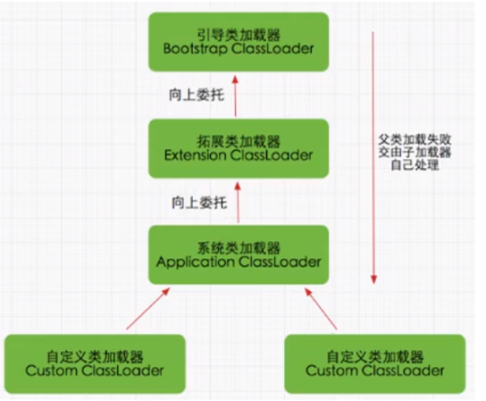
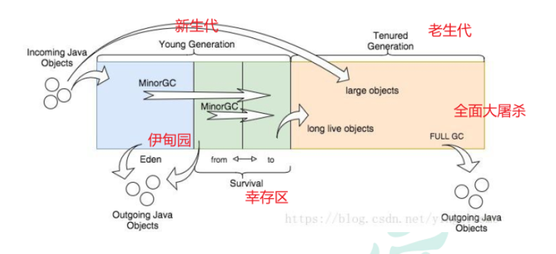

## JVM

### 一、什么是JVM

JVM相较于系统虚拟机，其属于程序虚拟机，java技术的核心就是JVM，所有的java程序都运行在JVM内部，专门用于执行字节码（可能通过Scala编译过来，一般通过java编译过来的）文件，即是二进制字节码的运行环境，可以共享虚拟机带来的跨平台性（java跨平台，JVM不跨平台）、优秀的垃圾回收器、自动内存管理以及可靠的及时编译器。

### 二、JVM模型

**JVM由三部分组成：**类加载子系统、运行时数据区、执行引擎

- **类加载器：**（Java虚拟机对class文件采用的是按需加载的方式，也就是说当需要使用该类时才会将它的class文件加载到内存生成class对象）通过类加载机制加载类的class文件，如果该类是第一次加载，会执行加载、链接、初始化。只负责class文件的加载，至于是否可运行，则由执行引擎决定。通过ClassLoader加载xxx.class字节码后，将元数据信息放到方法区中（7永久代 8元空间），创建一个 `java.lang.Class` 对象，作为 `xxx` 类的运行时表示以及方法区这个类的各种数据的访问入口，然后可以通过调用xxx的getClassLoader获取其类加载器，并且可以通过其构造方法创建实例，实例可以通过getClass方法获取其类对象。

  加载过程是在类加载子系统完成的：加载 --> 链接（验证 --> 准备 --> 解析） --> 初始化

  > 具体看JVM学习中的二、类加载器

- **运行时数据区：**在程序运行时，存储程序的内容（例如字节码、对象、参数、返回值等）。运行时数据区包括本地方法栈、虚拟机栈、方法区、堆、程序计数器。只有方法区和堆是各线程共享的进程内存区域，其他运行区都是每个线程可以独立拥有的。

  - **本地方法栈：**存放本地方法调用过程中的栈帧。用于管理本地方法的调用，本地方法是C语言写的。不是所有虚拟机都支持本地方法栈，例如Hotspot虚拟机就是将本地方法栈和虚拟机栈合二为一。栈解决程序的运行问题，即程序如何执行、如何处理数据。

    **栈帧：**栈帧是栈的元素，由三部分组成，即局部变量表（存方法参数和局部变量）、操作数栈（存方法执行过程中的中间结果，或者其他暂存数据）和帧数据区（存方法返回地址、线程引用等附加信息）。

  - **虚拟机栈：**存放Java方法调用过程中的栈帧。用于管理Java方法的调用，Java方法是开发时写的Java方法。

  - **方法区：**可以看作是一块独立于Java堆的内存空间，方法区是各线程共享的内存区域。方法区和永久代、元空间的关系：方法区是一个抽象概念，永久代和元空间是方法区的实现方式。

    - 永久代：属于JVM方法区的内存，用来存储类的元数据，如类名、方法信息、字段信息等一些静态的数据。JDK7及之前方法区也叫永久代。缺点是内存大小固定，容易出现oom问题。可以通过-XX:PermSize设置永久代大小。永久代对象只能通过Major GC（又称Full GC）进行垃圾回收。
    - 元空间：是Hotspot在JDK8引入的，用于取代永久代。元空间属于本地内存，由操作系统直接管理，不再受JVM管理。同时内存空间可以自动扩容，避免内存溢出。默认情况下元空间可以无限使用本地内存，可以通过-XX:MetaspaceSize限制内存大小。

  - 常量池：就是一张表，JVM根据这张常量表找到要执行的类信息和方法信息

    - 类常量池：是.class字节码文件中的资源仓库，主要存放字面量（表示字符串值和数值，例如字符串值"abc"、final常量、静态变量）和符号引用（类和接口的全限定名、字段名、方法名）。
    - 运行时常量池：类加载的“加载”阶段会创建运行时常量池，统一存放各个类常量池去重后的符号引用。在类加载的“解析”阶段JVM会把运行时常量池的这些符号引用转为直接引用。类常量池。类常量池在字节码文件中的，运行时常量池在内存中。
    - 字符串常量池：专门针对String类型设计的常量池。是当前应用程序里所有线程共享的，每个jvm只有一个字符串常量池。存储字符串对象的引用。在创建String对象时，JVM会先在字符串常量池寻找是否已存在相同字符串的引用，如果有的话就直接返回引用，没的话就在堆中创建一个对象，然后常量池保存这个引用并返回引用。

  - 堆：存放对象实例、实例变量、数组，包括新生代（伊甸园区、幸存区S0和S1）和老年代。堆是垃圾收集器管理的内存区域。堆解决的是数据存储的问题，即数据怎么放、放在哪儿。堆实际内存空间可以不连续，大小可以选择固定大小或可扩展，堆是各线程共享的内存区域。

  - 程序计数器（PC寄存器）：存放下一条字节码指令的地址，由执行引擎读取下一条字节码指令并转为本地机器指令进行执行。是程序控制流（分支、循环、跳转、线程恢复）的指示器，只有它不会抛出OutOfMemoryError。每个线程有自己独立的程序计数器，以便于线程在切换回来时能知道下一条指令是什么。程序计数器生命周期与线程一致。

- **执行引擎**：将字节码指令解释/编译为对应平台上的本地机器指令。充当了将高级语言翻译为机器语言的译者。执行引擎在执行过程中需要执行什么样的字节码指令依赖于PC寄存器。每当执行完一项指令操作后，PC寄存器就会更新下一条需要被执行的指令地址。
  - **字节码指令（JVM指令）：**字节码文件中的指令，内部只包含一些能够被JVM所识别的字节码指令、符号表，以及其他辅助信息，不能够直接运行在操作系统之上。
  - **本地机器指令：**可以直接运行在操作系统之上。

### 三、双亲委派机制

如果一个类加载器收到了类加载请求，它并不会自己先去加载，而是把这个请求委托给父类的加载器去执行，如果父类加载器还存在其父类加载器，则进一步向上委托，依次递归，请求最终将到达顶层的启动类加载器，如果父类加载器可以完成类加载任务，就成功返回，倘若父类加载器无法完成此加载任务，子加载器才会尝试自己去加载，这就是双亲委派模式。

优点：

- 避免类的重复加载
- 保护线程安全，防止核心API被随意篡改

判断jvm两个class对象是否为同一个类存在的两个必要条件：

- 类的完整名称必须一致，包括包名

- 加载这个类的类加载器（ClassLoader，指ClassLoader实例对象）必须相同

### 四、对象实例化过程

- 判断对应的类是否加载过，没有加载，先获取其class字节码，然后将其类元数据放到方法区，然后创建class对象，作为类中各个数据的访问入口

- 创建对象，分配堆内存空间（根据内存算法）

  > 在 JVM 的堆内存分配中，内存管理算法的选择直接影响对象分配的效率和内存碎片问题。以下是 **标记-整理**、**标记-清除** 和 **标记-复制** 三种核心算法的详细解析，结合它们在新生代（Young Generation）和老年代（Old Generation）中的应用场景:
  >
  > - 标记-整理（Mark-Compact）
  >
  > 

- 执行构造器方法

### 五、JVM调优经验

一般通过Visual VM打印GC日志，通过JDK自带的命令行调优工具 jstat查看进程的JVM统计信息（堆分配大小，YGC\FGC次数和时长）。

问到比例：默认情况，伊甸园区:S0:S1=8:1:1，新生代:老年代=1:2。

一天早上然后就发现服务器突然OOM了，堆空间溢出.没有做幂等控制地调用附件转pdf（中间件实现），导致 **重复生成PDF文件**，大量对象堆积在老年代，最终触发 `java.lang.OutOfMemoryError: Java heap space`，老年代内存不足，且 Full GC 无法回收这些对象（因为它们被强引用持有），发生OOM。

解决方案：对接口进行幂等控制，提高堆空间中老年代的大小

还有那种GC频率调优、CPU调优……没试过。

### 六、JVM中一次完整的GC流程

首先，任何新对象都分配到 eden 空间。两个幸存者空间开始时都是空的。
当 eden 空间填满时，将触发一个Minor GC(年轻代的垃圾回收，也称为Young GC)，删除所有未引用的对象，大对象（需要大量连续内存空间的Java对象，如那种很长的字符串）直接进入老年代。
所有被引用的对象作为存活对象，将移动到第一个幸存者空间S0，并标记年龄为1，即经历过一次Minor GC。之后每经过一次Minor GC，年龄+1。GC分代年龄存储在对象头的Mark Word里。
当 eden 空间再次被填满时，会执行第二次Minor GC，将Eden和S0区中所有垃圾对象清除，并将存活对象复制到S1并年龄加1，此时S0变为空。
如此反复在S0和S1之间切换几次之后，还存活的年龄等于15的对象（JDK8默认15，JDK9默认7，-XX:InitialTenuringThreshold=7）在下一次Minor GC时将放到老年代中。 
如果老年代内存不足够存储新对象，则会执行Full GC（清空整个新生代和老年代）。
当老年代满了时会触发Full GC或者Major GC（老年代的垃圾回收，清理整个老年代空间）。具体是Full GC还是Major GC取决于用哪个垃圾回收器，传统垃圾回收器会Full GC，G1（优先使用Mixed GC，清空部分新生代和老年代）、ZGC（直接抛出内存溢出错误）等现代回收器会避免Full GC。

### 七、GC的可达性算法分析

以根对象集合(GC Roots)的每个跟对象为起始点，根据引用关系向下搜索，将所有与GC Roots直接或间接有引用关系的对象在对象头的Mark Word里标记为可达对象，即不需要回收的有引用关系对象。搜索过程所走过的路径称为“引用链” 。

GC Roots：即GC根节点集合，是一组**必须活跃的引用**。可作为GC Roots的对象：

- 栈引用的对象：Java方法栈、本地方法栈中的参数引用、局部变量引用、临时变量引用等。临时变量是方法里的中间操作结果。

- 方法区中常量、静态变量引用的对象；
- 所有被同步锁持有的对象；
- 所有线程对象；
- 所有跨代引用对象；
- JVM内部的引用：如基本数据类型对应的Class对象，常驻的异常对象，以及应用程序类类加载器； 

看有覆盖finalize方法并且JVM没有调用过finalize方法，那么需要JVM去调用一下finalize方法，否则就可以真的被回收了。

finalize方法就是将当前对象this绑定到引用链上，即实现自救。