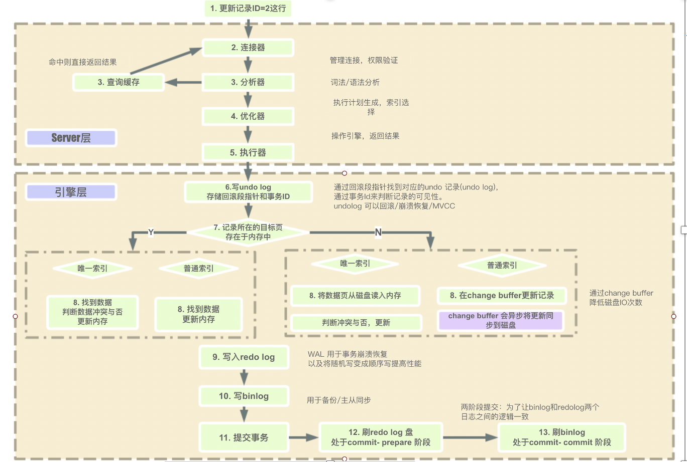
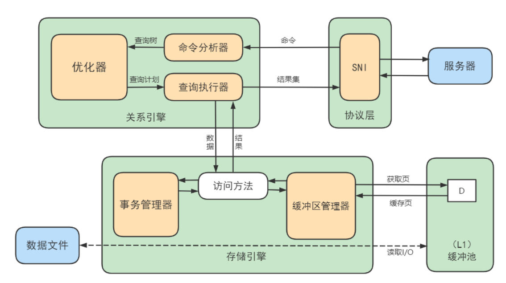

# MYSQL架构、执行过程和顺序

## 一、前言

### 1.1、说明

就MySQL的架构，以及执行过程、sql执行顺序，以及一些相关学习分享内容。

在参考文章的基础上，会增加自己的理解、看法，希望本文章能够在您的学习中提供帮助。

如有错误的地方，欢迎指出纠错，互相学习，共同进步。

### 1.2、参考文章&视频

十分感谢文章在学习过程中提供的帮助

**article：**

- https://www.cnblogs.com/wyq178/p/11576065.html

- https://juejin.cn/post/7002604517913001997

- https://blog.csdn.net/qq_48157004/article/details/128590851

- https://cloud.tencent.com/developer/article/1882003

- https://cloud.tencent.com/developer/article/1115019

- https://www.cnblogs.com/ydyxcode/p/17918605.html

- [jdbc](https://www.cnblogs.com/ydyxcode/p/17918605.html)

**vedio：**

- 尚硅谷-MySQL数据库入门到大牛，mysql安装到优化，百科全书级，全网天花板：p109


## 二、MySQL逻辑结构

### 2.1、MySQL数据库架构主要层次

MySQL采用客户端-服务端（CS）架构，结构可以分为如下层

- 客户端（Connectors）：用户与数据库进行交互的部分，可以是命令行工具、图形用户界面（GUI）工具或应用程序。客户端通过网络与服务器通信，发送SQL查询并接收结果。

  

  JDBC（Java DataBase Connectivity）是一种用于执行SQL语句的 Java API，是Java和数据库之间的一个桥梁，是一个规范而不是一个实现，能够交给数据库执行SQL语句。具体的实现通常由不同的数据库厂商提供，每个厂商会根据JDBC规范实现自己的驱动程序。常见的JDBC驱动实现包括：

  1. **Oracle JDBC Driver**：用于连接Oracle数据库的驱动程序。
  2. **MySQL Connector/J**：MySQL数据库的官方JDBC驱动。
  3. **PostgreSQL JDBC Driver**：用于连接PostgreSQL数据库的驱动。
  4. **Microsoft JDBC Driver for SQL Server**：用于连接SQL Server的驱动。

  相关jdbc内容参考[文章](https://www.cnblogs.com/ydyxcode/p/17918605.html)

- 服务端：MySQL服务器负责处理客户端请求，执行SQL语句，并返回结果。它包括多个模块，如解析器、优化器、执行引擎等。

  - 连接层：系统（客户端）访问MySQL服务器前，做的第一件事就是建立TCP连接。经过三次握手建立连接成功后，MySQL服务器对TCP传输过来的账号密码做身份认证、权限获取。
  - 服务层：接收用户的SQL命令、解析器中对 SQL 语句进行语法分析、语义分析，以及SQL优化等。
  - 引擎层：属于MySQL服务端的组成部分。位于服务端的架构中，负责实际的数据存储、读取和管理。每个存储引擎具有不同的功能和特性，例如事务支持、表锁或行锁、外键支持等。MySQL支持多种存储引擎（如InnoDB、MyISAM等），每种存储引擎有不同的特性和性能表现。选择合适的存储引擎可以根据应用需求来优化性能和功能。

- 存储层：所有的数据，数据库、表的定义，表的每一行的内容，索引，都是存在文件系统上，以文件的方式存

  在的，并完成与存储引擎的交互。当然有些存储引擎比如InnoDB，也支持不使用文件系统直接管理裸设
  备，但现代文件系统的实现使得这样做没有必要了。在文件系统之下，可以使用本地磁盘，可以使用
  DAS、NAS、SAN等各种存储系统。

### 2.2、MySQL数据库架构图

架构图（具体详情分析可见2.3部分）：


架构图2


对存储引擎描述比较详细的一张架构图（可用于参考，本文章的侧重点不在存储引擎，不同的存储引擎内部实现不同）



比较官方的一张架构图


**内容详解：**

- Connetors：用于连接和与MySQL数据库进行交互的驱动程序或库（由MySQL官方开发和维护），是MySQL服务器之外的客户端程序，与具体语言相关
- Connection Pool：连接池，提供多个客户端与服务器端交互的线程
- Management Services & Utilitiees：基础服务组件
- SQL Interface：SQL接口，接受SQL指令，返回查询结果
- Parser：解析器，用于语法解析，语义解析，生成语法树
- Optimizer：优化器,核心组件，对SQL进行优化
- Caches & Buffers：查询缓存，以key-value的方式缓存查询结果（mysql8.0移除）
- Pluggable Storage Engines：插件式存储引擎，与底层的文件系统进行交互
- File system：文件系统
- Files & Logs：日志文件

**执行顺序：**

- 客户端需要查询一条数据

- 客户端通过Connetors向客户端发起链接
- 服务端通过Connection pool接受链接，并分配一个线程用于执行后续内容
- SQL Interface
- Caches & Buffers（5.7）：查询缓存
- Parser
- Optimizer
- Pluggable Storage Engines
- File system：需要从磁盘中加载到内存中，进行处理
- Caches & Buffers（5.7）：缓存查询结果

**各层内容：**

- 客户端：Connetors
- 连接层：Connection Pool
- 服务层：SQL Interface、Parser、Optimizer、Caches & Buffers
- 引擎层：Pluggable Storage Engines
- 存储层：File system


### 2.3、架构剖析

#### 1. Connetors

用于连接和与MySQL数据库进行交互的驱动程序或库（由MySQL官方开发和维护），是MySQL服务器之外的客户端程序，与具体语言相关

#### 2. 连接层

系统（客户端）访问MySQL服务器前，做的第一件事就是建立TCP连接。

- 建立和维护连接

连接器负责与客户端的通信，其使用的是半双工模式（一种通信方式，其中通信双方可以交替地发送和接收数据，但不能同时进行发送和接收）。首先是与访问的客户端建立TCP连接，服务器有专门的`TCP`连接池，采用长连接模式复用`TCP`连接，经过三次握手建立连接成功后，之后会对TCP传输过来的账号密码做身份认证、权限获取。在服务器内部，每个client连接都有自己的线程，即TCP连接都会分配给一个线程去执行后续的流程。这些线程轮流运行在某一个CPU内核(多核CPU)或者CPU中，缓存了线程（线程池），因此不需要为每个client连接单独创建和销毁线程 ，省去了创建和销毁线程的开销。 

- 认证和权限获取

完成与访问客户端的TCP连接后，会对TCP传递过来的账号密码进行身份认证。

如果账户和密码错误，会报错`Access denied for user 'root'@'localhost' (using password: YES)`，客户端程序结束执行

如果用户的账户和密码验证通过，会在MySQL自带的权限表中查询当前用户的权限（管理员可以通过GRANT和REVOKE语句来修改用户的权限），MySQL中存在4个控制权限的表，分别为user表，db表，tables_priv表，columns_priv表：

1. user表：存放用户账户信息以及全局级别（所有数据库）权限，决定了来自哪些主机的哪些用户可以访问数据库实例

2. db表：存放数据库级别的权限，决定了来自哪些主机的哪些用户可以访问此数据库
3. tables_priv表：存放表级别的权限，决定了来自哪些主机的哪些用户可以访问数据库的这个表
4. columns_priv表：存放列级别的权限，决定了来自哪些主机的哪些用户可以访问数据库表的这个字段

验证授权过程（MySQL会在用户进行操作时，动态地检查其权限信息，以决定是否允许该操作）如下所示：

1. 先从user表中的Host，User，Password这3个字段中判断连接的IP、用户名、密码是否存在，存在则通过验证。
2. 通过身份认证后，进行权限分配，按照user，db，tables_priv，columns_priv的顺序进行验证。即先检查全局权限表user，如果user中对应的权限为Y，则此用户对所有数据库的权限都为Y，将不再检查db，tables_priv，columns_priv；如果为N，则到db表中检查此用户对应的具体数据库，并得到db中为Y的权限；如果db中为N，则检查tables_priv中此数据库对应的具体表，取得表中的权限Y，以此类推。
3. 如果在任何一个过程中权限验证不通过，都会返回相应的错误。

并且MySQL支持多种身份认证方式，包括基于密码的认证、SSL/TLS证书认证等，其中，最常用的是基于密码的认证方式。

#### 3. 服务层

- SQL Interface: SQL接口

  - 接收用户的SQL命令，并且返回用户需要查询的结果。比如SELECT ... FROM就是调用SQL
    Interface
  - MySQL支持DML（数据操作语言）、DDL（数据定义语言）、存储过程、视图、触发器、自定
    义函数等多种SQL语言接口

- Parser: 解析器

  - 在解析器中对 SQL 语句进行语法分析、语义分析。将SQL语句分解成数据结构，并将这个结构
    传递到后续步骤，以后SQL语句的传递和处理就是基于这个结构的。如果在分解构成中遇到错
    误，那么就说明这个SQL语句是不合理的。
  - 在SQL命令传递到解析器的时候会被解析器验证和解析，并为其创建语法树，并根据数据字
    典丰富查询语法树，会验证该客户端是否具有执行该查询的权限。创建好语法树后，MySQL还
    会对SQl查询进行语法上的优化，进行查询重写。

- Optimizer: 查询优化器

  - SQL语句在语法解析之后、查询之前会使用查询优化器确定 SQL 语句的执行路径，生成一个执行计划。

  - 这个执行计划表明应该**使用哪些索引**进行查询（全表检索还是使用索引检索），表之间的连接顺序如何，最后会按照执行计划中的步骤调用存储引擎提供的方法来真正的执行查询，并将查询结果返回给用户。

  - 它使用“选取-投影-连接”策略进行查询。例如：

    ```sql
    SELECT id,name FROM student where gender = '女'
    ```

    这个SELECT查询先根据WHERE语句进行选取，而不是将表全部查询出来以后再进行gender过
    滤。 这个SELECT查询先根据id和name进行属性投影，而不是将属性全部取出以后再进行过
    滤，将这两个查询条件连接起来生成最终查询结果。

- Caches & Buffers： 查询缓存组件

  - MySQL内部维持着一些Cache和Buffer，比如Query Cache用来缓存一条SELECT语句的执行结果，如果能够在其中找到对应的查询结果，那么就不必再进行查询解析、优化和执行的整个过程了，直接将结果反馈给客户端。

  - 这个缓存机制是由一系列小缓存组成的。比如表缓存，记录缓存，key缓存，权限缓存等 。

  - 这个查询缓存可以在不同客户端之间共享。

  - 从MySQL 5.7.20开始，不推荐使用查询缓存，并在MySQL 8.0中删除。

#### 4. 引擎层

插件式存储引擎层（ Storage Engines）， 真正的负责了MySQL中数据的存储和提取，对物理服务器级别
维护的底层数据执行操作 ，服务器通过API与存储引擎进行通信。不同的存储引擎具有的功能不同，这样
我们可以根据自己的实际需要进行选取。

MySQL 8.0.25默认支持的存储引擎可以通过命令show engines查看，具体如下：


#### 5. 存储层

所有的数据，数据库、表的定义，表的每一行的内容，索引，都是存在文件系统上，以文件的方式存在的，并完成与存储引擎的交互。当然有些存储引擎比如InnoDB，也支持不使用文件系统直接管理裸设备，但现代文件系统的实现使得这样做没有必要了。在文件系统之下，可以使用本地磁盘，可以使用DAS、NAS、SAN等各种存储系统。


### 2.4、其他说明

#### 1. 缓存

缓存主要是针对MySQL的查询语句进行的，如果是查询语句，MySQL服务器会将查询字符串作为key，查询结果作为value缓存到内存中。经过连接器，此时MySQL服务器已经获得到了SQL字符串，如果是查询语句，服务器会使用该查询字符串作为key，去缓存中获取，如果命中缓存，直接返回结果（返回前需要做权限的验证），未命中则执行后面的逻辑。并且，在匹配的缓存的过程中，查询字符串需要完全与key匹配才算命中（即空格、注释、大小写、某些系统函数）。当所取的数据的基表发生任何数据变化后，MySQL服务器会自动使对应的缓存失效。在读写比例非常高的应用系统中， 缓存对性能的提高是非常显著的。当然它对内存的消耗也是非常大的。从MySQL 5.6的版本中已经默认关闭，5.7.20开始，不推荐使用查询缓存，并在MySQL 8.0中删除。

#### 2. 分析器

因为客户端发送过来的只是一段文本字符串，因此MySQL服务器还需要对该文本字符串进行解析，这个解析过程就是在分析器中完成的。分析器对客户端发过来的SQL语句进行分析，包括预处理与解析过程，在这个阶段会解析SQL语句的语义，并进行关键词和非关键词进行提取、解析，并创建一个内部数据结果（解析树）。具体的关键词包括不限定于以下：`select/update/delete/or/in/where/group by/having/count/limit`等。如果分析到语法错误，会直接给客户端抛出异常：`ERROR:You have an error in your SQL syntax.`。除了提取关键词外，还会对其中的表进行校验，如果不存在该表，同样也会报错：`unknown column in field list.`。通过了分析器，那么就说明客户端发送过来的文本字符串是符合SQL标准语义规则，之后MySQL服务器就要开始执行SQL语句了。

#### 3. 优化器

优化器不仅会生成SQL执行的计划，还会帮助优化SQL语句。如外连接转换为内连接、表达式简化、子查询转为连接、连接顺序、索引选择等一堆东西，优化的结果就是执行计划。MySQL会计算各个执行方法的最佳时间，最终确定一条执行的SQL交给最后的执行器。

#### 4. 执行器

开始执行SQL的时候，要先判断一下对这个表有没有相应的权限，如果没有，就会返回权限错误。如果权限校验通过后，会调用存储引擎的API，API会调用存储引擎(存储引擎`API`只是抽象接口，下面还有个存储引擎层，具体实现还是要看表选择的存储引擎)，主要有以下存储的引擎(常用的还是myisam和innodb)：

| 存储引擎 | myisam | innodb | memory | archive |
| :------: | :----: | :----: | :----: | :-----: |
| 存储限制 | 256TB  |  64TB  |   有   |   无    |
|   事务   |   /    |  支持  |   /    |    /    |
|   索引   |  支持  |  支持  |  支持  |    /    |
| 锁的粒度 |  表锁  |  行锁  |  表锁  |  行锁   |
| 数据压缩 |  支持  |   /    |   /    |  支持   |
|   外键   |   /    |  支持  |   /    |    /    |

存储引擎，之前又叫表处理器，负责对具体的数据文件进行操作，对SQL的语义比如select或者update进行分析，执行具体的操作。在执行完以后会将具体的操作记录到binlog中，需要注意的一点是：select不会记录到binlog中，只有update/delete/insert才会记录到binlog中。而update会采用两阶段提交的方式，记录都redolog中。

关于binlog和redolog两个日志的说明：

binlog：

- **作用**：Binlog记录了对MySQL数据库进行的所有更改操作，例如INSERT、UPDATE、DELETE等，以二进制格式记录在磁盘上。
- **功能**：主要用于数据恢复、数据复制和数据迁移。通过分析Binlog，可以重放数据库中的更改操作，从而实现数据的恢复或者将更改操作应用到其他MySQL实例上。
- **使用场景**：常用于数据库备份、故障恢复、数据同步等场景。

redolog:

- **作用**：Redo Log记录了数据库引擎执行的每个事务的修改操作，以便在数据库发生崩溃时，可以通过重放Redo Log来恢复事务的更改。
- **功能**：主要用于保证数据库的持久性和事务的原子性，即使在发生故障时也能确保事务的完整性。
- **使用场景**：主要用于崩溃恢复和事务回滚。


### 2.5 总结

MySQL架构可以简化为三层结构：

- 连接层：客户端和服务器端建立连接，客户端发送 SQL 至服务器端；
- SQL 层（服务层）：对 SQL 语句进行查询处理；与数据库文件的存储方式无关；
- 存储引擎层：与数据库文件打交道，负责数据的存储和读取。


## 三、MySQL执行流程

### 3.1 执行流程图解


### 3.2 执行流程

#### 1. 查询缓存

Server 如果在查询缓存中发现了这条 SQL 语句（缓存以key-value的形式存储，key去进行匹配），就会直接将结果返回给客户端；如果没有，就进入到解析器阶段。需要说明的是，因为查询缓存往往效率不高，所以在 MySQL8.0 之后就抛弃了这个功能。

> 查询缓存往往效率不高的原因？
>
> MySQL 中的查询缓存，不是缓存查询计划，而是查询对应的结果。这就意味着查询匹配的鲁棒性大大降
> 低，只有相同的查询操作才会命中查询缓存。两个查询请求在任何字符上的不同（例如：空格、注释、
> 大小写），都会导致缓存不会命中。因此 MySQL 的查询缓存命中率不高。
>
> 同时，如果查询请求中包含某些系统函数、用户自定义变量和函数、一些系统表，如 mysql 、
> information_schema、 performance_schema 数据库中的表，那这个请求就不会被缓存。以某些系统函数
> 举例，可能同样的函数的两次调用会产生不一样的结果，比如函数NOW，每次调用都会产生最新的当前
> 时间，如果在一个查询请求中调用了这个函数，那即使查询请求的文本信息都一样，那不同时间的两次
> 查询也应该得到不同的结果，如果在第一次查询时就缓存了，那第二次查询的时候直接使用第一次查询
> 的结果就是错误的！
>
> 此外，既然是缓存，那就有它缓存失效的时候。MySQL的缓存系统会监测涉及到的每张表，只要该表的
> 结构或者数据被修改，如对该表使用了INSERT、 UPDATE、DELETE、TRUNCATE TABLE、ALTER
> TABLE、DROP TABLE或 DROP DATABASE语句，那使用该表的所有高速缓存查询都将变为无效并从高
> 速缓存中删除！对于更新压力大的数据库来说，查询缓存的命中率会非常低。
>
> 总结：
>
> 1、查询缓存的是查询语句，对于空格、不同的字符都会出现匹配不到的情况
>
> 2、对于函数、自定义变量、函数，系统表不会缓存。（不确定性）
>
> 3、对于需要频繁更新的表，缓存的意义不大


一般建议在静态表（一般极少更新的表）里使用查询缓存（原因是3，不需要频繁更新表）如一个系统配置表、字典表，这张表上的查询才适合使用查询缓存。Mysql也提供了这种按需使用的方式，可以就爱那个my.cnf配置文件中query_cache_type设置为DEMAND，代表当sql语句中有SQL_CACHE关键词时才缓存，如

```mysql
# query_cache_type 0关闭查询缓存 1开启查询缓存 2DEMAND
query_cache_type=2
```

对于3的情况，默认的SQL都不适用查询缓存，如果需要使用查询缓存的雨具，可以使用SQL_CACHE指定，如下所示

```mysql
select SQL_CACHE * from test where ID = 5
```

我们可以在mysql中通过命令`show variables like '%query_cache_type'`查看是否开启查询缓存


如果是版本8的话，会显示Empty set，查看mysql的版本命令是`SELECT VERSION();`

可以通过命令`show status like '%Qcache%'`查看缓存的命中率


#### 2、解析器

在解析器中对 SQL 语句进行语法分析、语义分析。


分析器先进行“词法分析”。你输入的是由多个字符串和空格组成的一条 SQL 语句，MySQL 需要识别出里面
的字符串分别是什么，代表什么。 MySQL 从你输入的"select"这个关键字识别出来，这是一个查询语
句。它也要把字符串“T”识别成“表名 T”，把字符串“ID”识别成“列 ID”。

接着，要做“语法分析”。根据词法分析的结果，语法分析器（比如：Bison）会根据语法规则，判断你输
入的这个 SQL 语句是否满足 MySQL 语法。

```mysql
select department_id, job_id, avg(salary) from employees group by department_id;
```

如果SQL语句正确，会生成一个这样的语法树


具体的分析流程如下所示


#### 4、优化器

在优化器中会确定SQL语句的执行路径，比如是根据全表检索，还是根据索引检索等。

经过了解析器，MySQL就知道要做什么了，但是在开始执行前，还要先经过优化器的处理，一条查询可以有很多种执行的方式，最后都返回相同的结果。优化器的作用就是找到其中最优的执行结果。

  

比如，优化器是在表里面有很多索引的时候，决定使用哪个索引；或者在一个语句有很多关联表（join）的时候觉得各个表的连接顺序，还有表达式的简化，子查询转为连接、外连接转为内连接等。

举例：如下语句是执行两个表的join：

```mysql
select * from test1 join test2 using(ID)
where test1.name='zhangwei' and test2.name='mysql高级课程';
```

方案 1 ：可以先从表 test 1 里面取出 name='zhangwei'的记录的 ID 值，再根据 ID 值关联到表 test 2 ，再判
断 test 2 里面 name的值是否等于 'mysql高级课程'。
方案 2 ：可以先从表 test 2 里面取出 name='mysql高级课程' 的记录的 ID 值，再根据 ID 值关联到 test 1 ，
再判断 test 1 里面 name的值是否等于 zhangwei。

这两种执行方法的逻辑结果是一样的，但是执行的效率会有不同，而优化器的作用就是决定选择使用哪一个方案。优化器阶段完成后，这个语句的执行方案就确定下来了，然后进入执行器阶段。

在查询优化器中，可以分为 逻辑查询 优化阶段和 物理查询 优化阶段。

- 逻辑查询优化就是通过改变 SQL 语句的内容来使得 SQL查询更高效，同时为物理查询优化提供更多的候选执行计划。通常采用的方式是对 SQL 语句进行 等价变换，对查询进行重写，而查询重写的数学基础就是关系代数。对条件表达式进行等价谓词重写、条件简化，对视图进行重写，对子查询进行优化，对连接语义进行了外连接消除、嵌套连接消除等。（如子查询改为多表连接）
- 物理查询优化是基于关系代数进行的査询重写，而关系代数的每一步都对应着物理计算，这些物理计算往往存在多种算法，因此需要计算各种物理路径的代价，从中选择代价最小的作为执行计划。在这个阶段里，对于单表和多表连接的操作，需要高效地 使用索引，提升查询效率。（即通过索引和表连接等技术进行优化）


#### 5、执行器

截止到现在，还没有真正去读写真实的表，仅仅只是产出了一个执行计划。于是就进入了 执行器阶段 。


在执行之前需要判断该用户是否 具备权限 。如果没有，就会返回权限错误。如果具备权限，就执行 SQL

查询并返回结果。在 MySQL8.0 以下的版本，如果设置了查询缓存，这时会将查询结果进行缓存。

```mysql
select * from test where id = 1
```

如果有权限，就打开表继续执行。打开表的时候，执行器就会根据表的引擎定义，调用存储引擎 API 对表进行的读写。存储引擎 API 只是抽象接口，下面还有个存储引擎层，具体实现还是要看表选择的存储引擎。


比如：表 test 中，ID 字段没有索引，那么执行器的执行流程是这样的：

调用 InnoDB 引擎接口取这个表的第一行，判断 ID 值是不是1，如果不是则跳过，如果是则将这行存在结果集中；

调用引擎接口取“下一行”，重复相同的判断逻辑，直到取到这个表的最后一行。

执行器将上述遍历过程中所有满足条件的行组成的记录集作为结果集返回给客户端。

至此，这个语句就执行完成了。对于有索引的表，执行的逻辑也差不多。

SQL 语句在 MySQL 中的流程是： SQL语句→查询缓存→解析器→优化器→执行器 。


## 四、存储引擎

### 4.1 基本操作

##### 1. 查看存储引擎

通过命令`show engines`查看mysql支持的存储引擎


各列含义：

- **Engine**: 存储引擎的名称，例如 InnoDB、MyISAM 等。
- **Support**: 显示存储引擎的支持状态，可以是以下几种：
  - **YES**: 表示该存储引擎被支持并可以使用。
  - **NO**: 表示该存储引擎不被支持。
  - **DEFAULT**: 表示该存储引擎是默认的存储引擎。
  - **DISABLED**: 表示该存储引擎被禁用。
- **Comment**: 对存储引擎的简要描述，提供有关其功能和特性的额外信息。
- **Transactions**: 指示该存储引擎是否支持事务处理，通常会显示 "YES" 或 "NO"。
- **XA**: 指示是否支持 XA 事务（分布式事务），通常会显示 "YES" 或 "NO"。
- **Savepoints**: 指示是否支持保存点，通常会显示 "YES" 或 "NO"。


##### 2.设置系统默认的存储引擎

查看默认的存储引擎

```mysql
show variables like '%storage_engine%';
#或
SELECT @@default_storage_engine;
```


修改默认的存储引擎（默认使用 InnoDB 作为表的存储引擎）

如果我们想改变表的默认存储引擎的话，如意使用如下命令：

```mysql
SET DEFAULT_STORAGE_ENGINE=MyISAM;
```

或者直接修改mysql的配置文件my.cnf文件

```
default-storage-engine=MyISAM
```

记得通过命令`systemctl restart mysqld.service`重启服务使其生效。


##### 3.设置表的存储引擎

存储引擎是正对于表来说的，对表中的数据进行读写操作，因此可以为不同的表设置不同的存储引擎，即不同的表可以有不同的物理存储结构，不同的提取和写入方式。

- 创建表时指定存储引擎

  显示的指定表的存储结构（默认的存储引擎为InnoDB），可以使用如下DDL（Data Definition Language）

  ```mysql
  CREATE TABLE 表名(
  	// 建表语句;
  ) ENGINE = 存储引擎名称;
  ```

- 修改表的存储引擎

  ```mysql
  ALTER TABLE 表名 ENGINE = 存储引擎名称;
  ```

  

### 4.2 主要引擎介绍

主要使用的存储引擎有InnoDB和MyISAM两个引擎。

**InnoDB（优先，默认考虑）**

- MySQL从3.23.34a开始就包含InnoDB存储引擎。 大于等于5.5之后，默认采用InnoDB引擎 

- InnoDB是MySQL的 默认事务型引擎 ，它被设计用来处理大量的短期(short-lived)事务。可以确保事务

  的完整提交(Commit)和回滚(Rollback)

- 除了增加和查询外，还需要更新、删除操作，那么，应优先选择InnoDB存储引擎

  - 更新、删除修改操作有事务支持，支持ACID特性，保证数据的一致性和完整性 
  - InnoDB使用行级锁，可以让更多的事务进行更新操作，提高并发能力，而MyISAM使用的是表锁。

- 数据文件结构：

  - 表名.frm 存储表结构（MySQL8.0时，合并在表名.ibd中）
  - 表名.ibd 存储数据和索引

- InnoDB是 为处理巨大数据量的最大性能设计 

- 对比MyISAM的存储引擎， InnoDB写的处理效率差一些 ，并且会占用更多的磁盘空间以保存数据和

  索引。

- MyISAM只缓存索引，不缓存真实数据（非聚集索引）；InnoDB不仅缓存索引还要缓存真实数据（聚集索引）， 对内存要求较

  高 ，而且内存大小对性能有决定性的影响。


**MyISAM**（**主要的非事务处理存储引擎**）

- MyISAM提供了大量的特性，包括全文索引、压缩、空间函数(GIS)等，但MyISAM 不支持事务、行级锁、外键 ，有一个毫无疑问的缺陷就是 崩溃后无法安全恢复
- 5.5之前默认的存储引擎
- 优势是访问的 速度快 ，对事务完整性没有要求或者以SELECT、INSERT为主的应用
- 针对数据统计有额外的常数存储。故而 count(*) 的查询效率很高，即有个变量专门记录表中的数据量
- 数据文件结构：
  - 表名.frm 存储表结构
  - 表名.MYD 存储数据 (MYData)
  - 表名.MYI 存储索引 (MYIndex)
- 应用场景：只读应用或者以读为主的业务


### 4.3 其他引擎

除了InnoDB和MyISAM存储引擎以外，还有一些其他的存储引擎，感兴趣的可以自行了解学习。

- Archive 引擎
- Blackhole 引擎
- CSV 引擎
- Memory 引擎
-  Merge引擎
- Federated引擎
- NDB引擎


## 五、扩展

### 5.1 SQL语句执行顺序

SQL并不是按照我们的书写顺序来从前往后、左往右依次执行的，它是按照固定的顺序解析的，主要的作用就是从上一个阶段的执行返回结果来提供给下一阶段使用，SQL在执行的过程中会有不同的临时中间表，一般是按照如下顺序：

- from
- on
- join
- where
- goup by
- having + 聚合函数
- select
- order by
- limit

在MySQL中，查询语句中子查询的执行顺序可以根据具体情况而有所不同，但一般来说，以下是一个常见的执行顺序：

- 内部子查询：MySQL通常会首先执行子查询，生成临时结果集，然后将其用于外部查询。内部子查询是指嵌套在主查询中的子查询，通常作为主查询的一部分。
- 关联子查询：如果子查询是一个关联子查询（即与外部查询相关联），MySQL可能会根据优化器的策略选择在何处执行子查询。有时候，MySQL可能会将关联子查询转换为连接查询来提高性能。
- 外部查询：一旦子查询的结果可用，MySQL会将其与外部查询组合起来执行，产生最终的结果集。


### 5.2 数据库缓冲池（buffer pool）△看视频

#### 1.说明

具体的数据是存储在磁盘中的，如果直接读取磁盘中的数据，再由CPU去进行处理，结果肯定是很慢的，因此中间需要内存的介入，在mysql需要对数据进行处理的时候，先将磁盘中的数据加载到内存中，然后做一个缓存，从而提高相应的速度。其中内存级别的缓存就是数据库缓冲池。

InnoDB 存储引擎是以页为单位（一个数据页默认为16KB，数据加载的到时候都是以页为单位进行）来管理存储空间的，我们进行的增删改查操作其实本质上都是在访问页面（包括读页面、写页面、创建新页面等操作）。而磁盘 I/O 需要消耗的时间很多，而在内存中进行操作，效率则会高很多，为了能让数据表或者索引中的数据随时被我们所用，DBMS 会申请 占用内存来作为数据缓冲池 ，在真正访问页面之前，需要把在磁盘上的页缓存到内存中的 Buffer Pool 之后才可以访问。

这样做的好处是可以让磁盘活动最小化，从而 减少与磁盘直接进行 I/O 的时间（真正影响执行效率的点） 。要知道，这种策略对提升 SQL 语句的查询性能来说至关重要。如果索引的数据在缓冲池里，那么访问的成本就会降低很多。

#### 2. 缓冲池和查询缓存

缓冲池和查询缓存不是同一个东西

- 缓冲池

在 InnoDB 存储引擎中有一部分数据会放到内存中，缓冲池则占了这部分内存的大部分，它用来存储各种数据的缓存，到InnoDB 缓冲池包括了数据页、索引页、插入缓冲、锁信息、自适应 Hash 和数据字典

信息等。，如下图所示：


**缓存原则：**

“ 位置 * 频次 ”这个原则，可以帮我们对 I/O 访问效率进行优化。

首先，位置决定效率，提供缓冲池就是为了在内存中可以直接访问数据。

其次，频次决定优先级顺序。因为缓冲池的大小是有限的，比如磁盘有 200G，但是内存只有 16G，缓冲

池大小只有 1G，就无法将所有数据都加载到缓冲池里，这时就涉及到优先级顺序，会 优先对使用频次高

的热数据进行加载 。

**缓存池的预读原则**

了解了缓冲池的作用之后，我们还需要了解缓冲池的另一个特性:预读。

缓冲池的作用就是提升I/O效率，而我们进行读取数据的时候存在一个“局部性原理”，也就是说我们使

用了一些数据，大概率还会使用它周围的一些数据（如上下数据），因此采用“预读”的机制提前加载，目的同样也是提升效率，减少未来可能的磁盘I/О操作。


- 查询缓存

查询缓存是提前把 查询结果缓存 起来，这样下次不需要执行就可以直接拿到结果。需要说明的是，在

MySQL 中的查询缓存，不是缓存查询计划，而是查询对应的结果。因为命中条件苛刻，而且只要数据表

发生变化，查询缓存就会失效，因此命中率低。


#### 3.**缓冲池如何读取数据**

缓冲池管理器会尽量将经常使用的数据保存起来，在数据库进行页面读操作的时候，首先会判断该页面

是否在缓冲池中，如果存在就直接读取，如果不存在，就会通过内存或磁盘将页面存放到缓冲池中再进

行读取。

缓存在数据库中的结构和作用如下图所示：



在执行引擎调用存储引擎去获取数据的时候，首先将数据加载到内存中，然后将数据页在缓冲池中进行缓存，然后返回相应的数据。


#### 4.如果执行SQL语句的时候更新了缓存池中的数据，那么数据会马上同步都磁盘中吗

实际上，当我们对数据库中的记录进行修改的时候，首先会修改缓冲池中页里面的记录信息，然后数据库会 以一定的频率刷新 到磁盘上。注意并不是每次发生更新操作，都会立刻进行磁盘回写。缓冲池会采用一种叫做checkpoint的机制 将数据回写到磁盘上，这样做的好处就是提升了数据库的整体性能。
比如，当缓冲池不够用时，需要释放掉一些不常用的页，此时就可以强行采用 checkpoint的方式，将不常用的脏页回写到磁盘上，然后再从缓冲池中将这些页释放掉。这里脏页(diry page)指的是缓冲池中被修改过的页，与磁盘上的数据页不一致。


#### 5. 查看设置缓冲池的大小

如果你使用的是 InnoDB 存储引擎，可以通过查看 innodb_buffer_pool_size 变量来查看缓冲池的大

小。命令如下：

```
show variables like 'innodb_buffer_pool_size';
```

我们可以修改缓冲池大小，比如改为256MB，方法如下：

```
set global innodb_buffer_pool_size = 268435456;
```

或者直接在配置文件中进行修改

```
[server]
innodb_buffer_pool_size = 268435456
```


#### 6.多个Buffer Pool实例

Bufer Pool本质是InnoDB向操作系统申请的一块 连续的内存空间，在多线程环境下，访问Bufer Pool中的数据都需要 加锁 处理。在Bufer Pool特别大而且多线程并发访问特别高的情况下，单一的Bufer Pool可能会影响请求的处理速度。所以在Bufer oo!特别大的时候，我们可以把它们拆分成若干个小的Buffer Pool，每个Bufer Pool都称为一个 实例，它们都是独立的，独立的去申请内存空间，独立的管理各种链表。所以在多线程并发访问时并不会相互影响，从而提高并发处理能力。
我们可以在服务器启动的时候通过设置 innodb_buffer_pool_instances 的值来修改Buffer Pool实例的个数比方说这样:

```
[server]
innodb_buffer_pool_instances = 2
```

这样就表明我们要创建2个 Buffer Pool 实例。

通过命令`show variables like 'innodb_buffer_pool_instances';`查看缓冲池的个数

那每个 Buffer Pool 实例实际占多少内存空间呢？其实使用这个公式算出来的：

```
innodb_buffer_pool_size/innodb_buffer_pool_instances
```

是总共的大小除以实例的个数，结果就是每个 Buffer Pool 实例占用的大小

不过也不是说Buffer Pool实例创建的越多越好，分别管理各个Buffer Pool也是需要性能开销,InnoDB规定:当innodb_buffer_pool_size的值小于1G的时候设置多个实例是无效的，InnoDB会默认把innodb_buffer_pool_instances 的值修改为1。而我们鼓励在Buffer Pool大于或等于1G的时候设置多个Buffer Pool实例。


#### 7.引申


这个过程看似没啥问题，实则是有问题的。假设我们修改Buffer Pool中的数据成功，但是还没来得及

将数据刷入磁盘MySQL就挂了怎么办?按照上图的逻辑，此时更新之后的数据只存在于Buffer Pool

中，如果此时MySQL宕机了，这部分数据将会永久地丢失;

再者，我更新到一半突然发生错误了，想要回滚到更新之前的版本，该怎么办？连数据持久化的保证、

事务回滚都做不到还谈什么崩溃恢复？答案是可以通过Redo Log & Undo Log解决上面的问题
