##  虚拟机安装

### 一、具体安装过程

> 采用Vagrant完成虚拟机的快速安装
>
> 参考文章：https://blog.csdn.net/mr__bai/article/details/124472802

#### 1、安装虚拟机应用

个人推荐安装virtualBox（虽然 Vagrant 也支持 VMware，不过 VMware 是收费的，对应的 Vagrant 版本也是收费的）

> 关于VMware和virtualBox对比
>
> - VMware
>
> 优点：
>
> 1. 性能优越：VMware的虚拟化技术成熟，性能表现优秀，尤其适合运行资源密集型应用。
> 2. 功能全面：支持快照、克隆、虚拟网络配置等高级功能，适合企业级应用。
> 3. 兼容性好：支持多种操作系统，且与Windows、Linux、macOS等主流系统兼容性良好。
> 4. 技术支持：提供商业支持，适合企业用户。
>
> 缺点：
>
> 1. 费用较高：VMware Workstation Pro是付费软件，价格较贵。
> 2. 资源占用大：相比VirtualBox，VMware对系统资源的占用更多。
>
> - VirtualBox
>
> 优点：
>
> 1. 免费开源：VirtualBox完全免费，适合个人用户和小型企业。
> 2. 轻量级：资源占用较少，适合配置较低的机器。
> 3. 跨平台支持：支持Windows、Linux、macOS等多种操作系统。
> 4. 插件丰富：通过扩展包可以增加USB 2.0/3.0支持、虚拟磁盘加密等功能。
>
> 缺点：
>
> 1. 性能稍逊：在处理复杂任务时，性能不如VMware。
> 2. 功能有限：虽然基本功能齐全，但缺少一些高级功能，如企业级虚拟网络配置。
>
> - 总结
>
> - **VMware**：适合需要高性能和高级功能的用户，尤其是企业环境。
> - **VirtualBox**：适合预算有限或对性能要求不高的个人用户和小型企业。

具体安装virtualBox过程可参考：https://blog.csdn.net/GoodburghCottage/article/details/130307152

需要开启VirutalBox的CPU虚拟化具体参考文章：https://blog.csdn.net/m0_55096250/article/details/125654424

> 虚拟化可以在任务管理器中查看是否开启/关闭：
>
> 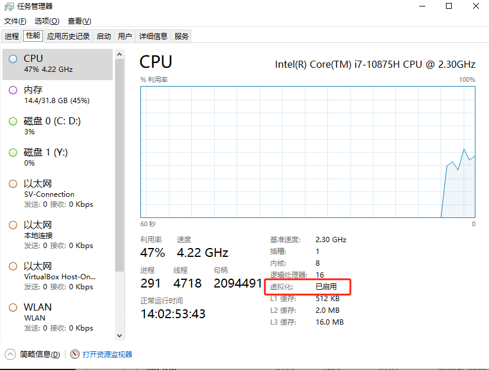
>
> 关于CPU虚拟化：
>
> CPU虚拟化是一种技术，允许在单个物理CPU上运行多个虚拟机（VM），每个虚拟机都能独立运行不同的操作系统和应用程序。这种技术通过软件模拟多个虚拟CPU，使得每个虚拟机都认为自己独占了一个完整的CPU。

#### 2、安装vagrant

一款用于管理虚拟机的命令行使用软件，用Ruby语言开发而成。换言说，可以省去你使用虚拟机创建操作系统的所有操作，比如创建虚拟机，挂在镜像文件，一步步点击安装等等，使用vagrant，这些都不需要做了，简简单单两行命令，快速创建属于你个人的系统。

在开发方面，Vagrant 是一款用来构建虚拟开发环境的工具，非常适合 php/python/ruby/java 这类语言开发 web 应用。我们可以通过 Vagrant 封装一个 Linux 的开发环境，分发给团队成员。成员可以在自己喜欢的桌面系统（Mac/Windows/Linux）上开发程序，代码却能统一在封装好的环境里运行，非常霸气。

相关地址：

- Vagrant官方镜像仓库：https://app.vagrantup.com/boxes/search

  > 这里默认下载往往会比较慢，所以下面我会介绍如何在其它地方下载到基础镜像，然后按照自己的需要重置。两个 Linux 操作系统镜像的下载地址：
  >
  > - CentOS 的镜像下载网站是： [http://cloud.centos.org/centos/](https://link.zhihu.com/?target=http%3A//cloud.centos.org/centos/)
  >
  >   在其中选择自己想要下载的版本，列表中有一个 `vagrant` 目录，里面是专门为 vagrant 构建的镜像。选择其中的 `.box` 后缀的文件下载即可。这里可以使用下载工具，以较快的速度下载下来。
  >
  > - Ubuntu 的镜像下载网站是： [http://cloud-images.ubuntu.com/](https://link.zhihu.com/?target=http%3A//cloud-images.ubuntu.com/)
  >
  >   同样先选择想要的版本，然后选择针对 vagrant 的 `.box` 文件即可。如果这里官网的速度较慢，还可以从 [清华大学的镜像站](https://link.zhihu.com/?target=https%3A//mirror.tuna.tsinghua.edu.cn/ubuntu-cloud-images/) 下载。

- Vagrant下载：https://www.vagrantup.com/downloads.html

验证vagrant安装是否成功：

打开cmd命令窗口，执行vagrant，查看安装结果：有vagrant的命令提示，则表示安装成功。


#### 3、安装虚拟机

首先将虚拟机镜像导入

然后创建需要安装虚拟机的目录下，并打开命令行

运行Vagrant init centos/7（centos/7需要根据vagrant镜像库的名称来，该演示使用centos/7镜像），即可初始化一个centos7系统

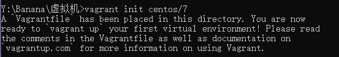

会在对应的目录下，生成一个`Vagrantfile`文件


`Vagrantfile` 是用于定义和配置 Vagrant 虚拟机环境的 Ruby 脚本。通过 Vagrantfile，你可以指定虚拟机的操作系统、网络设置、共享文件夹、软件配置等

如果你使用的是 VirtualBox，Vagrant 会将虚拟机实例创建在 VirtualBox 的默认虚拟机目录中。在 Windows 上，默认位置通常是 `C:\Users\Your_Username\VirtualBox VMs`，而在 macOS 上，默认位置通常是 `/Users/Your_Username/VirtualBox VMs`。

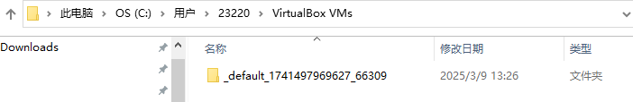

此时在virtual box 也可以看到对应的虚拟机

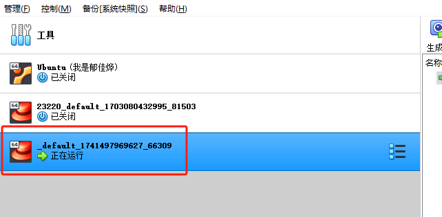

运行 vagrant up 即可启动虚拟机（需要去官方下载镜像，根据镜像启动容器，确保执行该命令的文件目录下有Vagrantfile）。系统 root 用户的密码是 vagrant。在cmd执行vagrant up的效果等同于在VirtualBox直接启动

通过vagrant status查看虚拟机是否启动成功，如果显示running，即为启动成功

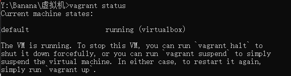

其实通过初始化vagrant工作区的时候，生成的.vagrant去记录需要启动的虚拟机

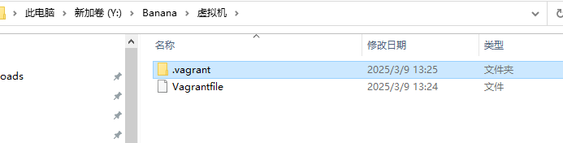

在使用 Vagrant 管理虚拟机时，Vagrant 会在项目根目录下创建一个名为 `.vagrant` 的隐藏文件夹。这个文件夹包含了一些 Vagrant 在管理虚拟机时需要用到的信息和数据，例如虚拟机状态、网络配置、共享文件夹等。

`.vagrant` 文件夹中包含以下文件和子文件夹：

- `machines`：存储每个虚拟机实例的相关信息，例如虚拟机名称、ID、状态等。
- `data`：存储 Vagrant 实例数据，例如 SSH 连接信息、虚拟机配置等。
- `cache`：缓存虚拟机镜像和 box 文件，以便更快地创建虚拟机实例。

`.vagrant` 文件夹是自动生成的，并且通常不需要手动修改或删除。如果需要重新创建虚拟机实例，可以通过执行 `vagrant destroy` 命令来销毁现有虚拟机并删除 `.vagrant` 文件夹，然后再通过 `vagrant up` 命令重新创建虚拟机实例。

执行 `vagrant ssh` 就能以 `vagrant` 用户直接登入虚机中（注意路径中不能有中文，否则会出错），`root` 用户没有默认密码，也不能直接登录。需要 root 权限的命令可以通过在命令前添加 `sudo` 来执行，也可以执行 `sudo -i` 直接切换到 `root` 用户。也可以在 VirtualBox 的终端上登录系统，默认的登录用户名和密码都是 `vagrant`

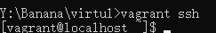


### 二、扩展

#### 1、关于.vagrantup 和 vagrantfile

vagrant up命令的启动依赖.vagrantup 和 vagrantfile，需要在有.vagrantup 和 vagrantfile的目录下才能执行vagrant相关的命令

1、**Vagrantfile**

- 作用：`Vagrantfile` 是 Vagrant 的核心配置文件，定义了虚拟机的配置信息，例如：
  - 虚拟机的基础镜像（Box）。
  - 虚拟机的资源分配（CPU、内存等）。
  - 网络配置（端口转发、私有网络等）。
  - 同步文件夹设置。
  - 启动时的脚本（Provisioning Scripts）。
- 必要性：`vagrant up` 必须依赖 `Vagrantfile` 来创建和管理虚拟机。没有 `Vagrantfile`，Vagrant 不知道如何配置虚拟机。

2、**.vagrant 目录**

- **作用**：`.vagrant` 目录是 Vagrant 的工作目录，存储了虚拟机的状态信息，例如：
  - 虚拟机的唯一标识符（UUID）。
  - 虚拟机的 SSH 密钥。
  - 虚拟机的当前状态（运行中、已停止等）。
- **必要性**：`.vagrant` 目录是 Vagrant 自动生成的，用于跟踪虚拟机的状态。如果删除该目录，Vagrant 将无法识别现有的虚拟机。
- 包含内容：
  - `machines`：存储每个虚拟机实例的相关信息，例如虚拟机名称、ID、状态等。
  - `data`：存储 Vagrant 实例数据，例如 SSH 连接信息、虚拟机配置等。
  - `cache`：缓存虚拟机镜像和 box 文件，以便更快地创建虚拟机实例。

​	`.vagrant` 文件夹是自动生成的，并且通常不需要手动修改或删除。如果需要重新创建虚拟机实例，可以通过执行 `vagrant destroy` 命令来销毁现有虚拟机并删除 `.vagrant` 文件夹，然后再通过 `vagrant up` 命令重新创建虚拟机实例。

#### 2、关于vagrant up 启动和虚拟机启动

| **场景**         | **Vagrant**                         | **直接使用 VirtualBox**            |
| :--------------- | :---------------------------------- | :--------------------------------- |
| **开发环境搭建** | 非常适合，快速创建一致的开发环境。  | 需要手动配置，效率较低。           |
| **团队协作**     | 通过共享 `Vagrantfile` 确保一致性。 | 每个成员需要手动配置，容易不一致。 |
| **学习和测试**   | 适合快速测试不同环境。              | 适合深入理解虚拟化技术。           |
| **生产环境**     | 不适合，主要用于开发环境。          | 适合运行生产环境的虚拟机。         |

#### 3、虚拟机的网络配置

默认虚拟机的ip地址不是固定ip，开发不方便

虚拟机默认的网络是采用网络地址转换（NAT）的方式，这对我们后来的开发很不方便

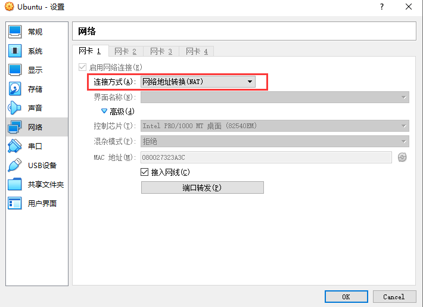

网络地址转换-端口转发

如我们在windows系统中装了一个virtualbox（其中是liunx系统），在虚拟机中我们会装很多的软件如mysql、redis等，假设当前mysql和redis在liunx中的端口分别是3306、6369，那么如果我们要进行端口转发，我们饿需要将虚拟机中的3306端口和windows中的3333端口绑定，这样别人访问windowos的3333端口就相当于访问到了虚拟机中的3306的mysql，但是我们之后每次在虚拟机中创建一个应用，都要做端口转发，很不方便

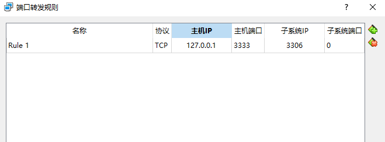

因此我们想给虚拟机一个固定的ip地址。wnidows能够和virtualbox相互ping通，那么对于一个虚拟机中的软件，我们直接拿该虚拟机固定ip地址加端口号来访问即可。

安装虚拟网卡的地址进行配置，当前虚拟网卡的地址是192.168.56.1，那么我们虚拟机的地址就要设置成192.168.56.几

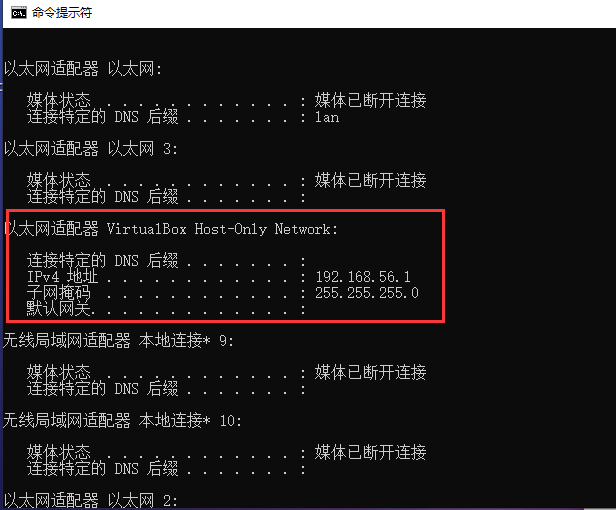


虚拟机是根据Vagrantfile来创建虚拟机信息的，编辑Vagrantfile

打开其中的私有网络，并指定对应的ip

```
config.vm.network "private_network", ip: "192.168.56.10"
```

通过命令`vagrant reload`重启虚拟机

通过命令vagrant ssh以ssh连接虚拟机

通过命令`ip addr`查看网络地址

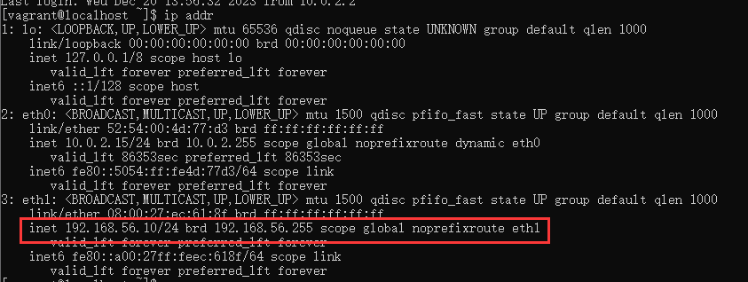

测试主机和虚拟机是否可以ping通

先查看windows地址

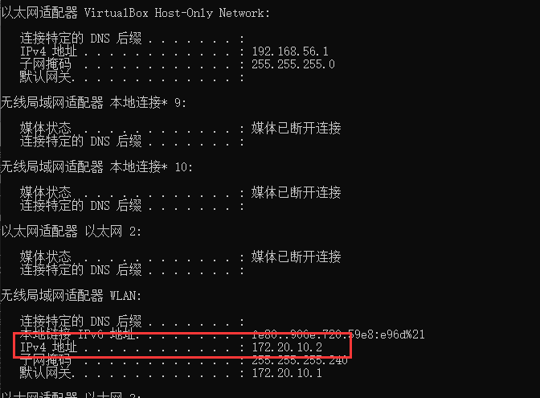

虚拟机ping 主机windows：

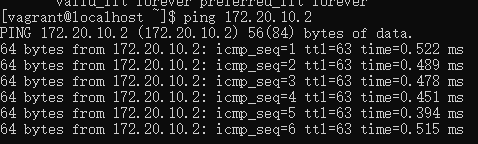

windows ping 虚拟机

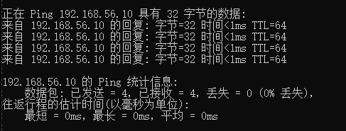

#### 4、虚拟机迁移

原因：因为上面的操作是默认将虚拟机内容安装在C盘的，而后期会很大，因此我们需要将虚拟机的内容从C盘中迁移出去。

说明：

首先，[vagrant](https://so.csdn.net/so/search?q=vagrant&spm=1001.2101.3001.7020)的运行是依托于VirtualBox这个虚拟机软件的

那么首先找到VirtualBox的安装位置，我的安装位置是`C:\Program Files\Oracle\VirtualBox`

这个目录下，我们使用命令行查看一下当前安装的虚拟机数量

```
vboxmanage list vms
```

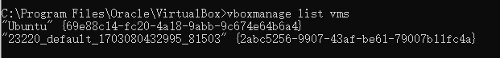

当前使用的虚拟机是`23220_default_1703080432995_81503`

进入到vagrant的安装目录`C:\Users\23220`

其虚拟机存储的位置默认也是这里

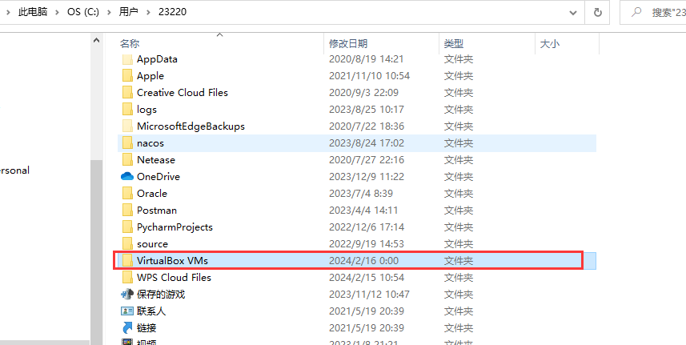


直接在virtual box中通过移动操作移动到指定目录即可

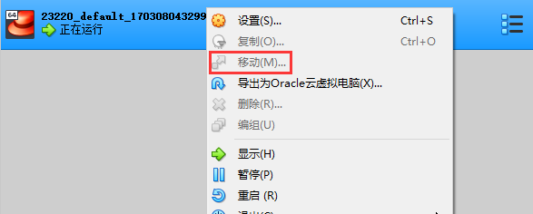

关于vagrant中的内容迁移可以看这个文章

> https://blog.csdn.net/glatchen/article/details/83187484

#### 5、删除.vagrant和vagrantfile

还可以直接用virtulBox中进行启动，但是无法使用vagrant进行统一配置的管理和启动了。

#### 6、虚拟机不支持密码模式登录

> 参考文章：https://blog.csdn.net/qq_43956479/article/details/130959362

通过xshell连接虚拟机的时候，不允许password登录，只能通过public key去进行登录

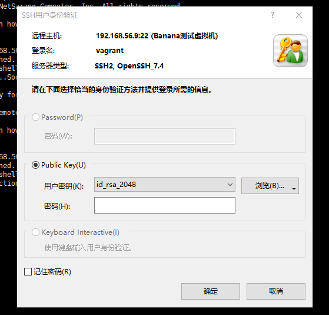

解决方法如下：

- 进入对应虚拟机
- cd /etc/ssh
- sudo vim sshd_config
- 按i键进行编辑,找到passwordAuthentication, 修改成yes, 
- ：wq 报错即可

#### 7、**手动修改 Yum 仓库配置**

进行如下命令的时候报错：

```
sudo yum install -y yum-utils \
device-mapper-persistent-data \
lvm2
```

报错：

```
Could not retrieve mirrorlist http://mirrorlist.centos.org/?release=7&arch=x86_64&repo=os&infra=vag error was
14: curl#6 - "Could not resolve host: mirrorlist.centos.org; Unknown error"
```

手动修改 Yum 仓库配置来解决该问题：

如果网络问题暂时无法解决，可以手动修改 CentOS 的 Yum 仓库配置，使用可用的镜像站点。

1. 登录虚拟机：

   ```
   vagrant ssh
   ```

2. 备份原有的仓库文件：

   ```
   sudo mv /etc/yum.repos.d/CentOS-Base.repo /etc/yum.repos.d/CentOS-Base.repo.backup
   ```

3. 下载新的仓库配置文件：

   ```
   sudo curl -o /etc/yum.repos.d/CentOS-Base.repo https://mirrors.aliyun.com/repo/Centos-7.repo
   ```

4. 清理 Yum 缓存并更新：

   ```
   sudo yum clean all
   sudo yum makecache
   ```

5. 测试 Yum 是否正常工作：

   ```
   sudo yum update
   ```

#### 8、无法上传文件

- https://blog.csdn.net/mingyuli/article/details/82864996
- https://blog.csdn.net/qq_45830543/article/details/117127493