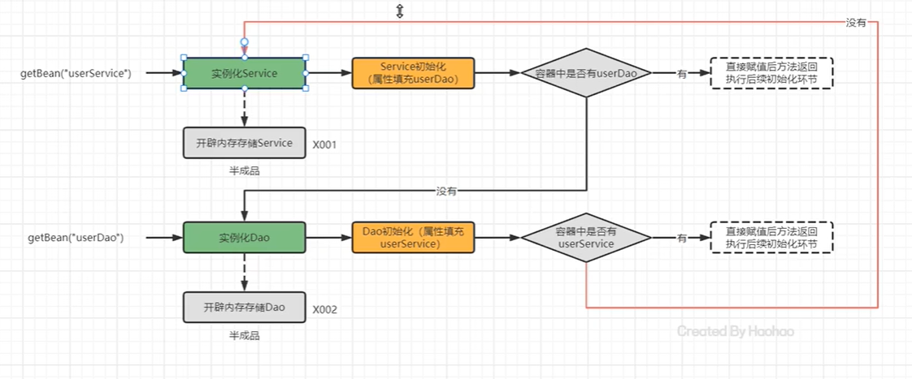
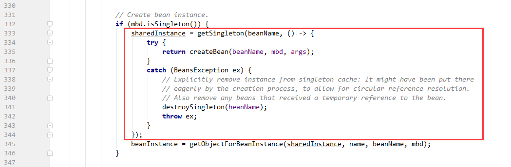

# Spring


[TOC]


## I、IoC部分

## 一、传统Javaweb开发的困惑

### 1、JavaWeb开发及其解决方案

在传统的JavaWeb开发中，除了核心的业务逻辑，还包含很多事务操作和日志操作，如下图所示（目的：引出spring的两大核心：依赖注入、AOP）：

我们可以从中发现一些问题：

1.类是通过new的方式来创建其实例的（UserDao类、UserLog类、ExceptionLog类），如业务层需要持久层中的某一个对象的某个操作，就必须去new一个持久层的对象，这样会造成耦合度比较紧密【层与层之间耦合紧密问题】，如果某一个接口需要修改其实现类（接口行为的具体表现），就必须进行修改源码【接口与具体实现耦合紧密问题】。

解决方法（依赖注入）：

程序代码中不要手动去new对象，第三方根据要求为程序提供需要的Bean对象


2.基本所有的业务方法中都包含了事务功能和日志功能，即通用的事务功能和通用的日志功能耦合在业务代码中。

解决方法（AOP）：

程序代码中不要手动new对象，第三方根据要求为程序提供需要的Bean对象的代理对象（BeanProxy），增强原来的对象，为其增加一些功能，如上述的事务功能和日志功能


## 二、IoC、DI和AOP思想的提出和框架的概念

**0.第三方：**

在工厂模式中，BeanFactory来充当第三方的角色，来产生Bean实例

使用配置文件来配置Bean的基本信息，BeanFactory根据配置文件来生成Bean实例

 

**1.Ioc**

Inversion of Control，翻译为控制反转或反转控制，强调是原来在程序中创建Bean的权利（通过new创建实例对象）反转给第三方

如原来的程序中我们需要手动去new A()来创建A的实体对象，而根据Ioc思想，可以让第三方去创建A对象。这样程序与具体对象就失去了直接联系。


**2.DI**

Dependency Injection，依赖注入，强调Bean之间的关系，并且这种关系是通过第三方去设置 。

如现在又Bean1和Bean2，Bean1需要在内部使用Bean2，才可以达到目标效果，原先的话我们可以通过第三方分别要到Bean1和Bean2，然后把Bean2设置给Bean1来达到目的，现在可以把设置的动作交给第三方去完成，即在第三方创建Bean1的时候就创建出Bean2，并把Bean2设置给Bean1（Bean1包含对Bean2的引用）


 

**面试题：IoC 和 DI 的关系？**

首先，先回答IoC和DI的是什么： 

IoC： Inversion of Control，控制反转，将Bean的创建权由原来程序反转给第三方 

DI：Dependency Injection，依赖注入，某个Bean的完整创建依赖于其他Bean（或普通参数）的注入 其次，在回答IoC和DI的关系： 

第一种观点：IoC强调的是Bean创建权的反转，而DI强调的是Bean的依赖关系，认为不是一回事 

第二种观点：IoC强调的是Bean创建权的反转，而DI强调的是通过注入的方式反转Bean的创建权，认为DI 是IoC的其中一种实现方式


**3.AOP**

Aspect Oriented Programming，面向切面编程，功能的横向抽取，主要实现的方式是通过代理的方式（Proxy）。


关于面向对象，是纵向实现的。


**三种思想总结：** 

1）IoC控制反转，是将程序创建Bean的权利反转给第三方； 

2）DI依赖注入，某个完整Bean需要依赖于其他Bean（或属性）的注入； 

3）AOP面向切面编程，用横向抽取方法（属性、对象等）思想，组装成一个功能性切面。


**框架概念：**

基本特点：

- 框架（Framework），是基于基础技术之上，从众多业务中抽取出的通用解决方案；
- 框架是一个半成品，使用框架规定的语法开发可以提高开发效率，可以用简单的代码就能完成复杂的基础 业务； 
- 框架内部使用大量的设计模式、算法、底层代码操作技术，如反射、内省、xml解析、注解解析等； 
-  框架一般都具备扩展性； 
- 有了框架，我们可以将精力尽可能的投入在纯业务开发上而不用去费心技术实现以及一些辅助业务。


**Java中常用的框架：**

​        不同语言，不同领域都有属于自己的框架，使用框架开发是作为程序员的最基础的底线。Java语言中的框架， 可以分为基础框架和服务框架： - 基础框架：完成基本业务操作的框架，如MyBatis、Spring、SpringMVC、Struts2、Hibernate等 - 服务框架：特定领域的框架，一般还可以对外提供服务框架，如MQ、ES、Nacos等


**思想、框架和编码的关系：**


 

## 三、Spring框架

**Spring 框架概述：**

spring是一个开源的轻量级Java开发应用框架，可以简化企业级应用开发。Spring解决了开发者在JavaEE开发 中遇到的许多常见的问题，提供了功能强大IOC、AOP及Web MVC等功能。是当前企业中Java开发几乎不能 缺少的框架之一。Spring的生态及其完善，不管是Spring哪个领域的解决方案都是依附于在Spring  Framework基础框架的。


**Spring框架的历史：**

- Jsp 默默扛下所有（Java Server Pages 即 Java服务器界面）
- MVC+三层架构分工明确，但开发成本及其高
- EJB 重量级框架出现，走出一个困境，有进入另一个困境
- Spring 春天来到，随之，SSH风生水起、称霸武林 
- Spring 稳住江湖大哥位置，SSM开始上位
- Spring 本着“拿来主义”的思维快速发展，生态不断健全
- SpringBoot 又一里程碑崛起，把“约定大于配置“思想玩儿的炉火纯青
- SpringCloud 打包了微服务众多解决方案，应对互联网项目更加easy！


**Spring Framework 技术栈：**

Spring家族中有很多框架，但这些框架中最核心、最基础的就是Spring Framework框架。


最底层是Spring Framework提供的单元测试和集成测试，然后第二层是该框架的核心容器，内部包括四部分，我们可以通过四个jar包去获取这四部分，当我们引入Context坐标后，会自动引入其他三个。Beans代表bean；Core代表核心；Context代表上下文；SqEL代表Spring表达式；第三层主要是AOP和

Aspects切面；最上层的左边是数据访问层，右边是web层，这两个都是在核心容器和aop之上进行构建的

### 1、BeanFactory快速入门（Ioc）


BeanFactory = 第三方


**具体实现：**

**0.创建一个Maven工程**


**1.导入Spring的jar包或Maven坐标**

这里我们只需要导入核心容器的Context包，其他的包也会对应地导入进来


我们可以看下当前导入的依赖，可以发现，核心容器中的其他三个beans、aop、sqEL也会被导入进来


**2.定义UserService接口及其UserServiceImpI类**

定义UserService接口：


文件夹目录：


定义UserServiceImpl：


文件夹目录：


**3.创建beans.xml配置文件，将UserServiceImpl的信息配置到该xml中**

在resources资源目录下创建Spring的配置文件Spring Config


我们为其取名为beans.xml,，其会自动帮我导入配置文件的头


接下来，我们将UserServiceImpl的信息配置到该xml文件中

id：为当前bean的唯一标识

class：当前bean对应的实体对象信息（这里是UserServiceImpl的全类名）

```java
<?xml version="1.0" encoding="UTF-8"?>
<beans xmlns="http://www.springframework.org/schema/beans"
       xmlns:xsi="http://www.w3.org/2001/XMLSchema-instance"
       xsi:schemaLocation="http://www.springframework.org/schema/beans http://www.springframework.org/schema/beans/spring-beans.xsd">
    <!--配置UserServiceImpl-->
    <bean id="userService" class="com.example.service.impl.UserServiceImpl"></bean>
</beans>
```

**4.配置测试代码，创建BeanFactory，加载配置文件，获取对应的UserService对象**

可以看到，其最后能够成功获得UserService对象的地址

```java
package com.test;

import com.example.service.UserService;
import org.springframework.beans.factory.support.DefaultListableBeanFactory;
import org.springframework.beans.factory.xml.XmlBeanDefinitionReader;

public class BeanFactoryTest {

    public static void main(String[] args) {
        //1.创建工厂对象
        //这里使用的是其默认的实现类DefaultListableBeanFactory
        DefaultListableBeanFactory beanFactory = new DefaultListableBeanFactory();

        //2.创建一个读取器（xml文件）
        XmlBeanDefinitionReader reader = new XmlBeanDefinitionReader(beanFactory);

        //3.读取配置文件内容给工厂
        reader.loadBeanDefinitions("beans.xml");

        //4.根据id获取Bean实例对象
        //getBean方法返回的对象是Object类型，需要进行强转
        UserService userService = (UserService)beanFactory.getBean("userService");
        //结果：com.example.service.impl.UserServiceImpl@725bef66
        System.out.println(userService);    
    }
}

```

### 2、BeanFactory快速入门2（DI）

上面使用BeanFactory完成了IoC思想的实现，下面去实现以下DI依赖注入： 

1）定义UserDao接口及其UserDaoImpl实现类； 

2）修改UserServiceImpl代码，添加一个setUserDao(UserDao userDao)用于接收注入的对象； 

3）修改beans.xml配置文件，在UserDaoImpl的中嵌入配置注入； 

4）修改测试代码，获得UserService时，setUserService方法执行了注入操作。

**具体实现：**

我们再去配置一个UserDaoImpl，并通过配置文件，将其设置为Bean对象，并获取其实例，由于这里和上面是差不多，就直接简单演示

UserDao接口：

```java
package com.example.dao;

public interface UserDao {
}

```

UserDapImpl实现类：

```java
package com.example.dao.impl;

import com.example.dao.UserDao;

public class UserDaoImpl implements UserDao {

}

```

beans配置文件

```xml
<?xml version="1.0" encoding="UTF-8"?>
<beans xmlns="http://www.springframework.org/schema/beans"
       xmlns:xsi="http://www.w3.org/2001/XMLSchema-instance"
       xsi:schemaLocation="http://www.springframework.org/schema/beans http://www.springframework.org/schema/beans/spring-beans.xsd">
    <!--配置UserServiceImpl-->
    <bean id="userService" class="com.example.service.impl.UserServiceImpl"></bean>

    <!--配置UserDaoImpl-->
    <bean id="userDao" class="com.example.dao.impl.UserDaoImpl"></bean>
</beans>
```

测试：

可以发现UserDaoImpl成功注入容器中，并且能够通过beanFactory（第三方）获取

可以看他其成功打印了UserDaoImpl对象的地址（toString默认方法，获取对象的地址）

```java
package com.example.test;

import com.example.dao.UserDao;
import com.example.service.UserService;
import org.springframework.beans.factory.support.DefaultListableBeanFactory;
import org.springframework.beans.factory.xml.XmlBeanDefinitionReader;

public class BeanFactoryTest {

    public static void main(String[] args) {
        //1.创建工厂对象
        //这里使用的是其默认的实现类DefaultListableBeanFactory
        DefaultListableBeanFactory beanFactory = new DefaultListableBeanFactory();

        //2.创建一个读取器（xml文件）
        XmlBeanDefinitionReader reader = new XmlBeanDefinitionReader(beanFactory);

        //3.读取配置文件内容给工厂
        reader.loadBeanDefinitions("beans.xml");

        //4.根据id获取Bean实例对象
        UserService userService = (UserService)beanFactory.getBean("userService");
        //com.example.service.impl.UserServiceImpl@725bef66
        System.out.println(userService);    
        
        UserDao userDao = (UserDao)beanFactory.getBean("userDao");
        //com.example.dao.impl.UserDaoImpl@2aaf7cc2
        System.out.println(userDao);
    }
}

```


在javaEE的三层架构中，Service层（业务层）需要去调用Dao层(实体层)中的对象

我们可以利用DI的思想，直接在配置文件中配置Service对象需要注入Dao对象


首先在UserServiceImpl类中，声明一个类型为UserDao接口的成员变量，并且为其创建一个set方法

```java
package com.example.service.impl;

import com.example.dao.UserDao;
import com.example.service.UserService;

public class UserServiceImpl implements UserService {
    private UserDao userDao;

    //需要在beans.xml中进行配置后
    //BeanFactory去调用该setUserDao方法，从容器中获得userDao的对象设置到此处
    public void setUserDao(UserDao userDao){
        System.out.println("BeanFactory去调用该方法获得userDao对象，并将其设置到此处" + userDao);
        this.userDao = userDao;
    }
}

```

去配置文件beans.xml中进行配置，实现DI依赖注入：

property：属性

name：指set方法的除了前set的属性名称，需要首字母小写

ref：引用，在当前配置文件中找一个bean，通过beanid指定，然后将该bean设置给com.example.service.impl.UserServiceImpl的bean对象中属性名为userDao的方法

```xml
<?xml version="1.0" encoding="UTF-8"?>
<beans xmlns="http://www.springframework.org/schema/beans
       xmlns:xsi="http://www.w3.org/2001/XMLSchema-instance"
       xsi:schemaLocation="http://www.springframework.org/schema/beans http://www.springframework.org/schema/beans/spring-beans.xsd">
    <!--配置UserServiceImpl-->
    <bean id="userService" class="com.example.service.impl.UserServiceImpl">
        <!--依赖注入-->
        <property name="userDao" ref="userDao"></property>
    </bean>

    <!--配置UserDaoImpl-->
    <bean id="userDao" class="com.example.dao.impl.UserDaoImpl"></bean>
</beans>
```

然后我们启动启动类，看一下输出结果

可以看到其成功调用了userServiceImpl中的set方法（第三方是通过声明在name中的名称去寻找对应对象中的setter方法），将UserDaoImpl对象注入给了userServiceImpl中的成员变量UserDao


### 3、ApplicationContext快速入门

ApplicationContext 称为Spring容器，内部封装了BeanFactory，比BeanFactory功能更丰富更强大，使用 ApplicationContext 进行开发时，xml配置文件的名称习惯写成applicationContext.xml

其实现类如下图所示：


测试方法：

```java
package com.example.test;

import com.example.service.UserService;
import org.springframework.context.ApplicationContext;
import org.springframework.context.support.ClassPathXmlApplicationContext;

public class ApplicationContextTest {
    public static void main(String[] args) {
        //创建ApplicationContext，加载配置文件，实例化容器
        ApplicationContext applicationContext = new ClassPathXmlApplicationContext("beans.xml");
        //根据bean的名称调用getbean方法获取对应的bean
        UserService userService = (UserService) applicationContext.getBean("userService");
        System.out.println(userService);
    }
}

```

结果：

也可以从中看到，我们在获取该bean的同时，也同时进行了依赖注入DI，将UserDao接口的bean对象注入到了Userservice接口的bean对象中


### 4、BeanFactory与ApplicationContext的关系

**1.BeanFactory和Application的关系（异同）**

1）BeanFactory是Spring的早期接口，称为Spring的Bean工厂，ApplicationContext是后期更高级接口，称之为 Spring 容器； 

2）ApplicationContext在BeanFactory基础上对功能进行了扩展，例如：监听功能、国际化功能等。BeanFactory的 API更偏向底层，ApplicationContext的API大多数是对这些底层API的封装（方便了我们的操作）； 

3）Bean创建的主要逻辑和功能都被封装在BeanFactory中，ApplicationContext不仅继承了BeanFactory，而且 ApplicationContext内部还维护着BeanFactory的引用，所以，ApplicationContext与BeanFactory既有继承关系，又 有融合关系。 


4）Bean的初始化时机不同，原始BeanFactory是在首次调用getBean时才进行Bean的创建（延迟加载），而ApplicationContext则 是配置文件加载，容器一创建就将Bean都实例化并初始化好（立即加载）。

我们可以通过断点调试的方式，并且在对应的需要成为bean对象的类中，创建一个无参构造器，看起什么时候将Bean实例化。我们可以发现，如果是BeanFactory的话，是其在执行下面语句后（即调用之后），才进行Bean的创建

```java
 UserService userService = (UserService)beanFactory.getBean("userService");
```

如果是ApplicationContext，是在加载配置文件的时候，就已经完成了Bean的实例化工作

```java
 ApplicationContext applicationContext = new ClassPathXmlApplicationContext("beans.xml");
```


**2.ApplicationContext的继承结构图**


**3.ApplicationContext和Beanfactory的框架图**

ApplicationContext对外提供接口，当需要用到BeanFactory的时候采取调用BeanFactory的方法


### 5、BeanFactory继承体系

BeanFactory是核心接口，项目运行过程中肯定有具体实现参与，这个具体实现就是DefaultListableBeanFactory ，而ApplicationContext内部维护的Beanfactory的实现类也是它。


我们可以通过断点的方式，查看ApplicationContext内部维护的Beanfactory的实现类也正是DefaultListableBeanFactory


我们可以简单去看下DefaultListableBeanFactory的内部结构：

**（1）beanDefinitionMap**

```java
/** Map of bean definition objects, keyed by bean name. */
private final Map<String, BeanDefinition> beanDefinitionMap = new ConcurrentHashMap<>(256);
```

对于xml中写的各个内容都要进行封装，因为java是面向对象的语言，一切皆对象，因此对于xml中的各个配置需要进行抽取，然后放到一个对象中，封装这些信息的对象叫做bean定义对象，并存放到DefaultListableBeanFactory中的beanDefinitionMap中，每个bean定义对象封装的是xml中bean标签中的内容如：

```xml
<!--配置UserDaoImpl-->
<bean id="userDao" class="com.example.dao.impl.UserDaoImpl"></bean>
```

其中beanDefinitionMap的Key是String类型，是类的名字，value是BeanDefinition，存放类对应的BeanDefinition对象。

### 6、ApplicationContext的继承体系

注意：在spring MVC环境下，Spring MVC需要在pom文件中导入Spring-web组件的依赖，可能ApplicationContext的继承体系与现在不一样，其ApplicationContext的继承体系如下所示


当我们现在只在Spring基础环境下，即只导入spring-context坐标时，此时ApplicationContext的继承体系如下所示


一般我们常用的是FileSystemXmlApplicationContext、ClassPathXmlApplicationContext和AnnotationConfigApplicationContext（比较常用），前两个用于xml的配置方案，而最后一个用于注解的配置方案

当我们用xml的配置方案，ApplicationContext的容器用前两个。如果是加载类路径下的xml配置（即resources文件下的xml文件）的applicationContext实现类我们使用ClassPathXmlApplicationContext；如果是加载磁盘路径下的xml配置的applicationContext实现类我们使用FileSystemXmlApplicationContext；如果时用注解的配置方案，ApplicationContext的容器用最后一个。


## 四、基于xml的Spring应用

### 1、SpringBean的配置概览

Spring开发中主要是对Bean的配置，Bean的常用配置类如下所示：


### 2、Bean配置详解

#### 1. Bean的基础配置

我们直接在beans.xml配置文件中配置了UserDaoImpl由Spring容器负责管理

```xml
<!--配置UserDaoImpl-->
<bean id="userDao" class="com.example.dao.impl.UserDaoImpl"></bean>
```

这里的id就是指定bean的beanName，class就是对应的bean的对象。此时存储到Spring容器（singleObjects单例池）中的Bean的beanName是userDao，值是UserDaoImpl对象。

我们之后可以根据上下文容器applicationContext（第三方），通过getbean方法，根据其beanName获取Bean实例

```java
//根据bean的名称调用getbean方法获取对应的bean
UserDao userDao = (UserDao) applicationContext.getBean("userDao");
```

我们通过断点的方式，查看一下此时spring容器（appilicationcontext）中存放的bean

我们从下图中可以看到此时xml中的bean信息已经封装到了spring容器中的beanDefinitionMap属性中

其中key存放的是是bean的名称

value存放的是对应的BeanDefinition对象信息


如果我们在配置文件中不配置id，则Spring会把当前Bean实例的权限定名（如下面的com.example.dao.impl.UserDaoImpl ）作为beanName

我们定义bean的时候如下所示

```xml
<bean  class="com.example.dao.impl.UserDaoImpl"></bean>
```

然后通过断点的方式去spring容器中查看对应的bean信息,可以发现当前bean实例的beanName是以全限定名来充当的


#### 2. Bean的别名配置

可以在bean标签中通过name属性，为Bean指定多个别名，根据别名作为BeanName也可以获得Bean对象

如下图所示:

```xml
<bean id="userDao" name="aaa,bbb,ccc" class="com.example.dao.impl.UserDaoImpl"></bean>
```

1）如果id属性和name属性都指定的话，那么bean在spring容器中的名称还是以id作为beanName


那么我们为什么可以通过别名的方式获取对应的bean实例呢

其是因为在spring容器中通过别名映射的方式，将别名指向id名称，我们可以在applicationContext中的alliasMap中看到如下的关系，如下图所示


2）如果bean标签中没有id属性，只有name属性，那么bean在spring容器中的名称是别名中的第一个别名作为beanName

```xml
<bean name="aaa,bbb,ccc" class="com.example.dao.impl.UserDaoImpl"></bean>
```


#### 3. bean的范围配置

 默认情况下，单纯的Spring环境Bean的作用范围有两个：**Singleton**和**Prototype** 

 **singleton：**单例，默认值，Spring容器创建的时候，就会进行Bean的实例化，并存储到容器内部的单例池中 ，每次getBean时都是从单例池中获取相同的Bean实例； 

xml中的配置：

```java
<bean id="userDao"  class="com.example.dao.impl.UserDaoImpl" scope="singleton"></bean>
```

测试类：

```java
package com.example.test;

import com.example.dao.UserDao;
import com.example.service.UserService;
import org.springframework.context.ApplicationContext;
import org.springframework.context.support.ClassPathXmlApplicationContext;

public class ApplicationContextTest {
    public static void main(String[] args) {
        //创建ApplicationContext，加载配置文件，实例化容器
        ApplicationContext applicationContext = new ClassPathXmlApplicationContext("beans.xml");
        //根据bean的名称调用getbean方法获取对应的bean
        UserDao userDao = (UserDao) applicationContext.getBean("userDao");
        System.out.println(userDao);
        userDao = (UserDao) applicationContext.getBean("userDao");
        System.out.println(userDao);
        userDao = (UserDao) applicationContext.getBean("userDao");
        System.out.println(userDao);
    }
}

```

在spring容器创建后，我们去查看单例池，可以看到对应的bean实例对象


从输出结果可以看到，每次拿该bean实例对象的时候，都是取同一个


**prototype：**原型，Spring容器初始化时不会创建Bean实例，当调用getBean时才会实例化Bean，每次 getBean都会创建一个新的Bean实例

xml文件：

```xml
<bean id="userDao"  class="com.example.dao.impl.UserDaoImpl" scope="prototype"></bean>
```

测试代码同上：

```java
package com.example.test;

import com.example.dao.UserDao;
import com.example.service.UserService;
import org.springframework.context.ApplicationContext;
import org.springframework.context.support.ClassPathXmlApplicationContext;

public class ApplicationContextTest {
    public static void main(String[] args) {
        //创建ApplicationContext，加载配置文件，实例化容器
        ApplicationContext applicationContext = new ClassPathXmlApplicationContext("beans.xml");
        //根据bean的名称调用getbean方法获取对应的bean
        UserDao userDao = (UserDao) applicationContext.getBean("userDao");
        System.out.println(userDao);
        userDao = (UserDao) applicationContext.getBean("userDao");
        System.out.println(userDao);
        userDao = (UserDao) applicationContext.getBean("userDao");
        System.out.println(userDao);
    }
}
```

在spring容器创建后，我们去查看单例池


在第一次获取bean实例对象，我们去查看单例池，可以发现单例池中无论何时都不会存在userDao实例，但是userDao的信息以及被存储到了beanDefinitionMap中（因此，多例模式不会加载到单例池中，因为其有多个，用完就销毁了）


去查看控制台，可以发现，其是多例的，每次去的bean实例都是不一样的（地址不同）


**补充：**如果添加了spring-webmvc依赖，当使用scope属性的时候，其属性值有四个，除了上面两个singlen和prototype外，还有request和session。当使用request，会将创建的对象放到request域中；当使用session，会将创建的对象放到session域中。


#### 4.  Bean的延迟加载

当lazy-init设置为true时为延迟加载，也就是当Spring容器创建的时候，不会立即创建Bean实例(默认是Spring容器创建的时候，就立即创建Bean实例，但是如果使用BeanFactory，是等使用的时候再创建Bean实例)，等待用到时在创 建Bean实例并存储到单例池中去，后续在使用该Bean直接从单例池获取即可，本质上该Bean还是单例的

```xml
<bean id="userDao" class="com.itheima.dao.impl.UserDaoImpl" lazy-init="true"/>
```


#### 5. Bean的初始化和销毁方法配置

Bean在被实例化后（配置文件中有声明该bean，并对该bean进行实例化后（如果spring容器时直接使用AplicationContext时，在Spring容器创建的时候，会立即创建Bean实例）调用init方法和destroy方法），可以执行指定的初始化方法完成一些初始化的操作，Bean在销毁之前也可以执行指定的销毁 方法完成一些操作，初始化方法名称和销毁方法名称通过

在实现类中添加构造器和init以及destroy方法

```java
package com.example.dao.impl;

import com.example.dao.UserDao;

public class UserDaoImpl implements UserDao {
    //构造器
    public UserDaoImpl() {
        System.out.println("userDaoImpl构造器");
    }

    //初始化方法
    public void init(){
        System.out.println("初始化方法");
    }
    
    //销毁方法
    public void destroy(){
        System.out.println("销毁方法");
    }
}
```


在配置文件xml中添加初始化属性init和销毁实现destory，并指定对应的方法名称

```xml
<bean id="userDao"  class="com.example.dao.impl.UserDaoImpl" init-method="init" destroy-method="destroy"></bean>
```


运行结果：

可以看到显示调用实体类的构造器创建实体类的实例对象，然后再是调用bean实例的init方法

但是这里没有调用销毁方法，因为此时我们的spring容器还没有到销毁的步骤的时候，就已经挂掉了，虽然此时bean已经被销毁了，但是spring容器并没有调用销毁的方法（destory），因此也就无法执行销毁方法里面的内容


我们可以去手动显示地关闭spring容器，再去运行一下

```java
package com.example.test;

import com.example.dao.UserDao;
import com.example.service.UserService;
import org.springframework.context.ApplicationContext;
import org.springframework.context.support.ClassPathXmlApplicationContext;

public class ApplicationContextTest {
    public static void main(String[] args) {
        //创建ApplicationContext，加载配置文件，实例化容器
        ApplicationContext applicationContext = new ClassPathXmlApplicationContext("beans.xml");
        //根据bean的名称调用getbean方法获取对应的bean
        UserDao userDao = (UserDao) applicationContext.getBean("userDao");
        System.out.println(userDao);
        ((ClassPathXmlApplicationContext)applicationContext).close();
    }
}

```

运行结果：

可以看到spring容器调用了销毁方法


**扩展：**除上面以外，我们还可以通过实现InitializingBean接口，去完成Bean的初始化操作。InitializingBean接口中有一个afterPropertiesSet（）方法，其执行时机早于init-method配置的方法，其实在属性设置后进行的


在UserService接口的实现类UserServiceImpl中去定义构造器、init方法、destory方法，并让其实现InitializingBean接口，重写afterPropertiesSet（）方法

```java
package com.example.service.impl;

import com.example.dao.UserDao;
import com.example.service.UserService;
import org.springframework.beans.factory.InitializingBean;

public class UserServiceImpl implements UserService, InitializingBean {
    private UserDao userDao;

    //需要在beans.xml中进行配置后
    //BeanFactory去调用该setUserDao方法，从容器中获得userDao的对象设置到此处
    public void setUserDao(UserDao userDao){
        System.out.println("BeanFactory去调用该方法获得userDao对象，并将其设置到此处" + userDao);
        this.userDao = userDao;
    }

    //构造器
    public UserServiceImpl() {
        System.out.println("UserServiceImpl中的构造器方法");
    }

    //init方法
    public void init(){
        System.out.println("UserServiceImpl中的init方法");
    }

    //destory方法
    public void destroy(){
        System.out.println("UserServiceImpl的destory方法");
    }

    //执行时机早于init-method配置的方法
    public void afterPropertiesSet() throws Exception {
        System.out.println("UserServiceImpl的afterPropertiesSet方法");
    }
}

```

beans.xml配置类信息：

```xml
<?xml version="1.0" encoding="UTF-8"?>
<beans xmlns="http://www.springframework.org/schema/beans"
       xmlns:xsi="http://www.w3.org/2001/XMLSchema-instance"
       xsi:schemaLocation="http://www.springframework.org/schema/beans http://www.springframework.org/schema/beans/spring-beans.xsd">
    <!--配置UserServiceImpl-->
    <bean id="userService" class="com.example.service.impl.UserServiceImpl" init-method="init" destroy-method="destroy">
        <!--依赖注入-->
        <property name="userDao" ref="userDao" ></property>
    </bean>

    <!--配置UserDaoImpl-->
    <bean id="userDao"  class="com.example.dao.impl.UserDaoImpl" ></bean>
</beans>
```

测试类代码：

```java
package com.example.test;

import com.example.dao.UserDao;
import com.example.service.UserService;
import org.springframework.context.ApplicationContext;
import org.springframework.context.support.ClassPathXmlApplicationContext;

public class ApplicationContextTest {
    public static void main(String[] args) {
        //创建ApplicationContext，加载配置文件，实例化容器
        ApplicationContext applicationContext = new ClassPathXmlApplicationContext("beans.xml");
        //根据bean的名称调用getbean方法获取对应的bean
        UserDao userDao = (UserDao) applicationContext.getBean("userDao");
        //System.out.println(userDao);
        ((ClassPathXmlApplicationContext)applicationContext).close();
    }
}

```

运行结果如下图所示：

可以看到afterPropertiesSet方法是在设置完属性后进行调用的，即将UserDao实例通过依赖注入的方式注入给UserServiceImpl中的成员变量

然后在世调用init方法

最后在spring容器关闭的时候，调用destroy方法


#### 6. Bean的实例化配置

Spring的实例化方式主要如下两种：

- 构造方式实例化：底层通过构造方法对Bean进行实例化 
- 工厂方式实例化：底层通过调用自定义的工厂方法对Bean进行实例化


**（1）构造方式实例化：**

**实例化方式：**其是通过Spring容器加载配置文件，然后通过指定的类的全限定类名，然后通过反射的方式获取对应类的构造器，然后创建对应的对象，存储到容器当中。

**构造方式实例化测试：**

首先我们在UserServiceImpl中创建一个无参构造器和有参构造器

```java
package com.example.service.impl;

import com.example.dao.UserDao;
import com.example.service.UserService;
import org.springframework.beans.factory.InitializingBean;

public class UserServiceImpl implements UserService {
    private UserDao userDao;

    //需要在beans.xml中进行配置后
    //BeanFactory去调用该setUserDao方法，从容器中获得userDao的对象设置到此处
    public void setUserDao(UserDao userDao){
        this.userDao = userDao;
    }

    //无参构造器
    public UserServiceImpl() {
        System.out.println("UserServiceImpl的无参构造器");
    }

    //有参构造器
    public UserServiceImpl(String name){
        System.out.println("UserServiceImpl的有参构造器, 其参数值为" + name );
    }

}

```

此时的beans.xml配置文件中内容如下

```xml
<?xml version="1.0" encoding="UTF-8"?>
<beans xmlns="http://www.springframework.org/schema/beans"
       xmlns:xsi="http://www.w3.org/2001/XMLSchema-instance"
       xsi:schemaLocation="http://www.springframework.org/schema/beans http://www.springframework.org/schema/beans/spring-beans.xsd">
    <!--配置UserServiceImpl-->
    <bean id="userService" class="com.example.service.impl.UserServiceImpl" >
        <!--依赖注入-->
        <property name="userDao" ref="userDao" ></property>
    </bean>

    <!--配置UserDaoImpl-->
    <bean id="userDao"  class="com.example.dao.impl.UserDaoImpl" ></bean>
</beans>
```

如果我们此时去启动测试类

```java
package com.example.test;

import com.example.dao.UserDao;
import com.example.service.UserService;
import org.springframework.context.ApplicationContext;
import org.springframework.context.support.ClassPathXmlApplicationContext;

public class ApplicationContextTest {
    public static void main(String[] args) {
        //创建ApplicationContext，加载配置文件，实例化容器
        ApplicationContext applicationContext = new ClassPathXmlApplicationContext("beans.xml");
        //根据bean的名称调用getbean方法获取对应的bean
        UserDao userDao = (UserDao) applicationContext.getBean("userDao");
        //System.out.println(userDao);
        ((ClassPathXmlApplicationContext)applicationContext).close();
    }
}

```

可以看到此时在创建UserServiceImpl的bean实例的时候，调用的是其无参构造器


那我，如果我们要调用其有参构造器，我们可以在beans.xml配置文件中进行如下修改

可以通过constructor-arg标签进行指定参数，从而调用其有参构造方法

name表示形参的名称

value表示要传给该形参的值

```xml
<?xml version="1.0" encoding="UTF-8"?>
<beans xmlns="http://www.springframework.org/schema/beans"
       xmlns:xsi="http://www.w3.org/2001/XMLSchema-instance"
       xsi:schemaLocation="http://www.springframework.org/schema/beans http://www.springframework.org/schema/beans/spring-beans.xsd">
    <!--配置UserServiceImpl-->
    <bean id="userService" class="com.example.service.impl.UserServiceImpl" >
        <constructor-arg name="name" value="yjy"></constructor-arg>
        <!--依赖注入-->
        <property name="userDao" ref="userDao" ></property>
    </bean>

    <!--配置UserDaoImpl-->
    <bean id="userDao"  class="com.example.dao.impl.UserDaoImpl" ></bean>
</beans>
```

我们再此运行测试类，查看其输出的结果


**注意：**通过constructor-arg（构造参数）标签去配置参数不一定要用在构造方法上，也可以在类的方法上进行使用（静态工厂方法、非静态工厂方法），其不仅仅是为构造方法传递参数，只要是为了实例化对象（返回bean实例）而传递的参数都可以通过该标签完成。


**（2）工厂方式实例化Bean：**

**实例化方式：**Spring容器调用工厂方法，将工厂中返回的对象存储到容器中。

**分类：**

- 静态工厂方法实例化Bean
- 实例工厂方法实例化Bean
- 实现FactoryBean规范延迟实例化Bean


**1）静态工厂方法实例化Bean**

静态工厂方法实例化Bean，其实就是定义一个工厂类，提供一个静态方法用于生产Bean实例，在将该工厂类及其 静态方法配置给Spring即可，其特点是不需要创建工厂对象，直接通过类调用静态方法即可

**例子：**

创建一个工厂类，并创建该类的一个静态方法

```java
package com.example.factory;

import com.example.dao.UserDao;
import com.example.dao.impl.UserDaoImpl;

//工厂类
public class MyBeanFactory1 {
    //工厂静态方法
    public static UserDao getUserDao(String name){
        //可以在此编写一些其他逻辑的代码
        System.out.println("参数名称name为：" + name);
        return new UserDaoImpl();
    }
}

```

在配置文件中，将工厂的静态方法进行配置，并通过constructor-arg标签指定参数

factory-method方法：spring容器会主动去调用该全限定类中的指定方法，将获取的返回值的内容作为bean对象交给spring容器进行管理

```xml
<?xml version="1.0" encoding="UTF-8"?>
<beans xmlns="http://www.springframework.org/schema/beans"
       xmlns:xsi="http://www.w3.org/2001/XMLSchema-instance"
       xsi:schemaLocation="http://www.springframework.org/schema/beans http://www.springframework.org/schema/beans/spring-beans.xsd">
    <!--配置UserServiceImpl-->
    <bean id="userService" class="com.example.service.impl.UserServiceImpl" >
        <constructor-arg name="name" value="yjy"></constructor-arg>
        <!--依赖注入-->
        <property name="userDao" ref="userDao" ></property>
    </bean>

    <!--配置UserDaoImpl-->
    <bean id="userDao"  class="com.example.dao.impl.UserDaoImpl" ></bean>

    <!--静态工厂方法配置-->
    <bean id="userDao1" class="com.example.factory.MyBeanFactory1" factory-method="getUserDao">
        <constructor-arg name="name" value="yjy"></constructor-arg>
    </bean>
</beans>
```

测试类：

```java
package com.example.test;

import com.example.dao.UserDao;
import com.example.service.UserService;
import org.springframework.context.ApplicationContext;
import org.springframework.context.support.ClassPathXmlApplicationContext;

public class ApplicationContextTest {
    public static void main(String[] args) {
        //创建ApplicationContext，加载配置文件，实例化容器
        ApplicationContext applicationContext = new ClassPathXmlApplicationContext("beans.xml");
        Object userDao1 = applicationContext.getBean("userDao1");
        System.out.println(userDao1);
    }
}

```

然后我们运行，看下结果，成功通过工厂的静态方法创建了bean实例，并将其放到了容器当中


可以看到此时单例池中已经有beanName为userDao1的bean对象了


**通过静态工厂方法创建bean实例的好处：**

1. 原先自定义bean，然后让spring容器通过构造器去实例化bean的时候，bean在创建前后无法执行其他代码，但对于工厂方式，可以在return之前进行其他的逻辑操作，比如我们这个例子中就打印了一下参数。我们也可以将return提到外面，先完成创建之后的任务，再进行返回。

2. 有一些bean不是我们自定的，是其他jar包中自定义的，并且其是通过构造器方式去获取对应对象的，而就是通过静态方式获取对应对象的，我们就可以将其看做成静态工厂方法产生对象。如我们要获取jdbc对象，就需要调用DrivenManager类的静态方法getConnection方法(DrivenManager.getConnection)


**2）实例工厂方法实例化Bean**

实例工厂方法，也就是非静态工厂方法产生Bean实例，与静态工厂方式比较，该方式需要先有工厂对象，在用工厂 对象去调用非静态方法，所以在进行配置时，要先配置工厂Bean，在配置目标Bean

**例子：**

创建一个有非静态工厂方法的工厂类

```java
package com.example.factory;

import com.example.dao.UserDao;
import com.example.dao.impl.UserDaoImpl;

public class MyBeanFactory2 {
    //非静态工厂方法
    public UserDao getUserDao(){
        return new UserDaoImpl();
    }
}

```

在配置文件中进行配置

由于该方法时非静态方法，所以需要先创建工厂类的实例，再通过工厂类的实例去调用该方法

因此我们需要先配置工厂类的实例

然后再再配置中去调用工厂类实例的非静态方法，将其返回值作为bean实例

其通过factory-bean指定需要定要工厂的beanName

然后通过factory-method指定需要将工厂中哪一个方法的返回值作为一个实例bean交给spring容器来进行管理

```xml
<?xml version="1.0" encoding="UTF-8"?>
<beans xmlns="http://www.springframework.org/schema/beans"
       xmlns:xsi="http://www.w3.org/2001/XMLSchema-instance"
       xsi:schemaLocation="http://www.springframework.org/schema/beans http://www.springframework.org/schema/beans/spring-beans.xsd">
    <!--配置UserServiceImpl-->
    <bean id="userService" class="com.example.service.impl.UserServiceImpl" >
        <constructor-arg name="name" value="yjy"></constructor-arg>
        <!--依赖注入-->
        <property name="userDao" ref="userDao" ></property>
    </bean>

    <!--配置UserDaoImpl-->
    <bean id="userDao"  class="com.example.dao.impl.UserDaoImpl" ></bean>

    <!--静态工厂方法配置-->
    <bean id="userDao1" class="com.example.factory.MyBeanFactory1" factory-method="getUserDao">
        <constructor-arg name="name" value="yjy"></constructor-arg>
    </bean>

    <!--配置非静态工厂方法-->
    <!--1.创建工厂的bean-->
    <bean id="myBeanFactory2" class="com.example.factory.MyBeanFactory2"></bean>
    <!--2.调用工厂的方法-->
    <bean id="userDao2" factory-bean="myBeanFactory2" factory-method="getUserDao"></bean>

</beans>
```

测试类：

```java
package com.example.test;

import com.example.dao.UserDao;
import com.example.service.UserService;
import org.springframework.context.ApplicationContext;
import org.springframework.context.support.ClassPathXmlApplicationContext;

public class ApplicationContextTest {
    public static void main(String[] args) {
        //创建ApplicationContext，加载配置文件，实例化容器
        ApplicationContext applicationContext = new ClassPathXmlApplicationContext("beans.xml");
        Object userDao2 = applicationContext.getBean("userDao2");
        System.out.println(userDao2);
    }
}
			
```

然后我们查看一下运行结果，可以发现其成功通过调用工厂的非静态方法，创建名称为UserDao2的bean实例


然后我们去单例池中查看一下此时有的bean实例

可以发现此时既有工厂类的bean实例myBeanFactory2，也有非静态工厂方法返回的bean实例userDao2


**非静态方法工厂的优点：**

1. 在创建bean实例的前后进行自己的逻辑代码实现
2. 其他第三方jar包中的bean，其内部中某些bean的产生，就是通过某些非静态方法来获取的


**3）实现FactoryBean规范延迟实例化Bean**

上面不管是静态工厂方式还是非静态工厂方式，都是自定义的工厂方法，Spring提供了FactoryBean的接口规范， FactoryBean接口定义如：

```java
/*
 * Copyright 2002-2020 the original author or authors.
 *
 * Licensed under the Apache License, Version 2.0 (the "License");
 * you may not use this file except in compliance with the License.
 * You may obtain a copy of the License at
 *
 *      https://www.apache.org/licenses/LICENSE-2.0
 *
 * Unless required by applicable law or agreed to in writing, software
 * distributed under the License is distributed on an "AS IS" BASIS,
 * WITHOUT WARRANTIES OR CONDITIONS OF ANY KIND, either express or implied.
 * See the License for the specific language governing permissions and
 * limitations under the License.
 */

package org.springframework.beans.factory;

import org.springframework.lang.Nullable;

//工厂bean是一个接口
//作用：用于创建对象
public interface FactoryBean<T> {
	
	String OBJECT_TYPE_ATTRIBUTE = "factoryBeanObjectType";
    
    //创建bean
	@Nullable
	T getObject() throws Exception;

    //返回bean的类对象/类型
	@Nullable
	Class<?> getObjectType();

    //判断是否是一个单例
	default boolean isSingleton() {
		return true;
	}

}

```


**例子：**

我们创建一个自定义工厂类，然后去实现BeanFactory接口，然后重写其中的getObject方法和getObjectType方法

```java
package com.example.factory;

import com.example.dao.UserDao;
import com.example.dao.impl.UserDaoImpl;
import org.springframework.beans.factory.FactoryBean;

public class MyBeanFactory3 implements FactoryBean {
    public Object getObject() throws Exception {
        return new UserDaoImpl();
    }

    public Class<?> getObjectType() {
        return UserDao.class;
    }
}

```

然后我们去xml配置文件中去进行配置，配置FactoryBean交由Spring管理即可，因为其具有接口规范，所以我们不用去指定去调用其中的方法什么的

```xml
<?xml version="1.0" encoding="UTF-8"?>
<beans xmlns="http://www.springframework.org/schema/beans"
       xmlns:xsi="http://www.w3.org/2001/XMLSchema-instance"
       xsi:schemaLocation="http://www.springframework.org/schema/beans http://www.springframework.org/schema/beans/spring-beans.xsd">
    <!--配置UserServiceImpl-->
    <bean id="userService" class="com.example.service.impl.UserServiceImpl" >
        <constructor-arg name="name" value="yjy"></constructor-arg>
        <!--依赖注入-->
        <property name="userDao" ref="userDao" ></property>
    </bean>

    <!--配置UserDaoImpl-->
    <bean id="userDao"  class="com.example.dao.impl.UserDaoImpl" ></bean>

    <!--静态工厂方法配置-->
    <bean id="userDao1" class="com.example.factory.MyBeanFactory1" factory-method="getUserDao">
        <constructor-arg name="name" value="yjy"></constructor-arg>
    </bean>

    <!--配置非静态工厂方法-->
    <!--1.创建工厂的bean-->
    <bean id="myBeanFactory2" class="com.example.factory.MyBeanFactory2"></bean>
    <!--2.调用工厂的方法-->
    <bean id="userDao2" factory-bean="myBeanFactory2" factory-method="getUserDao"></bean>

    <!--配置FactoryBean 生成名为userDao3的实现FactoryBean接口实现类的bean对象-->
    <bean id="userDao3" class="com.example.factory.MyBeanFactory3"></bean>
</beans>
```

测试类：

```java
package com.example.test;

import com.example.dao.UserDao;
import com.example.service.UserService;
import org.springframework.context.ApplicationContext;
import org.springframework.context.support.ClassPathXmlApplicationContext;

public class ApplicationContextTest {
    public static void main(String[] args) {
        //创建ApplicationContext，加载配置文件，实例化容器
        ApplicationContext applicationContext = new ClassPathXmlApplicationContext("beans.xml");
        Object userDao3 = applicationContext.getBean("userDao3");
        System.out.println(userDao3);
    }
}

```

然后我们查看一下运行结果，可以发现成功将beanName为userDao3的bean交给了spring进行管理


我们去查看一下其具体的单例池中创建的bean实例，可以看到我们之前创建的userDao1和userDao2实例的value都是对应的UserDaoImpl实例，然后userDao3在这里的value是MyBeanFctory3实例


当我们去获取beanName为Userdao3时候

```java
Object userDao3 = applicationContext.getBean("userDao3");
```

通过断点观察发现Spring容器创建时，MyBeanFctory3被实例化了，并存储到了单例池singletonObjects中，但是 getObject() 方法尚未被执行，UserDaoImpl也没被实例化，当首次用到UserDaoImpl时，才调用getObject() ， 此工厂方式产生的Bean实例不会存储到单例池singletonObjects中，会存储到 factoryBeanObjectCache 缓存池 中，并且后期每次使用到userDao3都从该缓存池中返回的是同一个userDao3实例


**好处：**

一般开发中，不会使用该方式，在源码底层基本上都是使用该方式，可以将需要产生bean的需求，通过工厂实现类的方式存起来，什么时候用到该bean，再去产生 


#### 7. bean的注入方式

**bean依赖注入的两种方式：**


**依赖注入的类型：**

- 普通数据类型，例如：String、int、boolean等，通过value属性指定；
- 引用数据类型，例如：UserDaoImpl、DataSource等，通过ref属性指定；
- 集合数据类型，例如：List、Map、Properties等；

前面对普通数据类型和引用数据类型的注入都涉及，下面讲解一下集合数据类型的注入。


**注入List<T>类型的例子1（T为普通数据）：**

在UserServiceImpl类中创建一个类型为List，且T是普通数据类型的成员变量

```java
package com.example.service.impl;

import com.example.dao.UserDao;
import com.example.service.UserService;
import org.springframework.beans.factory.InitializingBean;

import java.util.List;

public class UserServiceImpl implements UserService {
    //定义个类型为List的成员变量
    private List<String> stringList;

    //set方法
    public void setStringList(List<String> stringList){
        this.stringList = stringList;
    }

}

```

然后在配置文件中，创建该类的bean，注入相应的参数信息

```xml
<?xml version="1.0" encoding="UTF-8"?>
<beans xmlns="http://www.springframework.org/schema/beans"
       xmlns:xsi="http://www.w3.org/2001/XMLSchema-instance"
       xsi:schemaLocation="http://www.springframework.org/schema/beans http://www.springframework.org/schema/beans/spring-beans.xsd">
    <!--配置UserServiceImpl-->
    <bean id="userService" class="com.example.service.impl.UserServiceImpl" >
        <property name="stringList">
            <list>
                <value>1</value>
                <value>2</value>
                <value>3</value>
            </list>
        </property>
    </bean>
</beans>
```

在接口和实现类定义一个方法，用于遍历List集合中的元素

接口类：

```java
package com.example.service;

public interface UserService {
    public void show();
}

```

实现类

```java
package com.example.service.impl;

import com.example.dao.UserDao;
import com.example.service.UserService;
import org.springframework.beans.factory.InitializingBean;

import java.util.List;

public class UserServiceImpl implements UserService {
    //定义个类型为List的成员变量
    private List<String> stringList;

    //set方法
    public void setStringList(List<String> stringList){
        this.stringList = stringList;
    }

    public void show(){
        System.out.println(stringList);
    }

}

```

测试类

```java
package com.example.test;

import com.example.dao.UserDao;
import com.example.service.UserService;
import org.springframework.context.ApplicationContext;
import org.springframework.context.support.ClassPathXmlApplicationContext;

public class ApplicationContextTest {
    public static void main(String[] args) {
        //创建ApplicationContext，加载配置文件，实例化容器
        ApplicationContext applicationContext = new ClassPathXmlApplicationContext("beans.xml");
        UserService userService = (UserService) applicationContext.getBean("userService");
        //打印bean实例中集合的内容
        userService.show();
    }
}

```

运行结果：


**注入List<T>类型的例子2（T为引用数据）：**

在UserServiceImpl类中创建一个类型为List，且T是引用数据类型的成员变量

```java
package com.example.service.impl;

import com.example.dao.UserDao;
import com.example.service.UserService;
import org.springframework.beans.factory.InitializingBean;

import java.util.List;

public class UserServiceImpl implements UserService {
    //定义个类型为List的成员变量
    private List<String> stringList;

    //set方法
    public void setStringList(List<String> stringList){
        this.stringList = stringList;
    }

    //定义类型为List，且内容为引用类型的成员变量
    private List<UserDao> userDaoList;
    //set方法
    public void setUserDaoList(List<UserDao> userDaoList){
        this.userDaoList = userDaoList;
    }

    public void show(){
        //System.out.println(stringList);
        System.out.println(userDaoList);
    }

}

```

我们在配置文件中进行配置，进行参数的注入（方式一：通过bean标签直接注入）

```xml
<?xml version="1.0" encoding="UTF-8"?>
<beans xmlns="http://www.springframework.org/schema/beans"
       xmlns:xsi="http://www.w3.org/2001/XMLSchema-instance"
       xsi:schemaLocation="http://www.springframework.org/schema/beans http://www.springframework.org/schema/beans/spring-beans.xsd">
    <!--配置UserServiceImpl-->
    <bean id="userService" class="com.example.service.impl.UserServiceImpl" >
        <property name="stringList">
            <list>
                <value>1</value>
                <value>2</value>
                <value>3</value>
            </list>
        </property>
        <property name="userDaoList">
            <list>
                <bean class="com.example.dao.impl.UserDaoImpl"></bean>
                <bean class="com.example.dao.impl.UserDaoImpl"></bean>
                <bean class="com.example.dao.impl.UserDaoImpl"></bean>
            </list>
        </property>
    </bean>
</beans>
```

查看结果，可以看到成功注入了UserDaoImpl实例


我们在配置文件中进行配置，进行参数的注入（方式二：通过ref标签直接注入）

```xml
<?xml version="1.0" encoding="UTF-8"?>
<beans xmlns="http://www.springframework.org/schema/beans"
       xmlns:xsi="http://www.w3.org/2001/XMLSchema-instance"
       xsi:schemaLocation="http://www.springframework.org/schema/beans http://www.springframework.org/schema/beans/spring-beans.xsd">
    <!--配置UserServiceImpl-->
    <bean id="userService" class="com.example.service.impl.UserServiceImpl" >
        <property name="stringList">
            <list>
                <value>1</value>
                <value>2</value>
                <value>3</value>
            </list>
        </property>
        <property name="userDaoList">
            <list>
                <ref bean="userDao1"></ref>
                <ref bean="userDao2"></ref>
                <ref bean="userDao3"></ref>
            </list>
        </property>
    </bean>

    <!--创建三个userDaoImpl的bean-->
    <bean id="userDao1" class="com.example.dao.impl.UserDaoImpl"></bean>
    <bean id="userDao2" class="com.example.dao.impl.UserDaoImpl"></bean>
    <bean id="userDao3" class="com.example.dao.impl.UserDaoImpl"></bean>
</beans>
```

查看结果：


**注入Set<T>类型的例子（T为普通数据或引用数据）：**

UserServiceImpl类：

```java
package com.example.service.impl;

import com.example.dao.UserDao;
import com.example.service.UserService;
import org.springframework.beans.factory.InitializingBean;

import java.util.List;
import java.util.Set;

public class UserServiceImpl implements UserService {
    //泛型为字符串的set集合
    private Set<String> strSet;

    //泛型为对象的set集合
    private Set<UserDao> userDaoSet;

    //注入泛型为String的Set集合
    public void setStrSet(Set<String> strSet){
        this.strSet = strSet;
    }

    //注入泛型为UserDao的Set集合
    public void setUserDaoSet(Set<UserDao> userDaoSet){
        this.userDaoSet = userDaoSet;
    }

    public void show(){
        System.out.println(strSet);
        System.out.println(userDaoSet);
    }

}

```

xml配置

```xml
<?xml version="1.0" encoding="UTF-8"?>
<beans xmlns="http://www.springframework.org/schema/beans"
       xmlns:xsi="http://www.w3.org/2001/XMLSchema-instance"
       xsi:schemaLocation="http://www.springframework.org/schema/beans http://www.springframework.org/schema/beans/spring-beans.xsd">
    <!--配置UserServiceImpl-->
    <bean id="userService" class="com.example.service.impl.UserServiceImpl" >
        <property name="strSet">
            <list>
                <value>1</value>
                <value>2</value>
                <value>3</value>
            </list>
        </property>
        <property name="userDaoSet">
            <list>
                <ref bean="userDao1"></ref>
                <ref bean="userDao2"></ref>
                <ref bean="userDao3"></ref>
            </list>
        </property>
    </bean>

    <!--创建三个userDaoImpl的bean-->
    <bean id="userDao1" class="com.example.dao.impl.UserDaoImpl"></bean>
    <bean id="userDao2" class="com.example.dao.impl.UserDaoImpl"></bean>
    <bean id="userDao3" class="com.example.dao.impl.UserDaoImpl"></bean>
</beans>
```

测试类：

```java
package com.example.test;

import com.example.dao.UserDao;
import com.example.service.UserService;
import org.springframework.context.ApplicationContext;
import org.springframework.context.support.ClassPathXmlApplicationContext;

public class ApplicationContextTest {
    public static void main(String[] args) {
        //创建ApplicationContext，加载配置文件，实例化容器
        ApplicationContext applicationContext = new ClassPathXmlApplicationContext("beans.xml");
        UserService userService = (UserService) applicationContext.getBean("userService");
        //打印bean实例中集合的内容
        userService.show();
    }
}
```

输出结果：


**注入Map<K,V>类型的例子：**

UserServiceImpl类：

```java
package com.example.service.impl;

import com.example.dao.UserDao;
import com.example.service.UserService;
import org.springframework.beans.factory.InitializingBean;

import java.util.List;
import java.util.Map;
import java.util.Set;

public class UserServiceImpl implements UserService {
    private Map<String, UserDao> map;

    public void setMap(Map<String, UserDao> map) {
        this.map = map;
    }

    public void show(){
        //System.out.println(strSet);
        //System.out.println(userDaoSet);
        System.out.println(map);
    }
}

```

xml配置类：

entry标签的属性中，如果是引用类型的化，可以选择在key或value属性后面加-ref

```xml
<?xml version="1.0" encoding="UTF-8"?>
<beans xmlns="http://www.springframework.org/schema/beans"
       xmlns:xsi="http://www.w3.org/2001/XMLSchema-instance"
       xsi:schemaLocation="http://www.springframework.org/schema/beans http://www.springframework.org/schema/beans/spring-beans.xsd">
    <!--配置UserServiceImpl-->
    <bean id="userService" class="com.example.service.impl.UserServiceImpl" >
        <property name="map">
            <map>
                <entry key="d1" value-ref="userDao1"></entry>
                <entry key="d2" value-ref="userDao2"></entry>
                <entry key="d3" value-ref="userDao3"></entry>
            </map>
        </property>
    </bean>

    <!--创建三个userDaoImpl的bean-->
    <bean id="userDao1" class="com.example.dao.impl.UserDaoImpl"></bean>
    <bean id="userDao2" class="com.example.dao.impl.UserDaoImpl"></bean>
    <bean id="userDao3" class="com.example.dao.impl.UserDaoImpl"></bean>
</beans>
```

测试类：

```java
package com.example.test;

import com.example.dao.UserDao;
import com.example.service.UserService;
import org.springframework.context.ApplicationContext;
import org.springframework.context.support.ClassPathXmlApplicationContext;

public class ApplicationContextTest {
    public static void main(String[] args) {
        //创建ApplicationContext，加载配置文件，实例化容器
        ApplicationContext applicationContext = new ClassPathXmlApplicationContext("beans.xml");
        UserService userService = (UserService) applicationContext.getBean("userService");
        //打印bean实例中集合的内容
        userService.show();
    }
}

```

运行结果：


**注入properties键值对**

UserServiceImpl实现类

```java
package com.example.service.impl;

import com.example.dao.UserDao;
import com.example.service.UserService;
import org.springframework.beans.factory.InitializingBean;

import java.util.List;
import java.util.Map;
import java.util.Properties;
import java.util.Set;

public class UserServiceImpl implements UserService {
    private Properties properties;

    public void setProperties(Properties properties) {
        this.properties = properties;
    }

    public void show(){
        //System.out.println(strSet);
        //System.out.println(userDaoSet);
        //System.out.println(map);
        System.out.println(properties);
    }

}

```

xml配置文件

```xml
<?xml version="1.0" encoding="UTF-8"?>
<beans xmlns="http://www.springframework.org/schema/beans"
       xmlns:xsi="http://www.w3.org/2001/XMLSchema-instance"
       xsi:schemaLocation="http://www.springframework.org/schema/beans http://www.springframework.org/schema/beans/spring-beans.xsd">
    <!--配置UserServiceImpl-->
    <bean id="userService" class="com.example.service.impl.UserServiceImpl" >
        <property name="properties">
            <props>
                <prop key="d1">1</prop>
                <prop key="d2">2</prop>
                <prop key="d3">3</prop>
            </props>
        </property>
    </bean>

    <!--创建三个userDaoImpl的bean-->
    <bean id="userDao1" class="com.example.dao.impl.UserDaoImpl"></bean>
    <bean id="userDao2" class="com.example.dao.impl.UserDaoImpl"></bean>
    <bean id="userDao3" class="com.example.dao.impl.UserDaoImpl"></bean>
</beans>
```

测试类：

```java
package com.example.test;

import com.example.dao.UserDao;
import com.example.service.UserService;
import org.springframework.context.ApplicationContext;
import org.springframework.context.support.ClassPathXmlApplicationContext;

public class ApplicationContextTest {
    public static void main(String[] args) {
        //创建ApplicationContext，加载配置文件，实例化容器
        ApplicationContext applicationContext = new ClassPathXmlApplicationContext("beans.xml");
        UserService userService = (UserService) applicationContext.getBean("userService");
        //打印bean实例中集合的内容
        userService.show();
    }
}
```

运行结果：


**扩展：自动装备方式**

如果被注入的属性类型是Bean引用的话，那么可以在 标签中使用 autowire 属性去配置自动注入方式，属 性值有两个： 

byName：通过属性名自动装配，即去匹配 setXxx 与 id="xxx"（name="xxx"）是否一致； 

byType：通过Bean的类型从容器中匹配，匹配出多个相同Bean类型时，报错。


**例子:**

UserServiceImpl类：

在其中定义个UserDao接口，之后在xml配置文件中进行配置，将其注入

```java
package com.example.service.impl;

import com.example.dao.UserDao;
import com.example.service.UserService;
import org.springframework.beans.factory.InitializingBean;

import java.util.List;
import java.util.Map;
import java.util.Properties;
import java.util.Set;

public class UserServiceImpl implements UserService {
    private UserDao userDao;

    public void setUserDao(UserDao userDao) {
        this.userDao = userDao;
    }

    public void show() {
        System.out.println(userDao);
    }
}

```

如果是之前要进行注入UserDao的实例对象UserDaoImpl实现类的化，我们在xml中配置如下所示，通过property标签来实现注入

```xml
<?xml version="1.0" encoding="UTF-8"?>
<beans xmlns="http://www.springframework.org/schema/beans"
       xmlns:xsi="http://www.w3.org/2001/XMLSchema-instance"
       xsi:schemaLocation="http://www.springframework.org/schema/beans http://www.springframework.org/schema/beans/spring-beans.xsd">
    <!--配置UserServiceImpl-->
    <bean id="userService" class="com.example.service.impl.UserServiceImpl" >
        <property name="userDao" ref="userDao"></property>
    </bean>

    <bean id="userDao" class="com.example.dao.impl.UserDaoImpl"></bean>

</beans>
```

现在我们可以使用自动装配去实现，在bean标签中通过autowire属性去配置自动注入的方式

autowire的属性值如下所示，我们一般使用byName或者byType


xml配置使用autowire = “byName”

```xml
<?xml version="1.0" encoding="UTF-8"?>
<beans xmlns="http://www.springframework.org/schema/beans"
       xmlns:xsi="http://www.w3.org/2001/XMLSchema-instance"
       xsi:schemaLocation="http://www.springframework.org/schema/beans http://www.springframework.org/schema/beans/spring-beans.xsd">
    <!--配置UserServiceImpl-->
    <bean id="userService" class="com.example.service.impl.UserServiceImpl" autowire="byName"></bean>

    <bean id="userDao" class="com.example.dao.impl.UserDaoImpl"></bean>

</beans>
```

测试类

```java
package com.example.test;

import com.example.dao.UserDao;
import com.example.service.UserService;
import org.springframework.context.ApplicationContext;
import org.springframework.context.support.ClassPathXmlApplicationContext;

public class ApplicationContextTest {
    public static void main(String[] args) {
        //创建ApplicationContext，加载配置文件，实例化容器
        ApplicationContext applicationContext = new ClassPathXmlApplicationContext("beans.xml");
        UserService userService = (UserService) applicationContext.getBean("userService");
        //打印bean实例中集合的内容
        userService.show();
    }
}

```

运行结果如下，可以看到成功注入UserDao的实例对象


但如果我们将配置文件中的UserDao的bean的名称改变为userDao2，那么由于其是通过set方法的属性名称自动装备的，其无法匹配到对应set方法的属性名称，也就无法成功注入。

同样如果autowire的值是byType的时候，如果配置文件中有多个相同类型为UserDao的bean，那么也会出现错误，这里就不过多演示了。


#### 8. Spring的其他配置标签

Spring 的 xml 标签大体上分为两类，一种是默认标签，一种是自定义标签 

- 默认标签：就是不用额外导入其他命名空间约束的标签，例如<bean>标签 

```xml
<?xml version="1.0" encoding="UTF-8"?>
<beans xmlns="http://www.springframework.org/schema/beans"
       xmlns:xsi="http://www.w3.org/2001/XMLSchema-instance"
       xsi:schemaLocation="http://www.springframework.org/schema/beans http://www.springframework.org/schema/beans/spring-beans.xsd">
    <!--配置UserServiceImpl-->
    <bean id="userService" class="com.example.service.impl.UserServiceImpl" autowire="byName"></bean>

    <bean id="userDao" class="com.example.dao.impl.UserDaoImpl"></bean>

</beans>
```


- 自定义标签：就是需要额外引入其他命名空间约束，并通过前缀引用的标签，例如 <context:propertyplaceholder/>标签

```xml
<?xml version="1.0" encoding="UTF-8"?>
<beans xmlns="http://www.springframework.org/schema/beans"
       xmlns:xsi="http://www.w3.org/2001/XMLSchema-instance"
       xmlns:context="http://www.springframework.org/schema/context"
       xsi:schemaLocation="http://www.springframework.org/schema/beans http://www.springframework.org/schema/beans/spring-beans.xsd
       http://www.springframework.org/schema/context  http://www.springframework.org/schema/context/spring-beans.xsd">

    <context:property-placeholder></context:property-placeholder>

    <!--配置UserServiceImpl-->
    <bean id="userService" class="com.example.service.impl.UserServiceImpl" autowire="byName"></bean>

    <bean id="userDao" class="com.example.dao.impl.UserDaoImpl"></bean>

</beans>
```


Spring的默认标签用到的是Spring的默认命名空间


该命名空间约束下的默认标签如下：


Spring在解析的时候，会区分是默认命名空间还是自定义命名空间，如果是默认命名空间，再去区分上面的标签，对于不同的标签会有不同的解析方案；如果是自定义命名空间，又会有另一套机制去进行解析。


**<beans>标签**

标签，除了经常用的做为根标签外，还可以嵌套在根标签内，使用profile属性切换开发环境

如下，此时beans 是默认的配置，除了默认的配置还有名为test和pro的两套beans配置，可以切换

```xml
<?xml version="1.0" encoding="UTF-8"?>
<beans xmlns="http://www.springframework.org/schema/beans"
       xmlns:xsi="http://www.w3.org/2001/XMLSchema-instance"
       xmlns:context="http://www.springframework.org/schema/context"
       xsi:schemaLocation="http://www.springframework.org/schema/beans http://www.springframework.org/schema/beans/spring-beans.xsd
       http://www.springframework.org/schema/context  http://www.springframework.org/schema/context/spring-beans.xsd">

    <context:property-placeholder></context:property-placeholder>

    <!--配置UserServiceImpl-->
    <bean id="userService" class="com.example.service.impl.UserServiceImpl" autowire="byName"></bean>

    <bean id="userDao" class="com.example.dao.impl.UserDaoImpl"></bean>

    <!--配置测试环境-->
    <beans profile="test">
        <bean id="userService1" class="com.example.service.impl.UserServiceImpl" autowire="byName"></bean>
    </beans>

    <!--配置开发环境-->
    <beans profile="pro"></beans>

</beans>
```

我们可以使用一下两种方式指定被激活的环境：

- 使用命令行动态参数，虚拟机参数位置加载 -Dspring.profiles.active=test 
- 使用代码的方式设置环境变量 System.setProperty("spring.profiles.active","test")

```java
package com.example.test;

import com.example.dao.UserDao;
import com.example.service.UserService;
import org.springframework.context.ApplicationContext;
import org.springframework.context.support.ClassPathXmlApplicationContext;

public class ApplicationContextTest {
    public static void main(String[] args) {
        //指定为test测试环境
        System.setProperty("spring.profiles.active", "test");
        //创建ApplicationContext，加载配置文件，实例化容器
        ApplicationContext applicationContext = new ClassPathXmlApplicationContext("beans.xml");
        //默认beans配置中加载的bean
        UserService userService = (UserService) applicationContext.getBean("userService");
        //测试beans配置中加载的bean
         UserService userService = (UserService) applicationContext.getBean("userService");
        //打印bean实例中集合的内容
        userService.show();
    }
}

```

注意：如果没有指定哪一个环境，只有默认的配置生效。如果指定了test环境，那么默认的环境和测试环境生效。如果指定了pro环境，那么只有默认的环境和开发环境生效。


**<import>标签**

标签，用于导入其他配置文件，项目变大后，就会导致一个配置文件内容过多，可以将一个配置文件根 据业务某块进行拆分，拆分后，最终通过标签导入到一个主配置文件中，项目加载主配置文件就连同 导入的文件一并加载了

classpath为resources文件目录，也叫类目录


**<alias>标签**

 标签是为某个Bean添加别名，与在 标签上使用name属性添加别名的方式一样，我们为 UserServiceImpl指定四个别名：aaa、bbb、xxx、yyy


**Spring自定义标签**

Spring的自定义标签需要引入外部的命名空间，并为外部的命名空间指定前缀，使用 <前缀:标签> 形式的标签，称 之为自定义标签，自定义标签的解析流程也是 Spring xml扩展点方式之一，在《Spring整合其他框架》章节进行 详细介绍

```xml
<!--默认标签-->
<bean id="userDao" class="com.itheima.dao.impl.UserDaoImpl"/>
<!--自定义标签-->
<context:property-placeholder/>
<mvc:annotation-driven/>
<dubbo:application name="application"/>
```


### 3、Spring的get方法

Spring的get方法又如下三种


示例：

```java
//根据beanName获取容器中的Bean实例，需要手动强转
UserService userService = (UserService) applicationContext.getBean("userService");
//根据Bean类型去容器中匹配对应的Bean实例，如存在多个匹配Bean则报错
UserService userService2 = applicationContext.getBean(UserService.class);
//根据beanName获取容器中的Bean实例，指定Bean的Type类型
UserService userService3 = applicationContext.getBean("userService", 
UserService.class);
```


### 4、Spring配置非自定义Bean

以上在 xml 中配置的Bean都是自己定义的，例如：UserDaoImpl，UserServiceImpl。但是，在实际开发中有些 功能类并不是我们自己定义的，而是使用的第三方jar包中的，那么，这些Bean要想让Spring进行管理，也需要对 其进行配置

配置非自定义的Bean需要考虑如下两个问题： 

- 被配置的Bean的实例化方式是什么？无参构造、有参构造、静态工厂方式还是实例工厂方式； 
- 被配置的Bean是否需要注入必要属性


**1）配置Druid**

导入第三方坐标，依赖

```xml
<!-- mysql驱动 -->
<dependency>
    <groupId>mysql</groupId>
    <artifactId>mysql-connector-java</artifactId>
    <version>5.1.49</version>
</dependency>
<!-- druid数据源 -->
<dependency>
	<groupId>com.alibaba</groupId>
    <artifactId>druid</artifactId>
    <version>1.1.23</version>
</dependency>
```

原始配置方法


配置 DruidDataSource

```xml
<!--配置 DruidDataSource数据源-->
<bean class="com.alibaba.druid.pool.DruidDataSource">
    <!--配置必要属性-->
    <property name="driverClassName" value="com.mysql.jdbc.Driver"/>
    <property name="url" value="jdbc://localhost:3306/mybatis"/>
    <property name="username" value="root"/>
    <property name="password" value="root"/>
</bean>

```


**2）配置Connection交由Spring管理**

Connection 的产生是通过DriverManager的静态方法getConnection获取的，所以我们要用静态工厂方式配置

```xml
<bean class="java.lang.Class" factory-method="forName">
    <constructor-arg name="className" value="com.mysql.jdbc.Driver"/>
</bean>

<bean id="connection" class="java.sql.DriverManager" factory-method="getConnection" scope="prototype">
    <constructor-arg name="url" value="jdbc:mysql:///mybatis"/>
    <constructor-arg name="user" value="root"/>
    <constructor-arg name="password" value="root"/>
</bean>
```


**3）配置日期对象交由Spring管理（非静态工厂创建bean）**

产生一个指定日期格式的对象，原始代码按如下：

```java
String currentTimeStr = "2023-08-27 07:20:00";
SimpleDateFormat simpleDateFormat = new SimpleDateFormat("yyyy-MM-dd HH:mm:ss");
Date date = simpleDateFormat.parse(currentTimeStr);

```

可以看成是实例工厂方式，使用Spring配置方式产生Date实例

```xml
<bean id="simpleDateFormat" class="java.text.SimpleDateFormat">
	<constructor-arg name="pattern" value="yyyy-MM-dd HH:mm:ss"/>
</bean>
<bean id="date" factory-bean="simpleDateFormat" factory-method="parse">
	<constructor-arg name="source" value="2023-08-27 07:20:00"/>
</bean>
```


**4）配置MyBatis的SqlSessionFactory交由Spring管理**

导入MyBatis的相关坐标：

```xml
<!--mybatis框架-->
<dependency>
    <groupId>org.mybatis</groupId>
    <artifactId>mybatis</artifactId>
    <version>3.5.5</version>
</dependency>
<!-- mysql驱动 -->
<dependency>
    <groupId>mysql</groupId>
    <artifactId>mysql-connector-java</artifactId>
    <version>5.1.49</version>
</dependency>
```

MyBatis原始获得SqlSessionFactory的方式：

```java
//加载mybatis核心配置文件，使用Spring静态工厂方式
InputStream in = Resources.getResourceAsStream(“mybatis-conifg.xml”);
//创建SqlSessionFactoryBuilder对象，使用Spring无参构造方式
SqlSessionFactoryBuilder builder = new SqlSessionFactoryBuilder();
//调用SqlSessionFactoryBuilder的build方法，使用Spring实例工厂方式
SqlSessionFactory sqlSessionFactory = builder.build(in);

```

SqlSessionFactory交由Spring管理配置

```xml
<!--静态工厂方式产生Bean实例-->
<bean id="inputStream" class="org.apache.ibatis.io.Resources" factorymethod="getResourceAsStream">
	<constructor-arg name="resource" value="mybatis-config.xml"/>
</bean>

<!--无参构造方式产生Bean实例-->
<bean id="sqlSessionFactoryBuilder" class="org.apache.ibatis.session.SqlSessionFactoryBuilder"/>

<!--实例工厂方式产生Bean实例-->
<bean id="sqlSessionFactory" factory-bean="sqlSessionFactoryBuilder" factory-method="build">
	<constructor-arg name="inputStream" ref="inputStream"/>
</bean>

```


### 5、Bean实例化基本流程

**实例化具体过程：**

Spring容器在进行初始化时，会将xml配置的的信息封装成一个BeanDefinition对象，所有的 BeanDefinition存储到一个名为beanDefinitionMap的Map集合中去，Spring框架在对该Map进行遍历，使用反射创建Bean实例对象，创建好的Bean对象存储在一个名为singletonObjects的Map集合中，当调用getBean方法 时则最终从该Map集合中取出Bean实例对象返回

**具体过程展示：**

我们现在加载容器的位置打上一个断点


在配置文件beans.xml声明一个UserserviceImpl的bean

```xml
<?xml version="1.0" encoding="UTF-8"?>
<beans xmlns="http://www.springframework.org/schema/beans"
       xmlns:xsi="http://www.w3.org/2001/XMLSchema-instance"
       xsi:schemaLocation="http://www.springframework.org/schema/beans http://www.springframework.org/schema/beans/spring-beans.xsd">
    <!--配置UserServiceImpl-->
    <bean id="userService" class="com.example.service.impl.UserServiceImpl"></bean>
    <bean id="userDao" class="com.example.dao.impl.UserDaoImpl"></bean>
</beans>
```

我们启动该项目，对该项目进行debug，然后去看其中的一些配置

在Spring容器初始化结束后，会将xml配置文件的配置的信息都封装成一个个BeanDefinition对象，并将所有的BeanDefinition存储到一个名为beanDefinitionMap的map集合（位于核心容器beanFactory 【bean工厂】中）中去


但是其存储的并不是userService的对象信息，而是GenericBeanDefinition


在GenericBeanDefinition中封装了很多信息，其中有一个就是userServiceImpl对象对应的全限定名信息，也是通过该全限定名以反射的方法创建bean的实例对象


而真正的UserServiceImpl对象（Bean对象）存储在单例池（singletonObjects）中，当调用getBean方法的时候，就会从单例池中取出Bean实例对象并返回


**BeanDefinition的作用**

主要就是封装配置文件中的bean的信息（存储bean定义信息），该类中有很多set方法，如设置全限定名（setBeanClassName等）、设置Bean的参数信息等等。


在Bean工厂，BeanFactory的实现类DefaultListableBeanFactory对象内部维护着一个Map，用于存储封装好的BeanDefinitionMap。其key是Bean的BeanName，value是Bean定义对象BeanDefinition。


Spring框架会取出beanDefinitionMap中的每个BeanDefinition信息，反射构造方法或调用指定的工厂方法 生成Bean实例对象，所以只要将BeanDefinition注册到beanDefinitionMap这个Map中，Spring就会进行对应的Bean的实例化操作.

在DefaultListableBeanFactory的上四级父类 DefaultSingletonBeanRegistry中，维护着singletonObjects对象（已经实例化），其key是Bean的beanName，value是Bean的实例对象。


**Bean实例化的基本流程**

- 加载xml配置文件，解析获取配置中的每个的信息，封装成一个个的BeanDefinition对象; 
- 将BeanDefinition存储在一个名为beanDefinitionMap的Map中; 
- ApplicationContext底层遍历beanDefinitionMap，创建Bean实例对象; 
- 创建好的Bean实例对象，被存储到一个名为singletonObjects的Map中; 
- 当执行applicationContext.getBean(beanName)时，从singletonObjects去匹配Bean实例返回。

其基本流程图如下所示


### 6、Spring后处理器

**Spring后处理器介绍**

Spring的后处理器是Spring对外开发的重要扩展点，允许我们介入到Bean的整个实例化流程中来，以达到动态注册 BeanDefinition，动态修改BeanDefinition，以及动态修改Bean的作用。Spring主要有两种后处理器： 

- BeanFactoryPostProcessor：Bean工厂后处理器，在BeanDefinitionMap填充完毕，Bean实例化之前执行； 
- BeanPostProcessor：Bean后处理器，一般在Bean实例化之后，填充到单例池singletonObjects之前执行。


**BeanFactoryPostProcessor**

BeanFactoryPostProcessor是一个接口规范，实现了该接口的类只要交由Spring容器管理的话，那么Spring就会回调该接口的方法，用于对BeanDefinition注册和修改的功能(可以自定一些新的BeanDefinition加入到BeanDefinitionMap中，或者修改已存于BeanDefinitionMap中的BeanDefinition信息)。

```java
public interface BeanFactoryPostProcessor {
	void postProcessBeanFactory(ConfigurableListableBeanFactory beanFactory);
}
```

**1.入门案例**

现在的配置文件

```xml
<?xml version="1.0" encoding="UTF-8"?>
<beans xmlns="http://www.springframework.org/schema/beans"
       xmlns:xsi="http://www.w3.org/2001/XMLSchema-instance"
       xsi:schemaLocation="http://www.springframework.org/schema/beans http://www.springframework.org/schema/beans/spring-beans.xsd">


    <!--配置UserServiceImpl-->
    <bean id="userService" class="com.example.service.impl.UserServiceImpl"></bean>

    <bean id="userDao" class="com.example.dao.impl.UserDaoImpl"></bean>


</beans>
```

我们的目标是将名为UserService的Bean实例化的时候变成UserDaoImpl实例对象

创建一个BeanFactoryPostProcessor的实例，然后重写其中的 postProcessBeanFactory方法，postProcessBeanFactory 参数本质就是 DefaultListableBeanFactory，拿到BeanFactory的引用，自然就可以 对beanDefinitionMap中的BeanDefinition进行操作了

```java
package com.example.process;

import org.springframework.beans.BeansException;
import org.springframework.beans.factory.config.BeanDefinition;
import org.springframework.beans.factory.config.BeanFactoryPostProcessor;
import org.springframework.beans.factory.config.ConfigurableListableBeanFactory;

public class MyBeanFactoryPostProcessor implements BeanFactoryPostProcessor {
    //参数本质就是DefaultListableBeanFactory
    //可以通过该参数拿到BeanFactory的引用，因此可以对beanDefinitionMap中的BeanDefinition进行操作
    public void postProcessBeanFactory(ConfigurableListableBeanFactory beanFactory) throws BeansException {
        //获取beanDefinitionMap中UserService定义对象
        //为了考虑安全，无法提供方法直接获取整个beanDefinitionMap
        //但可以通过名beanName字去获取指定的Bean定义对象
        BeanDefinition userService = beanFactory.getBeanDefinition("userService");
        //想改其Bean实例化对象只需要修改其中的全限定名称即可
        //调用Bean定义类中的方法
        userService.setBeanClassName("com.example.dao.impl.UserDaoImpl");
    }
}

```

然后我们去配置文件中配置BeanFactoryPostProcessor，将其交给spring进行管理，让spring来回调其中的方法

```xml
<?xml version="1.0" encoding="UTF-8"?>
<beans xmlns="http://www.springframework.org/schema/beans"
       xmlns:xsi="http://www.w3.org/2001/XMLSchema-instance"
       xsi:schemaLocation="http://www.springframework.org/schema/beans http://www.springframework.org/schema/beans/spring-beans.xsd">


    <!--配置UserServiceImpl-->
    <bean id="userService" class="com.example.service.impl.UserServiceImpl"></bean>

    <bean id="userDao" class="com.example.dao.impl.UserDaoImpl"></bean>

    <!--配置BeanFactoryProcessor-->
    <bean class="com.example.process.MyBeanFactoryPostProcessor"></bean>

</beans>
```

通过测试类去打印一下当前名称为userService的bean对象信息

```java
package com.example.test;

import com.example.dao.UserDao;
import com.example.service.UserService;
import org.springframework.context.ApplicationContext;
import org.springframework.context.support.ClassPathXmlApplicationContext;

public class ApplicationContextTest {
    public static void main(String[] args) {
        System.setProperty("spring.profiles.active", "test");
        //创建ApplicationContext，加载配置文件，实例化容器
        ApplicationContext applicationContext = new ClassPathXmlApplicationContext("beans.xml");
        Object userService =  applicationContext.getBean("userService");
        System.out.println(userService);
    }
}

```

可以发现该对象信息已经成功修改为UserDaoImpl实例对象


**2.通过后处理器注册BeanDefinition**

现在定义一个PersonDao接口，以及它的一个实现类PersonDaoImpl

PersonDao接口

```java
package com.example.dao;

public interface PersonDao {
}

```

PersonImpl：

```java
package com.example.dao.impl;

import com.example.dao.PersonDao;

public class PersonDaoImpl implements PersonDao {
}

```

如果我们没有在xml中进行配置，直接去获取Person的Bean对象，那么结果肯定就是报错

```java
package com.example.test;

import com.example.dao.UserDao;
import com.example.service.UserService;
import org.springframework.context.ApplicationContext;
import org.springframework.context.support.ClassPathXmlApplicationContext;

public class ApplicationContextTest {
    public static void main(String[] args) {
        System.setProperty("spring.profiles.active", "test");
        //创建ApplicationContext，加载配置文件，实例化容器
        ApplicationContext applicationContext = new ClassPathXmlApplicationContext("beans.xml");
        Object person =  applicationContext.getBean("personDao");
        System.out.println(person);
    }
}

```


我们可以在后处理器中去进行配置

```java
package com.example.process;

import org.springframework.beans.BeansException;
import org.springframework.beans.factory.config.BeanDefinition;
import org.springframework.beans.factory.config.BeanFactoryPostProcessor;
import org.springframework.beans.factory.config.ConfigurableListableBeanFactory;
import org.springframework.beans.factory.support.DefaultListableBeanFactory;
import org.springframework.beans.factory.support.RootBeanDefinition;

public class MyBeanFactoryPostProcessor implements BeanFactoryPostProcessor {
    //参数本质就是DefaultListableBeanFactory
    //可以通过该参数拿到BeanFactory的引用，因此可以对beanDefinitionMap中的BeanDefinition进行操作
    public void postProcessBeanFactory(ConfigurableListableBeanFactory beanFactory) throws BeansException {
        //注册BeanDefinition
        //1.实例化一个BeanDefinition对象
        //一般我们使用RootBeanDefinition实现类
        BeanDefinition beanfinition = new RootBeanDefinition();
        //2.设置BeanDefinition对象的全限定名称
        beanfinition.setBeanClassName("com.example.dao.impl.PersonDaoImpl");
        //3.注册BeanDefinition对象，加入到BeanDefinitionMap集合中,之后实例化Bean的时候从这里取
        //由于ConfigurableListableBeanFactory接口位于比较上层，所以功能比较少
        //我们将其强转为DefaultListableBeanFactory
        //然后调用其中的注册方法
        DefaultListableBeanFactory defaultListableBeanFactory = (DefaultListableBeanFactory)beanFactory;
        defaultListableBeanFactory.registerBeanDefinition("personDao", beanfinition);
    }
}

```

再次运行测试类，查看结果，可以发现配置能够从Bean工厂中拿到对应的对象


**3.通过后处理器子接口BeanDefinitionRegistryPostProcessor实现注册**

Spring 提供了一个BeanFactoryPostProcessor的子接口BeanDefinitionRegistryPostProcessor专门用于注册 BeanDefinition操作，其结果和上面一样

```java
public class MyBeanFactoryPostProcessor2 implements BeanDefinitionRegistryPostProcessor {
	//也具有父接口postProcessBeanFactory的方法
    @Override
	public void postProcessBeanFactory(ConfigurableListableBeanFactory 
	configurableListableBeanFactory) throws BeansException {}
	
    //BeanDefinitionRegistry参数内部具备注册BeanDefinition的方法registerBeanDefinition
    @Override
	public void postProcessBeanDefinitionRegistry(BeanDefinitionRegistry beanDefinitionRegistry) 
	throws BeansException {
		BeanDefinition beanDefinition = new RootBeanDefinition();
		beanDefinition.setBeanClassName("com.itheima.dao.PersonDaoImpl");
		beanDefinitionRegistry.registerBeanDefinition("personDao",beanDefinition);
	}
}
```

三者的顺序关系如下图所示


**4.在如上基础上，增加的后处理器的图信息**


**5.使用Spring的BeanFactoryPostProcessor扩展点完成自定义注解扫描**

原先把Bean交给Spring去管理，我们主要通过配置文件的方法，其过程是比较繁琐的。现在向直接写玩一个类后，直接在该类上添加一个注解，去代替原来的配置，将该类作为一个Bean对象交给Spring去管理

**具体要求：**

- 自定义@MyComponent注解，使用在类上； 
- 使用资料中提供好的包扫描器工具BaseClassScanUtils 完成指定包的类扫描； 
- 自定义BeanFactoryPostProcessor完成注解@MyComponent的解析，解析后最终被Spring管理

**具体思路：**

通过扫描指定目录下的所有类，如果扫描到的类有@MyComponet注解，就将该类通过后处理器封装成一个BeanDefinition放入到BeanDefinitionMap中，然后spring容器会自动根据BeanDefinitionMapz红的BeanDefinition对象创建Bean对象。

**具体实现：**

首先创建一个包anno，在包anno下加一个自定义注解

```java
package com.example.anno;

import java.lang.annotation.ElementType;
import java.lang.annotation.Retention;
import java.lang.annotation.RetentionPolicy;
import java.lang.annotation.Target;

//自定义注解
//指定该注解在类上使用（元注解）
@Target(ElementType.TYPE)
//指定存活范围,使其存货到运行（元注解）
@Retention(RetentionPolicy.RUNTIME)
public @interface MyComponent {
    //用来存放beanName
    String value();
}

```

创建一个包beans，在包beans下加一个叫OtherBean的类，并在该类的上面加上一个自定义注解@MyComponet，并通过注解指定其beanName

```java
package com.example.beans;

import com.example.anno.MyComponent;

@MyComponent("otherBean")
public class OtherBean {
}

```

创建一个utils包，并在包中存放用于扫描的工具类，其中的annotationClassMap成员变量就是存放扫描到的有注解的类，String存放其beanName，Class存放其全限定名称

```java
package com.example.utils;

import com.example.anno.MyComponent;
import org.springframework.core.io.Resource;
import org.springframework.core.io.support.PathMatchingResourcePatternResolver;
import org.springframework.core.io.support.ResourcePatternResolver;
import org.springframework.core.type.classreading.CachingMetadataReaderFactory;
import org.springframework.core.type.classreading.MetadataReader;
import org.springframework.core.type.classreading.MetadataReaderFactory;
import org.springframework.util.ClassUtils;

import java.lang.annotation.Annotation;
import java.util.HashMap;
import java.util.List;
import java.util.Map;

public class BaseClassScanUtils {

    //设置资源规则
    private static final String RESOURCE_PATTERN = "/**/*.class";

    public static Map<String, Class> scanMyComponentAnnotation(String basePackage) {

        //创建容器存储使用了指定注解的Bean字节码对象
        Map<String, Class> annotationClassMap = new HashMap<String, Class>();

        //spring工具类，可以获取指定路径下的全部类
        ResourcePatternResolver resourcePatternResolver = new PathMatchingResourcePatternResolver();
        try {
            String pattern = ResourcePatternResolver.CLASSPATH_ALL_URL_PREFIX +
                    ClassUtils.convertClassNameToResourcePath(basePackage) + RESOURCE_PATTERN;
            Resource[] resources = resourcePatternResolver.getResources(pattern);
            //MetadataReader 的工厂类
            MetadataReaderFactory refractory = new CachingMetadataReaderFactory(resourcePatternResolver);
            for (Resource resource : resources) {
                //用于读取类信息
                MetadataReader reader = refractory.getMetadataReader(resource);
                //扫描到的class
                String classname = reader.getClassMetadata().getClassName();
                Class<?> clazz = Class.forName(classname);
                //判断是否属于指定的注解类型
                if(clazz.isAnnotationPresent(MyComponent.class)){
                    //获得注解对象
                    MyComponent annotation = clazz.getAnnotation(MyComponent.class);
                    //获得属value属性值
                    String beanName = annotation.value();
                    //判断是否为""
                    if(beanName!=null&&!beanName.equals("")){
                        //存储到Map中去
                        annotationClassMap.put(beanName,clazz);
                        continue;
                    }

                    //如果没有为"",那就把当前类的类名作为beanName
                    annotationClassMap.put(clazz.getSimpleName(),clazz);

                }
            }
        } catch (Exception exception) {
        }

        return annotationClassMap;
    }

    public static void main(String[] args) {
        Map<String, Class> stringClassMap = scanMyComponentAnnotation("com.example");
        System.out.println(stringClassMap);
    }
}

```

去测试一下该扫描类，能否扫描到带有自定义注解的类，测试类如下所示

```java
public static void main(String[] args) {
    Map<String, Class> stringClassMap = scanMyComponentAnnotation("com.example");
    System.out.println(stringClassMap);
}
```

从输出台可以看到，其扫描到了带有注解的类，然后获取到了类的权限名存放到了stringClassMap中


我们自定义一个后处理器，并且让其实现后处理器的子接口来完成注册

```java
package com.example.process;

import com.example.utils.BaseClassScanUtils;
import org.springframework.beans.BeansException;
import org.springframework.beans.factory.config.BeanDefinition;
import org.springframework.beans.factory.config.ConfigurableListableBeanFactory;
import org.springframework.beans.factory.support.BeanDefinitionRegistry;
import org.springframework.beans.factory.support.BeanDefinitionRegistryPostProcessor;
import org.springframework.beans.factory.support.RootBeanDefinition;

import java.util.Map;

public class MyComponentBeanFactoryPostProcessor implements BeanDefinitionRegistryPostProcessor {
    public void postProcessBeanDefinitionRegistry(BeanDefinitionRegistry registry) throws BeansException {
        //通过扫描工具去扫描指定包及其子包下的所有类，收集所有带有自定义注解@Mycomponent的注解的类
        //并将扫描的结果放到Map中
        Map<String, Class> stringClassMap = BaseClassScanUtils.scanMyComponentAnnotation("com.example");
        //通过forEach遍历Map
        stringClassMap.forEach((k, v) ->{
            //在这里注册bean，即组装BeanDefinition对象后进行注册
            //1.创建一个BeanDefinition对象实现类
            BeanDefinition beanDefinition = new RootBeanDefinition();
            //2.获取类的全限定名
            String beanClassName = v.getName();
            //3.组装BeanDefinition对象
            beanDefinition.setBeanClassName(beanClassName);
            //4.注册(将该beandefinition对象加入到BeanDefinitionMap中即完成注册)
            registry.registerBeanDefinition(k, beanDefinition);
        });
    }

    public void postProcessBeanFactory(ConfigurableListableBeanFactory beanFactory) throws BeansException {

    }
}

```

将该后处理实现类在配置文件中进行配置

```xml
<?xml version="1.0" encoding="UTF-8"?>
<beans xmlns="http://www.springframework.org/schema/beans"
       xmlns:xsi="http://www.w3.org/2001/XMLSchema-instance"
       xsi:schemaLocation="http://www.springframework.org/schema/beans http://www.springframework.org/schema/beans/spring-beans.xsd">
    
    <bean class="com.example.process.MyComponentBeanFactoryPostProcessor">	</bean>
    
</beans>
```

自定义测试类，去获取我们通过注释添加的beanName为“otherBean”的bean对象

```java
package com.example.test;

import com.example.dao.UserDao;
import com.example.service.UserService;
import org.springframework.context.ApplicationContext;
import org.springframework.context.support.ClassPathXmlApplicationContext;

public class ApplicationContextTest {
    public static void main(String[] args) {
        //创建ApplicationContext，加载配置文件，实例化容器
        ApplicationContext applicationContext = new ClassPathXmlApplicationContext("beans.xml");
        Object otherBean =  applicationContext.getBean("otherBean");
        System.out.println(otherBean);
    }
}

```

查看控制台输出，可以看到，我们已经成功将注释的类作为bean交给spring进行管理


我们可以通过断点看一下beanDefinitionMap，在spring容器初始化完成后，otherBean就已经注册到其中，并且在单例池中也已经有该bean的实例对象


我们之后的开发中，为了方便，不会采用这种繁琐的配置文件去进行配置，而都是采用注解的方式去进行的，虽然其底层会比这个复杂，但是核心思路都是一样的。


**BeanPostProcessor**

**概念：**

Bean被实例化后，到最终缓存到名为singletonObjects单例池之前，中间会经过Bean的初始化过程，例如：属性的填充、初始方法init的执行等，其中有一个对外进行扩展的点BeanPostProcessor，我们称为Bean后处理。跟上面的 Bean工厂后处理器相似，它也是一个接口，实现了该接口并被容器管理的BeanPostProcessor，会在流程节点上被 Spring自动调用。

BeanPostProcessor接口信息如下所示：

```java
public interface BeanPostProcessor {
	//Nullable:可以不重写
    @Nullable
	//在属性注入完毕，init初始化方法执行之前被回调
	default Object postProcessBeforeInitialization(Object bean, String beanName) throws BeansException {
		return bean;
	}
	@Nullable
	//在初始化方法执行之后，被添加到单例池singletonObjects之前被回调
	default Object postProcessAfterInitialization(Object bean, String beanName) throws BeansException {
		return bean;
	}
}
```


**入门案例：**

自定义一个实现BeanPostProcessor接口的实现类，并实现其中的方法

在bean初始化和初始化后打印对应的信息，如下所示

```java
package com.example.process;

import org.springframework.beans.BeansException;
import org.springframework.beans.factory.config.BeanPostProcessor;

public class MyBeanPostProcessor implements BeanPostProcessor {
    @Override
    public Object postProcessBeforeInitialization(Object bean, String beanName) throws BeansException {
        System.out.println(beanName + ":postProcessBeforeInitialization");
        return bean;
    }

    @Override
    public Object postProcessAfterInitialization(Object bean, String beanName) throws BeansException {
        System.out.println(beanName + ":postProcessAfterInitialization");
        return bean;
    }
}
```

然后我们去配置文件中配置一下，将该后处理器作为bean交给spring去管理，使其自动调用

```java
<?xml version="1.0" encoding="UTF-8"?>
<beans xmlns="http://www.springframework.org/schema/beans"
       xmlns:xsi="http://www.w3.org/2001/XMLSchema-instance"
       xsi:schemaLocation="http://www.springframework.org/schema/beans http://www.springframework.org/schema/beans/spring-beans.xsd">


    <!--配置UserServiceImpl-->
    <bean id="userService" class="com.example.service.impl.UserServiceImpl"></bean>

    <bean id="userDao" class="com.example.dao.impl.UserDaoImpl"></bean>

    <!--配置BeanFactoryProcessor-->
    <!--<bean class="com.example.process.MyBeanFactoryPostProcessor"></bean>

    <bean class="com.example.process.MyComponentBeanFactoryPostProcessor"></bean>-->

    <bean class="com.example.process.MyBeanPostProcessor"></bean>
</beans>
```

我们初始化一下spring容器

```java
 //创建ApplicationContext，加载配置文件，实例化容器
ApplicationContext applicationContext = new ClassPathXmlApplicationContext("beans.xml");
```

然后可以看到如下的信息输出了，因为我们此时配置了两个bean对象，因此在两个bean对象初始化前后执行了对应的输出方法


在UserDaoImpl中创建构造器和属性，以及属性的set方法

```java
package com.example.dao.impl;

import com.example.dao.UserDao;

public class UserDaoImpl implements UserDao {
    private String name;
    
    public void setName(String name) {
        this.name = name;
    }

    //构造器
    public UserDaoImpl() {
        System.out.println("userDaoImpl构造器");
    }
}

```

在后处理器中，为该实例进行属性的赋值

```java
package com.example.process;

import com.example.dao.impl.UserDaoImpl;
import org.springframework.beans.BeansException;
import org.springframework.beans.factory.config.BeanPostProcessor;

public class MyBeanPostProcessor implements BeanPostProcessor {
    @Override
    public Object postProcessBeforeInitialization(Object bean, String beanName) throws BeansException {
        System.out.println(beanName + ":postProcessBeforeInitialization");
        if(bean instanceof UserDaoImpl){
            UserDaoImpl userDao = (UserDaoImpl)bean;
            userDao.setName("yjy");
        }
        return bean;
    }

    @Override
    public Object postProcessAfterInitialization(Object bean, String beanName) throws BeansException {
        System.out.println(beanName + ":postProcessAfterInitialization");
        return bean;
    }
}

```

在spring容器初始化结束后，查看单例池中的userDao中对象，可以看见其以及由name属性值了


**before和after的方法的执行时机**

配置文件：

```xml
<?xml version="1.0" encoding="UTF-8"?>
<beans xmlns="http://www.springframework.org/schema/beans"
       xmlns:xsi="http://www.w3.org/2001/XMLSchema-instance"
       xsi:schemaLocation="http://www.springframework.org/schema/beans http://www.springframework.org/schema/beans/spring-beans.xsd">


    <!--配置UserServiceImpl-->
    <!--<bean id="userService" class="com.example.service.impl.UserServiceImpl"></bean>-->

    <bean id="userDao" class="com.example.dao.impl.UserDaoImpl" init-method="init"></bean>

    <!--配置BeanFactoryProcessor-->
    <!--<bean class="com.example.process.MyBeanFactoryPostProcessor"></bean>

    <bean class="com.example.process.MyComponentBeanFactoryPostProcessor"></bean>-->

    <bean class="com.example.process.MyBeanPostProcessor"></bean>
</beans>
```


UserDaoImpl类

```java
package com.example.dao.impl;

import com.example.dao.UserDao;
import org.springframework.beans.factory.InitializingBean;

public class UserDaoImpl implements UserDao, InitializingBean {
    //构造器
    public UserDaoImpl() {
        System.out.println("userDaoImpl构造器");
    }

    public void init(){
        System.out.println("init初始化方法执行");
    }


    @Override
    public void afterPropertiesSet() throws Exception {
        System.out.println("属性设置之后执行");
    }
}

```


后处理器类：

```java
package com.example.process;

import com.example.dao.impl.UserDaoImpl;
import org.springframework.beans.BeansException;
import org.springframework.beans.factory.config.BeanPostProcessor;

public class MyBeanPostProcessor implements BeanPostProcessor {
    @Override
    public Object postProcessBeforeInitialization(Object bean, String beanName) throws BeansException {
        System.out.println(beanName + ":postProcessBeforeInitialization");
        return bean;
    }

    @Override
    public Object postProcessAfterInitialization(Object bean, String beanName) throws BeansException {
        System.out.println(beanName + ":postProcessAfterInitialization");
        return bean;
    }
}

```


spring容器初始化后的结果


**案例： 对Bean方法进行执行时间日志增强**

**1.要求如下：**

- Bean的方法执行之前控制台打印当前时间； 
- Bean的方法执行之后控制台打印当前时间。

**2.具体分析：**

- 对方法进行增强主要就是代理设计模式和包装设计模式； 
- 由于Bean方法不确定，所以使用动态代理在运行期间执行增强操作； 
- 在Bean实例创建完毕后，进入到单例池之前，使用Proxy代替真是的目标Bean，然后将Proxy类加入到单例池中，之后再获取bean实例的时候，就获取该Proxy类

**3.具体操作：**

我们先创建一个类TimeLogBeanPostProcessor，作为当前增加Bean的后处理器，让它实现BeanPostProcessor方法，然后重写其接口中的postProcessAfterInitialization方法，在Bean对象初始化结束后，我们为其添加代理

这样对于每一个bean在放入bean前，都会被我们的代理进行增强，然后以代理类的方式加入到单例池中

```java
package com.example.process;

import org.springframework.beans.BeansException;
import org.springframework.beans.factory.config.BeanPostProcessor;

import java.lang.reflect.InvocationHandler;
import java.lang.reflect.Method;
import java.lang.reflect.Proxy;
import java.util.Date;

/**
 * @author banana
 * @create 2023-08-05 15:06
 */
public class TimeLogBeanPostProcessor implements BeanPostProcessor {
    @Override
    public Object postProcessAfterInitialization(Object bean, String beanName) throws BeansException {

        //使用代理对象对目标Bean进行增强，返回Proxy对象，进而存储到单例池中
        Object beanProxy = Proxy.newProxyInstance(
                //当前bean对象的类加载器的获取
                bean.getClass().getClassLoader(),
                //当前bean对象所实现的所有接口
                bean.getClass().getInterfaces(),
                //自定义代理方法
                new InvocationHandler() {
                    @Override
                    public Object invoke(Object proxy, Method method, Object[] args) throws Throwable {
                        //1.输出开始时间
                        System.out.println("方法：" + method.getName() + "-开始时间" + new Date());
                        //2.执行目标方法
                        Object result = method.invoke(bean, args);
                        //3.输出结束时间
                        System.out.println("方法：" + method.getName() + "-结束时间" + new Date());
                        return result;
                    }
                }
        );
        return beanProxy;
    }
}

```

我们将其配置到xml配置文件中，交给spring容器进行管理

```xml
<?xml version="1.0" encoding="UTF-8"?>
<beans xmlns="http://www.springframework.org/schema/beans"
       xmlns:xsi="http://www.w3.org/2001/XMLSchema-instance"
       xsi:schemaLocation="http://www.springframework.org/schema/beans http://www.springframework.org/schema/beans/spring-beans.xsd">


    <!--配置UserServiceImpl-->
    <!--<bean id="userService" class="com.example.service.impl.UserServiceImpl"></bean>-->

    <bean id="userDao" class="com.example.dao.impl.UserDaoImpl"></bean>

    <!--配置BeanFactoryProcessor-->
    <!--<bean class="com.example.process.MyBeanFactoryPostProcessor"></bean>

    <bean class="com.example.process.MyComponentBeanFactoryPostProcessor"></bean>-->

    <!--<bean class="com.example.process.MyBeanPostProcessor"></bean>-->

    <bean class="com.example.process.TimeLogBeanPostProcessor"></bean>
</beans>
```

我们我UserDao接口和其实现类UserDaoImpl创建一个show方法，方便我们之后的调用

UserDao接口：

```java
package com.example.dao;

public interface UserDao {
    public void show();
}

```

UserDaoImpl实现类：

```java
package com.example.dao.impl;

import com.example.dao.UserDao;
import org.springframework.beans.factory.InitializingBean;

public class UserDaoImpl implements UserDao {
    @Override
    public void show() {
        System.out.println("show……");
    }
}

```

然后我们通过测试类，先去从spring容器中获取我们的bean对象，然后调用userDao对象的show方法

```java
package com.example.test;

import com.example.dao.UserDao;
import com.example.dao.impl.UserDaoImpl;
import com.example.service.UserService;
import org.springframework.context.ApplicationContext;
import org.springframework.context.support.ClassPathXmlApplicationContext;

public class ApplicationContextTest {
    public static void main(String[] args) {
        //创建ApplicationContext，加载配置文件，实例化容器
        ApplicationContext applicationContext = new ClassPathXmlApplicationContext("beans.xml");
        UserDao userDao = (UserDao) applicationContext.getBean("userDao");
        //System.out.println(userDao);
        userDao.show();
    }
}

```

查看结果，可以看到其已经被增加了


并且骑在userDao中的对象是代理对象


**4.代理相关知识点学习补充**

代理可以分为静态代理和动态代理，上面使用的方式就是动态代理中的 JDK动态代理，其是通过java提供的`Proxy`类帮我们创建代理对象，JDK反射生成代理必须面向接口, 这是由Proxy的内部实现决定的。生成代理的方法中你必须指定实现类的接口，它根据这个接口来实现代理类生成的所实现的接口。

  Spring AOP实现方式有两种，一种使用JDK动态代理，另一种通过CGLIB来为目标对象创建代理。如果被代理的目标实现了至少一个接口，则会使用JDK动态代理，所有该目标类型实现的接口都将被代理。若该目标对象没有实现任何接口，则创建一个CGLIB代理，创建的代理类是目标类的子类。

InvocationHandler类：

`InvocationHandler`（调用处理器）是Java中的一个接口，属于Java的动态代理机制的一部分。它定义了一个单一方法 `invoke()`，在动态代理对象上调用被代理方法时，这个方法会被自动调用。

在使用动态代理时，我们可以实现自己的`InvocationHandler`来定义代理对象的行为。当代理对象上的方法被调用时，`invoke()`方法将会被触发，并且可以在该方法中进行一些额外的逻辑操作。

```java
import java.lang.reflect.InvocationHandler;
import java.lang.reflect.Method;

public class MyInvocationHandler implements InvocationHandler {

    private Object target;

    public MyInvocationHandler(Object target) {
        this.target = target;
    }

    @Override
    public Object invoke(Object proxy, Method method, Object[] args) throws Throwable {
        // 在调用目标方法前进行一些额外的逻辑操作
        System.out.println("Before invoking method: " + method.getName());

        // 调用目标方法
        Object result = method.invoke(target, args);

        // 在调用目标方法后进行一些额外的逻辑操作
        System.out.println("After invoking method: " + method.getName());

        return result;
    }
}

```

在上述代码中，我们实现了一个自定义的 `MyInvocationHandler` 类，它接受一个目标对象作为参数，并在 `invoke()` 方法中添加了额外的逻辑操作。通过动态代理生成的代理对象调用方法时，`invoke()` 方法将会被触发，并在方法调用前后执行相应的逻辑。

可以使用 `Proxy` 类中的newProxyInstance方法来创建代理对象，`Proxy.newProxyInstance()` 是Java中的一个静态方法，用于创建动态代理对象。该方法接受三个参数：类加载器、要代理的接口列表和一个实现了 `InvocationHandler` 接口的对象，语法如下所示

- `loader`：表示用于加载代理类的类加载器。一般可以使用目标对象的类加载器作为参数。
- `interfaces`：表示被代理对象实现的接口列表。需要传入一个接口数组，可以是多个接口。
- `handler`：表示代理对象的 `InvocationHandler` 实现。这个对象负责拦截代理对象上的方法调用，并在必要时执行其他逻辑。

```java
Object proxy = Proxy.newProxyInstance(ClassLoader loader, Class<?>[] interfaces, InvocationHandler handler);
```

`Proxy.newProxyInstance()` 方法将返回一个代理对象，该对象实现了指定接口列表中的所有接口，并且在调用代理对象的方法时，会委托给指定的 `InvocationHandler` 对象处理。

```java
import java.lang.reflect.InvocationHandler;
import java.lang.reflect.Method;
import java.lang.reflect.Proxy;

interface MyInterface {
    void doSomething();
}

class MyInterfaceImpl implements MyInterface {
    @Override
    public void doSomething() {
        System.out.println("Doing something...");
    }
}

class MyInvocationHandler implements InvocationHandler {
    private Object target;

    public MyInvocationHandler(Object target) {
        this.target = target;
    }

    @Override
    public Object invoke(Object proxy, Method method, Object[] args) throws Throwable {
        System.out.println("Before invoking method: " + method.getName());
        Object result = method.invoke(target, args);
        System.out.println("After invoking method: " + method.getName());
        return result;
    }
}

public class Main {
    public static void main(String[] args) {
        MyInterface target = new MyInterfaceImpl();
        InvocationHandler handler = new MyInvocationHandler(target);

        MyInterface proxy = (MyInterface) Proxy.newProxyInstance(
                target.getClass().getClassLoader(),
                target.getClass().getInterfaces(),
                handler
        );

        proxy.doSomething();
    }
}

```

在上述示例中，我们创建了一个 `MyInterface` 接口和其实现类 `MyInterfaceImpl`，然后定义了一个 `MyInvocationHandler` 实现 `InvocationHandler` 接口。通过调用 `Proxy.newProxyInstance()` 方法，我们生成了代理对象 `proxy`，并通过该对象调用了被代理接口的方法。

当调用 `proxy.doSomething()` 时，会触发代理对象的 `invoke()` 方法，在该方法中添加了前置和后置逻辑操作。这样，我们可以对目标方法进行拦截和增强，实现动态代理的功能。


**问题1：**在使用代理后，如果此时是通过实现类UserDaoImpl去调用方法，会报错

```java
public class ApplicationContextTest {
    public static void main(String[] args) {
        //创建ApplicationContext，加载配置文件，实例化容器
        ApplicationContext applicationContext = new ClassPathXmlApplicationContext("beans.xml");
        UserDaoImpl userDao = (UserDaoImpl) applicationContext.getBean("userDao");
        //System.out.println(userDao);
        userDao.show();
    }
}
```


这是因为通过Proxy类newProxyInstance方法生成的代理类不是UserDaoImpl类，而是继承自proxy类实现UserDao接口的类，所以不能强转为UserDaoImpl。


**Spring实例化过程+Bean后处理器图**

首先难过过Reader去解析我们的配置文件，解析其中的bean标签，把各个bean标签封装称为一个beanDefinition对象，然后存储到beanDefinitionMap中，然后经过后PostProcessor后处理器，然后取出每一个beanDefinition对象，通过反射，将其变成一个对象，在将该对象存入单例池（singletonObjects）时，要经过BeanPostProcesson后处理中的before和after方法，before和after方法中间是对象的属性赋值和初始化，最后再是放到单例池中进行存储。


### 7、SpringBean的生命周期

#### 1.Bean的生命周期

Spring Bean的生命周期是从 Bean 实例化之后，即通过反射创建出对象之后，到Bean成为一个完整对象，最终存储 到单例池中，这个过程被称为Spring Bean的生命周期。Spring Bean的生命周期大体上分为三个阶段： 

- Bean的实例化阶段：Spring框架会取出BeanDefinition的信息进行判断当前Bean的范围是否是singleton的， 是否不是延迟加载的，是否不是FactoryBean等，最终将一个普通的singleton的Bean通过反射进行实例化； 
- Bean的初始化阶段：Bean创建之后还仅仅是个"半成品"，还需要对Bean实例的属性进行填充、执行一些Aware 接口方法、执行BeanPostProcessor方法、执行InitializingBean接口的初始化方法、执行自定义初始化init方法 等。该阶段是Spring最具技术含量和复杂度的阶段，Aop增强功能，后面要学习的Spring的注解功能等、 spring高频面试题Bean的循环引用问题都是在这个阶段体现的； 
- Bean的完成阶段：经过初始化阶段，Bean就成为了一个完整的Spring Bean，被存储到单例池 singletonObjects中去了，即完成了Spring Bean的整个生命周期。

注：只有在生命周期完整结束后，bean才算完整实例化，此时才是一个完整的bean。

#### 2. SpringBean初始化阶段执行

由于Bean的初始化阶段的步骤比较复杂，所以着重研究Bean的初始化阶段 Spring Bean的初始化过程涉及如下几个过程： 

- Bean实例的属性填充 
- Aware接口属性注入 
- BeanPostProcessor的before()方法回调 
-  InitializingBean接口的初始化方法回调 
- 自定义初始化方法init回调 
- BeanPostProcessor的after()方法回调

##### （1）Bean 实例的属性填充

BeanDefinition 中有对当前Bean实体的注入信息通过属性propertyValues进行了存储，

我们在配置文件中设置UserService需要注入一个UserDao类和一个String类属性


例如UserService的属性在BeanDefinition对象中的信息如下，将其需要注入的对象信息存放在propertyValues中


Spring在进行属性注入的时候，会分成如下几种情况：

- **注入普通属性，String、int或存储基本类型的集合时，直接通过set方法的反射设置进去；** 
- **注入单向对象引用属性（如UserServiceImpl中引用了UserDaoImpl对象，而UserDaoImpl对象没有引用UserServiceimpl对象）时，从容器中getBean获取后通过set方法反射设置进去（如果当前UserDaoImpl已经注入容器），如果容器中没有，则先创建被注入对象Bean实例（完成整个生命周期）后，在进行注入操作； 【其和Bean对象的创建顺序有关，可能当UserServiceImpl的Bean对象创建的时候就有了UserDaoImpl的Bean对象，可能没有】**

在这里进行验证，并通过输出来判断执行的先后顺序：

情况一：UserDao先注入Spring容器

配置文件：

```xml
<?xml version="1.0" encoding="UTF-8"?>
<beans xmlns="http://www.springframework.org/schema/beans"
       xmlns:xsi="http://www.w3.org/2001/XMLSchema-instance"
       xsi:schemaLocation="http://www.springframework.org/schema/beans http://www.springframework.org/schema/beans/spring-beans.xsd">


    <!--配置UserServiceImpl-->
    <!--<bean id="userService" class="com.example.service.impl.UserServiceImpl"></bean>-->

    <bean id="userDao" class="com.example.dao.impl.UserDaoImpl"></bean>

    <bean id="userService" class="com.example.service.impl.UserServiceImpl">
        <property name="userDao" ref="userDao"></property>
    </bean>

    <!--配置BeanFactoryProcessor-->
    <!--<bean class="com.example.process.MyBeanFactoryPostProcessor"></bean>

    <bean class="com.example.process.MyComponentBeanFactoryPostProcessor"></bean>-->

    <!--<bean class="com.example.process.MyBeanPostProcessor"></bean>-->

    <!--<bean class="com.example.process.TimeLogBeanPostProcessor"></bean>-->
</beans>
```

UserDaoImpl类:

```java
package com.example.dao.impl;

import com.example.dao.UserDao;
import org.springframework.beans.factory.InitializingBean;

public class UserDaoImpl implements UserDao {


    public UserDaoImpl() {
        System.out.println("UserDaoImpl执行构造方法,对象实例化");
    }

    @Override
    public void show() {
        System.out.println("show……");
    }
}

```

UserServiceImpl类：

```java
package com.example.service.impl;

import com.example.dao.UserDao;
import com.example.service.UserService;
import org.springframework.beans.factory.InitializingBean;

import java.util.List;
import java.util.Map;
import java.util.Properties;
import java.util.Set;

public class UserServiceImpl implements UserService {
    private UserDao userDao;

    public void setUserDao(UserDao userDao) {
        System.out.println("UserServiceImpl注入UserDao的实例对象");
        this.userDao = userDao;
    }

    public UserServiceImpl() {
        System.out.println("UserServiceImpl执行构造方法,对象实例化");
    }

    public void show() {
        System.out.println(userDao);
    }
}

```

测试类：

```java
package com.example.test;

import com.example.dao.UserDao;
import com.example.dao.impl.UserDaoImpl;
import com.example.service.UserService;
import org.springframework.context.ApplicationContext;
import org.springframework.context.support.ClassPathXmlApplicationContext;

public class ApplicationContextTest {
    public static void main(String[] args) {
        //创建ApplicationContext，加载配置文件，实例化容器
        ApplicationContext applicationContext = new ClassPathXmlApplicationContext("beans.xml");
    }
}

```

测试结果：


情况二：UserDaoImpl后加载到Spring容器

修改bean配置文件中配置的顺序

```xml
<?xml version="1.0" encoding="UTF-8"?>
<beans xmlns="http://www.springframework.org/schema/beans"
       xmlns:xsi="http://www.w3.org/2001/XMLSchema-instance"
       xsi:schemaLocation="http://www.springframework.org/schema/beans http://www.springframework.org/schema/beans/spring-beans.xsd">


    <!--配置UserServiceImpl-->
    <!--<bean id="userService" class="com.example.service.impl.UserServiceImpl"></bean>-->

    <bean id="userService" class="com.example.service.impl.UserServiceImpl">
        <property name="userDao" ref="userDao"></property>
    </bean>
    
    <bean id="userDao" class="com.example.dao.impl.UserDaoImpl"></bean>

    <!--配置BeanFactoryProcessor-->
    <!--<bean class="com.example.process.MyBeanFactoryPostProcessor"></bean>

    <bean class="com.example.process.MyComponentBeanFactoryPostProcessor"></bean>-->

    <!--<bean class="com.example.process.MyBeanPostProcessor"></bean>-->

    <!--<bean class="com.example.process.TimeLogBeanPostProcessor"></bean>-->
</beans>
```

运行结果：

由于UserServiceImpl实例化的时候需要注入UserDaoImpl实例对象，因此需要先创建UserDaoImpl实例对象


-  **注入双向对象引用属性时，就比较复杂了，涉及了循环引用（循环依赖）问题，下面会详细阐述解决方案。**

**循环依赖的情况：**


**对于循环依赖，其具体的引用图如下所示：**



那么为了解决这个死循环的问题，我们可以在初步实例化某一个对象的时候（不是完全实例化，还没有注入需要的对象，即绿色框），将其去放到一个map中作为缓存，当有其他对象需要注入该对象的时候，如果在spring容器中没有该对象实例，就去作为缓存的map中取查找，如果找到了也进行注入，继续执行，即可解决死循环的问题。这就是赫赫有名的三级缓存。


**通过三级缓存，其实际的注入过程如下图所示：**


**三级缓存：**

Spring提供了三级缓存存储 完整Bean实例 和 半成品Bean实例 ，用于解决循环引用问题

在DefaultListableBeanFactory的上四级父类DefaultSingletonBeanRegistry中提供如下三个Map：


```java
public class DefaultSingletonBeanRegistry ... {
    //1、最终存储单例Bean成品的容器，即实例化和初始化都完成的Bean，称之为"一级缓存"
    Map<String, Object> singletonObjects = new ConcurrentHashMap(256);
    //2、早期Bean单例池，缓存半成品对象，且当前对象已经被其他对象引用了，称之为"二级缓存"
    Map<String, Object> earlySingletonObjects = new ConcurrentHashMap(16);
    //3、单例Bean的工厂池，缓存半成品对象，对象未被引用，使用时在通过工厂创建Bean，称之为"三级缓存"
    Map<String, ObjectFactory<?>> singletonFactories = new HashMap(16);
}
```

其中ObjectFactory是一个函数接口，在实例化一个bean后，在其初始化之前（属性填充等），将其引用存放到三级缓存中，存储的时候不是直接存放该bean的对象，而是为其创建一个对应的ObjectFactory对象，然后再放入到三级缓存中。

```java
package org.springframework.beans.factory;

import org.springframework.beans.BeansException;

@FunctionalInterface
public interface ObjectFactory<T> {
	T getObject() throws BeansException;
}

```


**UserService和UserDao循环依赖的过程结合上述三级缓存描述**

- UserService 实例化对象（有引用地址了），但尚未初始化，将UserService存储到三级缓存； 
- UserService 属性注入，需要UserDao，从缓存中获取，没有UserDao(从一级二级三级缓存中都没有找到)； 
- UserDao实例化对象，但尚未初始化，将UserDao存储到到三级缓存； 
- UserDao属性注入，需要UserService，从三级缓存获取UserService，UserService从三级缓存移入二级缓存； 
- UserDao执行其他生命周期过程，最终成为一个完成Bean，存储到一级缓存，删除二三级缓存； （实际此时UserDao在二级缓存中并不存在，但是这里将二和缓存中的都去寻找了一遍，如果有解删除） 
- UserService 注入UserDao； 
- UserService执行其他生命周期过程，最终成为一个完成Bean，存储到一级缓存，删除二三级缓存。（实际此时UserService只存在于二级缓存中）

其具体的过程图如下所示


**源码分析：** 

**具体的流程示意图:**

<三级缓存原理剖析流程>

源码有些地方是有些变动的

**代码的配置:**

配置文件信息：

```java
<?xml version="1.0" encoding="UTF-8"?>
<beans xmlns="http://www.springframework.org/schema/beans"
       xmlns:xsi="http://www.w3.org/2001/XMLSchema-instance"
       xsi:schemaLocation="http://www.springframework.org/schema/beans http://www.springframework.org/schema/beans/spring-beans.xsd">
    <!-- 配置UserServiceImpl bean对象 -->
    <bean id="userService" class="com.example.service.impl.UserServiceImpl">
        <!-- 将UserDaoImpl 实例注入到 UserserviceImpl中 -->
        <property name="userDao" ref="userDao"></property>
    </bean>
	<!-- 配置UserDaoImpl bean对象 -->
    <bean id="userDao" class="com.example.dao.impl.UserDaoImpl">
    	<!-- 将UserServiceImpl 实例注入到 UserDaoImpl中 -->
        <property name="userService" ref="userService"></property>    
    </bean>
</beans>
```

userServiceImpl：

```java
package com.example.service.impl;

import com.example.dao.UserDao;
import com.example.service.UserService;
import org.springframework.beans.factory.InitializingBean;

import java.util.List;
import java.util.Map;
import java.util.Properties;
import java.util.Set;

public class UserServiceImpl implements UserService {
    private UserDao userDao;

    public void setUserDao(UserDao userDao) {
        this.userDao = userDao;
    }

    public void show() {
        System.out.println(userDao);
    }
}

```

userDaoImpl：

```java
package com.example.dao.impl;

import com.example.dao.UserDao;
import com.example.service.UserService;
import com.example.service.impl.UserServiceImpl;
import org.springframework.beans.factory.InitializingBean;

public class UserDaoImpl implements UserDao, InitializingBean {
    private UserService userService;

    //构造器
    public UserDaoImpl() {
        System.out.println("userDaoImpl构造器");
    }

    public void init(){
        System.out.println("init初始化方法执行");
    }


    @Override
    public void afterPropertiesSet() throws Exception {
        System.out.println("属性设置之后执行");
    }

    public void setUserService(UserService userService) {
        this.userService = userService;
    }
}

```


测试类：

```java
package com.example.test;

import com.example.dao.UserDao;
import com.example.dao.impl.UserDaoImpl;
import com.example.service.UserService;
import org.springframework.context.ApplicationContext;
import org.springframework.context.support.ClassPathXmlApplicationContext;

public class ApplicationContextTest {
    public static void main(String[] args) {
        //创建ApplicationContext，加载配置文件，实例化容器
        ApplicationContext applicationContext = new ClassPathXmlApplicationContext("beans.xml");
        UserService userService = (UserService) applicationContext.getBean("userService");
        System.out.println(userService);
    }
}

```


**源码分析：**

从启动类中的`ClassPathXmlApplicationContext`方法开始，因为其用于加载配置文件，并创建容器，容器一创建，对应的bean也都创建了


点击`ClassPathXmlApplicationContext`，进入其单参构造器，然后看到它在构造器中又调用了一个三参构造器，我们继续点击进入

```java
//实例ClassPathXmlApplicationContext的构造方法
public ClassPathXmlApplicationContext(String configLocation) throws BeansException {
    //调用了自身的三参构造器
    this(new String[] {configLocation}, true, null);
}
```

可以看到其中调用了一个`refresh`方法，refresh方法叫刷新方法，关于Spring容器创建，BeanDefinite等对象的数据封装、对象创建都在refresh方法中

```java
//三参构造器
public ClassPathXmlApplicationContext(
    String[] configLocations, boolean refresh, @Nullable ApplicationContext parent)
    throws BeansException {

    super(parent);
    setConfigLocations(configLocations);
    //如果refresh == true，则调用refresh方法
    if (refresh) {
        refresh();
    }
}
```

refresh方法其中有九个重要的步骤，被try-catch包围，我们主要看`finishBeanFactoryInitialization(beanFactory)`方法

```java
@Override
public void refresh() throws BeansException, IllegalStateException {
   synchronized (this.startupShutdownMonitor) {
      StartupStep contextRefresh = this.applicationStartup.start("spring.context.refresh");

      // Prepare this context for refreshing.
      prepareRefresh();

      // Tell the subclass to refresh the internal bean factory.
      //这一步用于封装BeanDefiniteMap
      ConfigurableListableBeanFactory beanFactory = obtainFreshBeanFactory();

      // Prepare the bean factory for use in this context.
      prepareBeanFactory(beanFactory);

      try {
         // Allows post-processing of the bean factory in context subclasses.
         postProcessBeanFactory(beanFactory);

         StartupStep beanPostProcess = this.applicationStartup.start("spring.context.beans.post-process");
         // Invoke factory processors registered as beans in the context.
         invokeBeanFactoryPostProcessors(beanFactory);

         // Register bean processors that intercept bean creation.
         registerBeanPostProcessors(beanFactory);
         beanPostProcess.end();

         // Initialize message source for this context.
         initMessageSource();

         // Initialize event multicaster for this context.
         initApplicationEventMulticaster();

         // Initialize other special beans in specific context subclasses.
         onRefresh();

         // Check for listener beans and register them.
         registerListeners();

         // Instantiate all remaining (non-lazy-init) singletons.
         finishBeanFactoryInitialization(beanFactory);

         // Last step: publish corresponding event.
         finishRefresh();
      }

      catch (BeansException ex) {
         if (logger.isWarnEnabled()) {
            logger.warn("Exception encountered during context initialization - " +
                  "cancelling refresh attempt: " + ex);
         }

         // Destroy already created singletons to avoid dangling resources.
         destroyBeans();

         // Reset 'active' flag.
         cancelRefresh(ex);

         // Propagate exception to caller.
         throw ex;
      }

      finally {
         // Reset common introspection caches in Spring's core, since we
         // might not ever need metadata for singleton beans anymore...
         resetCommonCaches();
         contextRefresh.end();
      }
   }
}
```

然后我们选择` finishBeanFactoryInitialization`其中的`preInstantiateSingletons`方法，

在选择`beanFactory.preInstantiateSingletons()`

```java
protected void finishBeanFactoryInitialization(ConfigurableListableBeanFactory beanFactory) {
    // Initialize conversion service for this context.
    if (beanFactory.containsBean(CONVERSION_SERVICE_BEAN_NAME) &&
        beanFactory.isTypeMatch(CONVERSION_SERVICE_BEAN_NAME, ConversionService.class)) {
        beanFactory.setConversionService(
            beanFactory.getBean(CONVERSION_SERVICE_BEAN_NAME, ConversionService.class));
    }

    // Register a default embedded value resolver if no BeanFactoryPostProcessor
    // (such as a PropertySourcesPlaceholderConfigurer bean) registered any before:
    // at this point, primarily for resolution in annotation attribute values.
    if (!beanFactory.hasEmbeddedValueResolver()) {
        beanFactory.addEmbeddedValueResolver(strVal -> getEnvironment().resolvePlaceholders(strVal));
    }

    // Initialize LoadTimeWeaverAware beans early to allow for registering their transformers early.
    String[] weaverAwareNames = beanFactory.getBeanNamesForType(LoadTimeWeaverAware.class, false, false);
    for (String weaverAwareName : weaverAwareNames) {
        getBean(weaverAwareName);
    }

    // Stop using the temporary ClassLoader for type matching.
    beanFactory.setTempClassLoader(null);

    // Allow for caching all bean definition metadata, not expecting further changes.
    beanFactory.freezeConfiguration();

    // Instantiate all remaining (non-lazy-init) singletons.
    beanFactory.preInstantiateSingletons();
}
```

然后选择`preInstantiateSingletons`其实现类`preInstantiateSingletons`，内容如下所示

```java
@Override
public void preInstantiateSingletons() throws BeansException {
    if (logger.isTraceEnabled()) {
        logger.trace("Pre-instantiating singletons in " + this);
    }

    // Iterate over a copy to allow for init methods which in turn register new bean definitions.
    // While this may not be part of the regular factory bootstrap, it does otherwise work fine.
    List<String> beanNames = new ArrayList<>(this.beanDefinitionNames);

    // Trigger initialization of all non-lazy singleton beans...
    for (String beanName : beanNames) {
        RootBeanDefinition bd = getMergedLocalBeanDefinition(beanName);
        if (!bd.isAbstract() && bd.isSingleton() && !bd.isLazyInit()) {
            if (isFactoryBean(beanName)) {
                Object bean = getBean(FACTORY_BEAN_PREFIX + beanName);
                if (bean instanceof FactoryBean) {
                    FactoryBean<?> factory = (FactoryBean<?>) bean;
                    boolean isEagerInit;
                    if (System.getSecurityManager() != null && factory instanceof SmartFactoryBean) {
                        isEagerInit = AccessController.doPrivileged(
                            (PrivilegedAction<Boolean>) ((SmartFactoryBean<?>) factory)::isEagerInit,
                            getAccessControlContext());
                    }
                    else {
                        isEagerInit = (factory instanceof SmartFactoryBean &&
                                       ((SmartFactoryBean<?>) factory).isEagerInit());
                    }
                    if (isEagerInit) {
                        getBean(beanName);
                    }
                }
            }
            else {
                getBean(beanName);
            }
        }
    }

    // Trigger post-initialization callback for all applicable beans...
    for (String beanName : beanNames) {
        Object singletonInstance = getSingleton(beanName);
        if (singletonInstance instanceof SmartInitializingSingleton) {
            StartupStep smartInitialize = this.getApplicationStartup().start("spring.beans.smart-initialize")
                .tag("beanName", beanName);
            SmartInitializingSingleton smartSingleton = (SmartInitializingSingleton) singletonInstance;
            if (System.getSecurityManager() != null) {
                AccessController.doPrivileged((PrivilegedAction<Object>) () -> {
                    smartSingleton.afterSingletonsInstantiated();
                    return null;
                }, getAccessControlContext());
            }
            else {
                smartSingleton.afterSingletonsInstantiated();
            }
            smartInitialize.end();
        }
    }
}
```

首先这里会获得所有的beanDefinition的名称，然后遍历所有的beanDefinition的名称，然后获取他们的BeanDefinition对象（这里的实现类是RootBeanDefinition）


然后判断当前BeanDefinition抽象的，单例，延迟加载的特性

如果当前的BeanDefinition不是抽象的，是单例的，并且是不是延迟加载的就进入if语句

```java
if (!bd.isAbstract() && bd.isSingleton() && !bd.isLazyInit())
```

进入if语句后，首先获取调用`isFactoryBean(beanName)`方法，该方法的源码如下

```java
public boolean isFactoryBean(String name) throws NoSuchBeanDefinitionException {
    String beanName = transformedBeanName(name);
    Object beanInstance = getSingleton(beanName, false);
    if (beanInstance != null) {
        return (beanInstance instanceof FactoryBean);
    }
    // No singleton instance found -> check bean definition.
    if (!containsBeanDefinition(beanName) && getParentBeanFactory() instanceof ConfigurableBeanFactory) {
        // No bean definition found in this factory -> delegate to parent.
        return ((ConfigurableBeanFactory) getParentBeanFactory()).isFactoryBean(name);
    }
    return isFactoryBean(beanName, getMergedLocalBeanDefinition(beanName));
}
```

可以看到其中调用了一个叫做`getSingleton(beanName, false);`的方法，该方法就是去判断当前的beanName是否在三级缓存中存在，我们可以看下`getSingleton(beanName, false);`的源码

```java
@Nullable
protected Object getSingleton(String beanName, boolean allowEarlyReference) {
    // Quick check for existing instance without full singleton lock
    //从一级缓存中进行查找获取
    Object singletonObject = this.singletonObjects.get(beanName);
    if (singletonObject == null && isSingletonCurrentlyInCreation(beanName)) {
        //从二级缓存中进行查找获取
        singletonObject = this.earlySingletonObjects.get(beanName);
        if (singletonObject == null && allowEarlyReference) {
            synchronized (this.singletonObjects) {
                // Consistent creation of early reference within full singleton lock
                
                singletonObject = this.singletonObjects.get(beanName);
                if (singletonObject == null) {
                    singletonObject = this.earlySingletonObjects.get(beanName);
                    if (singletonObject == null) {
                        //从三级缓存中查找获取
                        ObjectFactory<?> singletonFactory = this.singletonFactories.get(beanName);
                        if (singletonFactory != null) {
                            //因为三级缓存中获取的是ObjectFactory，还需要调用getObject方法来获取对象
                            singletonObject = singletonFactory.getObject();
                            this.earlySingletonObjects.put(beanName, singletonObject);
                            this.singletonFactories.remove(beanName);
                        }
                    }
                }
            }
        }
    }
    return singletonObject;
}
```

经过三级缓存的查找后，如果可以找到，其返回值就是当前bean的对象信息


并且，由于该对象不是FactoryBean的类型，因此其最后返回的结果是false


如果没有找到，就调用`getBean（beanName）`的方法


我们进入到getBean的方法中，可以看到其中调用了一个doGetBean的方法

```java
@Override
public Object getBean(String name) throws BeansException {
   return doGetBean(name, null, null, false);
}
```

我们继续点击doGetBean方法，进入

我们可以看到在该方法中，又调用了`getSingleton`去三级缓存中找了一遍


结果还是没有，那么就会执行下面的这条语句



我们进入该方法，可以看到该方法第二个参数是ObjectFactory

```java
public Object getSingleton(String beanName, ObjectFactory<?> singletonFactory)
```

其肯定会走会面调用该形参的getObejct方法


其Obejct的内容，就是我们在调用该方法的时候，通过lambda表达式进行创建的


我们选择createBean方法，其是一个抽象类

```java
protected abstract Object createBean(String beanName, RootBeanDefinition mbd, @Nullable Object[] args)
			throws BeanCreationException;
```

然后进入其实现类createBean

```java
@Override
	protected Object createBean(String beanName, RootBeanDefinition mbd, @Nullable Object[] args)
			throws BeanCreationException {

		if (logger.isTraceEnabled()) {
			logger.trace("Creating instance of bean '" + beanName + "'");
		}
		RootBeanDefinition mbdToUse = mbd;

		// Make sure bean class is actually resolved at this point, and
		// clone the bean definition in case of a dynamically resolved Class
		// which cannot be stored in the shared merged bean definition.
		Class<?> resolvedClass = resolveBeanClass(mbd, beanName);
		if (resolvedClass != null && !mbd.hasBeanClass() && mbd.getBeanClassName() != null) {
			mbdToUse = new RootBeanDefinition(mbd);
			mbdToUse.setBeanClass(resolvedClass);
		}

		// Prepare method overrides.
		try {
			mbdToUse.prepareMethodOverrides();
		}
		catch (BeanDefinitionValidationException ex) {
			throw new BeanDefinitionStoreException(mbdToUse.getResourceDescription(),
					beanName, "Validation of method overrides failed", ex);
		}

		try {
			// Give BeanPostProcessors a chance to return a proxy instead of the target bean instance.
			Object bean = resolveBeforeInstantiation(beanName, mbdToUse);
			if (bean != null) {
				return bean;
			}
		}
		catch (Throwable ex) {
			throw new BeanCreationException(mbdToUse.getResourceDescription(), beanName,
					"BeanPostProcessor before instantiation of bean failed", ex);
		}

		try {
			Object beanInstance = doCreateBean(beanName, mbdToUse, args);
			if (logger.isTraceEnabled()) {
				logger.trace("Finished creating instance of bean '" + beanName + "'");
			}
			return beanInstance;
		}
		catch (BeanCreationException | ImplicitlyAppearedSingletonException ex) {
			// A previously detected exception with proper bean creation context already,
			// or illegal singleton state to be communicated up to DefaultSingletonBeanRegistry.
			throw ex;
		}
		catch (Throwable ex) {
			throw new BeanCreationException(
					mbdToUse.getResourceDescription(), beanName, "Unexpected exception during bean creation", ex);
		}
	}
```

在createBean中，又调用doCreateBean


我们查看doCreateBean的源码

```java
protected Object doCreateBean(String beanName, RootBeanDefinition mbd, @Nullable Object[] args)
			throws BeanCreationException {

		// Instantiate the bean.
		BeanWrapper instanceWrapper = null;
		if (mbd.isSingleton()) {
			instanceWrapper = this.factoryBeanInstanceCache.remove(beanName);
		}
		if (instanceWrapper == null) {
			instanceWrapper = createBeanInstance(beanName, mbd, args);
		}
		Object bean = instanceWrapper.getWrappedInstance();
		Class<?> beanType = instanceWrapper.getWrappedClass();
		if (beanType != NullBean.class) {
			mbd.resolvedTargetType = beanType;
		}

		// Allow post-processors to modify the merged bean definition.
		synchronized (mbd.postProcessingLock) {
			if (!mbd.postProcessed) {
				try {
					applyMergedBeanDefinitionPostProcessors(mbd, beanType, beanName);
				}
				catch (Throwable ex) {
					throw new BeanCreationException(mbd.getResourceDescription(), beanName,
							"Post-processing of merged bean definition failed", ex);
				}
				mbd.postProcessed = true;
			}
		}

		// Eagerly cache singletons to be able to resolve circular references
		// even when triggered by lifecycle interfaces like BeanFactoryAware.
		boolean earlySingletonExposure = (mbd.isSingleton() && this.allowCircularReferences &&
				isSingletonCurrentlyInCreation(beanName));
		if (earlySingletonExposure) {
			if (logger.isTraceEnabled()) {
				logger.trace("Eagerly caching bean '" + beanName +
						"' to allow for resolving potential circular references");
			}
			addSingletonFactory(beanName, () -> getEarlyBeanReference(beanName, mbd, bean));
		}

		// Initialize the bean instance.
		Object exposedObject = bean;
		try {
			populateBean(beanName, mbd, instanceWrapper);
			exposedObject = initializeBean(beanName, exposedObject, mbd);
		}
		catch (Throwable ex) {
			if (ex instanceof BeanCreationException && beanName.equals(((BeanCreationException) ex).getBeanName())) {
				throw (BeanCreationException) ex;
			}
			else {
				throw new BeanCreationException(
						mbd.getResourceDescription(), beanName, "Initialization of bean failed", ex);
			}
		}

		if (earlySingletonExposure) {
			Object earlySingletonReference = getSingleton(beanName, false);
			if (earlySingletonReference != null) {
				if (exposedObject == bean) {
					exposedObject = earlySingletonReference;
				}
				else if (!this.allowRawInjectionDespiteWrapping && hasDependentBean(beanName)) {
					String[] dependentBeans = getDependentBeans(beanName);
					Set<String> actualDependentBeans = new LinkedHashSet<>(dependentBeans.length);
					for (String dependentBean : dependentBeans) {
						if (!removeSingletonIfCreatedForTypeCheckOnly(dependentBean)) {
							actualDependentBeans.add(dependentBean);
						}
					}
					if (!actualDependentBeans.isEmpty()) {
						throw new BeanCurrentlyInCreationException(beanName,
								"Bean with name '" + beanName + "' has been injected into other beans [" +
								StringUtils.collectionToCommaDelimitedString(actualDependentBeans) +
								"] in its raw version as part of a circular reference, but has eventually been " +
								"wrapped. This means that said other beans do not use the final version of the " +
								"bean. This is often the result of over-eager type matching - consider using " +
								"'getBeanNamesForType' with the 'allowEagerInit' flag turned off, for example.");
					}
				}
			}
		}

		// Register bean as disposable.
		try {
			registerDisposableBeanIfNecessary(beanName, bean, mbd);
		}
		catch (BeanDefinitionValidationException ex) {
			throw new BeanCreationException(
					mbd.getResourceDescription(), beanName, "Invalid destruction signature", ex);
		}

		return exposedObject;
	}
```

在其中调用了createBeanInstance方法


到达这一步后，我们最开始的userService的实现类userServiceImpl就创建完成了，并且其存放在包装类BeanWrapperImpl对象中的wrappedObject中，并且其中的userDao的属性还没有注入是null


调用addSingletonFactory方法，将当前userServiceImpl存入到三级缓存中


之后调用`populateBean`方法，该方法就是执行属性注入，将userDao的实现类注入到userServiceImpl中


我们进入`populateBean`方法，其到后面会执行一个叫`applyPropertyValues`的方法


进入`applyPropertyValues`后，会调用`valueResolver.resolveValueIfNecessary(pv, originalValue)`方法


在进去，我们通过断电可以指定，此时是需要注入userDao给userServiceImpl


然后会进入该if语句，调用解析引用的方法


进入解析引用方法resolveReference，会调用到如下


可以看到当前的resolvedName就是我们要注入的userDao


点击该getBean方法，可以看到又进入了我们之前的创建对象的方法中，去进行userDao对象的创建，其过程和创建userServieImpl对象实例是一样的


我们直接跳转到创建userDao实例对象的wrapper包装类，可以看到其中的userService属性还没有注入


将UserDaoImpl注入到三级缓存中


继续往下走，执行到populateBean，此时是userDao中注入userService的实现类，所以该方法的内部又去找userService


进入applyPropertyValues


进入resolveValueIfNecessary


进入resolveReference


最后由于userService一级缓存没有，又到达这里


然后到达getBean


进入doGetBean，调用getSingleton方法，去三级缓存中找userService


进入getSingleton方法，可以发现在三级缓存中找到了userService


然后其调用getObject方法，返回的就是我们userService的实现类userServiceImpl


然后移除三级缓存，将其存入到二级缓存

```java
this.earlySingletonObjects.put(beanName, singletonObject);
this.singletonFactories.remove(beanName);
```

然后之后就是回溯，回溯到doCreateBean方法结束后，userDao实例完全创建完毕，存储到一级缓存，移除三级缓存

回溯到doCreateBean方法结束后，userService实例完全创建完毕，存储到一级缓存，移除二级缓存（其在被userDao引用的时候，就会从三级缓存到二级缓存）


##### （2）常用的Aware接口

Aware接口是一种框架辅助属性注入的一种思想，其他框架中也可以看到类似的接口。框架具备高度封装性，我们接触到的一般都是业务代码，一个底层功能API不能轻易的获取到，但是这不意味着永远用不到这些对象，如果用到了 ，就可以使用框架提供的类似Aware的接口，再自定义的bean中实现Aware接口，只要实现了该Aware接口，之后该自定义bean在进行解析的时候，框架发现你这个自定义的bean实现了某个接口，并且符合要求规范，这也就意味着你需要框架中高度封装中的一些功能bean信息， 让框架给我们注入该对象。

Spring框架中有多个Aware接口，以下是其中几个常用的：

1. ApplicationContextAware：实现这个接口的Bean可以获取到Spring容器的引用，可以用来访问容器的各种功能和服务。
2. BeanFactoryAware：实现这个接口的Bean可以获取到BeanFactory的引用，可以用来访问容器的Bean定义、创建Bean实例等信息。
3. EnvironmentAware：实现这个接口的Bean可以获取到Environment的引用，可以用来访问环境变量、配置属性等相关信息。
4. MessageSourceAware：实现这个接口的Bean可以获取到MessageSource的引用，可以用来获取国际化消息。
5. ApplicationEventPublisherAware：实现这个接口的Bean可以获取到ApplicationEventPublisher的引用，可以用来发布应用事件。


通过实现这些Aware接口，Bean可以获得Spring容器中的一些关键资源的引用，从而更灵活地与容器进行交互，获取所需的功能和数据。


**测试例子：**

比如说我们想在一个类中去注入它的beanName信息，但是beanName是在配置文件中进行的，只有在spring运行的时候，才知道beanName是什么，因此我们可以通过实现BeanNameAware接口，在创建对象的时候，通过BeanNameAware接口去获取对应的BeanName信息，将BeanName信息注入到我们自定义的Bean中。

如现在我们向获取UserServiceImpl类的BeanName信息，我们将该类去实现一个BeanNameAware接口，

```java
package com.example.service.impl;

import com.example.dao.UserDao;
import com.example.service.UserService;
import org.springframework.beans.factory.BeanNameAware;
import org.springframework.beans.factory.InitializingBean;

import java.util.List;
import java.util.Map;
import java.util.Properties;
import java.util.Set;

public class UserServiceImpl implements UserService, BeanNameAware {
    private UserDao userDao;

    public void setUserDao(UserDao userDao) {
        //System.out.println("UserServiceImpl注入UserDao的实例对象");
        this.userDao = userDao;
    }

    public UserServiceImpl() {
        //System.out.println("UserServiceImpl执行构造方法,对象实例化");
    }

    public void show() {
        System.out.println(userDao);
    }

    @Override
    public void setBeanName(String name) {
        System.out.println("UserService的BeanName： " + name);
    }
}

```

配置文件：

```java
<?xml version="1.0" encoding="UTF-8"?>
<beans xmlns="http://www.springframework.org/schema/beans"
       xmlns:xsi="http://www.w3.org/2001/XMLSchema-instance"
       xsi:schemaLocation="http://www.springframework.org/schema/beans http://www.springframework.org/schema/beans/spring-beans.xsd">


    <!--配置UserServiceImpl-->
    <!--<bean id="userService" class="com.example.service.impl.UserServiceImpl"></bean>-->

    <bean id="userService" class="com.example.service.impl.UserServiceImpl">
        <property name="userDao" ref="userDao"></property>
    </bean>
</beans>
```

测试类：

```java
package com.example.test;

import com.example.dao.UserDao;
import com.example.dao.impl.UserDaoImpl;
import com.example.service.UserService;
import org.springframework.context.ApplicationContext;
import org.springframework.context.support.ClassPathXmlApplicationContext;

public class ApplicationContextTest {
    public static void main(String[] args) {
        //创建ApplicationContext，加载配置文件，实例化容器
        ApplicationContext applicationContext = new ClassPathXmlApplicationContext("beans.xml");
    }
}
```

从运行结果上看，可以看到该自定义bean对象，成功获得了其beanName


### 8、Spring IOC整体流程总结

**流程图:**


**补充：**

1.在Bean实例化阶段调用bean的构造器，实例化bean对象，在内存中有了对应的地址，但其中的属性的值等一些内容都还没有注入。

2.在BeanPostProcessor中还有许多的的子接口，用于各个阶段的扩展。


### 9、Spring xml方式整合第三方框架

**xml整合第三方框架有两种整合方案：**

- 不需要自定义名空间，不需要使用Spring的配置文件配置第三方框架本身内容，例如：MyBatis； （基本可以用spring自带的标签来进行配置，因此解析的时候只需要用到spring知道的解析即可）
- 需要引入第三方框架命名空间，需要使用Spring的配置文件配置第三方框架本身内容，例如：Dubbo；（有些框架需要自定义一些自己的逻辑，而这些逻辑又需要自己去进行解析，所以此时需要自己去自定义一个命名空间，通过自定义的命名空间中的标签去配置信息，最终使用自己框架内的解析器对自己的标签进行解析）


#### 1. Spring xml方式整合第三方框架

**（1）原始的通过mybatis去操作数据库中的内容（不使用spring去进行整合）：**

先在数据库中建立一个mybatis的数据库，然后在mybatis数据库中建立一个tb_user表，为了方便操作，直接在Navicat中进行创建


创建一个entity包，并建立该数据表对应的实体类信息

```java
package com.example.entity;

/**
 * @author banana
 * @create 2023-08-06 14:55
 */
public class User {
    private Integer id;
    private String username;
    private String password;

    public Integer getId() {
        return id;
    }

    public void setId(Integer id) {
        this.id = id;
    }

    public String getUsername() {
        return username;
    }

    public void setUsername(String username) {
        this.username = username;
    }

    public String getPassword() {
        return password;
    }

    public void setPassword(String password) {
        this.password = password;
    }

    @Override
    public String toString() {
        return super.toString();
    }
}

```

在maven中引入mybatis依赖和mysql驱动器的依赖

```xml
<dependency>
    <groupId>org.mybatis</groupId>
    <artifactId>mybatis</artifactId>
    <version>3.4.5</version>
</dependency>

<dependency>
    <groupId>mysql</groupId>
    <artifactId>mysql-connector-java</artifactId>
    <version>8.0.31</version>
</dependency>

<!-- 引入的mysql驱动依赖版本 使用和当前使用的mysql版本一样 -->
<!--<dependency>
     <groupId>mysql</groupId>
     <artifactId>mysql-connector-java</artifactId>
     <version>5.1.46</version>
</dependency>-->
```

建立对应的mapper接口

```java
package com.example.mapper;

import com.example.entity.User;

import java.util.List;

/**
 * @author banana
 * @create 2023-08-06 15:01
 */
public interface UserMapper {
    List<User> findAll();
}

```

定义mapper接口所对应的映射xml文件，来设置SQL语句和方法之间的映射关系

```xml
 <?xml version="1.0" encoding="UTF-8" ?>
<!DOCTYPE mapper
        PUBLIC "-//mybatis.org//DTD Mapper 3.0//EN"
        "http://mybatis.org/dtd/mybatis-3-mapper.dtd">
<mapper namespace="com.example.mapper.UserMapper">
    <select id="findAll" resultType="com.example.entity.User">
		select * from tb_user
	</select>
</mapper>

```

定义mybatis的配置文件

```xml
<?xml version="1.0" encoding="UTF-8" ?>
<!DOCTYPE configuration
        PUBLIC "-//mybatis.org//DTD Config 3.0//EN"
        "http://mybatis.org/dtd/mybatis-3-config.dtd">
<configuration>

    <!-- 设置数据库环境 -->
    <environments default="development">
        <environment id="development">
            <transactionManager type="JDBC"/>
            <dataSource type="POOLED">
                <!--
					mysql 5.x的时候驱动名称
					<property name="driver" value="com.mysql.jdbc.Driver"/>
 				-->
                <!-- mysql 8.x的时候驱动名称 -->
                <property name="driver" value="com.mysql.cj.jdbc.Driver"/>
                <property name="url" value="jdbc:mysql://localhost:3306/mybatis"/>
                <property name="username" value="root"/>
                <property name="password" value="123456"/>
            </dataSource>
        </environment>
    </environments>

    <!-- 
		加载映射器配置：
 		将映射器（Mapper接口和xml配置文件进行关联）
	-->
    <mappers>
        <mapper resource="com/example/mapper/UserMapper.xml"/>
        <!--<package name="com.example.mapper"></package>-->
    </mappers>

</configuration>

```

接下去去写mybatis对应的客户端代码，创建 SqlSessionFactory 对象并构建会话（Session），通过mapper接口去映射对应的SQL语句并执行

```java
package com.example.test;

import java.io.IOException;
import java.io.InputStream;
import java.util.List;

import com.example.entity.User;
import com.example.mapper.UserMapper;
import org.apache.ibatis.io.Resources;
import org.apache.ibatis.session.SqlSession;
import org.apache.ibatis.session.SqlSessionFactory;
import org.apache.ibatis.session.SqlSessionFactoryBuilder;

/**
 * @author banana
 * @create 2023-08-06 15:18
 */
public class MybatisTest {
    public static void main(String[] args) throws IOException {
        //加载 MyBatis 配置文件
        InputStream in = Resources.getResourceAsStream("mybatis-config.xml");
        //创建 SqlSessionFactoryBuilder
        SqlSessionFactoryBuilder builder = new SqlSessionFactoryBuilder();
        // 创建 SqlSessionFactory
        SqlSessionFactory sqlSessionFactory = builder.build(in);
        //创建 SqlSession,打开会话
        SqlSession sqlSession = sqlSessionFactory.openSession();
        //获取mapper接口
        UserMapper userMapper = sqlSession.getMapper(UserMapper.class);
        //调用接口方法执行数据库操作
        List<User> all = userMapper.findAll();
        //输出查询到的内容
        for(User user : all){
            System.out.println(user);
        }
    }
}

```

结果如下图所示


**（2）通过Spring整合mybatis的实现**

**我们通过spring整合mybatis的配置的目的有两个：**

1.将上面的客户端之前的一大段都消除，我们只需要将Mapper方法作为一个bean交给spring容器去管理，然后我们需要操作的时候，就从spring容器中取获取，再进行操作即可。

2.将mybatis的配置放到spring配置文件中


**步骤：**

- **导入MyBatis整合Spring的相关坐标；（请见资料中的pom.xml）**

`mybatis-spring`:MyBatis提供了mybatis-spring.jar专门用于两大框架（spring和mybatis）的整合

`spring-jdbc`: Spring Framework 提供的模块之一，用于简化在 Java 应用中使用 JDBC 的开发,使用原生的 JDBC 进行数据库操作时，需要编写繁琐的连接管理、资源释放、异常处理等代码。而通过使用 Spring Framework 提供的 `spring-jdbc` 模块，可以简化这些操作，并提供了一些额外的特性和便利方法。

```xml
 <dependency>
     <groupId>org.mybatis</groupId>
     <artifactId>mybatis-spring</artifactId>
     <version>2.0.5</version>
</dependency>
<dependency>
    <groupId>org.springframework</groupId>
    <artifactId>spring-jdbc</artifactId>
    <version>5.2.13.RELEASE</version>
</dependency>
```


- **编写Mapper和Mapper.xml；** 

沿用之前的Mapper接口以及其对应的xml文件。


- **配置SqlSessionFactoryBean和MapperScannerConfigurer；**

 SqlSessionFactoryBean：主要用于向Spring容器中提供SqlSessionFactory 的 Bean对象

MapperScannerConfigurer：将UserMapper等实现对象存储到Spring容器中


引入数据源的依赖

```xml
<!-- 导入Druid数据源-->
<dependency>
    <groupId>com.alibaba</groupId>
    <artifactId>druid</artifactId>
    <version>1.2.8</version>
</dependency>
```

配置文件中进行相关的配值

```xml
<?xml version="1.0" encoding="UTF-8"?>
<beans xmlns="http://www.springframework.org/schema/beans"
       xmlns:xsi="http://www.w3.org/2001/XMLSchema-instance"
       xsi:schemaLocation="http://www.springframework.org/schema/beans http://www.springframework.org/schema/beans/spring-beans.xsd">

    <!-- 配置数据源 -->
    <bean id="dataSource" class="com.alibaba.druid.pool.DruidDataSource">
        <property name="driver" value="com.mysql.cj.jdbc.Driver"/>
        <property name="url" value="jdbc:mysql://localhost:3306/mybatis"/>
        <property name="username" value="root"/>
        <property name="password" value="123456"/>
    </bean>

    <!--
        配置SqlSessionFactoryBean
        作用：将SqlSessionFactory存储到Spring容器中
        SqlSessionFactory提供SqlSession
        SqlSession底层需要用到connection，需要一个数据源对象
        因为SqlSessionFactoryBean有setDataSource方法
        我们直接将数据源注入即可
    -->
    <bean class="org.mybatis.spring.SqlSessionFactoryBean">
        <property name="dataSource" ref="dataSource"></property>
    </bean>

    <!--
        配置MapperScannerConfigurer
        作用是扫描指定的包，产生Mapper对象，放到spring容器中
        通过basePackage属性去指定扫描的包
    -->
    <bean class="org.mybatis.spring.mapper.MapperScannerConfigurer">
        <property name="basePackage" value="com.example.mapper.UserMapper"></property>
    </bean>

    <bean id="userService" class="com.example.service.impl.UserServiceImpl">
        <property name="userDao" ref="userDao"></property>
    </bean>

    <bean id="userDao" class="com.example.dao.impl.UserDaoImpl"></bean>

</beans>
```

经过上面的配置，其已经可以成功去替代我们之前的mybatis-config.xml配置文件中的内容，通过上面的配置，我们既设置了数据库环境（配置数据源），又加载了映射器配置，将对应的mapper实例对象放到spring容器中

```xml
<?xml version="1.0" encoding="UTF-8" ?>
<!DOCTYPE configuration
        PUBLIC "-//mybatis.org//DTD Config 3.0//EN"
        "http://mybatis.org/dtd/mybatis-3-config.dtd">
<configuration>

    <!-- 设置数据库环境 -->
    <environments default="development">
        <environment id="development">
            <transactionManager type="JDBC"/>
            <dataSource type="POOLED">
                <!--
					mysql 5.x的时候驱动名称
					<property name="driver" value="com.mysql.jdbc.Driver"/>
 				-->
                <!-- mysql 8.x的时候驱动名称 -->
                <property name="driver" value="com.mysql.cj.jdbc.Driver"/>
                <property name="url" value="jdbc:mysql://localhost:3306/mybatis"/>
                <property name="username" value="root"/>
                <property name="password" value="123456"/>
            </dataSource>
        </environment>
    </environments>

    <!-- 加载映射器配置 -->
    <mappers>
        <!--<mapper resource="com/example/mapper/UserMapper.xml"/>-->
        <package name="com.example.mapper"></package>

    </mappers>

</configuration>

```

并且我们在客户端代码中，只需要注入我们的usermapper对象，然后通过usermapper直接去对数据库进行操作即可，如下所示，我们在UserServiceImpl对象中声明UserMapper对象以及编写对应的set方法，然后通过UserMapper的对象在show方法中去执行SQL语句

```java
package com.example.service.impl;

import com.example.dao.UserDao;
import com.example.entity.User;
import com.example.mapper.UserMapper;
import com.example.service.UserService;
import org.springframework.beans.factory.BeanNameAware;
import org.springframework.beans.factory.InitializingBean;

import java.util.List;
import java.util.Map;
import java.util.Properties;
import java.util.Set;

public class UserServiceImpl implements UserService{
    //声明一个UserMapper接口对象
    private UserMapper userMapper;
    private UserDao userDao;

    public void setUserDao(UserDao userDao) {
        //System.out.println("UserServiceImpl注入UserDao的实例对象");
        this.userDao = userDao;
    }

    //编写UserMapper的set方法，之后spring容器会为我们自动注入
    public void setUserMapper(UserMapper userMapper){
        this.userMapper = userMapper;
    }

    //在show方法中调用usermapper对象对数据库进行操作
    public void show() {

        List<User> all = userMapper.findAll();
        for(User user : all){
            System.out.println(user);
        }
    }
}

```


- **编写测试代码**

测试类：

```java
package com.example.test;

import com.example.dao.UserDao;
import com.example.dao.impl.UserDaoImpl;
import com.example.service.UserService;
import org.springframework.context.ApplicationContext;
import org.springframework.context.support.ClassPathXmlApplicationContext;

public class ApplicationContextTest {
    public static void main(String[] args) {
        //创建ApplicationContext，加载配置文件，实例化容器
        ApplicationContext applicationContext = new ClassPathXmlApplicationContext("beans.xml");
        UserService userService = (UserService) applicationContext.getBean("userService");
        userService.show();
    }
}

```

结果如下，可以发现我们没有在配置文件中编写对应的userMapper的bean对象，是通过MapperScannerConfigurer产生userMapper，并交给spring容器管理


因此我们之后如果需要使用某一个sql方法，只需要在需要的地方声明与该sql映射的mapper接口，然后在配置文件中进行配置将其实现类注入，然后通过该mapper接口实现类对象去进行操作即可。


**（3）通过Spring整合mybatis的实现的源码剖析**<font color="#ff000000">再说</font>

**SqlSessionFactoryBean源码剖析：**

其主要的总用是产生一个sqlSessionFactory，放到spring容器中

这里就简单说一下

```
public class SqlSessionFactoryBean
    implements FactoryBean<SqlSessionFactory>, InitializingBean, ApplicationListener<ApplicationEvent>
```


实现了InitializingBean接口后，有一个afterPropertiesSet方法，在配置文件中配置后，在属性注入（这里是setDatasource）后，会自动调用，这里就是通过buildSqlSessionFactory方法为SqlSessionFactoryBean对象中的属性变量sqlSessionFactory赋值，该方法的返回值是`return this.sqlSessionFactoryBuilder.build(targetConfiguration);，通过一个配置文件创建一个SqlSessionFactory`

```java
@Override
  public void afterPropertiesSet() throws Exception {
    notNull(dataSource, "Property 'dataSource' is required");
    notNull(sqlSessionFactoryBuilder, "Property 'sqlSessionFactoryBuilder' is required");
    state((configuration == null && configLocation == null) || !(configuration != null && configLocation != null),
        "Property 'configuration' and 'configLocation' can not specified with together");

    this.sqlSessionFactory = buildSqlSessionFactory();
  }

```

其内部维护着一个SqlSessionFactory，然后在调用该对象的时候，通过FactoryBean的getObject方法进行返回。即当前spring容器中已经有一个SqlSessionFactory的Bean对象。


**MapperScannerConfigurer源码剖析：**

UserMapper实体类产生原理：

实际上去调用了SqlSessionFactory中的SqlSession的`sqlSession.getMapper(UserMapper.class);`方法，来获取UserMapper接口的实体类


Spring整合MyBatis的原理剖析 整合包里提供了一个SqlSessionFactoryBean和一个扫描Mapper的配置对象，SqlSessionFactoryBean一旦被实例 化，就开始扫描Mapper并通过动态代理产生Mapper的实现类存储到Spring容器中。

相关的有如下四个类： 

- SqlSessionFactoryBean：需要进行配置，用于提供SqlSessionFactory； 
- MapperScannerConfigurer：需要进行配置，用于扫描指定mapper注册BeanDefinition； 
- MapperFactoryBean：Mapper的FactoryBean，获得指定Mapper时调用getObject方法； 
- ClassPathMapperScanner：definition.setAutowireMode(2) 修改了自动注入状态，所以 MapperFactoryBean中的setSqlSessionFactory会自动注入进去（autowireMode取值：1是根据名称自动装配，2是根据类型自动装配）


#### 2.Spring xml方式整合第三方框架

Spring 整合其他组件时就不像MyBatis这么简单了，例如Dubbo框架在于Spring进行整合时，要使用Dubbo提供的 命名空间的扩展方式，自定义了一些Dubbo的标签，其具体过程如下图所示

```xml
<?xml version="1.0" encoding="UTF-8"?>
<beans xmlns="http://www.springframework.org/schema/beans"
    xmlns:xsi="http://www.w3.org/2001/XMLSchema-instance" 
    xmlns:dubbo="http://dubbo.apache.org/schema/dubbo"
    xsi:schemaLocation="http://www.springframework.org/schema/beans 
    http://www.springframework.org/schema/beans/spring-beans.xsd 
    http://dubbo.apache.org/schema/dubbo http://dubbo.apache.org/schema/dubbo/dubbo.xsd">
    <!--配置应用名称-->
    <dubbo:application name="dubbo1-consumer"/>
    <!--配置注册中心地址-->
    <dubbo:registry address="zookeeper://localhost:2181"/>
    <!--扫描dubbo的注解-->
    <dubbo:annotation package="com.itheima.controller"/>
    <!--消费者配置-->
    <dubbo:consumer check="false" timeout="1000" retries="0"/>
</beans>
```


**入门案例**

我们一般会将数据源的配置文件配置成一个单独的properties文件（键值对），而不是在配置文件中

我们在配置文件resouces下建立一个jdbc.properties文件

```properties
jdbc.driver=com.mysql.cj.jdbc.Driver
jdbc.url=jdbc:mysql://localhost:3306/mybatis
jdbc.username=user
jdbc.password=123456
```


之后我们在配置文件中通过properties的key去引用properties文件中对应的值，我们首先要将该properties文件加载到spring容器中，这样才能在配置文件中根据对应的key，去获取对应的值。因此我们就需要用到context命名空间

```
<bean id="dataSource" class="com.alibaba.druid.pool.DruidDataSource">
        <property name="driverClassName" value="${jdbc.driver}"></property>
        <property name="url" value="${jdbc.url}"></property>
        <property name="username" value="${jdbc.username}"></property>
        <property name="password" value="${jdbc.password}"></property>
    </bean>
```


## 五、基于注解的Spring应用

### 1、Bean基本注解开

**1.Bean注解发展历程**

Spring除了xml配置文件进行配置之外，还可以使用注解方式进行配置，注解方式慢慢成为xml配置的替代方案。我 们有了xml开发的经验，学习注解开发就方便了许多，注解开发更加快捷方便。 Spring提供的注解有三个版本： 

- 2.0时代，Spring开始出现注解 
- 2.5时代，Spring的Bean配置可以使用注解完成 （半注解半xml配置）
- 3.0时代，Spring其他配置也可以使用注解完成，我们进入全注解时代


**2.@Component注解**

基本的Bean注解，主要是通过注解的方式替代原有xml的<bean>标签及其标签属性的配置

原有的xml的<bean>标签及其标签属性如下所示

```xml
<bean id="" name="" class="" scope="" lazy-init="" init-method="" destroy-method="" 
abstract="" autowire="" factory-bean="" factory-method=""></bean>
```


我们可以通过@Componet注解去替代我们的<bean>标签（`<bean id="" class=""`）,被该注解标识的类，会在指定扫描范围内被spring加载并实例化（和我们之前的实例很像）


**使用示例：**

**目的：**我们现在要通过注解的方式，将UserDaoImpl对象注入到spring容器中。

**具体实现：**

原先配置Bean是在配置文件中通过bean标签进行配置的，配置后会自动交给spring容器去进行管理

```xml
<bean id="userDao" class="com.example.dao.Impl.UserDaoImpl"></bean>
```

现在只需要在需要配置的类上添加注释@Componet，原先bean标签需要class全限定名，然后在这里可以不用写class全限定名，因为其就在配置的类上，在解析的时候，可以一起获取；然后原先bean标签的className通过注解的value属性进行添加`@Component（value="userDao"）`，由于该注解中就一个value属性，因此我们可以将其省略，配置如下所示

```java
package com.example.dao.Impl;

import com.example.dao.UserDao;
import org.springframework.stereotype.Component;

@Component("userDao")
public class UserDaoImpl implements UserDao {
}

```

经过上面的配置，我们就指定了该类需要作为一个bean对象交给spring容器去进行管理


但是我们这个时候直接去加载的时候，还是需要用到`ClassPathXmlApplicationContext`类去加载配置文件，然后去获取对应的bean对象

```java
 ClassPathXmlApplicationContext applicationContext = new ClassPathXmlApplicationContext("applicationContext.xml");
        Object userDao = applicationContext.getBean("userDao");
        System.out.println(userDao);
```

但是此时的配置文件`applicationContext.xml`中没有配置任何东西,虽然你在需要进行配置的类上加了注解，但是spring并不知道它要去解析该注解，因此需要告诉spring当前是使用注解进行配置的，需要spring去进行查找使用注解所在的类并进行解析，其具体的配置如下

```xml
<?xml version="1.0" encoding="UTF-8"?>
<beans xmlns="http://www.springframework.org/schema/beans"
       xmlns:context="http://www.springframework.org/schema/context"
       xmlns:xsi="http://www.w3.org/2001/XMLSchema-instance"
       xsi:schemaLocation="http://www.springframework.org/schema/beans http://www.springframework.org/schema/beans/spring-beans.xsd
        http://www.springframework.org/schema/context
        http://www.springframework.org/schema/context/spring-context.xsd">

        <!--注解组件扫描：扫描指定的基本包及其子包下的类，识别使用@component注解-->
        <context:component-scan base-package="com.example"></context:component-scan>

</beans>
```

运行测试类

```java
package com.example;

import org.springframework.context.support.ClassPathXmlApplicationContext;

public class ApplicationContextTest {
    public static void main(String[] args) {
        ClassPathXmlApplicationContext applicationContext = new ClassPathXmlApplicationContext("applicationContext.xml");
        Object userDao = applicationContext.getBean("userDao");
        System.out.println(userDao);
    }
}

```

通过打印的结果可以看出，成功将userDaoImpl类作为bean交给spring容器进行管理


那么之后，我们如果需要注册bean的化，只需要在需要注册为bean的类上添加@component注解，即可完成注册，并将其交给spring容器去进行管理，如我们向将UserServiceImpl也注册为一个bean

添加注解：

```java
package com.example.service.Impl;

import com.example.service.UserService;
import org.springframework.stereotype.Component;

@Component("userSerive")
public class UserServiceImpl implements UserService {
}

```

测试类：

```java
package com.example;

import com.example.service.UserService;
import org.springframework.context.support.ClassPathXmlApplicationContext;

public class ApplicationContextTest {
    public static void main(String[] args) {
        ClassPathXmlApplicationContext applicationContext = new ClassPathXmlApplicationContext("applicationContext.xml");
        //通过beanName注入
        Object userDao = applicationContext.getBean("userDao");
        //通过类型注入
        Object userService = applicationContext.getBean(UserService.class);
        System.out.println(userDao);
        System.out.println(userService);
    }
}

```

结果：


@Component注解的value属性指定当前Bean实例的beanName，也可以省略不写，不写的情况下为当前 类名首字母小写（如userDaoImpl），如果是bean标签配置的话，默认的beanName就是对应类的全限定名称。

```java
package com.example.dao.Impl;

import com.example.dao.UserDao;
import org.springframework.stereotype.Component;

@Component
public class UserDaoImpl implements UserDao {
}

```


**3.作用范围等注解使用**

@Component就单纯一个value属性，那么xml配置  时那些属性怎么进行配置呢？

```java
@Target(ElementType.TYPE)
@Retention(RetentionPolicy.RUNTIME)
@Documented
@Indexed
public @interface Component {
	String value() default "";
}

```

Spring 也是通过注解方 式去配置的之前  标签中的那些属性


**示例：**

```java
package com.example.dao.Impl;

import com.example.dao.UserDao;
import org.springframework.context.annotation.Lazy;
import org.springframework.context.annotation.Scope;
import org.springframework.stereotype.Component;

import javax.annotation.PostConstruct;
import javax.annotation.PreDestroy;

@Component("userDao")
@Scope("singleton")
@Lazy(false)
public class UserDaoImpl implements UserDao {
    //构造器
    public UserDaoImpl(){
        System.out.println("构造器：userDao创建");
    }

    @PostConstruct
    public void init(){
        System.out.println("userDao的初始化方法");
    }

    @PreDestroy
    public void destory(){
        System.out.println("userDao的销毁方法");
    }

}

```

测试类：

```java
package com.example;

import com.example.service.UserService;
import org.springframework.context.support.ClassPathXmlApplicationContext;

public class ApplicationContextTest {
    public static void main(String[] args) {
        ClassPathXmlApplicationContext applicationContext = new ClassPathXmlApplicationContext("applicationContext.xml");
        Object userDao = applicationContext.getBean("userDao");
        System.out.println(userDao);
        applicationContext.close();
    }
}

```

结果：


**4.@Component的衍生注解**


```java
@Repository("userDao")
public class UserDaoImpl implements UserDao{}
@Service("userService")
public class UserServiceImpl implements UserService{}
@Controller("userService")
public class UserController {}
```


**@Repository**

```java
package org.springframework.stereotype;

import java.lang.annotation.Documented;
import java.lang.annotation.ElementType;
import java.lang.annotation.Retention;
import java.lang.annotation.RetentionPolicy;
import java.lang.annotation.Target;

import org.springframework.core.annotation.AliasFor;
@Target({ElementType.TYPE})
@Retention(RetentionPolicy.RUNTIME)
@Documented
@Component
public @interface Repository {
    //声明注解属性的别名（元注解方式）
    //Repository注解重写的Componet中的value属性（省略）
	@AliasFor(annotation = Component.class)
	String value() default "";

}

```

**@Service**

```java
@Target({ElementType.TYPE})
@Retention(RetentionPolicy.RUNTIME)
@Documented
@Component
public @interface Service {

	@AliasFor(annotation = Component.class)
	String value() default "";

}

```

**@Controller**

```java
@Target({ElementType.TYPE})
@Retention(RetentionPolicy.RUNTIME)
@Documented
@Component
public @interface Controller {
	@AliasFor(annotation = Component.class)
	String value() default "";

}

```


### 2、Bean依赖注入注解开发

Bean依赖注入的注解，主要是使用注解的方式替代xml的<property>标签完成属性的注入属性

```java
<bean id="" class="">
<property name="" value=""/>
<property name="" ref=""/>
</bean>
```


Spring主要提供如下注解，用于在Bean内部进行属性注入的：


**（1）@Value**

**a、在字段上添加**

在UserDaoImpl类中添加一个类型为String的成员变量name，然后在该成员变量字段上添加@Value注解，并在其中写对应的需要注入的String类型的值，我们在xml配置文件中注入的时候需要写对应的set方法，通过set方法去注入，但在使用注解方式的时候可以不用set方法，因为该注解直接写在字段上，通过反射直接注入的。我们之后再为UserDaoImpl类添加一个show方法，用于打印字段name的值

```java
package com.example.dao.Impl;

import com.example.dao.UserDao;
import org.springframework.beans.factory.annotation.Value;
import org.springframework.context.annotation.Lazy;
import org.springframework.context.annotation.Scope;
import org.springframework.stereotype.Component;
import org.springframework.stereotype.Controller;
import org.springframework.stereotype.Repository;
import org.springframework.stereotype.Service;

import javax.annotation.PostConstruct;
import javax.annotation.PreDestroy;
import javax.print.DocFlavor;

@Component("userDao")
@Controller
public class UserDaoImpl implements UserDao {
    @Value("yjy")
    private String name;

    public void show() {
        System.out.println("name:" + name);
    }

    /*public void setName(String name){
        this.name = name;
    }*/
}

```

测试类

```java
package com.example;

import com.example.dao.Impl.UserDaoImpl;
import com.example.service.UserService;
import org.springframework.context.support.ClassPathXmlApplicationContext;

public class ApplicationContextTest {
    public static void main(String[] args) {
        ClassPathXmlApplicationContext applicationContext = new ClassPathXmlApplicationContext("applicationContext.xml");
        Object userDao = applicationContext.getBean("userDao");
       ( (UserDaoImpl)userDao).show();
    }
}

```

结果


**b、在方法上添加**

```java
package com.example.dao.Impl;

import com.example.dao.UserDao;
import org.springframework.beans.factory.annotation.Value;
import org.springframework.context.annotation.Lazy;
import org.springframework.context.annotation.Scope;
import org.springframework.stereotype.Component;
import org.springframework.stereotype.Controller;
import org.springframework.stereotype.Repository;
import org.springframework.stereotype.Service;

import javax.annotation.PostConstruct;
import javax.annotation.PreDestroy;
import javax.print.DocFlavor;

@Component("userDao")
@Controller
public class UserDaoImpl implements UserDao {

    private String name;

    @Value("yjy")
    public void setName(String name){
        this.name = name;
    }
    
    public void show() {
        System.out.println("name:" + name);
    }
}

```

结果：


**总结：**

一般在注入普通数据类型的时候不会这样去做，我们可以直接通过赋值的方式来实现值的注入。一般用在从配置文件中，通过sqel表达式，将对应的值注入的时候才使用@Value注解。


**（2）@Autowired**

**a、在字段上**

在userServiceImpl中通过@Autowired根据类型注入UserDao的实现类

```java
package com.example.service.Impl;

import com.example.dao.UserDao;
import com.example.service.UserService;
import org.springframework.beans.factory.annotation.Autowired;
import org.springframework.stereotype.Component;

@Component("userService")
public class UserServiceImpl implements UserService {
    //根据类型注入
    @Autowired
    private UserDao userDao;

    /*public void setUserDao(UserDao userDao) {
        this.userDao = userDao;
    }*/

    public void show() {
        System.out.println("UserDao:" + userDao);
    }
}

```

测试

```java
package com.example;

import com.example.dao.Impl.UserDaoImpl;
import com.example.service.Impl.UserServiceImpl;
import com.example.service.UserService;
import org.springframework.context.support.ClassPathXmlApplicationContext;

public class ApplicationContextTest {
    public static void main(String[] args) {
        ClassPathXmlApplicationContext applicationContext = new ClassPathXmlApplicationContext("applicationContext.xml");
        Object userService = applicationContext.getBean("userService");
       ( (UserServiceImpl)userService).show();
    }
}

```

结果


**提问：**autowired是根据类型注入的，为什么注入的是其实现类？

**答：**自动装配实现了UserService接口的的实例，只有UserServiceImpl实现了UserService接口，所以就会注入UserServiceImpl

这种自动装配 @Autowired 还是@Resource在装配或者注入的时候都是先是实例化后再进行的 第一步都是先实例化

这里他要实例化一个接口是不可能的 所以要找到他的实现类 实例化他的实现类


**扩展：**

如果我们又创建了一个UserDao的实现类UserDao2，那么根据类型注入的时候是如何注入的呢


```java
package com.example.dao.Impl;

import com.example.dao.UserDao;
import org.springframework.stereotype.Component;

@Component("userDao2")
public class UserDaoImpl2 implements UserDao {
    public void show() {

    }
}

```

如果类型注入的时候，如果同一个类型的Bean有多个，尝试根据字段的名称进行二次匹配，如果匹配失败再报错。

那么此时的注入的字段名称为userDao，那么注入的就是beanName为userDao的实现类

运行测试类，查看结果


如果我们将字段名称改为userDao2，那么注入的实现类就是UserDaoImpl2

```java
package com.example.service.Impl;

import com.example.dao.UserDao;
import com.example.service.UserService;
import org.springframework.beans.factory.annotation.Autowired;
import org.springframework.stereotype.Component;

@Component("userService")
public class UserServiceImpl implements UserService {
    //根据类型注入
    //如果类型注入的时候，如果同一个类型的Bean有多个，尝试根据字段的名称进行二次匹配，如果匹配失败再报错
    @Autowired
    private UserDao userDao2;

    /*public void setUserDao(UserDao userDao) {
        this.userDao = userDao;
    }*/

    public void show() {
        System.out.println("UserDao:" + userDao2);
    }
}

```


如果我们的字段名为userDao3，那么会报错

```java
package com.example.service.Impl;

import com.example.dao.UserDao;
import com.example.service.UserService;
import org.springframework.beans.factory.annotation.Autowired;
import org.springframework.stereotype.Component;

@Component("userService")
public class UserServiceImpl implements UserService {
    //根据类型注入
    //如果类型注入的时候，如果同一个类型的Bean有多个，尝试根据字段的名称进行二次匹配，如果匹配失败再报错
    @Autowired
    private UserDao userDao3;

    /*public void setUserDao(UserDao userDao) {
        this.userDao = userDao;
    }*/

    public void show() {
        System.out.println("UserDao:" + userDao3);
    }
}

```


**b、在方法上**

和之前一样，就不再演示了


**c、扩展**

@Autowired 用到方法上，是不是set方法都可以，其注入的时候是通过参数去匹配的

```java
package com.example.service.Impl;

import com.example.dao.UserDao;
import com.example.service.UserService;
import org.springframework.beans.factory.annotation.Autowired;
import org.springframework.beans.factory.annotation.Qualifier;
import org.springframework.stereotype.Component;

import javax.annotation.Resource;
import java.util.List;

@Component("userService")
public class UserServiceImpl implements UserService {
    //根据类型注入
    /*@Autowired
    @Qualifier("userDao2")
    private UserDao userDao;*/

    /*public void setUserDao(UserDao userDao) {
        this.userDao = userDao;
    }*/

    public void show() {
        /*System.out.println("UserDao:" + userDao);*/
    }


    @Autowired
    public void xxx(UserDao userDao){
        System.out.println("xxx:" + userDao);
    }

    @Autowired
    public void yyy(List<UserDao> userDaos){
        System.out.println("yyy:" + userDaos);
    }
}

```

测试类：

```java
package com.example;

import com.example.dao.Impl.UserDaoImpl;
import com.example.service.Impl.UserServiceImpl;
import com.example.service.UserService;
import org.springframework.context.support.ClassPathXmlApplicationContext;

public class ApplicationContextTest {
    public static void main(String[] args) {
        ClassPathXmlApplicationContext applicationContext = new ClassPathXmlApplicationContext("applicationContext.xml");
        Object userService = applicationContext.getBean("userService");

    }
}

```

结果如下，可以看出其是先按照类型匹配的，如果一个类型有多个bean，再根据名称二次匹配，如果参数是一个集合，会将所有的满足当前类型的bean都传入


**（3）Qualifier**

如果我们在使用@Autowire的时候，如果有多个同一类型的Bean，我们可以通过@Qualifier注解去指定需要注入的Bean

如现在UserDao接口有UserDaoImpl和UserDaoImpl2两个实现类,且他们的beanName分别是userDao和userDao2，我们在UserServiceImpl中注入UserDaoImpl2的实现类，我们可以这么写（具体的信息和2中介绍@AutoWire的时候一样）

```java
package com.example.service.Impl;

import com.example.dao.UserDao;
import com.example.service.UserService;
import org.springframework.beans.factory.annotation.Autowired;
import org.springframework.beans.factory.annotation.Qualifier;
import org.springframework.stereotype.Component;

@Component("userService")
public class UserServiceImpl implements UserService {
    //根据类型注入
    @Autowired
    @Qualifier("userDao2")
    private UserDao userDao;

    /*public void setUserDao(UserDao userDao) {
        this.userDao = userDao;
    }*/

    public void show() {
        System.out.println("UserDao:" + userDao);
    }
}

```

结果


其也可以注入方法中，和上面一样，不过多讲解。

**（4）Resource**

是spring自带的，存在与 javax.annotation 包中，Spring对其进行了解析@Resource注解既可以根据类型注入，也可以根据名称注入，无参就是根据名称注入，有参数就是根据类型注入


### 3、非自定义Bean注解开发

非自定义的Bean一般存在于别人的java包中，不像我们自定义的bean，可以自己直接添加@component注解，然后交给spring进行管理，当然如果你要强加的话也可以，先拿到第三方的源码，然后再源码上添加@component注解，但我们一般不会这么去干

非自定义Bean不能像自定义Bean一样使用@Component进行管理，非自定义Bean要通过工厂的方式进行实例化， 使用@Bean标注方法即可，@Bean的属性为当前返回的bean的beanName，如不指定为当前工厂方法名称（首字母小写）

```java
//将方法返回值Bean实例以@Bean注解指定的名称存储到Spring容器中
@Bean("dataSource")
public DataSource dataSource(){
    DruidDataSource dataSource = new DruidDataSource();
    dataSource.setDriverClassName("com.mysql.jdbc.Driver");
    dataSource.setUrl("jdbc:mysql://localhost:3306/mybatis");
    dataSource.setUsername("root");
    dataSource.setPassword("root");
    return dataSource;
}
```


**配置分自定义Bean案例**

自定义工厂类

```java
package com.example.beans;

import com.alibaba.druid.pool.DruidDataSource;
import org.springframework.context.annotation.Bean;
import org.springframework.stereotype.Component;

import javax.sql.DataSource;

//需要将该类交给spring去管理
//不然找不到该bean  那么里面的工厂方法spring也获取不到
@Component
public class OtherBean {
	//如果使用@Bean，那么BeanName为方法首字母小写
    @Bean("dataSource")
    public DataSource dataSource(){
        DruidDataSource dataSource = new DruidDataSource();
        //四个基本配置
        return dataSource;
    }
}
```

测试类

```java
package com.example;

import com.example.dao.Impl.UserDaoImpl;
import com.example.service.Impl.UserServiceImpl;
import com.example.service.UserService;
import org.springframework.context.support.ClassPathXmlApplicationContext;

public class ApplicationContextTest {
    public static void main(String[] args) {
        ClassPathXmlApplicationContext applicationContext = new ClassPathXmlApplicationContext("applicationContext.xml");
        Object dataSource = applicationContext.getBean("dataSource");
        System.out.println(dataSource);
    }
}

```

结果：


如果@Bean工厂方法需要参数的话，则有如下几种注入方式： 

- 使用@Autowired 根据类型自动进行Bean的匹配，@Autowired可以省略 ； 
- 使用@Qualifier 根据名称进行Bean的匹配； 
- 使用@Value 根据名称进行普通数据类型匹配。


如果通过@Bean注入第三方Bean的时候，需要传入参数（普通数据和引用数据）的话，可以如下这么写

application.xml配置

```xml
<?xml version="1.0" encoding="UTF-8"?>
<beans xmlns="http://www.springframework.org/schema/beans"
       xmlns:context="http://www.springframework.org/schema/context"
       xmlns:xsi="http://www.w3.org/2001/XMLSchema-instance"
       xsi:schemaLocation="http://www.springframework.org/schema/beans http://www.springframework.org/schema/beans/spring-beans.xsd
        http://www.springframework.org/schema/context
        http://www.springframework.org/schema/context/spring-context.xsd">

        <!--注解组件扫描：扫描指定的基本包及其子包下的类，识别使用@component注解-->
        <context:component-scan base-package="com.example"></context:component-scan>

        <!--
               加载properties文件
               然后将jdbc.properties中的数据以键值对的形式放入spring容器中
           -->
        <context:property-placeholder location="classpath:jdbc.properties"/>

</beans>
```

jdbc.properties

```xml
jdbc.driver=com.mysql.cj.jdbc.Driver
jdbc.url=jdbc:mysql://localhost:3306/mybatis
jdbc.username=user
jdbc.password=123456
```

非自定义bean的参数注入

```java
package com.example.beans;

import com.alibaba.druid.pool.DruidDataSource;
import com.example.dao.UserDao;
import com.example.service.UserService;
import org.springframework.beans.factory.annotation.Autowired;
import org.springframework.beans.factory.annotation.Qualifier;
import org.springframework.beans.factory.annotation.Value;
import org.springframework.context.annotation.Bean;
import org.springframework.stereotype.Component;

import javax.sql.DataSource;

//需要将该类交给spring去管理
//不然找不到该bean  那么里面的工厂方法spring也获取不到
@Component
public class OtherBean {

    @Bean("dataSource")
    public DataSource dataSource(
            @Value("${jdbc.driver}") String driverClassName,
            @Autowired @Qualifier("userDao2")UserDao userDao,
            @Autowired UserService userService
            ){
        DruidDataSource dataSource = new DruidDataSource();
        //打印注入的参数
        System.out.println(driverClassName);
        System.out.println(userDao);
        System.out.println(userService);
        return dataSource;
    }
}

```

测试类

```java
package com.example;

import com.example.dao.Impl.UserDaoImpl;
import com.example.service.Impl.UserServiceImpl;
import com.example.service.UserService;
import org.springframework.context.support.ClassPathXmlApplicationContext;

public class ApplicationContextTest {
    public static void main(String[] args) {
        ClassPathXmlApplicationContext applicationContext = new ClassPathXmlApplicationContext("applicationContext.xml");
        Object dataSource = applicationContext.getBean("dataSource");
        System.out.println(dataSource);
    }
}

```

结果


我们对于上面的第三饭Bean的工厂方法中的参数可以进行省略，如果是参数的话，可以直接使用@Qualifier注解，不用像再方法和属性一样和@Autowired注解搭配使用，并且可以省略@Autowired注解，如下所示

```java
package com.example.beans;

import com.alibaba.druid.pool.DruidDataSource;
import com.example.dao.UserDao;
import com.example.service.UserService;
import org.springframework.beans.factory.annotation.Autowired;
import org.springframework.beans.factory.annotation.Qualifier;
import org.springframework.beans.factory.annotation.Value;
import org.springframework.context.annotation.Bean;
import org.springframework.stereotype.Component;

import javax.sql.DataSource;

//需要将该类交给spring去管理
//不然找不到该bean  那么里面的工厂方法spring也获取不到
@Component
public class OtherBean {

    @Bean("dataSource")
    public DataSource dataSource(
            @Value("${jdbc.driver}") String driverClassName,
            @Qualifier("userDao2")UserDao userDao,
            UserService userService
            ){
        DruidDataSource dataSource = new DruidDataSource();
        //打印注入的参数
        System.out.println(driverClassName);
        System.out.println(userDao);
        System.out.println(userService);
        return dataSource;
    }
}

```

结果


### 4、Bean配置类的注解开发

我们在上面的目的就是去替代原xml配置中的注解，去替代xml配置，通过@Component等注解代替了bean标签，但是在配置文件中还有其他的标签，如<import>、<context:componentScan>等非<bean>标签，那么我们如何将他们去替换掉这些标签呢

```xml
<?xml version="1.0" encoding="UTF-8"?>
<beans xmlns="http://www.springframework.org/schema/beans"
       xmlns:context="http://www.springframework.org/schema/context"
       xmlns:xsi="http://www.w3.org/2001/XMLSchema-instance"
       xsi:schemaLocation="http://www.springframework.org/schema/beans http://www.springframework.org/schema/beans/spring-beans.xsd
        http://www.springframework.org/schema/context
        http://www.springframework.org/schema/context/spring-context.xsd">

        <!--注解组件扫描：扫描指定的基本包及其子包下的类，识别使用@component注解-->
        <context:component-scan base-package="com.example"></context:component-scan>

        <!--
               加载properties文件
               然后将jdbc.properties中的数据以键值对的形式放入spring容器中
           -->
        <context:property-placeholder location="classpath:jdbc.properties"/>

</beans>
```

我们首先定义一个配置类去代替原有的xml配置文件，然后将原xml配置文件中的非bean标签都代替掉，`<bean>`标签以外的标签，一般都是在配置类上使用注解完成的

我们定义一个创建一个新包config，在其下面创建一个配置类ApplicationContextConfig，然后在该类上添加注释@Configurable，这样就完成了一个配置类

```java
package com.example.config;

import org.springframework.context.annotation.Configuration;

@Configuration
public class ApplicationContextConfig {
}
```

对于@Comfigurable注解首先是一个配置类，即替代xml配置文件的，第二个作用是利用其中的@Component，将其作为一个bean对象交给spring容器管理

```java
@Target(ElementType.TYPE)
@Retention(RetentionPolicy.RUNTIME)
@Documented
@Component
public @interface Configuration {

	@AliasFor(annotation = Component.class)
	String value() default "";

	boolean proxyBeanMethods() default true;

}

```

我们将原先xml配置中的非bean标签以注解的形式添加到配置类上

@ComponentScan 组件扫描配置

base-package的配置方式： 

- 指定一个或多个包名：扫描指定包及其子包下使用注解的类 
- 不配置包名：扫描当前@componentScan注解配置类所在包及其子包下的类

@PropertySource 注解用于加载外部properties资源配置

@Import 用于加载其他配置类

```java
package com.example.config;

import org.springframework.context.annotation.ComponentScan;
import org.springframework.context.annotation.Configuration;
import org.springframework.context.annotation.PropertySource;

@Configuration
/*<context:component-scan base-package="com.example"></context:component-scan>*/
/* 全写 @ComponentScan(basePackages = {"com.example"})*/
@ComponentScan("com.example")
/*<context:property-placeholder location="classpath:jdbc.properties"/>*/
/*多个情况 @PropertySource({"classpath:jdbc.properties", "xxx"})*/
@PropertySource("classpath:jdbc.properties")
public class ApplicationContextConfig {
}

```


我们看下我们之前启动类中spring容器，使用的是加载配置文件的xml配置的xml方式的spring容器

```java
package com.example;

import com.example.dao.Impl.UserDaoImpl;
import com.example.service.Impl.UserServiceImpl;
import com.example.service.UserService;
import org.springframework.context.support.ClassPathXmlApplicationContext;

public class ApplicationContextTest {
    public static void main(String[] args) {
        ClassPathXmlApplicationContext applicationContext = new ClassPathXmlApplicationContext("applicationContext.xml");
    }
}

```

现在我们是以注解的方式进行配置的，以注解方式去加载Spring的核心配置类，并注入核心配置类（对应传入xml配置）

```java
package com.example;

import com.example.config.ApplicationContextConfig;
import com.example.dao.Impl.UserDaoImpl;
import com.example.service.Impl.UserServiceImpl;
import com.example.service.UserService;
import org.springframework.context.annotation.AnnotationConfigApplicationContext;
import org.springframework.context.support.ClassPathXmlApplicationContext;

public class ApplicationContextTest {
    public static void main(String[] args) {
        //xml方式的Spring容器
        //ClassPathXmlApplicationContext applicationContext = new ClassPathXmlApplicationContext("applicationContext.xml");
        //注解方式去加载Spring的核心配置类
        AnnotationConfigApplicationContext annotationConfigApplicationContext =
                new AnnotationConfigApplicationContext(ApplicationContextConfig.class);
        Object userDao = annotationConfigApplicationContext.getBean("userDao");
        System.out.println(userDao);
    }
}

```

我们查看一下结果，可以看到通过注解配置成功了，成功通过配置类去替代了原先的xml配置文件


我们也可以去通过注解的方式导入外部文件，如引入其他配置类<import resource="classpath:beans.xml"/>`

我们首先将otherBean工厂（提供dataSrouce的bean）的@Component注解去掉

```java
package com.example.beans;

import com.alibaba.druid.pool.DruidDataSource;
import com.example.dao.UserDao;
import com.example.service.UserService;
import org.springframework.beans.factory.annotation.Autowired;
import org.springframework.beans.factory.annotation.Qualifier;
import org.springframework.beans.factory.annotation.Value;
import org.springframework.context.annotation.Bean;
import org.springframework.stereotype.Component;

import javax.sql.DataSource;

//需要将该类交给spring去管理
//不然找不到该bean  那么里面的工厂方法spring也获取不到
/*@Component*/
public class OtherBean {

    @Bean("dataSource")
    public DataSource dataSource(
            @Value("${jdbc.driver}") String driverClassName,
            @Qualifier("userDao2")UserDao userDao,
            UserService userService
            ){
        DruidDataSource dataSource = new DruidDataSource();
        //打印注入的参数
        System.out.println(driverClassName);
        System.out.println(userDao);
        System.out.println(userService);
        return dataSource;
    }
}

```

我们在配置类上添加导入外部文件的注解

```java
package com.example.config;

import com.example.beans.OtherBean;
import org.springframework.context.annotation.ComponentScan;
import org.springframework.context.annotation.Configuration;
import org.springframework.context.annotation.Import;
import org.springframework.context.annotation.PropertySource;

@Configuration
/*<context:component-scan base-package="com.example"></context:component-scan>*/
/* 全写 @ComponentScan(basePackages = {"com.example"})*/
@ComponentScan("com.example")
/*<context:property-placeholder location="classpath:jdbc.properties"/>*/
/*多个情况 @PropertySource({"classpath:jdbc.properties", "xxx"})*/
@PropertySource("classpath:jdbc.properties")
/*<import resource="classpath:beans.xml"/>*/
@Import(OtherBean.class)
public class ApplicationContextConfig {
}

```

然后运行测试类

```java
package com.example;

import com.example.config.ApplicationContextConfig;
import com.example.dao.Impl.UserDaoImpl;
import com.example.service.Impl.UserServiceImpl;
import com.example.service.UserService;
import org.springframework.context.annotation.AnnotationConfigApplicationContext;
import org.springframework.context.support.ClassPathXmlApplicationContext;

public class ApplicationContextTest {
    public static void main(String[] args) {
        //xml方式的Spring容器
        //ClassPathXmlApplicationContext applicationContext = new ClassPathXmlApplicationContext("applicationContext.xml");
        //注解方式去加载Spring的核心配置类
        AnnotationConfigApplicationContext annotationConfigApplicationContext =
                new AnnotationConfigApplicationContext(ApplicationContextConfig.class);
        /*Object userDao = annotationConfigApplicationContext.getBean("userDao");
        System.out.println(userDao);*/
    }
}

```

结果，成功导入了OhterBean工厂，将其作为一个Bean交给spring容器管理，才能将其该工厂返回的DataSrouce作为一个bean交给spring容器管理。此时OtherBean可以看作是分的配置类，而主的配置类是ApplicationContextConfig


因此，我们现在在开发的时候，可以不用去使用配置文件，而是通过全注解的方式去配置。


### 5、Spring配置其他的注解

1、@Primary注解

扩展：@Primary注解用于标注**相同类型**的Bean优先被使用权，@Primary 是Spring3.0引入的，与@Component 和@Bean一起使用，标注该Bean的优先级更高，则在通过类型获取Bean或通过@Autowired根据类型进行注入时， 会选用优先级更高的（及同类型情况，有@Primary注解的先注入）

```java
@Repository("userDao")
public class UserDaoImpl implements UserDao{}
@Repository("userDao2")
@Primary
public class UserDaoImpl2 implements UserDao{}
```

也可以用于@Bean注解，对工厂返回对象的优先级进行设定

```java
@Bean
public UserDao userDao01(){return new UserDaoImpl();}
@Bean
@Primary
public UserDao userDao02(){return new UserDaoImpl2();}

```


2、@Profile注解

扩展：@Profile 注解的作用同于xml配置时学习profile属性，是进行环境切换使用的

```java
<beans profile="test">
```

注解 @Profile 标注在类或方法上，标注当前产生的Bean从属于哪个环境，只有激活了当前环境，被标注的Bean才 能被注册到Spring容器里，不指定环境的Bean，任何环境下都能注册到Spring容器里

```java
@Repository("userDao")
@Profile("test")
public class UserDaoImpl implements UserDao{}
@Repository("userDao2")
public class UserDaoImpl2 implements UserDao{}
```

可以使用以下两种方式指定被激活的环境： 

- 使用命令行动态参数，虚拟机参数位置加载 -Dspring.profiles.active=test 
- 使用代码的方式设置环境变量 System.setProperty("spring.profiles.active","test");


### 6、Spring注解的解析原理

首先复习一下Bean的生命周期的整个过程


其实本质收最后都是调用classpath的doscan方法，将其加入到beanDefinitionMap的


### 7、Spring注解方式整合第三方框架

   第三方框架整合，依然使用MyBatis作为整合对象，之前我们已经使用xml方式整合了MyBatis，现在使用注解方式 无非就是将xml标签替换为注解，将xml配置文件替换为配置类而已，原有xml方式整合配置如下：

```java
<!--配置数据源-->
<bean id="dataSource" class="com.alibaba.druid.pool.DruidDataSource">
    <property name="url" value="jdbc:mysql://localhost:3306/mybatis"></property>
    <property name="username" value="root"></property>
    <property name="password" value="root"></property>
</bean>
<!--配置SqlSessionFactoryBean-->
<bean class="org.mybatis.spring.SqlSessionFactoryBean">
	<property name="dataSource" ref="dataSource"></property>
</bean>
<!--配置Mapper包扫描-->
<bean class="org.mybatis.spring.mapper.MapperScannerConfigurer">
	<property name="basePackage" value="com.itheima.dao"></property>
</bean>

```

