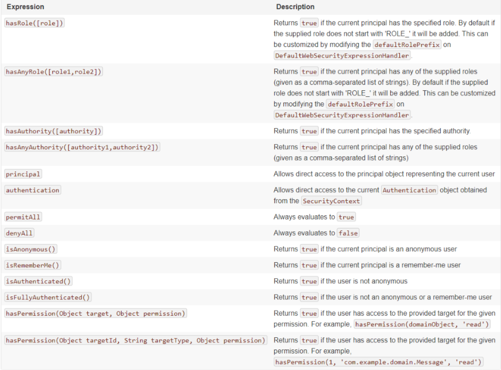

# 2023.7.18

## 一、redis配置文件

配置数据的序列化

```java
package com.nbnfsoft.institution.config;

import com.fasterxml.jackson.annotation.JsonAutoDetect;
import com.fasterxml.jackson.annotation.PropertyAccessor;
import com.fasterxml.jackson.databind.ObjectMapper;
import org.springframework.cache.annotation.CachingConfigurerSupport;
import org.springframework.cache.annotation.EnableCaching;
import org.springframework.context.annotation.Bean;
import org.springframework.context.annotation.Configuration;
import org.springframework.data.redis.connection.RedisConnectionFactory;
import org.springframework.data.redis.core.RedisTemplate;
import org.springframework.data.redis.serializer.StringRedisSerializer;

/**
 * redis配置
 * 
 * @author ruoyi
 */

//声明当前为配置类
@Configuration
//开启springboot的缓存功能
@EnableCaching
public class RedisConfig extends CachingConfigurerSupport
{
    //使其称为Bean对象
    @Bean
    //屏蔽多类型警告
    @SuppressWarnings(value = { "unchecked", "rawtypes" })
    public RedisTemplate<Object, Object> redisTemplate(RedisConnectionFactory connectionFactory)
    {
        RedisTemplate<Object, Object> template = new RedisTemplate<>();
        //设置连接
        template.setConnectionFactory(connectionFactory);
		
        //使用FastJson2JsonRedisSerializer序列化和反序列化redis的value值
        FastJson2JsonRedisSerializer serializer = new FastJson2JsonRedisSerializer(Object.class);

        ObjectMapper mapper = new ObjectMapper();
        //设置jackson在序列化的过程中处理java对象属性的可见性策略
        mapper.setVisibility(PropertyAccessor.ALL, JsonAutoDetect.Visibility.ANY);
        //启用默认类型信息的序列化和反序列化
        //在默认情况下，Java对象在序列化为JSON时不会包含类型信息。这意味着反序列化时，无法确定将JSON转换回哪个具体的Java对象类型。为了解决这个问题，Jackson提供了 enableDefaultTyping 方法，它可以启用在序列化和反序列化过程中自动添加类型信息。
        //ObjectMapper.DefaultTyping.NON_FINAL：表示在序列化和反序列化过程中仅包含非 final 类型的类型信息
        mapper.enableDefaultTyping(ObjectMapper.DefaultTyping.NON_FINAL);
        //设置 FastJson2JsonRedisSerializer 类中的objectMapper
        serializer.setObjectMapper(mapper);

        //指定序列化时的序列化器为 FastJson2JsonRedisSerializer
        template.setValueSerializer(serializer);
        // 使用StringRedisSerializer来序列化和反序列化redis的key值
        template.setKeySerializer(new StringRedisSerializer());
        template.afterPropertiesSet();
        return template;
    }
}

```

#### 为什么redis要进行序列化

序列化最终的目的是为了对象可以跨平台存储，和进行网络传输。 而我们进行跨平台存储和网络传输的方式就是IO，而我们的IO支持的数据格式就是字节数组。   通过上面我想你已经知道了凡是需要进行“跨平台存储”和”网络传输”的数据，都需要进行序列化。

    本质上存储和网络传输 都需要经过 把一个对象状态保存成一种跨平台识别的字节格式，然后其他的平台才可以通过字节信息解析还原对象信息。
    
    redis序列化方式对比：
    
    redis的默认方式是JdkSerializationRedisSerializer
    
    JdkSerializationRedisSerializer: 使用JDK提供的序列化功能。
    
    优点是反序列化时不需要提供类型信息(class)，但缺点是需要实现Serializable接口， 还有序列化后的结果非常庞大，是JSON格式的5倍左右，这样就会消耗redis服务器的大量内存。
    
    Jackson2JsonRedisSerializer： 使用Jackson库将对象序列化为JSON字符串。
    
    优点是速度快，序列化后的字符串短小精悍，不需要实现Serializable接口。
    
    但缺点也非常致命，那就是此类的构造函数中有一个类型参数，必须提供要序列化对象的类型信息(.class对象)。 通过查看源代码，发现其只在反序列化过程中用到了类型信息。


#### 1.缓存的开启

1.开启缓存：@EnableCaching

2.使用缓存：@Cacheable

该注解的作用是将方法的返回结果做缓存
在需要缓存的地方使用@Cacheable注解，例如在service中使用

默认情况 key就是参数名，key可以指定哪个参数名作为缓存的键

使用方式是#a0 #p0 #参数名 #root.args[0]都是指定同一个参数，后面的数字就是选择哪个参数作为键
@Cacheable中的方法
使用方式都是@Cacheable(key=xxx, cacheNames={"name1","name2"} ...)，根据需要添加

```java
	//与cacheNames相同，@AliasFor是取别名
    @AliasFor("cacheNames")
    String[] value() default {};
    @AliasFor("value")
    //缓存组件名，数据存在缓存组件中以key:value的形式存储
    String[] cacheNames() default {};
    
	//与keyGenerator 2选1只能用一个，就是缓存的key
    String key() default "";
	//key的生成器；可以自己指定key的组件id 与上面的key二选一使用
    String keyGenerator() default "";
	//指定缓存管理器；或者cacheResolver指定获取解析器
    String cacheManager() default "";
    //
    String cacheResolver() default "";
    //指定符合条件的情况才缓存，例如condition="#id>0"
    String condition() default "";
    /*
    否定缓存，当unless指定条件为true，方法返回值就不会被缓存；
    可以获取到结果进行判断。 unless="#result==null"
    */
    String unless() default "";
    //是否使用异步模式
    boolean sync() default false;

```

#### 2.RedisTemplate

 XXXTemplate 是 Spring 的一大设计特色，其中，RedisTemplate 功能是提供对 Redis 的支持。

RedisTemplate  是 Spring Boot 访问 Redis 的核心组件，是 SpringBoot 集成 Redis 的客户端方式。它的底层通过 RedisConnectionFactory 对多种 Redis 驱动进行集成，上层通过 XXXOperations 提供丰富的 API，并结合 Spring 基于泛型的 bean 注入，未开发提供了极大的便利。

RedisConnection提供了接受和返回二进制值（字节数组）的低级方法，我们直接去使用RedisConnection操作redis的话无意效率太低（使用原生JDBC便能体会到这一点）所以便有了RedisTemplate , 它负责序列化和连接管理，使用户无需处理此类细节。 使操作redis 更简单高效RedisTemplate是Spring Data Redis库提供的一个类，它用于简化与Redis数据库的交互和操作。

Redis是一种高性能的键值存储数据库，常用于缓存、分布式会话管理和消息队列等应用场景。RedisTemplate提供了在Java应用程序中与Redis进行交互的一组方便的方法和功能。

RedisTemplate是一个泛型类，其中有两个类型参数：Key和Value。这允许开发人员将不同类型的数据存储到Redis中，并且RedisTemplate会根据指定的序列化器将数据转换为字节流进行存储。

除了基本的CRUD操作外，RedisTemplate还提供了其他功能，如集合操作、事务支持、管道操作、分布式锁等。它还与Spring框架的其他部分（如Spring Cache）紧密集成，使得在Spring应用程序中使用Redis更加方便。

总之，RedisTemplate是Spring Data Redis库中的一个关键类，它简化了Java应用程序与Redis数据库之间的交互，提供了丰富的功能和便利的API，使开发人员能够轻松地使用Redis作为数据存储和缓存解决方案。

#### 3. application.yml配置

```yml
spring:
  # redis 配置
  redis:
    database: 8
    # 地址
    host: 127.0.0.1
    # 端口，默认为6379
    port: 6379
    # 密码
    password:
    # 连接超时时间
    timeout: 10s
    lettuce:
      pool:
        # 连接池中的最小空闲连接
        min-idle: 0
        # 连接池中的最大空闲连接
        max-idle: 8
        # 连接池的最大数据库连接数
        max-active: 8
        # #连接池最大阻塞等待时间（使用负值表示没有限制）
        max-wait: -1ms
```

#### 4.使用ValueOperations操作Redis

```java
public interface ValueOperations<K, V> {
	//设置一个key和value
    void set(K var1, V var2);
    
	//设置一个key和value，在规定时间内有效 long ：超时时间  TimeUnit：超时时间单位
    void set(K var1, V var2, long var3, TimeUnit var5);
	
	//如果不存在，则设置一个key和value
    @Nullable
    Boolean setIfAbsent(K var1, V var2);
	
	//需要设置的key和值以map的形式批量设置
    void multiSet(Map<? extends K, ? extends V> var1);

	//如果不存在，则设置key和value  批量设置
    @Nullable
    Boolean multiSetIfAbsent(Map<? extends K, ? extends V> var1);

	//根据key获取值
    @Nullable
    V get(Object var1);
	
	//设置新值，返回旧值，如果不存在当前key返回null
    @Nullable
    V getAndSet(K var1, V var2);

	//根据集合中的key批量获取value
    @Nullable
    List<V> multiGet(Collection<K> var1);
	
	//以增量的形式改变key对应的值。如 旧值为1，现在delta字段为2，最终接口为1+2=3；如果值不能进行加减运算会报异常
    @Nullable
    Long increment(K var1, long var2);

	//增量的数据类型是double类型
    @Nullable
    Double increment(K var1, double var2);

	//在原有的key对应的值的基础上追加新的值
    @Nullable
    Integer append(K var1, String var2);

	//根据起始和结束位置，截取指定key对应的值，返回一个新的字符串
    @Nullable
    String get(K var1, long var2, long var4);

	//根据偏移量修改值，如果当前key存在已经存在则根据偏移量覆盖值
    void set(K var1, V var2, long var3);

	// 根据key获取对应value的长度
    @Nullable
    Long size(K var1);

	//redis中数据是以二进制存储，该方法是在二进制的数据中进行偏移 boolean类型 true代表1 false 代表 0；
    @Nullable
    Boolean setBit(K var1, long var2, boolean var4);

	//根据偏移量获取key对应value，返回的是boolean类型， true代表1 false 代表 0；
    @Nullable
    Boolean getBit(K var1, long var2);

    RedisOperations<K, V> getOperations();
}

```

#### 5.RedisConnection

RedisConnection提供了Redis通信的核心构建块, 和JDBC中的Connection类似

RedisConnection 需要使用 RedisConnectionFactory获取

#### 6. RedisConnectionFactory

RedisConnectionFactory 常用的有两种连接器的实现： Lettuce Connector 和 Jedis Connector，两种实现方式的配置也很简单，如下：

- Lettuce （spring-boot-redis的默认RedisConnectionFactory的默认实现）

```
  <dependency>
    <groupId>io.lettuce</groupId>
    <artifactId>lettuce-core</artifactId>
    <version>5.3.1.RELEASE</version>
  </dependency>
```

```
  @Bean
  public LettuceConnectionFactory redisConnectionFactory() {
    return new LettuceConnectionFactory(new RedisStandaloneConfiguration("server", 6379));
  }
```

- Jedis

```
  <dependency>
    <groupId>redis.clients</groupId>
    <artifactId>jedis</artifactId>
    <version>3.3.0</version>
  </dependency>
```

```
  @Bean
  public JedisConnectionFactory redisConnectionFactory() {
    RedisStandaloneConfiguration config = new RedisStandaloneConfiguration("server", 6379);
    return new JedisConnectionFactory(config);
  }
```


#### 7、数据的序列化

Redis中存储的数据仅为字节。虽然Redis本身支持各种类型，但在大多数情况下，它们是指数据的存储方式，而不是其表示的内容。由用户决定是否将信息转换为字符串或任何其他对象。 在Spring Data中，用户（自定义）类型和原始数据之间的转换（反之亦然）由org.springframework.data.redis.serializer包中序列化器处理。

spring内置了这几种序列化器：（所有的序列化器都是 RedisSerializer 的实现）


#### 8.afterPropertiesSet

在spring的bean的生命周期中，实例化->生成对象->属性填充后会进行afterPropertiesSet方法，这个方法可以用在一些特殊情况中，也就是某个对象的某个属性需要经过外界得到，比如说查询数据库等方式，这时候可以用到spring的该特性，只需要实现InitializingBean即可：

#### 9.setValueSerializer

`setValueSerializer` 是 RedisTemplate 类的一个方法，用于设置在将值序列化为字节数组进行存储时所使用的序列化器。

在 Redis 中，键和值都是以字节数组的形式进行存储的。当需要将 Java 对象作为值存储到 Redis 中时，就需要将该对象序列化为字节数组。RedisTemplate 提供了一种灵活的方式来选择序列化器，并通过 `setValueSerializer` 方法进行设置。

`setValueSerializer` 方法接受一个参数，即实现了 RedisSerializer 接口的序列化器对象。RedisSerializer 是 Spring Data Redis 库定义的接口，它提供了将对象序列化为字节数组以及将字节数组反序列化为对象的方法。

常见的 RedisSerializer 实现包括：

- StringRedisSerializer：将值序列化为字符串，并将其转换为字节数组进行存储。
- JdkSerializationRedisSerializer：使用 Java 默认的序列化机制将对象序列化为字节数组。但由于效率较低且不易阅读，通常在分布式环境下不推荐使用。
- Jackson2JsonRedisSerializer：将对象序列化为 JSON 格式的字节数组，使用 Jackson 库实现。这种序列化方式通常比较常见，因为 JSON 可读性好且通用性强。

示例代码如下所示：

```
java复制代码RedisTemplate<String, Object> redisTemplate = new RedisTemplate<>();
redisTemplate.setConnectionFactory(redisConnectionFactory);

// 设置值的序列化器为 Jackson2JsonRedisSerializer
redisTemplate.setValueSerializer(new Jackson2JsonRedisSerializer<>(Object.class));
```

通过调用 `setValueSerializer` 方法，我们可以将 RedisTemplate 的值序列化器设置为适合应用程序需求的实现，从而在存储对象时进行自定义的序列化操作。


#### 10.ObjectMapper

ObjectMapper类(com.fasterxml.jackson.databind.ObjectMapper)是Jackson的主要类，它可以帮助我们快速的进行各个类型和Json类型的相互转换。


**引入Jackson依赖：**

```xml
<!-- 根据自己需要引入相关版本依赖。 -->
<dependency>
  <groupId>com.fasterxml.jackson.core</groupId>
  <artifactId>jackson-core</artifactId>
  <version>2.9.10</version>
</dependency>
 
<dependency>
  <groupId>com.fasterxml.jackson.core</groupId>
  <artifactId>jackson-databind</artifactId>
  <version>2.9.10</version>
</dependency>
 
<dependency>
  <groupId>com.fasterxml.jackson.core</groupId>
  <artifactId>jackson-annotations</artifactId>
  <version>2.9.10</version>
</dependency>
```


**一些常用方法：**

1.json字符串转对象

```java
ObjectMapper mapper = new ObjectMapper();
String jsonString = "{\"name\":\"Hyl\", \"age\":20}";
 
//将字符串转换为对象
Student student = mapper.readValue(jsonString, Student.class);
System.out.println(student);
 
//将对象转换为json字符串
jsonString = mapper.writeValueAsString(student);
System.out.println(jsonString);
 
 
结果：
Student [ name: Hyl, age: 20 ]
 
{
  "name" : "Hyl",
  "age" : 20
}
 
```


2. 数组和对象之间转换

```java
//对象转为byte数组
byte[] byteArr = mapper.writeValueAsBytes(student);
System.out.println(byteArr);
 
 
//byte数组转为对象
Student student= mapper.readValue(byteArr, Student.class);
System.out.println(student);
 
结果：
[B@3327bd23
 
Student [ name: Hyl, age: 20 ]
```


3.集合和json字符串之间转换

​	

```java
List<Student> studentList= new ArrayList<>();
studentList.add(new Student("hyl1" ,20 , new Date()));
studentList.add(new Student("hyl2" ,21 , new Date()));
studentList.add(new Student("hyl3" ,22 , new Date()));
studentList.add(new Student("hyl4" ,23 , new Date()));
 
String jsonStr = mapper.writeValueAsString(studentList);
System.out.println(jsonStr);
        
List<Student> studentList2 = mapper.readValue(jsonStr, List.class);
System.out.println("字符串转集合：" + studentList2 );
 
结果：
[ {
  "name" : "hyl1",
  "age" : 20,
  "sendTime" : 1525164212803
}, {
  "name" : "hyl2",
  "age" : 21,
  "sendTime" : 1525164212803
}, {
  "name" : "hyl3",
  "age" : 22,
  "sendTime" : 1525164212803
}, {
  "name" : "hyl4",
  "age" : 23,
  "sendTime" : 1525164212803
} ]
[{name=hyl1, age=20, sendTime=1525164212803}, {name=hyl2, age=21, sendTime=1525164212803}, {name=hyl3, age=22, sendTime=1525164212803}, {name=hyl4, age=23, sendTime=1525164212803}]
```

d. map和json字符串之间转换

```
Map<String, Object> testMap = new HashMap<>();
testMap.put("name", "22");
testMap.put("age", 20);
testMap.put("date", new Date());
testMap.put("student", new Student("hyl", 20, new Date()));
 
 
String jsonStr = mapper.writeValueAsString(testMap);
System.out.println(jsonStr);
Map<String, Object> testMapDes = mapper.readValue(jsonStr, Map.class);
System.out.println(testMapDes);
 
结果：
{
  "date" : 1525164212803,
  "name" : "22",
  "student" : {
    "name" : "hyl",
    "age" : 20,
    "sendTime" : 1525164212803,
    "intList" : null
  },
  "age" : 20
}
{date=1525164212803, name=22, student={name=hyl, age=20, sendTime=1525164212803, intList=null}, age=20}
```

e. 日期转json字符串

```
// 修改时间格式
mapper.setDateFormat(new SimpleDateFormat("yyyy-MM-dd HH:mm:ss"));
Student student = new Student ("hyl",21, new Date());
student.setIntList(Arrays.asList(1, 2, 3));
 
String jsonStr = mapper.writeValueAsString(student);
System.out.println(jsonStr);
 
结果：
{
  "name" : "hyl",
  "age" : 21,
  "sendTime" : "2020-07-23 13:14:36",
  "intList" : [ 1, 2, 3 ]
}
```

js中将字符串转换为json对象

```
var data = "{\"name\":\"Hyl\", \"age\":20}";
var student = eval(data);
console.info(student.name);
console.info(student.age);
 
 
结果：
Hyl
20
```


#### 11.setVisibility

`setVisibility` 是 Jackson `ObjectMapper` 类的一个方法，用于设置Jackson在序列化和反序列化过程中处理Java对象属性可见性的策略。

在默认情况下，Jackson会根据Java对象的属性的修饰符来确定其可见性。但通过使用 `setVisibility` 方法，您可以更改Jackson的可见性策略，并控制序列化和反序列化过程中哪些属性应该被包含或排除。

`setVisibility` 方法接受一个参数，即所需的可见性策略，以及一个可变长度的参数，用于指定要设置的可见性级别。

常见的可见性级别包括：

- `JsonAutoDetect.Visibility.ANY`：所有字段（包括私有、受保护、默认和公共）都可见。
- `JsonAutoDetect.Visibility.NONE`：没有字段是可见的。
- `JsonAutoDetect.Visibility.PUBLIC_ONLY`：仅公共字段可见。

示例代码如下所示：

```
java复制代码ObjectMapper objectMapper = new ObjectMapper();

// 设置所有字段都可见
objectMapper.setVisibility(PropertyAccessor.ALL, JsonAutoDetect.Visibility.ANY);
```

通过调用 `setVisibility` 方法，您可以根据自己的需求自定义Jackson的可见性策略。这样，您可以灵活地控制序列化和反序列化过程中哪些属性应该包含在JSON中，以及应该如何访问它们。

需要注意的是，`setVisibility` 方法是针对整个 `ObjectMapper` 实例的设置，因此它会影响到该实例在后续序列化和反序列化操作中的行为。


`PropertyAccessor.ALL` 是 Jackson 库中的一个枚举常量，表示允许访问所有属性（字段）的可见性级别。

在 Jackson 中，`PropertyAccessor` 枚举定义了不同的可见性级别，用于控制序列化和反序列化过程中要包含的属性。`PropertyAccessor.ALL` 是其中之一，它指定了最宽松的可见性级别，即所有类型的属性都可见，包括私有、受保护、默认和公共属性。

当将 `PropertyAccessor.ALL` 作为参数传递给 Jackson 的 `setVisibility` 方法时，它将应用于 `ObjectMapper` 实例，以确保在序列化和反序列化过程中能够访问和处理所有属性。这意味着在使用该实例进行对象转换时，所有属性都将被包含在生成的 JSON 或从 JSON 解析的对象中。

示例代码如下所示：

```
java复制代码ObjectMapper objectMapper = new ObjectMapper();

// 设置所有属性可见
objectMapper.setVisibility(PropertyAccessor.ALL, JsonAutoDetect.Visibility.ANY);
```

请注意，将属性设置为可见可能会导致序列化和反序列化的结果包含更多的属性，这可能会增加数据大小或引入潜在的安全风险。因此，在设置可见性级别时，请谨慎考虑您的需求，并确保符合数据的安全性和隐私性要求。


#### 12、 FastJson2JsonRedisSerializer 类中的ObjectMapper方法

在 FastJson2JsonRedisSerializer 类中，没有 `setObjectMapper` 方法。这是因为 FastJson2JsonRedisSerializer 是一个专门用于 RedisTemplate 的类，它使用 Fastjson 库作为序列化和反序列化 JSON 的工具，并不涉及 Jackson 的 ObjectMapper。

如果您希望自定义 FastJson2JsonRedisSerializer 使用的 ObjectMapper 对象，可以通过构造函数传入自定义的 ObjectMapper 对象来实现。以下是示例代码：

```
java复制代码FastJson2JsonRedisSerializer<Object> serializer = new FastJson2JsonRedisSerializer<>(Object.class, customObjectMapper);
```

在上述代码中，我们创建了一个自定义的 ObjectMapper 对象 `customObjectMapper`，然后将其作为参数传递给 FastJson2JsonRedisSerializer 的构造函数。这样，FastJson2JsonRedisSerializer 将使用您自定义的 ObjectMapper 对象进行序列化和反序列化操作。


#### 配置redis的序列化文件

```java
package com.nbnfsoft.institution.config;

import com.fasterxml.jackson.annotation.JsonAutoDetect;
import com.fasterxml.jackson.annotation.PropertyAccessor;
import com.fasterxml.jackson.databind.ObjectMapper;
import org.springframework.cache.annotation.CachingConfigurerSupport;
import org.springframework.cache.annotation.EnableCaching;
import org.springframework.context.annotation.Bean;
import org.springframework.context.annotation.Configuration;
import org.springframework.data.redis.connection.RedisConnectionFactory;
import org.springframework.data.redis.core.RedisTemplate;
import org.springframework.data.redis.serializer.StringRedisSerializer;

/**
 * redis配置
 * 
 * @author ruoyi
 */
@Configuration
@EnableCaching
public class RedisConfig extends CachingConfigurerSupport
{
    @Bean
    @SuppressWarnings(value = { "unchecked", "rawtypes" })
    public RedisTemplate<Object, Object> redisTemplate(RedisConnectionFactory connectionFactory)
    {
        RedisTemplate<Object, Object> template = new RedisTemplate<>();
        template.setConnectionFactory(connectionFactory);

        FastJson2JsonRedisSerializer serializer = new FastJson2JsonRedisSerializer(Object.class);

        ObjectMapper mapper = new ObjectMapper();
        mapper.setVisibility(PropertyAccessor.ALL, JsonAutoDetect.Visibility.ANY);
        mapper.enableDefaultTyping(ObjectMapper.DefaultTyping.NON_FINAL);
        serializer.setObjectMapper(mapper);

        template.setValueSerializer(serializer);
        // 使用StringRedisSerializer来序列化和反序列化redis的key值
        template.setKeySerializer(new StringRedisSerializer());
        template.afterPropertiesSet();
        return template;
    }
}

```

```java
package com.nbnfsoft.institution.config;

import com.alibaba.fastjson2.JSONReader;
import com.alibaba.fastjson2.JSONWriter;
import com.alibaba.fastjson2.filter.Filter;
import com.fasterxml.jackson.databind.JavaType;
import com.fasterxml.jackson.databind.ObjectMapper;
import com.fasterxml.jackson.databind.type.TypeFactory;
import org.springframework.data.redis.serializer.RedisSerializer;
import org.springframework.data.redis.serializer.SerializationException;
import org.springframework.util.Assert;

import java.nio.charset.Charset;

/**
 * Redis使用FastJson序列化
 * 
 * @author louyi
 */
public class FastJson2JsonRedisSerializer<T> implements RedisSerializer<T>
{
    @SuppressWarnings("unused")
    private ObjectMapper objectMapper = new ObjectMapper();

    public static final Charset DEFAULT_CHARSET = Charset.forName("UTF-8");

    private Class<T> clazz;

    final Filter autoTypeFilter = JSONReader.autoTypeFilter(
            "com.nbnfsoft.institution",
            "com.alibaba"
    );

    public FastJson2JsonRedisSerializer(Class<T> clazz)
    {
        super();
        this.clazz = clazz;
    }

    @Override
    public byte[] serialize(T t) throws SerializationException
    {
        if (t == null)
        {
            return new byte[0];
        }
        return com.alibaba.fastjson2.JSON.toJSONBytes(t, JSONWriter.Feature.WriteClassName);
    }

    @Override
    public T deserialize(byte[] bytes) throws SerializationException
    {
        if (bytes == null || bytes.length <= 0)
        {
            return null;
        }
        String str = new String(bytes, DEFAULT_CHARSET);

        return  com.alibaba.fastjson2.JSON.parseObject(str,clazz,autoTypeFilter);
    }

    public void setObjectMapper(ObjectMapper objectMapper)
    {
        Assert.notNull(objectMapper, "'objectMapper' must not be null");
        this.objectMapper = objectMapper;
    }

    protected JavaType getJavaType(Class<?> clazz)
    {
        return TypeFactory.defaultInstance().constructType(clazz);
    }
}

```


## 二、@Configuration和@Bean

在配置类中，可以使用 `@Bean` 注解来定义一个 bean。`@Bean` 注解用于标记一个方法，并将其返回的对象注册为 Spring 容器中的一个 bean。

下面是使用 `@Bean` 注解在配置类中定义一个 bean 的示例：

```
java复制代码@Configuration
public class AppConfig {
    
    @Bean
    public BeanType beanName() {
        return new BeanType();
    }
}
```

在上述示例中，`AppConfig` 是一个配置类，通过 `@Configuration` 注解进行标记。然后，使用 `@Bean` 注解标记了一个方法 `beanName()`，该方法返回一个实例化的 `BeanType` 对象。Spring 容器会自动识别这个方法，并将其返回的对象注册为一个 bean，bean 的名称默认为方法名（即 "beanName"）。

通过在配置类中使用 `@Bean` 注解，您可以灵活地定义和配置需要的 bean 对象，并将其添加到 Spring 容器中供其他组件使用。注意，`@Bean` 注解可以接受其他参数，例如指定 bean 的名称、指定依赖等，以满足更复杂的配置需求。


注意：在没有使用 `@Configuration` 注解的情况下，是无法使用 `@Bean` 注解的。

`@Bean` 注解通常与 `@Configuration` 注解一起使用，用于表示一个类是配置类，并且其中的方法将被用于定义和注册 bean 对象。

`@Configuration` 注解告诉 Spring 容器该类是一个配置类，Spring 在启动时会扫描这些配置类，并根据其中的 `@Bean` 注解来创建相应的 bean 实例。

如果您不想使用 `@Configuration` 注解，但仍希望使用 `@Bean` 注解来定义 bean，可以考虑以下两种方式：

1. 使用 XML 配置：代替使用注解配置，使用传统的 XML 配置文件来定义和配置 bean。
2. 通过组件扫描自动检测：Spring 提供了组件扫描机制，可以自动检测带有 `@Component` 或其他相关注解的类，并将其作为 bean 注册到容器中。这样，在类上添加相应的注解后，即可将其作为 bean 使用。

需要注意的是，使用 `@Configuration` 注解能够提供更多的功能和灵活性，因为它支持注入依赖、条件化装配等高级特性。因此，通常建议使用 `@Configuration` 注解来作为配置类的标识，并结合 `@Bean` 注解来定义 bean 对象。


## 三、HttpServletRequest

**HttpServletRequest和ServletRequest的关系：**

HttpServletRequest 是 Servlet API 的一部分，它是 Servlet 规范中定义的一个接口。而 ServletRequest 则是 HttpServletRequest 接口的父接口。

ServletRequest 定义了与 HTTP 请求相关的通用方法，例如获取参数、属性、输入流等。它提供了对请求的基本信息的访问和操作。

HttpServletRequest 接口继承自 ServletRequest 接口，并在此基础上添加了与 HTTP 请求特定的方法和属性。它包含了与 HTTP 请求相关的更详细的信息和功能，例如获取请求 URL、获取请求头、获取会话信息、获取 Cookie 等。

可以将 HttpServletRequest 视为 ServletRequest 接口的扩展，它提供了更多针对 HTTP 请求的功能和访问方式。

在编写 Web 应用程序时，通常会使用 HttpServletRequest 对象来处理和获取关于 HTTP 请求的信息，而 ServletRequest 则提供了更通用的方法，可适用于其他类型的请求，不仅限于 HTTP 请求。

总结：HttpServletRequest 是 ServletRequest 的子接口，提供了更多与 HTTP 请求相关的功能和访问方式。通常在开发中，我们更常使用 HttpServletRequest 对象来处理和获取关于 HTTP 请求的信息。

**HttpServleletRequest接口的实现类：**

在 Java 中，接口是一种抽象类型，它定义了一组方法的契约。虽然接口本身不能直接实例化，但可以使用多态的方式来引用以及调用接口的方法。

HttpServletRequest 接口是 Servlet 规范中定义的一个接口，具体的实现类由服务器容器提供并进行实例化。在编写 Web 应用程序时，在处理 HTTP 请求的过程中，服务器容器会创建并传递一个 HttpServletRequest 对象作为参数给相应的处理方法。

因为 HttpServletRequest 是接口，而实际运行时会有具体的实现类对象，所以可以通过向上转型的方式将具体的实现类对象赋值给 HttpServletRequest 类型的变量。这样，我们就可以通过该变量调用 HttpServletRequest 接口中定义的方法。

示例代码：

```
java复制代码public void doGet(HttpServletRequest request, HttpServletResponse response) {
    // 调用 HttpServletRequest 接口的方法
    String method = request.getMethod();
    String pathInfo = request.getPathInfo();
    // ...
}
```

在上述示例中，doGet 方法的参数中声明了一个 HttpServletRequest 对象，该对象在请求到达时由服务器容器创建并传递进来。然后，我们就可以通过该对象调用 HttpServletRequest 接口中定义的方法，如 getMethod()、getPathInfo() 等。

通过这种方式，我们可以方便地使用 HttpServletRequest 接口中的方法，而无需关心具体的实现类是什么。这符合面向接口编程的原则，提高了代码的可扩展性和灵活性。


## 四、SpringSecurity相关

**token服务工具类：**

```java
package com.nbnfsoft.institution.framework.security.service;

import com.alibaba.fastjson2.JSON;
import com.alibaba.fastjson2.JSONArray;
import com.alibaba.fastjson2.JSONObject;
import com.google.common.collect.Lists;
import com.nbnfsoft.institution.common.constant.SystemConstants;
import com.nbnfsoft.institution.domain.dto.HospitalDto;
import com.nbnfsoft.institution.framework.redis.RedisCache;
import com.nbnfsoft.institution.framework.security.LoginUser;
import com.nbnfsoft.institution.utils.SecurityUtils;
import org.apache.commons.lang3.StringUtils;
import org.slf4j.Logger;
import org.slf4j.LoggerFactory;
import org.springframework.beans.factory.annotation.Autowired;
import org.springframework.beans.factory.annotation.Value;
import org.springframework.stereotype.Component;

import javax.servlet.http.HttpServletRequest;
import java.util.List;
import java.util.concurrent.TimeUnit;

/**
 * token验证处理
 *
 * @author louyi
 */
@Component
public class TokenService {
    private Logger logger = LoggerFactory.getLogger(this.getClass());
    // 令牌自定义标识
    @Value("${token.header}")
    private String header;

    // 令牌有效期（默认120分钟）
    @Value("${token.expireTime}")
    private int expireTime;

    //定义秒
    protected static final long MILLIS_SECOND = 1000;

    //定义分
    protected static final long MILLIS_MINUTE = 60 * MILLIS_SECOND;

    //20分钟
    private static final Long MILLIS_MINUTE_TEN = 20 * 60 * 1000L;

    @Autowired
    private RedisCache redisCache;

    /**
     * 获取用户身份信息
     *
     * @return 用户信息
     */
    public LoginUser getLoginUser(HttpServletRequest request) {
        try {
            // 获取请求头中携带的令牌jwt
            String token = getToken(request);
            
            //当前登录已经登录
            if (StringUtils.isNotEmpty(token)) {
                //从redis中获取对应token的用户信息
                JSONObject jsonObject = redisCache.getCacheObject(SystemConstants.LOGIN_TOKEN_KEY + token);
                //将用户的信息封装到loginUser类中
                if (jsonObject != null) {
                    LoginUser loginUser = new LoginUser();
                    JSONObject payload = jsonObject.getJSONObject("Payload");
                    loginUser.setToken(payload.getString("token"));
                    loginUser.setUserId(payload.getLongValue("user_id"));
                    loginUser.setEmpCode(payload.getString("emp_code"));
                    loginUser.setEmpName(payload.getString("emp_name"));
                    loginUser.setHospitalId(payload.getLongValue("hospital_id"));
                    loginUser.setOpenId(payload.getString("open_id"));
                    loginUser.setPassword(payload.getString("password"));
                    loginUser.setOrgId(payload.getLongValue("org_id"));
                    loginUser.setLoginTime(payload.getLongValue("loginTime"));
                    loginUser.setExpireTime(payload.getLongValue("expireTime"));
                    loginUser.setSysAdmin(payload.getString("is_admin"));
                    loginUser.setPower(JSON.parseArray(payload.getString("power"), String.class));
                    List<HospitalDto> hospitalDtoList = Lists.newArrayList();
                    JSONArray array = payload.getJSONArray("hospitals");
                    if (array != null && !array.isEmpty()) {
                        for (int i = 0; i < array.size(); i++) {
                            JSONObject h = array.getJSONObject(i);
                            HospitalDto dto = new HospitalDto();
                            dto.setId(h.getLongValue("id"));
                            dto.setHospitalName(h.getString("hospital_name"));
                            dto.setHospitalCode(h.getString("hospital_code"));
                            hospitalDtoList.add(dto);
                        }
                    }
                    loginUser.setHospitals(hospitalDtoList);
                    //返回当前登录用户信息
                    return loginUser;
                }
            }
        } catch (Exception e) {
            logger.error("", e);
        }
        //当前用户未登录
        return null;
    }

    /**
     * 验证令牌有效期，相差不足20分钟，自动刷新缓存
     *
     * @param loginUser
     * @return 令牌
     */
    public void verifyToken(LoginUser loginUser) {
        //获取当前用户的令牌的有效期
        long expireTime = loginUser.getExpireTime();
        //获取当前系统时间
        long currentTime = System.currentTimeMillis();
        //判断当前有效期是否过期
        if (expireTime - currentTime <= MILLIS_MINUTE_TEN) {
            //刷新当前用户的令牌有效期
            refreshToken(loginUser);
        }
    }

    /**
     * 刷新令牌有效期
     *
     * @param loginUser 登录信息
     */
    public void refreshToken(LoginUser loginUser) {
        //设置当前用户登录时间为当前系统时间
        loginUser.setLoginTime(System.currentTimeMillis());
        //设置当前用户的令牌有效期为当前登录时间 + 令牌有效期 * 分钟数
        loginUser.setExpireTime(loginUser.getLoginTime() + expireTime * MILLIS_MINUTE);
        // 根据uuid将loginUser缓存
        //参数：
        //1.loginUser.getToken())：缓存的键值     用户token对应的uuid
        //2.buildTokenValue(loginUser)：缓存的值   用户的信息转化为JSONObject格式
        //3.expireTime：时间            有效期
        //4.TimeUnit.MINUTES：时间颗粒度           即有效期的单位 
        redisCache.setCacheObject(getTokenKey(loginUser.getToken()), buildTokenValue(loginUser), expireTime, TimeUnit.MINUTES);
    }

    /**
     * 获取请求token
     *
     * @param request
     * @return token
     */
    private String getToken(HttpServletRequest request) {
        //String request.getHeader(String name)是HttpServletRequest接口中的一个方法，用于获取HTTP请求头中指定名称的值
        //参数name表示要获取的请求头名称，该方法返回一个String类型的值（表示指定请求头的值）
        //这里是获取request请求中的header
        return request.getHeader(header);
    }
	
    
    //获取登录用户的jwt（token），以uuid的方式存放作为建存放到redis中去
    private String getTokenKey(String uuid) {
        return SystemConstants.LOGIN_TOKEN_KEY + uuid;
    }

    /**
     * 兼容老的OA
     *
     * @param loginUser
     * @return
     */
    private JSONObject buildTokenValue(LoginUser loginUser) {
        JSONObject payload = new JSONObject();
        payload.put("token", loginUser.getToken());
        payload.put("user_id", loginUser.getUserId());
        payload.put("emp_code", loginUser.getEmpCode());
        payload.put("emp_name", loginUser.getEmpName());
        payload.put("password", loginUser.getPassword());
        payload.put("org_id", loginUser.getOrgId());
        payload.put("hospital_id", loginUser.getHospitalId());
        payload.put("open_id", loginUser.getOpenId());
        payload.put("org_name", loginUser.getOrgName());
        payload.put("loginTime", loginUser.getLoginTime());
        payload.put("expireTime", loginUser.getExpireTime());
        payload.put("is_admin", loginUser.getSysAdmin());
        payload.put("power",loginUser.getPower());
        //老系统用的，兼容
        payload.put("system", new JSONArray());

        JSONArray array = new JSONArray();
        loginUser.getHospitals().forEach(i -> {
            JSONObject h = new JSONObject();
            h.put("id", i.getId());
            h.put("hospital_name", i.getHospitalName());
            h.put("hospital_code", i.getHospitalCode());
            array.add(h);
        });
        payload.put("hospitals", array);
        JSONObject jsonObject = new JSONObject();
        jsonObject.put("Payload", payload.toJSONString());
        jsonObject.put("Type", SystemConstants.OA_TYPE);
        return jsonObject;
    }

    //判断当前登录用户是否有某一个权限
    public boolean hasAuthority(String power) {
        return SecurityUtils.getLoginUser().auth(power);
    }
}

```


#### 分析：

**1.对于上面获取token的分析**

```java
// 令牌自定义标识
@Value("${token.header}")
private String header;

// 令牌有效期（默认120分钟）
@Value("${token.expireTime}")
private int expireTime;


/**
     * 获取请求token
     *
     * @param request
     * @return token
     */
private String getToken(HttpServletRequest request) {
    //String request.getHeader(String name)是HttpServletRequest接口中的一个方法，用于获取HTTP请求头中指定名称的值
    //参数name表示要获取的请求头名称，该方法返回一个String类型的值（表示指定请求头的值）
    //这里是获取request请求中的header
    return request.getHeader(header);
}
```

这里的head是从配置文件中引入的

```yml
//application.yml 配置文件中的内容
token:
  # 令牌自定义标识
  header: Authorization
  # 令牌有效期（默认24小时）
  expireTime: 1440
```

如果您希望在 HTTP 请求头中添加一个自定义的字段来传递 token，您可以使用自定义的请求头字段。一种常见的做法是将 token 放置在请求头的 `Authorization` 字段中进行传递。

在上述示例中，我们通过调用 `getHeader()` 方法并传入 `"Authorization"` 作为参数来获取请求头中的 token 值。然后，我们将返回的 token 值赋给 `token` 变量，以便后续处理。

当发送请求时，您需要在请求头中添加类似于以下的信息：

```
复制代码GET /api/endpoint HTTP/1.1
Host: example.com
Authorization: Bearer your_token_value
```

注意，这只是一种常见的做法，您可以根据实际情况和需求选择适合自己的方式来传递 token。此外，请确保在使用身份验证和授权功能时正确处理和验证 token，以保护您的应用程序的安全性。


**自定义字段的存放位置：**

自定义字段在 HTTP 请求中一般可以放在请求头、请求参数或请求体中进行传递。具体放置的位置取决于您的需求和设计。

以下是常见的几种使用场景和对应的放置位置：

1. 放置在请求头（Request Headers）中：
   - 使用自定义的请求头字段来传递自定义数据，例如 `X-Custom-Field: value`。
   - 常用于传递身份验证信息、自定义 token 等敏感数据。
2. 放置在请求参数中：
   - 将自定义字段作为查询参数添加到 URL 中，例如 `http://example.com/api/endpoint?customField=value`。
   - 适用于一些简单的、非敏感的数据传递。
3. 放置在请求体（Request Body）中：
   - 对于 POST、PUT、PATCH 等请求方法，可以将自定义字段作为表单参数或 JSON/XML 数据放置在请求体中传递。
   - 常用于传递复杂的结构化数据，例如表单提交、JSON API 等。


因此，我们可以将自定义的token信息放在请求头中发送过来。


**2.时间颗粒度**

时间颗粒度是指时间的最小刻度或最小单位。它表示了我们可以在时间中进行测量、记录或操作的最小精度。

常见的时间颗粒度包括：

1. 秒（Seconds）：秒是最常见的时间颗粒度，表示一分钟中的第几秒。
2. 毫秒（Milliseconds）：毫秒是更细粒度的时间单位，表示一秒钟内的第几毫秒。
3. 微秒（Microseconds）：微秒是比毫秒更小的时间单位，表示一秒钟内的第几微秒，等于 0.001 毫秒。
4. 纳秒（Nanoseconds）：纳秒是最小的时间单位，表示一秒钟内的第几纳秒，等于 0.000001 毫秒。

时间颗粒度的选择取决于具体的需求和应用场景。较粗的颗粒度通常适用于一般的时间记录和显示，而较细的颗粒度则适用于需要高精度计时或与实时性要求较高的应用程序，如科学计算、金融交易、物理模拟等。

请注意，在不同的编程语言和平台中，支持的时间颗粒度可能有所不同。因此，要根据具体情况选择适当的时间颗粒度进行处理。

在某些缓存库或框架中，`setCacheObject` 方法可能会包含一个 `TimeUnit` 参数，用于指定时间单位。 `TimeUnit` 是 Java 标准库中的一个枚举类型，提供了表示时间单位的常量。

`TimeUnit` 枚举类定义了以下常量：

- `NANOSECONDS`：纳秒
- `MICROSECONDS`：微秒
- `MILLISECONDS`：毫秒
- `SECONDS`：秒
- `MINUTES`：分钟
- `HOURS`：小时
- `DAYS`：天数

通过将合适的时间单位作为参数传递给 `setCacheObject` 方法，您可以指定设置缓存对象时使用的时间单位。

例如，假设您要将一个对象缓存 10 分钟，您可以按以下方式使用 `TimeUnit.MINUTES`：

```
java复制代码cache.setCacheObject(key, value, 10, TimeUnit.MINUTES);
```

这将把 `value` 对象与键 `key` 相关联，并将其缓存在 10 分钟之后过期。


**3.hasAuthority(String power)方法的说明**

```java
public boolean hasAuthority(String power) {
	return SecurityUtils.getLoginUser().auth(power);
}
```

LoginUser类中的auth方法

作用：判断当前用户是否用于权限power或当前用户是否为管理员

```java
public boolean auth(String power) {
    //判断当前用户的sysAdmin 是否为 T，即判断当前用户是否为管理员
    boolean isAdmin = EnumYesNo.YES.getCode().equals(sysAdmin);
    //判断当前用户的this.power属性中是否有该参数的power，即是否拥有power权限
    boolean hasAuth = CollUtil.isNotEmpty(this.power) && this.power.contains(power);
    //如果用户是管理员或者用户拥有该权限，即范围true，反之返回false
    return isAdmin || hasAuth;
}
```

EnumYesNo存放判断的常量：

```java
package com.nbnfsoft.institution.common.enums;

import com.nbnfsoft.institution.common.constant.SystemConstants;
import com.nbnfsoft.institution.utils.CommonUtil;

import java.util.Arrays;


/**
 * Descriptions: 通用{是；否}状态<p>
 *
 * @author SailHe
 * @date 2020/3/13 16:49
 */
public enum EnumYesNo {
    NO(0, "N", "否"), YES(1, "Y", "是");

    private final Integer value;
    private final String code;
    private final String info;

    EnumYesNo(Integer value, String code, String info) {
        this.value = value;
        this.code = code;
        this.info = info;
    }

    public String getCode() {
        return code;
    }

    public String getInfo() {
        return info;
    }

    public Integer getValue() {
        return value;
    }

    public static String findNameByCode(String code) {
        return CommonUtil.findField(Arrays.stream(values()), code, p -> p.getCode(), p -> p.getInfo(), SystemConstants.UNDEFINED);
    }

    public static String findNameByValue(String valueStr) {
        return CommonUtil.findField(Arrays.stream(EnumYesNo.values()), valueStr,
                p -> p.getValue().toString(), p -> p.getInfo(), SystemConstants.UNDEFINED);
    }
}

```

## SecurityUtils

```java
package com.nbnfsoft.institution.utils;

import com.nbnfsoft.institution.common.constant.HttpStatus;
import com.nbnfsoft.institution.exception.FriendlyException;
import com.nbnfsoft.institution.framework.security.LoginUser;
import org.springframework.security.core.Authentication;
import org.springframework.security.core.context.SecurityContextHolder;

/**
 * 安全服务工具类
 *
 * @author louyi
 */
public class SecurityUtils {
    /**
     * 获取用户账户
     **/
    public static String getUsername() {
        try {
            return getLoginUser().getUsername();
        } catch (Exception e) {
            throw new FriendlyException("获取用户账户异常", HttpStatus.UNAUTHORIZED);
        }
    }


    /**
     * 获取用户账户
     **/
    public static Long getUserId() {
        try {
            return getLoginUser().getUserId();
        } catch (Exception e) {
            throw new FriendlyException("获取用户账户异常", HttpStatus.UNAUTHORIZED);
        }
    }

    /**
     * 获取用户
     **/
    public static LoginUser getLoginUser() {
        try {
            return (LoginUser) getAuthentication().getPrincipal();
        } catch (Exception e) {
            throw new FriendlyException("获取用户信息异常", HttpStatus.UNAUTHORIZED);
        }
    }
    /**
     * 通过SecurityContextHolder去获取Authentication
     */
    public static Authentication getAuthentication() {
        return SecurityContextHolder.getContext().getAuthentication();
    }
}

```


## 自定义用户认证逻辑

```java
package com.nbnfsoft.institution.framework.security.service;


import com.nbnfsoft.institution.framework.security.LoginUser;
import org.slf4j.Logger;
import org.slf4j.LoggerFactory;
import org.springframework.security.core.userdetails.UserDetails;
import org.springframework.security.core.userdetails.UserDetailsService;
import org.springframework.security.core.userdetails.UsernameNotFoundException;
import org.springframework.stereotype.Service;

/**
 * 用户验证处理
 *
 * @author louyi
 */
@Service
public class UserDetailsServiceImpl implements UserDetailsService {
    private static final Logger log = LoggerFactory.getLogger(UserDetailsServiceImpl.class);

    @Override
    public UserDetails loadUserByUsername(String username) throws UsernameNotFoundException {

        return new LoginUser();
    }
}

```


## 认证失败处理类

```java
package com.nbnfsoft.institution.framework.security.handle;

import com.alibaba.fastjson2.JSON;
import com.nbnfsoft.institution.common.constant.HttpStatus;
import com.nbnfsoft.institution.domain.dto.JsonData;
import com.nbnfsoft.institution.utils.ServletUtils;
import org.springframework.security.core.AuthenticationException;
import org.springframework.security.web.AuthenticationEntryPoint;
import org.springframework.stereotype.Component;

import javax.servlet.http.HttpServletRequest;
import javax.servlet.http.HttpServletResponse;
import java.io.IOException;
import java.io.Serializable;

/**
 * 认证失败处理类 返回未授权
 * 
 * @author louyi
 */
@Component
public class AuthenticationEntryPointImpl implements AuthenticationEntryPoint, Serializable
{
    private static final long serialVersionUID = -8970718410437077606L;

    //commence方法，处理未经验证的信息
    @Override
    public void commence(HttpServletRequest request, HttpServletResponse response, AuthenticationException e)
            throws IOException
    {
        //返回未授权的信息给用户
        int code = HttpStatus.SUCCESS;
        ServletUtils.renderString(response, code, JSON.toJSONString(new JsonData(false, code, "会话已过期请重新登录")));
    }
}

```

HttpStatus接口，存放一些响应的信息

```java
package com.nbnfsoft.institution.common.constant;

/**
 * 返回状态码
 * 
 * @author louyi
 */
public interface HttpStatus
{
    /**
     * 操作成功
     */
    public static final int SUCCESS = 200;

    /**
     * 对象创建成功
     */
    public static final int CREATED = 201;

    /**
     * 请求已经被接受
     */
    public static final int ACCEPTED = 202;

    /**
     * 操作已经执行成功，但是没有返回数据
     */
    public static final int NO_CONTENT = 204;

    /**
     * 资源已被移除
     */
    public static final int MOVED_PERM = 301;

    /**
     * 重定向
     */
    public static final int SEE_OTHER = 303;

    /**
     * 资源没有被修改
     */
    public static final int NOT_MODIFIED = 304;

    /**
     * 参数列表错误（缺少，格式不匹配）
     */
    public static final int BAD_REQUEST = 400;

    /**
     * 未授权
     */
    public static final int UNAUTHORIZED = 401;

    /**
     * 访问受限，授权过期
     */
    public static final int FORBIDDEN = 403;

    /**
     * 资源，服务未找到
     */
    public static final int NOT_FOUND = 404;

    /**
     * 不允许的http方法
     */
    public static final int BAD_METHOD = 405;

    /**
     * 资源冲突，或者资源被锁
     */
    public static final int CONFLICT = 409;

    /**
     * 不支持的数据，媒体类型
     */
    public static final int UNSUPPORTED_TYPE = 415;

    /**
     * 系统内部错误
     */
    public static final int ERROR = 500;

    /**
     * 接口未实现
     */
    public static final int NOT_IMPLEMENTED = 501;
}

```


**1.AuthenticationEntryPoint接口**

`AuthenticationEntryPoint` 是一个在 Spring Security 框架中的接口，用于处理未经身份验证的请求。

当用户尝试访问需要身份验证的资源时，如果用户未提供有效的身份验证凭据（如令牌、用户名和密码等），则 Spring Security 将会触发身份验证失败。此时，`AuthenticationEntryPoint` 负责决定如何处理该请求并向用户返回适当的响应。

`AuthenticationEntryPoint` 接口定义了一个方法 `commence()`，该方法接收 HttpServletRequest 和 HttpServletResponse 作为参数，并负责处理未经身份验证的请求。通常在该方法中，您可以实现以下行为：

1. 重定向到登录页面：您可以将请求重定向到登录页面，以便用户进行身份验证，并在成功后再次尝试访问受保护的资源。
2. 返回错误信息：您可以返回一条自定义的错误消息或错误页面，向用户指示需要进行身份验证。
3. 发送认证挑战：您可以向客户端发送一个认证挑战，要求客户端提供有效的身份验证凭据。

以下是示例代码，展示了如何使用 `AuthenticationEntryPoint` 接口：

```java
public class MyAuthenticationEntryPoint implements AuthenticationEntryPoint {

    @Override
    public void commence(HttpServletRequest request, HttpServletResponse response,
                         AuthenticationException authException) throws IOException, ServletException {
        // 处理未经身份验证的请求，例如重定向到登录页面或返回错误信息
        response.sendRedirect("/login");
    }
}
```

在上述示例中，`commence()` 方法将未经身份验证的请求重定向到 "/login" 页面。

**2.实现AuthenticationEntryPoint 接口的序列化**

要实现 `AuthenticationEntryPoint` 接口的序列化，您可以在实现类中添加 `implements Serializable` 关键字。这是因为 `AuthenticationEntryPoint` 接口本身是可序列化的，因此如果您的实现类需要进行序列化（例如，在分布式系统中），则需要显式地声明它实现了 `Serializable` 接口。

下面是一个示例：

```java
import org.springframework.security.web.AuthenticationEntryPoint;
import java.io.Serializable;

public class MyAuthenticationEntryPoint implements AuthenticationEntryPoint, Serializable {
    // 实现类的代码
}
```

通过将 `Serializable` 添加到实现类中，它就具有了序列化的能力。这允许您在需要序列化和反序列化 `MyAuthenticationEntryPoint` 实例的场景中使用它，例如将其存储在缓存中或在网络上传输。

**3.ServletUtils.renderString**

源码：

```java
public static String renderString(HttpServletResponse response,Integer code, String string) {
    try {
        response.setStatus(code);
        response.setContentType("application/json");
        response.setCharacterEncoding("utf-8");
        response.getWriter().print(string);
    } catch (IOException e) {
        e.printStackTrace();
    }
    return null;
}
```

`renderString` 是一个常见的方法名，通常用于将模板或数据渲染为字符串的操作

`response.getWriter().print(string);` 是一个常见的用法，用于将字符串内容发送给客户端作为 HTTP 响应的一部分。它通常在服务器端代码中使用，并结合 Servlet 或类似的技术来生成响应。

这段代码的工作原理如下：

1. `response` 是代表 HTTP 响应的对象，通过它可以与客户端进行交互。
2. `getWriter()` 方法返回一个 `PrintWriter` 对象，用于向客户端发送字符数据。
3. `print(string)` 方法将指定的字符串参数写入到 `PrintWriter` 中，使其成为响应的一部分。


## token过滤器（JwtAuthenticationTokenFilter）

```java
package com.nbnfsoft.institution.framework.security.filter;

import com.nbnfsoft.institution.framework.security.LoginUser;
import com.nbnfsoft.institution.framework.security.service.TokenService;
import com.nbnfsoft.institution.utils.SecurityUtils;
import org.springframework.beans.factory.annotation.Autowired;
import org.springframework.security.authentication.UsernamePasswordAuthenticationToken;
import org.springframework.security.core.context.SecurityContextHolder;
import org.springframework.security.web.authentication.WebAuthenticationDetailsSource;
import org.springframework.stereotype.Component;
import org.springframework.web.filter.OncePerRequestFilter;

import javax.servlet.FilterChain;
import javax.servlet.ServletException;
import javax.servlet.http.HttpServletRequest;
import javax.servlet.http.HttpServletResponse;
import java.io.IOException;

/**
 * token过滤器 验证token有效性
 *
 * @author louyi
 */
@Component
public class JwtAuthenticationTokenFilter extends OncePerRequestFilter {
    @Autowired
    private TokenService tokenService;

    @Override
    protected void doFilterInternal(HttpServletRequest request, HttpServletResponse response, FilterChain chain) throws IOException, ServletException {
        //获取用户信息，并将用户信息封装到LoginUser对象中
        LoginUser loginUser = tokenService.getLoginUser(request);
        //当前状态是否使未验证token状态
        //即只有loginUser的值
        //但是没有封装到Authentication中
        if (loginUser != null && SecurityUtils.getAuthentication() == null) {
            //通过tokenService验证token是否有效
            tokenService.verifyToken(loginUser);
            
            UsernamePasswordAuthenticationToken authenticationToken = new UsernamePasswordAuthenticationToken(loginUser, null, loginUser.getAuthorities());
            authenticationToken.setDetails(new WebAuthenticationDetailsSource().buildDetails(request));
            SecurityContextHolder.getContext().setAuthentication(authenticationToken);
        }
        chain.doFilter(request, response);
    }
}

```

**1.OncePerRequestFilter接口**

`OncePerRequestFilter` 是 Spring Security 框架中的一个过滤器类，它继承自 `GenericFilterBean` 类，并实现了 `javax.servlet.Filter` 接口。它的作用是确保每个请求只被过滤一次。

Spring Security 中的 `OncePerRequestFilter` 主要用于在请求到达后的预处理和后处理操作。它可以在请求进入安全过滤器链之前或之后进行一些自定义的逻辑处理。通常，您可以通过继承 `OncePerRequestFilter` 并实现 `doFilterInternal()` 方法来编写自己的过滤器逻辑。

以下是一个示例，展示了如何使用 `OncePerRequestFilter` 进行自定义过滤器的编写：

```
java复制代码import org.springframework.web.filter.OncePerRequestFilter;
import javax.servlet.FilterChain;
import javax.servlet.ServletException;
import javax.servlet.http.HttpServletRequest;
import javax.servlet.http.HttpServletResponse;
import java.io.IOException;

public class MyCustomFilter extends OncePerRequestFilter {

    @Override
    protected void doFilterInternal(HttpServletRequest request, HttpServletResponse response, FilterChain filterChain)
            throws ServletException, IOException {
        // 在请求到达前的预处理逻辑
        // ...

        // 调用下一个过滤器或目标资源
        filterChain.doFilter(request, response);

        // 在请求完成后的后处理逻辑
        // ...
    }
}
```

在上述示例中，`MyCustomFilter` 继承了 `OncePerRequestFilter` 并重写了 `doFilterInternal()` 方法。在 `doFilterInternal()` 方法中，您可以编写在请求到达前和请求完成后的逻辑处理。

**2.UsernamePasswordAuthenticationToken**

`UsernamePasswordAuthenticationToken` 是 Spring Security 框架中的一个身份验证令牌类，用于表示通过用户名和密码进行身份验证的凭据。

通常，在用户提交用户名和密码以进行身份验证时，可以使用 `UsernamePasswordAuthenticationToken` 来封装这些凭据。它是 `AbstractAuthenticationToken` 的子类，提供了存储用户名和密码的功能。

以下是一个示例，展示了如何使用 `UsernamePasswordAuthenticationToken` 进行身份验证：

```
java复制代码import org.springframework.security.authentication.UsernamePasswordAuthenticationToken;
import org.springframework.security.core.Authentication;

public class AuthenticationExample {

    public void authenticateUser(String username, String password) {
        // 创建一个 UsernamePasswordAuthenticationToken 对象来封装用户名和密码
        Authentication authentication = new UsernamePasswordAuthenticationToken(username, password);

        // 调用身份验证管理器等进行身份验证处理
        // ...
    }
}
```

在上述示例中，我们使用 `UsernamePasswordAuthenticationToken` 创建了一个 `authentication` 对象，并传入用户名和密码作为参数。然后，可以将该对象传递给身份验证管理器或其他处理身份验证的组件，以进行进一步的身份验证过程。

**1.`UsernamePasswordAuthenticationToken`**

`UsernamePasswordAuthenticationToken` 是 Spring Security 框架中的一个身份验证令牌类，用于表示通过用户名和密码进行身份验证的凭据。

通常，在用户提交用户名和密码以进行身份验证时，可以使用 `UsernamePasswordAuthenticationToken` 来封装这些凭据。它是 `AbstractAuthenticationToken` 的子类，提供了存储用户名和密码的功能。

以下是一个示例，展示了如何使用 `UsernamePasswordAuthenticationToken` 进行身份验证：

```
java复制代码import org.springframework.security.authentication.UsernamePasswordAuthenticationToken;
import org.springframework.security.core.Authentication;

public class AuthenticationExample {

    public void authenticateUser(String username, String password) {
        // 创建一个 UsernamePasswordAuthenticationToken 对象来封装用户名和密码
        Authentication authentication = new UsernamePasswordAuthenticationToken(username, password);

        // 调用身份验证管理器等进行身份验证处理
        // ...
    }
}
```

在上述示例中，我们使用 `UsernamePasswordAuthenticationToken` 创建了一个 `authentication` 对象，并传入用户名和密码作为参数。然后，可以将该对象传递给身份验证管理器或其他处理身份验证的组件，以进行进一步的身份验证过程。

请注意，`UsernamePasswordAuthenticationToken` 仅封装了用户名和密码信息，并且还可以包含其他与身份验证相关的信息。在实际应用中，您可能需要根据具体需求来自定义和扩展 `UsernamePasswordAuthenticationToken` 类，以满足您的特定需求。


`sernamePasswordAuthenticationToken` 构造函数的参数如下：

1. `principal`：身份验证主体。通常是用户名或代表用户的实体对象。
2. `credentials`：凭证，即密码或其他身份验证凭据。
3. `authorities`：授权信息，表示用户所拥有的权限。它是一个实现了 `Collection<? extends GrantedAuthority>` 接口的集合。

以下是 `UsernamePasswordAuthenticationToken` 构造函数的签名：

```
java复制代码public UsernamePasswordAuthenticationToken(Object principal, Object credentials, Collection<? extends GrantedAuthority> authorities)
```

示例用法：

```
java复制代码import org.springframework.security.authentication.UsernamePasswordAuthenticationToken;
import org.springframework.security.core.GrantedAuthority;
import java.util.Collection;

// 创建一个包含用户名、密码和授权信息的 UsernamePasswordAuthenticationToken 对象
UsernamePasswordAuthenticationToken token = new UsernamePasswordAuthenticationToken(principal, credentials, authorities);
```

请注意，实际的参数类型可能取决于您的身份验证需求和实际使用的用户模型。通常情况下，`principal` 参数可以是字符串（用户名），也可以是自定义的用户对象；`credentials` 参数可以是密码字符串或其他身份验证凭据；`authorities` 参数通常是表示用户权限的集合，其中每个元素都实现了 `GrantedAuthority` 接口。


`setDetails()` 是 `UsernamePasswordAuthenticationToken` 类中的一个方法，用于设置与身份验证相关的额外详细信息。

在 Spring Security 中，`UsernamePasswordAuthenticationToken` 对象通常表示基本的用户名和密码凭据。然而，有时候您可能需要将一些附加的信息与身份验证关联起来，例如 IP 地址、用户代理等。为了存储这些额外的信息，`UsernamePasswordAuthenticationToken` 提供了 `setDetails()` 方法。

以下是 `setDetails()` 方法的签名：

```
java复制代码public void setDetails(Object details)
```

示例用法：

```
java复制代码import org.springframework.security.authentication.UsernamePasswordAuthenticationToken;

// 创建一个 UsernamePasswordAuthenticationToken 对象
UsernamePasswordAuthenticationToken token = new UsernamePasswordAuthenticationToken(principal, credentials);

// 设置详细信息
token.setDetails(details);
```

在上述示例中，我们创建了一个 `UsernamePasswordAuthenticationToken` 对象，并传递了主体和凭证。然后，使用 `setDetails()` 方法将详细信息设置到令牌对象中。

通过将详细信息与身份验证令牌关联起来，您可以在后续的身份验证处理过程中访问这些信息。例如，在自定义的认证提供程序或身份验证成功处理器中，您可以使用 `getDetails()` 方法获取并利用这些详细信息。


**2.WebAuthenticationDetailsSource().buildDetails(request)**

`WebAuthenticationDetailsSource().buildDetails(request)` 是 Spring Security 中用于构建 `WebAuthenticationDetails` 对象的一种方式。`WebAuthenticationDetails` 包含了与 Web 相关的身份验证详细信息，例如远程客户端的 IP 地址和会话 ID。

以下是使用 `WebAuthenticationDetailsSource` 构建 `WebAuthenticationDetails` 对象的示例：

```
java复制代码import org.springframework.security.authentication.AuthenticationDetailsSource;
import org.springframework.security.web.authentication.WebAuthenticationDetails;
import javax.servlet.http.HttpServletRequest;

// 创建 AuthenticationDetailsSource 对象
AuthenticationDetailsSource<HttpServletRequest, WebAuthenticationDetails> source = new WebAuthenticationDetailsSource();

// 通过调用 buildDetails() 方法构建 WebAuthenticationDetails 对象
WebAuthenticationDetails details = source.buildDetails(request);
```

在上述示例中，我们创建了一个 `AuthenticationDetailsSource` 对象，并指定了泛型类型为 `HttpServletRequest` 和 `WebAuthenticationDetails`。然后，通过调用 `buildDetails()` 方法并传递 `HttpServletRequest` 对象，可以获取一个封装了 Web 身份验证详细信息的 `WebAuthenticationDetails` 对象。

`WebAuthenticationDetails` 对象通常作为身份验证过程的一部分，与用户提供的凭证一起交给认证管理器进行认证。它可以帮助记录并识别每个用户的详细信息，以便在需要时进行安全审计或其他操作。


**3.SecurityContextHolder.getContext().setAuthentication**

`SecurityContextHolder.getContext().setAuthentication(authentication)` 是 Spring Security 中用于设置当前认证对象的方法。它通过 `SecurityContextHolder` 类来访问和管理当前的安全上下文。

以下是使用 `setAuthentication()` 方法设置认证对象的示例：

```
java复制代码import org.springframework.security.core.Authentication;
import org.springframework.security.core.context.SecurityContext;
import org.springframework.security.core.context.SecurityContextHolder;

// 获取当前的安全上下文
SecurityContext securityContext = SecurityContextHolder.getContext();

// 创建一个 Authentication 对象，例如 UsernamePasswordAuthenticationToken
Authentication authentication = yourAuthenticationObject;

// 设置认证对象到安全上下文中
securityContext.setAuthentication(authentication);
```

在上述示例中，我们首先通过 `SecurityContextHolder.getContext()` 获取当前的安全上下文。然后，创建一个 `Authentication` 对象（例如 `UsernamePasswordAuthenticationToken`）并将其赋值给 `authentication` 变量。最后，通过调用 `securityContext.setAuthentication(authentication)` 将 `authentication` 对象设置到安全上下文中。

通过将认证对象设置到安全上下文中，Spring Security 可以在整个应用程序中访问和使用该认证对象。这对于需要在应用程序的不同组件或层之间共享和使用认证信息非常有用。


## Spring Security中的配置类

```java
package com.nbnfsoft.institution.config;

import com.nbnfsoft.institution.framework.aspectj.lang.annotation.AnonymousAccess;
import com.nbnfsoft.institution.framework.security.filter.JwtAuthenticationTokenFilter;
import com.nbnfsoft.institution.framework.security.handle.AuthenticationEntryPointImpl;
import com.nbnfsoft.institution.framework.security.handle.LogoutSuccessHandlerImpl;
import com.nbnfsoft.institution.utils.SecureUtils;
import org.springframework.beans.factory.annotation.Autowired;
import org.springframework.context.ApplicationContext;
import org.springframework.context.annotation.Bean;
import org.springframework.http.HttpMethod;
import org.springframework.http.HttpStatus;
import org.springframework.security.authentication.AuthenticationManager;
import org.springframework.security.config.annotation.authentication.builders.AuthenticationManagerBuilder;
import org.springframework.security.config.annotation.method.configuration.EnableGlobalMethodSecurity;
import org.springframework.security.config.annotation.web.builders.HttpSecurity;
import org.springframework.security.config.annotation.web.configuration.WebSecurityConfigurerAdapter;
import org.springframework.security.config.http.SessionCreationPolicy;
import org.springframework.security.core.userdetails.UserDetailsService;
import org.springframework.security.crypto.password.PasswordEncoder;
import org.springframework.security.web.access.channel.ChannelProcessingFilter;
import org.springframework.security.web.authentication.UsernamePasswordAuthenticationFilter;
import org.springframework.web.method.HandlerMethod;
import org.springframework.web.servlet.mvc.method.RequestMappingInfo;
import org.springframework.web.servlet.mvc.method.annotation.RequestMappingHandlerMapping;

import javax.servlet.*;
import javax.servlet.http.HttpServletRequest;
import javax.servlet.http.HttpServletResponse;
import java.io.IOException;
import java.util.HashSet;
import java.util.Map;
import java.util.Set;

/**
 * spring security配置
 *
 * @author louyi
 */
@EnableGlobalMethodSecurity(prePostEnabled = true, securedEnabled = true)
public class SecurityConfig extends WebSecurityConfigurerAdapter {
    /**
     * 自定义用户认证逻辑
     */
    @Autowired
    private UserDetailsService userDetailsService;

    /**
     * 认证失败处理类
     */
    @Autowired
    private AuthenticationEntryPointImpl unauthorizedHandler;

    /**
     * 退出处理类
     */
    @Autowired
    private LogoutSuccessHandlerImpl logoutSuccessHandler;

    /**
     * token认证过滤器
     */
    @Autowired
    private JwtAuthenticationTokenFilter authenticationTokenFilter;
    @Autowired
    private ApplicationContext applicationContext;

    /**
     * 解决 无法直接注入 AuthenticationManager
     *
     * @return
     * @throws Exception
     */
    @Bean
    @Override
    public AuthenticationManager authenticationManagerBean() throws Exception {
        return super.authenticationManagerBean();
    }

    /**
     * anyRequest          |   匹配所有请求路径
     * access              |   SpringEl表达式结果为true时可以访问
     * anonymous           |   匿名可以访问
     * denyAll             |   用户不能访问
     * fullyAuthenticated  |   用户完全认证可以访问（非remember-me下自动登录）
     * hasAnyAuthority     |   如果有参数，参数表示权限，则其中任何一个权限可以访问
     * hasAnyRole          |   如果有参数，参数表示角色，则其中任何一个角色可以访问
     * hasAuthority        |   如果有参数，参数表示权限，则其权限可以访问
     * hasIpAddress        |   如果有参数，参数表示IP地址，如果用户IP和参数匹配，则可以访问
     * hasRole             |   如果有参数，参数表示角色，则其角色可以访问
     * permitAll           |   用户可以任意访问
     * rememberMe          |   允许通过remember-me登录的用户访问
     * authenticated       |   用户登录后可访问
     */
    @Override
    protected void configure(HttpSecurity httpSecurity) throws Exception {
        //查找匿名标记URL
        Map<RequestMappingInfo, HandlerMethod> handlerMethods =
                applicationContext.getBean(RequestMappingHandlerMapping.class).getHandlerMethods();
        Set<String> anonymousUrls = new HashSet<>();
        for (Map.Entry<RequestMappingInfo, HandlerMethod> infoEntry : handlerMethods.entrySet()) {
            HandlerMethod handlerMethod = infoEntry.getValue();
            AnonymousAccess anonymousAccess = handlerMethod.getMethodAnnotation(AnonymousAccess.class);
            if (anonymousAccess != null) {
                anonymousUrls.addAll(infoEntry.getKey().getPatternsCondition().getPatterns());
            }
        }
        httpSecurity
                .csrf().disable()
                // 认证失败处理类
                .exceptionHandling().authenticationEntryPoint(unauthorizedHandler).and()
                // 基于token，所以不需要session
                .sessionManagement().sessionCreationPolicy(SessionCreationPolicy.STATELESS).and()
                // 过滤请求
                .authorizeRequests()
                // 对于登录login允许匿名访问
                .antMatchers("/**/login").permitAll()
                .antMatchers(
                        HttpMethod.GET,
                        "/*.html",
                        "/**/*.html",
                        "/**/*.css",
                        "/**/*.js"
                ).permitAll()
                .antMatchers("/profile/**").anonymous()
                .antMatchers("/upload/**").anonymous()
                .antMatchers("/swagger-ui.html").anonymous()
                .antMatchers("/swagger-resources/**").anonymous()
                .antMatchers("/webjars/**").anonymous()
                .antMatchers("/*/api-docs").anonymous()
                .antMatchers("/*/api-docs-ext").anonymous()
                .antMatchers("/*/api-docs-ext").anonymous()
                .antMatchers(anonymousUrls.toArray(new String[0])).permitAll()
                .antMatchers("/").anonymous()
                // 除上面外的所有请求全部需要鉴权认证
                .anyRequest().authenticated()
                .and()
                .headers().frameOptions().disable();
        httpSecurity.logout().logoutUrl("/user/logout").logoutSuccessHandler(logoutSuccessHandler);
        //支持CORS
        httpSecurity.addFilterBefore(corsFilter(), ChannelProcessingFilter.class);
        // 添加JWT filter
        httpSecurity.addFilterBefore(authenticationTokenFilter, UsernamePasswordAuthenticationFilter.class);
    }


    /**
     * 身份认证接口
     */
    @Override
    protected void configure(AuthenticationManagerBuilder auth) throws Exception {
        auth.userDetailsService(userDetailsService).passwordEncoder(new PasswordEncoder() {

            @Override
            public boolean matches(CharSequence rawPassword, String encodedPassword) {
                return true;
            }

            @Override
            public String encode(CharSequence rawPassword) {
                return SecureUtils.getMD5((String) rawPassword).toUpperCase();
            }
        });
    }

    @Bean
    public Filter corsFilter() {
        return new Filter() {
            @Override
            public void destroy() {
            }

            @Override
            public void doFilter(ServletRequest req, ServletResponse resp, FilterChain chain)
                    throws IOException, ServletException {
                HttpServletResponse response = (HttpServletResponse) resp;
                response.setHeader("Access-Control-Allow-Origin", "*");
                response.setHeader("Access-Control-Allow-Methods", "PUT, GET, POST, DELETE, OPTIONS");
                response.setHeader("Access-Control-Max-Age", "360000");
                response.setHeader("Access-Control-Allow-Headers",
                        "Origin, Content-Type, Accept, Authorization");
                response.setHeader("Access-Control-Expose-Headers",
                        "Content-Disposition");
                // 如果是OPTIONS则结束请求
                HttpServletRequest request = (HttpServletRequest) req;
                if (HttpMethod.OPTIONS.toString().equals(request.getMethod())) {
                    response.setStatus(HttpStatus.OK.value());
                    return;
                }
                chain.doFilter(req, resp);
            }

            @Override
            public void init(FilterConfig arg0) throws ServletException {
            }
        };
    }
}

```

**1.@EnableGlobalMethodSecurity(prePostEnabled = true, securedEnabled = true)**

**springboot方法级安全：**

在 Spring Security 中，方法级安全性是一种机制，允许您在应用程序的方法级别对访问进行细粒度的控制和限制。它允许您定义哪些用户具有权限执行特定方法，并在方法调用时进行动态的访问控制决策。

使用方法级安全性，您可以通过以下两种方式之一来定义访问控制规则：

1. 基于注解：通过在方法上使用 `@Secured`、`@PreAuthorize` 和 `@PostAuthorize` 注解来定义安全规则。这些注解允许您根据用户的角色、权限或复杂的安全表达式来限制方法的调用。
2. 基于表达式：使用 Spring Security 的表达式语言，在方法上使用 `hasRole()`、`hasAuthority()`、`hasAnyRole()` 等方法来定义安全表达式。这允许您更灵活地定义访问控制规则，并根据需要使用逻辑操作符和自定义函数。

通过将方法级安全性与身份验证结合使用，您可以确保只有经过身份验证和授权的用户才能访问受限的方法。方法级安全性对于需要对应用程序中敏感或特权操作进行额外保护的场景非常有用。


**开启方法级安全的操作：**

我们想要开启spring 方法级安全时，只需要在任何@Configuration实例上使用@EnableGlobalMethodSecurity注解就能够达到此目的。

同时这个注解为我们提供了prePostEnabled 、securedEnabled 和 jsr250Enabled 三种不同的机制来实现同一种功能：

开启spring方法级安全示例：

```java
@Configuration
@EnableWebSecurity
@EnableGlobalMethodSecurity(jsr250Enabled = true, prePostEnabled = true, securedEnabled = true)
public class WebSecurityConfig extends WebSecurityConfigurerAdapter {
}

```

源码：

```java
/*
 * Copyright 2002-2013 the original author or authors.
 *
 * Licensed under the Apache License, Version 2.0 (the "License");
 * you may not use this file except in compliance with the License.
 * You may obtain a copy of the License at
 *
 *      https://www.apache.org/licenses/LICENSE-2.0
 *
 * Unless required by applicable law or agreed to in writing, software
 * distributed under the License is distributed on an "AS IS" BASIS,
 * WITHOUT WARRANTIES OR CONDITIONS OF ANY KIND, either express or implied.
 * See the License for the specific language governing permissions and
 * limitations under the License.
 */
package org.springframework.security.config.annotation.method.configuration;

import java.lang.annotation.Documented;
import java.lang.annotation.Retention;
import java.lang.annotation.Target;

import org.springframework.context.annotation.AdviceMode;
import org.springframework.context.annotation.Configuration;
import org.springframework.context.annotation.Import;
import org.springframework.core.Ordered;
import org.springframework.security.access.annotation.Secured;
import org.springframework.security.config.annotation.authentication.configuration.EnableGlobalAuthentication;

/**
 * <p>
 * Enables Spring Security global method security similar to the &lt;global-method-security&gt;
 * xml support.
 *
 * <p>
 * More advanced configurations may wish to extend
 * {@link GlobalMethodSecurityConfiguration} and override the protected methods to provide
 * custom implementations. Note that {@link EnableGlobalMethodSecurity} still must be
 * included on the class extending {@link GlobalMethodSecurityConfiguration} to determine
 * the settings.
 *
 * @author Rob Winch
 * @since 3.2
 */
@Retention(value = java.lang.annotation.RetentionPolicy.RUNTIME)
@Target(value = { java.lang.annotation.ElementType.TYPE })
@Documented
@Import({ GlobalMethodSecuritySelector.class })
@EnableGlobalAuthentication
@Configuration
public @interface EnableGlobalMethodSecurity {

	/**
	 * Determines if Spring Security's pre post annotations should be enabled. Default is
	 * false.
	 * @return true if pre post annotations should be enabled false otherwise.
	 */
	boolean prePostEnabled() default false;

	/**
	 * Determines if Spring Security's {@link Secured} annotations should be enabled.
	 * @return true if {@link Secured} annotations should be enabled false otherwise.
	 * Default is false.
	 */
	boolean securedEnabled() default false;

	/**
	 * Determines if JSR-250 annotations should be enabled. Default is false.
	 * @return true if JSR-250 should be enabled false otherwise.
	 */
	boolean jsr250Enabled() default false;

	/**
	 * Indicate whether subclass-based (CGLIB) proxies are to be created ({@code true}) as
	 * opposed to standard Java interface-based proxies ({@code false}). The default is
	 * {@code false}. <strong>Applicable only if {@link #mode()} is set to
	 * {@link AdviceMode#PROXY}</strong>.
	 *
	 * <p>
	 * Note that setting this attribute to {@code true} will affect <em>all</em>
	 * Spring-managed beans requiring proxying, not just those marked with the Security
	 * annotations. For example, other beans marked with Spring's {@code @Transactional}
	 * annotation will be upgraded to subclass proxying at the same time. This approach
	 * has no negative impact in practice unless one is explicitly expecting one type of
	 * proxy vs another, e.g. in tests.
	 *
	 * @return true if CGILIB proxies should be created instead of interface based
	 * proxies, else false
	 */
	boolean proxyTargetClass() default false;

	/**
	 * Indicate how security advice should be applied. The default is
	 * {@link AdviceMode#PROXY}.
	 * @see AdviceMode
	 *
	 * @return the {@link AdviceMode} to use
	 */
	AdviceMode mode() default AdviceMode.PROXY;

	/**
	 * Indicate the ordering of the execution of the security advisor when multiple
	 * advices are applied at a specific joinpoint. The default is
	 * {@link Ordered#LOWEST_PRECEDENCE}.
	 *
	 * @return the order the security advisor should be applied
	 */
	int order() default Ordered.LOWEST_PRECEDENCE;
}

```


**①：prePostEnabled** 

prePostEnabled = true 会解锁 @PreAuthorize 和 @PostAuthorize 两个注解。从名字就可以看出@PreAuthorize 注解会在方法执行前进行验证，而 @PostAuthorize 注解会在方法执行后进行验证。

示例：

```java
public interface UserService {
    List<User> findAllUsers();

    @PostAuthorize ("returnObject.type == authentication.name")
    User findById(int id);
    
	//  @PreAuthorize("hasRole('ADMIN')") 必须拥有 ROLE_ADMIN 角色。
    @PreAuthorize("hasRole('ROLE_ADMIN ')")
    void updateUser(User user);
    
    @PreAuthorize("hasRole('ADMIN') AND hasRole('DBA')")
    void deleteUser(int id);
    
    // @PreAuthorize("principal.username.startsWith('Felordcn')") 用户名开头为 Felordcn 的用户才能访问。
    // @PreAuthorize("#id.equals(principal.username)") 入参 id 必须同当前的用户名相同。
    // @PreAuthorize("#id < 10") 限制只能查询 id 小于 10 的用户
}
```

内置表达式：



@PostAuthorize： 该注解使用不多，在方法执行后再进行权限验证。 适合验证带有返回值的权限。Spring EL 提供 返回对象能够在表达式语言中获取返回的对象returnObject。区别在于先执行方法。而后进行表达式判断。如果方法没有返回值实际上等于开放权限控制；如果有返回值实际的结果是用户操作成功但是得不到响应。允许方法调用,但是如果表达式计算结果为false,将抛出一个安全性异常。

@PreFilter： 对集合类型的参数执行过滤，移除结果为false的元素。基于方法入参相关的表达式，对入参进行过滤。分页慎用！该过程发生在接口接收参数之前。 入参必须为 java.util.Collection 且支持 remove(Object) 的参数。如果有多个集合需要通过 filterTarget=<参数名> 来指定过滤的集合。内置保留名称 filterObject 作为集合元素的操作名来进行评估过滤。
@PostFilter： 和@PreFilter 不同的是， 基于返回值相关的表达式，对返回值进行过滤。分页慎用！该过程发生接口进行数据返回之前。

```java
// 指定过滤的参数，过滤偶数
@PreFilter(filterTarget="ids", value="filterObject%2==0")
public void delete(List<Integer> ids, List<String> username)
```

**②：Secured：**

@Secured注解是用来定义业务方法的安全配置。在需要安全[角色/权限等]的方法上指定 @Secured，并且只有那些角色/权限的用户才可以调用该方法。
@Secured缺点（限制）就是不支持Spring EL表达式。不够灵活。并且指定的角色必须以ROLE_开头，不可省略。该注解功能要简单的多，默认情况下只能基于角色（默认需要带前缀 ROLE_）集合来进行访问控制决策。该注解的机制是只要其声明的角色集合（value）中包含当前用户持有的任一角色就可以访问。也就是 用户的角色集合和 @Secured 注解的角色集合要存在非空的交集。 不支持使用 SpEL 表达式进行决策。

```java
  
    @Secured({"ROLE_user"})
    void updateUser(User user);

    @Secured({"ROLE_admin", "ROLE_user1"})
    void updateUser();

```


**③：jsr250E：**


启用 JSR-250 安全控制注解，这属于 JavaEE 的安全规范（现为 jakarta 项目）。一共有五个安全注解。如果你在 @EnableGlobalMethodSecurity 设置 jsr250Enabled 为 true ，就开启了 JavaEE 安全注解中的以下三个：

1.@DenyAll： 拒绝所有访问

2.@RolesAllowed({“USER”, “ADMIN”})： 该方法只要具有"USER", "ADMIN"任意一种权限就可以访问。这里可以省略前缀ROLE_，实际的权限可能是ROLE_ADMIN

3.@PermitAll： 允许所有访问


**2.AuthenticationManager**

```java
@Bean
@Override
public AuthenticationManager authenticationManagerBean() throws Exception {
	return super.authenticationManagerBean();
}
```

`AuthenticationManager` 是 Spring Security 框架中的一个接口，用于处理身份验证请求并返回验证结果。

`AuthenticationManager` 的主要职责是接收 `Authentication` 对象（通常是 `UsernamePasswordAuthenticationToken`）并进行身份验证。它可以包含多个认证提供程序来处理不同类型的身份验证。

以下是一个简单示例，展示了如何使用 `AuthenticationManager` 进行身份验证：

```
java复制代码import org.springframework.security.authentication.AuthenticationManager;
import org.springframework.security.core.Authentication;
import org.springframework.security.core.AuthenticationException;

public class AuthenticationExample {

    private AuthenticationManager authenticationManager;

    public void setAuthenticationManager(AuthenticationManager authenticationManager) {
        this.authenticationManager = authenticationManager;
    }

    public void authenticateUser(Authentication authentication) {
        try {
            // 调用 AuthenticationManager 进行身份验证
            Authentication result = authenticationManager.authenticate(authentication);
            
            // 在验证成功后执行其他操作
            // ...
        } catch (AuthenticationException e) {
            // 处理验证失败的情况
            // ...
        }
    }
}
```

在上述示例中，通过调用 `authenticationManager.authenticate(authentication)` 来调用 `AuthenticationManager` 进行身份验证。身份验证结果将作为 `Authentication` 对象返回。如果验证成功，则可以进行其他操作；如果验证失败，则会抛出 `AuthenticationException` 异常，您可以根据需要进行相应的处理。


在 Spring Security 配置类中，`super.authenticationManagerBean()` 是一个方法调用，用于获取 `AuthenticationManager` 对象的引用。

当您需要在配置类中访问 `AuthenticationManager` 时，可以通过调用 `authenticationManagerBean()` 方法来获取对其的引用。该方法是 `WebSecurityConfigurerAdapter` 类提供的一个便捷方法。

以下是示例代码展示了如何使用 `super.authenticationManagerBean()`：

```
java复制代码import org.springframework.beans.factory.annotation.Autowired;
import org.springframework.context.annotation.Bean;
import org.springframework.security.authentication.AuthenticationManager;
import org.springframework.security.config.annotation.web.configuration.EnableWebSecurity;
import org.springframework.security.config.annotation.web.configuration.WebSecurityConfigurerAdapter;

@EnableWebSecurity
public class SecurityConfig extends WebSecurityConfigurerAdapter {

    @Autowired
    private CustomUserDetailsService userDetailsService;

    @Override
    @Bean
    public AuthenticationManager authenticationManagerBean() throws Exception {
        return super.authenticationManagerBean();
    }

    // 其他配置和方法...
}
```

在上述示例中，`SecurityConfig` 类继承了 `WebSecurityConfigurerAdapter` 并使用 `@EnableWebSecurity` 注解启用了 Spring Security。在 `authenticationManagerBean()` 方法中，通过调用 `super.authenticationManagerBean()` 来获取 `AuthenticationManager` 的引用，并将其设置为一个 `@Bean`，以便在其他组件中注入和使用。


**3.configure(HttpSecurity httpSecurity)**

```java
 /**
     * anyRequest          |   匹配所有请求路径
     * access              |   SpringEl表达式结果为true时可以访问
     * anonymous           |   匿名可以访问
     * denyAll             |   用户不能访问
     * fullyAuthenticated  |   用户完全认证可以访问（非remember-me下自动登录）
     * hasAnyAuthority     |   如果有参数，参数表示权限，则其中任何一个权限可以访问
     * hasAnyRole          |   如果有参数，参数表示角色，则其中任何一个角色可以访问
     * hasAuthority        |   如果有参数，参数表示权限，则其权限可以访问
     * hasIpAddress        |   如果有参数，参数表示IP地址，如果用户IP和参数匹配，则可以访问
     * hasRole             |   如果有参数，参数表示角色，则其角色可以访问
     * permitAll           |   用户可以任意访问
     * rememberMe          |   允许通过remember-me登录的用户访问
     * authenticated       |   用户登录后可访问
     */
    @Override
    protected void configure(HttpSecurity httpSecurity) throws Exception {
        //查找匿名所有标记URL
        Map<RequestMappingInfo, HandlerMethod> handlerMethods =
                applicationContext.getBean(RequestMappingHandlerMapping.class).getHandlerMethods();
        Set<String> anonymousUrls = new HashSet<>();
        for (Map.Entry<RequestMappingInfo, HandlerMethod> infoEntry : handlerMethods.entrySet()) {
            HandlerMethod handlerMethod = infoEntry.getValue();
            AnonymousAccess anonymousAccess = handlerMethod.getMethodAnnotation(AnonymousAccess.class);
            if (anonymousAccess != null) {
                anonymousUrls.addAll(infoEntry.getKey().getPatternsCondition().getPatterns());
            }
        }
        httpSecurity
            	//防止跨站请求伪造
                .csrf().disable()
                // 认证失败处理类
                .exceptionHandling().authenticationEntryPoint(unauthorizedHandler).and()
                // 基于token，所以不需要session
                .sessionManagement().sessionCreationPolicy(SessionCreationPolicy.STATELESS).and()
                // 过滤请求
                .authorizeRequests()
                // 对于登录login允许匿名访问
            	//.antMatchers() 方法允许您指定一个或多个路径模式，并针对这些路径模式进行请求匹配和安全性配置
                .antMatchers("/**/login").permitAll()
                .antMatchers(
                        HttpMethod.GET,
                        "/*.html",
                        "/**/*.html",
                        "/**/*.css",
                        "/**/*.js"
                ).permitAll()
                .antMatchers("/profile/**").anonymous()
                .antMatchers("/upload/**").anonymous()
                .antMatchers("/swagger-ui.html").anonymous()
                .antMatchers("/swagger-resources/**").anonymous()
                .antMatchers("/webjars/**").anonymous()
                .antMatchers("/*/api-docs").anonymous()
                .antMatchers("/*/api-docs-ext").anonymous()
                .antMatchers("/*/api-docs-ext").anonymous()
            	//.toArray(new String[0])将集合类型转化为Sting字符串类型
                .antMatchers(anonymousUrls.toArray(new String[0])).permitAll()
                .antMatchers("/").anonymous()
                // 除上面外的所有请求全部需要鉴权认证
            	//.anyRequest() 方法被用于指定对于所有请求的匹配，即无论任何请求都将应用该规则。
            	//.anyRequest() 方法通常用于配置最后一个授权规则，以确保没有被前面的规则匹配到的请求也有一个明确的授权规则。
                .anyRequest().authenticated()
                .and()
            	//禁用 Frame Options，允许页面在 frame 中展示
                .headers().frameOptions().disable();
        //.logoutSuccessHandler() 是 Spring Security 中用于配置登出成功处理程序的方法
        //.logoutSuccessHandler() 方法被调用并传入了一个名为 logoutSuccessHandler 的自定义登出成功处理程序。您需要创建一个实现了 LogoutSuccessHandler 接口的类，并在该类中实现自定义登出成功的逻辑。
        httpSecurity.logout().logoutUrl("/user/logout").logoutSuccessHandler(logoutSuccessHandler);
        //支持CORS
        //拦截OPtion请求，并告诉请求方允许跨域
        httpSecurity.addFilterBefore(corsFilter(), ChannelProcessingFilter.class);
        // 添加JWT filter
        httpSecurity.addFilterBefore(authenticationTokenFilter, UsernamePasswordAuthenticationFilter.class);
    }
```


**介绍：**

`configure(HttpSecurity httpSecurity)` 是一个方法，用于在 Spring Security 配置中设置和定义 HTTP 请求的安全性规则

在使用 Spring Security 进行 Web 应用程序的安全配置时，您可以通过扩展 `WebSecurityConfigurerAdapter` 类，并覆盖其中的 `configure(HttpSecurity http)` 方法来自定义对 HTTP 请求的安全性配置。

示例：

```java
@Configuration
@EnableWebSecurity
public class SecurityConfig extends WebSecurityConfigurerAdapter {

    @Override
    protected void configure(HttpSecurity http) throws Exception {
        http
            .authorizeRequests()
                .antMatchers("/public").permitAll()
                .anyRequest().authenticated()
                .and()
            .formLogin()
                .and()
            .logout()
                .and()
            .csrf().disable();
    }
}
```

上面的示例演示了如何使用 `configure(HttpSecurity http)` 方法来配置 HTTP 请求的安全性。在该方法中，我们使用 `HttpSecurity` 对象对请求进行授权和配置。

在上述示例中，我们定义了以下安全规则：

- `/public` 路径的请求允许所有人访问（不需要身份验证）。
- 其余的请求都需要进行身份验证（登录）。
- 启用了基于表单的登录页面。
- 启用了退出功能。
- 禁用了 CSRF（Cross-Site Request Forgery）防护。

通过重写 `configure(HttpSecurity http)` 方法，您可以根据应用程序的需求定义各种安全规则，如路径匹配、权限要求、登录页面等。这样，您可以对应用程序的不同 URL 和功能进行细粒度的访问控制和安全性配置。


**具体的规则：**

- `.authorizeRequests()` 配置块用于定义请求匹配规则。
- `.formLogin()` 配置块用于定义基于表单的登录页面和相关配置。
- `.logout()` 配置块用于定义注销处理和相关配置。
- `.csrf().disable()` 用于禁用 CSRF（跨站请求伪造）防护功能。
- `.and()` 是一个方法链调用，用于将多个安全配置规则连接起来。


**实现匿名访问：**

SpringSecurity实现匿名访问的方式如下：

```java
/**
 * spring security配置
 * {@link EnableGlobalMethodSecurity } 如果想要启用spring方法级安全时，使用这个注解
 *
 * @author ruoyi
 */
@EnableGlobalMethodSecurity(prePostEnabled = true, securedEnabled = true)
public class SecurityConfig extends WebSecurityConfigurerAdapter {  
    
    @Override
    protected void configure(HttpSecurity httpSecurity) throws Exception {
        httpSecurity                
                .authorizeRequests()
                // 对于登录login 验证码captchaImage 允许匿名访问
                .antMatchers("/login", "/captchaImage").anonymous();
    }
}
```

但是这样写的话， 如果我们有多个路径需要匿名访问，那不是要在antMatchers 加很多路径，因此，我们推荐采用注解的方式去实现匿名访问，具体的步骤如下：

1.先定义一个注解：

```java
package com.nbnfsoft.institution.framework.aspectj.lang.annotation;

import java.lang.annotation.*;

/**
 * @author louyi
 *  用于标记匿名访问方法
 */
@Inherited
@Documented
@Target({ElementType.METHOD,ElementType.ANNOTATION_TYPE})
@Retention(RetentionPolicy.RUNTIME)
public @interface AnonymousAccess {

}

```

2.修改 security 配置类中的configure

```java
/**
 * spring security配置
 * {@link EnableGlobalMethodSecurity } 如果想要启用spring方法级安全时，使用这个注解
 *
 * @author ruoyi
 */
@EnableGlobalMethodSecurity(prePostEnabled = true, securedEnabled = true)
public class SecurityConfig extends WebSecurityConfigurerAdapter {  
    
    @Override
    protected void configure(HttpSecurity httpSecurity) throws Exception {
        httpSecurity                
                .authorizeRequests()
                // 对于登录login 验证码captchaImage 允许匿名访问
                .antMatchers("/login", "/captchaImage").anonymous()
                // 所有加 AnonymousAccess 注解的请求都允许匿名访问
                .antMatchers(getAnonymousUrls()).anonymous();
    }

	/**
     * 获取标有注解 AnonymousAccess 的访问路径
     */
    private String[] getAnonymousUrls() {
        // 获取所有的 RequestMapping
        Map<RequestMappingInfo, HandlerMethod> handlerMethods = SpringUtils.getBean(RequestMappingHandlerMapping.class).getHandlerMethods();
        Set<String> allAnonymousAccess = new HashSet<>();
        // 循环 RequestMapping
        for (Map.Entry<RequestMappingInfo, HandlerMethod> infoEntry : handlerMethods.entrySet()) {
            HandlerMethod value = infoEntry.getValue();
            // 获取方法上 AnonymousAccess 类型的注解
            AnonymousAccess methodAnnotation = value.getMethodAnnotation(AnonymousAccess.class);
            // 如果方法上标注了 AnonymousAccess 注解，就获取该方法的访问全路径
            if (methodAnnotation != null) {
                allAnonymousAccess.addAll(infoEntry.getKey().getPatternsCondition().getPatterns());
            }
        }
        return allAnonymousAccess.toArray(new String[0]);
    }
}

```

3.使用

之后我们就可以将需要匿名访问的方法上，加上该注解就可以了

```java
@RestController
@RequestMapping("/consignment")
public class RmbssDcDepotController extends BaseController {

    @Autowired
    private IRmbssDcDepotService rmbssDcDepotService;

    /**
     * 查询所有有效的代储车间
     * @AnonymousAccess 允许匿名访问的注解
     */
    @AnonymousAccess 
    @GetMapping("/plantList")
    public AjaxResult plantList(RmbssDcDepot rmbssDcDepot) {
        return AjaxResult.success(rmbssDcDepotService.selectDcPlantList(rmbssDcDepot));
    }
}

```


**.premitAll()和.anonymous()的区别：**

- `.permitAll()` 方法用于指定某个URL或路径不需要身份验证，即允许所有用户访问，无需任何权限。这通常用于公共资源、静态文件等。
- `.anonymous()` 方法用于指定某个URL或路径允许匿名用户访问，即不需要进行身份验证，但仍要求用户是认证过的。这通常用于限制一部分功能只对已登录的用户可用，而无需具体的权限。


**支持跨域操作的请求：**

配置：

```java
 //支持CORS
 httpSecurity.addFilterBefore(corsFilter(), ChannelProcessingFilter.class);
```

跨域请求概念：

1.为什么要有跨域请求，因为浏览器需要满足同源策略：

同源策略（Same-Origin Policy）是一种浏览器安全机制，用于限制在浏览器中执行的脚本对不同源之间的资源进行访问。同源是指两个 URL 具有相同的协议、域名和端口号。

同源策略的目的是防止恶意网页通过脚本访问其他域上的敏感数据或执行未经授权的操作。该策略确保了对资源的访问只限于来自同一个源的页面。

以下是同源策略的一些规则：

1. 协议必须匹配：两个页面的协议（如 HTTP 或 HTTPS）必须相同。
2. 域名必须匹配：两个页面的域名必须完全相同，包括子域名部分。
3. 端口号必须匹配：如果指定了端口号，则两个页面的端口号必须相同。
4. 脚本访问受限：JavaScript 在一个页面中只能访问同一来源的资源，并不能直接访问其他源的数据。

通过同源策略，浏览器可以保护用户的隐私和安全。它阻止了来自不同源的恶意脚本窃取用户的敏感信息或执行不可信的操作。

然而，当需要从一个域访问另一个域的资源时，如跨域请求 AJAX 或获取嵌入的 iframe 内容，可以通过 CORS（跨域资源共享）或代理服务器等技术来绕过同源策略的限制。

2.跨域请求

跨域请求（Cross-Origin Request）是指在一个域名下的网页应用程序试图访问另一个域名下的资源或执行操作的情况。浏览器默认使用同源策略（Same-Origin Policy），该策略限制了脚本中发起的跨源 HTTP 请求，以防止跨站点请求伪造（CSRF）等安全漏洞。

在跨域请求的场景下，如果目标域名、端口号或协议与当前页面的不同，则被认为是跨域请求。例如，从 `http://example.com` 的页面向 `http://api.exampledomain.com` 发起 AJAX 请求就是一个跨域请求。

为了允许跨域请求，服务端可以通过以下方式进行配置：

1. CORS（跨域资源共享）：在服务端设置响应头信息来告知浏览器允许来自其他域的跨域请求。这需要服务器支持并正确配置 CORS 响应头，包括 `Access-Control-Allow-Origin`、`Access-Control-Allow-Methods`、`Access-Control-Allow-Headers` 等。
2. JSONP（JSON with Padding）：利用 `<script>` 标签的跨域特性，将数据封装到回调函数中，并通过动态创建 `<script>` 元素来获取跨域数据。但 JSONP 只能用于 GET 请求，并且需要服务端的支持。
3. 代理服务器：在同源策略限制下，前端通过向同域的代理服务器发起请求，再由代理服务器转发请求到目标域，以达到绕过跨域限制的目的。

需要注意的是，为了安全考虑，允许跨域请求应该仔细评估，并控制做出适当的限制。在生产环境中，应遵循最佳实践来保护应用程序的安全性。


实现跨域拦截的方法：

① 通过CorsRegistry实现跨域配置（Spring Framework 中提供的一个类，用于配置跨域资源共享（CORS））

CORS（跨域资源共享）是一种机制，用于允许在一个域中的网页应用程序向另一个域发送跨源 HTTP 请求。默认情况下，浏览器会限制从脚本发起的跨源 HTTP 请求，以防止跨站点请求伪造（CSRF）等安全漏洞。

`CorsRegistry` 可以通过调用其提供的方法来配置允许跨域请求的规则。它通常与 `WebMvcConfigurer` 接口一起使用，可以在 Spring MVC 的配置中进行跨域配置。

以下是 `CorsRegistry` 提供的常用方法：

- `addMapping(String pathPattern)`: 指定跨域配置要应用到的路径模式。
- `allowedOrigins(String... origins)`: 允许指定的源进行跨域请求。
- `allowedMethods(String... methods)`: 允许指定的 HTTP 请求方法进行跨域请求。
- `allowedHeaders(String... headers)`: 允许指定的请求头部字段进行跨域请求。
- `exposedHeaders(String... headers)`: 暴露响应的头部字段给客户端。
- `allowCredentials(boolean allowCredentials)`: 是否允许请求携带凭证信息（如 cookies）。
- `maxAge(long maxAge)`: 设置预检请求的缓存时间（以秒为单位）。

以下是一个示例使用 `CorsRegistry` 进行跨域配置的示例：

```
java复制代码@Configuration
public class WebConfig implements WebMvcConfigurer {

    @Override
    public void addCorsMappings(CorsRegistry registry) {
        registry.addMapping("/api/**")
                .allowedOrigins("http://example.com")
                .allowedMethods("GET", "POST", "PUT", "DELETE")
                .allowedHeaders("Content-Type", "Authorization")
                .exposedHeaders("Authorization")
                .allowCredentials(true)
                .maxAge(3600);
    }
}
```

上述示例配置了一个路径模式为 "/api/**" 的跨域配置。它允许来自 "[http://example.com](http://example.com/)" 的源进行跨域请求，只允许 GET、POST、PUT 和 DELETE 方法，允许的请求头部字段为 "Content-Type" 和 "Authorization"，暴露响应的头部字段 "Authorization" 给客户端，允许请求携带凭证信息（如 cookies），并设置预检请求的缓存时间为 3600 秒。

通过使用 `CorsRegistry` 配置类，您可以灵活地定义跨域规则，并控制哪些源、方法、头部字段和凭证信息可以进行跨域请求。


② @CrossOrigin` 注解：通过在控制器类或方法上添加 `@CrossOrigin` 注解来配置跨域请求。使用该注解可以指定允许跨域请求的源、方法、头部字段等。

```
java复制代码@RestController
@CrossOrigin(origins = "http://example.com", methods = {RequestMethod.GET, RequestMethod.POST})
public class MyController {
    // Controller methods...
}
```


OPTIONS 请求：

OPTIONS 请求是 HTTP 协议中的一种请求方法，用于查询服务器支持的请求方法和可用的资源。它通常用于跨域请求中的预检查（preflight）阶段，以确定是否可以安全地发送实际请求。

在跨域请求中，浏览器会首先发送一个 OPTIONS 请求到目标服务器，询问该服务器允许哪些方法、头部字段和身份凭证。服务器需要通过返回适当的响应头来指示允许的操作，例如 Access-Control-Allow-Methods、Access-Control-Allow-Headers 和 Access-Control-Allow-Credentials。

以下是一个示例 OPTIONS 请求和响应的示例：

**请求：**

```
复制代码OPTIONS /api/users HTTP/1.1
Host: example.com
Access-Control-Request-Method: POST
Access-Control-Request-Headers: Content-Type, Authorization
Origin: http://frontend.com
```

在请求中，`Access-Control-Request-Method` 和 `Access-Control-Request-Headers` 头部字段用于指示将要发送的实际请求的方法和头部字段。

**响应：**

```
复制代码HTTP/1.1 200 OK
Access-Control-Allow-Origin: http://frontend.com
Access-Control-Allow-Methods: POST, GET, OPTIONS
Access-Control-Allow-Headers: Content-Type, Authorization
Access-Control-Allow-Credentials: true
```

在响应中，`Access-Control-Allow-Origin` 表示允许的源，`Access-Control-Allow-Methods` 表示允许的方法，`Access-Control-Allow-Headers` 表示允许的头部字段，`Access-Control-Allow-Credentials` 表示是否允许携带身份凭证。

通过 OPTIONS 请求和对应的响应，浏览器可以确认实际请求是否在跨域请求中被允许，并根据服务器返回的响应头来确定如何继续处理跨域请求。


处理跨域资源共享（CORS）的OPTIONS请求的方法

①CorsFilter过滤器实现

CORS 是一种机制，允许在 Web 应用程序中通过浏览器发送跨域请求。当浏览器发起跨域请求时，会发送 OPTIONS 请求进行预检查，以确定是否允许实际请求的发送。`CorsFilter` 用于拦截这些请求并添加适当的响应头，以便服务器能够正确处理跨域请求。

要使用 `CorsFilter`，您需要将其配置为一个过滤器，并将其添加到应用程序的过滤器链中

```java
@Configuration
public class WebConfig extends WebMvcConfigurerAdapter {

    @Bean
    public CorsFilter corsFilter() {
        UrlBasedCorsConfigurationSource source = new UrlBasedCorsConfigurationSource();
        CorsConfiguration config = new CorsConfiguration();
        config.setAllowCredentials(true);
        config.addAllowedOrigin("*");
        config.addAllowedHeader("*");
        config.addAllowedMethod("*");
        source.registerCorsConfiguration("/**", config);
        return new CorsFilter(source);
    }
}
```

在上述示例中，我们创建了一个 `CorsConfiguration` 对象，并设置了允许携带凭证（credentials）、允许所有源、允许所有头部字段和允许所有方法的配置。然后，我们将这个配置注册到 `UrlBasedCorsConfigurationSource` 中，并将其传递给 `CorsFilter` 的构造函数来创建 `CorsFilter` 实例。

通过将 `CorsFilter` 添加到过滤器链中，可以确保跨域请求的预检查 OPTIONS 请求能够得到处理，并在响应中添加适当的 CORS 头部字段，以允许实际请求的发送。

需要注意的是，使用 `CorsFilter` 可能还需要其他一些配置，例如允许特定的头部字段、方法等。您可以根据具体的需求和安全策略进行相应的调整和配置。


②自定义过滤器实现

```java
 //支持CORS
 httpSecurity.addFilterBefore(corsFilter(), ChannelProcessingFilter.class);
```

```java
//自定义过滤器
//拦截OPTIONS请求，并响应允许的源、允许的方法和允许的头部字段和是否允许携带身份证凭证
//通过 OPTIONS 请求和对应的响应，浏览器可以确认实际请求是否在跨域请求中被允许，并根据服务器返回的响应头来确定如何继续处理跨域请求。
@Bean
public Filter corsFilter() {
    return new Filter() {
        @Override
        public void destroy() {
        }

        @Override
        public void doFilter(ServletRequest req, ServletResponse resp, FilterChain chain)
            throws IOException, ServletException {
            HttpServletResponse response = (HttpServletResponse) resp;
            response.setHeader("Access-Control-Allow-Origin", "*");
            response.setHeader("Access-Control-Allow-Methods", "PUT, GET, POST, DELETE, OPTIONS");
            response.setHeader("Access-Control-Max-Age", "360000");
            response.setHeader("Access-Control-Allow-Headers",
                               "Origin, Content-Type, Accept, Authorization");
            response.setHeader("Access-Control-Expose-Headers",
                               "Content-Disposition");
            // 如果是OPTIONS则结束请求，直接响应
            HttpServletRequest request = (HttpServletRequest) req;
            if (HttpMethod.OPTIONS.toString().equals(request.getMethod())) {
                response.setStatus(HttpStatus.OK.value());
                return;
            }
            //是正常请求，放行
            chain.doFilter(req, resp);
        }

        @Override
        public void init(FilterConfig arg0) throws ServletException {
        }
    };
```


.addFilterBefore：

`.addFilterBefore()` 是 Spring Security 中用于在指定的过滤器之前添加自定义过滤器的方法。

Spring Security 使用过滤器链来处理请求，每个过滤器负责不同的安全功能。通过 `.addFilterBefore()` 方法，可以将自定义的过滤器添加到现有的过滤器链中，并指定它应该在指定的过滤器之前执行。

以下是使用 `.addFilterBefore()` 的示例：

```
java复制代码@Configuration
@EnableWebSecurity
public class SecurityConfig extends WebSecurityConfigurerAdapter {

    @Autowired
    private CustomFilter customFilter;

    @Override
    protected void configure(HttpSecurity http) throws Exception {
        http
            .addFilterBefore(customFilter, UsernamePasswordAuthenticationFilter.class)
            // 其他配置...
            .authorizeRequests()
                .antMatchers("/admin/**").hasRole("ADMIN")
                .anyRequest().authenticated()
                .and()
            .formLogin()
                .loginPage("/login")
                .permitAll();
    }
}
```

在上述示例中，`.addFilterBefore(customFilter, UsernamePasswordAuthenticationFilter.class)` 将自定义的 `customFilter` 过滤器添加到过滤器链中，并指定它应该在 `UsernamePasswordAuthenticationFilter` 之前执行。

这意味着，在进行身份验证之前，先执行自定义过滤器的逻辑。您需要确保自定义过滤器正确地实现了所需的功能和逻辑。


ChannelProcessingFilter.class：

`ChannelProcessingFilter.class` 是 Spring Security 中的一个预定义过滤器，用于处理请求通道（channel）的安全性。

在 Spring Security 中，每个请求都被分配到一个请求通道中，例如 HTTP、HTTPS 或其他自定义协议。`ChannelProcessingFilter` 负责检查请求的通道类型，以确保请求的通道与配置的要求相匹配。

默认情况下，`ChannelProcessingFilter` 只允许使用 HTTP 通道进行请求，如果请求使用了 HTTPS 或其他非标准通道，则会返回 403 Forbidden 错误。这是为了防止敏感数据在不安全的通道上传输。

您可以通过以下方式配置 `ChannelProcessingFilter` 的行为：

```
@Configuration
@EnableWebSecurity
public class SecurityConfig extends WebSecurityConfigurerAdapter {

    @Override
    protected void configure(HttpSecurity http) throws Exception {
        http
            .authorizeRequests()
                .antMatchers("/admin/**").hasRole("ADMIN")
                .anyRequest().authenticated()
                .and()
            .formLogin()
                .loginPage("/login")
                .permitAll()
                .and()
            .requiresChannel()
                .antMatchers("/secure/**").requiresSecure()  // 需要使用 HTTPS 通道
                .anyRequest().requiresInsecure();  // 其他请求使用任意通道（HTTP 或 HTTPS）
    }
}
```

在上述示例中，通过 `.requiresChannel()` 方法可以配置对请求通道的要求。`.requiresSecure()` 表示指定的路径需要使用 HTTPS 通道，`.requiresInsecure()` 表示其他请求可以使用任意通道（HTTP 或 HTTPS）。

使用 `requiresChannel()` 方法可以根据需要对不同的路径或请求进行通道要求的配置。该方法可以与其他 Spring Security 的授权规则一起使用，以实现更细粒度的安全配置。

需要注意的是，`.requiresChannel()` 可能需要在适当的位置调用，以确保其生效。默认情况下，它会添加到 Spring Security 过滤器链的合适位置，但如果您有自定义的过滤器配置，可能需要手动调整它的位置。


总结跨域请求：

在跨域请求中，处理 OPTIONS 请求是其中的一部分，但并不等同于配置跨域请求。

跨域请求涉及以下两个方面：

1. 处理 OPTIONS 请求：当浏览器发起跨域请求时，会先发送一个 OPTIONS 请求进行预检查，以确定是否允许实际请求的发送。服务器需要正确处理这个 OPTIONS 请求，并返回适当的响应头，如允许的方法、头部字段等。
2. 配置跨域请求：配置跨域请求是为了告诉服务器允许哪些源、方法、头部字段等来进行跨域请求。这可以通过使用 `CorsRegistry`、`@CrossOrigin` 注解或自定义过滤器来实现。

处理 OPTIONS 请求是确保跨域请求能够顺利进行的关键步骤之一。服务器必须正确处理 OPTIONS 请求并返回适当的响应头，以允许实际请求的发送。而配置跨域请求则是在服务器端设置允许的源、方法、头部字段等，以便跨域请求得到正确处理。

对于 OPTIONS 请求的处理，您可以使用 `CorsFilter` 或自定义过滤器来拦截 OPTIONS 请求并添加适当的响应头，以确保跨域请求能够顺利进行。

对于配置跨域请求，您可以使用 `CorsRegistry`、`@CrossOrigin` 注解或自定义过滤器来实现。这些方式用于指定允许的源、方法、头部字段等，以控制跨域请求的安全性。

因此，处理 OPTIONS 请求和配置跨域请求是相关但不同的步骤，两者都是为了确保跨域请求能够正确进行。


**4.configure(AuthenticationManagerBuilder auth) 身份认证接口**

```java
 /**
 * 身份认证接口
 */
@Override
protected void configure(AuthenticationManagerBuilder auth) throws Exception {
	auth.userDetailsService(userDetailsService).passwordEncoder(new PasswordEncoder() {
        @Override
        public boolean matches(CharSequence rawPassword, String encodedPassword) {
            return true;
        }

        @Override
        public String encode(CharSequence rawPassword) {
            return SecureUtils.getMD5((String) rawPassword).toUpperCase();
        }
	});
}
```

**AuthenticationManager：**

`AuthenticationManager` 是 Spring Security 的核心接口之一，用于处理用户的身份验证请求。它负责执行以下任务：

- 验证用户凭据
- 加载用户信息
- 授予用户权限

在 Spring Security 中，可以通过配置 `AuthenticationManager` 来定义身份验证的行为。通常，您可以使用 `AuthenticationManagerBuilder` 或自定义实现来构建 `AuthenticationManager`。


**AuthenticationManagerBuilder：**

`AuthenticationManagerBuilder` 是 Spring Security 中的一个类，用于构建 `AuthenticationManager` 对象，即身份验证管理器。

通过 `AuthenticationManagerBuilder`，您可以配置身份验证机制，并将其构建为一个可用的 `AuthenticationManager` 实例，以供后续使用。


**使用 AuthenticationManagerBuilder构建AuthenticationManager：**

具体步骤：

1. 创建一个 Spring Security 配置类并继承自 `WebSecurityConfigurerAdapter`。
2. 在配置类中重写 `configure(AuthenticationManagerBuilder auth)` 方法。
3. 在 `configure(AuthenticationManagerBuilder auth)` 方法中，使用 `auth` 对象调用适当的方法来定义身份验证机制。

​	以下是 `AuthenticationManagerBuilder` 的一些常用方法：

- `inMemoryAuthentication()`：配置内存中的用户认证信息。
- `userDetailsService(UserDetailsService userDetailsService)`：指定一个实现了 `UserDetailsService` 接口的自定义服务来获取用户信息。
- `authenticationProvider(AuthenticationProvider authenticationProvider)`：指定一个自定义的 `AuthenticationProvider` 来处理身份验证逻辑。
- `jdbcAuthentication()`：配置基于 JDBC 的用户认证信息。
- `ldapAuthentication()`：配置基于 LDAP 的用户认证信息。

​	4.返回一个 `AuthenticationManager` 实例。

```java
@Configuration
@EnableWebSecurity
public class SecurityConfig extends WebSecurityConfigurerAdapter {

    @Override
    protected void configure(AuthenticationManagerBuilder auth) throws Exception {
        auth
            .inMemoryAuthentication()
                .withUser("user")
                .password("{noop}password")
                .roles("USER");
    }
}
```

在上述示例中，我们扩展了 `WebSecurityConfigurerAdapter` 并重写了其中的 `configure(AuthenticationManagerBuilder auth)` 方法。通过调用 `auth` 对象的 `inMemoryAuthentication()` 方法，我们配置了一个简单的内存中的用户认证信息。具体来说，我们添加了一个名为 "user" 的用户，密码为 "password"，并赋予了 "USER" 角色。


**为AuthenticationManager注册为一个Spring Bean**

在配置类中重写 `authenticationManagerBean()` 方法，并返回 `super.authenticationManagerBean()`。这样就将 `AuthenticationManager` 注册为一个 Spring Bean。

```java
@Bean
@Override
public AuthenticationManager authenticationManagerBean() throws Exception {
    return super.authenticationManagerBean();
}
```

现在，您可以在其他组件中注入 `AuthenticationManager` 并使用它进行身份验证操作。例如：

```java
@Autowired
private AuthenticationManager authenticationManager;
```

然后，您可以使用 `authenticationManager` 对象进行身份验证调用，如下所示：

```java
Authentication authentication = new UsernamePasswordAuthenticationToken(username, password);
Authentication result = authenticationManager.authenticate(authentication);
```

通过调用 `authenticate` 方法，可以将用户提供的凭据（如用户名和密码）传递给 `AuthenticationManager` 进行身份验证。根据实际情况，`authenticate` 方法可能会返回一个成功认证的 `Authentication` 对象，或者抛出一个身份验证异常。

总结起来，通过使用 `AuthenticationManagerBuilder` 配置身份验证机制并返回 `AuthenticationManager` 实例，您可以在其他组件中使用 `AuthenticationManager` 进行身份验证操作。


### 总结一下制度管理的Spring security的验证流程：

公司的系统都是有在一个基础框架系统上搭建各个小系统的，具体的登录操作和验证都是在基础框架系统中进行完成的，从而获取对应用户的token，并将用户信息存入到redis中，而各个小系统只需要去验证当前携带token的时效性即可。因此各个小系统中自定义了一个JWT验证拦截器，然后将该拦截器放在UsernamePasswordAuthenticationFilter拦截器前，当用户发送对应的请求是，JWT验证拦截器对TOken进行一个验证，1.是否能从redis中根据该token获取对应的用户信息，即是否正确 2.该token是否过期  如果验证通过，就将当前的用户封装到SecurityContextHolder中，完成认证和授权操作。