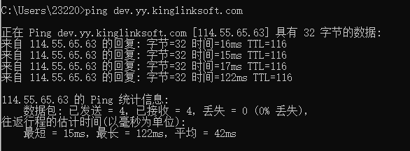
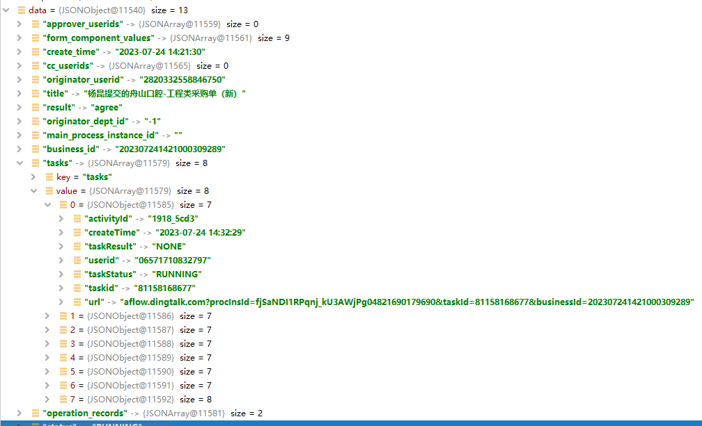

# 2023.7.24

## 1. 如何查看一个网址的ip地址

通过命令行中的ping命令




具体操作：

要查看网站的具体IP地址，可以使用以下步骤：

1. 打开命令提示符（对于Windows用户）或终端（对于Mac或Linux用户）。
2. 在命令提示符或终端中键入`ping dev.yy.kinglinksoft.com`，然后按下回车键。
3. 这将向该域名发送一个ICMP请求，并返回响应。在响应中，你将看到一个类似于`Reply from xxx.xxx.xxx.xxx`的消息，其中的`xxx.xxx.xxx.xxx`就是该网站的IP地址。


## 2、JSONOBJECT转对应的类

其字段要一模一样   驼峰和 _也是不行的




## 查询信息

审批中11405

```java
{
  "success": true,
  "data": {
    "role": null,
    "detail_flag": null,
    "id": 11405,
    "content_id": null,
    "process_id": "qLR3PiprQXCKTy0wYGlnVg04821689909536",
    "business_id": "202307211118000567374",
    "type": 10,
    "approve_status": 2,
    "purchase_status": 1,
    "ylsb": null,
    "zwwz": null,
    "xxsb": null,
    "gcxm": null,
    "hccg": null,
    "ghcg": null,
    "qtcg": null,
    "nbzyy": null,
    "gccg": {
      "apply_date": "2023-07-21",
      "purchase_name": "T0721002",
      "apply_emp": {
        "id": 20221,
        "name": "杨昆"
      },
      "apply_dept": {
        "id": 10193,
        "name": "宁波市科莱伯信息技术有限公司"
      },
      "remark": "123",
      "construction_company": "111",
      "budget": 111111,
      "attaches": [],
      "meeting_attaches": []
    },
    "hwcg": null,
    "process_instance": {
      "title": "杨昆提交的舟山口腔-工程类采购单（新）",
      "create_time": "2023-07-21 11:18:57",
      "finish_time": null,
      "originator_userid": "2820332558846750",
      "originator_dept_id": "-1",
      "status": "RUNNING",
      "approver_userids": [],
      "cc_userids": [],
      "result": "agree",
      "business_id": "202307211118000567374",
      "operation_records": [
        {
          "userid": "20221",
          "user_name": "杨昆",
          "user_photo": "/workapi3/upload/thumb_1681279471194lADPDhYBQpuvwFfNAu_NAu4_750_751.jpg",
          "date": "2023-07-21 11:18:56",
          "operation_type": "START_PROCESS_INSTANCE",
          "operation_result": "NONE",
          "result": "NONE",
          "remark": "",
          "attachments": [],
          "user_ids": null
        },
        {
          "userid": "20221",
          "user_name": "杨昆",
          "user_photo": "/workapi3/upload/thumb_1681279471194lADPDhYBQpuvwFfNAu_NAu4_750_751.jpg",
          "date": "2023-07-21 11:19:35",
          "operation_type": "EXECUTE_TASK_NORMAL",
          "operation_result": "AGREE",
          "result": "AGREE",
          "remark": "",
          "attachments": [],
          "user_ids": null
        },
        {
          "userid": "01552807291430461911",
          "user_name": "瞿筱天",
          "user_photo": "/workapi3/upload/thumb_50_1686537795300111111111111111111111.jpg",
          "date": null,
          "operation_type": null,
          "operation_result": null,
          "result": null,
          "remark": null,
          "attachments": null,
          "user_ids": null
        },
        {
          "userid": "0866161054840622",
          "user_name": "曹宇",
          "user_photo": null,
          "date": null,
          "operation_type": null,
          "operation_result": null,
          "result": null,
          "remark": null,
          "attachments": null,
          "user_ids": null
        },
        {
          "userid": "2820332558846750",
          "user_name": "杨昆",
          "user_photo": "/workapi3/upload/thumb_1681279471194lADPDhYBQpuvwFfNAu_NAu4_750_751.jpg",
          "date": null,
          "operation_type": null,
          "operation_result": null,
          "result": null,
          "remark": null,
          "attachments": null,
          "user_ids": null
        }
      ],
      "tasks": [
        {
          "createTime": "2023-07-21T03:18:57.000+00:00",
          "finishTime": null,
          "taskResult": "NONE",
          "taskStatus": "CANCELED",
          "taskid": "81179158067",
          "url": "aflow.dingtalk.com?procInsId=qLR3PiprQXCKTy0wYGlnVg04821689909536&taskId=81179158067&businessId=202307211118000567374",
          "userid": "V00_1400815737560",
          "activityId": "fb4b_b767",
          "activity_name": null
        },
        {
          "createTime": "2023-07-21T03:18:57.000+00:00",
          "finishTime": null,
          "taskResult": "NONE",
          "taskStatus": "CANCELED",
          "taskid": "81179158068",
          "url": "aflow.dingtalk.com?procInsId=qLR3PiprQXCKTy0wYGlnVg04821689909536&taskId=81179158068&businessId=202307211118000567374",
          "userid": "V00_1400815737560",
          "activityId": "fb4b_b767",
          "activity_name": null
        },
        {
          "createTime": "2023-07-21T03:18:57.000+00:00",
          "finishTime": null,
          "taskResult": "NONE",
          "taskStatus": "CANCELED",
          "taskid": "81179158069",
          "url": "aflow.dingtalk.com?procInsId=qLR3PiprQXCKTy0wYGlnVg04821689909536&taskId=81179158069&businessId=202307211118000567374",
          "userid": "V00_1400815737560",
          "activityId": "fb4b_b767",
          "activity_name": null
        },
        {
          "createTime": "2023-07-21T03:18:57.000+00:00",
          "finishTime": "2023-07-21T03:19:36.000+00:00",
          "taskResult": "AGREE",
          "taskStatus": "COMPLETED",
          "taskid": "81179158070",
          "url": "aflow.dingtalk.com?procInsId=qLR3PiprQXCKTy0wYGlnVg04821689909536&taskId=81179158070&businessId=202307211118000567374",
          "userid": "2820332558846750",
          "activityId": "fb4b_b767",
          "activity_name": "科主任"
        },
        {
          "createTime": "2023-07-21T03:19:36.000+00:00",
          "finishTime": null,
          "taskResult": "NONE",
          "taskStatus": "RUNNING",
          "taskid": "81208931352",
          "url": "aflow.dingtalk.com?procInsId=qLR3PiprQXCKTy0wYGlnVg04821689909536&taskId=81208931352&businessId=202307211118000567374",
          "userid": "06571710832797",
          "activityId": "1918_5cd3",
          "activity_name": "审批人"
        },
        {
          "createTime": "2023-07-21T03:19:36.000+00:00",
          "finishTime": null,
          "taskResult": "NONE",
          "taskStatus": "RUNNING",
          "taskid": "81208931353",
          "url": "aflow.dingtalk.com?procInsId=qLR3PiprQXCKTy0wYGlnVg04821689909536&taskId=81208931353&businessId=202307211118000567374",
          "userid": "01552807291430461911",
          "activityId": "1918_5cd3",
          "activity_name": "审批人"
        },
        {
          "createTime": "2023-07-21T03:19:36.000+00:00",
          "finishTime": null,
          "taskResult": "NONE",
          "taskStatus": "RUNNING",
          "taskid": "81208931354",
          "url": "aflow.dingtalk.com?procInsId=qLR3PiprQXCKTy0wYGlnVg04821689909536&taskId=81208931354&businessId=202307211118000567374",
          "userid": "0866161054840622",
          "activityId": "1918_5cd3",
          "activity_name": "审批人"
        },
        {
          "createTime": "2023-07-21T03:19:36.000+00:00",
          "finishTime": null,
          "taskResult": "NONE",
          "taskStatus": "RUNNING",
          "taskid": "81208931355",
          "url": "aflow.dingtalk.com?procInsId=qLR3PiprQXCKTy0wYGlnVg04821689909536&taskId=81208931355&businessId=202307211118000567374",
          "userid": "2820332558846750",
          "activityId": "1918_5cd3",
          "activity_name": "审批人"
        }
      ],
      "main_process_instance_id": "",
      "form_component_values": [
        {
          "ext_value": "",
          "name": "申请日期",
          "value": "2023-07-21"
        },
        {
          "ext_value": "[{\"emplId\":\"2820332558846750\",\"name\":\"杨昆\",\"avatar\":\"https://static.dingtalk.com/media/lADPDhYBQpuvwFfNAu_NAu4_750_751.jpg\"}]",
          "name": "申请人",
          "value": "杨昆"
        },
        {
          "ext_value": "[{\"number\":65,\"name\":\"宁波市科莱伯信息技术有限公司\",\"id\":\"-1\"}]",
          "name": "申请科室",
          "value": "宁波市科莱伯信息技术有限公司"
        },
        {
          "ext_value": "",
          "name": "项目名称",
          "value": "T0721002"
        },
        {
          "ext_value": "",
          "name": "项目说明",
          "value": "123"
        },
        {
          "ext_value": "",
          "name": "施工单位",
          "value": "111"
        },
        {
          "ext_value": "",
          "name": "预算金额",
          "value": "111111"
        },
        {
          "ext_value": "",
          "name": "附件",
          "value": "[]"
        },
        {
          "ext_value": "",
          "name": "会议纪要",
          "value": "null"
        }
      ]
    },
    "apr_instance": null,
    "current_apr_emp": null
  },
  "msg": null
}
```

审批完成

```json
{
  "success": true,
  "data": {
    "role": null,
    "detail_flag": null,
    "id": 11392,
    "content_id": null,
    "process_id": "Ona5pFtSTm-uVg5vs9i3NQ04821689815396",
    "business_id": "202307200909000569634",
    "type": 10,
    "approve_status": 3,
    "purchase_status": 2,
    "ylsb": null,
    "zwwz": null,
    "xxsb": null,
    "gcxm": null,
    "hccg": null,
    "ghcg": null,
    "qtcg": null,
    "nbzyy": null,
    "gccg": {
      "apply_date": "2023-07-20",
      "purchase_name": "T0720002",
      "apply_emp": {
        "id": 30421,
        "name": "郁佳烨"
      },
      "apply_dept": {
        "id": 10193,
        "name": "宁波市科莱伯信息技术有限公司"
      },
      "remark": "123",
      "construction_company": "111",
      "budget": 9999,
      "attaches": [],
      "meeting_attaches": []
    },
    "hwcg": null,
    "process_instance": {
      "title": "郁佳烨提交的舟山口腔-工程类采购单（新）",
      "create_time": "2023-07-20 09:09:57",
      "finish_time": "2023-07-21 09:00:51",
      "originator_userid": "443861041736271190",
      "originator_dept_id": "-1",
      "status": "COMPLETED",
      "approver_userids": [],
      "cc_userids": [],
      "result": "agree",
      "business_id": "202307200909000569634",
      "operation_records": [
        {
          "userid": "30421",
          "user_name": "郁佳烨",
          "user_photo": "",
          "date": "2023-07-20 09:09:56",
          "operation_type": "START_PROCESS_INSTANCE",
          "operation_result": "NONE",
          "result": "NONE",
          "remark": "",
          "attachments": [],
          "user_ids": null
        },
        {
          "userid": "20221",
          "user_name": "杨昆",
          "user_photo": "/workapi3/upload/thumb_1681279471194lADPDhYBQpuvwFfNAu_NAu4_750_751.jpg",
          "date": "2023-07-20 09:13:47",
          "operation_type": "EXECUTE_TASK_NORMAL",
          "operation_result": "AGREE",
          "result": "AGREE",
          "remark": "",
          "attachments": [],
          "user_ids": null
        },
        {
          "userid": "20221",
          "user_name": "杨昆",
          "user_photo": "/workapi3/upload/thumb_1681279471194lADPDhYBQpuvwFfNAu_NAu4_750_751.jpg",
          "date": "2023-07-21 09:00:50",
          "operation_type": "EXECUTE_TASK_NORMAL",
          "operation_result": "AGREE",
          "result": "AGREE",
          "remark": "",
          "attachments": [],
          "user_ids": null
        }
      ],
      "tasks": [
        {
          "createTime": "2023-07-20T01:13:47.000+00:00",
          "finishTime": null,
          "taskResult": "NONE",
          "taskStatus": "CANCELED",
          "taskid": "81089620845",
          "url": "aflow.dingtalk.com?procInsId=Ona5pFtSTm-uVg5vs9i3NQ04821689815396&taskId=81089620845&businessId=202307200909000569634",
          "userid": "V00_1400815737560",
          "activityId": "1918_5cd3",
          "activity_name": null
        },
        {
          "createTime": "2023-07-20T01:13:47.000+00:00",
          "finishTime": null,
          "taskResult": "NONE",
          "taskStatus": "CANCELED",
          "taskid": "81089620846",
          "url": "aflow.dingtalk.com?procInsId=Ona5pFtSTm-uVg5vs9i3NQ04821689815396&taskId=81089620846&businessId=202307200909000569634",
          "userid": "V00_1400815737560",
          "activityId": "1918_5cd3",
          "activity_name": null
        },
        {
          "createTime": "2023-07-20T01:13:47.000+00:00",
          "finishTime": null,
          "taskResult": "NONE",
          "taskStatus": "CANCELED",
          "taskid": "81089620848",
          "url": "aflow.dingtalk.com?procInsId=Ona5pFtSTm-uVg5vs9i3NQ04821689815396&taskId=81089620848&businessId=202307200909000569634",
          "userid": "V00_1400815737560",
          "activityId": "1918_5cd3",
          "activity_name": null
        },
        {
          "createTime": "2023-07-20T01:13:47.000+00:00",
          "finishTime": "2023-07-21T01:00:51.000+00:00",
          "taskResult": "AGREE",
          "taskStatus": "COMPLETED",
          "taskid": "81089620849",
          "url": "aflow.dingtalk.com?procInsId=Ona5pFtSTm-uVg5vs9i3NQ04821689815396&taskId=81089620849&businessId=202307200909000569634",
          "userid": "2820332558846750",
          "activityId": "1918_5cd3",
          "activity_name": null
        },
        {
          "createTime": "2023-07-20T01:09:57.000+00:00",
          "finishTime": null,
          "taskResult": "NONE",
          "taskStatus": "CANCELED",
          "taskid": "81125957782",
          "url": "aflow.dingtalk.com?procInsId=Ona5pFtSTm-uVg5vs9i3NQ04821689815396&taskId=81125957782&businessId=202307200909000569634",
          "userid": "V00_1400815737560",
          "activityId": "fb4b_b767",
          "activity_name": null
        },
        {
          "createTime": "2023-07-20T01:09:57.000+00:00",
          "finishTime": null,
          "taskResult": "NONE",
          "taskStatus": "CANCELED",
          "taskid": "81125957783",
          "url": "aflow.dingtalk.com?procInsId=Ona5pFtSTm-uVg5vs9i3NQ04821689815396&taskId=81125957783&businessId=202307200909000569634",
          "userid": "V00_1400815737560",
          "activityId": "fb4b_b767",
          "activity_name": null
        },
        {
          "createTime": "2023-07-20T01:09:57.000+00:00",
          "finishTime": null,
          "taskResult": "NONE",
          "taskStatus": "CANCELED",
          "taskid": "81125957784",
          "url": "aflow.dingtalk.com?procInsId=Ona5pFtSTm-uVg5vs9i3NQ04821689815396&taskId=81125957784&businessId=202307200909000569634",
          "userid": "V00_1400815737560",
          "activityId": "fb4b_b767",
          "activity_name": null
        },
        {
          "createTime": "2023-07-20T01:09:57.000+00:00",
          "finishTime": "2023-07-20T01:13:47.000+00:00",
          "taskResult": "AGREE",
          "taskStatus": "COMPLETED",
          "taskid": "81125957785",
          "url": "aflow.dingtalk.com?procInsId=Ona5pFtSTm-uVg5vs9i3NQ04821689815396&taskId=81125957785&businessId=202307200909000569634",
          "userid": "2820332558846750",
          "activityId": "fb4b_b767",
          "activity_name": null
        }
      ],
      "main_process_instance_id": "",
      "form_component_values": [
        {
          "ext_value": "",
          "name": "申请日期",
          "value": "2023-07-20"
        },
        {
          "ext_value": "[{\"emplId\":\"443861041736271190\",\"name\":\"郁佳烨\",\"avatar\":\"https://static.dingtalk.com/media/lADPD3Ir1l2ZFXbMwMzA_192_192.jpg\"}]",
          "name": "申请人",
          "value": "郁佳烨"
        },
        {
          "ext_value": "[{\"number\":65,\"name\":\"宁波市科莱伯信息技术有限公司\",\"id\":\"-1\"}]",
          "name": "申请科室",
          "value": "宁波市科莱伯信息技术有限公司"
        },
        {
          "ext_value": "",
          "name": "项目名称",
          "value": "T0720002"
        },
        {
          "ext_value": "",
          "name": "项目说明",
          "value": "123"
        },
        {
          "ext_value": "",
          "name": "施工单位",
          "value": "111"
        },
        {
          "ext_value": "",
          "name": "预算金额",
          "value": "9999"
        },
        {
          "ext_value": "",
          "name": "附件",
          "value": "[]"
        },
        {
          "ext_value": "",
          "name": "会议纪要",
          "value": "null"
        }
      ]
    },
    "apr_instance": null,
    "current_apr_emp": null
  },
  "msg": null
}
```

