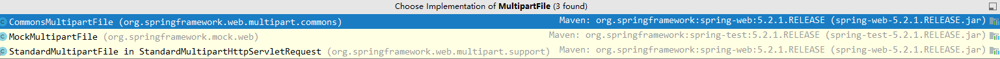

# 2023.7.26

## 一、文件上传

这里测试上传的文件为Tom.docx的文件，且其内容为Tmp

```java
package com.nbnfsoft.institution.controller;
import com.github.xiaoymin.knife4j.annotations.ApiSort;
import com.nbnfsoft.institution.common.constant.ParameterConstants;
import com.nbnfsoft.institution.common.constant.SystemConstants;
import com.nbnfsoft.institution.domain.dto.JsonData;
import com.nbnfsoft.institution.domain.output.AttachmentOutput;
import com.nbnfsoft.institution.entity.SysAttachment;
import com.nbnfsoft.institution.repository.SysParametersRepository;
import com.nbnfsoft.institution.service.OAService;
import com.nbnfsoft.institution.service.SysAttachmentService;
import com.nbnfsoft.institution.utils.FileUtil;
import com.nbnfsoft.institution.utils.FileUtils;
import com.nbnfsoft.institution.exception.FriendlyException;
import com.nbnfsoft.institution.utils.SecurityUtils;
import io.swagger.annotations.Api;
import io.swagger.annotations.ApiOperation;
import net.coobird.thumbnailator.Thumbnails;
import org.apache.commons.lang3.StringUtils;
import org.slf4j.Logger;
import org.slf4j.LoggerFactory;
import org.springframework.beans.factory.annotation.Autowired;
import org.springframework.beans.factory.annotation.Value;
import org.springframework.web.bind.annotation.*;
import org.springframework.web.multipart.MultipartFile;

import javax.imageio.ImageIO;
import java.awt.image.BufferedImage;
import java.io.File;
import java.io.IOException;
import java.nio.file.Paths;
import java.util.Arrays;
import java.util.HashMap;
import java.util.Map;


/**
 * @Author:zhuli
 * @Description：通用基础
 * @Date:Create in 17:25 2019-11-15
 */
//TODO 了解文件上传的过程
@RestController
@Api(tags = "通用基础")
@RequestMapping("/common")
@ApiSort(2)
public class CommonController extends BaseController {
    private Logger logger = LoggerFactory.getLogger(this.getClass());

    @Value("${uploadFile.resourceHandler}")
    private String resourceHandler;
    @Value("${uploadFile.location}")
    private String location;
    @Autowired
    private FileUtils fileUtils;
    @Autowired
    private SysAttachmentService attachmentService;
    @Autowired
    private SysParametersRepository sysParametersRepository;
    @Autowired
    private OAService oaService;

    @PostMapping(value = "/upload")
    @ApiOperation(value = "附件[上传]-OK")
    @ResponseBody
    //这里使用的MultipartFile的实现类是StandardMultipartFile
    public JsonData<AttachmentOutput> upload(@RequestParam("file") MultipartFile uploadFile) {
        //调用MultipartFile实现类的isEmpty方法，判断文件是否为空
        if (uploadFile.isEmpty()) {
            //如果为空则返回上传文件失败
            return success("上传失败，请选择文件");
        }
        //获取原始的文件名 “Tom.docx”
        String originalFileName = uploadFile.getOriginalFilename();
        //获取文件的媒体类型 application/vnd.openxmlformats-officedocument.wordprocessingml.document
        String imageType = uploadFile.getContentType();
        //这是上传文件的本地路径
        //在配置文件中进行了值的配置
        //location = 'D:/upload/institution/'
        String fileDir = location;
        //如果上传文件的本地路径没有配置
        if (StringUtils.isEmpty(fileDir)) {
            // 默认是相对路径下的upload目录
            fileDir = "upload";
        }
        //Paths为Path类的工具类
        //get()方法：创建一个Path对象，接受一个路径 （参数可以是字符串参数、url或File对象）
        //toAbsolutePath()方法:获取当前文件的绝对路径
        //normalize()方法：规范化路径表示形式
        //fileDir = 'D:/upload/institution'
        fileDir = Paths.get(fileDir).toAbsolutePath().normalize().toString();
        //如果当前上传文件的本地路径的末尾没有分隔符，则为其加上
        if (!fileDir.endsWith(String.valueOf(File.separatorChar))) {
            //fileDir = 'D:/upload/institution/'
            fileDir += File.separatorChar;
        }
        try {
            //获取当前用户的组织OrgId:9999
            long orgId = SecurityUtils.getLoginUser().getOrgId();
            //获取附件上传地址前缀 prefix = ‘/institutionapi’ 
            //项目部署到服务器上的前缀就是/institutionapi，通过Nginx进行跳转
            String prefix = sysParametersRepository.selectValueByCode(orgId, ParameterConstants.UPLOADFILE_PREFIX);
//            String prefix = "/" + SystemConstants.PROJECT_API;
            // DB
            String thumb = "thumb";
            //创建一个附件表对象
            SysAttachment attachInfo = new SysAttachment();
            //设置当前附件表的id为null
            attachInfo.setId(null);
            //设置保存的文件名称为时间戳 + 原始文件名
            //并去除如下的符号
            String fileName = System.currentTimeMillis() + uploadFile.getOriginalFilename()
                    .replace("..", "")
                    .replace("/", "")
                    .replace("\\", "")
                    .replace("*", "")
                    .replace("?", "")
                    .replace("\"", "")
                    .replace(":", "")
                    .replace("|", "");
            //设置附件表对象的文件名问原始文件名 'Tmp.docx'
            attachInfo.setFileName(originalFileName);
            //设置附件表中文件上传的路径
            //上传地址前缀 + 请求 url 中的资源映射 + 保存的文件名称
            ///institutionapi  + /upload/institution/ + 1690357965289Tmp.docx
            //institutionapi/upload/institution/1690357965289Tmp.docx
            attachInfo.setFilePath(prefix + resourceHandler.substring(0, resourceHandler.lastIndexOf("/") + 1) + fileName);
            // 获取上传文件的后缀 docx
            String suffix = fileName.substring(fileName.lastIndexOf(".") + 1);
            //设置附件表中的文件后缀 docx
            attachInfo.setFileSuffix(suffix);
			//指定可以上传的附件
            String[] DEFAULT_ALLOWED_EXTENSION = {
                    // 图片
                    "bmp", "gif", "jpg", "jpeg", "png",
                    // word excel powerpoint
                    "doc", "docx", "xls", "xlsx", "ppt", "pptx",
                    // pdf
                    "pdf"};
            //如果当前文件的后缀不在指定可以上传文件的范围内，则抛出异常
            if (!Arrays.asList(DEFAULT_ALLOWED_EXTENSION).contains(suffix.toLowerCase())) {
                throw new FriendlyException("不支持上传的文件类型");
            }

            // 本地上传路径fileDir + fileName
            // D:\upload\institution\  +  1690357965289Tmp.docx
            //D:\upload\institution\1690357965289Tmp.docx
            File destFile = new File(fileDir + fileName);
            //创建本地上传路径的目录，如果失败 抛出异常
            if (FileUtil.FileUtilFlag.FAILURE == FileUtil.createDir(fileDir)) {
                throw new IOException(FileUtil.getMsg());
            }
            //通过实现的transferTo 将上传的文件移动到目标文件夹下
            uploadFile.transferTo(destFile);
            
            try {
                //如果是图片格式，进行压缩，并进行重命名
                if (imageType.equals("image/jpeg") || imageType.equals("image/gif") || imageType.equals("image/png") || imageType.equals("image/bmp")) {
                    Thumbnails.of(fileDir + fileName).scale(0.25f).toFile(fileDir + thumb + "_" + fileName);
                }
            } catch (Exception e) {
                logger.error("图片压缩发生错误", e);
                throw new FriendlyException("请上传有效的图片文件");
            }

            //附件表中设置文件大小的属性
            // 以KB为单位（默认为B作为单位）
            attachInfo.setFileSize(uploadFile.getSize() / 1000.0);
            //上传文件若是excel或者word 也要可预览----转为pdf
            if ("xls".equals(suffix) || "xlsx".equals(suffix) || "doc".equals(suffix) || "docx".equals(suffix) || "ppt".equals(suffix) || "pptx".equals(suffix)) {
                //转为pdf
                //根据路劲
                //filePath = ‘/institutionapi/upload/institution/1690357965289Tmp.docx’
                String filePath = attachInfo.getFilePath();
                //filePathName = ‘1690357965289Tmp.docx’
                String filePathName = filePath.substring(filePath.lastIndexOf("/") + 1);
                //调用钉钉的服务器API，将word转化为PDF，并获取PDF的路径
                //参数1：/upload/institution/ + 1690357965289Tmp.docx（文件名称）  目标相对路径
                //参数2： “”												      水印
                String pdfPath = oaService.dingPdf(location.substring(location.indexOf("/upload/")) + filePathName, "");
                //成功生成pdf
                if(pdfPath != null) {
                    //获取当前pdf的名称
                    String pdfName = pdfPath.substring(pdfPath.lastIndexOf("/") + 1);
                    //将其与附件表关联
                    attachInfo.setPdfPath(prefix + resourceHandler.substring(0, resourceHandler.lastIndexOf("/") + 1) + pdfName);
                    logger.info("生成pdf path:" + attachInfo.getPdfPath());
                }
            } else if ("bmp".equals(suffix) || "jpg".equals(suffix) || "jpeg".equals(suffix) || "png".equals(suffix)) {
                //获取图片的base64码值
                String imageBase = FileUtils.getImageBase(location+fileName);
                BufferedImage bufferedImage = ImageIO.read(new File(location+fileName));
                int width = bufferedImage.getWidth();
                int height = bufferedImage.getHeight();
                Map<String,Object> map = new HashMap<>();
                map.put("image",imageBase);
                map.put("width", width + "px");
                map.put("height", height + "px");
                String newWordFilename = fileName.substring(0, fileName.lastIndexOf(".")+1) + "docx";
                //生成word
                fileUtils.createWord("image_templates.ftl",map,location+ newWordFilename);
                //转为pdf
                String pdfPath = oaService.dingPdf(location.substring(location.indexOf("/upload/")) + newWordFilename, "");
                if(pdfPath != null) {
                    String pdfName = pdfPath.substring(pdfPath.lastIndexOf("/") + 1);
                    attachInfo.setPdfPath(prefix + resourceHandler.substring(0, resourceHandler.lastIndexOf("/") + 1) + pdfName);
                    logger.info("生成pdf path:" + attachInfo.getPdfPath());
                }
            }
            if ("pdf".equals(suffix)) {
                attachInfo.setPdfPath(attachInfo.getFilePath());
            }

            AttachmentOutput output = attachmentService.save(attachInfo);
            return success(output);
        } catch (FriendlyException e) {
            throw new FriendlyException(e.getMessage());
        } catch (Exception e) {
            logger.error("文件上传失败: ", e);
            throw new FriendlyException("文件上传失败");
        }
    }

}

```


#### 1. 对MultipartFile类型的学习

MultipartFile类是一个接口，在Spring中用于处理文件上传的接口，在其不同的实现类中提供了对文件上传的支持，继承了**InputStreamSource接口**

```java
public interface MultipartFile extends InputStreamSource {
}
```

**InputStreamSource接口**是 Spring 框架中定义的一个接口，用于表示一个可读取输入流的资源

在 Spring 中，`InputStreamSource` 接口通常用于处理需要使用输入流的情况，例如文件上传、文件下载等。该接口只包含一个方法 `getInputStream()`，用于获取输入流对象。

以下是 `InputStreamSource` 接口的定义：

```java
public interface InputStreamSource {
    InputStream getInputStream() throws IOException;
}
```

实现了 `InputStreamSource` 接口的类可以提供一个输入流，通过调用 `getInputStream()` 方法来获取该输入流。这使得你可以方便地处理需要输入流的操作，而无需关心具体的资源类型或如何获取输入流。通过使用 `InputStreamSource` 接口，你可以将不同类型的资源统一表示为可读取输入流的形式，从而更加灵活地进行处理和操作。


其有三个实现类，如下所示：



**1.CommonsMultipartFile**

`CommonsMultipartFile` 是 Spring 3.x 版本之前（包括3.x版本）使用的一个实现类，用于处理文件上传。

该类是基于 Apache Commons FileUpload 库来实现的，它提供了一种便捷的方式来处理文件上传，并封装了与文件上传相关的操作。

以下是 `CommonsMultipartFile` 的构造函数：

```java
CommonsMultipartFile(FileItem fileItem)
```

- `fileItem`：`FileItem` 对象，表示上传的文件信息。

要注意的是，在较新的 Spring 版本中，`CommonsMultipartFile` 已经被废弃，不再建议使用。取而代之的是使用 `StandardMultipartFile` 来处理文件上传操作，它是基于 Servlet 3.0 的 `javax.servlet.http.Part` 接口来实现的。

如果你在较新的 Spring 版本中进行开发，可以考虑使用 `StandardMultipartFile` 或其他支持的实现类来处理文件上传操作。

**2.MockMultipartFile**

`MockMultipartFile` 是 Spring 框架提供的一个实用类，用于在测试中创建模拟的 `MultipartFile` 对象。

它是 `MultipartFile` 接口的一个实现类，可以用于模拟文件上传的场景，并提供了一些方便的方法来设置文件的属性和内容。

以下是 `MockMultipartFile` 的构造函数：

```java
MockMultipartFile(String name, String originalFilename, String contentType, byte[] content)
```

- `name`：指定文件域的名称。
- `originalFilename`：指定原始文件名。
- `contentType`：指定文件的媒体类型（例如，`image/jpeg`）。
- `content`：指定文件的内容（以字节数组形式提供）。

使用 `MockMultipartFile` 可以方便地创建一个模拟的 `MultipartFile` 对象，然后将其传递给你要测试的代码。这样，你就可以对文件上传相关的逻辑进行单元测试，而无需依赖真实的文件上传操作。

下面是一个示例，展示如何使用 `MockMultipartFile` 创建一个模拟的文件上传对象：

```java
// 导入所需的类
import org.springframework.mock.web.MockMultipartFile;
import org.springframework.web.multipart.MultipartFile;

// 创建一个模拟的文件上传对象
byte[] fileContent = "Mock file content".getBytes();
MultipartFile file = new MockMultipartFile("file", "test.jpg", "image/jpeg", fileContent);
```

通过以上代码，你就创建了一个名为 "file" 的模拟文件上传对象，其原始文件名是 "test.jpg"，媒体类型是 "image/jpeg"，内容为 "Mock file content"。

现在你可以将这个模拟的 `MultipartFile` 对象传递给你要测试的代码，以进行文件上传相关的单元测试。


**3.StandarMultipartFile**

`StandardMultipartFile` 是 Spring 框架中用于处理文件上传的一个实现类，它基于 Servlet 3.0 的 `javax.servlet.http.Part` 接口来实现文件上传功能。

以下是 `StandardMultipartFile` 的构造函数：

```java
StandardMultipartFile(Part part)
```

- `part`：`Part` 对象，表示上传的文件信息。

通过 `StandardMultipartFile`，你可以方便地获取上传文件的相关属性，如文件名、大小、媒体类型等，并提供了方法来获取文件内容的输入流。

以下是使用 `StandardMultipartFile` 创建一个文件上传对象的示例：

```java
// 导入所需的类
import org.springframework.web.multipart.MultipartFile;
import javax.servlet.http.Part;

// 获取文件上传的 Part 对象（例如在控制器中通过 HttpServletRequest）
Part filePart = request.getPart("file");

// 创建 StandardMultipartFile 对象
MultipartFile multipartFile = new StandardMultipartFile(filePart);
```

通过以上代码，你可以将从请求中获取的文件上传的 `Part` 对象转换为 `StandardMultipartFile` 对象，以便后续进行文件上传的处理。

需要注意的是，在使用 `StandardMultipartFile` 进行文件上传时，确保你的项目已经使用 Servlet 3.0 或更高版本，并且配置了正确的 Servlet 容器。


**MultipartFile类中的方法：**


- `String getName()`: 获取文件域的名称。在多个文件上传域时，该方法可用于区分不同的文件域。
- `String getOriginalFilename()`: 获取原始的文件名，即用户上传时的文件名。
- `String getContentType()`: 获取文件的媒体类型（例如，`image/jpeg`）。
- `boolean isEmpty()`: 判断上传文件是否为空，即没有文件内容。
- `long getSize()`: 获取上传文件的大小，以字节为单位。
- `byte[] getBytes()`: 将文件的内容作为字节数组返回。
- `InputStream getInputStream() throws IOException`: 获取文件内容的输入流。
- `void transferTo(File dest) throws IOException, IllegalStateException`: 将上传的文件转移到指定的目标文件中（`transferTo()` 方法通常用于将上传的文件保存到磁盘或其他持久化存储中。在使用此方法之前，请确保有足够的权限来操作目标文件，并检查目标文件的路径和名称是否有效）


上面的transfetTO的参数可以是File类型，也可以是Path类型，两者的区别如下

`File` 类和 `Path` 类是 Java 中用于处理文件和目录的两个主要类。

1. `File` 类：
   - `java.io.File` 是 Java I/O API 中用于操作文件和目录的类。
   - 它可以表示磁盘上的一个文件或目录，并提供了一系列方法来操作文件系统中的文件和目录，如创建、删除、重命名等。
   - 通过 `File` 类，你可以获取文件的路径、大小、是否存在以及进行读写操作等。
   - `File` 类在 Java 7 及之前的版本中使用较多，在 Java 8 之后被更现代化的 `Path` 类所取代。
2. `Path` 类：
   - `java.nio.file.Path` 是 Java NIO.2（Java 7+）中新增的类，用于操作文件系统中的文件和目录。
   - 它提供了更灵活、更强大的功能来处理文件和目录，支持更多的文件系统操作，如遍历目录、复制、移动、符号链接等。
   - `Path` 类是不可变的，每个操作都会返回一个新的 `Path` 实例，从而保留原始路径的不变性。
   - `Path` 类还提供了很多实用的方法，如根据相对路径和绝对路径创建 `Path`、解析路径、规范化路径等。

总结：`File` 类是传统的 Java I/O API 提供的用于操作文件和目录的类，而 `Path` 类是 Java NIO.2 中更现代化、功能更强大的类。在使用时，如果你正在使用较新的 Java 版本（Java 7+），推荐使用 `Path` 类来处理文件和目录操作。


#### 2、Paths（Path类的工具类）

**1.Path.gets()方法**

`Paths.get()` 方法是 Java NIO.2 中 `Paths` 类提供的一个静态方法，用于创建一个 `Path` 对象。

`Paths.get()` 方法有多个重载形式，可以接受不同的参数来构建 `Path` 对象。以下是其中一些常用的方法签名：

1. `static Path get(String first, String... more)`：
   - 接受一个或多个字符串参数，用于指定路径的不同部分。
   - 返回一个表示指定路径的 `Path` 对象。
2. `static Path get(URI uri)`：
   - 接受一个 `URI` 对象，用于构建 `Path` 对象。
   - 返回一个表示指定 URI 的 `Path` 对象。
3. `static Path get(File file)`：
   - 接受一个 `File` 对象，用于构建 `Path` 对象。
   - 返回一个表示指定文件的 `Path` 对象。

`Paths.get()` 方法允许你通过传递不同类型的参数来创建 `Path` 对象。你可以传递字符串表示的路径、URI 对象或 `File` 对象，并返回相应的 `Path` 对象。

以下是几个示例使用 `Paths.get()` 方法创建 `Path` 对象的用法：

```java
import java.nio.file.Path;
import java.nio.file.Paths;

// 从字符串创建 Path
Path path1 = Paths.get("C:\\myfolder\\myfile.txt");

// 从多个字符串构建 Path
Path path2 = Paths.get("C:", "myfolder", "myfile.txt");

// 从 URI 创建 Path
URI uri = new URI("file:///C:/myfolder/myfile.txt");
Path path3 = Paths.get(uri);

// 从 File 创建 Path
File file = new File("C:\\myfolder\\myfile.txt");
Path path4 = Paths.get(file);
```

通过 `Paths.get()` 方法，你可以方便地创建一个 `Path` 对象来表示文件或目录的路径。这个 `Path` 对象可以用于执行各种文件系统操作，如读取、写入、复制、移动等。


**2.toAbsolutePath()**

`toAbsolutePath()` 方法是 Java NIO.2 中 `Path` 接口提供的一个方法，用于获取路径的绝对路径表示。

`toAbsolutePath()` 方法返回一个新的 `Path` 对象，该对象表示当前路径的绝对路径。绝对路径是一个完整的路径，不依赖于当前工作目录。

以下是使用 `toAbsolutePath()` 方法的示例：

```java
import java.nio.file.Path;
import java.nio.file.Paths;

Path path = Paths.get("myfolder", "myfile.txt");
Path absolutePath = path.toAbsolutePath();

System.out.println("Original Path: " + path);
System.out.println("Absolute Path: " + absolutePath);
```

在上面的示例中，我们创建了一个相对路径 `myfolder/myfile.txt` 的 `Path` 对象，并使用 `toAbsolutePath()` 方法获取其绝对路径。

输出结果将会显示路径的原始形式和绝对形式：

```
Original Path: myfolder\myfile.txt
Absolute Path: C:\full\path\to\myfolder\myfile.txt
```

通过调用 `toAbsolutePath()` 方法，我们获得了路径的完整绝对形式，其中包含了文件系统根目录（如 `C:\`）。

需要注意的是，`toAbsolutePath()` 方法并不会检查路径是否存在或有效。它只是返回给定路径的绝对表示形式。如果路径不存在或无效，仍然可以使用该方法获取其绝对路径，但实际上并没有进行文件系统访问。


**3.normalize()**

`normalize()` 方法是 Java NIO.2 中 `Path` 接口提供的一个方法，用于规范化路径表示形式。

`normalize()` 方法返回一个新的 `Path` 对象，该对象表示经过规范化处理后的路径。规范化路径会消除冗余的部分，并解析任何`.`（当前目录）和`..`（上级目录），从而得到一个更简洁、更统一的路径表示。


#### 4.设置文件的路径

```java
public static FileUtilFlag createDir(String destDirName) {
    //创建一个file对象
    File dir = new File(destDirName);
    //如果当前目录存在
    if (dir.exists()) {
        setMsg("未创建目录" + destDirName + ": 目标目录已经存在");
        return FileUtilFlag.NOT_PERFORMED;
    }
    //如果当前目录最后没有分隔号 为其天极爱
    if (!destDirName.endsWith(File.separator)) {
        destDirName = destDirName + File.separator;
    }
    // 创建目录
    if (dir.mkdirs()) {
        setMsg("创建目录" + destDirName + "成功！");
        return FileUtilFlag.SUCCESS;
    } else {
        setMsg("创建目录" + destDirName + "失败！");
        return FileUtilFlag.FAILURE;
    }
}
```


#### 5.Thumbnails类

`Thumbnails` 类是一个用于生成缩略图（或预览图）的工具类。它通常用于在图像库、视频编辑软件和网页设计中，以及其他需要显示图像缩略图的应用程序中。

在 `Thumbnails` 类中，你可以定义要生成缩略图的原始图像，以及所需的缩略图尺寸。该类会根据指定的参数自动调整图像的大小，并生成相应的缩略图。

1.of方法

它通常用于创建 `Thumbnails` 对象的静态方法。这个方法允许你通过传递原始图像和缩略图尺寸来直接创建并返回一个 `Thumbnails` 对象。

2.scale方法

它通常用于按比例调整缩略图的大小。这个方法允许你输入原始图像和一个缩放因子，然后根据缩放因子自动计算缩略图的尺寸。

3..toFile方法

它通常用于将生成的缩略图保存到指定的文件路径。


#### 6、调用钉钉服务器word转PDF

```java
public String dingPdf(String targetPath,String text) {
    Long orgId = SecurityUtils.getLoginUser().getOrgId();
    //url = “http://192.168.9.201:14084/workapi3”
    String url = sysParametersRepository.selectValueByCode(orgId, ParameterConstants.OA_API);
    Map<String, String> params = new HashMap<>();
    params.put("targetPath", targetPath);
    params.put("text", text);
    //params.put("sign", sign);
    logger.info("OA钉钉授权码发送凭证:" + params);
    //OAUriConstants.DING_PDF = /open/api/office/convert
    String result = OkHttpUtil.postFormParams(url + OAUriConstants.DING_PDF, params);
    logger.info("生成pdf结果："+result);
    if(StringUtils.isEmpty(result) || result.contains("false")) {
        return null;
    }
    return result;
}
```

