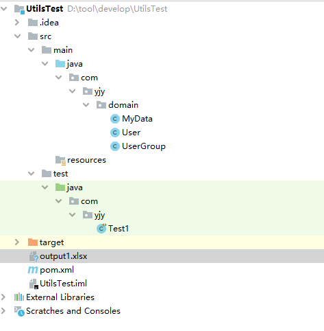
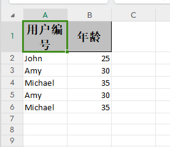
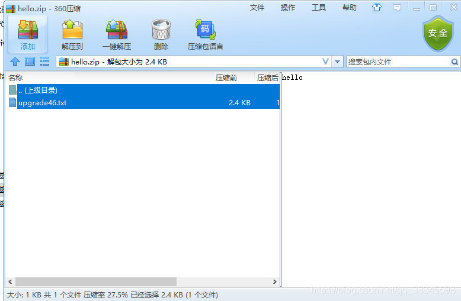

# 2023.7.27

## 一、导出列表excel

**业务层代码：**

```java
public void exportExcel(StorageListInput input, HttpServletResponse response) {
    //设定当前导出的页码号为1    
    input.setCurrent_page(1L);
    //设定当前需要导出的总页数为5000
    input.setPer_page(5000L);
    //获取当前用户的权限    
    List<String> powers = SecurityUtils.getLoginUser().getPower();
    //根据权限获取查看范围
    AccessScopeEnum scopeEnum = accessScopeFactory.getScope(powers, 3);
    //设置入参的val
    input.setScopeVal(scopeEnum.getVal());
    //获取指定页码的内容
    IPage<StorageListOutput> page = institutionManager.findForStorage(input, SecurityUtils.getUserId());
    //创建一个数据列表（映射实体类：InstitutionData）
    List<InstitutionData> dataList = new ArrayList<>();
    //将每页的记录信息赋值给数据列表dataList
    if(page.getTotal() > 0) {
        for(StorageListOutput output: page.getRecords()) {
            InstitutionData data = new InstitutionData();
            data.setName(output.getName());
            data.setCategoryName(output.getCategoryName());
            data.setFullEdition(output.getFullEdition());
            data.setPublishDeptName(output.getPublishDeptName());
            if(output.getPublishDate() != null) {
                data.setPublishDate(DateUtils.parseDateToStr(DateUtils.YYYY_MM_DD, output.getPublishDate()));
            } else {
                data.setPublishDate("");
            }
            data.setCommitName(output.getCommitName());
            if(output.getCommitDate() != null) {
                data.setCommitDate(DateUtils.parseDateToStr(DateUtils.YYYY_MM_DD, output.getCommitDate()));
            } else {
                data.setCommitDate("");
            }
            dataList.add(data);
        }
    }
    //导出列表
    try {
        //设置导出文件名（%E5%88%B6%E5%BA%A6%E6%B1%87%E6%80%BB）
        //encode：对UTF-8的字符串“制度汇总”进行编码
        //replaceALL：把所有的“\”替换成%20
        String fileName = URLEncoder.encode("制度汇总", "UTF-8").replaceAll("\\+", "%20");
        //设置处理响应的内容为附件下载
        //并且名称为fileName （我们之前进行URL编码获取到的字符串）
        response.setHeader("Content-disposition", "attachment;filename=" + fileName + ".xlsx");
        //设置响应内容类型 application/octet-stream：常见的 MIME 类型（媒体类型）
        response.setContentType("application/octet-stream");
        //将输出的excel写入response的输出流中
        EasyExcel.write(response.getOutputStream(), InstitutionData.class).autoCloseStream(Boolean.FALSE).sheet("数据")
            .doWrite(dataList);
    } catch (Exception e) {
        logger.error("制度汇总列表导出失败，"+e.getMessage());
    }
}
```


#### 1、简单上手EasyExcel

**EasyExcel介绍:**

EasyExcel是一个基于Java的简单、省内存的读写Excel的开源项目。在尽可能节约内存的情况下支持读写百M的Excel

EasyExcel 是一个开源的 Java Excel 操作库，用于简化 Excel 文件的读取、写入和处理操作。它提供了简单易用的 API，使得在 Java 应用程序中进行 Excel 文件的读写变得更加方便和高效。

使用 EasyExcel，你可以轻松地创建、读取和写入 Excel 文件，处理大量数据时也能提供较好的性能。它支持读取和写入多种 Excel 格式，包括 .xls 和 .xlsx 格式，并且提供了丰富的功能，如数据筛选、样式设置、图片插入等。

EasyExcel 的优点之一是其简洁的 API 设计，使得编写 Excel 相关的代码变得非常直观和易于理解。它还提供了灵活的配置选项和事件监听器，以满足不同的需求。

总之，EasyExcel 是一个强大而易于使用的 Java Excel 处理库，适用于各种场景，无论是进行简单的数据导入导出，还是复杂的数据处理和报表生成。


**入门案例练习:**

方法一：

首先设计一个Excel的字段映射表的实体对象

```java
package com.yjy.domain;

import com.alibaba.excel.annotation.ExcelProperty;

import java.io.Serializable;
import java.util.ArrayList;
import java.util.List;

/**
 * @author banana
 * @create 2023-07-27 11:21
 */
public class MyData implements Serializable {
    @ExcelProperty(value = "用户编号")
    private String name;
    @ExcelProperty(value = "年龄")
    private int age;

    public MyData(String name, int age) {
        this.name = name;
        this.age = age;
    }

    //get和set方法
    public String getName() {
        return name;
    }

    public void setName(String name) {
        this.name = name;
    }

    public int getAge() {
        return age;
    }

    public void setAge(int age) {
        this.age = age;
    }

    //初始化
    public static List<MyData> generateData(){
        List<MyData> data = new ArrayList<>();
        data.add(new MyData("John", 25));
        data.add(new MyData("Amy", 30));
        data.add(new MyData("Michael", 35));
        data.add(new MyData("Amy", 30));
        data.add(new MyData("Michael", 35));

        return data;
    }

}

```

测试

```java
 //导出Excel测试
@Test
public void test4(){
    //初始化数据
    List<MyData> data = MyData.generateData();

    //设置输出文件的路径和名称
    String fileName = "output1.xlsx";

    //调用EasyExcel的write方法写入数据
    EasyExcel.write(fileName, MyData.class).sheet("Sheet1").doWrite(data);
    System.out.println("写入成功");
}
```

结果：

由于路径只有一个名字，输入到当前项目的工作目录下，其内容如下所示





更多：

https://blog.csdn.net/u013044713/article/details/120249233?ops_request_misc=%257B%2522request%255Fid%2522%253A%2522169042194216800192283308%2522%252C%2522scm%2522%253A%252220140713.130102334..%2522%257D&request_id=169042194216800192283308&biz_id=0&utm_medium=distribute.pc_search_result.none-task-blog-2~all~top_positive~default-1-120249233-null-null.142^v91^insert_down28v1,239^v3^control&utm_term=easyexcel&spm=1018.2226.3001.4187


关于autoClostStream：

在 EasyExcel 中，`autoCloseStream()` 是一个方法，用于控制是否自动关闭流。EasyExcel 是一个用于读写 Excel 文件的 Java 库，它提供了一种简单的方式来处理大型 Excel 文件，同时具有高性能和低内存消耗的特点。

在 EasyExcel 中，通过调用 `autoCloseStream()` 方法可以设置是否自动关闭流。默认情况下，流是自动关闭的，即读写操作完成后会自动关闭相关的输入流或输出流。但在某些场景下，可能需要手动控制流的关闭。

以下是使用 `autoCloseStream()` 方法的示例：

```java
String filePath = "example.xlsx";
ReadSheet readSheet = EasyExcel.readSheet(0).build();
readSheet.autoCloseStream(Boolean.FALSE); // 设置不自动关闭流

// ... 其他读取 Excel 的代码 ...

// 手动关闭流
readSheet.finish();


```

在上述示例中，我们创建了一个 `ReadSheet` 对象，并通过调用 `autoCloseStream(Boolean.FALSE)` 方法来设置不自动关闭流。这意味着在读取 Excel 文件时，EasyExcel 将不会自动关闭相关的输入流。

需要注意的是，在设置为不自动关闭流后，你负责在适当的时候手动关闭流，以避免资源泄漏。可以使用 `finish()` 方法来手动关闭流。

请注意，`autoCloseStream()` 方法只在读取 Excel 文件时有效，对于写入操作，EasyExcel 不提供类似的设置。在写入操作完成后，相关的输出流将自动关闭。


#### 2、URLEncoder

`URLEncoder` 是 Java 中的一个类，位于 `java.net` 包中。它提供了一组静态方法用于对字符串进行 URL 编码。

URL 编码是将字符串按照 URL 规范进行编码，以便在 URL 中传递参数或数据时避免出现特殊字符或不合法的字符。URL 编码将非字母数字字符转换为 `%` 后面跟着两位十六进制数的形式（%E5%88%B6%E5%BA%A6%E6%B1%87%E6%80%BB），以确保 URL 的完整性和正确性。

`URLEncoder` 类的主要方法是 `encode()`，其原型如下：

参数：

String s: 要进行 URL 编码的字符串

String encoding: 指定字符串的字符编码（例如 "UTF-8"）

返回值：该方法返回一个已经进行 URL 编码的字符串。

```java
public static String encode(String s, String encoding)
```

实例：

```java
import java.net.URLEncoder;

public class Main {
    public static void main(String[] args) {
        try {
            String originalString = "Hello, World!";
            String encodedString = URLEncoder.encode(originalString, "UTF-8");
            System.out.println("Encoded string: " + encodedString);
        } catch (Exception e) {
            e.printStackTrace();
        }
    }
}

```

注意：`URLEncoder.encode()` 方法只对字符串进行编码，而不会对其他 URL 元素（如路径、参数等）进行编码。如果需要对整个 URL 进行编码，可以使用 `java.net.URI` 类的 `toASCIIString()` 方法


#### 3、响应头中的Content-Disposition属性

`Content-Disposition` 是 HTTP 响应头的一种，用于指示客户端如何处理接收到的响应内容。它主要用于控制文件下载时的行为和文件名。

`Content-Disposition` 头有两种常见的使用方式：

1. 内联显示：`Content-Disposition: inline`（默认值）。该设置通知浏览器直接在页面中显示响应内容，例如以内联方式显示图片或 PDF 文档。
2. 附件下载：`Content-Disposition: attachment`。该设置指示浏览器将响应内容作为附件下载，而不是直接显示在浏览器窗口中。

附件下载还可以指定下载时的文件名，通过在 `Content-Disposition` 头中添加 `filename` 参数，例如：

```java
response.setHeader("Content-Disposition", "attachment; filename=\"example.pdf\"");
```

在上述示例中，`Content-Disposition` 头被设置为 `"attachment"`，表示将响应内容作为附件下载。`filename` 参数指定了下载时的文件名为 `"example.pdf"`。

需要注意的是，`filename` 参数值应遵循 RFC 6266 中的规范。如果文件名包含非 ASCII 字符或特殊字符，建议进行 URL 编码或使用合适的字符编码格式。


#### 4、响应头中的ContentType属性

`setContentType()` 是 HttpServletResponse 接口中的一个方法，用于设置 HTTP 响应的内容类型（Content-Type）。它告诉客户端接收到的响应是什么类型的数据，并在处理响应时选择适当的方式进行解析和显示。

以下是使用 `setContentType()` 方法设置响应内容类型的示例：

```java
protected void doGet(HttpServletRequest request, HttpServletResponse response) throws ServletException, IOException {
    // 设置响应的内容类型和字符编码
    response.setContentType("text/html;charset=UTF-8");
    
    // ... 其他响应处理代码 ...
}
```

在上述示例中，我们通过调用 `response.setContentType()` 方法设置了响应的内容类型为 `"text/html"`，并指定了字符编码为 `"UTF-8"`。这表示服务器将返回的响应内容是 HTML 格式的文本，并使用 UTF-8 编码进行传输。

常见的一些可用的内容类型包括：

- 文本类型：`"text/plain"`、`"text/html"`、`"text/css"`、`"text/javascript"` 等。
- 图像类型：`"image/jpeg"`、`"image/png"`、`"image/gif"` 等。
- 应用程序类型：`"application/json"`、`"application/xml"`、`"application/pdf"` 等。

除了设置内容类型，`setContentType()` 方法还可以设置其他相关的响应头信息，如字符编码、语言、字符集等。

需要注意的是，`setContentType()` 方法必须在发送任何响应内容之前调用，以确保正确设置响应头。


**application/octet-stream：**

`application/octet-stream` 是一种常见的 MIME 类型（媒体类型），用于表示二进制数据或未知文件类型的通用应用程序流。在 HTTP 响应中，将内容类型设置为 `application/octet-stream` 时，表示服务器返回的是一个不特定类型的二进制数据流。

通常情况下，当服务器无法确定要发送的内容类型或响应是一个不可预测的二进制文件时，可以使用 `application/octet-stream` 来标识这种情况。客户端收到此类型的响应后，通常会将其视为一个可下载的文件，并提示用户保存该文件。

在上述示例中，我们调用 `response.setContentType()` 方法将响应的内容类型设置为 `application/octet-stream`，以便向客户端传输二进制数据或未知文件类型。

需要注意的是，如果你明确知道响应的内容类型是某种特定的文件类型，最好根据实际情况设置正确的内容类型，而不是使用 `application/octet-stream`。这样可以确保客户端正确地解析和处理响应的内容。


#### 5、response的getOutputStream()方法

在Web开发中，`getOutputStream()` 方法是一个用于获取响应输出流的方法。它通常用于将数据发送到客户端。

当处理HTTP响应时，`getOutputStream()` 方法用于获取一个 `OutputStream` 对象，通过该对象可以向客户端发送原始字节数据。你可以使用该输出流来写入响应体的内容，并将其发送回浏览器或客户端应用程序。

以下是Java Servlet API中使用 `getOutputStream()` 方法的示例：

```java
protected void doGet(HttpServletRequest request, HttpServletResponse response) throws ServletException, IOException {
    // 设置响应的内容类型和字符编码
    response.setContentType("text/plain");
    response.setCharacterEncoding("UTF-8");

    // 获取输出流
    OutputStream outputStream = response.getOutputStream();

    // 向输出流写入数据
    outputStream.write("Hello, World!".getBytes());

    // 关闭输出流
    outputStream.close();
}

```

在上述示例中，我们首先设置了响应的内容类型和字符编码。然后，通过调用 `getOutputStream()` 方法获取输出流对象，即 `OutputStream`。接下来，我们向输出流写入字符串 "Hello, World!" 的字节表示，并最后关闭输出流。

请注意，`getOutputStream()` 方法和 `getWriter()` 方法是互斥的，即同一次请求中只能使用其中之一来获取输出流，在使用一个输出流之前需要确保另一个输出流没有被使用。


#### 6、游览器自动解析URL编码

如果我们通过Postman去下载资源的时候，其名称还是我们传入时候的URL编码

但如果是浏览器的话，会将其转换为对应的字符串

是的，现代浏览器会自动解析 URL 编码。当浏览器接收到一个包含 URL 编码的字符串时，在显示或使用该字符串时，它会自动进行解码以还原原始的字符。

URL 编码是将非字母数字字符转换为 `%` 后面跟着两位十六进制数的形式，以确保 URL 的完整性和正确性。例如，空格字符被编码为 "%20"，特殊字符如 "&" 被编码为 "%26"。

当浏览器处理 URL 时（例如在地址栏输入 URL 或从网页中点击链接），它会自动对 URL 进行解码。这样可以确保 URL 中的特殊字符正常显示，并且能够正确地访问目标资源。解码后的 URL 可以用于获取正确的页面内容、发送请求等。

同样地，当浏览器接收到服务器响应时，如果响应包含 URL 编码的数据（例如作为查询参数或响应体中的一部分），浏览器也会自动进行解码，以便正确地显示和使用这些数据。

总而言之，现代浏览器会自动解析 URL 编码，以确保用户可以正常浏览和使用包含 URL 编码的内容。开发人员通常无需手动处理 URL 解码操作，除非有特定的需求或处理逻辑。


## 二、导出制度正文word文档（去批注）

代码：

```java
/**
* 导出制度正文word文档（去批注）
* @param response 响应
* @param id 制度id
* @throws Exception
*/
public void exportMainDoc(HttpServletResponse response, Long id) throws Exception {
    //获取对应的附件
    AttachmentOutput attachment = sysAttachmentManager.findLatestByHost(AttachHostType.INSTI_MAIN.getCode(), id);
    //判断对应的制度正文 是否存在
    if(attachment == null || StringUtils.isEmpty(attachment.getAttachUrl())) {
        throw new FriendlyException("下载失败，无对应制度正文");
    }
    //获取用户组织id
    Long orgId = SecurityUtils.getLoginUser().getOrgId();
    //获取附件上传的前缀：/institutionapi
    String prefix = sysParametersRepository.selectValueByCode(orgId, ParameterConstants.UPLOADFILE_PREFIX);
    //获取附件物理地址
    ////D:/upload/institution/1682477856192导入模板2.xlsx
    String fullPath = fileUtils.getLocalFilePath(attachment.getAttachUrl(), prefix);
    //创建file对象
    File file = new File(fullPath);
    //制度正文附件是否存在
    if(!file.isFile()) {
        throw new FriendlyException("制度正文附件不存在");
    }
    //name = 时间戳 + 附件信息名称
    String name = System.currentTimeMillis() + attachment.getAttachName();
    //将文件名称进行URL编码
    String fileName = URLEncoder.encode(name, "UTF-8");
    //并且名称为fileName （我们之前进行URL编码获取到的字符串）
    //以及文件的接受方式
    response.setHeader("Content-disposition", "attachment;filename=" + fileName);
    //设置响应内容类型 application/octet-stream：常见的 MIME 类型（媒体类型）
    response.setContentType("application/octet-stream");
    // 加载 Word 文档对象
    Document document = new Document();
    document.loadFromFile(fullPath);
    // 获取文档中的所有批注
    CommentsCollection comments = document.getComments();
    // 遍历批注并删除
    for (int i = comments.getCount() - 1; i >= 0; i--) {
        Comment comment = comments.get(i);
        comment.getOwnerParagraph().getChildObjects().remove(comment);
    }
    document.saveToFile(response.getOutputStream(), FileFormat.Doc);
}
```


获取附件物理地址：

```java
//获取附件物理地址
//filePath：/institutionapi/upload/institution/1682477856192导入模板2.xlsx
//prefix：/institutionapi    用于区分不同的系统 所加的前缀信息
public String getLocalFilePath(String filePath, String prefix) {
    //fileDir = D:/upload/institution/  （本地路径）
    String fileDir = location;
    //如果为空的话 设置fileDir为项目工作路径下的相对路径的“upload”
    if (org.apache.commons.lang3.StringUtils.isEmpty(fileDir)) {
        fileDir = "upload";
    }
    //使路径绝对化
    //fileDir = D:/upload/institution
    fileDir = Paths.get(fileDir).toAbsolutePath().normalize().toString();
    //为路径末尾加上分隔符
    //fileDir = D:/upload/institution/
    if (!fileDir.endsWith(String.valueOf(File.separatorChar))) {
        fileDir += File.separatorChar;
    }
    //uploadStr = /upload/institution/
    String uploadStr = resourceHandler.substring(0, resourceHandler.lastIndexOf("/") + 1);
    //path = 1682477856192导入模板2.xlsx
    String path = filePath.replace(prefix, "").replace(uploadStr, "");
    //D:/upload/institution/1682477856192导入模板2.xlsx
    return fileDir + path;
}
```


#### 1、 Document类型（com.spire.doc）

`com.spire.doc` 是一个 Java 基于文档处理库的名称，由 E-iceblue 开发。该库提供了丰富的功能和API，用于创建、读取、编辑和转换各种类型的文档，如 Word 文档（.doc/.docx）、RTF 文件等。

使用 `com.spire.doc` 库，你可以在 Java 程序中实现对文档的操作，例如：

- 创建新的 Word 文档或打开现有的文档。
- 读取和修改文档的内容、样式、布局等元素。
- 插入、删除和格式化段落、表格、图片、书签等。
- 进行文本搜索和替换、合并文档、分割文档等操作。
- 将文档转换为其他格式，如 PDF、HTML、XML 等。

此外，`com.spire.doc` 还提供了一些高级功能，如将文档密码保护、添加批注、设置水印、生成目录等。

需要注意的是，`com.spire.doc` 是商业库，你可能需要购买许可证才能在项目中使用。你可以访问 E-iceblue 的官方网站以获取更多关于 `com.spire.doc` 的详细信息、示例代码和文档。

#### 2、Document的saveToFile（）方法

`saveToFile()` 是 `com.spire.doc.Document` 类中的一个方法，用于将文档保存到文件。

下面是使用 `saveToFile()` 方法的示例代码：

```java
import com.spire.doc.Document;
import com.spire.doc.FileFormat;

public class SaveDocumentToFileExample {
    public static void main(String[] args) {
        // 创建 Document 对象
        Document document = new Document();

        // 打开或创建要保存的文档

        // 使用 saveToFile() 方法将文档保存到文件
        document.saveToFile("path/to/save/document.docx", FileFormat.Docx);
    }
}
```

在上述示例中，我们首先创建了一个 `Document` 对象。然后，你需要打开或创建要保存的文档。最后，通过调用 `saveToFile()` 方法，传递要保存的文件路径和文件格式参数，将文档保存到指定的文件中。

请确保导入正确的库，并替换示例代码中的文件路径为你想要保存的实际文件路径。此外，还可以根据需要选择不同的文件格式进行保存，如 `FileFormat.Docx` 表示 Word 文档格式。

这只是一个简单的示例，你可以根据具体的需求和文档内容进行相应的操作和设置。请参考相关文档和 API 参考以获取更多关于 `com.spire.doc.Document` 类及其方法的详细信息。


## 三、批量下载正文附件

代码:

```java
/**
* 批量下载无批注正文doc
* @param ids 制度id，多个之间逗号分隔
*/
public void batchExportDoc(String ids, HttpServletResponse response) throws Exception {
    //需要下载的制度为空
    if(StringUtils.isEmpty(ids)) {
        throw new FriendlyException("请选择要下载的制度");
    }
    //设置文件的类型
    response.setContentType("application/octet-stream; charset=UTF-8");
    //设置文件名称为 制度文件-时间戳.zip
    //并为其进行URL编码
    String fileName = URLEncoder.encode("制度正文" + "-" + System.currentTimeMillis() + ".zip", "UTF-8");
   	//设置接受的方式需要下载
    //设置人家的名称
    response.setHeader("Content-Disposition", "attachment;filename=" + fileName);
    //将多个逗号分割的文件分开来并存入到Long类型的List容器中
    List<Long> instIdList = Arrays.stream(StringUtils.split(ids, ",")).map(Long::parseLong).collect(Collectors.toList());
    //设置用户组织id
    Long orgId = SecurityUtils.getLoginUser().getOrgId();
    //获取附件上传的前缀：/institutionapi
    String prefix = sysParametersRepository.selectValueByCode(orgId, ParameterConstants.UPLOADFILE_PREFIX);
    //创建一个ZipOutputStream对象
    //用于写入数据
    ZipOutputStream zipOutputStream = new ZipOutputStream(response.getOutputStream());
    Document document = new Document();
    //遍历每一个需要批量下载的word文件
    for(Long instId: instIdList) {
        InstitutionInfo info = institutionManager.getById(instId);
        //如果制度不存在，就继续
        if(info == null) {
            continue;
        }
        //获取对应制度的正文附件
        AttachmentOutput attachment = sysAttachmentManager.findLatestByHost(AttachHostType.INSTI_MAIN.getCode(), instId);
        //如果附件不存在，则继续
        if(attachment == null || StringUtils.isEmpty(attachment.getAttachUrl())) {
            continue;
        }
        //获取物理下载路径
        String fullPath = fileUtils.getLocalFilePath(attachment.getAttachUrl(), prefix);
        String attachName;
        //如果附件的名称包含了后缀
        if(attachment.getAttachName().contains(attachment.getFileSuffix())) {
            //去除后缀
            attachName = attachment.getAttachName().substring(0, attachment.getAttachName().lastIndexOf("."));
        } else {
            //附件名称就等于当前附件保存的名称
            attachName = attachment.getAttachName();
        }
        //当前doc名称就是附件名称 + 版本号 + .后缀
        String docName = attachName + info.getEditionNum() + "." + attachment.getFileSuffix();
        //创建字符输出流
        ByteArrayOutputStream baos = new ByteArrayOutputStream();
        //获取对应的文件
        document.loadFromFile(fullPath);
        //去除批注
        CommentsCollection comments = document.getComments();
        for (int i = comments.getCount() - 1; i >= 0; i--) {
            Comment comment = comments.get(i);
            comment.getOwnerParagraph().getChildObjects().remove(comment);
        }
        //先将文件写入到字符输出流中
        document.saveToFile(baos, FileFormat.Doc);
        //设置压缩包的条目
        zipOutputStream.putNextEntry(new ZipEntry(docName));
        //写入相应中
        zipOutputStream.write(baos.toByteArray());
        //关闭一些相关的内容
        zipOutputStream.flush();
        zipOutputStream.closeEntry();
    }
    zipOutputStream.close();
}
```


#### 1、ZipoutputStream

**概念：**

 zipoutputStream是fileOutputStream中的一种，它可以将内容直接写入到zip包中。一般创建zipoutputStream通常是封装一个FileOutputStream，然后在每写入一个文件之前，需要先调用一次putNextEntry，然后使用write写入byte[]类型的数据,当写入完毕的时候使用colseEntry来结束这个文件的打包。其中 ZipEntry  表示压缩文件的条目   (就相当与java文件中的directory目录一样)， putNextEntry 开始编写新的ZIP文件条目并将流定位到条目数据的开头(换一个新的开始从头写).如果仍然有效，则关闭当前的目录，如果没有为目录指定相关的压缩方法，则使用默认的压缩方法。如果没有设置时间，则默认使用当前时间 (就是将条目放到zip包中)

```java
import org.junit.Test;
 
import java.io.*;
import java.util.zip.ZipEntry;
import java.util.zip.ZipOutputStream;
public class ziptest {
    @Test
    public void test() throws IOException {
        //File.separator代表了当前系统的文件分割符
        //linux使用/分割符会报错找不到文件,window系统下/和\都可以作为文件路径
        System.out.println("File.separator="+ File.separator);

        File file = new File("D:" + File.separator + "upgrade46.txt");
        File zipFile = new File("d:" + File.separator + "hello.zip");
        //读取相关的文件
        InputStream input = new FileInputStream(file);
        //设置输出流
        ZipOutputStream zipOut = new ZipOutputStream(new FileOutputStream(
            zipFile));

        zipOut.putNextEntry(new ZipEntry(file.getName()));
        // 设置注释
        zipOut.setComment("hello");
        int temp = 0;
        //读取相关的文件
        while((temp = input.read()) != -1){
            //写入输出流中
            zipOut.write(temp);
        }
        //关闭流
        input.close();
        zipOut.close();
    }
}
```

结果：




#### 2、ByteArrayOutputStream

ByteArrayOutputStream 对byte类型数据进行写入的类 相当于一个中间缓冲层，将类写入到文件等其他outputStream。它是对字节进行操作，属于内存操作流


## 四、SchedulingConfigurer

#### 1、cron表达式

**用处：** Scheduled(cron = "* * * * * *") cron表达式

"30 10 1 ? 10 * 2011"

**cron表达式格式：{秒数}{分钟}{小时}{日期}{月份}{星期}{年份（可为空）}**

**各参数详解：**

**（1） {秒数}：** 

范围：允许值范围: 0~59 ,不允许为空值，若值不合法，调度器将抛出SchedulerException异常

"*" 代表每隔1秒钟触发；

"," 代表在指定的秒数触发，比如"0,15,45"代表0秒、15秒和45秒时触发任务

"-"代表在指定的范围内触发，比如"25-45"代表从25秒开始触发到45秒结束触发，每隔1秒触发1次

"/"代表触发步进(step)，"/"前面的值代表初始值("*"等同"0")，后面的值代表偏移量，比如"0/20"或者"*/20"代表从0秒钟开始，每隔20秒钟触发1次，即0秒触发1次，20秒触发1次，40秒触发1次；"5/20"代表5秒触发1次，25秒触发1次，45秒触发1次；"10-45/20"代表在[10,45]内步进20秒命中的时间点触发，即10秒触发1次，30秒触发1次

**（2）{分钟}：**

范围：允许值范围: 0~59 ,不允许为空值，若值不合法，调度器将抛出SchedulerException异常

"*" 代表每隔1分钟触发；

","代表在指定的分钟触发，比如"10,20,40"代表10分钟、20分钟和40分钟时触发任务

"-" 代表在指定的范围内触发，比如"5-30"代表从5分钟开始触发到30分钟结束触 发，每隔1分钟触发

"/"代表触发步进(step)，"/"前面的值代表初始值("*"等同"0")，后面的值代表偏移量，比如"0/25"或者"*/25"代表从0分钟开始，每隔25分钟触发1次，即0分钟触发1次，第25分钟触发1次，第50分钟触发1次；"5/25"代表5分钟触发1次，30分钟触发1次，55分钟触发1次；"10-45/20"代表在[10,45]内步进20分钟命中的时间点触发，即10分钟触发1次，30分钟触发1次

**（3）{小时}：**

范围：允许值范围: 0~23 ,不允许为空值，若值不合法，调度器将抛出SchedulerException异常

"*" 代表每隔1小时触发；

","代表在指定的时间点触发，比如"10,20,23"代表10点钟、20点钟和23点触发任务

"-"代表在指定的时间段内触发，比如"20-23"代表从20点开始触发到23点结束触发，每隔1小时触发

"/"代表触发步进(step)，"/"前面的值代表初始值("*"等同"0")，后面的值代表偏移量，比如"0/1"或者"*/1"代表从0点开始触发，每隔1小时触发1次；"1/2"代表从1点开始触发，以后每隔2小时触发一次；"19-20/2"表达式将只在19点触发

**（4）{日期}**

范围：允许值范围: 1~31 ,不允许为空值，若值不合法，调度器将抛出SchedulerException异常

"*" 代表每天触发；

"?"**与{星期}互斥**，即意味着若明确指定{星期}触发，则表示{日期}无意义，以免引起 冲突和混乱

"," 代表在指定的日期触发，比如"1,10,20"代表1号、10号和20号这3天触发

"-"代表在指定的日期范围内触发，比如"10-15"代表从10号开始触发到15号结束触发，每隔1天触发

"/"代表触发步进(step)，"/"前面的值代表初始值("*"等同"1")，后面的值代表偏移量，比如"1/5"或者"*/5"代表从1号开始触发，每隔5天触发1次；"10/5"代表从10号开始触发，以后每隔5天触发一次；"1-10/2"表达式意味着在[1,10]范围内，每隔2天触发，即1号，3号，5号，7号，9号触发

"L" 如果{日期}占位符如果是"L"，即意味着当月的最后一天触发

"W "意味着在本月内离当天最近的工作日触发，所谓最近工作日，即当天到工作日的前后最短距离，如果当天即为工作日，则距离为0；所谓本月内的说法，就是不能跨月取到最近工作日，即使前/后月份的最后一天/第一天确实满足最近工作日；因此，"LW"则意味着本月的最后一个工作日触发，"W"强烈依赖{月份}

"C" 根据日历触发，由于使用较少，暂时不做解释

**（5）{月份}**

范围：允许值范围: 1~12 (JAN-DEC),不允许为空值，若值不合法，调度器将抛出SchedulerException异常

"*" 代表每个月都触发；

"," 代表在指定的月份触发，比如"1,6,12"代表1月份、6月份和12月份触发任务

"-"代表在指定的月份范围内触发，比如"1-6"代表从1月份开始触发到6月份结束触发，每隔1个月触发

"/"代表触发步进(step)，"/"前面的值代表初始值("*"等同"1")，后面的值代表偏移量，比如"1/2"或者"*/2"代表从1月份开始触发，每隔2个月触发1次；"6/6"代表从6月份开始触发，以后每隔6个月触发一次；"1-6/12"表达式意味着每年1月份触发

**（6）{星期}**

范围：允许值范围: 1~7 (SUN-SAT),1代表星期天(一星期的第一天)，以此类推，7代表星期六(一星期的最后一天)，不允许为空值，若值不合法，调度器将抛出SchedulerException异常

"*" 代表每星期都触发；

"?"与{日期}互斥，即意味着若明确指定{日期}触发，则表示{星期}无意义，以免引起冲突和混乱

"," 代表在指定的星期约定触发，比如"1,3,5"代表星期天、星期二和星期四触发

"-"代表在指定的星期范围内触发，比如"2-4"代表从星期一开始触发到星期三结束触发，每隔1天触发

"/"代表触发步进(step)，"/"前面的值代表初始值("*"等同"1")，后面的值代表偏移量，比如"1/3"或者"*/3"代表从星期天开始触发，每隔3天触发1次；"1-5/2"表达式意味着在[1,5]范围内，每隔2天触发，即星期天、星期二、星期四触发

"L"如果{星期}占位符如果是"L"，即意味着星期的的最后一天触发，即星期六触发，L= 7或者 L = SAT，因此，"5L"意味着一个月的最后一个星期四触发

"#"用来指定具体的周数，"#"前面代表星期，"#"后面代表本月第几周，比如"2#2"表示本月第二周的星期一，"5#3"表示本月第三周的星期四，因此，"5L"这种形式只不过是"#"的特殊形式而已

"C" 根据日历触发，由于使用较少，暂时不做解释

**（7）年份**

范围：1970~2099 ,允许为空，若值不合法，调度器将抛出SchedulerException异常

"*"代表每年都触发；

","代表在指定的年份才触发，比如"2011,2012,2013"代表2011年、2012年和2013年触发任务

"-"代表在指定的年份范围内触发，比如"2011-2020"代表从2011年开始触发到2020年结束触发，每隔1年触发

"/"代表触发步进(step)，"/"前面的值代表初始值("*"等同"1970")，后面的值代表偏移量，比如"2011/2"或者"*/2"代表从2011年开始触发，每隔2年触发1次


**注意：除了{日期}和{星期}可以使用"?"来实现互斥，表达无意义的信息之外，其他占位符都要具有具体的时间含义，且依赖关系为：年->月->日期(星期)->小时->分钟->秒数**