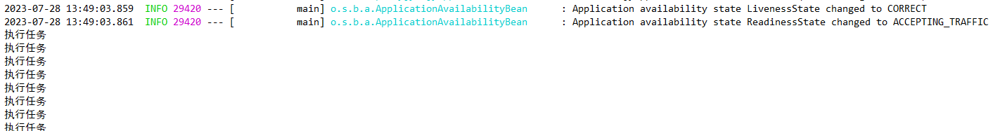
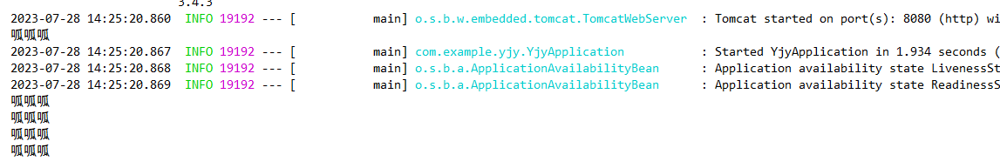

# 2023.7.28

## 一、SchedulingConfigurer

#### 1、cron表达式

**用处：** Scheduled(cron = "* * * * * *") cron表达式

"30 10 1 ? 10 * 2011"

**cron表达式格式：{秒数}{分钟}{小时}{日期}{月份}{星期}{年份（可为空）}**

```
秒        分钟        小时      日期       月份         星期        年份（可选）
┬         ┬          ┬         ┬          ┬           ┬
│         │          │         │          │           │
│         │          │         │          │           └───── 年份 (1970–2099)
│         │          │         │          └─────────── 星期 (1–7)，星期日为1
│         │          │         └───────────── 月份 (1–12)
│         │          └─────────────── 日期 (1–31)
│         └───────────────── 小时 (0–23)
└─────────────────────── 分钟 (0–59)

```

**各参数详解：**

**（1） {秒数}：** 

范围：允许值范围: 0~59 ,不允许为空值，若值不合法，调度器将抛出SchedulerException异常

单个值：例如5表示第5秒，10表示第10秒

通配符："*" 代表每隔1秒钟触发，即匹配所有制，表示匹配所有秒，即每秒钟都触发

多个值："," 代表在指定的秒数触发，比如"0,15,45"代表0秒、15秒和45秒时触发任务

范围值："-"代表在指定的范围内触发，比如"25-45"代表从25秒开始触发到45秒结束触发，每隔1秒触发1次

步进值："/"代表触发步进(step)，"/"前面的值代表初始值("*"等同"0")，后面的值代表偏移量，比如"0/20"或者"*/20"代表从0秒钟开始，每隔20秒钟触发1次，即0秒触发1次，20秒触发1次，40秒触发1次；"5/20"代表5秒触发1次，25秒触发1次，45秒触发1次；"10-45/20"代表在[10,45]内步进20秒命中的时间点触发，即10秒触发1次，30秒触发1次

**（2）{分钟}：**

范围：允许值范围: 0~59 ,不允许为空值，若值不合法，调度器将抛出SchedulerException异常

"*" 代表每隔1分钟触发；

","代表在指定的分钟触发，比如"10,20,40"代表10分钟、20分钟和40分钟时触发任务

"-" 代表在指定的范围内触发，比如"5-30"代表从5分钟开始触发到30分钟结束触 发，每隔1分钟触发

"/"代表触发步进(step)，"/"前面的值代表初始值("*"等同"0")，后面的值代表偏移量，比如"0/25"或者"*/25"代表从0分钟开始，每隔25分钟触发1次，即0分钟触发1次，第25分钟触发1次，第50分钟触发1次；"5/25"代表5分钟触发1次，30分钟触发1次，55分钟触发1次；"10-45/20"代表在[10,45]内步进20分钟命中的时间点触发，即10分钟触发1次，30分钟触发1次

**（3）{小时}：**

范围：允许值范围: 0~23 ,不允许为空值，若值不合法，调度器将抛出SchedulerException异常

"*" 代表每隔1小时触发；

","代表在指定的时间点触发，比如"10,20,23"代表10点钟、20点钟和23点触发任务

"-"代表在指定的时间段内触发，比如"20-23"代表从20点开始触发到23点结束触发，每隔1小时触发

"/"代表触发步进(step)，"/"前面的值代表初始值("*"等同"0")，后面的值代表偏移量，比如"0/1"或者"*/1"代表从0点开始触发，每隔1小时触发1次；"1/2"代表从1点开始触发，以后每隔2小时触发一次；"19-20/2"表达式将只在19点触发

**（4）{日期}**

范围：允许值范围: 1~31 ,不允许为空值，若值不合法，调度器将抛出SchedulerException异常

"*" 代表每天触发；

"?"**与{星期}互斥**，即意味着若明确指定{星期}触发，则表示{日期}无意义，以免引起 冲突和混乱

"," 代表在指定的日期触发，比如"1,10,20"代表1号、10号和20号这3天触发

"-"代表在指定的日期范围内触发，比如"10-15"代表从10号开始触发到15号结束触发，每隔1天触发

"/"代表触发步进(step)，"/"前面的值代表初始值("*"等同"1")，后面的值代表偏移量，比如"1/5"或者"*/5"代表从1号开始触发，每隔5天触发1次；"10/5"代表从10号开始触发，以后每隔5天触发一次；"1-10/2"表达式意味着在[1,10]范围内，每隔2天触发，即1号，3号，5号，7号，9号触发

"L" 如果{日期}占位符如果是"L"，即意味着当月的最后一天触发

"W "意味着在本月内离当天最近的工作日触发，所谓最近工作日，即当天到工作日的前后最短距离，如果当天即为工作日，则距离为0；所谓本月内的说法，就是不能跨月取到最近工作日，即使前/后月份的最后一天/第一天确实满足最近工作日；因此，"LW"则意味着本月的最后一个工作日触发，"W"强烈依赖{月份}

"C" 根据日历触发，由于使用较少，暂时不做解释

**（5）{月份}**

范围：允许值范围: 1~12 (JAN-DEC),不允许为空值，若值不合法，调度器将抛出SchedulerException异常

"*" 代表每个月都触发；

"," 代表在指定的月份触发，比如"1,6,12"代表1月份、6月份和12月份触发任务

"-"代表在指定的月份范围内触发，比如"1-6"代表从1月份开始触发到6月份结束触发，每隔1个月触发

"/"代表触发步进(step)，"/"前面的值代表初始值("*"等同"1")，后面的值代表偏移量，比如"1/2"或者"*/2"代表从1月份开始触发，每隔2个月触发1次；"6/6"代表从6月份开始触发，以后每隔6个月触发一次；"1-6/12"表达式意味着每年1月份触发

**（6）{星期}**

范围：允许值范围: 1~7 (SUN-SAT),1代表星期天(一星期的第一天)，以此类推，7代表星期六(一星期的最后一天)，不允许为空值，若值不合法，调度器将抛出SchedulerException异常

"*" 代表每星期都触发，即星期一到星期天都触发

"?"与{日期}互斥，即意味着若明确指定{日期}触发，则表示{星期}无意义，以免引起冲突和混乱

"," 代表在指定的星期约定触发，比如"1,3,5"代表星期天、星期二和星期四触发

"-"代表在指定的星期范围内触发，比如"2-4"代表从星期一开始触发到星期三结束触发，每隔1天触发

"/"代表触发步进(step)，"/"前面的值代表初始值("*"等同"1")，后面的值代表偏移量，比如"1/3"或者"*/3"代表从星期天开始触发，每隔3天触发1次；"1-5/2"表达式意味着在[1,5]范围内，每隔2天触发，即星期天、星期二、星期四触发

"L"如果{星期}占位符如果是"L"，即意味着星期的的最后一天触发，即星期六触发，L= 7或者 L = SAT，因此，"5L"意味着一个月的最后一个星期四触发

"#"用来指定具体的周数，"#"前面代表星期，"#"后面代表本月第几周，比如"2#2"表示本月第二周的星期一，"5#3"表示本月第三周的星期四，因此，"5L"这种形式只不过是"#"的特殊形式而已

"C" 根据日历触发，由于使用较少，暂时不做解释

**（7）年份**

范围：1970~2099 ,允许为空，若值不合法，调度器将抛出SchedulerException异常

"*"代表每年都触发；

","代表在指定的年份才触发，比如"2011,2012,2013"代表2011年、2012年和2013年触发任务

"-"代表在指定的年份范围内触发，比如"2011-2020"代表从2011年开始触发到2020年结束触发，每隔1年触发

"/"代表触发步进(step)，"/"前面的值代表初始值("*"等同"1970")，后面的值代表偏移量，比如"2011/2"或者"*/2"代表从2011年开始触发，每隔2年触发1次

**注意：除了{日期}和{星期}可以使用"?"来实现互斥，表达无意义的信息之外，其他占位符都要具有具体的时间含义，且依赖关系为：年->月->日期(星期)->小时->分钟->秒数**


**经典案例：**

```
"30 * * * * ?" 每半分钟触发任务
"30 10 * * * ?" 每小时的10分30秒触发任务
"30 10 1 * * ?" 每天1点10分30秒触发任务
"30 10 1 20 * ?" 每月20号1点10分30秒触发任务
"30 10 1 20 10 ? *" 每年10月20号1点10分30秒触发任务
"30 10 1 20 10 ? 2011" 2011年10月20号1点10分30秒触发任务
"30 10 1 ? 10 * 2011" 2011年10月每天1点10分30秒触发任务
"30 10 1 ? 10 SUN 2011" 2011年10月每周日1点10分30秒触发任务
"15,30,45 * * * * ?" 每15秒，30秒，45秒时触发任务
"15-45 * * * * ?" 15到45秒内，每秒都触发任务
"15/5 * * * * ?" 每分钟的每15秒开始触发，每隔5秒触发一次
"15-30/5 * * * * ?" 每分钟的15秒到30秒之间开始触发，每隔5秒触发一次
"0 0/3 * * * ?" 每小时的第0分0秒开始，每三分钟触发一次
"0 15 10 ? * MON-FRI" 星期一到星期五的10点15分0秒触发任务
"0 15 10 L * ?" 每个月最后一天的10点15分0秒触发任务
"0 15 10 LW * ?" 每个月最后一个工作日的10点15分0秒触发任务
"0 15 10 ? * 5L" 每个月最后一个星期四的10点15分0秒触发任务
"0 15 10 ? * 5#3" 每个月第三周的星期四的10点15分0秒触发任务
```


#### 2、入门案例

编写一个配置类，让其实现SchedulingConfigurer接口

并让其重写其中的configureTasks接口中的内容

并在该类上添加@Configuration注解（标志其为配置类） 和 @EnableScheduling注解

```java
package com.example.yjy.config;

import org.springframework.context.annotation.Configuration;
import org.springframework.scheduling.annotation.EnableScheduling;
import org.springframework.scheduling.annotation.SchedulingConfigurer;
import org.springframework.scheduling.config.ScheduledTaskRegistrar;

import java.util.concurrent.Executor;
import java.util.concurrent.Executors;

/**
 * @author banana
 * @create 2023-07-28 13:42
 */
@Configuration
@EnableScheduling
public class MySchedulingConfigurer implements SchedulingConfigurer {
    @Override
    public void configureTasks(ScheduledTaskRegistrar taskRegistrar) {
        taskRegistrar.setScheduler(Executors.newScheduledThreadPool(10));
        taskRegistrar.addFixedRateTask(() -> System.out.println("执行任务"), 1000);
    }
}

```

启动SpringBoot项目，就可以看到它成功启动定时调度功能，每1秒钟调度一次输出执行任务




**（1）任务调度**


任务调度是指在预定的时间或基于特定的触发条件下，自动执行预定义的任务或操作的过程。它可以让应用程序在指定的时间间隔内执行某些操作，或在特定的时间点上执行重要的任务。

任务调度通常用于以下情况：

1. 定时任务：按照固定的时间间隔执行某个任务，例如每小时、每天或每周执行一次。
2. 周期性任务：根据指定的周期性规则执行任务，例如每隔 x 秒、分钟、小时等执行一次。
3. 定时提醒和通知：在预定的时间点上向用户发送提醒或通知。
4. 数据清理和维护：定期清理过期的数据、备份数据库或进行其他维护操作。
5. 批处理作业：按照计划或需求，自动执行批处理任务，如数据导入、数据处理、报表生成等。

任务调度可以帮助我们自动化执行一些重复性、定时性或周期性的任务，减轻人工干预的工作量，并确保任务按时和准确地执行。在现代应用程序中，任务调度被广泛应用于各种领域，包括系统管理、数据处理、业务流程等。


**（2）SchedulingConfigurer接口**

`SchedulingConfigurer` 是 Spring 框架中的一个接口，用于配置任务调度器和注册任务。

在 `SchedulingConfigurer` 接口中，只定义了一个方法 `configureTasks(ScheduledTaskRegistrar taskRegistrar)`。该方法允许你通过传入一个 `ScheduledTaskRegistrar` 对象来配置和注册任务。

以下是 `SchedulingConfigurer` 接口的示例代码：

```java
import org.springframework.scheduling.annotation.SchedulingConfigurer;
import org.springframework.scheduling.config.ScheduledTaskRegistrar;

@Configuration
@EnableScheduling
public class MySchedulingConfigurer implements SchedulingConfigurer {

    @Override
    public void configureTasks(ScheduledTaskRegistrar taskRegistrar) {
        // 配置任务调度器和任务
        taskRegistrar.setScheduler(myScheduler());
        taskRegistrar.addFixedRateTask(() -> System.out.println("执行任务"), 1000);
    }

    // 自定义任务调度器
    public Executor myScheduler() {
        // 返回自定义的任务调度器对象
        return Executors.newScheduledThreadPool(10);
    }
}

```

在这个示例中，我们创建了一个实现了 `SchedulingConfigurer` 接口的类 `MySchedulingConfigurer`，并使用 `@Configuration` 注解将其标记为 Spring 配置类，并使用 `@EnableScheduling` 启用任务调度功能。

在 `configureTasks` 方法中，我们可以使用 `taskRegistrar` 对象来配置任务调度器和注册任务。首先，我们设置了一个自定义的任务调度器 `myScheduler()`，它返回一个自定义的线程池调度器。然后，我们添加了一个固定速率的任务，任务内容是输出 "执行任务" 的消息，每隔 1000 毫秒执行一次。

需要注意的是，根据具体需求，你可以添加其他类型的任务，如定时任务、周期性任务等。

最后，将这个类添加到 Spring 应用程序的配置中，以便任务调度器能够生效。


**（3）@Scheduled注解**

`@Scheduled` 注解是 Spring 框架中用于定义任务调度的注解。通过在方法上添加 `@Scheduled` 注解，可以指定任务的执行时间或触发条件。

以下是 `@Scheduled` 注解的使用示例：

```java
import org.springframework.scheduling.annotation.Scheduled;

@Component
public class MyTask {

    @Scheduled(fixedRate = 5000) // 每隔5秒执行一次
    public void myScheduledTask() {
        // 执行任务逻辑
        System.out.println("执行定时任务");
    }
}

```

在这个示例中，我们创建了一个名为 `MyTask` 的组件，并在 `myScheduledTask()` 方法上添加了 `@Scheduled` 注解。通过设置 `fixedRate` 属性为 5000，表示该任务将以固定的速率（5秒）重复执行。

除了 `fixedRate` 属性外，`@Scheduled` 注解还提供了其他属性来配置任务的触发规则。以下是一些常用的属性：

- `fixedDelay`：指定任务结束后的延迟时间，再次触发任务。
- `initialDelay`：指定任务首次触发的延迟时间。
- `cron`：使用 Cron 表达式来配置任务的触发时间。
- `zone`：指定用于计算 Cron 表达式的时区。

你可以根据具体需求选择合适的属性和值来配置任务的触发规则。

需要注意的是，在使用 `@Scheduled` 注解之前，要确保已经在配置类上（即添加@Configuration注解的类）添加了 `@EnableScheduling` 注解，以启用任务调度功能（实际上在启动类上 或 加了@Compent类上加这个也可以启动调度任务）

```java
@Configuration
@EnableScheduling
public class MySchedulingConfigurer implements SchedulingConfigurer {
    @Override
    public void configureTasks(ScheduledTaskRegistrar taskRegistrar) {
        //taskRegistrar.setScheduler(Executors.newScheduledThreadPool(10));
        //taskRegistrar.addFixedRateTask(() -> System.out.println("执行任务"), 1000);
    }

}
```

通过使用 `@Scheduled` 注解，你可以方便地在 Spring 应用程序中定义定时任务、周期性任务或基于 Cron 表达式的任务调度。

```java
package com.example.yjy.pojo;

import org.springframework.scheduling.annotation.EnableScheduling;
import org.springframework.scheduling.annotation.Scheduled;
import org.springframework.stereotype.Component;

/**
 * @author banana
 * @create 2023-07-28 14:17
 */
@Component
public class MySchedule {
    @Scheduled(fixedRate = 1000)
    public void myScheduledTask(){
        System.out.println("呱呱呱");
    }
}

```

结果：




**（4）@EnableScheduling注解**

`@EnableScheduling` 是一个注解，用于启用 Spring 框架中的任务调度功能。

当你在 Spring 应用程序中使用任务调度时，需要将 `@EnableScheduling` 注解添加到配置类上，以告知 Spring 启用任务调度功能。

以下是一个示例代码片段，演示了如何使用 `@EnableScheduling` 注解：

```java
import org.springframework.context.annotation.Configuration;
import org.springframework.scheduling.annotation.EnableScheduling;

@Configuration
@EnableScheduling
public class AppConfig {
    // 配置其他的 Bean 或组件
}

```

在这个示例中，我们创建了一个名为 `AppConfig` 的配置类，并使用 `@EnableScheduling` 注解来启用任务调度功能。

需要注意的是，确保在项目的依赖中包含了相应的任务调度器（例如 Quartz、ThreadPoolTaskScheduler 等）和相关的依赖项。此外，还需要在任务定义的方法上使用 `@Scheduled` 注解来指定任务的执行时间或触发条件。

通过使用 `@EnableScheduling` 注解，你可以轻松地启用 Spring 中的任务调度功能，并使用 `@Scheduled` 注解来定义任务的触发规则。


**（5）@Scheduled注解和@EnableScheduling注解的区别**

`@Scheduled` 注解和 `@EnableScheduling` 注解是 Spring 框架中用于任务调度的两个关键注解，它们在任务调度功能的实现中扮演不同的角色。

- `@EnableScheduling` 注解：`@EnableScheduling` 注解用于启用 Spring 的任务调度功能。它通常被用于配置类上，表示该类将使用任务调度功能，并且会创建一个任务调度器（TaskScheduler）的实例。通过添加 `@EnableScheduling` 注解，你可以告知 Spring 在应用程序上下文中启用任务调度，以便使用 `@Scheduled` 注解定义和触发任务。
- `@Scheduled` 注解：`@Scheduled` 注解是用于标记方法的注解，用于指定任务的执行时间或触发条件。通过在方法上添加 `@Scheduled` 注解，你可以告诉 Spring 在特定的时间点或周期性地执行这个方法。你可以使用不同的属性来配置任务的触发规则，例如定时、固定间隔、Cron 表达式等。

总结起来，`@EnableScheduling` 是一个启用任务调度功能的注解，而 `@Scheduled` 是一个用于定义任务执行时间或触发条件的注解。`@EnableScheduling` 注解是用于配置类上的，而 `@Scheduled` 注解是用于具体执行任务的方法上。

同时，在使用这两个注解之前，需要确保项目的依赖中包含了相应的任务调度器（例如 Quartz、ThreadPoolTaskScheduler 等）和相关的依赖项。


**（6）ScheduledTaskRegistrar**

`ScheduledTaskRegistrar` 是 Spring 框架中用于注册和管理任务调度的类。它提供了一些方法来配置和注册任务。

以下是 `ScheduledTaskRegistrar` 中常用的方法：

- `setScheduler(ScheduledExecutorService scheduler)`: 设置任务调度器，即指定要使用的线程池或调度器实例。
- `addFixedRateTask(Runnable task, long period)`: 注册一个固定速率的任务，该任务将以给定的时间间隔重复执行。
- `addFixedDelayTask(Runnable task, long delay)`: 注册一个固定延迟的任务，该任务将在前一个任务完成后等待给定的延迟时间再次执行。
- `addCronTask(Runnable task, CronTrigger trigger)`: 注册一个基于 Cron 表达式的任务，该任务将按照指定的时间规则进行调度。
- `addTriggerTask(Runnable task, Trigger trigger)`: 注册一个使用自定义触发器的任务，该任务将根据指定的触发规则进行调度。
- `scheduleFixedRateTask(Runnable task, Date startTime, long period)`: 在指定的开始时间启动一个固定速率的任务，然后以给定的时间间隔重复执行。
- `scheduleFixedDelayTask(Runnable task, Date startTime, long delay)`: 在指定的开始时间启动一个固定延迟的任务，该任务将在前一个任务完成后等待给定的延迟时间再次执行。

这些方法可以在 `configureTasks` 方法内部使用 `ScheduledTaskRegistrar` 对象来配置和注册任务。根据具体需求，可以选择合适的方法来创建和安排任务。

需要注意的是，在使用这些方法之前，你需要先设置任务调度器（通过 `setScheduler` 方法）以及相应的任务触发器或时间规则。

希望以上信息对你有所帮助！如果还有其他问题，请随时提问。


**（7）Executors类**

`Executors` 类是 Java 标准库中的一个实用工具类，用于创建不同类型的线程池。

以下是 `Executors` 类中常用的方法：

- `newFixedThreadPool(int nThreads)`: 创建一个固定大小的线程池，该线程池中最多同时运行 `nThreads` 个线程。
- `newCachedThreadPool()`: 创建一个可根据需求自动扩展的线程池。线程池会根据任务的数量和系统资源情况来决定创建新线程还是重用现有线程。
- `newSingleThreadExecutor()`: 创建一个只有一个线程的线程池。所有提交的任务都将按顺序执行。
- `newScheduledThreadPool(int corePoolSize)`: 创建一个可以进行定时或周期性任务调度的线程池。
- `newWorkStealingPool()`: 创建一个使用工作窃取算法的线程池。该线程池适用于需要大量并行计算或 IO 密集型的任务。
- `unconfigurableExecutorService(ExecutorService executor)`: 返回一个无法配置的包装器，用于保护底层 ExecutorService 免受外部修改的影响。

这些方法返回的是实现了 `ExecutorService` 接口的线程池对象，可以用于提交任务并管理线程池中的线程。

示例代码：

```java
import java.util.concurrent.ExecutorService;
import java.util.concurrent.Executors;

public class ThreadPoolExample {
    public static void main(String[] args) {
        // 创建一个固定大小的线程池
        ExecutorService executor = Executors.newFixedThreadPool(5);

        // 提交任务给线程池
        for (int i = 0; i < 10; i++) {
            executor.execute(new MyTask(i));
        }

        // 关闭线程池
        executor.shutdown();
    }

    static class MyTask implements Runnable {
        private int taskId;

        public MyTask(int taskId) {
            this.taskId = taskId;
        }

        @Override
        public void run() {
            System.out.println("执行任务：" + taskId);
        }
    }
}

```

在这个示例中，我们使用 `newFixedThreadPool` 方法创建了一个固定大小为 5 的线程池。然后，我们通过 `execute` 方法提交了 10 个任务给线程池，每个任务都是一个实现了 `Runnable` 接口的 `MyTask` 类。

最后，我们调用 `shutdown` 方法关闭线程池。

通过使用 `Executors` 类提供的方法，我们可以方便地创建不同类型的线程池，并将任务提交给线程池来执行。