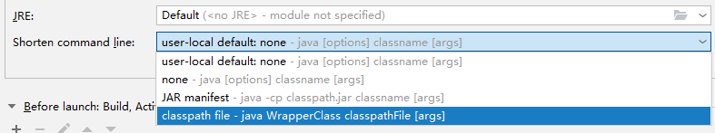

# 2023.09.18

## 1、mysql中bigint id  = ‘’ 和 整数 都可以查询到


## 2、StringJoiner deptString = new StringJoiner(",");

```
CostAccountProportionListVo vo = new CostAccountProportionListVo();
                //关联信息ID(id)
                vo.setId(list.getId());
                //工号(jobNumber)
                vo.setJobNumber(list.getValue3());
                //科室名称（dept） 列表 --> 逗号分割字符串
                List<CommonDTO> commonDTOList = JSON.parseArray(list.getValue2(), CommonDTO.class);
                StringJoiner deptString = new StringJoiner(",");
                for(CommonDTO commonDTO : commonDTOList){
                    deptString.add(commonDTO.getName());
                }
                vo.setDept(deptString.toString());
```


## 3、JSON_EXTRACT(context, '$.accountUnit') LIKE CONCAT('%', {0}, '%')


## 4、异常处理

```
@ExceptionHandler({Exception.class})
public R handleGlobalException(Exception e) {
    log.error("全局异常信息 ex={}", e.getMessage(), e);
    Tracer.trace(e);
    return R.failed(e.getLocalizedMessage());
}
```


问题：

```
@ExceptionHandler({BizException.class})
@ResponseStatus(HttpStatus.INTERNAL_SERVER_ERROR)
public R handleBizException(BizException e) {
log.error("业务异常信息 ex={}", e.getMessage(), e);
Tracer.trace(e);
return R.failed(e.getDefaultMessage());
}
```


## 5、hutool-crypto

```
<dependency>
   <groupId>cn.hutool</groupId>
    <artifactId>hutool-crypto</artifactId>
    <version>5.8.10</version>
</dependency>
```


## 6、泛型异常报错

```java
package com.hscloud.hs.cost.account.model.pojo;

import io.swagger.v3.oas.annotations.media.Schema;
import lombok.Data;

/**
 * @author banana
 * @create 2023-09-19 16:57
 */
@Data
@Schema(description = "响应信息")
public class ResponseData<T> {
    @Schema(description = "响应码 0:成功")
    private int code;

    @Schema(description = "返回信息")
    private String msg;

    @Schema(description = "数据")
    private T data;

    //判断是否响应成功
    public boolean getSuccess() {
        return code == 0 ? true : false;
    }
}

```


报错：

```
package com.hscloud.hs.cost.account.model.pojo;

import io.swagger.v3.oas.annotations.media.Schema;
import lombok.Data;
import org.apache.poi.ss.formula.functions.T;

/**
 * @author banana
 * @create 2023-09-19 16:57
 */
@Data
@Schema(description = "响应信息")
public class ResponseData {
    @Schema(description = "响应码 0:成功")
    private int code;

    @Schema(description = "返回信息")
    private String msg;

    @Schema(description = "数据")
    private T data;

    //判断是否响应成功
    public boolean getSuccess() {
        return code == 0 ? true : false;
    }
}

```


## 7、超出范围




## 8、全局异常处理器

拼接属性名

```
 @ExceptionHandler({BindException.class})
    public R handleBodyValidException(BindException exception) {
        List<FieldError> fieldErrors = exception.getBindingResult().getFieldErrors();
        return R.failed(String.format("%s %s", ((FieldError)fieldErrors.get(0)).getField(), ((FieldError)fieldErrors.get(0)).getDefaultMessage()));
    }
```


## 9\ip

```

以太网适配器 以太网 3:

   连接特定的 DNS 后缀 . . . . . . . :
   本地链接 IPv6 地址. . . . . . . . : fe80::35cb:57e:4fca:9caf%15
   IPv4 地址 . . . . . . . . . . . . : 2.0.1.28
   子网掩码  . . . . . . . . . . . . : 255.255.255.0
   默认网关. . . . . . . . . . . . . :

以太网适配器 以太网:

   媒体状态  . . . . . . . . . . . . : 媒体已断开连接
   连接特定的 DNS 后缀 . . . . . . . : lan

以太网适配器 VirtualBox Host-Only Network:

   连接特定的 DNS 后缀 . . . . . . . :
   IPv4 地址 . . . . . . . . . . . . : 192.168.56.1
   子网掩码  . . . . . . . . . . . . : 255.255.255.0
   默认网关. . . . . . . . . . . . . :

无线局域网适配器 本地连接* 9:

   媒体状态  . . . . . . . . . . . . : 媒体已断开连接
   连接特定的 DNS 后缀 . . . . . . . :

无线局域网适配器 本地连接* 10:

   媒体状态  . . . . . . . . . . . . : 媒体已断开连接
   连接特定的 DNS 后缀 . . . . . . . :

无线局域网适配器 WLAN:

   连接特定的 DNS 后缀 . . . . . . . :
   本地链接 IPv6 地址. . . . . . . . : fe80::906e:720:59e8:e96d%19
   IPv4 地址 . . . . . . . . . . . . : 192.168.190.104
   子网掩码  . . . . . . . . . . . . : 255.255.255.0
   默认网关. . . . . . . . . . . . . : 192.168.190.1

以太网适配器 以太网 2:

   媒体状态  . . . . . . . . . . . . : 媒体已断开连接
   连接特定的 DNS 后缀 . . . . . . . :
```


## 10、 LambdaQueryWrapper

```
 LambdaQueryWrapper<CostAccountPlanConfig> wrapper = new LambdaQueryWrapper<>();
        wrapper
                .eq(queryDto.getPlanId() != null, CostAccountPlanConfig::getPlanId, queryDto.getPlanId())
                .eq(queryDto.getConfigId() != null, CostAccountPlanConfig::getId, queryDto.getConfigId())
                .eq(CostAccountPlanConfig::getDelFlag, '0');
```


## 11、路由类

```
RedisRouteDefinitionWriter
```


## 12、查看日志

```
cd /app
cd logs/
cd hs-cost-account/
tail -500f error.log 
```


liunux：时间同步


时间戳问题
