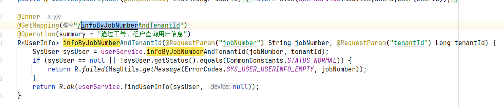

# 2024-01-08

## 一、执行率

数据来源：UFO动态报表（feign接口调用远程服务，查询相应数据表），NCC数据库（直接查询相关数据表）

结构：树形结构，每一个结点涉及到公式配置、计算、数据线上汇总……

慢优化：

异步处理 -> 走缓存（遇到大对象，大小为60w，数据反序列化为List<Object>的时候很慢）-> 优化数据大小

-> 排查其他问题，循环内调用json Array、Object转换，以及通过String.format进行前导0的补零操作，都很慢，讲这些都进行优化

## 二、当前类中对方法的

get bean 后 通过bean去调用被cache的方法可以成功代理？

对于一个类中增强的方法，应该从BeanFactory中去获取，因为增强是在后处理器中进行的，不能直接通过该对象的this去获取（但是this不就是增强后的对象吗？需要写一个demo测试一下）

## 三、无法拿到非Public的方法

关于切面指定方法无法拿到非Public的方法



```
package com.pig4cloud.pigx.common.security.aspect;

import com.pig4cloud.pigx.common.security.annotation.Inner;
import com.pig4cloud.pigx.common.security.component.PermissionService;
import lombok.RequiredArgsConstructor;
import org.aspectj.lang.JoinPoint;
import org.aspectj.lang.annotation.Aspect;
import org.aspectj.lang.annotation.Before;
import org.springframework.boot.autoconfigure.condition.ConditionalOnProperty;
import org.springframework.context.ApplicationContext;
import org.springframework.security.access.AccessDeniedException;
import org.springframework.security.access.prepost.PreAuthorize;
import org.springframework.security.core.Authentication;
import org.springframework.security.core.context.SecurityContextHolder;
import org.springframework.stereotype.Component;

import java.lang.reflect.Method;
import java.util.Arrays;
import java.util.List;

@Aspect
@Component
@RequiredArgsConstructor
@ConditionalOnProperty(name = "permission.common", havingValue = "true", matchIfMissing = false)
public class DefaultPermissionAspect {

    private final ApplicationContext applicationContext;

    @Before("execution(* com..controller..*(..))")
    public void checkDefaultPermission(JoinPoint joinPoint){
        // 获取当前执行的方法
        Method method = getMethodFromJoinPoint(joinPoint);

        // 检查方法和类是否存在 @PreAuthorize 注解
        if (!method.isAnnotationPresent(PreAuthorize.class)
                && !method.isAnnotationPresent(Inner.class)
        ) {
            //执行默认权限校验逻辑：@pms.hasPermission('common')
            boolean hasPermission = this.checkPermission();
            if (!hasPermission) {
                throw new AccessDeniedException("无权限访问");
            }
        }
    }

    // 从 JoinPoint 获取当前执行的方法
    private Method getMethodFromJoinPoint(JoinPoint joinPoint) {
        /*String methodName = joinPoint.getSignature().getName();
        Class<?>[] parameterTypes = ((org.aspectj.lang.reflect.MethodSignature) joinPoint.getSignature()).getParameterTypes();
        try {
            return joinPoint.getTarget().getClass().getMethod(methodName, parameterTypes);
        } catch (NoSuchMethodException e) {
            throw new RuntimeException(e);
        }*/
        return ((org.aspectj.lang.reflect.MethodSignature) joinPoint.getSignature()).getMethod();
    }

    // 调用自定义权限校验逻辑
    private boolean checkPermission() {
        Authentication authentication = SecurityContextHolder.getContext().getAuthentication();
        if (authentication == null || !authentication.isAuthenticated()) {
            return false;
        }
        PermissionService pms = (PermissionService)applicationContext.getBean("pms");
        return pms.hasPermission("common");
    }
}

```


## 四、两个方法的转换

1. **`JoinPoint` 是什么？**

`JoinPoint` 是 AspectJ 中的一个接口，它提供了对当前方法执行的上下文的访问。通过 `JoinPoint`，你可以获得有关当前执行方法的信息，如方法名称、参数、目标对象等。

2. **`MethodSignature` 是什么？**

`MethodSignature` 是 `org.aspectj.lang.reflect` 包中的一个接口，扩展了 `Signature` 接口，专门用于方法签名。`MethodSignature` 提供了获取方法参数类型、返回值类型、方法名称等详细信息的方法。它通常用于在切面中获取当前方法的元数据。

3. **为什么可以转换？**

`JoinPoint` 对象通常包含一个 `Signature` 对象，而 `MethodSignature` 是 `Signature` 的一个具体实现，因此可以将 `JoinPoint` 转换为 `MethodSignature`。更具体地说：

- `JoinPoint` 的 `getSignature()` 方法返回的是 `Signature` 类型对象。
- 当目标方法是一个具体的方法时，`Signature` 实际上是 `MethodSignature` 的实例。因此，你可以安全地将 `JoinPoint` 转换为 `MethodSignature`，以便获取更详细的关于方法的信息。

转换过程：

- `JoinPoint` 的 `getSignature()` 方法会返回一个 `Signature` 对象。
- 如果当前连接点是一个方法调用（即方法切点），`Signature` 实际上是 `MethodSignature` 类型的对象。
- 所以，如果你确保当前连接点是方法级别的，你就可以将 `JoinPoint` 的 `Signature` 强制转换为 `MethodSignature`，并且这通常是安全的。

示例代码：

```
javaCopy Codeimport org.aspectj.lang.JoinPoint;
import org.aspectj.lang.annotation.Aspect;
import org.aspectj.lang.annotation.Before;
import org.aspectj.lang.reflect.MethodSignature;

@Aspect
public class MyAspect {

    @Before("execution(* com.example.MyClass.myMethod(..))")
    public void beforeMethod(JoinPoint joinPoint) {
        // 获取 Signature 对象
        Signature signature = joinPoint.getSignature();
        
        // 确保 Signature 实际上是 MethodSignature 类型
        if (signature instanceof MethodSignature) {
            MethodSignature methodSignature = (MethodSignature) signature;
            // 获取方法的返回类型
            Class<?> returnType = methodSignature.getReturnType();
            // 获取方法的参数类型
            Class<?>[] parameterTypes = methodSignature.getParameterTypes();
            
            // 打印方法信息
            System.out.println("Return type: " + returnType);
            for (Class<?> paramType : parameterTypes) {
                System.out.println("Parameter type: " + paramType);
            }
        }
    }
}
```

4. **为什么转换安全？**

转换是安全的，前提是：

- 连接点确实是一个方法调用（即 `JoinPoint` 对应的是方法级切点）。如果连接点是类级别的（比如字段访问、构造方法等），`getSignature()` 返回的将是不同类型的 `Signature`，可能并不是 `MethodSignature`。
- 如果你在 `Before`、`After` 或 `Around` 注解中使用 `execution` 表达式匹配的是一个具体方法的切点，`joinPoint.getSignature()` 返回的就是 `MethodSignature`。

5. **注意事项**

虽然通常在方法级别的切面中可以安全地进行转换，但如果你的切点匹配了其他类型的连接点（例如构造函数、字段等），那么 `Signature` 类型就不再是 `MethodSignature`，而是可能是 `ConstructorSignature` 或其他类型，因此在转换时需要进行类型检查。

总之，`JoinPoint` 可以转换为 `MethodSignature` 的原因是，`MethodSignature` 是 `Signature` 的子接口，而 `JoinPoint` 的 `getSignature()` 返回的通常就是一个 `MethodSignature` 实例，特别是在方法切点时。