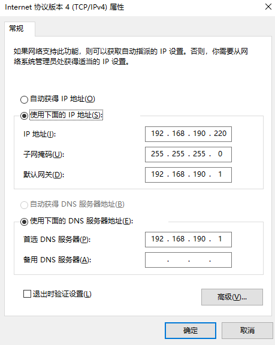

## 一、配置文件更新失败

nacos配置已经是true，但是重启项目后仍然是false，重新发布后才生效。


本地修改nacos配置，测试环境的nacos配置文件不是最新的问题。


## 二、命令提示符和PowerShell有什么区别


## 三、配置Cookie

步骤：

1、启动nginx

2、nginx配置文件

```java
 map $cookie_local_ip $pass_ip {
100 "100";101 "101";102 "102";103 "103";104 "104";105 "105";106 "106";107 "107";108 "108";109 "109";110 "110";111 "111";112 "112";113 "113";114 "114";115 "115";116 "116";117 "117";118 "118";119 "119";120 "120";121 "121";122 "122";123 "123";124 "124";125 "125";126 "126";127 "127";128 "128";129 "129";130 "130";220 "220";
           default "99";
           }
	server {
	        listen       7030;
	        server_name  -;
		location / {
			#return http://192.168.190.$pass_ip:9999;
			        proxy_set_header Host $host;
			        proxy_set_header X-Real-IP $remote_addr;
			        proxy_set_header X-Forwarded-For $proxy_add_x_forwarded_for;
			        proxy_set_header X-Forwarded-Proto $scheme;
			proxy_pass  http://192.168.190.$pass_ip:9999;
		    }
	    }
```

3、手动分配wifi的ip

> https://blog.csdn.net/qq_53175673/article/details/127154580




将测试环境请求转发到本地的配置

```
local_ip         本机ip
local_ip_flag    1
```

