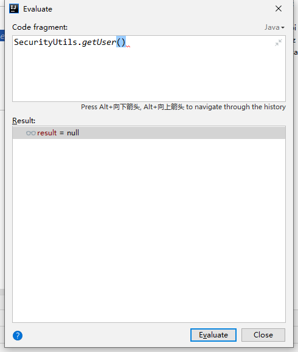
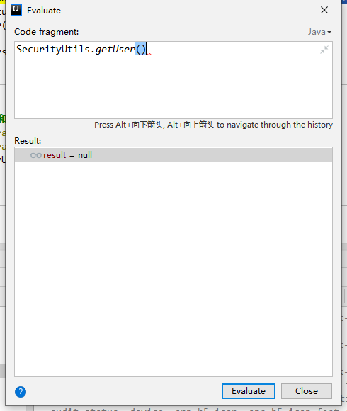
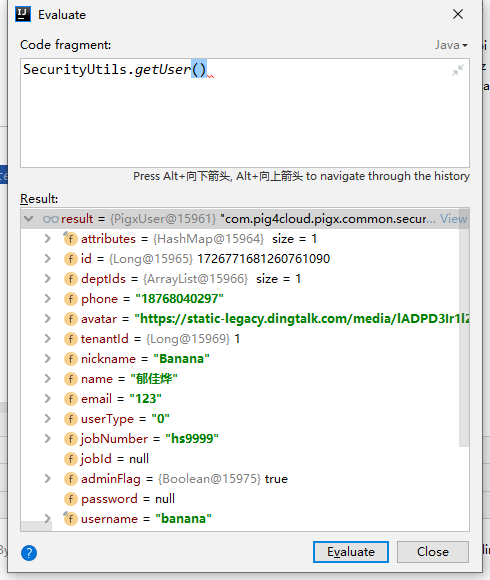
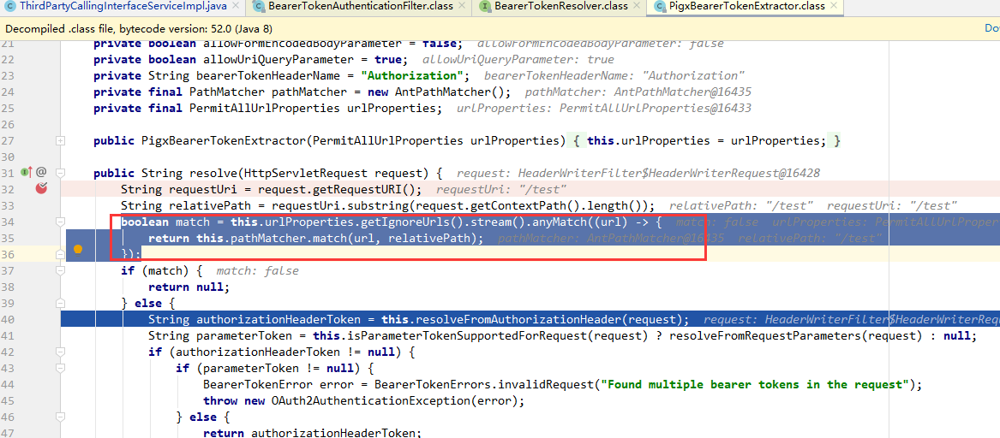
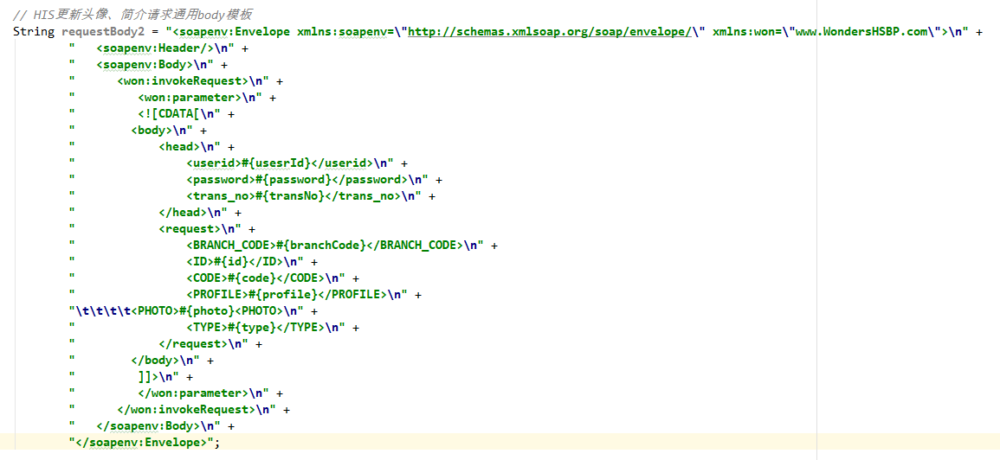

## 一、@Inner的用户权限信息是否会携带过来

①入口Inner=false不鉴权   远程调用接口Inner=true内部鉴权

入口用户信息：



远程调用：




②入口鉴权， 远程调用接口Inner=true内部鉴权

入口：



远程调用：


关键点：

去获取token的时候



feign调用时token的传递：

```java
public class PigxOAuthRequestInterceptor implements RequestInterceptor {
    private static final Logger log = LoggerFactory.getLogger(PigxOAuthRequestInterceptor.class);
    private final BearerTokenResolver tokenResolver;

    public void apply(RequestTemplate template) {
        Collection<String> fromHeader = (Collection)template.headers().get("from");
        if (!CollUtil.isNotEmpty(fromHeader) || !fromHeader.contains("Y")) {
            if (WebUtils.getRequest() != null) {
                HttpServletRequest request = WebUtils.getRequest();
                String token = this.tokenResolver.resolve(request);
                if (!StrUtil.isBlank(token)) {
                    template.header("Authorization", new String[]{String.format("%s %s", TokenType.BEARER.getValue(), token)});
                }
            }
        }
    }

    public PigxOAuthRequestInterceptor(BearerTokenResolver tokenResolver) {
        this.tokenResolver = tokenResolver;
    }
}
```


## 二、java.sql.SQLException: 不支持的字符集 (在类路径中添加 orai18n.jar): ZHS16GBK

```
<dependency>
            <groupId>com.oracle.database.nls</groupId>
            <artifactId>orai18n</artifactId>
            <version>21.5.0.0</version>
            <scope>compile</scope>
        </dependency>
```


## 扩展、SOAP请求协议（暂缓）

### 1、旧方法：

1、配置模板，请求占位符的方式



2、数据中台配置soap请求模版，业务代码中restful请求调用


### 2、新方法：

**java提供的soap请求库：** javax.xml.soap.*

构建实例：

```java
public static void main(String[] args) throws ParserConfigurationException, SOAPException, IOException {
   // System.out.println(requestBody2);
   MessageFactory messageFactory = MessageFactory.newInstance();
   SOAPMessage message = messageFactory.createMessage();

   SOAPPart soapPart = message.getSOAPPart();
   SOAPEnvelope envelope = soapPart.getEnvelope();
   envelope.addNamespaceDeclaration("soapenv", "http://schemas.xmlsoap.org/soap/envelope/");
   envelope.addNamespaceDeclaration("won", "www.WondersHSBP.com");

   // 创建 SOAP 消息的主体部分
   SOAPBody soapBody = envelope.getBody();
   SOAPElement invokeRequestElement = soapBody.addChildElement("invokeRequest", "won");
   SOAPElement parameterElement = invokeRequestElement.addChildElement("parameter", "won");

   // 设置 CDATA 内容
   String cdataContent = "<body><head><userid>#{usesrId}</userid><password>#{password}</password><trans_no>#{transNo}</trans_no></head><request><BRANCH_CODE>#{branchCode}</BRANCH_CODE><ID>#{id}</ID><CODE>#{code}</CODE><PROFILE>#{profile}</PROFILE><PHOTO>#{photo}<PHOTO><TYPE>#{type}</TYPE></request></body>";
   parameterElement.addTextNode(cdataContent);

   // 将 SOAP 消息打印输出
   System.out.println(message.toString());
   message.writeTo(System.out);


}
```

结果：

```xml
<SOAP-ENV:Envelope
    xmlns:SOAP-ENV="http://schemas.xmlsoap.org/soap/envelope/"
    xmlns:soapenv="http://schemas.xmlsoap.org/soap/envelope/"
    xmlns:won="www.WondersHSBP.com">
    <SOAP-ENV:Header/>
    <SOAP-ENV:Body>
        <won:invokeRequest>
            <won:parameter>&lt;body&gt;&lt;head&gt;&lt;userid&gt;#{usesrId}&lt;/userid&gt;&lt;password&gt;#{password}&lt;/password&gt;&lt;trans_no&gt;#{transNo}&lt;/trans_no&gt;&lt;/head&gt;&lt;request&gt;&lt;BRANCH_CODE&gt;#{branchCode}&lt;/BRANCH_CODE&gt;&lt;ID&gt;#{id}&lt;/ID&gt;&lt;CODE&gt;#{code}&lt;/CODE&gt;&lt;PROFILE&gt;#{profile}&lt;/PROFILE&gt;&lt;PHOTO&gt;#{photo}&lt;PHOTO&gt;&lt;TYPE&gt;#{type}&lt;/TYPE&gt;&lt;/request&gt;&lt;/body&gt;</won:parameter>
        </won:invokeRequest>
    </SOAP-ENV:Body>
</SOAP-ENV:Envelope>
```

原始：

```xml
<soapenv:Envelope
    xmlns:soapenv="http://schemas.xmlsoap.org/soap/envelope/"
    xmlns:won="www.WondersHSBP.com">
    <soapenv:Header/>
    <soapenv:Body>
        <won:invokeRequest>
            <won:parameter>
                <![CDATA[ <body><head><userid></userid><password></password><trans_no>SERV_HSB_PUB0004</trans_no></head><request><BRANCH_CODE>00</BRANCH_CODE><EMP_ID></EMP_ID><EMP_CODE>9991</EMP_CODE><EMP_NAME></EMP_NAME><NEED_PIC>1</NEED_PIC></request></body> ]]>
            </won:parameter>
        </won:invokeRequest>
    </soapenv:Body>
</soapenv:Envelope>
```


**XML和Java对象互转的工具类：** JAXB


**开发备份：**

```java
package com.pig4cloud.pigx.common.soap.util;

import cn.hutool.core.collection.CollectionUtil;
import cn.hutool.core.util.StrUtil;
import com.pig4cloud.pigx.common.core.exception.BizException;
import lombok.extern.slf4j.Slf4j;
import org.springframework.stereotype.Component;

import javax.annotation.PostConstruct;
import javax.xml.namespace.QName;
import javax.xml.soap.*;
import java.io.IOException;
import java.util.ArrayList;
import java.util.HashMap;
import java.util.List;
import java.util.Map;

/**
 * soap请求生成工具类
 * @author banana
 * @create 2024-04-22 11:03
 */
@Component
@Slf4j
public class SoapMessageGeneratorUtil {

	// 默认命名空间
	static Map<String, String> defaultNameSpaceDeclaration = new HashMap<>();

	// 默认请求头
	static List<ElementNode> defualtHeadElementNode = new ArrayList<>();

	// 默认请求体
	static List<ElementNode> defaultBodyElementNode = new ArrayList<>();

	// 命名空间的前缀
	final private String nameSpacePrefix = "soapenv";


	public String getSoapMessage(Map<String, String> nameSpaceDeclaration, List<ElementNode> headElementNode, List<ElementNode> bodyElementNode){
		String ret = null;
		try{
			// 创建 SOAP 消息
			MessageFactory messageFactory = MessageFactory.newInstance();
			SOAPMessage message = messageFactory.createMessage();

			// 创建 SOAP 消息各组成部分
			SOAPPart soapPart = message.getSOAPPart();
			SOAPEnvelope envelope = soapPart.getEnvelope();

			// 命名空间
			envelope.setPrefix(nameSpacePrefix);
			envelope.removeNamespaceDeclaration("SOAP-ENV");
			if(CollectionUtil.isEmpty(nameSpaceDeclaration)){
				// 默认命名空间的使用
				defaultNameSpaceDeclaration.forEach((key, value) -> {
					log.info("默认命名空间:{}，{}", key, value);
					try {
						envelope.addNamespaceDeclaration(key, value);
					} catch (SOAPException e) {
						e.printStackTrace();
					}
				});
			} else {
				// 自自定义命名空间的使用
				nameSpaceDeclaration.forEach((key, value) -> {
					log.info("自定义命名空间:{}，{}", key, value);
					try {
						envelope.addNamespaceDeclaration(key, value);
					} catch (SOAPException e) {
						e.printStackTrace();
					}
				});
			}

			// 创建SOAP消息的头部分
			SOAPHeader header = envelope.getHeader();
			header.setPrefix(nameSpacePrefix);


			// 创建 SOAP 消息的主体部分
			SOAPBody body = envelope.getBody();
			body.setPrefix(nameSpacePrefix);
			SoapBodyBuilder(body, bodyElementNode);

			SOAPElement invokeRequestElement = body.addChildElement("invokeRequest", "won");
			SOAPElement parameterElement = invokeRequestElement.addChildElement("parameter", "won");


			// 设置 CDATA 内容
			String cdataContent = "<body><head><userid>#{usesrId}</userid><password>#{password}</password><trans_no>#{transNo}</trans_no></head><request><BRANCH_CODE>#{branchCode}</BRANCH_CODE><ID>#{id}</ID><CODE>#{code}</CODE><PROFILE>#{profile}</PROFILE><PHOTO>#{photo}<PHOTO><TYPE>#{type}</TYPE></request></body>";
			parameterElement.addTextNode(cdataContent);

			// 日志打印 SOAP 消息
			System.out.println(message.toString());
			message.writeTo(System.out);

		} catch (Exception ex) {
			log.error("生成soap请求消息时发生异常：{}", ex.getMessage(), ex);
			throw new BizException("生成soap请求消息时发生异常");
		}

		return ret;
	}

	// 构建soap请求体
	static private void SoapBodyBuilder(SOAPBody body, List<ElementNode> bodyElementNode) throws SOAPException {
		for (ElementNode elementNode : bodyElementNode) {
			String value = elementNode.getValue();
			String nameSpace = elementNode.getNamespace();
			SOAPElement root = body.addChildElement(value, nameSpace);
			SoapBodyBuilderRecursion(root, elementNode);
		}
		return;
	}

	static private void SoapBodyBuilderRecursion(SOAPElement root, ElementNode elementNode) throws SOAPException {
		SOAPElement soapElement = root.addChildElement(elementNode.getValue(), elementNode.getNamespace());
		if(StrUtil.isNotBlank(elementNode.getContent())) {
			soapElement.addTextNode(elementNode.getContent());
		}
		for (ElementNode child : elementNode.getChildren()) {
			SoapBodyBuilderRecursion(soapElement, child);
		}
		return;
	}

	// 初始化默认值
	@PostConstruct
	public void initDefaultValue(){
		// 默认请求头（空）
		defaultNameSpaceDeclaration.put("won", "www.WondersHSBP.com");
		defaultNameSpaceDeclaration.put("soapenv", "http://schemas.xmlsoap.org/soap/envelope/");

		// 默认请求体
		ElementNode rootElementNode = new ElementNode("invokeRequest", "won");
		ElementNode childElementNode = new ElementNode("parameter", "won");
		rootElementNode.addChildElementNode(childElementNode);
		defaultBodyElementNode.add(rootElementNode);

		/*getSoapMessage(null);*/

	}


	public static void main(String[] args) throws SOAPException, IOException {
		ElementNode rootElementNode = new ElementNode("invokeRequest", "won");
		ElementNode childElementNode = new ElementNode("parameter", "won");
		rootElementNode.addChildElementNode(childElementNode);
		defaultBodyElementNode.add(rootElementNode);


		MessageFactory messageFactory = MessageFactory.newInstance();
		SOAPMessage message = messageFactory.createMessage();
		SOAPPart soapPart = message.getSOAPPart();
		SOAPEnvelope envelope = soapPart.getEnvelope();
		envelope.addNamespaceDeclaration("won", "www.WondersHSBP.com");
		envelope.addNamespaceDeclaration("soapenv", "http://schemas.xmlsoap.org/soap/envelope/");

		SoapBodyBuilder(envelope.getBody(), defaultBodyElementNode);

		System.out.println(message.toString());
		message.writeTo(System.out);
		

		envelope.setPrefix("soapenv");
		envelope.removeNamespaceDeclaration("SOAP-ENV");
		/*
		envelope.addNamespaceDeclaration("soapenv", "http://schemas.xmlsoap.org/soap/envelope/");*/
		envelope.addNamespaceDeclaration("won", "www.WondersHSBP.com");

		// 创建 SOAP 消息的头部分
		SOAPHeader header = envelope.getHeader();
		header.setPrefix("soapenv");

		// 创建 SOAP 消息的主体部分
		SOAPBody soapBody = envelope.getBody();
		soapBody.setPrefix("soapenv");
		SOAPElement invokeRequestElement = soapBody.addChildElement("invokeRequest", "won");
		SOAPElement parameterElement = invokeRequestElement.addChildElement("parameter", "won");

		// 设置 CDATA 内容
		String cdataContent = "<body><head><userid>#{usesrId}</userid><password>#{password}</password><trans_no>#{transNo}</trans_no></head><request><BRANCH_CODE>#{branchCode}</BRANCH_CODE><ID>#{id}</ID><CODE>#{code}</CODE><PROFILE>#{profile}</PROFILE><PHOTO>#{photo}<PHOTO><TYPE>#{type}</TYPE></request></body>";
		parameterElement.addTextNode(cdataContent);

		// 将 SOAP 消息打印输出
		System.out.println(message.toString());
		message.writeTo(System.out);
	}


	// 元素结点
	public static class ElementNode{

		// 元素名称
		private String value;

		// 元素命名空间前缀
		private String namespace;

		// 元素内容
		private String content;

		// 子元素
		private List<ElementNode> children;

		// 元素结点创建构造器
		public ElementNode(String value, String namespace) {
			this.value = value;
			this.namespace = namespace;
			this.content = null;
			children = new ArrayList<>();
		}

		// 元素结点创建构造器
		public ElementNode(String value, String namespace, String content) {
			this.value = value;
			this.namespace = namespace;
			this.content = content;
			children = new ArrayList<>();
		}

		public void addChildElementNode(ElementNode elementNode){
			this.children.add(elementNode);
		}

		public List<ElementNode> getChildren() {
			return children;
		}

		public String getValue() {
			return value;
		}

		public String getContent() {
			return content;
		}

		public String getNamespace() {
			return namespace;
		}

		public Boolean ifChildren(){
			return CollectionUtil.isNotEmpty(this.children);
		}
	}
}

```

