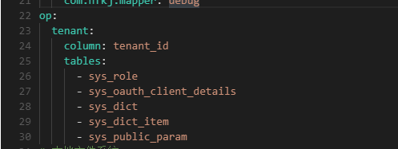

# 2024-04-23

## 一、新增租户报错

### 1.1、报错日志

```
2024-04-23 09:25:30.860 ERROR 6647 --- [  XNIO-1 task-4] c.nfkj.advice.GlobalBizExceptionHandler  : 全局异常信息 ex=com.nfkj.mapper.SysDictItemMapper.insert (batch index #61) failed. 60 prior sub executor(s) completed successfully, but will be rolled back. Cause: java.sql.BatchUpdateException: Duplicate entry '1403974066659328' for key 'sys_dict_item.PRIMARY'
; Duplicate entry '1403974066659328' for key 'sys_dict_item.PRIMARY'; nested exception is java.sql.BatchUpdateException: Duplicate entry '1403974066659328' for key 'sys_dict_item.PRIMARY'

com.nfkj.interceptor.tenant.TenantBroker$TenantBrokerExceptionWrapper: com.nfkj.mapper.SysDictItemMapper.insert (batch index #61) failed. 60 prior sub executor(s) completed successfully, but will be rolled back. Cause: java.sql.BatchUpdateException: Duplicate entry '1403974066659328' for key 'sys_dict_item.PRIMARY'
; Duplicate entry '1403974066659328' for key 'sys_dict_item.PRIMARY'; nested exception is java.sql.BatchUpdateException: Duplicate entry '1403974066659328' for key 'sys_dict_item.PRIMARY'
	at com.nfkj.interceptor.tenant.TenantBroker.runAs(TenantBroker.java:89) ~[classes!/:1.0.0]
	at com.nfkj.service.impl.SysTenantServiceImpl.saveTenant(SysTenantServiceImpl.java:116) ~[classes!/:1.0.0]
	at com.nfkj.service.impl.SysTenantServiceImpl$$FastClassBySpringCGLIB$$ec0da349.invoke(<generated>) ~[classes!/:1.0.0]
	at org.springframework.cglib.proxy.MethodProxy.invoke(MethodProxy.java:218) ~[spring-core-5.3.30.jar!/:5.3.30]
	at org.springframework.aop.framework.CglibAopProxy$CglibMethodInvocation.invokeJoinpoint(CglibAopProxy.java:792) ~[spring-aop-5.3.30.jar!/:5.3.30]
	at org.springframework.aop.framework.ReflectiveMethodInvocation.proceed(ReflectiveMethodInvocation.java:163) ~[spring-aop-5.3.30.jar!/:5.3.30]
	at org.springframework.aop.framework.CglibAopProxy$CglibMethodInvocation.proceed(CglibAopProxy.java:762) ~[spring-aop-5.3.30.jar!/:5.3.30]
	at org.springframework.transaction.interceptor.TransactionInterceptor$1.proceedWithInvocation(TransactionInterceptor.java:123) ~[spring-tx-5.3.30.jar!/:5.3.30]
	at org.springframework.transaction.interceptor.TransactionAspectSupport.invokeWithinTransaction(TransactionAspectSupport.java:388) ~[spring-tx-5.3.30.jar!/:5.3.30]
	at org.springframework.transaction.interceptor.TransactionInterceptor.invoke(TransactionInterceptor.java:119) ~[spring-tx-5.3.30.jar!/:5.3.30]
	at org.springframework.aop.framework.ReflectiveMethodInvocation.proceed(ReflectiveMethodInvocation.java:186) ~[spring-aop-5.3.30.jar!/:5.3.30]
	at org.springframework.aop.framework.CglibAopProxy$CglibMethodInvocation.proceed(CglibAopProxy.java:762) ~[spring-aop-5.3.30.jar!/:5.3.30]
	at org.springframework.aop.framework.CglibAopProxy$DynamicAdvisedInterceptor.intercept(CglibAopProxy.java:707) ~[spring-aop-5.3.30.jar!/:5.3.30]
	at com.nfkj.service.impl.SysTenantServiceImpl$$EnhancerBySpringCGLIB$$831bdef2.saveTenant(<generated>) ~[classes!/:1.0.0]
	at com.nfkj.controller.SysTenantController.save(SysTenantController.java:83) ~[classes!/:1.0.0]
	at sun.reflect.NativeMethodAccessorImpl.invoke0(Native Method) ~[na:1.8.0_391]
	at sun.reflect.NativeMethodAccessorImpl.invoke(NativeMethodAccessorImpl.java:62) ~[na:1.8.0_391]
	at sun.reflect.DelegatingMethodAccessorImpl.invoke(DelegatingMethodAccessorImpl.java:43) ~[na:1.8.0_391]
	at java.lang.reflect.Method.invoke(Method.java:498) ~[na:1.8.0_391]
	at org.springframework.web.method.support.InvocableHandlerMethod.doInvoke(InvocableHandlerMethod.java:205) ~[spring-web-5.3.30.jar!/:5.3.30]
	at org.springframework.web.method.support.InvocableHandlerMethod.invokeForRequest(InvocableHandlerMethod.java:150) ~[spring-web-5.3.30.jar!/:5.3.30]
	at org.springframework.web.servlet.mvc.method.annotation.ServletInvocableHandlerMethod.invokeAndHandle(ServletInvocableHandlerMethod.java:117) ~[spring-webmvc-5.3.30.jar!/:5.3.30]
	at org.springframework.web.servlet.mvc.method.annotation.RequestMappingHandlerAdapter.invokeHandlerMethod(RequestMappingHandlerAdapter.java:895) ~[spring-webmvc-5.3.30.jar!/:5.3.30]
	at org.springframework.web.servlet.mvc.method.annotation.RequestMappingHandlerAdapter.handleInternal(RequestMappingHandlerAdapter.java:808) ~[spring-webmvc-5.3.30.jar!/:5.3.30]
	at org.springframework.web.servlet.mvc.method.AbstractHandlerMethodAdapter.handle(AbstractHandlerMethodAdapter.java:87) ~[spring-webmvc-5.3.30.jar!/:5.3.30]
	at org.springframework.web.servlet.DispatcherServlet.doDispatch(DispatcherServlet.java:1072) ~[spring-webmvc-5.3.30.jar!/:5.3.30]
	at org.springframework.web.servlet.DispatcherServlet.doService(DispatcherServlet.java:965) ~[spring-webmvc-5.3.30.jar!/:5.3.30]
	at org.springframework.web.servlet.FrameworkServlet.processRequest(FrameworkServlet.java:1006) [spring-webmvc-5.3.30.jar!/:5.3.30]
	at org.springframework.web.servlet.FrameworkServlet.doPost(FrameworkServlet.java:909) [spring-webmvc-5.3.30.jar!/:5.3.30]
	at javax.servlet.http.HttpServlet.service(HttpServlet.java:665) [javax.servlet-api-4.0.1.jar!/:4.0.1]
	at org.springframework.web.servlet.FrameworkServlet.service(FrameworkServlet.java:883) [spring-webmvc-5.3.30.jar!/:5.3.30]
	at javax.servlet.http.HttpServlet.service(HttpServlet.java:750) [javax.servlet-api-4.0.1.jar!/:4.0.1]
	at io.undertow.servlet.handlers.ServletHandler.handleRequest(ServletHandler.java:74) [undertow-servlet-2.2.26.Final.jar!/:2.2.26.Final]
	at io.undertow.servlet.handlers.FilterHandler$FilterChainImpl.doFilter(FilterHandler.java:129) [undertow-servlet-2.2.26.Final.jar!/:2.2.26.Final]
	at org.springframework.web.filter.RequestContextFilter.doFilterInternal(RequestContextFilter.java:100) [spring-web-5.3.30.jar!/:5.3.30]
	at org.springframework.web.filter.OncePerRequestFilter.doFilter(OncePerRequestFilter.java:117) [spring-web-5.3.30.jar!/:5.3.30]
	at io.undertow.servlet.core.ManagedFilter.doFilter(ManagedFilter.java:67) [undertow-servlet-2.2.26.Final.jar!/:2.2.26.Final]
	at io.undertow.servlet.handlers.FilterHandler$FilterChainImpl.doFilter(FilterHandler.java:131) [undertow-servlet-2.2.26.Final.jar!/:2.2.26.Final]
	at org.springframework.web.filter.FormContentFilter.doFilterInternal(FormContentFilter.java:93) [spring-web-5.3.30.jar!/:5.3.30]
	at org.springframework.web.filter.OncePerRequestFilter.doFilter(OncePerRequestFilter.java:117) [spring-web-5.3.30.jar!/:5.3.30]
	at io.undertow.servlet.core.ManagedFilter.doFilter(ManagedFilter.java:67) [undertow-servlet-2.2.26.Final.jar!/:2.2.26.Final]
	at io.undertow.servlet.handlers.FilterHandler$FilterChainImpl.doFilter(FilterHandler.java:131) [undertow-servlet-2.2.26.Final.jar!/:2.2.26.Final]
	at org.springframework.boot.actuate.metrics.web.servlet.WebMvcMetricsFilter.doFilterInternal(WebMvcMetricsFilter.java:96) [spring-boot-actuator-2.7.16.jar!/:2.7.16]
	at org.springframework.web.filter.OncePerRequestFilter.doFilter(OncePerRequestFilter.java:117) [spring-web-5.3.30.jar!/:5.3.30]
	at io.undertow.servlet.core.ManagedFilter.doFilter(ManagedFilter.java:67) [undertow-servlet-2.2.26.Final.jar!/:2.2.26.Final]
	at io.undertow.servlet.handlers.FilterHandler$FilterChainImpl.doFilter(FilterHandler.java:131) [undertow-servlet-2.2.26.Final.jar!/:2.2.26.Final]
	at org.springframework.web.filter.CharacterEncodingFilter.doFilterInternal(CharacterEncodingFilter.java:201) [spring-web-5.3.30.jar!/:5.3.30]
	at org.springframework.web.filter.OncePerRequestFilter.doFilter(OncePerRequestFilter.java:117) [spring-web-5.3.30.jar!/:5.3.30]
	at io.undertow.servlet.core.ManagedFilter.doFilter(ManagedFilter.java:67) [undertow-servlet-2.2.26.Final.jar!/:2.2.26.Final]
	at io.undertow.servlet.handlers.FilterHandler$FilterChainImpl.doFilter(FilterHandler.java:131) [undertow-servlet-2.2.26.Final.jar!/:2.2.26.Final]
	at com.nfkj.interceptor.tenant.TenantContextHolderFilter.doFilter(TenantContextHolderFilter.java:68) [classes!/:1.0.0]
	at io.undertow.servlet.core.ManagedFilter.doFilter(ManagedFilter.java:67) [undertow-servlet-2.2.26.Final.jar!/:2.2.26.Final]
	at io.undertow.servlet.handlers.FilterHandler$FilterChainImpl.doFilter(FilterHandler.java:131) [undertow-servlet-2.2.26.Final.jar!/:2.2.26.Final]
	at io.undertow.servlet.handlers.FilterHandler.handleRequest(FilterHandler.java:84) [undertow-servlet-2.2.26.Final.jar!/:2.2.26.Final]
	at io.undertow.servlet.handlers.security.ServletSecurityRoleHandler.handleRequest(ServletSecurityRoleHandler.java:62) [undertow-servlet-2.2.26.Final.jar!/:2.2.26.Final]
	at io.undertow.servlet.handlers.ServletChain$1.handleRequest(ServletChain.java:68) [undertow-servlet-2.2.26.Final.jar!/:2.2.26.Final]
	at io.undertow.servlet.handlers.ServletDispatchingHandler.handleRequest(ServletDispatchingHandler.java:36) [undertow-servlet-2.2.26.Final.jar!/:2.2.26.Final]
	at io.undertow.servlet.handlers.RedirectDirHandler.handleRequest(RedirectDirHandler.java:68) [undertow-servlet-2.2.26.Final.jar!/:2.2.26.Final]
	at io.undertow.servlet.handlers.security.SSLInformationAssociationHandler.handleRequest(SSLInformationAssociationHandler.java:117) [undertow-servlet-2.2.26.Final.jar!/:2.2.26.Final]
	at io.undertow.servlet.handlers.security.ServletAuthenticationCallHandler.handleRequest(ServletAuthenticationCallHandler.java:57) [undertow-servlet-2.2.26.Final.jar!/:2.2.26.Final]
	at io.undertow.server.handlers.PredicateHandler.handleRequest(PredicateHandler.java:43) [undertow-core-2.2.26.Final.jar!/:2.2.26.Final]
	at io.undertow.security.handlers.AbstractConfidentialityHandler.handleRequest(AbstractConfidentialityHandler.java:46) [undertow-core-2.2.26.Final.jar!/:2.2.26.Final]
	at io.undertow.servlet.handlers.security.ServletConfidentialityConstraintHandler.handleRequest(ServletConfidentialityConstraintHandler.java:64) [undertow-servlet-2.2.26.Final.jar!/:2.2.26.Final]
	at io.undertow.security.handlers.AuthenticationMechanismsHandler.handleRequest(AuthenticationMechanismsHandler.java:60) [undertow-core-2.2.26.Final.jar!/:2.2.26.Final]
	at io.undertow.servlet.handlers.security.CachedAuthenticatedSessionHandler.handleRequest(CachedAuthenticatedSessionHandler.java:77) [undertow-servlet-2.2.26.Final.jar!/:2.2.26.Final]
	at io.undertow.security.handlers.AbstractSecurityContextAssociationHandler.handleRequest(AbstractSecurityContextAssociationHandler.java:43) [undertow-core-2.2.26.Final.jar!/:2.2.26.Final]
	at io.undertow.server.handlers.PredicateHandler.handleRequest(PredicateHandler.java:43) [undertow-core-2.2.26.Final.jar!/:2.2.26.Final]
	at io.undertow.servlet.handlers.SendErrorPageHandler.handleRequest(SendErrorPageHandler.java:52) [undertow-servlet-2.2.26.Final.jar!/:2.2.26.Final]
	at io.undertow.server.handlers.PredicateHandler.handleRequest(PredicateHandler.java:43) [undertow-core-2.2.26.Final.jar!/:2.2.26.Final]
	at io.undertow.servlet.handlers.ServletInitialHandler.handleFirstRequest(ServletInitialHandler.java:275) [undertow-servlet-2.2.26.Final.jar!/:2.2.26.Final]
	at io.undertow.servlet.handlers.ServletInitialHandler.access$100(ServletInitialHandler.java:79) [undertow-servlet-2.2.26.Final.jar!/:2.2.26.Final]
	at io.undertow.servlet.handlers.ServletInitialHandler$2.call(ServletInitialHandler.java:134) [undertow-servlet-2.2.26.Final.jar!/:2.2.26.Final]
	at io.undertow.servlet.handlers.ServletInitialHandler$2.call(ServletInitialHandler.java:131) [undertow-servlet-2.2.26.Final.jar!/:2.2.26.Final]
	at io.undertow.servlet.core.ServletRequestContextThreadSetupAction$1.call(ServletRequestContextThreadSetupAction.java:48) [undertow-servlet-2.2.26.Final.jar!/:2.2.26.Final]
	at io.undertow.servlet.core.ContextClassLoaderSetupAction$1.call(ContextClassLoaderSetupAction.java:43) [undertow-servlet-2.2.26.Final.jar!/:2.2.26.Final]
	at io.undertow.servlet.handlers.ServletInitialHandler.dispatchRequest(ServletInitialHandler.java:255) [undertow-servlet-2.2.26.Final.jar!/:2.2.26.Final]
	at io.undertow.servlet.handlers.ServletInitialHandler.access$000(ServletInitialHandler.java:79) [undertow-servlet-2.2.26.Final.jar!/:2.2.26.Final]
	at io.undertow.servlet.handlers.ServletInitialHandler$1.handleRequest(ServletInitialHandler.java:100) [undertow-servlet-2.2.26.Final.jar!/:2.2.26.Final]
	at io.undertow.server.Connectors.executeRootHandler(Connectors.java:393) [undertow-core-2.2.26.Final.jar!/:2.2.26.Final]
	at io.undertow.server.HttpServerExchange$1.run(HttpServerExchange.java:852) [undertow-core-2.2.26.Final.jar!/:2.2.26.Final]
	at org.jboss.threads.ContextClassLoaderSavingRunnable.run(ContextClassLoaderSavingRunnable.java:35) [jboss-threads-3.1.0.Final.jar!/:3.1.0.Final]
	at org.jboss.threads.EnhancedQueueExecutor.safeRun(EnhancedQueueExecutor.java:2019) [jboss-threads-3.1.0.Final.jar!/:3.1.0.Final]
	at org.jboss.threads.EnhancedQueueExecutor$ThreadBody.doRunTask(EnhancedQueueExecutor.java:1558) [jboss-threads-3.1.0.Final.jar!/:3.1.0.Final]
	at org.jboss.threads.EnhancedQueueExecutor$ThreadBody.run(EnhancedQueueExecutor.java:1449) [jboss-threads-3.1.0.Final.jar!/:3.1.0.Final]
	at org.xnio.XnioWorker$WorkerThreadFactory$1$1.run(XnioWorker.java:1282) [xnio-api-3.8.7.Final.jar!/:3.8.7.Final]
	at java.lang.Thread.run(Thread.java:750) [na:1.8.0_391]
Caused by: org.springframework.dao.DuplicateKeyException: com.nfkj.mapper.SysDictItemMapper.insert (batch index #61) failed. 60 prior sub executor(s) completed successfully, but will be rolled back. Cause: java.sql.BatchUpdateException: Duplicate entry '1403974066659328' for key 'sys_dict_item.PRIMARY'
; Duplicate entry '1403974066659328' for key 'sys_dict_item.PRIMARY'; nested exception is java.sql.BatchUpdateException: Duplicate entry '1403974066659328' for key 'sys_dict_item.PRIMARY'
	at org.springframework.jdbc.support.SQLErrorCodeSQLExceptionTranslator.doTranslate(SQLErrorCodeSQLExceptionTranslator.java:244) ~[spring-jdbc-5.3.30.jar!/:5.3.30]
	at org.springframework.jdbc.support.AbstractFallbackSQLExceptionTranslator.translate(AbstractFallbackSQLExceptionTranslator.java:73) ~[spring-jdbc-5.3.30.jar!/:5.3.30]
	at org.mybatis.spring.MyBatisExceptionTranslator.translateExceptionIfPossible(MyBatisExceptionTranslator.java:92) ~[mybatis-spring-2.1.0.jar!/:2.1.0]
	at com.baomidou.mybatisplus.extension.toolkit.SqlHelper.executeBatch(SqlHelper.java:192) ~[mybatis-plus-extension-3.5.3.1.jar!/:3.5.3.1]
	at com.baomidou.mybatisplus.extension.toolkit.SqlHelper.executeBatch(SqlHelper.java:217) ~[mybatis-plus-extension-3.5.3.1.jar!/:3.5.3.1]
	at com.baomidou.mybatisplus.extension.service.impl.ServiceImpl.executeBatch(ServiceImpl.java:240) ~[mybatis-plus-extension-3.5.3.1.jar!/:3.5.3.1]
	at com.baomidou.mybatisplus.extension.service.impl.ServiceImpl.saveBatch(ServiceImpl.java:136) ~[mybatis-plus-extension-3.5.3.1.jar!/:3.5.3.1]
	at com.baomidou.mybatisplus.extension.service.IService.saveBatch(IService.java:73) ~[mybatis-plus-extension-3.5.3.1.jar!/:3.5.3.1]
	at com.baomidou.mybatisplus.extension.service.IService$$FastClassBySpringCGLIB$$f8525d18.invoke(<generated>) ~[mybatis-plus-extension-3.5.3.1.jar!/:3.5.3.1]
	at org.springframework.cglib.proxy.MethodProxy.invoke(MethodProxy.java:218) ~[spring-core-5.3.30.jar!/:5.3.30]
	at org.springframework.aop.framework.CglibAopProxy$CglibMethodInvocation.invokeJoinpoint(CglibAopProxy.java:792) ~[spring-aop-5.3.30.jar!/:5.3.30]
	at org.springframework.aop.framework.ReflectiveMethodInvocation.proceed(ReflectiveMethodInvocation.java:163) ~[spring-aop-5.3.30.jar!/:5.3.30]
	at org.springframework.aop.framework.CglibAopProxy$CglibMethodInvocation.proceed(CglibAopProxy.java:762) ~[spring-aop-5.3.30.jar!/:5.3.30]
	at org.springframework.transaction.interceptor.TransactionInterceptor$1.proceedWithInvocation(TransactionInterceptor.java:123) ~[spring-tx-5.3.30.jar!/:5.3.30]
	at org.springframework.transaction.interceptor.TransactionAspectSupport.invokeWithinTransaction(TransactionAspectSupport.java:388) ~[spring-tx-5.3.30.jar!/:5.3.30]
	at org.springframework.transaction.interceptor.TransactionInterceptor.invoke(TransactionInterceptor.java:119) ~[spring-tx-5.3.30.jar!/:5.3.30]
	at org.springframework.aop.framework.ReflectiveMethodInvocation.proceed(ReflectiveMethodInvocation.java:186) ~[spring-aop-5.3.30.jar!/:5.3.30]
	at org.springframework.aop.framework.CglibAopProxy$CglibMethodInvocation.proceed(CglibAopProxy.java:762) ~[spring-aop-5.3.30.jar!/:5.3.30]
	at org.springframework.aop.framework.CglibAopProxy$DynamicAdvisedInterceptor.intercept(CglibAopProxy.java:707) ~[spring-aop-5.3.30.jar!/:5.3.30]
	at com.nfkj.service.impl.SysDictItemServiceImpl$$EnhancerBySpringCGLIB$$a14d7735.saveBatch(<generated>) ~[classes!/:1.0.0]
	at com.nfkj.service.impl.SysTenantServiceImpl.lambda$saveTenant$9(SysTenantServiceImpl.java:177) ~[classes!/:1.0.0]
	at com.nfkj.interceptor.tenant.TenantBroker.runAs(TenantBroker.java:86) ~[classes!/:1.0.0]
	... 85 common frames omitted
Caused by: java.sql.BatchUpdateException: Duplicate entry '1403974066659328' for key 'sys_dict_item.PRIMARY'
	at com.mysql.cj.jdbc.exceptions.SQLError.createBatchUpdateException(SQLError.java:224) ~[mysql-connector-j-8.0.33.jar!/:8.0.33]
	at com.mysql.cj.jdbc.ClientPreparedStatement.executeBatchSerially(ClientPreparedStatement.java:816) ~[mysql-connector-j-8.0.33.jar!/:8.0.33]
	at com.mysql.cj.jdbc.ClientPreparedStatement.executeBatchInternal(ClientPreparedStatement.java:418) ~[mysql-connector-j-8.0.33.jar!/:8.0.33]
	at com.mysql.cj.jdbc.StatementImpl.executeBatch(StatementImpl.java:795) ~[mysql-connector-j-8.0.33.jar!/:8.0.33]
	at com.zaxxer.hikari.pool.ProxyStatement.executeBatch(ProxyStatement.java:127) ~[HikariCP-4.0.3.jar!/:na]
	at com.zaxxer.hikari.pool.HikariProxyPreparedStatement.executeBatch(HikariProxyPreparedStatement.java) ~[HikariCP-4.0.3.jar!/:na]
	at sun.reflect.GeneratedMethodAccessor249.invoke(Unknown Source) ~[na:na]
	at sun.reflect.DelegatingMethodAccessorImpl.invoke(DelegatingMethodAccessorImpl.java:43) ~[na:1.8.0_391]
	at java.lang.reflect.Method.invoke(Method.java:498) ~[na:1.8.0_391]
	at org.apache.ibatis.logging.jdbc.PreparedStatementLogger.invoke(PreparedStatementLogger.java:78) ~[mybatis-3.5.11.jar!/:3.5.11]
	at com.sun.proxy.$Proxy257.executeBatch(Unknown Source) ~[na:na]
	at org.apache.ibatis.executor.BatchExecutor.doFlushStatements(BatchExecutor.java:123) ~[mybatis-3.5.11.jar!/:3.5.11]
	at org.apache.ibatis.executor.BaseExecutor.flushStatements(BaseExecutor.java:129) ~[mybatis-3.5.11.jar!/:3.5.11]
	at org.apache.ibatis.executor.BaseExecutor.flushStatements(BaseExecutor.java:122) ~[mybatis-3.5.11.jar!/:3.5.11]
	at org.apache.ibatis.executor.CachingExecutor.flushStatements(CachingExecutor.java:114) ~[mybatis-3.5.11.jar!/:3.5.11]
	at sun.reflect.NativeMethodAccessorImpl.invoke0(Native Method) ~[na:1.8.0_391]
	at sun.reflect.NativeMethodAccessorImpl.invoke(NativeMethodAccessorImpl.java:62) ~[na:1.8.0_391]
	at sun.reflect.DelegatingMethodAccessorImpl.invoke(DelegatingMethodAccessorImpl.java:43) ~[na:1.8.0_391]
	at java.lang.reflect.Method.invoke(Method.java:498) ~[na:1.8.0_391]
	at org.apache.ibatis.plugin.Plugin.invoke(Plugin.java:64) ~[mybatis-3.5.11.jar!/:3.5.11]
	at com.sun.proxy.$Proxy254.flushStatements(Unknown Source) ~[na:na]
	at org.apache.ibatis.session.defaults.DefaultSqlSession.flushStatements(DefaultSqlSession.java:249) ~[mybatis-3.5.11.jar!/:3.5.11]
	at com.baomidou.mybatisplus.extension.toolkit.SqlHelper.lambda$executeBatch$1(SqlHelper.java:224) ~[mybatis-plus-extension-3.5.3.1.jar!/:3.5.3.1]
	at com.baomidou.mybatisplus.extension.toolkit.SqlHelper.executeBatch(SqlHelper.java:182) ~[mybatis-plus-extension-3.5.3.1.jar!/:3.5.3.1]
	... 103 common frames omitted
Caused by: java.sql.SQLIntegrityConstraintViolationException: Duplicate entry '1403974066659328' for key 'sys_dict_item.PRIMARY'
	at com.mysql.cj.jdbc.exceptions.SQLError.createSQLException(SQLError.java:118) ~[mysql-connector-j-8.0.33.jar!/:8.0.33]
	at com.mysql.cj.jdbc.exceptions.SQLExceptionsMapping.translateException(SQLExceptionsMapping.java:122) ~[mysql-connector-j-8.0.33.jar!/:8.0.33]
	at com.mysql.cj.jdbc.ClientPreparedStatement.executeInternal(ClientPreparedStatement.java:916) ~[mysql-connector-j-8.0.33.jar!/:8.0.33]
	at com.mysql.cj.jdbc.ClientPreparedStatement.executeUpdateInternal(ClientPreparedStatement.java:1061) ~[mysql-connector-j-8.0.33.jar!/:8.0.33]
	at com.mysql.cj.jdbc.ClientPreparedStatement.executeBatchSerially(ClientPreparedStatement.java:795) ~[mysql-connector-j-8.0.33.jar!/:8.0.33]
	... 125 common frames omitted
```


### 1.2、解决



```yml
op:
  tenant:
    column: tenant_id
    tables:
      - sys_role
      - sys_oauth_client_details
      - sys_dict
      - sys_dict_item
      - sys_public_param
```


## 二、关于maven私服上传后无法下拉的情况

### 2.1、原因说明：

上传jar包的时候添加了classifier

正确的引入依赖是如下所示：

```xml
<dependency>
    <groupId>com.hskj</groupId>
    <artifactId>dyyyRsa</artifactId>
    <version>1.0.0</version>
    <classifier>dyyyRsa</classifier>
</dependency>
```

而一直在使用如下，无法获得依赖

```xml
<dependency>
    <groupId>com.hskj</groupId>
    <artifactId>dyyyRsa</artifactId>
    <version>1.0.0</version>
</dependency>
```

### 2.2、扩展

classifier：

> https://blog.csdn.net/qq_16605855/article/details/79727256

pom:

> https://blog.csdn.net/weixin_39168541/article/details/125505608