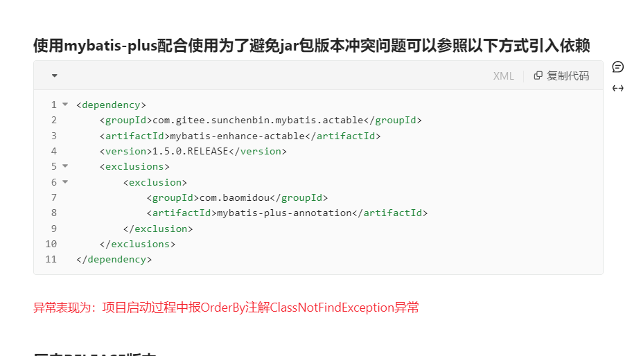

# 2024-05-06

## 一、泛型声明

声明如下泛型时候IDEA提示错误

```java
public class  BaseEntity<T> extends Model<T> {
}
```

报错：

```java
Type parameter 'T' is not within its bound; should extend 'com.baomidou.mybatisplus.extension.activerecord.Model<?>'
```

原因：

可以看下Model类型，去声明的泛型是`T extends Model<?>`

```java
public abstract class Model<T extends Model<?>> implements Serializable {
}
```

在Java中，当你声明一个泛型类时，你可以对类型参数施加限制，以确保它满足特定的条件或约束。这种限制可以通过使用 extends 关键字来实现。

在你的情况中，你声明了一个泛型类 `BaseEntity<T>`，并指定 `T` 作为类型参数。然后，你尝试将其继承自另一个泛型类 `Model<T>`。然而，编译器会报错，指出类型参数 `T` 没有符合其限制。

要解决这个问题，你需要确保 `T` 符合 `Model<T>` 的约束。一种常见的方法是在声明 `BaseEntity<T>` 时使用 extends 关键字来明确指定 `T` 的限制，例如：

```
public class BaseEntity<T extends Model<?>> extends Model<T> {
    // 类的定义
}

```

这样做可以告诉编译器，`T` 必须是 `Model<?>` 类型或其子类型，从而消除类型不匹配的错误。


## 二、@ComponentScan如何扫描到当前项目引入的一个jar包中引用的一个jar包中的内容

在Maven项目中，依赖的JAR文件在编译和运行时通过类路径（classpath）自动包含进来

在Maven项目中，依赖的JAR文件在编译和运行时通过类路径（classpath）自动包含进来的具体实现过程主要依赖于Maven的依赖管理机制和生命周期。以下是该过程的一个简要概述：

1. 依赖解析

- **读取`pom.xml`**：Maven首先会读取项目根目录下的`pom.xml`文件，该文件定义了项目的依赖和其他配置。
- **解析依赖**：Maven会遍历`pom.xml`中定义的每一个`<dependency>`元素，并解析其`groupId`、`artifactId`和`version`，以确定需要下载的依赖。
- **检查本地仓库**：Maven会在本地仓库（通常是用户目录下的`.m2/repository`）中查找已下载的依赖。
- **下载依赖**：如果本地仓库中没有所需的依赖，Maven会从配置的远程仓库中下载它们。

2. 编译阶段（`mvn compile`）

- **构建类路径**：在编译阶段，Maven会构建一个临时的类路径，该路径包含了项目的主源代码以及所有编译时依赖（即`scope`为`compile`和`provided`的依赖）。
- **编译源代码**：使用Java编译器（如`javac`）编译项目的源代码，并将生成的类文件放入`target/classes`目录。这个编译过程会引用类路径上的所有JAR文件。

3. 测试阶段（`mvn test`）

- **扩展类路径**：在测试阶段，Maven会扩展类路径以包含测试代码和测试依赖（即`scope`为`test`的依赖）。
- **运行测试**：使用JUnit或其他测试框架运行项目的测试代码。测试代码可以访问项目代码和所有依赖中的类。

4. 打包阶段（`mvn package`）

- **构建可执行JAR/WAR/EAR等**：Maven会根据项目的类型（如JAR、WAR、EAR等）和配置，将项目的类文件、资源文件以及运行时依赖打包成一个可执行的归档文件。
- **处理依赖**：对于需要包含依赖的打包类型（如`maven-jar-plugin`的`include-dependency`配置或`maven-war-plugin`的默认行为），Maven会将依赖的JAR文件复制到归档文件的`lib`目录（对于WAR文件）或作为归档文件的一部分（对于某些类型的JAR文件，如可执行的“uber-jar”或“fat-jar”）。
- **设置Manifest**：对于JAR文件，Maven还会在Manifest文件中设置`Class-Path`条目，以指定运行时依赖的位置（如果适用）。但是，请注意，这通常不是必需的，因为许多运行环境（如Java命令行、应用服务器等）会自动处理JAR文件的依赖。

5. 运行时

- **设置类路径**：当运行Maven项目（如通过`java -jar`命令运行JAR文件或将WAR文件部署到应用服务器）时，运行环境会根据需要设置类路径。对于JAR文件，这通常包括JAR文件本身以及Manifest中指定的任何依赖（如果适用）。对于WAR文件，应用服务器会自动处理`WEB-INF/lib`目录下的JAR文件。
- **加载类**：Java虚拟机（JVM）使用类路径来查找和加载运行时所需的类。

通过这个过程，Maven确保了在编译和运行时项目都可以访问到其依赖的JAR文件中的类。


在 Maven 项目中，依赖的 JAR 文件在编译和运行时通过类路径（classpath）自动包含进来，这是通过 Maven 的依赖管理机制来实现的。以下是具体的过程：

1. **声明依赖**：在 Maven 项目的 `pom.xml` 文件中，通过 `<dependencies>` 标签声明项目所依赖的外部库，包括库的名称、版本号等信息。
2. **依赖解析**：当执行 Maven 构建命令（如 `mvn compile`、`mvn package`）时，Maven 会解析项目的 `pom.xml` 文件，识别出项目所声明的依赖关系。
3. **依赖下载**：Maven 根据声明的依赖关系，从 Maven 仓库或者其他远程仓库中下载相应的 JAR 文件。这些 JAR 文件通常包含了所需的类和资源。
4. **构建过程**：在编译、测试、打包等构建过程中，Maven 将所需的 JAR 文件添加到类路径中。这意味着编译器和其他构建工具能够访问依赖的类和资源，从而在构建过程中使用它们。
5. **运行时类路径**：在项目运行时，Maven 会将项目所依赖的 JAR 文件添加到 Java 虚拟机的类路径中。这样，项目就能够在运行时访问依赖的类和资源。

总的来说，Maven通过依赖管理和类路径管理机制，使得项目能够自动包含所需的 JAR 文件，从而简化了项目的构建和运行过程。


那为什么target目录中没有依赖的项目，只有当前项目的内容：

在 Maven 项目中，`target` 目录主要用于存放构建结果，比如编译后的类文件、打包后的 JAR 文件以及测试报告等。通常情况下，`target` 目录并不包含项目所依赖的 JAR 文件，而是主要保存当前项目的内容。这是因为 Maven 在项目编译和运行时通过类路径（classpath）来加载依赖的 JAR 文件，而不是将它们直接放到 `target` 目录中。

具体来说：

1. **编译时**：在编译过程中，Maven 会自动配置类路径（classpath）以包含所有项目所依赖的 JAR 文件。因此，编译器可以访问这些依赖，完成项目的编译。
2. **运行时**：当项目运行时，Maven 会确保运行时环境的类路径中包含所有所需的依赖，因此 Java 虚拟机能够访问项目的所有依赖。
3. **打包时**：当执行 `mvn package` 命令时，Maven 会打包当前项目的代码和资源（如 `.class` 文件、`src/main/resources` 中的资源）成一个 JAR 文件或其他打包格式。此时，依赖的 JAR 文件通常不会被直接包含在项目的 JAR 文件中（除非使用了打包插件，如 Maven Shade 插件）。
4. **运行的依赖加载**：当运行打包后的项目时，通常会通过 Maven 或其他类路径管理工具来确保类路径中包含所有所需的依赖 JAR 文件。

因此，`target` 目录中没有直接包含依赖的 JAR 文件，而是通过类路径在运行时动态加载依赖。这种方式使得项目更容易管理和维护。


## 三、关于jar包启动和tar包启动


## 四、引入actable后启动报错

```
Error starting ApplicationContext. To display the conditions report re-run your application with 'debug' enabled.
2024-05-06 16:29:32.965 ERROR 21188 --- [           main] o.s.boot.SpringApplication               : Application run failed

org.springframework.beans.factory.UnsatisfiedDependencyException: Error creating bean with name 'userWardController' defined in file [D:\codesaver\hs-wisdom-platform\hs-ward-patient\hs-ward-patient-biz\target\classes\com\hscloud\wardPatient\controller\UserWardController.class]: Unsatisfied dependency expressed through constructor parameter 0; nested exception is org.springframework.beans.factory.UnsatisfiedDependencyException: Error creating bean with name 'userWardService': Unsatisfied dependency expressed through field 'baseMapper'; nested exception is org.springframework.beans.factory.UnsatisfiedDependencyException: Error creating bean with name 'userWardMapper' defined in file [D:\codesaver\hs-wisdom-platform\hs-ward-patient\hs-ward-patient-biz\target\classes\com\hscloud\wardPatient\mapper\UserWardMapper.class]: Unsatisfied dependency expressed through bean property 'sqlSessionFactory'; nested exception is org.springframework.beans.factory.BeanCreationException: Error creating bean with name 'sqlSessionFactory' defined in class path resource [com/baomidou/mybatisplus/autoconfigure/MybatisPlusAutoConfiguration.class]: Bean instantiation via factory method failed; nested exception is org.springframework.beans.BeanInstantiationException: Failed to instantiate [org.apache.ibatis.session.SqlSessionFactory]: Factory method 'sqlSessionFactory' threw exception; nested exception is java.lang.NoClassDefFoundError: com/baomidou/mybatisplus/annotation/OrderBy
	at org.springframework.beans.factory.support.ConstructorResolver.createArgumentArray(ConstructorResolver.java:801) ~[spring-beans-5.3.30.jar:5.3.30]
	at org.springframework.beans.factory.support.ConstructorResolver.autowireConstructor(ConstructorResolver.java:224) ~[spring-beans-5.3.30.jar:5.3.30]
	at org.springframework.beans.factory.support.AbstractAutowireCapableBeanFactory.autowireConstructor(AbstractAutowireCapableBeanFactory.java:1372) ~[spring-beans-5.3.30.jar:5.3.30]
	at org.springframework.beans.factory.support.AbstractAutowireCapableBeanFactory.createBeanInstance(AbstractAutowireCapableBeanFactory.java:1222) ~[spring-beans-5.3.30.jar:5.3.30]
	at org.springframework.beans.factory.support.AbstractAutowireCapableBeanFactory.doCreateBean(AbstractAutowireCapableBeanFactory.java:582) ~[spring-beans-5.3.30.jar:5.3.30]
	at org.springframework.beans.factory.support.AbstractAutowireCapableBeanFactory.createBean(AbstractAutowireCapableBeanFactory.java:542) ~[spring-beans-5.3.30.jar:5.3.30]
	at org.springframework.beans.factory.support.AbstractBeanFactory.lambda$doGetBean$0(AbstractBeanFactory.java:335) ~[spring-beans-5.3.30.jar:5.3.30]
	at org.springframework.beans.factory.support.DefaultSingletonBeanRegistry.getSingleton(DefaultSingletonBeanRegistry.java:234) ~[spring-beans-5.3.30.jar:5.3.30]
	at org.springframework.beans.factory.support.AbstractBeanFactory.doGetBean(AbstractBeanFactory.java:333) ~[spring-beans-5.3.30.jar:5.3.30]
	at org.springframework.beans.factory.support.AbstractBeanFactory.getBean(AbstractBeanFactory.java:208) ~[spring-beans-5.3.30.jar:5.3.30]
	at org.springframework.beans.factory.support.DefaultListableBeanFactory.preInstantiateSingletons(DefaultListableBeanFactory.java:955) ~[spring-beans-5.3.30.jar:5.3.30]
	at org.springframework.context.support.AbstractApplicationContext.finishBeanFactoryInitialization(AbstractApplicationContext.java:921) ~[spring-context-5.3.30.jar:5.3.30]
	at org.springframework.context.support.AbstractApplicationContext.refresh(AbstractApplicationContext.java:583) ~[spring-context-5.3.30.jar:5.3.30]
	at org.springframework.boot.web.servlet.context.ServletWebServerApplicationContext.refresh(ServletWebServerApplicationContext.java:147) ~[spring-boot-2.7.16.jar:2.7.16]
	at org.springframework.boot.SpringApplication.refresh(SpringApplication.java:731) [spring-boot-2.7.16.jar:2.7.16]
	at org.springframework.boot.SpringApplication.refreshContext(SpringApplication.java:408) [spring-boot-2.7.16.jar:2.7.16]
	at org.springframework.boot.SpringApplication.run(SpringApplication.java:307) [spring-boot-2.7.16.jar:2.7.16]
	at org.springframework.boot.SpringApplication.run(SpringApplication.java:1303) [spring-boot-2.7.16.jar:2.7.16]
	at org.springframework.boot.SpringApplication.run(SpringApplication.java:1292) [spring-boot-2.7.16.jar:2.7.16]
	at com.hscloud.wardPatient.HsWardPatientApplication.main(HsWardPatientApplication.java:25) [classes/:na]
Caused by: org.springframework.beans.factory.UnsatisfiedDependencyException: Error creating bean with name 'userWardService': Unsatisfied dependency expressed through field 'baseMapper'; nested exception is org.springframework.beans.factory.UnsatisfiedDependencyException: Error creating bean with name 'userWardMapper' defined in file [D:\codesaver\hs-wisdom-platform\hs-ward-patient\hs-ward-patient-biz\target\classes\com\hscloud\wardPatient\mapper\UserWardMapper.class]: Unsatisfied dependency expressed through bean property 'sqlSessionFactory'; nested exception is org.springframework.beans.factory.BeanCreationException: Error creating bean with name 'sqlSessionFactory' defined in class path resource [com/baomidou/mybatisplus/autoconfigure/MybatisPlusAutoConfiguration.class]: Bean instantiation via factory method failed; nested exception is org.springframework.beans.BeanInstantiationException: Failed to instantiate [org.apache.ibatis.session.SqlSessionFactory]: Factory method 'sqlSessionFactory' threw exception; nested exception is java.lang.NoClassDefFoundError: com/baomidou/mybatisplus/annotation/OrderBy
	at org.springframework.beans.factory.annotation.AutowiredAnnotationBeanPostProcessor$AutowiredFieldElement.resolveFieldValue(AutowiredAnnotationBeanPostProcessor.java:713) ~[spring-beans-5.3.30.jar:5.3.30]
	at org.springframework.beans.factory.annotation.AutowiredAnnotationBeanPostProcessor$AutowiredFieldElement.inject(AutowiredAnnotationBeanPostProcessor.java:693) ~[spring-beans-5.3.30.jar:5.3.30]
	at org.springframework.beans.factory.annotation.InjectionMetadata.inject(InjectionMetadata.java:119) ~[spring-beans-5.3.30.jar:5.3.30]
	at org.springframework.beans.factory.annotation.AutowiredAnnotationBeanPostProcessor.postProcessProperties(AutowiredAnnotationBeanPostProcessor.java:408) ~[spring-beans-5.3.30.jar:5.3.30]
	at org.springframework.beans.factory.support.AbstractAutowireCapableBeanFactory.populateBean(AbstractAutowireCapableBeanFactory.java:1431) ~[spring-beans-5.3.30.jar:5.3.30]
	at org.springframework.beans.factory.support.AbstractAutowireCapableBeanFactory.doCreateBean(AbstractAutowireCapableBeanFactory.java:619) ~[spring-beans-5.3.30.jar:5.3.30]
	at org.springframework.beans.factory.support.AbstractAutowireCapableBeanFactory.createBean(AbstractAutowireCapableBeanFactory.java:542) ~[spring-beans-5.3.30.jar:5.3.30]
	at org.springframework.beans.factory.support.AbstractBeanFactory.lambda$doGetBean$0(AbstractBeanFactory.java:335) ~[spring-beans-5.3.30.jar:5.3.30]
	at org.springframework.beans.factory.support.DefaultSingletonBeanRegistry.getSingleton(DefaultSingletonBeanRegistry.java:234) ~[spring-beans-5.3.30.jar:5.3.30]
	at org.springframework.beans.factory.support.AbstractBeanFactory.doGetBean(AbstractBeanFactory.java:333) ~[spring-beans-5.3.30.jar:5.3.30]
	at org.springframework.beans.factory.support.AbstractBeanFactory.getBean(AbstractBeanFactory.java:208) ~[spring-beans-5.3.30.jar:5.3.30]
	at org.springframework.beans.factory.config.DependencyDescriptor.resolveCandidate(DependencyDescriptor.java:276) ~[spring-beans-5.3.30.jar:5.3.30]
	at org.springframework.beans.factory.support.DefaultListableBeanFactory.doResolveDependency(DefaultListableBeanFactory.java:1391) ~[spring-beans-5.3.30.jar:5.3.30]
	at org.springframework.beans.factory.support.DefaultListableBeanFactory.resolveDependency(DefaultListableBeanFactory.java:1311) ~[spring-beans-5.3.30.jar:5.3.30]
	at org.springframework.beans.factory.support.ConstructorResolver.resolveAutowiredArgument(ConstructorResolver.java:911) ~[spring-beans-5.3.30.jar:5.3.30]
	at org.springframework.beans.factory.support.ConstructorResolver.createArgumentArray(ConstructorResolver.java:788) ~[spring-beans-5.3.30.jar:5.3.30]
	... 19 common frames omitted
Caused by: org.springframework.beans.factory.UnsatisfiedDependencyException: Error creating bean with name 'userWardMapper' defined in file [D:\codesaver\hs-wisdom-platform\hs-ward-patient\hs-ward-patient-biz\target\classes\com\hscloud\wardPatient\mapper\UserWardMapper.class]: Unsatisfied dependency expressed through bean property 'sqlSessionFactory'; nested exception is org.springframework.beans.factory.BeanCreationException: Error creating bean with name 'sqlSessionFactory' defined in class path resource [com/baomidou/mybatisplus/autoconfigure/MybatisPlusAutoConfiguration.class]: Bean instantiation via factory method failed; nested exception is org.springframework.beans.BeanInstantiationException: Failed to instantiate [org.apache.ibatis.session.SqlSessionFactory]: Factory method 'sqlSessionFactory' threw exception; nested exception is java.lang.NoClassDefFoundError: com/baomidou/mybatisplus/annotation/OrderBy
	at org.springframework.beans.factory.support.AbstractAutowireCapableBeanFactory.autowireByType(AbstractAutowireCapableBeanFactory.java:1534) ~[spring-beans-5.3.30.jar:5.3.30]
	at org.springframework.beans.factory.support.AbstractAutowireCapableBeanFactory.populateBean(AbstractAutowireCapableBeanFactory.java:1417) ~[spring-beans-5.3.30.jar:5.3.30]
	at org.springframework.beans.factory.support.AbstractAutowireCapableBeanFactory.doCreateBean(AbstractAutowireCapableBeanFactory.java:619) ~[spring-beans-5.3.30.jar:5.3.30]
	at org.springframework.beans.factory.support.AbstractAutowireCapableBeanFactory.createBean(AbstractAutowireCapableBeanFactory.java:542) ~[spring-beans-5.3.30.jar:5.3.30]
	at org.springframework.beans.factory.support.AbstractBeanFactory.lambda$doGetBean$0(AbstractBeanFactory.java:335) ~[spring-beans-5.3.30.jar:5.3.30]
	at org.springframework.beans.factory.support.DefaultSingletonBeanRegistry.getSingleton(DefaultSingletonBeanRegistry.java:234) ~[spring-beans-5.3.30.jar:5.3.30]
	at org.springframework.beans.factory.support.AbstractBeanFactory.doGetBean(AbstractBeanFactory.java:333) ~[spring-beans-5.3.30.jar:5.3.30]
	at org.springframework.beans.factory.support.AbstractBeanFactory.getBean(AbstractBeanFactory.java:208) ~[spring-beans-5.3.30.jar:5.3.30]
	at org.springframework.beans.factory.config.DependencyDescriptor.resolveCandidate(DependencyDescriptor.java:276) ~[spring-beans-5.3.30.jar:5.3.30]
	at org.springframework.beans.factory.support.DefaultListableBeanFactory.doResolveDependency(DefaultListableBeanFactory.java:1391) ~[spring-beans-5.3.30.jar:5.3.30]
	at org.springframework.beans.factory.support.DefaultListableBeanFactory.resolveDependency(DefaultListableBeanFactory.java:1311) ~[spring-beans-5.3.30.jar:5.3.30]
	at org.springframework.beans.factory.annotation.AutowiredAnnotationBeanPostProcessor$AutowiredFieldElement.resolveFieldValue(AutowiredAnnotationBeanPostProcessor.java:710) ~[spring-beans-5.3.30.jar:5.3.30]
	... 34 common frames omitted
Caused by: org.springframework.beans.factory.BeanCreationException: Error creating bean with name 'sqlSessionFactory' defined in class path resource [com/baomidou/mybatisplus/autoconfigure/MybatisPlusAutoConfiguration.class]: Bean instantiation via factory method failed; nested exception is org.springframework.beans.BeanInstantiationException: Failed to instantiate [org.apache.ibatis.session.SqlSessionFactory]: Factory method 'sqlSessionFactory' threw exception; nested exception is java.lang.NoClassDefFoundError: com/baomidou/mybatisplus/annotation/OrderBy
	at org.springframework.beans.factory.support.ConstructorResolver.instantiate(ConstructorResolver.java:653) ~[spring-beans-5.3.30.jar:5.3.30]
	at org.springframework.beans.factory.support.ConstructorResolver.instantiateUsingFactoryMethod(ConstructorResolver.java:633) ~[spring-beans-5.3.30.jar:5.3.30]
	at org.springframework.beans.factory.support.AbstractAutowireCapableBeanFactory.instantiateUsingFactoryMethod(AbstractAutowireCapableBeanFactory.java:1352) ~[spring-beans-5.3.30.jar:5.3.30]
	at org.springframework.beans.factory.support.AbstractAutowireCapableBeanFactory.createBeanInstance(AbstractAutowireCapableBeanFactory.java:1195) ~[spring-beans-5.3.30.jar:5.3.30]
	at org.springframework.beans.factory.support.AbstractAutowireCapableBeanFactory.doCreateBean(AbstractAutowireCapableBeanFactory.java:582) ~[spring-beans-5.3.30.jar:5.3.30]
	at org.springframework.beans.factory.support.AbstractAutowireCapableBeanFactory.createBean(AbstractAutowireCapableBeanFactory.java:542) ~[spring-beans-5.3.30.jar:5.3.30]
	at org.springframework.beans.factory.support.AbstractBeanFactory.lambda$doGetBean$0(AbstractBeanFactory.java:335) ~[spring-beans-5.3.30.jar:5.3.30]
	at org.springframework.beans.factory.support.DefaultSingletonBeanRegistry.getSingleton(DefaultSingletonBeanRegistry.java:234) ~[spring-beans-5.3.30.jar:5.3.30]
	at org.springframework.beans.factory.support.AbstractBeanFactory.doGetBean(AbstractBeanFactory.java:333) ~[spring-beans-5.3.30.jar:5.3.30]
	at org.springframework.beans.factory.support.AbstractBeanFactory.getBean(AbstractBeanFactory.java:208) ~[spring-beans-5.3.30.jar:5.3.30]
	at org.springframework.beans.factory.config.DependencyDescriptor.resolveCandidate(DependencyDescriptor.java:276) ~[spring-beans-5.3.30.jar:5.3.30]
	at org.springframework.beans.factory.support.DefaultListableBeanFactory.doResolveDependency(DefaultListableBeanFactory.java:1391) ~[spring-beans-5.3.30.jar:5.3.30]
	at org.springframework.beans.factory.support.DefaultListableBeanFactory.resolveDependency(DefaultListableBeanFactory.java:1311) ~[spring-beans-5.3.30.jar:5.3.30]
	at org.springframework.beans.factory.support.AbstractAutowireCapableBeanFactory.autowireByType(AbstractAutowireCapableBeanFactory.java:1519) ~[spring-beans-5.3.30.jar:5.3.30]
	... 45 common frames omitted
Caused by: org.springframework.beans.BeanInstantiationException: Failed to instantiate [org.apache.ibatis.session.SqlSessionFactory]: Factory method 'sqlSessionFactory' threw exception; nested exception is java.lang.NoClassDefFoundError: com/baomidou/mybatisplus/annotation/OrderBy
	at org.springframework.beans.factory.support.SimpleInstantiationStrategy.instantiate(SimpleInstantiationStrategy.java:185) ~[spring-beans-5.3.30.jar:5.3.30]
	at org.springframework.beans.factory.support.ConstructorResolver.instantiate(ConstructorResolver.java:648) ~[spring-beans-5.3.30.jar:5.3.30]
	... 58 common frames omitted
Caused by: java.lang.NoClassDefFoundError: com/baomidou/mybatisplus/annotation/OrderBy
	at com.baomidou.mybatisplus.core.metadata.TableInfoHelper.initTableFields(TableInfoHelper.java:331) ~[mybatis-plus-core-3.5.3.2.jar:3.5.3.2]
	at com.baomidou.mybatisplus.core.metadata.TableInfoHelper.initTableInfo(TableInfoHelper.java:197) ~[mybatis-plus-core-3.5.3.2.jar:3.5.3.2]
	at com.baomidou.mybatisplus.core.metadata.TableInfoHelper.initTableInfo(TableInfoHelper.java:174) ~[mybatis-plus-core-3.5.3.2.jar:3.5.3.2]
	at com.baomidou.mybatisplus.core.injector.AbstractSqlInjector.inspectInject(AbstractSqlInjector.java:48) ~[mybatis-plus-core-3.5.3.2.jar:3.5.3.2]
	at com.github.yulichang.injector.MPJSqlInjector.inspectInject(MPJSqlInjector.java:168) ~[mybatis-plus-join-core-1.4.5.jar:na]
	at com.baomidou.mybatisplus.core.MybatisMapperAnnotationBuilder.parserInjector(MybatisMapperAnnotationBuilder.java:133) ~[mybatis-plus-core-3.5.3.2.jar:3.5.3.2]
	at com.baomidou.mybatisplus.core.MybatisMapperAnnotationBuilder.parse(MybatisMapperAnnotationBuilder.java:123) ~[mybatis-plus-core-3.5.3.2.jar:3.5.3.2]
	at com.baomidou.mybatisplus.core.MybatisMapperRegistry.addMapper(MybatisMapperRegistry.java:94) ~[mybatis-plus-core-3.5.3.2.jar:3.5.3.2]
	at com.baomidou.mybatisplus.core.MybatisConfiguration.addMapper(MybatisConfiguration.java:129) ~[mybatis-plus-core-3.5.3.2.jar:3.5.3.2]
	at org.apache.ibatis.builder.xml.XMLMapperBuilder.bindMapperForNamespace(XMLMapperBuilder.java:445) ~[mybatis-3.5.13.jar:3.5.13]
	at org.apache.ibatis.builder.xml.XMLMapperBuilder.parse(XMLMapperBuilder.java:102) ~[mybatis-3.5.13.jar:3.5.13]
	at com.baomidou.mybatisplus.extension.spring.MybatisSqlSessionFactoryBean.buildSqlSessionFactory(MybatisSqlSessionFactoryBean.java:570) ~[mybatis-plus-extension-3.5.3.2.jar:3.5.3.2]
	at com.baomidou.mybatisplus.extension.spring.MybatisSqlSessionFactoryBean.afterPropertiesSet(MybatisSqlSessionFactoryBean.java:440) ~[mybatis-plus-extension-3.5.3.2.jar:3.5.3.2]
	at com.baomidou.mybatisplus.extension.spring.MybatisSqlSessionFactoryBean.getObject(MybatisSqlSessionFactoryBean.java:605) ~[mybatis-plus-extension-3.5.3.2.jar:3.5.3.2]
	at com.baomidou.mybatisplus.autoconfigure.MybatisPlusAutoConfiguration.sqlSessionFactory(MybatisPlusAutoConfiguration.java:235) ~[mybatis-plus-boot-starter-3.5.3.2.jar:3.5.3.2]
	at sun.reflect.NativeMethodAccessorImpl.invoke0(Native Method) ~[na:1.8.0_91]
	at sun.reflect.NativeMethodAccessorImpl.invoke(NativeMethodAccessorImpl.java:62) ~[na:1.8.0_91]
	at sun.reflect.DelegatingMethodAccessorImpl.invoke(DelegatingMethodAccessorImpl.java:43) ~[na:1.8.0_91]
	at java.lang.reflect.Method.invoke(Method.java:498) ~[na:1.8.0_91]
	at org.springframework.beans.factory.support.SimpleInstantiationStrategy.instantiate(SimpleInstantiationStrategy.java:154) ~[spring-beans-5.3.30.jar:5.3.30]
	... 59 common frames omitted
Caused by: java.lang.ClassNotFoundException: com.baomidou.mybatisplus.annotation.OrderBy
	at java.net.URLClassLoader.findClass(URLClassLoader.java:381) ~[na:1.8.0_91]
	at java.lang.ClassLoader.loadClass(ClassLoader.java:424) ~[na:1.8.0_91]
	at sun.misc.Launcher$AppClassLoader.loadClass(Launcher.java:331) ~[na:1.8.0_91]
	at java.lang.ClassLoader.loadClass(ClassLoader.java:357) ~[na:1.8.0_91]
	... 79 common frames omitted

2024-05-06 16:29:32.967  WARN 21188 --- [       Thread-4] c.a.n.common.http.HttpClientBeanHolder   : [HttpClientBeanHolder] Start destroying common HttpClient
2024-05-06 16:29:32.967  WARN 21188 --- [      Thread-10] c.a.nacos.common.notify.NotifyCenter     : [NotifyCenter] Start destroying Publisher
2024-05-06 16:29:32.967  WARN 21188 --- [      Thread-10] c.a.nacos.common.notify.NotifyCenter     : [NotifyCenter] Destruction of the end
2024-05-06 16:29:32.967  WARN 21188 --- [       Thread-4] c.a.n.common.http.HttpClientBeanHolder   : [HttpClientBeanHolder] Destruction of the end
Disconnected from the target VM, address: '127.0.0.1:64424', transport: 'socket'

Process finished with exit code 1

```

解决方法见官方文档：




## 五、Maven中的resources

```
<build>
<finalName>${project.name}</finalName>
<resources>
    <resource>
        <directory>src/main/resources</directory>
        <includes>
            <include>**/*.properties</include>
            <include>**/*.xml</include>
            <include>**/*.yml</include>
        </includes>
        <filtering>true</filtering>
    </resource>
</resources>
```

这段代码是Maven项目中用来配置资源过滤的部分。具体来说：

- `<build>`：这是 Maven POM 文件中用来配置构建过程的部分。
- `<finalName>${project.name}</finalName>`：这个元素定义了最终构建的项目文件的名称。`${project.name}` 会被 Maven 替换为项目的名称。
- `<resources>`：这个元素定义了项目中资源的配置。
- `<resource>`：在 `<resources>` 元素中，`<resource>` 元素用于指定一个资源目录的配置。
- `<directory>src/main/resources</directory>`：这个元素指定了资源目录的路径。通常情况下，Maven 项目中的资源文件（比如配置文件、XML 文件等）会放置在 `src/main/resources` 目录下。
- `<includes>`：这个元素用于指定需要包含的文件类型。
- `<include>**/*.properties</include>`：这个元素指定了需要包含的 `.properties` 文件。
- `<include>**/*.xml</include>`：这个元素指定了需要包含的 `.xml` 文件。
- `<include>**/*.yml</include>`：这个元素指定了需要包含的 `.yml` 文件。
- `<filtering>true</filtering>`：这个元素指定了是否启用资源过滤。当设置为 `true` 时，Maven 会在复制资源文件到输出目录之前，对其中的变量进行替换。通常用于替换配置文件中的变量或者占位符，使得配置在不同环境中具有不同的值。`<filtering>false</filtering>`：表示禁用资源过滤。在这种情况下，Maven会简单地将资源文件复制到输出目录，不做任何替换或处理
