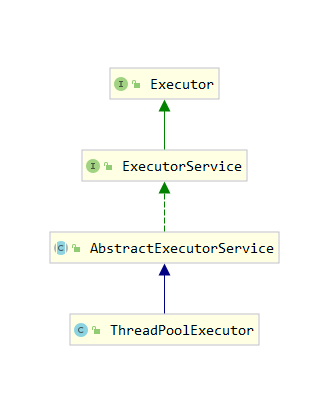

# 2024-05-07

## 一、Mybatis的缓存


## 二、多线程应用

### 2.1、java.util.concurrent.Executor

`java.util.concurrent.Executor`是一个接口，用于表示能够执行提交的任务的对象。它是Java并发框架中的一部分，提供了一种简单的方式来执行异步任务，从而实现并发编程。

Executor和多线程之间有密切的关系，因为Executor通常用于管理多线程任务的执行。在Java中，Executor框架提供了一种高级的抽象，用于简化多线程编程。它隐藏了线程的创建和管理细节，使得开发者能够更加方便地提交任务，并由Executor框架负责任务的调度和执行。底层实现上，Executor通常会使用线程池来执行任务。线程池是一组预先创建的线程，它们可以重复使用来执行多个任务，避免了频繁创建和销毁线程所带来的性能开销。当使用Executor框架时，可以通过配置线程池的大小、任务队列等参数来控制并发度和资源利用率。

```java
public interface Executor {

    /**
     * Executes the given command at some time in the future.  The command
     * may execute in a new thread, in a pooled thread, or in the calling
     * thread, at the discretion of the {@code Executor} implementation.
     *
     * @param command the runnable task
     * @throws RejectedExecutionException if this task cannot be
     * accepted for execution
     * @throws NullPointerException if command is null
     */
    void execute(Runnable command);
}
```

这个方法用于执行给定的命令，通常表示一个`Runnable`任务

`java.util.concurrent`包中还包括一些实现了`Executor`接口的具体类，例如：

1. `ThreadPoolExecutor`：线程池执行器，用于创建和管理线程池，可以控制线程池的大小、任务队列等参数。
2. `Executors`工厂类：提供了一些静态工厂方法，用于创建不同类型的`Executor`实例，如`newCachedThreadPool()`、`newFixedThreadPool()`等。

使用`Executor`接口及其实现类，可以更方便地管理并发任务的执行，避免直接操作线程，从而提高了代码的可读性和可维护性，并且可以更好地利用系统资源。


其继承关系如下所示：




1. **Executor（执行器）**：是一个接口，定义了一个单一的方法`execute(Runnable command)`，用于执行给定的任务。它是Java并发框架的基础接口之一，用于执行异步任务。`Executor`接口没有提供任务生命周期管理或任务执行结果返回的机制。
2. **ExecutorService（执行器服务）**：是`Executor`接口的扩展，它是一个接口，提供了一组更丰富的方法来管理和控制异步任务的执行。除了可以提交任务外，`ExecutorService`还可以控制任务的执行、取消任务、管理任务的执行结果等。
3. **AbstractExecutorService（抽象执行器服务）**：是`ExecutorService`接口的抽象实现类，提供了`submit()`、`invokeAll()`、`invokeAny()`等方法的默认实现，它是自定义`ExecutorService`实现类的一个好的基础。
4. **ThreadPoolExecutor（线程池执行器）**：是`AbstractExecutorService`的一个具体实现类，用于创建和管理线程池。`ThreadPoolExecutor`可以控制线程池的大小、任务队列、拒绝策略等参数，提供了灵活且高效的线程池管理功能。

在这个关系中，`ExecutorService`扩展了`Executor`接口，提供了更丰富的功能；`AbstractExecutorService`则是`ExecutorService`接口的抽象实现类，为自定义的`ExecutorService`提供了默认的实现；`ThreadPoolExecutor`则是`AbstractExecutorService`的具体实现类，用于创建和管理线程池。

总的来说，`Executor`是接口，用于执行异步任务；`ExecutorService`是`Executor`的扩展，提供了更多的功能；`AbstractExecutorService`是`ExecutorService`的抽象实现类；`ThreadPoolExecutor`是`AbstractExecutorService`的具体实现类，用于创建和管理线程池。


关于ThreadPoolTaskExecutor和 ThreadPoolExecutor

`ThreadPoolTaskExecutor`和`ThreadPoolExecutor`是Java中两种不同的线程池实现，用于执行并行任务。它们都有自己的特点和用途。

### `ThreadPoolExecutor`

- `ThreadPoolExecutor`是Java提供的原生线程池类，位于`java.util.concurrent`包下。
- 提供了很高的灵活性，可以通过构造方法详细设置线程池的参数，如核心线程数、最大线程数、队列类型、线程工厂和拒绝策略等。
- 对于`ThreadPoolExecutor`的管理和配置需要较多的编码工作和理解线程池的原理。

### `ThreadPoolTaskExecutor`

- `ThreadPoolTaskExecutor`是Spring框架提供的线程池实现类，位于`org.springframework.scheduling.concurrent`包下。
- 它是对`ThreadPoolExecutor`的包装，提供了一些更易于配置和使用的特性。
- 支持Spring的异步功能，可以结合`@EnableAsync`和`@Async`注解来实现异步任务执行。
- 配置比较简单，可以通过设置核心线程数、最大线程数、保持活动时间、队列容量等参数来快速配置线程池。
- 可以与Spring的应用上下文更好地集成，提供更友好的管理和配置选项。

### 总结

- `ThreadPoolExecutor`更灵活，但需要更多的手工管理和配置。
- `ThreadPoolTaskExecutor`是对`ThreadPoolExecutor`的封装，提供了更简洁易用的API和与Spring框架的集成。
- 在Spring应用中，如果需要使用异步任务执行，通常优先选择`ThreadPoolTaskExecutor`