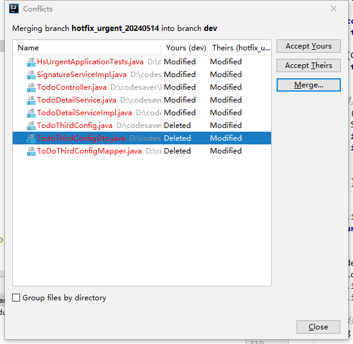
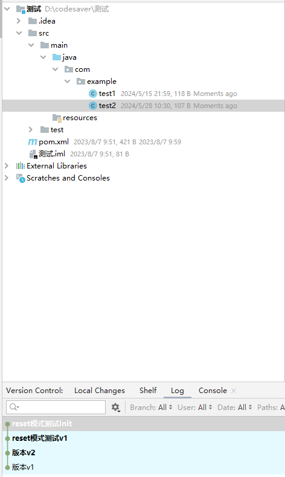
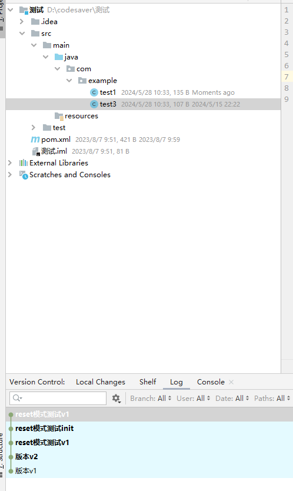
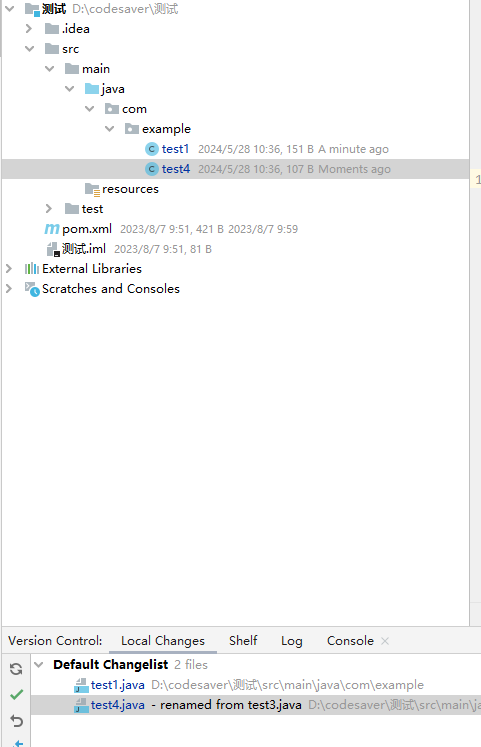

## 2024-05-14

### 一、分支merge合错问题解决方案

#### 1.1、具体场景

本来是要将A分支合到B，却误合到Dev



#### 1.2、处理方式

接受所有DEV的内容（即上述的Accept Yours），此时合并后的结果不会推到远端，然后回退dev节点即可，这里直接使用Hard Reset。


#### 1.3、版本切换git reset四种模式说明

##### 1.3.1、通用提交测试

初始节点：reset模式测试init

初始节点内容：



test1

```java
package com.example;

/**
 * @author banana
 * @create 2023-08-07 9:52
 */
public class test1 {
    // 123
}

```

test2

```java
package com.example;

/**
 * @author banana
 * @create 2024-05-28 10:30
 */
public class test2 {
}

```


一次提交节点：reset模式测试v1

一次提交节点提交内容：

删除test2，新增test3，修改test1内容



test1

```
package com.example;

/**
 * @author banana
 * @create 2023-08-07 9:52
 */
public class test1 {
    // 123
    // v1新增
}

```

test3

```
package com.example;

/**
 * @author banana
 * @create 2024-05-28 10:33
 */
public class test3 {
}

```


二次但不提交

修改test1，新增//v2新增

新增test4

删除test3




##### 1.3.2、soft模式

到达reset的节点，回退节点中的修改，都放到Local Changes暂存区中

##### 1.3.3、mixed模式

到达reset的节点，只保留当前Local Changes中的内容，中间节点修改内容都放到工作区中

##### 1.3.4、hard模式

到达reset的节点，中间节点，和当前Local Changes中的内容所有都丢失

##### 1.3.5、keep模式

到达reset节点，保留暂存区的内容，工作目录 和 提交到本地仓库 都重置成目标目标节点的內容，中间节点内容丢失


### 二、危急值自动校验 日志不打印问题

使用@Validated进行自动校验的时候，需要通过BindingResult入参去手动获取异常，不然异常无法被捕捉到，日志无法打印

```java
 @Operation(summary = "新增危急值")
@PostMapping("/addUrgent")
@Inner(value = false)
@AuthOpenAPI
public R addUrgent(@RequestBody @Validated AddUrgentDto input, BindingResult bindingResult){
    log.info("第三方调用危急值增加接口");
    log.info("入参：" + input);
    // 权限校验
    ValidationUtils.resultHandle(bindingResult);
    return R.ok(thirdPartyCallingInterfaceService.addUrgent(input));
}
```


### 三、docker容器内容拷贝到宿主机命令

`docker cp hs-outpatient:/logs/hs-outpatient /app`