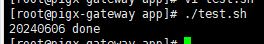

## 20240606

## 一、Mysql备份

### 1.1 相关文档

```shell
//mysql每日备份
mkdir -p /app/mysqlbak/data
mkdir -p /app/mysqlbak/scripts
mkdir -p /app/mysqlbak/logs

//制作脚本
cd /app/mysqlbak/scripts
vi backup.sh

#备份目录
BACKUP_ROOT=/app/mysqlbak
BACKUP_FILEDIR=$BACKUP_ROOT/data

# 当前日期
# 用于在Unix/Linux系统中获取当前日期，并将其格式化为YYYYMMDD的形式
# date：这是一个Unix/Linux系统中的内置命令，用于显示或设置系统日期和时间
# +%Y%m%d：是date命令的一个参数，用于指定日期的输出格式：
# %Y表示四位数的年份（例如：2024）。
# %m表示两位数的月份（例如：06）。
# %d表示两位数的日期（例如：06）
DATE=$(date +%Y%m%d)

######备份######
docker exec  mysql57 /usr/bin/mysqldump -uroot -pHtyw@2020 --default-character-set=utf8 --hex-blob pmc > /app/mysqlbak/data/pmc/pmc_$DATE.sql

echo $DATE" done"

//加入计划任务
crontab -e

00 5 * * * /app/mysqlbak/scripts/backup.sh > /app/mysqlbak/logs/backup.log 2>&1

坑点：
--default-character-set=utf8
防止中文乱码

--hex-blob
16进制的方式导出binary、varbinary、blob类型的数据（必加）

dump导出的文件中，单表的新增语句是整合成一句的，执行时候 默认内存4m不够，要在my.ini 中添加
#设置允许server接收的数据包最大值
max_allowed_packet = 500M
增加执行内存

navicat导出的文件中，单表的新增语句是一笔数据一条，所以不存在4m不够的情况
```


### 1.2 具体操作

#### 1. 详细命令参数解析

```shell
# 当前日期
DATE=$(date +%Y%m%d)
```

说明：

- 用于在Unix/Linux系统中获取当前日期，并将其格式化为YYYYMMDD的形式
- date：这是一个Unix/Linux系统中的内置命令，用于显示或设置系统日期和时间
- +%Y%m%d：是date命令的一个参数，用于指定日期的输出格式：
  - %Y表示四位数的年份（例如：2024）
  - %m表示两位数的月份（例如：06）
  - %d表示两位数的日期（例如：06）


```shell
# docker备份数据库命令
docker exec  mysql57 /usr/bin/mysqldump -uroot -pHtyw@2020 --default-character-set=utf8 --hex-blob pmc > /app/mysqlbak/data/pmc/pmc_$DATE.sql
```

说明：

- `docker exec mysql57`：通过 Docker 在名为 `mysql57` 的容器中执行后续的命令
- `/usr/bin/mysqldump`: MySQL 数据库备份工具的路径
- `-uroot`: 这是 MySQL 数据库连接的用户名，这里使用的是 `root` 用户
- `-pHtyw@2020`: 这是 MySQL 数据库连接的密码，密码为 Htyw@2020
- `--default-character-set=utf8`: 这是设置导出文件的字符集为 UTF-8
- `--hex-blob`: 这个选项告诉 `mysqldump` 将 `BLOB` 类型的字段以十六进制格式导出
- `pmc`: 这是要备份的数据库的名称
- `> /app/mysqlbak/data/pmc/pmc_$DATE.sql`: 这部分将备份数据导出到指定路径下的文件中，文件名中包含了当前日期的信息
  - `>` 是重定向操作符，用于将命令的输出重定向到文件中
  - `/app/mysqlbak/data/pmc/pmc_$DATE.sql` 是要保存备份文件的路径和文件名，其中 `$DATE` 是之前设置的当前日期。这样，生成的备份文件会以 `pmc_YYYYMMDD.sql` 的形式命名，并保存到指定路径下


```shell
echo $DATE" done"
```

输出备份完成的提示信息，包含当前日期


```shell
crontab -e

00 5 * * * /app/mysqlbak/scripts/backup.sh > /app/mysqlbak/logs/backup.log 2>&1
```

- `crontab -e`：编辑当前用户的 cron 任务表，cron 任务表用于定期执行特定的命令或脚本

- `00 5 * * * /app/mysqlbak/scripts/backup.sh > /app/mysqlbak/logs/backup.log 2>&1`：定期执行backup.sh脚本，并将脚本的输出重定向到日志文件中
  - ``00 5 * * *`: 这部分是 cron 时间表达式，指定了任务的执行时间
    - `00` 表示分钟，这里是每小时的第 0 分钟，也就是整点开始执行。
    - `5` 表示小时，这里是每天的第 5 小时，即凌晨 5 点。
    - `* * *` 表示日期、月份和星期，都使用通配符 `*`，表示每天、每月和每星期都执行任务。


#### 2.制造.sh脚本测试

首先通过``which bash` 命令来检查 Bash 解释器的路径`

```shell
which bash
- /usr/bin/bash
```

制造.sh脚本的demo

```
vim test.sh
```

test.sh中的内容

```shell
#!/usr/bin/bash
DATE=$(date +%Y%m%d)
echo $DATE" done"
```

通过`./test.sh`执行脚本文件，可以看到执行成功




注意：

- -bash: ./test.sh: /bin/bash^M: 坏的解释器: 没有那个文件或目录

  这个错误通常是由于文件格式问题引起的，特别是在跨操作系统时（比如在 Windows 和 Unix/Linux 之间）。

  错误信息中的 `^M` 表示回车符（Carriage Return），在 Windows 中，换行符是由回车符和换行符组成的 (`\r\n`)，而在 Unix/Linux 中，换行符只是换行符 (`\n`)。因此，当你在 Unix/Linux 系统中运行一个从 Windows 系统复制过来的脚本时，可能会遇到这个问题。


#### 3. 具体过程

寻找mysql的位置

```
which mysql
```

/nfdata/engine/mysql/bin/mysql

检查 Bash 解释器的路径

```
which bash
```

/bin/bash

创建相关目录

```
mkdir -p /app/mysqlbak/data
mkdir -p /app/mysqlbak/scripts
mkdir -p /app/mysqlbak/logs
```

创建备份脚本

```
cd /app/mysqlbak/scripts
vi MySQLBackUp.sh
```

备份脚本【docker】

```shell
#!/usr/bin/bash

#备份目录路径
BACKUP_ROOT=/app/mysqlbak
BACKUP_FILEDIR=$BACKUP_ROOT/data

#容器名称
CONTAINER_NAME="mysql"

#MYSQL配置
MYSQL_USER="root"
MYSQL_PASSWORD="Cc123@leo"

#获取当前日期
DATE=$(date +%Y%m%d)

#备份命令
mkdir -p /app/mysqlbak/data/$DATE

#需要备份的数据表配置
DATABASES=("hsx_config" "hsx")

#备份数据表
for DB in "${DATABASES[@]}"
do
        # 执行备份命令
        docker exec "$CONTAINER_NAME" /usr/bin/mysqldump -u"$MYSQL_USER" -p"$MYSQL_PASSWORD" --default-character-set=utf8 --hex-blob "$DB" > "$BACKUP_FILEDIR/$DATE/${DB}_${DATE}.sql"
        # 检查是否成功
        if [ $? -eq 0 ]; then
                echo "备份数据库 【$DB】 成功"
        else
                echo "备份数据库【$DB】 失败"
        fi

done


#打印任务结束
echo $DATE" done"

```

备份脚本【非docker】

```shell
#!/bin/bash

#备份目录路径
BACKUP_ROOT=/app/mysqlbak
BACKUP_FILEDIR=$BACKUP_ROOT/data

#容器名称
CONTAINER_NAME="mysql"

#MYSQL配置
MYSQL_USER="root"
MYSQL_PASSWORD="Cc123@leo"

#获取当前日期
DATE=$(date +%Y%m%d)

#备份命令
mkdir -p /app/mysqlbak/data/$DATE

#需要备份的数据表配置
DATABASES=("hsx_config" "hsx")

#备份数据表
for DB in "${DATABASES[@]}"
do
        # 执行备份命令
        /nfdata/engine/mysql/bin/mysqldump -u"$MYSQL_USER" -p"$MYSQL_PASSWORD" --default-character-set=utf8 --hex-blob "$DB" > "$BACKUP_FILEDIR/$DATE/${DB}_${DATE}.sql"
        # 检查是否成功
        if [ $? -eq 0 ]; then
                echo "备份数据库 【$DB】 成功"
        else
                echo "备份数据库【$DB】 失败"
        fi

done


#打印任务结束
echo $DATE" done"

```

基于权限

```shell
chmod 777 MySQLBackUp.sh
```

将其加入计划任务

```shell
crontab -e

00 5 * * * /app/mysqlbak/scripts/MySQLBackUp.sh > /app/mysqlbak/logs/MySQLBackUp.log 2>&1
```


创建清理脚本

```
vi MySQLClear.sh
```

清理脚本

```shell
#!/usr/bin/bash

#备份目录
BACKUP_ROOT=/app/mysqlbak/data

find "$BACKUP_ROOT" -mindepth 1 -maxdepth 1 -type d -ctime +15 -exec rm -r {} \;

```

给权限

```
chmod 777 MySQLClear.sh
```


设置定时任务

```
crontab -e

00 5 * * * /app/mysqlbak/scripts/MySQLClear.sh > /app/mysqlbak/logs/MySQLClear.log 2>&1
```


### # 问题

1、OCI runtime exec failed: exec failed: unable to start container process: exec: "/usr/bin": permission denied: unknown

docker启动的时候，没有开启特权模式

```shell
 docker run -d --restart always --name mysql -v /etc/localtime:/etc/localtime -v /home/mysql/conf/my.cnf:/etc/my.cnf -v /home/mysql/data:/var/lib/mysql -p 3306:3306 -e MYSQL_ROOT_PASSWORD=Cc123@leo --privileged=true --network=bridge mysql:8.0.34
```

之前的写法

```
 docker run -d --restart always --name mysql -v /etc/localtime:/etc/localtime -v /home/mysql/conf/my.cnf:/etc/my.cnf -v /home/mysql/data:/var/lib/mysql -p 3306:3306 -e MYSQL_ROOT_PASSWORD=Cc123@leo --privileged --network bridge mysql:8.0.34
```

2、docker exec mysql /usr/bin/mysqldump -uroot -pCc123@leo --default-character-set=utf8 --hex-blob hsx_config > /app/mysqlbak/data/$DATE/config_$DATE.sql没有目录会报错

1. 使用 `mkdir -p` 命令：

   ```
   bashDATE=$(date +"%Y%m%d")
   mkdir -p /app/mysqlbak/data/$DATE
   docker exec mysql /usr/bin/mysqldump -uroot -pCc123@leo --default-character-set=utf8 --hex-blob hsx_config > /app/mysqlbak/data/$DATE/config_$DATE.sql
   ```

   这样做会首先创建目录 `/app/mysqlbak/data/$DATE`，然后再执行 `mysqldump` 命令。

2. 在 `mysqldump` 命令中直接指定输出文件的路径，使用 `--result-file` 参数：

   ```
   bashDATE=$(date +"%Y%m%d")
   docker exec mysql /usr/bin/mysqldump -uroot -pCc123@leo --default-character-set=utf8 --hex-blob hsx_config --result-file=/app/mysqlbak/data/$DATE/config_$DATE.sql
   ```

   这样做会直接将 `mysqldump` 的输出保存到指定的文件中，如果目录不存在，则会自动创建。


## 二、hutool的tree

```
@Override
public List<Tree<Long>> selectTree(String deptName, Long parentId) {
   // 查询全部部门
   List<SysDept> deptAllList = deptMapper.selectList(
         Wrappers.<SysDept>lambdaQuery().like(StrUtil.isNotBlank(deptName), SysDept::getName, deptName));
   // 查询数据权限内部门
   List<Long> deptOwnIdList = deptMapper.selectListByScope(
         Wrappers.<SysDept>lambdaQuery().like(StrUtil.isNotBlank(deptName), SysDept::getName, deptName),
         DataScope.of()).stream().map(SysDept::getDeptId).collect(Collectors.toList());

   // 权限内部门
   List<TreeNode<Long>> collect = deptAllList.stream()
         .filter(dept -> dept.getDeptId().intValue() != dept.getParentId())
         .sorted(Comparator.comparingInt(SysDept::getSortOrder)).map(dept -> {
            TreeNode<Long> treeNode = new TreeNode<>();
            treeNode.setId(dept.getDeptId());
            treeNode.setParentId(dept.getParentId());
            treeNode.setName(dept.getName());
            // 有权限不返回标识
            Map<String, Object> extra = new HashMap<>(8);
            extra.put("isLock", !deptOwnIdList.contains(dept.getDeptId()));
            extra.put("createTime", dept.getCreateTime());
            extra.put("tenantId", dept.getTenantId());
            extra.put("status", dept.getStatus());
            extra.put("sortOrder", dept.getSortOrder());
            extra.put("isSync", dept.getIsSync());
            extra.put("type", dept.getType());
            treeNode.setExtra(extra);
            return treeNode;
         }).collect(Collectors.toList());
   // 模糊查询 不组装树结构 直接返回 表格方便编辑
   if (StrUtil.isNotBlank(deptName)) {
      return collect.stream().map(node -> {
         Tree<Long> tree = new Tree<>();
         tree.putAll(node.getExtra());
         BeanUtils.copyProperties(node, tree);
         return tree;
      }).collect(Collectors.toList());
   }

   return TreeUtil.build(collect, parentId == null ? 0 : parentId);
}
```