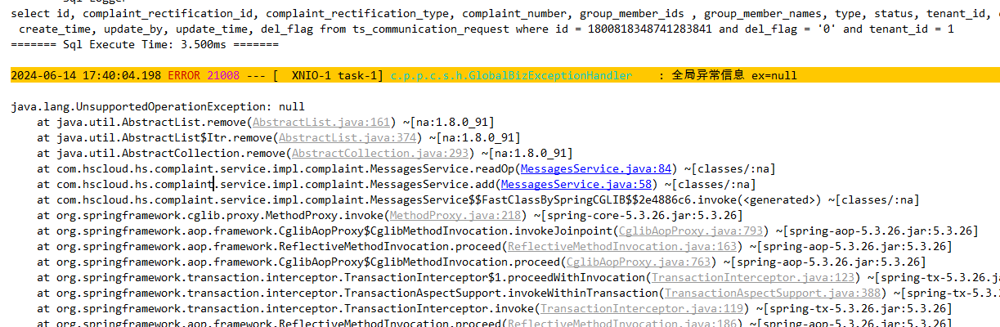

# 2024-06-14

## 1、 我调用一个restful接口，然后又在里面调用一个openfeign接口，那么   HttpServletRequest request = WebUtils.getRequest();  获得的request是第一次的请求

在你描述的情况下，如果你在一个 RESTful 接口的处理逻辑中，又调用了一个使用 OpenFeign 客户端的接口，那么 `HttpServletRequest request = WebUtils.getRequest();` 获得的确实是最初进入你的 RESTful 接口的请求对象，并不会代表后续 OpenFeign 调用发出的请求。

这是因为每个 HTTP 请求在服务器端处理时，都会生成一个对应的 `HttpServletRequest` 对象，用于表示该请求的各种信息，例如请求头、请求参数、请求体等。当你通过 `WebUtils.getRequest()` 获取 `HttpServletRequest` 对象时，它会返回当前线程处理的 HTTP 请求对象。

在你的情况下：

1. **初始请求**: 当客户端发起一个 RESTful 接口的请求时，服务器会创建一个 `HttpServletRequest` 对象，它包含了客户端发起请求时的所有信息。
2. **OpenFeign 调用**: 如果你在该 RESTful 接口的实现中使用了 OpenFeign 客户端来调用另一个服务的接口，OpenFeign 发出的 HTTP 请求是一个全新的请求，它会创建一个新的 `HttpServletRequest` 对象来代表这个新的请求。这个新请求与初始请求是独立的，它们之间不共享 `HttpServletRequest` 对象。

因此，虽然你在初始请求中可能通过 `WebUtils.getRequest()` 获得了初始请求的 `HttpServletRequest` 对象，但这个对象不会反映后续由 OpenFeign 发起的任何请求的信息。如果你需要在 OpenFeign 调用中使用某些初始请求的信息，你需要显式地将这些信息传递给 OpenFeign 客户端。


因此在资源服务器中，调用openfeign接口，是否携带token，是根据最初的请求来的。

```java
@Slf4j
@RequiredArgsConstructor
public class PigxOAuthRequestInterceptor implements RequestInterceptor {

   private final BearerTokenResolver tokenResolver;

   /**
    * Create a template with the header of provided name and extracted extract </br>
    *
    * 1. 如果使用 非web 请求，header 区别 </br>
    *
    * 2. 根据authentication 还原请求token
    * @param template
    */
   @Override
   public void apply(RequestTemplate template) {
      Collection<String> fromHeader = template.headers().get(SecurityConstants.FROM);
      // 带from 请求直接跳过
      if (CollUtil.isNotEmpty(fromHeader) && fromHeader.contains(SecurityConstants.FROM_IN)) {
         return;
      }

      // 非web 请求直接跳过
      if (WebUtils.getRequest() == null) {
         return;
      }
      HttpServletRequest request = WebUtils.getRequest();
      // 避免请求参数的 query token 无法传递
      String token = tokenResolver.resolve(request);
      if (StrUtil.isBlank(token)) {
         return;
      }
      template.header(HttpHeaders.AUTHORIZATION,
            String.format("%s %s", OAuth2AccessToken.TokenType.BEARER.getValue(), token));

   }

}
```


### 2、自动填充失败

```
baseMapper.update(wrapperUpdate);
```

对的，`baseMapper.update(wrapperUpdate)` 是 MyBatis Plus 提供的方法，用于执行更新操作，其中 `wrapperUpdate` 是一个条件构造器（Wrapper）对象，用于指定更新的条件和字段。

关于自动填充的触发问题，确实存在一些细节需要注意：

1. **自动填充的触发条件：**
   - MyBatis Plus 的自动填充功能是在执行插入或更新操作时触发的，而不是在执行查询或简单的更新条件构造器时触发的。
   - 具体来说，自动填充会在执行 `baseMapper.insert(entity)`、`baseMapper.updateById(entity)` 等直接针对实体对象的插入和更新方法时触发。
2. **关于使用条件构造器的更新方法：**
   - 当使用 `baseMapper.update(wrapperUpdate)` 这样的方法时，MyBatis Plus 不会自动触发自动填充功能。
   - 原因在于，条件构造器（Wrapper）用于生成 SQL 的 WHERE 子句，它并不直接操作实体对象的字段，因此不会涉及到自动填充字段的更新操作。

如果你希望在使用条件构造器进行更新操作时也触发自动填充，通常可以考虑以下两种方法：

- **手动调用填充方法：** 在执行更新之前，手动调用 `MetaObjectHandler` 的 `updateFill` 方法来填充需要更新的字段。例如：

  ```
  java// 假设 metaObjectHandler 是你的 MetaObjectHandler 实例
  metaObjectHandler.updateFill(wrapperUpdate.getEntity());
  baseMapper.update(wrapperUpdate);
  ```

- **使用实体对象直接更新：** 如果可能的话，尽量使用直接操作实体对象的方法，如 `baseMapper.updateById(entity)` 或 `baseMapper.update(entity, wrapper)`，这些方法会自动触发 MyBatis Plus 的自动填充功能。

总结来说，`baseMapper.update(wrapperUpdate)` 是 MP 提供的方法，但它不会触发自动填充功能，除非你手动调用相关的填充方法或者使用直接操作实体对象的更新方法。


### 3、入参加@PostConstruct 注解和使用 InitializingBean 接口都不会被调用


### 4、报错

```
private String readOp(String unreadUserIds, String userId) {
        List<String> unreadUserList = Arrays.asList(unreadUserIds.split(","));

        unreadUserList.remove(userId);
        return unreadUserList.stream().collect(Collectors.joining(","));
    }
```



问题出现在 `Arrays.asList()` 返回的是一个固定大小的列表，该列表不支持结构修改操作，例如添加或移除元素。因此，调用 `remove()` 方法会导致 `UnsupportedOperationException` 异常。

解决这个问题的方法是创建一个可变的 `ArrayList`，而不是使用 `Arrays.asList()` 返回的固定大小列表。下面是如何修正这个问题的示例代码：

```
javaCopy Code// 假设 unreadUserIds 是一个以逗号分隔的字符串
String unreadUserIds = "Alice,Bob,Charlie";
String[] userIdsArray = unreadUserIds.split(",");

// 创建一个可变的 ArrayList
List<String> unreadUserList = new ArrayList<>(Arrays.asList(userIdsArray));

String userIdToRemove = "Bob";
unreadUserList.remove(userIdToRemove);

System.out.println(unreadUserList);
```

这里做了以下改进：

1. 使用 `Arrays.asList(userIdsArray)` 创建一个 `List<String>`，然后将其传递给 `ArrayList` 的构造函数，从而创建一个可变的 `ArrayList`。
2. 然后可以安全地调用 `remove()` 方法来移除特定的 `userId`。


#### 5、@Transactional(readOnly = true) 在类上使用

