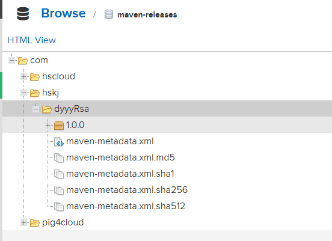
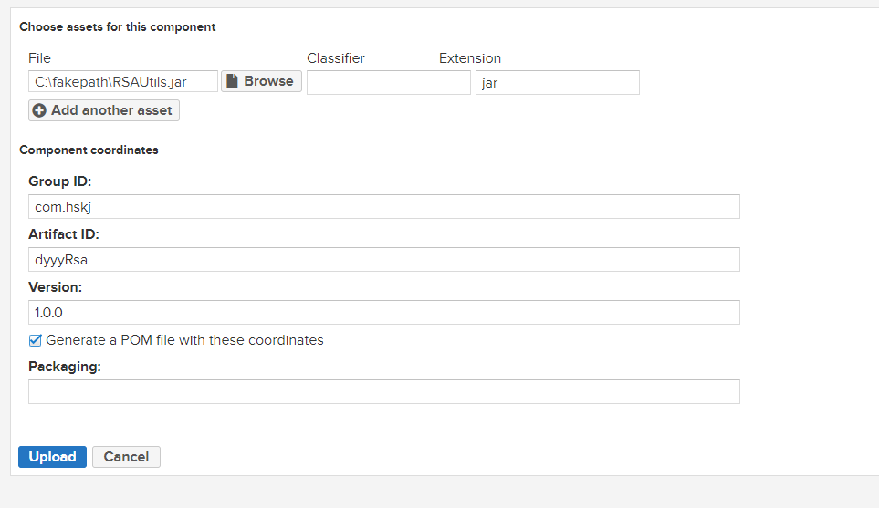
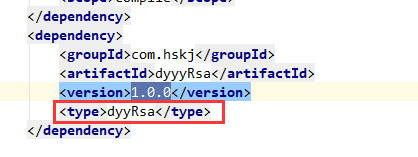
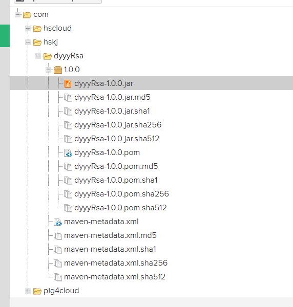

## 2024-06-17

### 一、关于消息传递的问题

A调用B方法，将A的声明的参数通过入参传到B方法中，B中修改改参数的值，A中也会修改吗

在 Java 中，方法的参数传递方式是按值传递。这意味着当你将参数传递给一个方法时，实际上是将该参数的副本传递给了方法。

所以，当 A 调用 B 方法并将参数传递给 B 方法时，B 方法对参数值的任何修改不会影响到 A 方法中原始参数的值。

下面是一个示例代码来说明这个概念：

```
javaCopy Codepublic class MethodParameterExample {
    public static void main(String[] args) {
        int value = 10;
        System.out.println("Before calling method: " + value);
        modifyValue(value);
        System.out.println("After calling method: " + value);
    }

    public static void modifyValue(int num) {
        num = 20;
        System.out.println("Inside method: " + num);
    }
}
```

输出结果如下：

```
Copy CodeBefore calling method: 10
Inside method: 20
After calling method: 10
```

在这个例子中，`value` 是一个基本数据类型的变量，并且它被传递给了 `modifyValue()` 方法。在 `modifyValue()` 方法内部，参数 `num` 的值被修改为 `20`。然而，在调用方法之后，`value` 变量的值仍然是 `10`，未受到 `modifyValue()` 方法的影响。

需要注意的是，如果参数是一个对象引用，那么对对象内部状态的修改可能会在方法调用之后对原始对象产生影响，因为对象引用的副本和原始对象引用指向同一个对象。但是，直接修改对象引用本身（比如将参数重新赋值为一个新的对象），不会影响到原始对象。

```
javaCopy Codepublic class MethodParameterExample {
    public static void main(String[] args) {
        StringBuilder sb = new StringBuilder("Hello");
        System.out.println("Before calling method: " + sb.toString());
        modifyStringBuilder(sb);
        System.out.println("After calling method: " + sb.toString());
    }

    public static void modifyStringBuilder(StringBuilder builder) {
        builder.append(", World!");
        System.out.println("Inside method: " + builder.toString());
        builder = new StringBuilder("New StringBuilder");
    }
}
```

输出结果如下：

```
Copy CodeBefore calling method: Hello
Inside method: Hello, World!
After calling method: Hello, World!
```

在这个例子中，`sb` 是一个 `StringBuilder` 对象的引用，在传递给 `modifyStringBuilder()` 方法后，`builder` 和 `sb` 引用同一个对象。在方法内部，通过修改 `builder` 对象的状态，例如追加字符串。但是，尝试将 `builder` 重新分配给一个新的 `StringBuilder` 对象并不会影响到原始的 `sb` 引用，所以在方法调用之后，`sb` 仍然引用原始的 `StringBuilder` 对象。

因此，可以总结出：对于基本数据类型的参数，方法内部的修改不会影响到原始值；对于对象引用类型的参数，方法内部对对象内部状态的修改可能会影响到原始对象，但对对象引用本身的修改不会影响到原始引用。


那我们上面使用String类型就不行，String难道不是引用类型吗？

你说得对，`String` 在 Java 中确实是引用类型。不过，`String` 是不可变的对象。这意味着一旦创建了一个 `String` 对象，它的值就不能被修改。任何对字符串进行的修改（例如字符串连接、替换等）都会创建一个新的字符串对象，而不是修改原来的字符串对象。

让我们看一个例子：

```
javaCopy Codepublic class StringExample {
    public static void main(String[] args) {
        String str = "Hello";
        System.out.println("Before calling method: " + str);
        modifyString(str);
        System.out.println("After calling method: " + str);
    }

    public static void modifyString(String s) {
        s = s + ", World!";
        System.out.println("Inside method: " + s);
    }
}
```

输出结果如下：

```
Copy CodeBefore calling method: Hello
Inside method: Hello, World!
After calling method: Hello
```

在这个例子中，`str` 是一个 `String` 对象。当我们把 `str` 传递给 `modifyString` 方法时，传递的是对象引用的副本。在 `modifyString` 方法内部，通过 `s = s + ", World!";` 创建了一个新的 `String` 对象，并将 `s` 引用指向这个新的对象。但是，这并不会改变原始的 `str` 引用，它仍然指向最初的字符串对象 "Hello"。

因此，你会看到，在方法调用之后，`str` 的值并没有改变。

总结来说，尽管 `String` 是引用类型，由于其不可变性，当你试图修改它的时候，实际上是在创建新的字符串对象。这就是为什么在方法内部对 `String` 进行的任何修改都不会影响到方法外的原始字符串引用。


### 二、私服maven包



maven私服上传jar包的时候，有个选项：Generate a POM file with these coordinates

在使用 Maven 私服（例如 Nexus 或 Artifactory）上传 JAR 包时，选项“Generate a POM file with these coordinates”指的是在上传 JAR 包的同时，生成一个对应的 `pom.xml` 文件，并将其上传到私服

生成并上传 POM 文件的作用主要体现在 Maven 项目管理和依赖管理的方面：

1. **依赖管理**：
   - 当你上传一个 JAR 包到 Maven 私服时，如果选择生成并上传对应的 POM 文件，这个 POM 文件将包含你所上传的 JAR 包的坐标信息（Group ID, Artifact ID, Version）。这些信息对于其他项目在使用该 JAR 包时十分重要，因为 Maven 通过这些坐标来管理和解析依赖关系。
   - 当其他项目需要引用你上传的 JAR 包时，它们可以直接在自己的 Maven 项目的 POM 文件中声明这个 JAR 包的依赖，Maven 就会自动到私服中查找并下载这个 JAR 包及其对应的 POM 文件。
2. **项目信息和版本控制**：
   - POM 文件不仅包含了依赖的坐标，还包括了项目的其他信息，比如项目的名称、描述、URL，以及构建和插件的配置信息等。
   - 这些信息有助于其他开发者了解你的项目，还有助于版本控制和管理。特别是在团队环境中，准确的项目信息和版本管理是非常重要的。
3. **构建和部署过程的自动化**：
   - 通过正确配置 POM 文件，可以使得 Maven 自动化构建和部署过程。例如，你可以设置 Maven 插件来自动上传构建产物到私服，或者通过 Maven 的发布流程来发布你的项目版本。
4. **规范化和统一管理**：
   - 使用 Maven 的 POM 文件，特别是与私服集成后，有助于项目的规范化管理和统一的依赖管理。所有的依赖和项目信息都集中在 POM 文件中，这样使得项目的管理更加清晰和可维护。

因此，生成并上传 POM 文件不仅是为了上传 JAR 包本身，更是为了建立起 Maven 项目管理的基础，使得依赖管理、版本控制和构建过程更加自动化和可靠。




其中Extension对应pom中的type



结果




### 三、关于wrapper的last和apply

```
wrapper.last("and FIND_IN_SET(" + user.getId() + ", REPLACE(group_member_ids, ' ', ''))");
```

结果：

```
### Error querying database.  Cause: com.baomidou.mybatisplus.core.exceptions.MybatisPlusException: Failed to process, Error SQL: SELECT id,complaint_rectification_id,complaint_rectification_type,complaint_number,group_member_ids,group_member_names,type,status,tenant_id,create_by,create_time,update_by,update_time,del_flag FROM ts_communication_request WHERE del_flag='0' FIND_IN_SET(1726771681260761090, REPLACE(group_member_ids, ' ', '')) > 0
### Cause: com.baomidou.mybatisplus.core.exceptions.MybatisPlusException: Failed to process, Error SQL: SELECT id,complaint_rectification_id,complaint_rectification_type,complaint_number,group_member_ids,group_member_names,type,status,tenant_id,create_by,create_time,update_by,update_time,del_flag FROM ts_communication_request WHERE del_flag='0' FIND_IN_SET(1726771681260761090, REPLACE(group_member_ids, ' ', '')) > 0
```


```
wrapper.apply("FIND_IN_SET({0}, REPLACE(group_member_ids, ' ', '')) > 0", user.getId());
```

结果

```
ok
```


在 MyBatis Plus 中，`wrapper.last` 方法允许你直接追加原生 SQL 片段，但如果想使用 `wrapper` 自带的方法来实现类似的功能，则需要一些技巧。实际上，MyBatis Plus 的 `QueryWrapper` 并没有直接提供 `FIND_IN_SET` 或类似的函数支持，但我们可以通过通用的条件构建方法来实现类似效果。

假设你有一个字段 `group_member_ids` 是以逗号分隔的字符串，并且你要检查是否包含某个特定的 `userId`，下面是一个示例如何使用 MyBatis Plus 的条件构建器来达到这个目的：

```
javaCopy CodeLong userId = user.getId(); // 假设 user 对象已经定义并且 getId() 返回一个 Long 类型的 ID

QueryWrapper<YourEntity> wrapper = new QueryWrapper<>();
wrapper.apply("FIND_IN_SET({0}, REPLACE(group_member_ids, ' ', '')) > 0", userId);

// 其他查询条件可以继续添加
// wrapper.eq("other_column", someValue);
```

在这个例子中，我们使用了 `apply` 方法。`apply` 方法允许你直接插入一个自定义的 SQL 片段，同时支持参数化处理。这样可以避免直接拼接字符串带来的 SQL 注入风险。

具体解释：

- `FIND_IN_SET({0}, REPLACE(group_member_ids, ' ', '')) > 0`: 我们在 SQL 片段中使用了占位符 `{0}` 来表示 `userId`。`REPLACE(group_member_ids, ' ', '')` 先去掉可能存在的空格，然后 `FIND_IN_SET` 用于查找 `userId` 是否在逗号分隔的 `group_member_ids` 字符串中出现。
- `userId` 参数将会被传递到 SQL 中的 `{0}` 位置。

这种方式使得 SQL 语句更加安全和可读，同时保持了 MyBatis Plus 的灵活性和扩展性。


注意：

last不会自己添加and

apply会