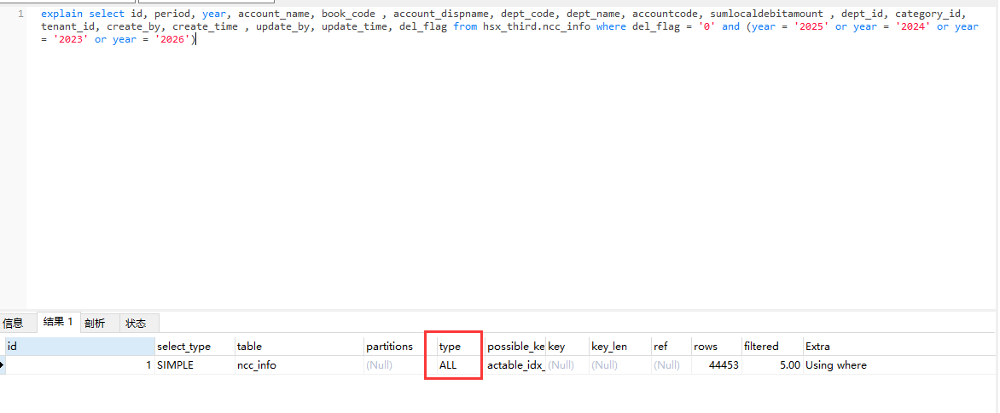

# 20241119

## 一、关于SQL排查

假设已经通过慢SQL找出了一条有问题的SQL

业务代码

```java
 // 全量数据
List<NccInfo> nccInfos = nccInfoService.list(Wrappers.<NccInfo>lambdaQuery()
        .eq(NccInfo::getYear, curYear).or().eq(NccInfo::getYear, lastYear)
		.or().eq(NccInfo::getYear, preYear).or().eq(NccInfo::getYear, nextYear));
// 本年ncc数据
List<NccInfo> nccInfosCurYear = nccInfos.stream().filter(r -> r.getYear().equals(curYear)).collect(Collectors.toList());
// 上年ncc数据
List<NccInfo> nccInfosLastYear = nccInfos.stream().filter(r -> r.getYear().equals(lastYear)).collect(Collectors.toList());
// 上上年ncc数据
List<NccInfo> nccInfosPreYear = nccInfos.stream().filter(r -> r.getYear().equals(preYear)).collect(Collectors.toList());
// 下年ncc数据
List<NccInfo> nccInfosNextYear = nccInfos.stream().filter(r -> r.getYear().equals(nextYear)).collect(Collectors.toList());
```

实际SQL

```mysql
select id, period, year, account_name, book_code , account_dispname, dept_code, dept_name, accountcode, sumlocaldebitamount , dept_id, category_id, tenant_id, create_by, create_time , update_by, update_time, del_flag from hsx_third.ncc_info where del_flag = '0' and (year = '2025' or year = '2024' or year = '2023' or year = '2026')
```

查看其执行计划，可以看到走的是全表扫描



换成走索引的（已经为year添加索引）


时间都是0.027s 好像没差很多，可能是数据量比较小