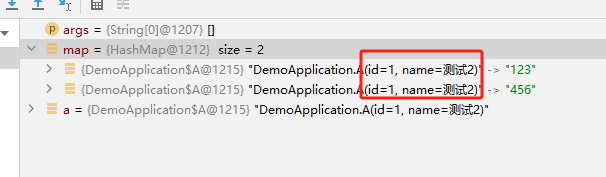
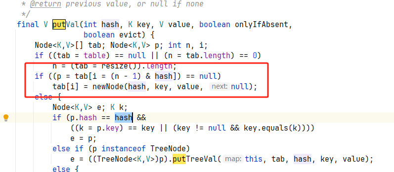
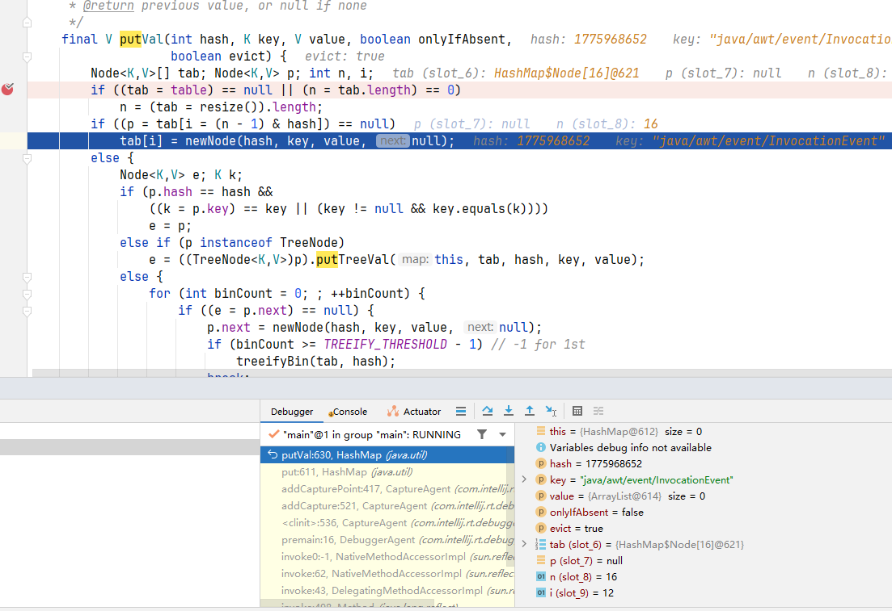
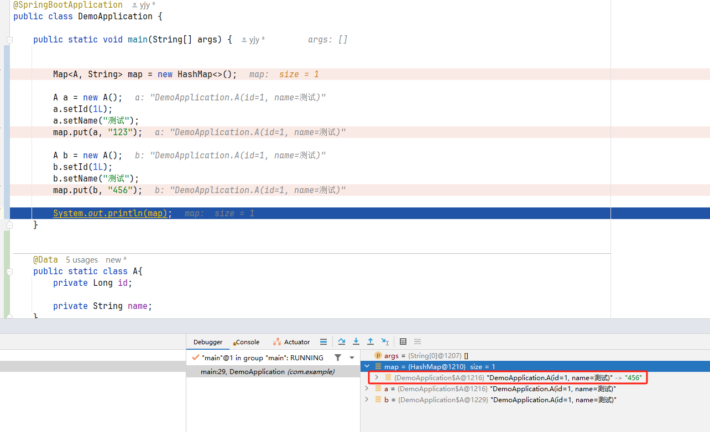

# 20241127

## 一、Map一些方法整理

### 1.1 在实际开发中的一些函数方法使用

如下方法能够实现 ①在map中没有guagua的时候初始化一个列表数组 ②在map中有guagua的时候，加入指定的内容到对应的列表数组中

```java
public static void main(String[] args) {
        Map<String, List<String>> map = new HashMap<>();
    map.computeIfAbsent("guagua", k-> new ArrayList<>()).add("123");
    map.computeIfAbsent("guagua", k-> new ArrayList<>()).add("456");
    map.computeIfAbsent("guagua", k-> new ArrayList<>()).add("789");
    map.computeIfAbsent("guagua", k-> new ArrayList<>()).add("1");
    System.out.println(map);
}
```

### 1.2 put方法

略

### 1.3 putIfAbsent方法

和put方法，本质上都是调用如下方法。区别是调用的onlyIfAbsent参数不同

- put方法onlyIfAbsent = false，即覆盖已经存在的值
- putIfAbsent方法onlyIfAbsent = true，即不覆盖已经存在的值

```java
/**
 * Implements Map.put and related methods
 *
 * @param hash hash for key
 * @param key the key
 * @param value the value to put
 * @param onlyIfAbsent if true, don't change existing value
 * @param evict if false, the table is in creation mode.
 * @return previous value, or null if none
 */
final V putVal(int hash, K key, V value, boolean onlyIfAbsent,
               boolean evict) {
    //  ……
}
```

他们会在这里进行对旧值是否覆盖的判断

```java
if (e != null) { // existing mapping for key
    V oldValue = e.value;
    if (!onlyIfAbsent || oldValue == null)
        e.value = value;
    afterNodeAccess(e);
    return oldValue;
}
```


### 1.4 computeIfPresent方法

源代码如下所示

```java
/**
 * If the value for the specified key is present and non-null, attempts to
 * compute a new mapping given the key and its current mapped value.
 * 如果指定键的值存在且非空，则尝试在给定键及其当前映射值的情况下计算新的映射
 *
 * <p>If the function returns {@code null}, the mapping is removed.  If the
 * function itself throws an (unchecked) exception, the exception is
 * rethrown, and the current mapping is left unchanged.
 * 如果函数返回{@code null}，映射将被删除。如果函数本身抛出（未检查的）异常，则该异常被重新抛出，当前映射保持不变。
 
 * @implSpec
 * The default implementation is equivalent to performing the following
 * steps for this {@code map}, then returning the current value or
 * {@code null} if now absent:
 * 
 * 实施要求:
 * 默认实现相当于对这个map执行以下步骤，然后返回当前值，如果现在不存在则返回null：
 *
 * <pre> {@code
 * if (map.get(key) != null) {
 *     V oldValue = map.get(key);
 *     V newValue = remappingFunction.apply(key, oldValue);
 *     if (newValue != null)
 *         map.put(key, newValue);
 *     else
 *         map.remove(key);
 * }
 * }</pre>
 *
 * <p>The default implementation makes no guarantees about synchronization
 * or atomicity properties of this method. Any implementation providing
 * atomicity guarantees must override this method and document its
 * concurrency properties. In particular, all implementations of
 * subinterface {@link java.util.concurrent.ConcurrentMap} must document
 * whether the function is applied once atomically only if the value is not
 * present.
 *
 * @param key key with which the specified value is to be associated
 * @param remappingFunction the function to compute a value
 * @return the new value associated with the specified key, or null if none
 * @throws NullPointerException if the specified key is null and
 *         this map does not support null keys, or the
 *         remappingFunction is null
 * @throws UnsupportedOperationException if the {@code put} operation
 *         is not supported by this map
 *         (<a href="{@docRoot}/java/util/Collection.html#optional-restrictions">optional</a>)
 * @throws ClassCastException if the class of the specified key or value
 *         prevents it from being stored in this map
 *         (<a href="{@docRoot}/java/util/Collection.html#optional-restrictions">optional</a>)
 *
 * @since 1.8 （java1.8后开始有的）
 */
default V computeIfPresent(K key,
        BiFunction<? super K, ? super V, ? extends V> remappingFunction) {
    Objects.requireNonNull(remappingFunction);
    V oldValue;
    if ((oldValue = get(key)) != null) {
        V newValue = remappingFunction.apply(key, oldValue);
        if (newValue != null) {
            put(key, newValue);
            return newValue;
        } else {
            remove(key);
            return null;
        }
    } else {
        return null;
    }
}
```

上述的泛型K和V是Map的泛型

```java
public interface Map<K,V>
```

函数式方程如下所示

```java
@FunctionalInterface
public interface BiFunction<T, U, R> {

    /**
     * Applies this function to the given arguments.
     *
     * @param t the first function argument
     * @param u the second function argument
     * @return the function result
     */
    R apply(T t, U u);

    /**
     * Returns a composed function that first applies this function to
     * its input, and then applies the {@code after} function to the result.
     * If evaluation of either function throws an exception, it is relayed to
     * the caller of the composed function.
     *
     * @param <V> the type of output of the {@code after} function, and of the
     *           composed function
     * @param after the function to apply after this function is applied
     * @return a composed function that first applies this function and then
     * applies the {@code after} function
     * @throws NullPointerException if after is null
     */
    default <V> BiFunction<T, U, V> andThen(Function<? super R, ? extends V> after) {
        Objects.requireNonNull(after);
        return (T t, U u) -> after.apply(apply(t, u));
    }
}
```

实际应用

```java
@SpringBootApplication
public class DemoApplication {

    public static void main(String[] args) {


        Map<String, A> map = new HashMap<>();

        A a = new A();
        a.setId(123L);
        a.setName("g");
        map.computeIfPresent("123", (k,v) -> {
            a.setId(v.getId());
            return a;
        }) ;

        System.out.println(map);
    }


    @Data
    public static class A{
        private Long id;
        private String name;
    }
}
```


### 1.5 computeIfAbsent方法

源码如下

```java
/**
 * If the specified key is not already associated with a value (or is mapped
 * to {@code null}), attempts to compute its value using the given mapping
 * function and enters it into this map unless {@code null}.
 *
 * <p>If the function returns {@code null} no mapping is recorded. If
 * the function itself throws an (unchecked) exception, the
 * exception is rethrown, and no mapping is recorded.  The most
 * common usage is to construct a new object serving as an initial
 * mapped value or memoized result, as in:
 *
 * <pre> {@code
 * map.computeIfAbsent(key, k -> new Value(f(k)));
 * }</pre>
 *
 * <p>Or to implement a multi-value map, {@code Map<K,Collection<V>>},
 * supporting multiple values per key:
 *
 * <pre> {@code
 * map.computeIfAbsent(key, k -> new HashSet<V>()).add(v);
 * }</pre>
 *
 *
 * @implSpec
 * The default implementation is equivalent to the following steps for this
 * {@code map}, then returning the current value or {@code null} if now
 * absent:
 *
 * <pre> {@code
 * if (map.get(key) == null) {
 *     V newValue = mappingFunction.apply(key);
 *     if (newValue != null)
 *         map.put(key, newValue);
 * }
 * }</pre>
 *
 * <p>The default implementation makes no guarantees about synchronization
 * or atomicity properties of this method. Any implementation providing
 * atomicity guarantees must override this method and document its
 * concurrency properties. In particular, all implementations of
 * subinterface {@link java.util.concurrent.ConcurrentMap} must document
 * whether the function is applied once atomically only if the value is not
 * present.
 *
 * @param key key with which the specified value is to be associated
 * @param mappingFunction the function to compute a value
 * @return the current (existing or computed) value associated with
 *         the specified key, or null if the computed value is null
 * @throws NullPointerException if the specified key is null and
 *         this map does not support null keys, or the mappingFunction
 *         is null
 * @throws UnsupportedOperationException if the {@code put} operation
 *         is not supported by this map
 *         (<a href="{@docRoot}/java/util/Collection.html#optional-restrictions">optional</a>)
 * @throws ClassCastException if the class of the specified key or value
 *         prevents it from being stored in this map
 *         (<a href="{@docRoot}/java/util/Collection.html#optional-restrictions">optional</a>)
 * @since 1.8
 */
default V computeIfAbsent(K key,
        Function<? super K, ? extends V> mappingFunction) {
    Objects.requireNonNull(mappingFunction);
    V v;
    if ((v = get(key)) == null) {
        V newValue;
        if ((newValue = mappingFunction.apply(key)) != null) {
            put(key, newValue);
            return newValue;
        }
    }

    return v;
}
```

函数方程mappingFunction

```java
@FunctionalInterface
public interface Function<T, R> {

    /**
     * Applies this function to the given argument.
     *
     * @param t the function argument
     * @return the function result
     */
    R apply(T t);
}
```

应用

```java
@SpringBootApplication
public class DemoApplication {

    public static void main(String[] args) {


        Map<String, A> map = new HashMap<>();
        
        map.computeIfAbsent("123", k -> {
            A a = new A();
            a.setId(123L);
            a.setName("g");
            return a;
        }) ;

        System.out.println(map);
    }

    @Data
    public static class A{
        private Long id;
        private String name;
    }
}
```


## 二、Map中的key可以用对象，但是注意，不要生成一个对象后，再次对该对象进行修改，并放入map，因为其都是指向这一个对象，会同时改变，但是put多个却也有多个，很奇怪

```java
public class Test {
    public static void main(String[] args) {
        Map<A, String> map = new HashMap<>();

        A a = new A();
        a.setId(1L);
        a.setName("测试");

        map.put(a, "123");
        a.setName("测试2");
        map.put(a, "456");

        System.out.println(map);
    }


    @Data
    public static class A{
        private Long id;

        private String name;
    }


}

```

看下结果可以发现之前的key也变了第二个key，因为其中维护的key是一个引用对象，此时对a的修改都是对这个引用对象来说的。并且会重复插入数据（因为先比较的是hash值的位置是否有内容，此时的hash值已经和之前的不一样了）







正确的做法应该是新开一个引用对象，进行插入


