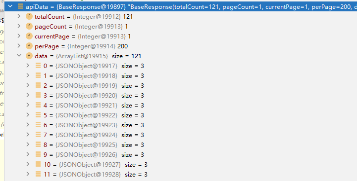

# 20241129

## 一、关于com.alibaba.fastjson的整理

### 1.1 依赖引入

依赖引入示例：

```yml
<dependency>
    <groupId>com.alibaba</groupId>
    <artifactId>fastjson</artifactId>
    <version>1.2.41</version>
</dependency>
```

> 相关版本可以参考maven中央仓库：https://mvnrepository.com/artifact/com.alibaba/fastjson
>
> git仓库：https://github.com/alibaba/fastjson
>
> 注意：fastjson已经有fastjson2版本，优选选择使用fastjson2

### 1.2 具体使用

#### 0、实体对象

```java
@Data
class A {
    // === 包装类 ===
    private String aString;
    private Integer aInteger;
    private Double aDouble;
    private Long aLong;

    // === 基本数据类型（原始类型） ===
    private int aInt2;
    private double aDouble2;
    private long aLong2;

    // === 构造函数 ===
    public A () {
        aString = "aString";
        aInteger = 1;
        aDouble = 1.0;
        aLong = Long.MAX_VALUE;

        aInt2 = 1;
        aDouble2 = 1.0;
        aLong2 = Long.MAX_VALUE;
    }
}
```


#### 1、将一个class对象转化为JSON字符串

```java
// 如何将一个class对象转化为JSON字符串
@Test
public void classToJSONObject() {
    // 创建一个class对象
    A a = new A();

    // 方式一：调用抽象类JSON的静态方法toJSON将对象a转换为JSONObject对象
    // 虽然JSON的toJSON方法返回的类型是Object，但其实现是JSONObject或JSONArray（根据是数组还是对象来确定）
    Object object = JSON.toJSON(a);
    JSONObject jsonObject = (JSONObject) object;

    // 方式二：先将class对象转化为JSON字符串，再调用JSON.parseObject
    String jsonString = JSON.toJSONString(a);
    JSONObject jsonObject2 = JSON.parseObject(jsonString);
	
}
```

> JSONObject的parseObject方法其使用的就是JSON的parseObject方法，JSON是JSONObject的父类。

运行结果：

```
jsonObject:{"aDouble2":1.0,"aString":"aString","aLong":9223372036854775807,"aDouble":1.0,"aLong2":9223372036854775807,"aInt2":1,"aInteger":1}
jsonObject2:{"aDouble2":1.0,"aString":"aString","aLong":9223372036854775807,"aDouble":1.0,"aLong2":9223372036854775807,"aInt2":1,"aInteger":1}
```


#### 2、关于class对象的toString 和 jsonObject的toJsonStr

- class对象的toString是Object的方法

- toJSONString是JSON的一个方法，用于将JSON的子类：JSONObject和JSONArray转换为对应的json字符串

具体使用示例如下所示：

```java
@Test
 public void toJsonStrTest() {
    A a = new A();
    Object object = JSON.toJSON(a);
    JSONObject jsonObject = (JSONObject) object;

    // toJSONString是JSON的一个方法，用于将JSON的子类：JSONObject和JSONArray转换为对应的json字符串
    String jsonString = jsonObject.toJSONString();

}
```


#### 3、将JSON对象转换为class对象

① JSONObject -> class对象：

```java
@Test
public void JSONToclass() {
    // 创建一个class对象
    A target = new A();
    Object object = JSON.toJSON(target);
    JSONObject jsonObject = (JSONObject) object;

    // 方式一：直接调用JSON的toJavaObject方法，传入一个JSONObject对象和其class对象
    A a = JSON.toJavaObject(jsonObject, A.class);
    System.out.println(a);

    // 方式二：直接调用JSON的parseObject方法，传入json字符串对象和其class对象
    A a2 = JSON.parseObject(jsonObject.toJSONString(), A.class);
    System.out.println(a2);
}
```

② JSON字符串 -> class对象：

```java
// 方式二：直接调用JSON的parseObject方法，传入json字符串对象和其class对象
A a2 = JSON.parseObject(jsonObject.toJSONString(), A.class);
System.out.println(a2);
```

③ JSONArray -> class对象：

```java
@Test
public void JSONToArray() {
    // 创建一个class对象
    List<A> lista = new ArrayList<>();
    lista.add(new A());lista.add(new A());
    lista.add(new A());lista.add(new A());
    lista.add(new A());lista.add(new A());
    Object object = JSON.toJSON(lista);
    JSONArray jsonArray = (JSONArray) object;

    // 方式一：通过调用JSON的parseArray方法，将json字符串转化为对应的Array对象
    List<A> array = JSON.parseArray(jsonArray.toJSONString(), A.class);
    System.out.println(array);
}
```

运行结果：

```
[DemoApplicationTests.A(aString=aString, aInteger=1, aDouble=1.0, aLong=9223372036854775807, aInt2=1, aDouble2=1.0, aLong2=9223372036854775807), DemoApplicationTests.A(aString=aString, aInteger=1, aDouble=1.0, aLong=9223372036854775807, aInt2=1, aDouble2=1.0, aLong2=9223372036854775807), DemoApplicationTests.A(aString=aString, aInteger=1, aDouble=1.0, aLong=9223372036854775807, aInt2=1, aDouble2=1.0, aLong2=9223372036854775807), DemoApplicationTests.A(aString=aString, aInteger=1, aDouble=1.0, aLong=9223372036854775807, aInt2=1, aDouble2=1.0, aLong2=9223372036854775807), DemoApplicationTests.A(aString=aString, aInteger=1, aDouble=1.0, aLong=9223372036854775807, aInt2=1, aDouble2=1.0, aLong2=9223372036854775807), DemoApplicationTests.A(aString=aString, aInteger=1, aDouble=1.0, aLong=9223372036854775807, aInt2=1, aDouble2=1.0, aLong2=9223372036854775807)]

```


#### 4、JSON字符串转换为泛型对象

问题示例：

```java
String json = json字符串
BaseResponse<HisUserWardVo> apiData = JSON.parseObject(json, BaseResponse.class);

// 报错
List<HisUserWardVo> data = apiData.getData().stream().map(r -> {
                    System.out.println(JSON.toJSONString(r));
                    return JSON.parseObject(JSON.toJSONString(r), HisUserWardVo.class);
                }).collect(Collectors.toList());
```

本质上是这个转化的原因报错

```java
HisUserWardVo hisUserWardVo = data1.get(0);             
```

可以看到其中就是JSONOBJECT对象



解决：

```json
BaseResponse<HisUserWardVo> apiData = JSON.parseObject(json, new TypeReference<BaseResponse<HisUserWardVo>>(){});            
```

在使用 `JSON.parseObject` 将 JSON 字符串解析为 `BaseResponse<HisUserWardVo>` 对象时，如果 `BaseResponse` 中有一个 `List<T>`，而不是直接转换成 `HisUserWardVo` 类型的对象，通常是因为泛型擦除的问题。为了确保 `List` 中的元素被正确转换为 `HisUserWardVo` 类型，而不是默认的 `JSONObject` 类型，你可以使用 `TypeReference` 来指定类型。

- `TypeReference<BaseResponse<HisUserWardVo>>` 使得 `JSON.parseObject` 能够知道如何解析 `BaseResponse` 中的 `List<HisUserWardVo>` 类型，而不是默认的 `List<JSONObject>`。
- `TypeReference` 是 Fastjson 提供的一个帮助类，可以处理泛型类型。

这样就能确保 JSON 中的 `data` 数组会被正确解析成 `HisUserWardVo` 类型的对象，而不是 `JSONObject


#### 5、其他

1、对于如下json字符串的分析

```
{"haha":[{"aDouble2":1.0,"aString":"aString","aLong":9223372036854775807,"aDouble":1.0,"aLong2":9223372036854775807,"aInt2":1,"aInteger":1},{"aDouble2":1.0,"aString":"aString","aLong":9223372036854775807,"aDouble":1.0,"aLong2":9223372036854775807,"aInt2":1,"aInteger":1},{"aDouble2":1.0,"aString":"aString","aLong":9223372036854775807,"aDouble":1.0,"aLong2":9223372036854775807,"aInt2":1,"aInteger":1},{"aDouble2":1.0,"aString":"aString","aLong":9223372036854775807,"aDouble":1.0,"aLong2":9223372036854775807,"aInt2":1,"aInteger":1},{"aDouble2":1.0,"aString":"aString","aLong":9223372036854775807,"aDouble":1.0,"aLong2":9223372036854775807,"aInt2":1,"aInteger":1},{"aDouble2":1.0,"aString":"aString","aLong":9223372036854775807,"aDouble":1.0,"aLong2":9223372036854775807,"aInt2":1,"aInteger":1}]}
```

首先是key-value结构，因此是一个JSONObject，然后其value是一个JSONArray。创建上述字符串的方式如下所示

```java
List<A> lista = new ArrayList<>();
lista.add(new A());lista.add(new A());
lista.add(new A());lista.add(new A());
lista.add(new A());lista.add(new A());
Object object = JSON.toJSON(lista);
JSONArray jsonArray = (JSONArray) object;

System.out.println(jsonArray.toJSONString());

JSONObject jsonObject = new JSONObject();
jsonObject.put("haha", jsonArray);
System.out.println(jsonObject);
```


