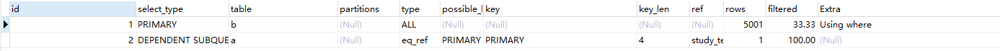
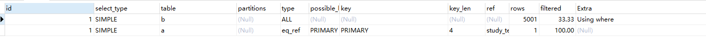

# 2024-12-11

## 一、SQL优化

### 1.1 SQL DEMO

a表DDL：

```mysql
CREATE TABLE `a` (
  `id` int(11) NOT NULL AUTO_INCREMENT,
  `a_name` varchar(30) DEFAULT NULL,
  `a_age` int(11) DEFAULT NULL,
  PRIMARY KEY (`id`)
) ENGINE=InnoDB AUTO_INCREMENT=10002 DEFAULT CHARSET=utf8;
```

b表DDL：

```mysql
CREATE TABLE `b` (
  `id` int(11) NOT NULL AUTO_INCREMENT,
  `b_name` varchar(30) DEFAULT NULL,
  `b_age` int(11) DEFAULT NULL,
  PRIMARY KEY (`id`)
) ENGINE=InnoDB AUTO_INCREMENT=5002 DEFAULT CHARSET=utf8;
```

查询语句（优化前）：

```mysql
select 
b.id,
b.b_name,
b.b_age,
(select a_name from a where a.id = b.id) as a_name
from b 
where b.b_age > 30

```

### 1.2 SQL优化

查询语句（优化后）：

```mysql
select
b.id,
b.b_name,
b.b_age,
a.a_name
from b left join a 
on b.id = a.id
where b.b_age > 30
```

> 注：实际执行sql时，两者效率是一样的，因为mysql会对优化前的SQL进行优化，我们可以看下他们的执行计划。
>
> 优化前：
>
> ```mysql
> explain select 
> b.id,
> b.b_name,
> b.b_age,
> (select a_name from a where a.id = b.id) as a_name
> from b 
> where b.b_age > 30
> ```
>
> 
>
> 优化后:
>
> ```mysql
> explain select
> b.id,
> b.b_name,
> b.b_age,
> a.a_name
> from b left join a 
> on b.id = a.id
> where b.b_age > 30
> ```
>
> 

优化点说明：

1、如果该子查询返回单行结果，可以考虑将其改为 `JOIN`，避免每次查询都执行子查询

sql的执行过程如下所示：

- from
- on
- join
- where
- goup by
- having + 聚合函数
- select
- order by
- limit

`(select a_name from a where a.id = b.id) as a_name` 是一个**子查询**，它会在每一行的其他列被选择并返回之前执行。子查询会在查询的主查询执行过程中，每遍历一行时逐行计算，针对每一行 `b.id` 的值进行查找，并返回相应的 `a_name` 列的值，然后将其作为 `a_name` 列的值进行返回。因此，子查询的执行是**依赖于主查询的每一行数据**的。

1. **主查询**会先执行
2. **在遍历主查询的每一行数据时**，对于每一行，都会对 `(select a_name from a where a.id = b.id)` 进行执行。
3. 每次执行子查询时，它会根据 `b.id` 的当前值从`a 表`中检索 `a_name` 的值。

使用了子查询 `(select a_name from a where a.id = b.id)`，如果该子查询返回单行结果，可以考虑将其改为 `JOIN`，避免每次查询都执行子查询。


2、使用`WHERE` 子句中使用隐式连接和left join连接的区别

在 SQL 中，`WHERE` 子句使用隐式连接（**也称为逗号连接**）和 `LEFT JOIN` 连接的区别主要体现在连接类型以及如何处理表中的数据行。让我们详细分析一下这两者的区别：

1. 隐式连接（逗号连接）

隐式连接是通过在 `FROM` 子句中列出多个表，并在 `WHERE` 子句中指定连接条件来实现的。它的格式如下：

```
sqlCopy CodeSELECT columns
FROM table1, table2
WHERE table1.column = table2.column;
```

这种方式本质上是 **内连接（INNER JOIN）** 的一种表现方式。即，只有当 `table1` 和 `table2` 中有匹配的数据时，这些数据行才会出现在结果集中。

特点：

- 隐式连接是通过 `WHERE` 子句中设置的条件来进行连接的。
- 它默认执行 **内连接**（INNER JOIN），只返回符合连接条件的匹配行。
- 如果有一个表中没有匹配的记录，整行数据就会被排除在外。

示例（隐式连接）：

```
sqlCopy CodeSELECT br.name, yz.disease
FROM zy_bingrenxx br, yz_bingrenyz yz
WHERE br.patient_id = yz.patient_id;
```

这里，只有当 `zy_bingrenxx` 和 `yz_bingrenyz` 中的 `patient_id` 匹配时，才会返回结果。

2. `LEFT JOIN` 连接

`LEFT JOIN`（左连接）是显式连接的一种方式，它返回左表（在 `FROM` 子句中第一个表）中的所有行，以及右表中符合连接条件的匹配行。如果右表中没有匹配的行，结果集会用 `NULL` 填充右表中的列。

特点：

- `LEFT JOIN` 返回的是左表中的所有行，即使右表没有匹配的行。
- 如果右表没有匹配的行，右表中的列会被填充为 `NULL`。
- 这种连接会包含所有左表的数据，而不仅仅是符合条件的匹配数据。

示例（`LEFT JOIN`）：

```
sqlCopy CodeSELECT br.name, yz.disease
FROM zy_bingrenxx br
LEFT JOIN yz_bingrenyz yz ON br.patient_id = yz.patient_id;
```

在这个例子中，**即使** `yz_bingrenyz` 表中没有与 `zy_bingrenxx` 表中的某个患者（`patient_id`）匹配的记录，左表 `zy_bingrenxx` 中的该患者依然会出现在结果中，而 `yz.disease` 会返回 `NULL`。

总结两者的区别：

| 特性               | 隐式连接（逗号连接）                                         | `LEFT JOIN` 连接                                  |
| ------------------ | ------------------------------------------------------------ | ------------------------------------------------- |
| 连接类型           | 内连接（INNER JOIN）                                         | 左连接（LEFT JOIN）                               |
| 返回的记录         | 只有匹配的行（在 `WHERE` 中定义连接条件的表中都存在匹配数据时） | 左表中的所有行，右表中没有匹配的行时会返回 `NULL` |
| 处理没有匹配的数据 | 没有匹配的行不会出现在结果中                                 | 没有匹配的右表行会以 `NULL` 填充                  |
| 可读性             | 可读性较差，尤其在连接多个表时                               | 结构更清晰，尤其适用于需要保留左表数据的场景      |

关键点：

- **隐式连接**默认执行内连接，只返回匹配的行。
- **`LEFT JOIN` 连接**则确保左表中的所有数据行都会出现在结果中，即使右表没有匹配的行。