# 2024-12-16

## 一、并发修改导致MVCC脏写问题

### 1.1 业务场景

**数据库表结构设计：**一个主档数据，通过一个字段，逗号分隔的方式去关联其他明细信息的id。

如主档数据A，有3条明细数据与A关联，其id分别是1,2,3，那么其存储在关联字段的值为1,2,3。

**操作场景：** 

接口设计操作：①根据id查询主档数据 ②获取主档数据关联的明细id ③更新主档明细id

入参：主档id、明细id（这里不传列表，是因为相应参数需要返回相应的信息，因此就涉及成这样了）

在实际应用中，可能需要涉及到批量新增的操作，因此前端会出现某一时间点，同时调用多次该接口，导致MVCC脏写问题。

### 1.2 DEMO 初始化

MySQL中创建demo表

```mysql
# 建表
CREATE TABLE `test` (
`id` INT(11) NOT NULL COMMENT '主档id',
`ids` VARCHAR(255) DEFAULT NULL COMMENT '关联ids',
PRIMARY KEY (`id`)
) ENGINE=INNODB DEFAULT CHARSET=utf8;
```

建立相应的web三层架构：controller、service、mapper

controller

```java
@RestController
@RequestMapping("/demo")
public class democontroller {

    @Resource
    private demoService demoservice;

    @GetMapping("/test")
    public void test(Long id, String relId) {
        demoservice.test(id, relId);
    }

}
```

service

```java
public interface demoService {
    void test(Long id, String relId);
}
```

service-实现类

```java
@Slf4j
@Service
public class demoServiceImpl extends ServiceImpl<DemoMapper, Demo> implements demoService {

    @Override
    @Transactional(rollbackFor = Exception.class)
    public void test(Long id, String relId) {
        // 获取主档对象
        Demo demo = getById(id);
        // 打印当前线程获取到的ids列表
        log.info("Thread Name:{}, before demo:{}",Thread.currentThread().getName(), demo);
        // 获取当前关联明细id
        List<String> idsList =  Arrays.stream(demo.getIds().split(","))
                .collect(Collectors.toList());
        // 添加新的元素（去重操作省略）
        idsList.add(relId);
        // 更新关联字段
        demo.setIds(idsList.stream().collect(Collectors.joining(",")));
        // 打印当前线程获取到的ids列表
        log.info("Thread Name:{}, after demo:{}",Thread.currentThread().getName(), demo);
        updateById(demo);
    }
}
```

mapper

```java
@Mapper
public interface DemoMapper extends BaseMapper<Demo> {
}
```

实体类

```java
@Data
@EqualsAndHashCode(callSuper = true)
@TableName("test")
public class Demo extends Model<Demo> {

    @TableId(value = "id", type= IdType.ASSIGN_ID)
    private Integer id;

    private String ids;
    
}
```

### 1.3 问题复现

数据初始化

```
INSERT INTO `study_test`.`test`(`id`, `ids`) VALUES (1, '1');
```


通过apifox开三个线程并发调用“/demo”接口，入参如下所示：id固定为1，relId为一个整数值（1-999随机数）

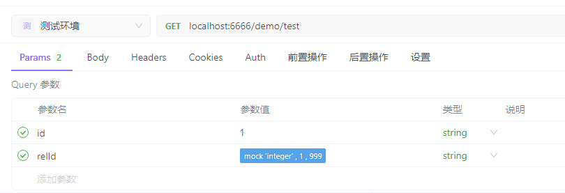

调用结果如下所示

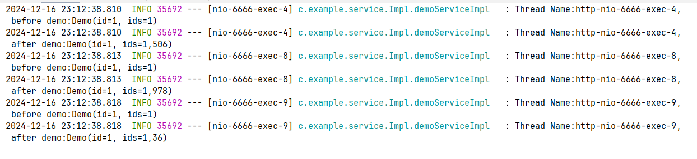


问题到此复现。


## 二、 原因分析

原因已经在标题中打出来了，即MVCC的脏写问题，当我们使用`@Transactional(rollbackFor = Exception.class)`注解后，Spring 会为当前事务设置 MySQL 会话的事务隔离级别为MySQL默认隔离级别即RR（可重复读）。

我们在打个断点后，通过apifox发起并发访问

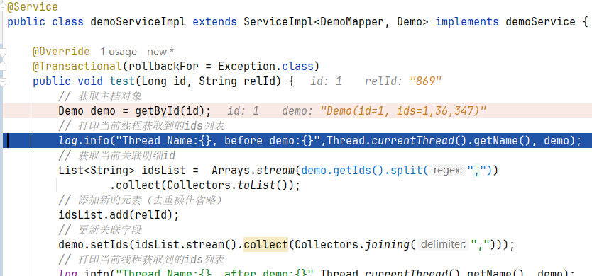

在MySQL中通过`select trx_state, trx_started, trx_mysql_thread_id, trx_query, trx_isolation_level from information_schema.innodb_trx;`命令查看当前执行中且未提交的事务，可以看到此时有三条事务正在运行中，并且他们的隔离级别是可重复读（RR）

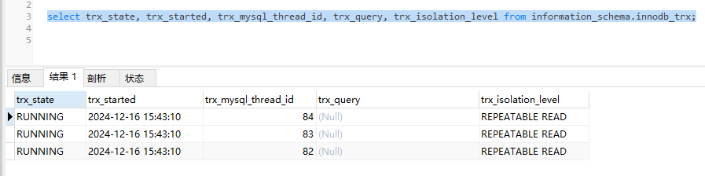

由于在RR隔离级别下，访问数据（即getById操作）访问的数据是通过MVCC实现的快照读，此时在并发访问的情况下，可能三个事务查询到的结果都是一样的，所以导致最后在更新的时候只出现了新增成功一个值。


## 三、解决

### 3.1 将隔离级别改成串行（无效）

一开始是这个想法，因为串行级别下都是会加锁的，因此通过改变`@Transactional`参数：`@Transactional(rollbackFor = Exception.class, isolation = Isolation.SERIALIZABLE)`将事物隔离级别改成串行也许可以解决问题。

当我们并发调用该接口后，发生报错，即在尝试加锁的时候，检测到了死锁

```
2024-12-16 23:59:48.615 ERROR 45800 --- [nio-6666-exec-3] o.a.c.c.C.[.[.[/].[dispatcherServlet]    : Servlet.service() for servlet [dispatcherServlet] in context with path [] threw exception [Request processing failed; nested exception is org.springframework.dao.DeadlockLoserDataAccessException: 
### Error updating database.  Cause: com.mysql.cj.jdbc.exceptions.MySQLTransactionRollbackException: Deadlock found when trying to get lock; try restarting transaction
### The error may exist in com/example/mapper/DemoMapper.java (best guess)
### The error may involve com.example.mapper.DemoMapper.updateById-Inline
### The error occurred while setting parameters
### SQL: UPDATE test  SET ids=?  WHERE id=?
### Cause: com.mysql.cj.jdbc.exceptions.MySQLTransactionRollbackException: Deadlock found when trying to get lock; try restarting transaction
; Deadlock found when trying to get lock; try restarting transaction; nested exception is com.mysql.cj.jdbc.exceptions.MySQLTransactionRollbackException: Deadlock found when trying to get lock; try restarting transaction] with root cause
```

打个断点，将其中两个事物停在查询查找后更新操作前，将其中一个操作停在更新操作后

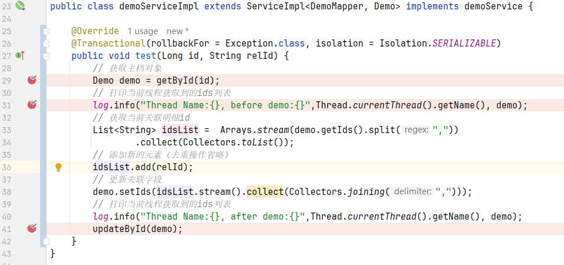

通过命令`select trx_state, trx_started, trx_mysql_thread_id, trx_query, trx_isolation_level from information_schema.innodb_trx;`查看当前未提交的任务

可以看到有三个未提交事务其中一个在进行更新操作的时候发生了锁等待	

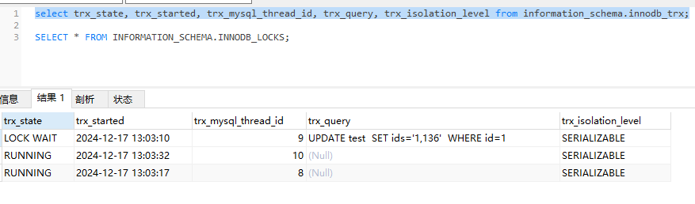

通过命令` SELECT * FROM INFORMATION_SCHEMA.INNODB_LOCKS;`查看一下当前加锁情况

结果就是两个事务给数据加了S锁，一个事务需要给更改记录加X锁，同时前两个事物在后面也需要给数据加X锁，造成了死锁。

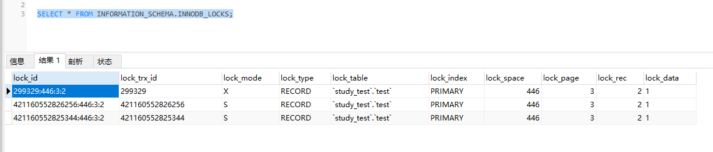

注：关于多线程并发访问打断点需要进行如下设置

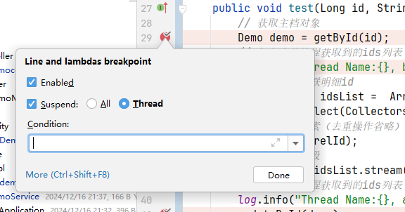


### 3.2 开批量新增接口（无效）

开批量新增接口，将需要关联的id通过一个接口传入，而不是同时调用三次接口分别传入来解决该问题，但是如果在并发场景下还是会出关联id丢失的问题。

### 3.3 乐观锁 (无效)

相关乐观锁实现可以参考mybatis-plus官网的文档：https://baomidou.com/plugins/optimistic-locker/。（乐观锁在我理解上就是做版本控制，每次更新操作都要对版本进行验证）

这里直接采用mybatis-plus提供的配置方式进行测试

配置文件

```java
@Configuration
public class MybatisPlusConfig {

    @Bean
    public MybatisPlusInterceptor mybatisPlusInterceptor() {
        MybatisPlusInterceptor interceptor = new MybatisPlusInterceptor();
        interceptor.addInnerInterceptor(new OptimisticLockerInnerInterceptor());
        return interceptor;
    }
}

```

实体类：

```java
@Data
@EqualsAndHashCode(callSuper = true)
@TableName("test")
public class Demo extends Model<Demo> {

    @TableId(value = "id", type= IdType.ASSIGN_ID)
    private Integer id;

    private String ids;

    @Version
    private Integer version;

}
```

在数据表test中新增一个字段version，并设置其值为版本为2，再次并发调用接口，查看当前版本都为2

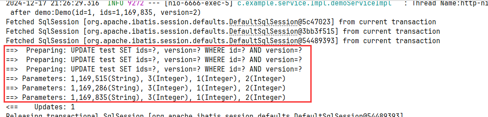

### 3.4 悲观锁（有效）

采用JUC、分布式锁等进行加锁，此时只有获取到锁的线程才可以对这一条数据进行操作，就不会出现并发问题。

修改代码，这里使用JUC下的ReentrantLock

```java
@Slf4j
@Service
public class demoServiceImpl extends ServiceImpl<DemoMapper, Demo> implements demoService {

    private Lock lock = new ReentrantLock();

    @Override
    @Transactional(rollbackFor = Exception.class)
    public void test(Long id, String relId) {
        lock.lock();
        // 获取主档对象
        Demo demo = getById(id);
        // 打印当前线程获取到的ids列表
        log.info("Thread Name:{}, before demo:{}",Thread.currentThread().getName(), demo);
        // 获取当前关联明细id
        List<String> idsList =  Arrays.stream(demo.getIds().split(","))
                .collect(Collectors.toList());
        // 添加新的元素（去重操作省略）
        idsList.add(relId);
        // 更新关联字段
        demo.setIds(idsList.stream().collect(Collectors.joining(",")));
        // 打印当前线程获取到的ids列表
        log.info("Thread Name:{}, after demo:{}",Thread.currentThread().getName(), demo);
        updateById(demo);
        lock.unlock();
    }
}
```

结果成功

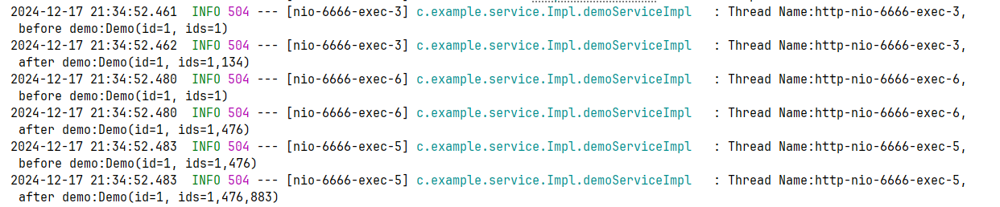

### 3.5 其他方法

如果有其他更好的方法，欢迎讨论！


## 一、并发导致添加失败（并发问题）

结构：一个数据，关联的idm通过一个字段逗号分隔存储，

方法：

```java
 @Override
@Transactional(rollbackFor = Exception.class, isolation = Isolation.SERIALIZABLE)
public GetMpiDataSingleVo addMpi(AddMpiDto input) {

    try {
        // 获取预测模板
        BudgetForecast budgetForecast = getById(input.getForecastId());

        if(budgetForecast == null) {
            log.info("未获取到id={}的预测模板", input.getForecastId());
            throw new BizException("未匹配到对应的预测模版!");
        }

        // 绑定关系
        // 获取关联的医疗执行指标
        String idmIds = budgetForecast.getIdmIds();
        List<String> idmList = new ArrayList<>();
        if(StrUtil.isNotBlank(idmIds)) {
            idmList = new ArrayList<>(Arrays.asList(idmIds.split(",")));
        }
        idmList.add(input.getCategoryId().toString());

        budgetForecast.setIdmIds(idmList.stream().distinct().collect(Collectors.joining(",")));
        updateById(budgetForecast);

        /*GetMpiDataSingleDto dto = new GetMpiDataSingleDto();
        dto.setCategoryId(input.getCategoryId());
        dto.setYear(input.getYear());
        GetMpiDataSingleVo mpiDataSingle = getMpiDataSingle(dto);
        return mpiDataSingle;*/
    } catch (Exception e) {
        // 如果发生死锁错误，捕获并进行重试
        log.error("Deadlock detected, retrying transaction...");
        throw new BizException("发生死锁！");
    }
    return null;
}
```


默认RR下，连续调用三次，可能出现值只新增一条

MVCC脏写问题

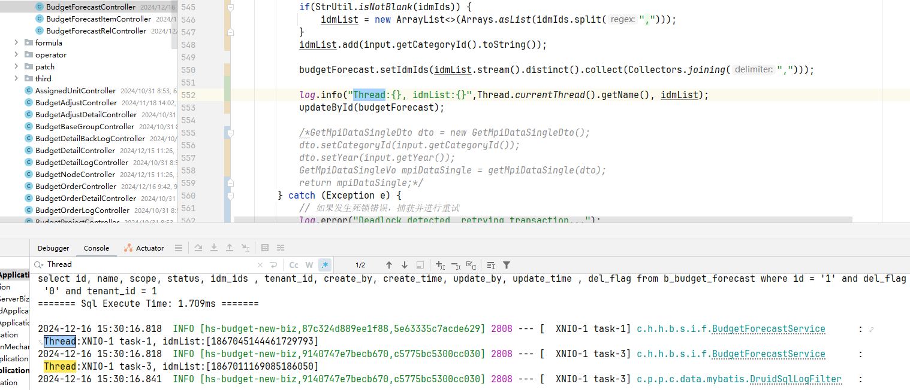


S隔离级别（@Transactional(rollbackFor = Exception.class, isolation = Isolation.SERIALIZABLE) ）下，连续调用三次，就会出现死锁问题，死锁报错：

（其中一次查询操作一次更新操作，查询加X锁，更新也加X锁，导致死锁）

```
org.springframework.dao.DeadlockLoserDataAccessException: 
### Error updating database.  Cause: com.mysql.cj.jdbc.exceptions.MySQLTransactionRollbackException: Deadlock found when trying to get lock; try restarting transaction
### The error may exist in com/hscloud/hs/budget/mapper/forecast/BudgetForecastMapper.java (best guess)
### The error may involve com.hscloud.hs.budget.mapper.forecast.BudgetForecastMapper.updateById-Inline
### The error occurred while setting parameters
### SQL: UPDATE b_budget_forecast SET name = ?, scope = ?, status = ?, idm_ids = ?, tenant_id = ?, update_by = ?, update_time = ? WHERE id = ? AND del_flag = '0' AND tenant_id = 1
### Cause: com.mysql.cj.jdbc.exceptions.MySQLTransactionRollbackException: Deadlock found when trying to get lock; try restarting transaction
; Deadlock found when trying to get lock; try restarting transaction; nested exception is com.mysql.cj.jdbc.exceptions.MySQLTransactionRollbackException: Deadlock found when trying to get lock; try restarting transaction
```

Deadlock found when trying to get lock; try restarting transaction：试图获得锁时发现死锁；尝试重新启动事务

当你在并发调用时，使用 `Isolation.SERIALIZABLE` 隔离级别时出现 **Deadlock**（死锁）错误，`"Deadlock found when trying to get lock; try restarting transaction"`，意味着多个事务在同一时间试图获取数据库资源的锁，而这些事务之间相互等待对方释放资源，导致死锁。MySQL 在发现死锁后会自动选择回滚其中一个事务，以解除死锁。

第一个事务执行完后，快速接上第二个了，出现死锁的问题

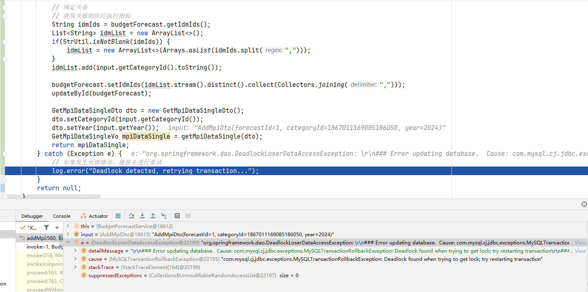


处理死锁方式：

- https://blog.csdn.net/whf1215847706/article/details/143195464

- https://blog.csdn.net/qq_25118431/article/details/119859674


解决方法示例：

是的，`@Transactional(rollbackFor = Exception.class, isolation = Isolation.SERIALIZABLE)` 这个注解的确是指定了事务的隔离级别为 `SERIALIZABLE`，但它的作用不仅仅是将当前方法的事务隔离级别设定为串行化（`SERIALIZABLE`），还有其他几个重要的含义。让我们逐步解析这个注解的具体含义。

### 1. **事务的隔离级别：**

`Isolation.SERIALIZABLE` 是 MySQL 等数据库提供的四个事务隔离级别之一。它是最严格的隔离级别，意味着：

- **串行化**：事务的执行是完全隔离的，一个事务必须等待另一个事务完成后才能开始。换句话说，多个事务并发执行时，数据库会像是一个个事务串行执行一样，避免了脏读、不可重复读和幻读等现象。

隔离级别的其他几种情况：

- **`READ_UNCOMMITTED`**：允许读取未提交的数据，可能会发生脏读。
- **`READ_COMMITTED`**：只允许读取已提交的数据，防止脏读，但不可重复读仍然可能发生。
- **`REPEATABLE_READ`**：允许读取已提交的数据，并且保证在同一事务内，多次读取同一数据的结果是相同的，防止不可重复读。MySQL 的默认隔离级别。
- **`SERIALIZABLE`**：最严格的隔离级别，事务完全串行化执行，防止脏读、不可重复读和幻读。

`SERIALIZABLE` 隔离级别是通过加锁来实现的，具体来说，它会使用范围锁（Range Locks）来防止幻读，确保同一时间只有一个事务可以操作某些数据，从而避免了多个事务并发操作时的干扰。

### 2. **`@Transactional` 注解：**

`@Transactional` 注解用于 Spring 中的事务管理，表示当前方法（或类中的所有方法）应当在事务环境中执行。Spring 会在调用该方法之前开启一个事务，在方法执行完后提交事务，若执行过程中发生异常，会根据 `rollbackFor` 参数来判断是否回滚事务。

- **`rollbackFor = Exception.class`**：表示如果方法执行过程中抛出了任何类型为 `Exception` 或其子类的异常，事务将被回滚。通常，Spring 默认的回滚规则是遇到 `RuntimeException` 或其子类时才回滚，而这里明确规定了遇到所有 `Exception` 时回滚。
- **`isolation = Isolation.SERIALIZABLE`**：这个属性指定了事务的隔离级别为 `SERIALIZABLE`。如上所述，这将确保事务是完全隔离的。

### 3. **如何影响 MySQL 会话的事务隔离级别：**

当你在 Spring 中使用 `@Transactional(isolation = Isolation.SERIALIZABLE)` 时，Spring 会为当前事务设置 MySQL 会话的事务隔离级别为 `SERIALIZABLE`。这意味着：

- **当前会话的事务隔离级别将被设置为 `SERIALIZABLE`**，并且 MySQL 数据库会以串行的方式执行当前事务。
- 在执行此事务的过程中，其他事务无法对涉及的记录进行并发修改或访问，直到当前事务提交或回滚。

### 4. **`Isolation.SERIALIZABLE` 与性能的关系：**

虽然 `SERIALIZABLE` 提供了最强的隔离性，但它也带来了性能上的开销。由于该隔离级别涉及加锁和事务顺序控制，它可能导致较大的延迟，并增加事务的竞争，特别是在高并发的环境中。因此，通常只有在需要极高数据一致性时，才会使用这个隔离级别。若只是简单的防止脏读和不可重复读，可能会选择 `REPEATABLE_READ`，而在更严格的业务场景下（例如银行转账系统），`SERIALIZABLE` 会更为合适。

### 总结：

- `@Transactional(isolation = Isolation.SERIALIZABLE)` 会将当前事务的隔离级别设置为串行化（`SERIALIZABLE`），从而确保事务执行时，数据不会被其他并发事务影响，提供最强的数据一致性保障。
- 它不仅影响方法内部的事务隔离，也影响与 MySQL 会话的交互，导致数据库层级的事务行为被串行化。
- 此外，`rollbackFor` 配置确保遇到 `Exception` 或其子类的异常时回滚事务。

这样做确实可以保证当前事务的严格隔离，但也可能影响性能，因此在使用时需要根据具体的业务需求权衡性能与一致性之间的关系。

复制删除重新生成

并发调用Isolation.SERIALIZABLE的方法，锁不等待，直接报错：Deadlock found when trying to get lock; try restarting transaction了如何解决

未知错误，请点击左上角切换其他模型使用或联系客服！

复制删除重新生成

并发调用Isolation.SERIALIZABLE的方法，锁不等待，直接报错：Deadlock found when trying to get lock; try restarting transaction了如何解决

当你在并发调用时，使用 `Isolation.SERIALIZABLE` 隔离级别时出现 **Deadlock**（死锁）错误，`"Deadlock found when trying to get lock; try restarting transaction"`，意味着多个事务在同一时间试图获取数据库资源的锁，而这些事务之间相互等待对方释放资源，导致死锁。MySQL 在发现死锁后会自动选择回滚其中一个事务，以解除死锁。

在使用 `Isolation.SERIALIZABLE` 隔离级别时，由于数据库对数据进行了严格的加锁，这种情况更容易发生，特别是当有多个并发事务争夺相同资源时。解决这个问题可以从以下几个方面着手：

### 1. **优化事务设计：减少事务范围**

在 `Isolation.SERIALIZABLE` 隔离级别下，事务的加锁范围会相对较大，这会增加死锁的风险。你可以通过以下方式减少死锁发生的几率：

- **减少事务持锁时间**：尽量缩短事务执行的时间，减少在事务内执行的操作。只在事务中执行最必要的操作，避免在事务内执行不必要的逻辑或等待。
- **优化查询和操作**：确保你的 SQL 查询能够快速执行，避免长时间持锁。

例如，若你在事务中进行大量的计算或不必要的操作，可以将这些操作提取到事务外部，减少锁的持有时间。

### 2. **修改事务的锁顺序**

死锁往往发生在两个或多个事务试图以不同顺序获取资源的情况下。例如，事务 A 获得了锁 1，事务 B 获得了锁 2，然后它们相互等待对方释放锁。为了避免这种情况，你可以考虑保证多个事务按相同的顺序访问资源。

- **统一访问顺序**：确保所有事务以一致的顺序访问数据库中的资源。例如，若多个事务都需要更新多个表，确保所有事务先更新表 A，再更新表 B，而不是某些事务先更新表 B，再更新表 A。

### 3. **捕获并重试死锁**

死锁发生时，MySQL 会自动选择一个事务进行回滚，然后返回死锁错误。你可以通过代码捕获这种错误并进行重试。Spring 中可以使用 `@Retryable` 注解或手动实现重试机制来处理这种情况。

#### 示例：使用 Spring 捕获死锁并重试

```
java复制代码@Transactional(isolation = Isolation.SERIALIZABLE, rollbackFor = Exception.class)
public void someBusinessMethod() {
    try {
        // 执行数据库操作
    } catch (DeadlockException e) {
        // 如果发生死锁错误，捕获并进行重试
        log.error("Deadlock detected, retrying transaction...");
        // 根据实际需求，可以选择重试机制
        retryTransaction();
    }
}
```

或者使用 `@Retryable` 注解：

```
java复制代码@Retryable(value = DeadlockException.class, maxAttempts = 5, backoff = @Backoff(delay = 1000))
@Transactional(isolation = Isolation.SERIALIZABLE, rollbackFor = Exception.class)
public void someBusinessMethod() {
    // 执行数据库操作
}
```

这种方法会在检测到死锁异常时，自动重试事务，最多重试 5 次，并在每次重试之间等待 1 秒。

### 4. **使用较低的隔离级别**

如果你可以接受稍微降低事务的隔离级别来换取更高的性能和更少的死锁，可以考虑将隔离级别从 `SERIALIZABLE` 降级为 `REPEATABLE_READ` 或 `READ_COMMITTED`。这两者相比 `SERIALIZABLE` 会引入更少的锁和死锁风险。

- **`REPEATABLE_READ`**：可以防止不可重复读，但它不会像 `SERIALIZABLE` 那样完全串行化事务。对于大多数应用程序来说，`REPEATABLE_READ` 通常是一个较好的选择，它可以减少锁竞争，降低死锁的发生概率。
- **`READ_COMMITTED`**：这种隔离级别会允许事务读取已提交的数据，可能会引入脏读，但它对死锁的防范较为有效，适合那些对一致性要求稍低的场景。

### 5. **检查数据库表的索引和查询优化**

死锁的一个常见原因是查询效率较低，导致锁被持有过久。检查你的数据库表的索引设计和查询性能：

- **优化查询**：确保所有的查询都尽量使用索引，避免全表扫描。特别是对于涉及多表联接的查询，确保使用合适的索引。
- **添加合适的索引**：通过分析 `EXPLAIN` 查询计划，查看查询是否有效利用了索引。如果发现某些查询未使用索引，可以通过添加合适的索引来提高性能。

### 6. **调整数据库的死锁检测策略**

MySQL 在发生死锁时会自动检测并回滚其中一个事务。你可以通过调整 MySQL 的死锁检测参数来优化死锁处理策略：

- **`innodb_deadlock_detect`**：这是 InnoDB 存储引擎的一个参数，默认是开启的，它会自动检测死锁并进行回滚。如果你希望 MySQL 更加积极地检测死锁，可以考虑调整其参数。
- **`innodb_lock_wait_timeout`**：此参数控制事务等待锁的超时设置，适当增加这个值可以减少因为超时而导致的死锁。

```
sql复制代码SET GLOBAL innodb_lock_wait_timeout = 50;
```

但是，调整这个参数要小心，因为过长的超时时间可能会导致性能下降，特别是在高并发场景中。

### 7. **考虑使用乐观锁**

如果业务允许，考虑使用**乐观锁**而非悲观锁。乐观锁通过在事务提交时检查数据是否被其他事务修改，来避免死锁。它适用于并发冲突较少的场景。

在数据库层面，乐观锁通常通过一个“版本号”字段来实现，每次更新时都会检查版本号是否一致。如果版本号不一致，说明数据已经被其他事务修改，当前事务需要重试。

例如：

```
java复制代码public class Product {
    private Long id;
    private String name;
    private Integer version;  // 用于乐观锁

    @Version  // 版本号注解
    private Integer version;

    // getters and setters
}
```

### 总结：

- **死锁的原因**：在 `Isolation.SERIALIZABLE` 隔离级别下，事务会获取更多的锁资源，导致不同事务之间可能产生死锁。

- 解决办法

  ：

  - 优化事务设计，减少事务持锁时间。
  - 确保统一的锁顺序。
  - 捕获死锁异常并实现重试机制。
  - 如果能接受稍微降低一致性要求，考虑使用较低的隔离级别（如 `REPEATABLE_READ` 或 `READ_COMMITTED`）。
  - 优化数据库查询和索引设计，避免全表扫描。
  - 调整数据库的死锁检测和锁等待超时设置。
  - 考虑使用乐观锁。

通过这些方法，你可以有效地减少死锁发生的概率，提高系统的并发性能。


重试机制

```
@Transactional(rollbackFor = Exception.class, isolation = Isolation.SERIALIZABLE)
public GetMpiDataSingleVo addMpi(AddMpiDto input) {
    int retryCount = 3;
    while (retryCount > 0) {
        try {
            // 获取预测模板
            BudgetForecast budgetForecast = getById(input.getForecastId());
            if (budgetForecast == null) {
                log.info("未获取到id={}的预测模板", input.getForecastId());
                throw new BizException("未匹配到对应的预测模版!");
            }

            // 更新操作
            String idmIds = budgetForecast.getIdmIds();
            List<String> idmList = new ArrayList<>();
            if (StrUtil.isNotBlank(idmIds)) {
                idmList = new ArrayList<>(Arrays.asList(idmIds.split(",")));
            }
            idmList.add(input.getCategoryId().toString());

            budgetForecast.setIdmIds(idmList.stream().distinct().collect(Collectors.joining(",")));
            updateById(budgetForecast);

            return null;  // 业务操作成功，返回数据

        } catch (DeadlockException e) {
            log.error("Deadlock detected, retrying transaction...");
            retryCount--;
            if (retryCount == 0) {
                throw new BizException("事务重试失败，发生死锁！");
            }
        } catch (Exception e) {
            throw new BizException("发生错误：" + e.getMessage());
        }
    }
    return null;
}

```


# 死锁原因：

在 **串行化隔离级别** (`Serializable`) 下，当你调用一次接口并对数据进行读取或写入操作时，数据库会为相关数据加锁，确保事务完全隔离并避免其他事务的干扰。为了更好地理解这个问题，我们需要详细了解 **串行化隔离级别** 的行为，并且明确调用的操作类型（例如：读、写、更新等）对锁的影响。

### 1. **串行化隔离级别 (Serializable) 简介**

在数据库的事务管理中，隔离级别决定了事务间的相互干扰程度。在串行化隔离级别下，数据库会执行最严格的事务隔离，确保所有事务的执行顺序是串行的（即一个事务完成后，另一个事务才能开始）。这意味着事务的操作结果不会被其他事务的操作影响，保证了 **可重复读** 和 **避免幻读**。

#### **串行化隔离级别的核心特性：**

- **完全隔离**：在一个事务完成之前，其他事务不能访问或修改它所操作的数据。
- **数据锁定**：为了保证数据不被其他事务并发访问，数据库会加锁数据。
- **避免脏读、不可重复读、幻读**：保证事务的读操作是隔离的，不会受其他事务的影响。

### 2. **在串行化隔离级别下对数据加的锁**

#### **锁的类型：**

在串行化隔离级别下，数据库会使用 **行级锁** 和 **表级锁** 来保证数据的完整性与一致性。

- **共享锁 (S-lock)**：如果一个事务对数据进行读取，数据库会为这些数据加上共享锁。共享锁允许其他事务读取相同的数据，但不允许它们修改数据。
- **排它锁 (X-lock)**：当一个事务对数据进行写入（更新、删除、插入等），数据库会为这些数据加上排它锁。排它锁会阻止其他事务对数据进行任何形式的读写操作，直到当前事务提交或回滚。
- **范围锁 (Range Lock)**：在串行化隔离级别下，如果一个事务读取或修改某一范围内的数据（例如：基于某些条件筛选的记录集），数据库可能会使用范围锁来锁定整个数据范围，防止其他事务插入、删除或更新该范围内的数据。

#### **具体步骤：**

假设在一个接口调用中，涉及到以下两种常见操作：**读取数据**（如 `SELECT`）和 **修改数据**（如 `UPDATE`）。根据串行化隔离级别的特性，数据库会按以下方式加锁：

- **读取数据（SELECT）**：

  - 当一个事务进行数据读取时，数据库会对相关的行加 **共享锁**。这保证了即使其他事务试图对该数据进行修改（如更新或删除），也只能在当前事务完成后才能进行。
  - 共享锁使得其他事务可以 **读取** 该数据，但无法 **修改** 数据。

  举个例子：假设有一个 `SELECT` 查询读取 `budgetForecast` 表中的某些数据，在串行化隔离级别下，数据库会为这些数据行加上共享锁，确保其他事务无法在此期间修改这些数据，防止脏读和不可重复读。

- **修改数据（UPDATE）**：

  - 当事务执行写入操作（如 `UPDATE`、`INSERT` 或 `DELETE`）时，数据库会对相关行加上 **排它锁**。
  - 排它锁确保在事务提交之前，没有其他事务可以读取或修改该数据。也就是说，其他事务无法在当前事务提交之前对被锁定的行进行任何形式的操作。

  举个例子：假设事务执行了一个 `UPDATE` 操作，修改了 `budgetForecast` 表中的数据，数据库会为这些数据行加上排它锁，确保只有当前事务能够修改这些数据，其他事务无法对其进行读取或写入操作，直到当前事务完成。

- **范围锁**：

  - 如果一个事务涉及到对某个数据范围的操作（例如，读取或更新某个条件下的多行数据），数据库会加上 **范围锁** 来锁定整个数据范围，防止其他事务插入或删除该范围内的记录。
  - 例如，如果事务执行了一个 `SELECT * FROM budgetForecast WHERE forecastYear = 2024` 操作，在串行化隔离级别下，数据库可能会为所有符合 `forecastYear = 2024` 条件的行加上范围锁，阻止其他事务在该范围内插入或删除数据。

### 3. **影响死锁的因素**

在串行化隔离级别下，由于数据库对数据行和数据范围进行严格的锁定，多个事务可能会发生锁竞争，导致 **死锁**。具体来说，如果两个事务尝试以不同顺序获取锁，可能会发生死锁：

- **锁竞争**：如果两个事务同时请求相同数据的排它锁，且它们的请求顺序不一致，就可能导致死锁。
- **数据范围锁**：如果多个事务试图操作重叠的数据范围，它们可能会相互阻塞，导致死锁。

例如：

- 事务 A 获取了 `budgetForecast` 表中某行数据的排它锁，然后试图访问其他表的数据。
- 事务 B 获取了其他表的排它锁，然后试图访问 `budgetForecast` 表中的数据。

如果这两个事务互相等待对方释放锁，就会发生死锁。

### 4. **总结：**

- **数据加锁机制**：在串行化隔离级别下，事务会为读取的数据行加共享锁，为写入的数据行加排它锁，可能还会加范围锁来锁定数据范围。
- **死锁风险**：由于数据的严格锁定和事务的相互依赖，串行化隔离级别容易导致死锁，特别是在多个事务并发访问相同数据时。
- **性能考虑**：串行化隔离级别提供了最高的数据一致性保障，但同时也可能影响系统的并发性能，因为它会严格控制对数据的访问。


# 思考：并发情况下是不是也会存在这种问题，如何解决MVCC脏写的问题


