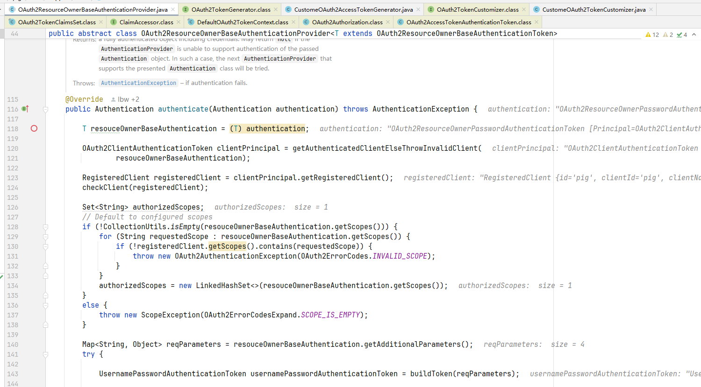
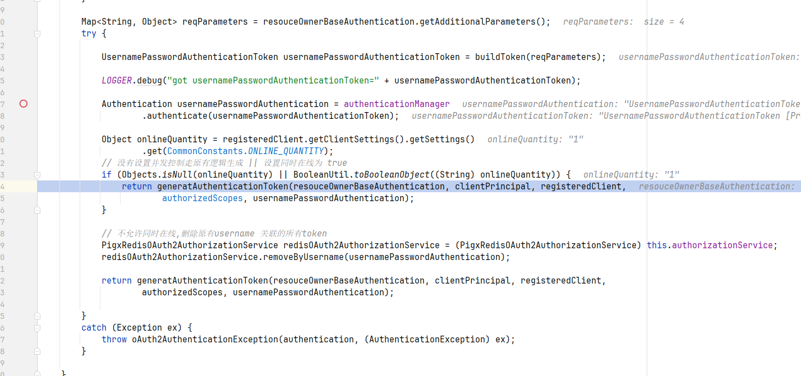
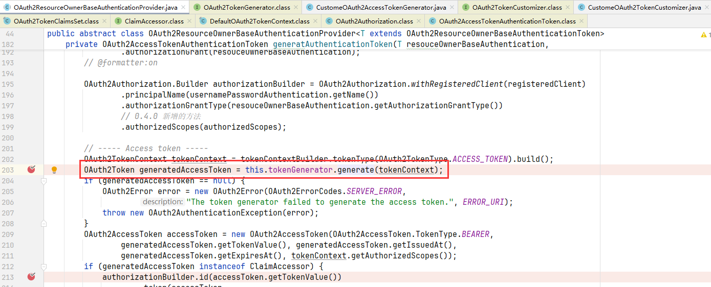
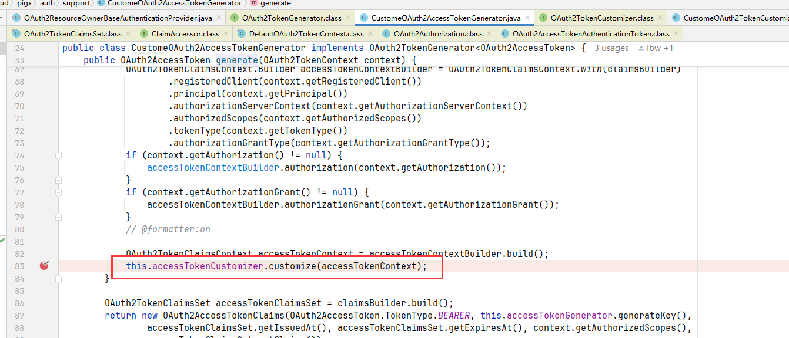
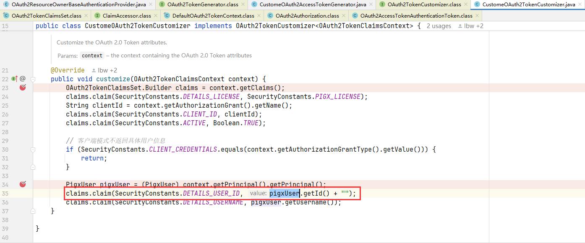

# # 2024-12-19

## 一、改登录返回参数












## 二、钱数分摊问题

### 2.1 场景示例

```java
public static void main(String[] args) {

    // 总金额
    BigDecimal totalAmt = new BigDecimal(1112);
    // 分摊数量
    BigDecimal count = new BigDecimal(333);
    // 记录分摊结果
    List<BigDecimal> aveAmt = new ArrayList<>();

    // 分摊过程
    for(BigDecimal i = BigDecimal.ZERO; i.compareTo(count) < 0; i = i.add(BigDecimal.ONE)) {
        BigDecimal q = totalAmt.divide(count, 2, RoundingMode.HALF_UP);
        aveAmt.add(q);
    }
    aveAmt.add(totalAmt.subtract(totalAmt.multiply(count.subtract(BigDecimal.ONE)).divide(count, 2, RoundingMode.HALF_UP)));

    // 打印
    System.out.println("第一笔" + aveAmt.get(0));
    System.out.println("最后一笔：" + aveAmt.get(aveAmt.size() - 1));
    System.out.printf("合计：" + aveAmt.stream().reduce(BigDecimal::add).get());
}
```

结果：

```
第一笔3.34
最后一笔：3.34
合计：1115.56
```

### 2.2 分析

上述结果是不对的。

原因就是我们在计算最后一笔的时候，不应该通过总金额/总分摊数取取分摊的值再用总金额减去去去得出最后一个人分摊的钱（总金额/总分摊数取取分摊的值会有精度损失），而是通过累计前n-1个人分摊的钱，最后通过总金额减去前n-1个人分摊的钱去计算，这样才能保证值最后所有人分摊值加起来是一样的。

对于这一行必然会存在精度的损失！（这里要注意是先乘后除，目的就是不让精度丢失放得更大）

```java
(totalAmt.subtract(totalAmt.multiply(count.subtract(BigDecimal.ONE)).divide(count, 2, RoundingMode.HALF_UP))
```

并且上面每一项都是存在精度损失的（因为除不尽所以才有精度损失）

```java
totalAmt.divide(count, 2, RoundingMode.HALF_UP);
```

但在最后算最后一个分摊金额的时候，前面人的分摊金额是按照没有精度丢失来计算的（即不四舍五入，这也是为什么最后的合计不正确的原因）

```java
aveAmt.add(totalAmt.subtract(totalAmt.multiply(count.subtract(BigDecimal.ONE)).divide(count, 2, RoundingMode.HALF_UP)));
```

解决的方法目前想到有两个：

① 控制人数，累计前面分摊的金额，计算最后一笔分摊的时候通过总金额减去前面分摊金额的累计和，避免丢失的精度都分摊到最后一个人头上过多

②平均分，最后多出的余数按照顺序按照最小单位（如果是金钱的就是分）按顺序分给每一个人，相对公平，两两相差不会过大。