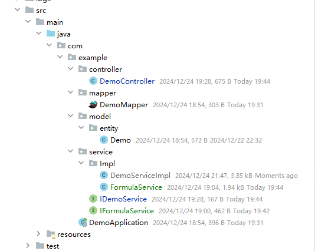
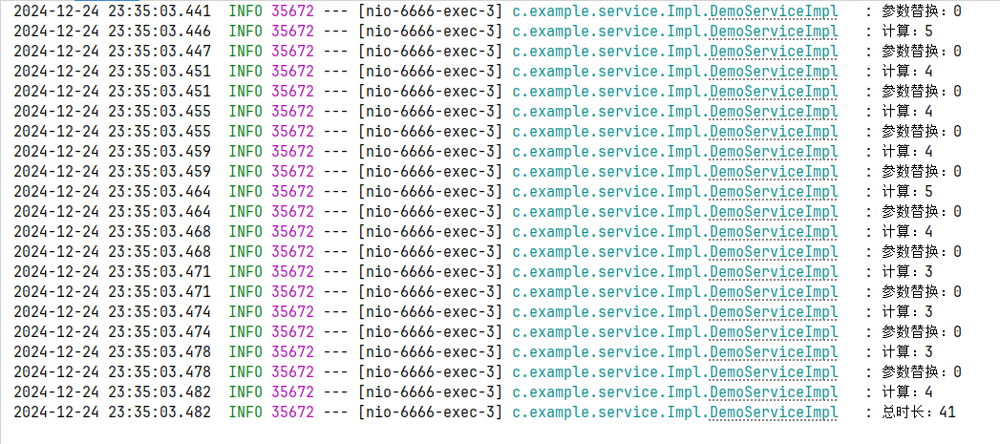
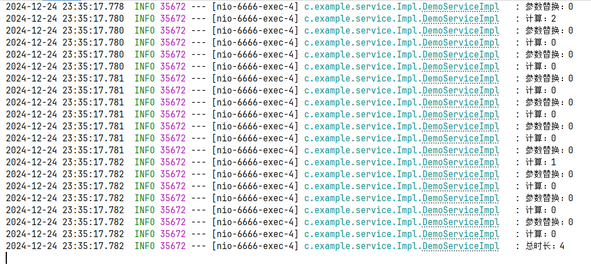

# 2024-12-24

## 一、直接用this调用比service调用方法速度更快

### 1.1 业务场景说明

经过对某一块业务进行优化排查后，发现一个循环中通过Spring注入进来的service实现类去调用目标方法需要花费4-10ms的时间（外面在一个循环，耗时就放大了好几倍），但是将对应的方法，放到该Service方法下，直接用this调用，耗时几乎在0ms左右！

### 1.2 DEMO测试

**demo整体结构**



**controller**

```java
@RestController
@RequestMapping("/demo")
public class DemoController {

    @Resource
    private IDemoService demoService;

    @GetMapping("/1")
    public void test() {
        demoService.test();
    }

    @GetMapping("/2")
    public void test2() {
        demoService.test2();
    }

}
```

**IFormulaService**

```java
public interface IFormulaService {

    String analyzeExpress(String express, Map<String, BigDecimal> params);

    /**
     * 计算引擎
     * @param expression
     * @return
     * @throws ScriptException
     */
    Object caclByEval(String expression);
}
```

**IDemoService**

```java
public interface IDemoService {

    void test();

    void test2();
}

```

**FormulaService**

```java
@Slf4j
@Service
public class FormulaService implements IFormulaService {

    public String analyzeExpress(String express, Map<String, BigDecimal> params) {
        for (Map.Entry<String, BigDecimal> entry : params.entrySet()) {
            String key = entry.getKey();
            express = express.replace(key, "(" + entry.getValue() + ")");
        }
        return express;
    }

    public Object caclByEval(String expression) {
        ScriptEngineManager manager = new ScriptEngineManager();
        ScriptEngine engine = manager.getEngineByName("JavaScript");
        // 使用eval方法计算表达式的值
        expression = expression + ";" +
                "function MAX() {return Math.max.apply(null,arguments)};" +
                "function MIN() {return Math.min.apply(null,arguments)};" +
                "function IF(a,b,c){return a?b:c;};" +
                "function AND() { for (var i=0;i<arguments.length;i++) { if (!arguments[i]) { return false } } return true };" +
                "function OR() { for (var i=0;i<arguments.length;i++) { if (arguments[i]) { return true } } return false }";

        try {
            Object eval = engine.eval(expression);
            return new BigDecimal(eval + "").setScale(2, RoundingMode.HALF_UP);
        } catch (Exception e) {
            if(e instanceof NumberFormatException) {
                return BigDecimal.ZERO.setScale(2, RoundingMode.HALF_UP);
            }
            log.info("gggg!");
            return null;
        }
    }

}
```

**DemoServiceImpl**

```java
@Slf4j
@Service
public class DemoServiceImpl extends ServiceImpl<DemoMapper, Demo> implements IDemoService {

    @Resource
    private IFormulaService formulaService;

    @Override
    public void test() {

        long begin = System.currentTimeMillis();
        for(int i = 1; i <= 10; i ++) {
            Map<String, BigDecimal> params = new HashMap<>();
            params.put("ABC", BigDecimal.TEN);
            params.put("EFG", BigDecimal.ONE);
            long begin2 = System.currentTimeMillis();
            String replace = formulaService.analyzeExpress("ABC+EFG", params);
            log.info("参数替换：{}", System.currentTimeMillis() - begin2);

            long begin3 = System.currentTimeMillis();
            BigDecimal val = (BigDecimal) formulaService.caclByEval(replace);
            log.info("计算：{}", System.currentTimeMillis() - begin3);
        }
        log.info("总时长：{}", System.currentTimeMillis() - begin);
    }


    @Override
    public void test2() {
        long begin = System.currentTimeMillis();

        for(int i = 1; i <= 10; i ++) {
            Map<String, BigDecimal> params = new HashMap<>();
            params.put("ABC", BigDecimal.TEN);
            params.put("EFG", BigDecimal.ONE);
            long begin1 = System.currentTimeMillis();
            String replace = this.analyzeExpress("ABC+EFG", params);
            log.info("参数替换：{}", System.currentTimeMillis() - begin1);

            long begin2 = System.currentTimeMillis();
            BigDecimal val = (BigDecimal) this.caclByEval(replace);
            log.info("计算：{}", System.currentTimeMillis() - begin2);
        }

        log.info("总时长：{}", System.currentTimeMillis() - begin);
    }

    private String analyzeExpress(String express, Map<String, BigDecimal> params) {
        for (Map.Entry<String, BigDecimal> entry : params.entrySet()) {
            String key = entry.getKey();
            express = express.replace(key, "(" + entry.getValue() + ")");
        }
        return express;
    }

    private static final ScriptEngine ENGINE = new ScriptEngineManager().getEngineByName("JavaScript");
    private Object caclByEval(String expression) {
        ScriptEngineManager manager = new ScriptEngineManager();
        try {
            Object eval = ENGINE.eval(expression);
            return new BigDecimal(eval + "").setScale(2, RoundingMode.HALF_UP);
        } catch (Exception e) {
            if (e instanceof NumberFormatException) {
                return BigDecimal.ZERO.setScale(2, RoundingMode.HALF_UP);
            }
            log.info("gggg!");
            return null;
        }
    }

}
```

**测试**

调用`/demo/1`接口（即通过注入的service实现去调用目标方法）



调用`/demo/2`接口（即通过注入的service实现去调用目标方法）



**注意：**第一次请求会很慢，但是后面的请求都会很快（原因目前没深究）

从上述可以看出，通过用this调用比service调用方法速度更快，如果外面有嵌套调用，这个差距会被无限放大。


### 1.3 原因初步解析

> 经过相关资料排查，有说是依赖注入的问题，但是DI是在程序启动，即Spring初始化阶段完成的，并且也没有涉及对Service方法进行AOP等代理增强的操作。并且通过@Service进行注解的方法也是单例的Bean对象，不会出现延迟加载造成调用方法变慢。

最后，从字节码的层面去进行解释：

`/demo/1`接口对应test方法的字节码文件

```
  0 invokestatic #2 <java/lang/System.currentTimeMillis>
  3 lstore_1
  4 iconst_1
  5 istore_3
  6 iload_3
  7 bipush 10
  9 if_icmpgt 138 (+129)
 12 new #3 <java/util/HashMap>
 15 dup
 16 invokespecial #4 <java/util/HashMap.<init>>
 19 astore 4
 21 aload 4
 23 ldc #5 <ABC>
 25 getstatic #6 <java/math/BigDecimal.TEN>
 28 invokeinterface #7 <java/util/Map.put> count 3
 33 pop
 34 aload 4
 36 ldc #8 <EFG>
 38 getstatic #9 <java/math/BigDecimal.ONE>
 41 invokeinterface #7 <java/util/Map.put> count 3
 46 pop
 47 getstatic #10 <com/example/service/Impl/DemoServiceImpl.log>
 50 ldc #11 <数据初始化：{}>
 52 invokestatic #2 <java/lang/System.currentTimeMillis>
 55 lload_1
 56 lsub
 57 invokestatic #12 <java/lang/Long.valueOf>
 60 invokeinterface #13 <org/slf4j/Logger.info> count 3
 65 aload_0
 66 getfield #14 <com/example/service/Impl/DemoServiceImpl.formulaService>
 69 ldc #15 <ABC+EFG>
 71 aload 4
 73 invokeinterface #16 <com/example/service/IFormulaService.analyzeExpress> count 3
 78 astore 5
 80 getstatic #10 <com/example/service/Impl/DemoServiceImpl.log>
 83 ldc #17 <参数替换：{}>
 85 invokestatic #2 <java/lang/System.currentTimeMillis>
 88 lload_1
 89 lsub
 90 invokestatic #12 <java/lang/Long.valueOf>
 93 invokeinterface #13 <org/slf4j/Logger.info> count 3
 98 aload_0
 99 getfield #14 <com/example/service/Impl/DemoServiceImpl.formulaService>
102 aload 5
104 invokeinterface #18 <com/example/service/IFormulaService.caclByEval> count 2
109 checkcast #19 <java/math/BigDecimal>
112 astore 6
114 getstatic #10 <com/example/service/Impl/DemoServiceImpl.log>
117 ldc #20 <计算：{}>
119 invokestatic #2 <java/lang/System.currentTimeMillis>
122 lload_1
123 lsub
124 invokestatic #12 <java/lang/Long.valueOf>
127 invokeinterface #13 <org/slf4j/Logger.info> count 3
132 iinc 3 by 1
135 goto 6 (-129)
138 getstatic #10 <com/example/service/Impl/DemoServiceImpl.log>
141 ldc #21 <总时长：{}>
143 invokestatic #2 <java/lang/System.currentTimeMillis>
146 lload_1
147 lsub
148 invokestatic #12 <java/lang/Long.valueOf>
151 invokeinterface #13 <org/slf4j/Logger.info> count 3
156 return

```

`/demo/2`接口对应test2方法的字节码文件

```
  0 invokestatic #2 <java/lang/System.currentTimeMillis>
  3 lstore_1
  4 iconst_1
  5 istore_3
  6 iload_3
  7 bipush 10
  9 if_icmpgt 128 (+119)
 12 new #3 <java/util/HashMap>
 15 dup
 16 invokespecial #4 <java/util/HashMap.<init>>
 19 astore 4
 21 aload 4
 23 ldc #5 <ABC>
 25 getstatic #6 <java/math/BigDecimal.TEN>
 28 invokeinterface #7 <java/util/Map.put> count 3
 33 pop
 34 aload 4
 36 ldc #8 <EFG>
 38 getstatic #9 <java/math/BigDecimal.ONE>
 41 invokeinterface #7 <java/util/Map.put> count 3
 46 pop
 47 getstatic #10 <com/example/service/Impl/DemoServiceImpl.log>
 50 ldc #11 <数据初始化：{}>
 52 invokestatic #2 <java/lang/System.currentTimeMillis>
 55 lload_1
 56 lsub
 57 invokestatic #12 <java/lang/Long.valueOf>
 60 invokeinterface #13 <org/slf4j/Logger.info> count 3
 65 aload_0
 66 ldc #15 <ABC+EFG>
 68 aload 4
 70 invokevirtual #22 <com/example/service/Impl/DemoServiceImpl.analyzeExpress>
 73 astore 5
 75 getstatic #10 <com/example/service/Impl/DemoServiceImpl.log>
 78 ldc #17 <参数替换：{}>
 80 invokestatic #2 <java/lang/System.currentTimeMillis>
 83 lload_1
 84 lsub
 85 invokestatic #12 <java/lang/Long.valueOf>
 88 invokeinterface #13 <org/slf4j/Logger.info> count 3
 93 aload_0
 94 aload 5
 96 invokevirtual #23 <com/example/service/Impl/DemoServiceImpl.caclByEval>
 99 checkcast #19 <java/math/BigDecimal>
102 astore 6
104 getstatic #10 <com/example/service/Impl/DemoServiceImpl.log>
107 ldc #20 <计算：{}>
109 invokestatic #2 <java/lang/System.currentTimeMillis>
112 lload_1
113 lsub
114 invokestatic #12 <java/lang/Long.valueOf>
117 invokeinterface #13 <org/slf4j/Logger.info> count 3
122 iinc 3 by 1
125 goto 6 (-119)
128 getstatic #10 <com/example/service/Impl/DemoServiceImpl.log>
131 ldc #21 <总时长：{}>
133 invokestatic #2 <java/lang/System.currentTimeMillis>
136 lload_1
137 lsub
138 invokestatic #12 <java/lang/Long.valueOf>
141 invokeinterface #13 <org/slf4j/Logger.info> count 3
146 return

```

其中test方法是通过invokevirtual去调用analyzeExpress和analyzeExpress方法，而test1通过invokeinterface去调用analyzeExpress和analyzeExpress方法。

> `invokevirtual`：
>
> - **用途**：`invokevirtual` 用于调用类的实例方法。它是在对象的类中查找方法实现的，支持**动态绑定**（动态分派），即根据实际的对象类型来调用方法。
> - **实现**：在调用时，JVM 会根据对象的实际类型来查找方法。这通常是通过方法的虚拟方法表（VMT，Virtual Method Table）来实现的。每个对象的类都有一张虚拟方法表，表中存储了该类的实例方法。调用时，JVM 会根据对象的实际类型，查找对应的方法。
>
> `invokeinterface`：
>
> - **用途**：`invokeinterface` 用于调用接口方法。由于接口没有实现代码，实际调用时会委托给实现该接口的类的相应方法。
> - **实现**：接口的调用方式也支持动态绑定。与 `invokevirtual` 类似，JVM 会根据接口的实际实现来查找方法。但是，由于接口的实现类可以有多个，这可能导致在查找方法时有更多的开销，因为需要先通过接口的实现类来查找对应的方法。
>
> 性能比较：
>
> 1. **方法查找的复杂度**：
>    - `invokevirtual` 查找方法的过程相对简单，因为它只需查找虚拟方法表（VMT）。这通常是通过一个简单的指针查找操作来完成的。
>    - `invokeinterface` 的查找过程更复杂。因为接口可以有多个实现类，JVM 在调用时需要通过接口的实现类来查找方法，可能涉及到更多的查找步骤。
> 2. **动态绑定的开销**：
>    - `invokevirtual` 的动态绑定通常是固定的，因为一个类只能有一个虚拟方法表，因此查找方法的速度较快。
>    - `invokeinterface` 的动态绑定则需要更加复杂的逻辑，特别是在接口有多个实现时，查找方法时可能会涉及额外的步骤，这增加了调用的开销。
>
> 总结：
>
> - **`invokevirtual` 的效率通常更高**，因为它只需要查找单一的虚拟方法表。
> - **`invokeinterface` 的效率较低**，因为它涉及到更多的查找过程，特别是在接口有多个实现的情况下。


## 二、关于string和stringbuilder替换其中字符串的效率问题

在 Java 中，`String` 和 `StringBuilder` 都有 `replace` 操作，但是它们的效率有显著不同，主要是由于它们在内存中的处理方式和不可变性/可变性特征的不同。我们可以从几个角度来分析这两者的效率。

### 1. `String` 是不可变的

- **不可变性**：`String` 是不可变的（immutable）。这意味着每次你对一个 `String` 进行修改（例如 `replace` 操作），都会生成一个新的 `String` 对象。因此，如果你对一个 `String` 进行多次替换操作，实际上每次都会创建一个新的 `String` 对象，而旧的对象会被垃圾回收。
- **性能问题**：这种不可变性导致了较高的内存开销和更长的执行时间，尤其是在字符串修改操作频繁的情况下。每次替换都会导致新的字符串对象的创建和复制。

### 2. `StringBuilder` 是可变的

- **可变性**：`StringBuilder` 是可变的（mutable）。当你使用 `StringBuilder` 对象进行操作时，原始的 `StringBuilder` 对象本身会被修改，不会生成新的对象。因此，`StringBuilder` 在执行 `replace` 操作时相对高效，因为它不需要频繁创建新的对象。
- **性能优势**：`StringBuilder` 的 `replace` 操作在修改字符串内容时会在原始对象上进行修改，不涉及额外的内存分配和对象创建，因此其性能比 `String` 更好，尤其是在需要多次修改字符串时。

### 3. 性能比较

- **`String` 的 `replace` 操作**：每次调用 `replace` 方法时，都会生成一个新的字符串对象。对于大量的替换操作，`String` 的效率较低，因为每次都需要分配新的内存和复制数据。每次操作的时间复杂度通常是 O(n)，其中 `n` 是字符串的长度。
- **`StringBuilder` 的 `replace` 操作**：`StringBuilder` 的 `replace` 操作直接在内存中修改字符数组，效率相对较高，尤其是在字符串长度较长或需要频繁替换时。它的时间复杂度通常也是 O(n)，但由于没有频繁创建新对象，它的内存开销较小，性能更好。

### 4. 使用场景

- **`String`** 适合于较少进行修改的场景，或者你只需要进行单次或少量替换时。
- **`StringBuilder`** 更适合需要频繁修改字符串内容的场景，比如多次替换、大规模拼接等，尤其是在循环中。
