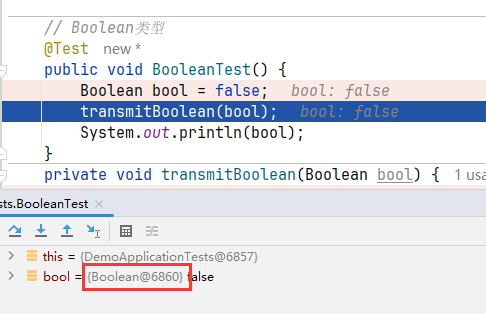
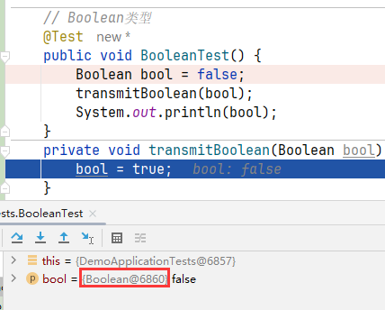
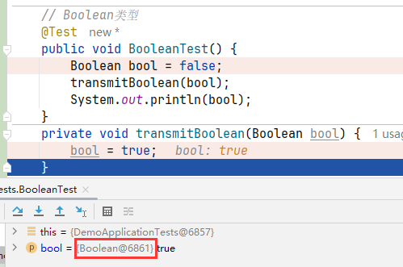

# 2024-12-25

## 一、关于JAVA值传递问题

### 1.1 前言

之前在学习C++语言的时候，将实参传递给方法（或函数）的方式分为两种：值传递和引用传递，但在JAVA中只有值传递（颠覆认知，基础没学踏实）

> 参考文章：https://blog.csdn.net/aaaa_1111111/article/details/143747247

### 1.2 几个值传递示例

#### 1. Boolean类型值传递问题

**demo**

```java
// Boolean类型
@Test
public void BooleanTest() {
    Boolean bool = false;
    transmitBoolean(bool);
    System.out.println(bool);
}
private void transmitBoolean(Boolean bool) {
    bool = true;
}
```

**结果**

```
false
```

**原因分析**

明明传递的是引用类型，为什么无法修改呢？

首先Java只支持值传递，此时的形参bool是实参的副本（即实参和形参的值都指向值=false的Boolean对象，但是形参时实参的拷贝副本），当我们在方法中修改形参bool的Boolean值的时候，因为Boolean 是不可变的对象，因此在方法中改变它的值时，它并不会影响原始的值，因此会创建一个新的对象并赋值给形参（即拷贝实参的副本），其并没有影响到实参，因此在该方法调用结束后，实参的值还是false。

调用方法前，实参地址



调用方法中，形参地址



方法中修改Boolean值后，形参地址



**解决方法**

1. 使用 `AtomicBoolean`：

`AtomicBoolean` 是一个可以在多线程环境下保证原子性的类，它是可变的。你可以使用 `AtomicBoolean` 来避免不可变性的问题。

```java
import java.util.concurrent.atomic.AtomicBoolean;

public class Main {
    public static void main(String[] args) {
        AtomicBoolean pd = new AtomicBoolean(false);
        method(pd);
        System.out.println(pd.get());  // 现在会打印 true
    }

    public static void method(AtomicBoolean if1) {
        if1.set(true);  // 修改 AtomicBoolean 的值
    }
}
```

`AtomicBoolean` 使用 `get()` 方法来获取值，使用 `set()` 方法来修改值。

2. 使用数组或者容器对象（例如 `List`）：

如果你不想使用 `AtomicBoolean`，你还可以使用一个数组或容器（例如 `List`）来传递值，因为数组和容器是可变的。

```java
public class Main {
    public static void main(String[] args) {
        Boolean[] pd = { false };
        method(pd);
        System.out.println(pd[0]);  // 现在会打印 true
    }

    public static void method(Boolean[] if1) {
        if1[0] = true;  // 修改数组中的值
    }
}
```

3. 使用 `Wrapper` 类来返回新值：

如果你不想使用 `AtomicBoolean` 或容器，你可以通过方法的返回值来返回修改后的 `Boolean` 值。

```java
public class Main {
    public static void main(String[] args) {
        Boolean pd = false;
        pd = method(pd);  // 方法返回修改后的 Boolean 值
        System.out.println(pd);  // 现在会打印 true
    }

    public static Boolean method(Boolean if1) {
        return true;  // 直接返回修改后的值
    }
}
```


#### 2. Map类型值传递问题

**demo**

```java
// Map
@Test
public void MapTest() {
    Map<String, String> map = new HashMap<>();
    map.put("hhh", "123");
    transmitMap(map);
    System.out.println(map);
}
private void transmitMap(Map map) {
    //map.put("hhh", "321");
    map = new HashMap();
    map.put("xixi", "321");
}
```

**结果**

```java
{hhh=123}
```

**原因分析**

和1是一样原因，在方法中对形参指向引用对象的更改只对形参有效，形参只是对实参的一个拷贝，不会对实参造成影响！


#### 3.正常对象的值传递问题

**demo**

```java
// 自定义引用类型
@Test
public void ClassTest() {
    A a = new A();
    a.setId(123L);
    a.setName("www");
    transmitClass(a);
    System.out.println(a);
}
private void transmitClass(A a) {
    a.setId(321L);
    a.setName("hhh");
}
@Data
public class A{
    private Long id;
    private String name;
}
```

**结果**

```
DemoApplicationTests.A(id=321, name=hhh)
```

**原因**

这里显示的结果正确的，虽然形参是对实参的拷贝，但是修改的内容都是对同一个堆中对象的修改。所以在方法调用后，可以完成对内容的修改。