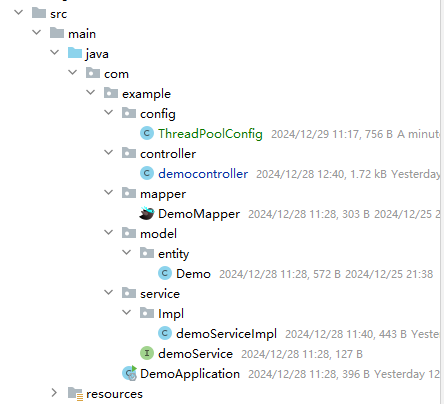

# 2024-12-27

## 一、前端线程请求

疑问：同一个接口，前端连续调用两次是通过两个线程进行调用的，但是自己在页面中手动点击是一个一个线程请求的。

## 二、线程池嵌套调用问题

### 2.1 背景

实际开发中，为了优化接口性能，把所有涉及到循环的地方都加上了线程池异步调用。在代码排查的时候，遇到了线程池嵌套……

### 2.2 Demo

**项目整体结构（Spring Boot项目 Web三层架构）**



**线程池配置类**

线程池拒绝策略使用默认的，即**AbortPolicy**，当线程池无法处理新任务时，抛出 `RejectedExecutionException` 异常。

```java
@Configuration
public class ThreadPoolConfig {

    @Bean
    public ThreadPoolTaskExecutor threadPoolTaskExecutor() {
        ThreadPoolTaskExecutor executor = new ThreadPoolTaskExecutor();
        executor.setCorePoolSize(8);
        executor.setMaxPoolSize(16);
        executor.setQueueCapacity(32);
        executor.setKeepAliveSeconds(60);
        executor.setThreadNamePrefix("Banana-");
        executor.initialize();
        return executor;
    }

}
```

**controller**

```java
@Slf4j
@RestController
@RequestMapping("/demo")
public class democontroller {


    @Resource
    ThreadPoolTaskExecutor threadPoolTaskExecutor;

    @GetMapping
    public void test() {
        List<Future> list = new ArrayList<>();
        for(int i = 1; i <= 10; i ++) {
            int finalI = i;
            CompletableFuture<Void> voidCompletableFuture = CompletableFuture.runAsync(() -> {
                log.info("外层循环调用，本次i={},线程：{}", finalI, Thread.currentThread());

                CompletableFuture<Void> voidCompletableFuture2 = CompletableFuture.runAsync(() -> {
                    log.info("内层循环调用，本次i={},线程：{}", finalI, Thread.currentThread());
                }, threadPoolTaskExecutor);
                voidCompletableFuture2.join();

            }, threadPoolTaskExecutor);
            list.add(voidCompletableFuture);
        }
        CompletableFuture.allOf(list.toArray(new CompletableFuture[0])).join();

        log.info(Thread.currentThread() + ": 主线程执行结束……");
    }
}
```


### 2.3 问题复现

在上述代码中，我们总共会有10 + 10 = 20个异步任务提交给线程池进行执行。

#### 1、正常

线程池配置

```java
@Configuration
public class ThreadPoolConfig {

    @Bean
    public ThreadPoolTaskExecutor threadPoolTaskExecutor() {
        ThreadPoolTaskExecutor executor = new ThreadPoolTaskExecutor();
        executor.setCorePoolSize(8);
        executor.setMaxPoolSize(20);
        executor.setQueueCapacity(0);
        executor.setKeepAliveSeconds(60);
        executor.setThreadNamePrefix("Banana-");
        executor.initialize();
        return executor;
    }
}
```

调用结果（正常）

```
2024-12-29 11:52:51.322  INFO 9108 --- [       Banana-5] com.example.controller.democontroller    : 外层循环调用，本次i=5,线程：Thread[Banana-5,5,main]
2024-12-29 11:52:51.321  INFO 9108 --- [       Banana-3] com.example.controller.democontroller    : 外层循环调用，本次i=3,线程：Thread[Banana-3,5,main]
2024-12-29 11:52:51.322  INFO 9108 --- [       Banana-7] com.example.controller.democontroller    : 外层循环调用，本次i=7,线程：Thread[Banana-7,5,main]
2024-12-29 11:52:51.322  INFO 9108 --- [      Banana-10] com.example.controller.democontroller    : 外层循环调用，本次i=10,线程：Thread[Banana-10,5,main]
2024-12-29 11:52:51.322  INFO 9108 --- [       Banana-8] com.example.controller.democontroller    : 外层循环调用，本次i=8,线程：Thread[Banana-8,5,main]
2024-12-29 11:52:51.321  INFO 9108 --- [       Banana-2] com.example.controller.democontroller    : 外层循环调用，本次i=2,线程：Thread[Banana-2,5,main]
2024-12-29 11:52:51.322  INFO 9108 --- [       Banana-4] com.example.controller.democontroller    : 外层循环调用，本次i=4,线程：Thread[Banana-4,5,main]
2024-12-29 11:52:51.322  INFO 9108 --- [       Banana-6] com.example.controller.democontroller    : 外层循环调用，本次i=6,线程：Thread[Banana-6,5,main]
2024-12-29 11:52:51.321  INFO 9108 --- [       Banana-1] com.example.controller.democontroller    : 外层循环调用，本次i=1,线程：Thread[Banana-1,5,main]
2024-12-29 11:52:51.322  INFO 9108 --- [       Banana-9] com.example.controller.democontroller    : 外层循环调用，本次i=9,线程：Thread[Banana-9,5,main]
2024-12-29 11:52:51.323  INFO 9108 --- [      Banana-11] com.example.controller.democontroller    : 内层循环调用，本次i=10,线程：Thread[Banana-11,5,main]
2024-12-29 11:52:51.323  INFO 9108 --- [      Banana-17] com.example.controller.democontroller    : 内层循环调用，本次i=4,线程：Thread[Banana-17,5,main]
2024-12-29 11:52:51.323  INFO 9108 --- [      Banana-14] com.example.controller.democontroller    : 内层循环调用，本次i=5,线程：Thread[Banana-14,5,main]
2024-12-29 11:52:51.323  INFO 9108 --- [      Banana-12] com.example.controller.democontroller    : 内层循环调用，本次i=2,线程：Thread[Banana-12,5,main]
2024-12-29 11:52:51.323  INFO 9108 --- [      Banana-13] com.example.controller.democontroller    : 内层循环调用，本次i=6,线程：Thread[Banana-13,5,main]
2024-12-29 11:52:51.323  INFO 9108 --- [      Banana-16] com.example.controller.democontroller    : 内层循环调用，本次i=3,线程：Thread[Banana-16,5,main]
2024-12-29 11:52:51.324  INFO 9108 --- [      Banana-15] com.example.controller.democontroller    : 内层循环调用，本次i=7,线程：Thread[Banana-15,5,main]
2024-12-29 11:52:51.324  INFO 9108 --- [      Banana-18] com.example.controller.democontroller    : 内层循环调用，本次i=8,线程：Thread[Banana-18,5,main]
2024-12-29 11:52:51.324  INFO 9108 --- [      Banana-19] com.example.controller.democontroller    : 内层循环调用，本次i=1,线程：Thread[Banana-19,5,main]
2024-12-29 11:52:51.324  INFO 9108 --- [      Banana-20] com.example.controller.democontroller    : 内层循环调用，本次i=9,线程：Thread[Banana-20,5,main]
2024-12-29 11:52:51.324  INFO 9108 --- [nio-6666-exec-2] com.example.controller.democontroller    : Thread[http-nio-6666-exec-2,5,main]: 主线程执行结束……

```


#### 2、阻塞问题

线程配置

```java
@Configuration
public class ThreadPoolConfig {

    @Bean
    public ThreadPoolTaskExecutor threadPoolTaskExecutor() {
        ThreadPoolTaskExecutor executor = new ThreadPoolTaskExecutor();
        executor.setCorePoolSize(8);
        executor.setMaxPoolSize(16);
        executor.setQueueCapacity(50);
        executor.setKeepAliveSeconds(60);
        executor.setThreadNamePrefix("Banana-");
        executor.initialize();
        return executor;
    }

}
```

调用结果（阻塞）

```
2024-12-29 12:03:29.215  INFO 23148 --- [       Banana-3] com.example.controller.democontroller    : 外层循环调用，本次i=3,线程：Thread[Banana-3,5,main]
2024-12-29 12:03:29.215  INFO 23148 --- [       Banana-7] com.example.controller.democontroller    : 外层循环调用，本次i=7,线程：Thread[Banana-7,5,main]
2024-12-29 12:03:29.215  INFO 23148 --- [       Banana-4] com.example.controller.democontroller    : 外层循环调用，本次i=4,线程：Thread[Banana-4,5,main]
2024-12-29 12:03:29.215  INFO 23148 --- [       Banana-6] com.example.controller.democontroller    : 外层循环调用，本次i=6,线程：Thread[Banana-6,5,main]
2024-12-29 12:03:29.215  INFO 23148 --- [       Banana-5] com.example.controller.democontroller    : 外层循环调用，本次i=5,线程：Thread[Banana-5,5,main]
2024-12-29 12:03:29.215  INFO 23148 --- [       Banana-2] com.example.controller.democontroller    : 外层循环调用，本次i=2,线程：Thread[Banana-2,5,main]
2024-12-29 12:03:29.215  INFO 23148 --- [       Banana-8] com.example.controller.democontroller    : 外层循环调用，本次i=8,线程：Thread[Banana-8,5,main]
2024-12-29 12:03:29.215  INFO 23148 --- [       Banana-1] com.example.controller.democontroller    : 外层循环调用，本次i=1,线程：Thread[Banana-1,5,main]

```

**原因：**首先外层循环分配到了8个线程池，此时内部再次分配的时候，发现核心线程池数量不够了，提交任务后，就会进入阻塞队列，但是外层分配8个线程池的任务，在等待内循环中任务结束，从而发生了阻塞。我们把阻塞队列开着0，就如1所示，就可以避免阻塞问题，但是不建议使用嵌套调用线程池的情况。


## 三、线程池中最大线程

**说明：**

在阻塞队列都满的情况下，才会启用最大线程。

- **核心线程数**：这是线程池在没有任务时仍然保持活跃的最小线程数。即使线程池空闲，核心线程会被保持，不会被销毁，除非调用`allowCoreThreadTimeOut(true)`方法。
- **最大线程数**：这是线程池可以创建的最大线程数。当任务积压、队列满时，如果线程池中的线程数小于最大线程数，线程池会创建新线程来处理任务，直到最大线程数达到上限。

注意：**核心线程数**是包含在**最大线程数**中的。在Java的`ThreadPoolExecutor`中，线程池的最大线程数表示线程池中线程的上限，而核心线程数是线程池在没有任务时依然保持存活的线程数。

**示例：**

假设你配置了以下线程池参数：

```java
int corePoolSize = 2;   // 核心线程数
int maximumPoolSize = 4; // 最大线程数
```

1. 初始时，线程池会保持 2 个核心线程活跃（即便没有任务，它们也会空闲等待）。
2. 当有任务到来且核心线程数没有满足任务需求时，线程池会增加线程，最多可以增加到 4 个线程（即最大线程数）。
3. 如果线程数已达到最大线程数 4，且任务队列已满，新的任务将被拒绝，除非你设置了其他的处理机制。


## 四、主线程是用的什么线程

主线程使用的是XNIO-1 task-3线程。

是 **Tomcat** 中使用的异步 I/O 操作的线程之一。这与 **Tomcat** 内部的 **非阻塞 I/O** 机制有关，通常涉及到其 **异步请求处理**。

在 Tomcat 中，`XNIO` 线程池是用来处理非阻塞 I/O 操作的。Tomcat 从 **7.x** 版本开始引入了 **NIO (New I/O)** 和 **NIO2** 支持，后者是 Java 的异步 I/O 机制。为了提升并发处理能力，Tomcat 支持基于 **NIO** 或 **AJP** 协议的异步处理方式。

- **XNIO** 是 Tomcat 使用的底层 I/O 库，它允许异步 I/O 操作，这样服务器可以在等待某些 I/O 操作（如网络请求）时继续处理其他任务。
- `XNIO-1 task-3` 是 Tomcat 中异步 I/O 操作的一个工作线程。`XNIO-1` 表示线程池，`task-3` 表示当前处理的任务。


## 五、线程注解@Async

> 推荐文章：https://blog.csdn.net/weixin_44296929/article/details/141360956
