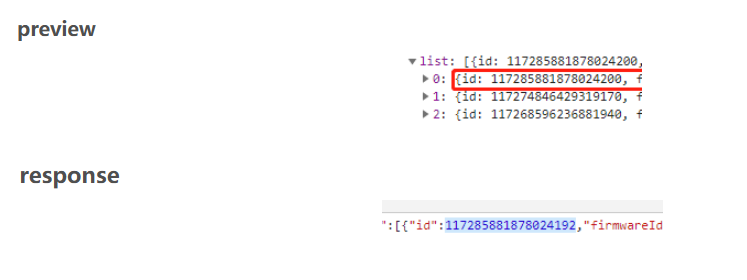

# 2025-02-14

### 一、前端/浏览器精度丢失

联调过程中，一般是在浏览器查看后端接口的返回结果的，如果后端返回的json格式的响应中，id是以整型返回的，那么！

> 一般情况下我们看Network里面的Preview和Response的结果似乎一模一样。
>
> 不管是请求页面，请求页面还是请求js还是请求css，二者的结果都一样。
>
> 在Preview中，控制台会把发送过来的json数据自动转换成javascript的对象格式；
>
> 而这个时候，突发bug页面显示和response中的一样，但是preview却不一样。
>
> 
>
> **NetWork中的 preview** 是错误的，而**response** 的值却是正确的。
>
>   使用**Postman**来进行请求，发现请求值也是正确的，那么问题就只能在浏览器上了！！
>
> 原因：
>
> JavaScript中Number类型并不能完全表示Long型的数字，在Long长度大于17位时会出现精度丢失的问题，超过17位的部分浏览器会转换为0显示
>
>    js中的**Number**类型只能解析其中的**17**位，其他几位补位为0，就会造成如上问题。

同样，如果前端程序接受的时候用的也是JS，那么接受整型也会出现精度丢失的问题，所以要注意。

> 参考文章：
>
> https://blog.csdn.net/qq_38031120/article/details/109817299
>
> https://blog.csdn.net/weixin_42048982/article/details/134173758
>
> https://blog.csdn.net/doctor_who2004/article/details/104026152