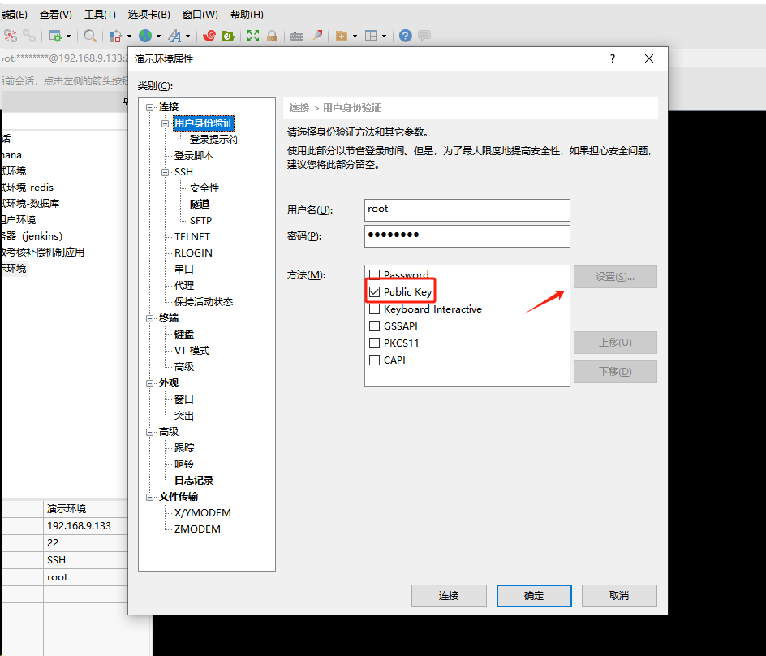
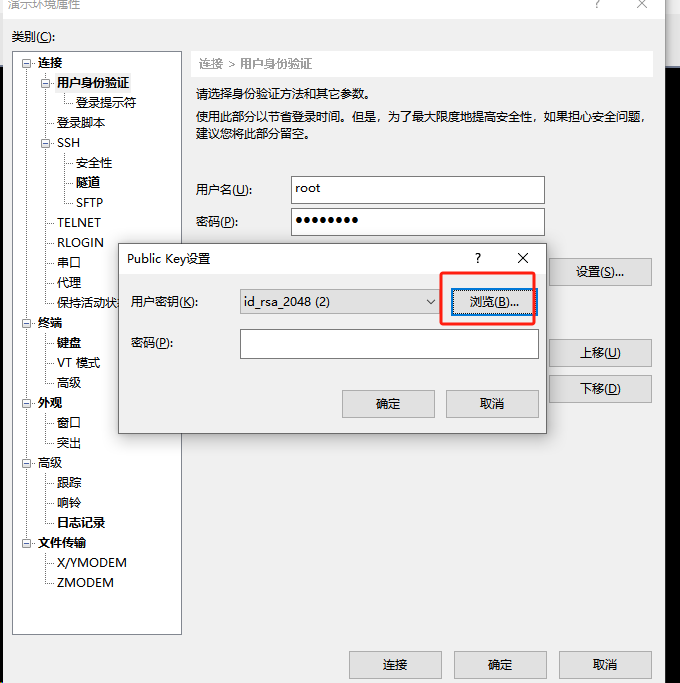
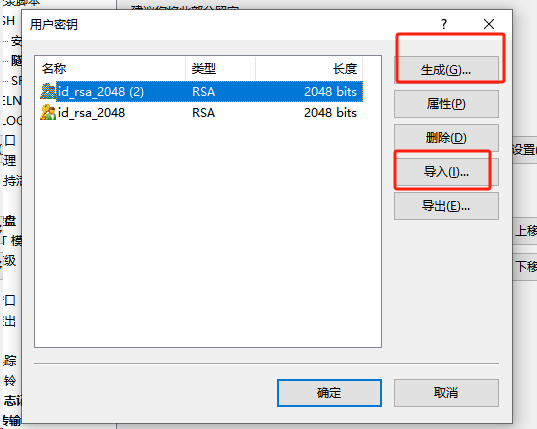

# 2025-02-17

## 一、xshell通密钥认证方式登录服务器

> 参考文章 
>
> - https://blog.csdn.net/weixin_31814585/article/details/112942756
> - Windows操作系统生成SSH密钥：https://blog.csdn.net/qiu421/article/details/132599527

这里直接使用xshell中生成公私密钥，然后把公钥放到linux上即可完成通过秘钥认证方式登录服务器。

点击用户身份验证，选择Public Key，点击设置





这里可以选择直接生成，也可以选择导入



这样就完成了秘钥的配置，然后我们把生成的公钥，放到linux服务器上的root/.ssh/authorized_keys的文档中即可

## 二、流程引擎

流程引擎发起流程获取顺序：

- ACT_RE_PROCDEF
- ACT_RE_DEPLOYMENT
- ACT_GE_BYTEARRAY


### 三、XML解析

#### 3.1 解析内容

XML：

```xml
<?xml version="1.0" encoding="utf-8"?>
<string xmlns="http://tempuri.org/">{
  "code": 0,
  "fileDataBase64": "CA5IDAgUiA+Pg0KDQpzdGFydHhyZWYNCjMwODM4DQolJUVPRg=="
}</string>
```

现在需要获取其中的json格式的内容，并进行输出（实际业务中，可能会对该JSON字符串进行解析，然后获取其中的某个属性值）

#### 3.2 方法一：正则解析

```java
public static void main(String[] args) {
    String xmlResponse = "<?xml version=\"1.0\" encoding=\"utf-8\"?>\n" +
            "<string xmlns=\"http://tempuri.org/\">{\n" +
            "  \"code\": 0,\n" +
            "  \"fileDataBase64\": \"CA5IDAgUiA+Pg0KDQpzdGFydHhyZWYNCjMwODM4DQolJUVPRg==\"\n" +
            "}</string>\n";

    String regex = "\\{[\\s\\S]*\\}";

    // 创建 Pattern 和 Matcher 对象
    Pattern pattern = Pattern.compile(regex);
    Matcher matcher = pattern.matcher(xmlResponse);

    String matchedContent = null;

    while (matcher.find()) {
        // 输出匹配到的内容
        matchedContent = matcher.group(0).trim();
        System.out.println("提取到的 JSON 内容： " + matchedContent);
    }

}

/*
输出内容：
提取到的 JSON 内容： {
  "code": 0,
  "fileDataBase64": "CA5IDAgUiA+Pg0KDQpzdGFydHhyZWYNCjMwODM4DQolJUVPRg=="
}
*/

```

> 正则表达式`\\{[\\s\\S]*\\}`说明：
>
> 在大多数编程语言（如 Java）中，反斜杠是一个转义符，因此我们必须使用 `\\` 来表示一个字面上的反斜杠。
>
> `\\{`：
>
> - `\\` 是用来转义字符 `{`，因为在正则表达式中，`{` 是有特殊含义的，它用于量词，表示重复的次数。
> - 所以，`\\{` 匹配的是字符 `{`，即花括号的开始。
>
> `[\\s\\S]*`：
>
> - `\\s` 匹配任何空白字符，如空格、制表符（tab）、换行符等。
> - `\\S` 匹配任何非空白字符。
> - `[\\s\\S]` 表示匹配所有字符，不管是空白字符还是非空白字符。所以，`[\\s\\S]` 实际上是匹配任意字符，包括换行符、空格、字母、数字等等。
> - `*` 是量词，表示匹配前面的字符（即任意字符）零次或多次。这意味着可以匹配任意长度的字符，包括空字符串。
>
> `\\}`：
>
> - 和 `\\{` 一样，`\\}` 用来转义右花括号 `}`，因为在正则中，右花括号也有特殊的意义。所以，`\\}` 匹配的是字符 `}`
>
> 这个正则表达式 `\\{[\\s\\S]*\\}` 的意思是：
>
> - 匹配一个以 `{` 开始，以 `}` 结束的字符串，其中 `{` 和 `}` 作为字面量字符被匹配。
> - 其中的内容可以包含任何字符，包括空格、换行符等。


#### 3.3 方法二:Document解析XML

```java
import javax.xml.parsers.DocumentBuilder;
import javax.xml.parsers.DocumentBuilderFactory;
import org.w3c.dom.*;
import java.io.*;

public class ExtractJsonWithXMLParser {
    public static void main(String[] args) {
        try {
            // 输入的 XML 响应
            String xmlResponse = "<?xml version=\"1.0\" encoding=\"utf-8\"?>\n" +
                    "<string xmlns=\"http://tempuri.org/\">{\n" +
                    "  \"code\": 0,\n" +
                    "  \"fileDataBase64\": \"CA5IDAgUiA+Pg0KDQpzdGFydHhyZWYNCjMwODM4DQolJUVPRg==\"\n" +
                    "}</string>\n";
            
            // 将输入的 XML 字符串转为输入流
            InputStream inputStream = new ByteArrayInputStream(xmlResponse.getBytes("UTF-8"));
            
            // 创建 DocumentBuilderFactory 实例
            DocumentBuilderFactory factory = DocumentBuilderFactory.newInstance();
            DocumentBuilder builder = factory.newDocumentBuilder();
            
            // 解析 XML
            Document document = builder.parse(inputStream);
            
            // 获取 <string> 标签中的内容
            NodeList nodeList = document.getElementsByTagName("string");
            if (nodeList.getLength() > 0) {
                // 获取字符串内容并去除头尾的空白字符
                String content = nodeList.item(0).getTextContent().trim();
                
                // 输出提取的 JSON 内容
                System.out.println("提取到的内容： " + content);
            } else {
                System.out.println("未找到 <string> 标签！");
            }
        } catch (Exception e) {
            e.printStackTrace();
        }
    }
}

```

