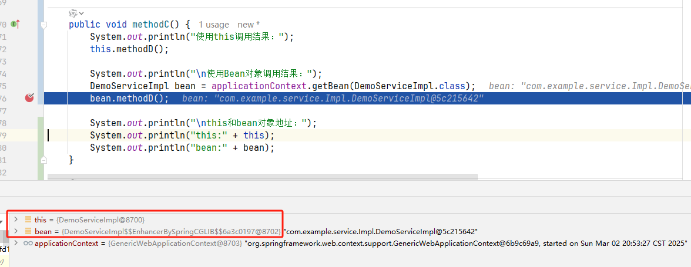

## 代理对象中使用this

### 一、问题引出

业务逻辑层代码

```java
@Service
public class DemoServiceImpl extends ServiceImpl<DemoMapper, Demo> implements DemoService, ApplicationContextAware {

    // 用于从Spring容器中获取指定Bean的对象
    private ApplicationContext applicationContext;

    // 通过ApplicationContextAware接口完成applicationContext对象的注入
    @Override
    public void setApplicationContext(ApplicationContext applicationContext) throws BeansException {
        this.applicationContext = applicationContext;
    }
    
    public void methodC() {
        
        System.out.println("使用this调用结果：");
        this.methodD();

        System.out.println("\n使用Bean对象调用结果：");
        DemoServiceImpl bean = applicationContext.getBean(DemoServiceImpl.class);
        bean.methodD();
    }

    public void methodD() {
        System.out.println("执行D方法……");
    }

}
```

自定义切面：对DemoServiceImpl方法中的methodD方法进行增强，在前后打印相关内容

```java
@Aspect
@Component
public class CustomAspect {

    @Around("execution(* com.example.service.*.methodD(..))")
    public void aspectMethod(ProceedingJoinPoint joinPoint) throws Throwable {
        System.out.println("aspectMethod before执行……");
        joinPoint.proceed();
        System.out.println("aspectMethod after执行……");
    }
}
```

测试类

```java
@SpringBootTest
class DemoApplicationTests {

    @Test
    void contextLoads() {
    }

    @Resource
    private DemoService demoService;

    @Test
    void test() throws Exception {
        demoService.methodC();
    }

}
```

测试结果：

```
使用this调用结果：
执行D方法……

使用Bean对象调用结果：
aspectMethod before执行……
执行D方法……
aspectMethod after执行……

```

**疑问：**之前学习的时候不是说this不是哪个对象调用就是哪个对象的引用类型（之间的理解有问题，应该是this始终指向当前对象的实例。在实例方法中，`this` 指向当前对象的实例；在构造方法中，`this` 指向正在被构造的对象），现在是通过demoService的代理对象（通过AOP进行增强，Spring在创建Bean对象的时候，会对该对象进行代理增强，并放入到IOC容器中）对methodC方法的调用，然后methodC中又通过this去调用methodD方法，那这个this不就是demoService的代理对象吗？methodD不就应该是代理对象的methodD,即增强后的methodD方法吗，但是实际上确实增强前的MethodD方法。


### 二、原因分析

首先this是Java语言的一个关键字，指向当前对象的实例：

注意：如果通过代理对象调用方法，`this` 仍然指向 **原始对象**，而不是代理对象，因为 `this` 是 Java 语言的关键字，它的行为是由 Java 语言规范定义的，无法被 Spring 或其他框架修改。

`this` 的行为在编译期就已经确定，编译器会将 `this` 替换为当前对象的引用：

```java
public class A {
    public void method() {
        System.out.println("Method called");
    }
 
    public static void main(String[] args) {
        A a = new A();
        a.method();
    }
}
```

其在编译后等价于:

```java
public class A {
    public void method(A this) {
        System.out.println("Method called");
    }
 
    public static void main(String[] args) {
        A a = new A();
        a.method(a);
    }
}
```

在实例方法调用时，编译器会隐式地将当前对象的引用作为第一个参数传递给方法,通过查看A对应的字节码可以看到，methodC方法的局部变量表中的第一个参数就是this，因此，`this`关键字实际上就是一个指向当前对象的隐式参数。

因此在上面的DemoServiceImpl的methodC方法中通过this调用methodD方法的时候，其实就是调用DemoServiceImpl实例对象的methodD方法，而不是Spring AOP代理对象的methodD方法，`this` 是在编译期确定的，指向 `DemoServiceImpl` 的实例。而通过Spring AOP创建的代理对象是在 **运行时** 动态生成的，`this` 仍然指向原始对象。

我们打一个断点，也可以看到this和bean这两个对象是不一样的，this就是DemoServiceImpl实例对象，而bean是通过Spring AOP增强后的代理对象（使用GCLIB进行代理）



总结：

- **`this` 是在编译期确定的**：它指向当前对象的实例，无法被运行时修改。
- **代理对象是运行时生成的**：Spring 的代理对象无法改变 `this` 的行为。


### 尾言

#### 参考文章

- https://blog.csdn.net/benxiangsj/article/details/124282800
- https://blog.csdn.net/weixin_53840353/article/det