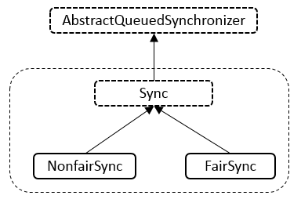
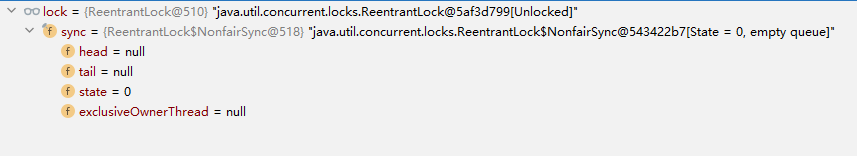
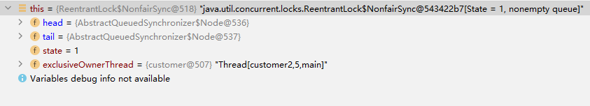
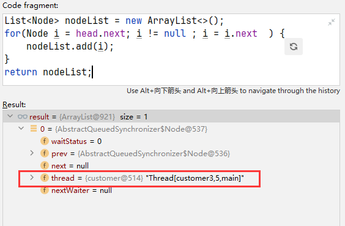

# ReentrantLock锁

## 一、前言

### 1.1 参考文章

- [JUC锁: ReentrantLock详解](https://pdai.tech/md/java/thread/java-thread-x-lock-ReentrantLock.html)
- [干货，深入剖析ReentrantLock源码，推荐收藏](https://www.cnblogs.com/yidengjiagou/p/16888174.html)
- [ReentrantLock中的NonfairSync加锁流程](https://cloud.tencent.com/developer/article/1358042)

- [从ReentrantLock的实现看AQS的原理及应用](https://tech.meituan.com/2019/12/05/aqs-theory-and-apply.html)
- [线程中断相关知识点](https://www.cnblogs.com/myseries/p/11107432.html)

## 二、详解

### 2.1 场景示例

关于ReentrantLock使用的具体方式演示

```java
public class ReentrantLockTest {
    
    public static void main(String[] args) {
        // 1. 创建ReentrantLock对象
        ReentrantLock lock = new ReentrantLock();
        // 2. 加锁
        lock.lock();
        try {
            // 3. 这里执行具体的业务逻辑
        } finally {
            // 4. 释放锁
            lock.unlock();
        }
    }
}
```

以顾客买票的场景为例

```java
package com.example.JUC.Locks.ReentrantLock;

import lombok.Data;

import java.util.concurrent.locks.Lock;
import java.util.concurrent.locks.ReentrantLock;

/**
 * 场景：顾客向销售员买票
 * @author banana
 * @create 2024-08-15 21:29
 */
public class ReentrantLockTest {

    public static void main(String[] args) {

        // 创建一个售票员对象（创建共享资源，方便后面对共享资源进行抢夺）
        TicketSeller ticketSeller = new TicketSeller();

        // 顾客1
        customer customer1 = new customer(ticketSeller);
        customer1.setName("customer1");

        // 顾客2
        customer customer2 = new customer(ticketSeller);
        customer2.setName("customer2");

        // 顾客3
        customer customer3 = new customer(ticketSeller);
        customer3.setName("customer3");

        // 开始抢票
        customer1.start();
        customer2.start();
        customer3.start();

    }
}

// 售票员
class TicketSeller{

    // 共有10张票（线程共享资源）
    private Integer tickets = 10;

    // 卖票
    public void sell() {
        if(tickets > 0) {
            System.out.println(Thread.currentThread().getName() + "买到第" + tickets -- + "张票!");
        }
    }

}

// 顾客
class customer extends Thread {

    TicketSeller ticketSeller;

    public customer(TicketSeller ticketSeller) {
        this.ticketSeller = ticketSeller;
    }

    @Override
    public void run() {
        while(true) {
            ticketSeller.sell();
            try {
                Thread.sleep(100);
            } catch (InterruptedException e) {
                throw new RuntimeException(e);
            }
        }
    }
}

```

结果出现了重复卖的情况

```
customer1买到第10张票!
customer3买到第10张票!
customer2买到第10张票!
customer1买到第9张票!
customer3买到第8张票!
customer2买到第9张票!
customer2买到第7张票!
customer3买到第7张票!
customer1买到第7张票!
customer2买到第6张票!
customer3买到第6张票!
customer1买到第6张票!
customer2买到第5张票!
customer3买到第5张票!
customer1买到第5张票!
customer2买到第4张票!
customer1买到第3张票!
customer3买到第2张票!
customer2买到第1张票!
customer3买到第1张票!
customer1买到第1张票!
```

解决上述问题，我们就可以用到ReentrantLock（当然解决线程安全的方式有很多，这里对ReentrantLock进行展开讨论学习）

修改后的代码如下所示

```java
package com.example.JUC.Locks.ReentrantLock;

import lombok.Data;

import java.util.concurrent.locks.Lock;
import java.util.concurrent.locks.ReentrantLock;

/**
 * 场景：顾客向销售员买票
 * @author banana
 * @create 2024-08-15 21:29
 */
public class ReentrantLockTest {

    public static void main(String[] args) {

        // 创建一个售票员对象（创建共享资源，方便后面对共享资源进行抢夺）
        TicketSeller ticketSeller = new TicketSeller();

        // 顾客1
        customer customer1 = new customer(ticketSeller);
        customer1.setName("customer1");

        // 顾客2
        customer customer2 = new customer(ticketSeller);
        customer2.setName("customer2");

        // 顾客3
        customer customer3 = new customer(ticketSeller);
        customer3.setName("customer3");

        // 开始抢票
        customer1.start();
        customer2.start();
        customer3.start();

    }
}

// 售票员
class TicketSeller{

    // 共有10张票（线程共享资源）
    private Integer tickets = 10;

    // 好比管理卖票的人
    Lock lock = new ReentrantLock();

    // 卖票
    public void sell() {
        // 放一个顾客进来买票
        lock.lock();
        if(tickets > 0) {
            System.out.println(Thread.currentThread().getName() + "买到第" + tickets -- + "张票!");
        }
        // 让买完票的顾客离开
        lock.unlock();
    }

}

// 顾客
class customer extends Thread {

    // 为该顾客服务的售票员
    TicketSeller ticketSeller;

    public customer(TicketSeller ticketSeller) {
        this.ticketSeller = ticketSeller;
    }

    @Override
    public void run() {
        while(true) {
            ticketSeller.sell();
            try {
                Thread.sleep(100);
            } catch (InterruptedException e) {
                throw new RuntimeException(e);
            }
        }
    }
}

```

运行结果

```
customer1买到第10张票!
customer2买到第9张票!
customer3买到第8张票!
customer2买到第7张票!
customer3买到第6张票!
customer1买到第5张票!
customer2买到第4张票!
customer3买到第3张票!
customer1买到第2张票!
customer2买到第1张票!
```


### 2.2 源码分析

#### 1. ReentrantLock基本结构

**继承关系：**实现Lock接口、可序列化Serializable接口

```java
public class ReentrantLock implements Lock, java.io.Serializable {
    // ……
}
```

**内部类：**类的内部维护Sync、NonfairSync、FairSync类

Sync类继承AbstractQueuedSynchronizer（AQS）抽象类

```java
abstract static class Sync extends AbstractQueuedSynchronizer {
    // ……
}
```

NonfairSync（非公平锁实现）和FairSync（公平锁实现）继承Sync类

```java
static final class NonfairSync extends Sync{
	// ……
}
static final class FairSync extends Sync {
	// ……
}
```

**构造方法：**

1.空参构造器（默认为非公平锁）

```java
/**
 * Creates an instance of {@code ReentrantLock}.
 * This is equivalent to using {@code ReentrantLock(false)}.
 * 创建一个ReentrantLock的实例。这相当于使用构造器ReentrantLock(false)。
 */
public ReentrantLock() {
    sync = new NonfairSync();
}
```

2.有参构造器（指定锁类型）

```java
/**
 * Creates an instance of {@code ReentrantLock} with the
 * given fairness policy.
 * 使用给定的公平策略创建ReentrantLock的实例
 *
 * @param fair {@code true} if this lock should use a fair ordering policy
 * fair = true 如果这个锁应该使用公平的排序策略
 */
public ReentrantLock(boolean fair) {
    sync = fair ? new FairSync() : new NonfairSync();
}
```


**具体图示：**




#### 2. Sync类

##### (1) 源码：

```java
abstract static class Sync extends AbstractQueuedSynchronizer {
    private static final long serialVersionUID = -5179523762034025860L;

    /**
     * Performs {@link Lock#lock}. The main reason for subclassing
     * is to allow fast path for nonfair version.
     */
    abstract void lock();

    /**
     * Performs non-fair tryLock.  tryAcquire is implemented in
     * subclasses, but both need nonfair try for trylock method.
     */
    final boolean nonfairTryAcquire(int acquires) {
        final Thread current = Thread.currentThread();
        int c = getState();
        if (c == 0) {
            if (compareAndSetState(0, acquires)) {
                setExclusiveOwnerThread(current);
                return true;
            }
        }
        else if (current == getExclusiveOwnerThread()) {
            int nextc = c + acquires;
            if (nextc < 0) // overflow
                throw new Error("Maximum lock count exceeded");
            setState(nextc);
            return true;
        }
        return false;
    }

    protected final boolean tryRelease(int releases) {
        int c = getState() - releases;
        if (Thread.currentThread() != getExclusiveOwnerThread())
            throw new IllegalMonitorStateException();
        boolean free = false;
        if (c == 0) {
            free = true;
            setExclusiveOwnerThread(null);
        }
        setState(c);
        return free;
    }

    protected final boolean isHeldExclusively() {
        // While we must in general read state before owner,
        // we don't need to do so to check if current thread is owner
        return getExclusiveOwnerThread() == Thread.currentThread();
    }

    final ConditionObject newCondition() {
        return new ConditionObject();
    }

    // Methods relayed from outer class

    final Thread getOwner() {
        return getState() == 0 ? null : getExclusiveOwnerThread();
    }

    final int getHoldCount() {
        return isHeldExclusively() ? getState() : 0;
    }

    final boolean isLocked() {
        return getState() != 0;
    }

    /**
     * Reconstitutes the instance from a stream (that is, deserializes it).
     */
    private void readObject(java.io.ObjectInputStream s)
        throws java.io.IOException, ClassNotFoundException {
        s.defaultReadObject();
        setState(0); // reset to unlocked state
    }
}
```


##### (2) lock() ：void

加锁的方法，具体的实现通过子类实现（公平和非公平版本的具体实现不同）

```java
 /**
 * Performs {@link Lock#lock}. The main reason for subclassing
 * is to allow fast path for nonfair version.
 * 执行{@link Lock# Lock}。子类化的主要原因是为非公平版本提供快速路径
 */
abstract void lock();
```


##### (3) nonfairTryAcquire(int) ：boolean

非公平方式获取

```java
/**
 * Performs non-fair tryLock.  tryAcquire is implemented in
 * subclasses, but both need nonfair try for trylock method.
 * 执行非公平tryLock。tryAcquire在子类中实现，但都需要对trylock方法进行非公平尝试。
 */
final boolean nonfairTryAcquire(int acquires) {
    // 获取当前线程
    final Thread current = Thread.currentThread();
    // 调用父类AQS的getState方法获取同步状态 详情见a
    int c = getState();
    // c == 0表示当前锁未被其他线程抢占/持有
    if (c == 0) {
        // 调用AQS的compareAndSetState更新同步状态的值（即state的值）
        // 其是一个CAS操作 详情见b
        if (compareAndSetState(0, acquires)) {
            // 调用AQS父类AOS的setExclusiveOwnerThread方法设置当前拥有独占访问权限的线程
            // 详情见c
            setExclusiveOwnerThread(current);
            // 获取锁成功
            return true;
        }
    }
    // 当前线程已经拥有该锁（可重入的表现）
    else if (current == getExclusiveOwnerThread()) {
        // 增加重入次数
        int nextc = c + acquires;
        // 超过最大锁计数，抛出异常
        if (nextc < 0) // overflow
            throw new Error("Maximum lock count exceeded");
        // 调用AQS的setState方法，更新同步状态的值（即state的值） 详情见d
        setState(nextc);
        // 获取锁成功
        return true;
    }
    // 获取锁失败
    return false;
}

```

a. int c = getState();

AQS中维护的state用来记录表示同步状态的当前值，在ReentrantLock中表示锁所否被持有，0表示未被持有，非0表示被持有。

```java
/**
 * Returns the current value of synchronization state.
 * This operation has memory semantics of a {@code volatile} read.
 * @return current state value
 */
protected final int getState() {
    return state;
}
```

b. compareAndSetState(0, acquires)

```java
/**
 * Atomically sets synchronization state to the given updated
 * value if the current state value equals the expected value.
 * This operation has memory semantics of a {@code volatile} read
 * and write.
 *
 * @param expect the expected value
 * @param update the new value
 * @return {@code true} if successful. False return indicates that the actual
 *         value was not equal to the expected value.
 */
protected final boolean compareAndSetState(int expect, int update) {
    // See below for intrinsics setup to support this
    return unsafe.compareAndSwapInt(this, stateOffset, expect, update);
}
```

c. setExclusiveOwnerThread(current);

```java
/**
 * Sets the thread that currently owns exclusive access.
 * A {@code null} argument indicates that no thread owns access.
 * This method does not otherwise impose any synchronization or
 * {@code volatile} field accesses.
 * @param thread the owner thread
 * 设置当前拥有独占访问权限的线程。null参数表示没有线程拥有访问权。否则，此方法不会强加任何同步或易失性字段访问。
 */
protected final void setExclusiveOwnerThread(Thread thread) {
    exclusiveOwnerThread = thread;
}
```

d. setState(nextc);

```java
/**
 * Sets the value of synchronization state.
 * This operation has memory semantics of a {@code volatile} write.
 * @param newState the new state value
 */
protected final void setState(int newState) {
    state = newState;
}
```


##### (4) tryRelease(int) ：boolean

用于处理释放锁的逻辑

```java
protected final boolean tryRelease(int releases) {
    // 同步状态的值（AQS中的state）减去释放锁的次数（rekeases）
    int c = getState() - releases;
    // 当前线程不持有锁，抛出异常
    if (Thread.currentThread() != getExclusiveOwnerThread())
        throw new IllegalMonitorStateException();
    boolean free = false;
    // 判断当前锁是否被释放（通过AQS的state的值是否为0去判断）
    if (c == 0) {
        free = true;
        // 调用AQS父类AOS的setExclusiveOwnerThread方法设置当前拥有独占访问权限的线程为null，即没有现成持有该锁
        setExclusiveOwnerThread(null);
    }
    // 调用AQS的setState方法去更新同步状态的值（AQS中的state）
    setState(c);
    // 释放锁是否成功，true成功，false失败
    return free;
}
```


##### （5）isHeldExclusively（）：boolean

判断锁是否被当前线程占有

```java
protected final boolean isHeldExclusively() {
    // While we must in general read state before owner,
    // we don't need to do so to check if current thread is owner
    // 虽然我们通常必须在所有者之前读取状态，但我们不需要这样做来检查当前线程是否为所有者
    return getExclusiveOwnerThread() == Thread.currentThread();
}
```


##### （6） newCondition（）：ConditionObject

新生一个条件

```java
final ConditionObject newCondition() {
    return new ConditionObject();
}
```


##### （7）getOwner（）：Thread

返回资源占有线程

```java
final Thread getOwner() {
    return getState() == 0 ? null : getExclusiveOwnerThread();
}
```


##### （8）getHoldCount（）：int

返回同步状态值。即当前线程持有锁的数量

通过调用上述的isHeldExclusively方法判断锁是否被当前线程占有

如果当前线程占有该锁，则返回同步状态值，即state

```java
final int getHoldCount() {
    return isHeldExclusively() ? getState() : 0;
}
```


##### （9）isLocked（）：boolean

判断资源是否被占用

通过同步状态值是否为0来判断，同步状态值为0表示资源被占用，反之未被占用

```java
 final boolean isLocked() {
            return getState() != 0;
        }
```


##### （10） readObject（ObjectInputStream）：void

自定义反序列化逻辑

```java
/**
 * Reconstitutes the instance from a stream (that is, deserializes it).
 * 从流重新构造实例(即反序列化它)。
 */
private void readObject(java.io.ObjectInputStream s)
    throws java.io.IOException, ClassNotFoundException {
    s.defaultReadObject();
    setState(0); // reset to unlocked state
}
```


#### 3. NonfairSync类

##### （1）源码

NonfairSync类继承了Sync类，表示采用非公平策略获取锁

```java
/**
 * Sync object for non-fair locks
 */
static final class NonfairSync extends Sync {
    private static final long serialVersionUID = 7316153563782823691L;

    /**
     * Performs lock.  Try immediate barge, backing up to normal
     * acquire on failure.
     */
    final void lock() {
        if (compareAndSetState(0, 1))
            setExclusiveOwnerThread(Thread.currentThread());
        else
            acquire(1);
    }

    protected final boolean tryAcquire(int acquires) {
        return nonfairTryAcquire(acquires);
    }
}
```

##### （2） lock（）：void

```java
/**
 * Performs lock.  Try immediate barge, backing up to normal
 * acquire on failure.
 */
final void lock() {
    // 通过CAS方法，尝试将当前的AQS中的State字段改成从0改成1，如果修改成功的话，说明原来的状态是0，并没有线程占用锁，而且成功的获取了锁 详情见a
    if (compareAndSetState(0, 1))
        // 调用父类AQS的setExclusiveOwnerThread方法将当前线程设置成持有锁的线程即可
        setExclusiveOwnerThread(Thread.currentThread());
    else
        // 当前锁已经被占用
        // 以独占模式获取对象，忽略终端 详情见b
        acquire(1);
}
```

a.compareAndSetState(0, 1)

调用父类AQS的compareAndSetState方法，通过unsafe类提供的CAS方法（其是一个本地方法）修改state同步状态值的值。修改成功返回true，修改失败返回false

```java
/**
 * Atomically sets synchronization state to the given updated
 * value if the current state value equals the expected value.
 * This operation has memory semantics of a {@code volatile} read
 * and write.
 *
 * @param expect the expected value
 * @param update the new value
 * @return {@code true} if successful. False return indicates that the actual
 *         value was not equal to the expected value.
 */
protected final boolean compareAndSetState(int expect, int update) {
    // See below for intrinsics setup to support this
    return unsafe.compareAndSwapInt(this, stateOffset, expect, update);
}
```

b.acquire(1);

其调用的是父类AQS中的acquire方法，如下所示

```java
/**
 * Acquires in exclusive mode, ignoring interrupts.  Implemented
 * by invoking at least once {@link #tryAcquire},
 * returning on success.  Otherwise the thread is queued, possibly
 * repeatedly blocking and unblocking, invoking {@link
 * #tryAcquire} until success.  This method can be used
 * to implement method {@link Lock#lock}.
 *
 * @param arg the acquire argument.  This value is conveyed to
 *        {@link #tryAcquire} but is otherwise uninterpreted and
 *        can represent anything you like.
 */
public final void acquire(int arg) {
    if (!tryAcquire(arg) &&
        acquireQueued(addWaiter(Node.EXCLUSIVE), arg))
        // 中断当前线程
        selfInterrupt();
}
```

tryAcquire（arg）方法由父类（AQS）声明，并且在父类中不进行具体实现，而是抛出一个异常，具体的实现在NonfairSync类中，用于尝试以非公平方式获取锁。可以看下面的（3）中所示。

如果尝试获取锁失败后调用acquireQueued(addWaiter(Node.EXCLUSIVE), arg)方法

首先会调用addWaiter(Node.EXCLUSIVE)，其是AQS中的方法，根据入参（模式，Node.EXCLUSIVE：独占，Node.SHARED：共享）创建一个节点，并假如到队列中，如下所示

```java
/**
 * Creates and enqueues node for current thread and given mode.
 *
 * @param mode Node.EXCLUSIVE for exclusive, Node.SHARED for shared
 * @return the new node
 */
private Node addWaiter(Node mode) {
    // 根据入参mode模式创建一个Node对象
    // 将入参mode赋值给node中的成员变量nextWaiter
    // 将入参Thread.currentThread()赋值给node中的成员变量thread
    Node node = new Node(Thread.currentThread(), mode);
    // Try the fast path of enq; backup to full enq on failure
   	// 获取当前队列的尾结点
    Node pred = tail;
    // 如果当前尾结点不为空，将当前节点插入到尾节点后
    if (pred != null) {
        // 将当前节点的prev（前一个节点）设置为节点tail（即自己作为尾结点添加）
        node.prev = pred;
        // 通过CAS操作，判断尾结点是否有修改，即是否为pred，没有修改，则将node设置为尾结点
        if (compareAndSetTail(pred, node)) {
            // 将之前尾结点的next设置为当前节点
            pred.next = node;
            // 返回尾节点
            return node;
        }
    }
    // 当前尾结点不存在，调用enq方法初始化收尾节点，并将当前节点添加到队列尾部
    enq(node);
    // 返回创建的节点
    return node;
}
```

关于enq（node）方法如下所示，通过自旋的方式保证初始化头结点和尾结点，并将node设置为尾结点

```java
/**
 * Inserts node into queue, initializing if necessary. See picture above.
 * @param node the node to insert
 * @return node's predecessor
 */
private Node enq(final Node node) {
    for (;;) {
        Node t = tail;
        if (t == null) { // Must initialize
            if (compareAndSetHead(new Node()))
                tail = head;
        } else {
            node.prev = t;
            if (compareAndSetTail(t, node)) {
                t.next = node;
                return t;
            }
        }
    }
}
```


再是调用acquireQueued(addWaiter(Node.EXCLUSIVE), arg)方法，同样是AQS中实现的一个方法

当前线程会等待它在“CLH队列”中前面的所有线程执行并释放锁之后，才能获取锁并返回。如果“当前线程”在休眠等待过程中被中断过，则调用selfInterrupt()来自己产生一个中断。

```java
/**
 * Acquires in exclusive uninterruptible mode for thread already in
 * queue. Used by condition wait methods as well as acquire.
 * 为已经在队列中的线程以独占不可中断模式获取。用于条件等待方法和获取方法。
 *
 * @param node the node
 * @param arg the acquire argument
 * @return {@code true} if interrupted while waiting
 */
final boolean acquireQueued(final Node node, int arg) {
    // 未获取锁标志
    boolean failed = true;
    try {
        boolean interrupted = false;
        for (;;) {
            // 获取当前节点的前驱节点，并复制给p
            final Node p = node.predecessor();
            // 当前的节点的前驱节点是头节点（哨兵），并且说明其可以去尝试获取锁
            if (p == head && tryAcquire(arg)) {
                // 将当前节点设置为头节点（虚节点，只是作为一个哨兵）
                setHead(node);
                // 将当前节点的前驱节点的下一节点设置为null，帮助垃圾回收（回收前驱节点）
                p.next = null; // help GC
                // 未获取锁标标记设置为false
                failed = false;
                // 返回当前线程是否被中断
                return interrupted;
            }
            // p为头结点却没有获取到锁（可能是非公平锁被抢占）
            // p不为头结点
            // 判断当前线程否需要阻塞
            if (shouldParkAfterFailedAcquire(p, node) &&
                // 将当前方法进行阻塞
                parkAndCheckInterrupt())
                // 设置中断标志为true
                interrupted = true;
        }
    } finally {
        // 如果仍然没有获取锁，取消正在进行的获取尝试
        if (failed)
            cancelAcquire(node);
    }
}
```

shouldParkAfterFailedAcquire方法如下所示

判断当前节点的前驱的状态，如果当前前驱的状态为`Node.SIGNAL`的话，那么说明，当前持有锁的线程正在阻塞，需要等它释放了锁之后才能获取，所以返回true，表示需要等待锁的释放，阻塞请求线程。否则，如果持有锁的线程的状态>0的话，说明前驱节点已经处于`CANCEL`状态，那么就会进入一个循环，直到找到一个状态小于0的（也就是`SINGAL,CONDITION,PROPAGETE`）状态的节点，然后把该节点的next设置成当前节点，中间的那些`CANCEL`节点就都被抛弃掉了，如果是`PROPAGETE`状态的话，那么说明需要一个信号，但是先不阻塞当前线程，调用者会继续尝试获取锁，于是就通过一个CAS操作，将前驱节点的`waitStatus`设置成`Node.SIGNAL`，并且告知当前线程不用阻塞

>关于各个节点状态说明：
>
>- CANCELLED(1)：表示当前结点的线程已取消调度(当前线程获取锁的请求已经取消)。当timeout或被中断（响应中断的情况下），会触发变更为此状态，进入该状态后的结点将不会再变化。
>- SIGNAL(-1)：表示线程已经准备好了，就等资源释放。后继结点在等待当前结点唤醒，后继结点入队时，会将前继结点的状态更新为SIGNAL。
>- CONDITION(-2)：条件变量，表示结点等待在Condition上，当其他线程调用了Condition的signal()方法后，CONDITION状态的结点将从等待队列转移到同步队列中，等待获取同步锁。
>- PROPAGATE(-3)：共享模式下使用，前继结点不仅会唤醒其后继结点，同时也可能会唤醒后继的后继结点。
>- 0：当一个Node被初始化时的默认值。

```java
/**
 * Checks and updates status for a node that failed to acquire.
 * Returns true if thread should block. This is the main signal
 * control in all acquire loops.  Requires that pred == node.prev.
 *
 * @param pred node's predecessor holding status
 * @param node the node
 * @return {@code true} if thread should block
 */
private static boolean shouldParkAfterFailedAcquire(Node pred, Node node) {
    // 获取当前节点前驱节点的状态
    int ws = pred.waitStatus;
    if (ws == Node.SIGNAL)
        /*
         * This node has already set status asking a release
         * to signal it, so it can safely park.
         * 如果前驱节点的waitStatus是Node.SIGNAL，说明前驱节点已经设置了需要信号的状态，此时可以安全地阻塞。
         */
        return true;
    if (ws > 0) {
        /*
         * Predecessor was cancelled. Skip over predecessors and
         * indicate retry.
         * 如果前驱节点的waitStatus大于0，表示该节点已被取消。此时会跳过被取消的节点，找到一个有效的前驱节点，并将其设置为当前节点的前驱。
         */
        do {
            node.prev = pred = pred.prev;
        } while (pred.waitStatus > 0);
        pred.next = node;
    } else {
        /*
         * waitStatus must be 0 or PROPAGATE.  Indicate that we
         * need a signal, but don't park yet.  Caller will need to
         * retry to make sure it cannot acquire before parking.
         * 如果前驱节点的waitStatus为0或PROPAGATE，则需要信号，但当前节点不立即阻塞，而是尝试设置前驱节点的waitStatus为Node.SIGNAL
         */
        compareAndSetWaitStatus(pred, ws, Node.SIGNAL);
    }
    return false;
}
```

parkAndCheckInterrupt()方法如下所示

```java
/**
 * Convenience method to park and then check if interrupted
 *
 * @return {@code true} if interrupted
 */
private final boolean parkAndCheckInterrupt() {
    //挂起当前线程
    LockSupport.park(this);
    // 返回当前线程的中断状态（再次调用Thread.interrupted()返回false）
    return Thread.interrupted();
}
```

LockSuppor.park的方法

```java
/**
 * Disables the current thread for thread scheduling purposes unless the
 * permit is available.
 *
 * <p>If the permit is available then it is consumed and the call returns
 * immediately; otherwise
 * the current thread becomes disabled for thread scheduling
 * purposes and lies dormant until one of three things happens:
 *
 * <ul>
 * <li>Some other thread invokes {@link #unpark unpark} with the
 * current thread as the target; or
 *
 * <li>Some other thread {@linkplain Thread#interrupt interrupts}
 * the current thread; or
 *
 * <li>The call spuriously (that is, for no reason) returns.
 * </ul>
 *
 * <p>This method does <em>not</em> report which of these caused the
 * method to return. Callers should re-check the conditions which caused
 * the thread to park in the first place. Callers may also determine,
 * for example, the interrupt status of the thread upon return.
 *
 * @param blocker the synchronization object responsible for this
 *        thread parking
 * @since 1.6
 */
public static void park(Object blocker) {
    Thread t = Thread.currentThread();
    setBlocker(t, blocker);
    UNSAFE.park(false, 0L);
    setBlocker(t, null);
}
```

cancelAcquire方法如下所示

```java
/**
 * Cancels an ongoing attempt to acquire.
 * 取消正在进行的获取尝试。
 * 
 * @param node the node
 */
private void cancelAcquire(Node node) {
    // Ignore if node doesn't exist
    // 如果节点不存在，则忽略
    if (node == null)
        return;

    // 设置当前节点的线程为null
    node.thread = null;

    // Skip cancelled predecessors
    // 跳过前面已经取消的节点，直到找到未取消的前驱节点
    // 并将该结点设置为前驱节点pred，以及当前节点的前驱节点node.prev
    Node pred = node.prev;
    while (pred.waitStatus > 0)
        node.prev = pred = pred.prev;

    // predNext is the apparent node to unsplice. CASes below will
    // fail if not, in which case, we lost race vs another cancel
    // or signal, so no further action is necessary.
    // 获取当前未取消前驱节点的下一个节点
    Node predNext = pred.next;

    // Can use unconditional write instead of CAS here.
    // After this atomic step, other Nodes can skip past us.
    // Before, we are free of interference from other threads.
    // 设置当前节点的状态为CANCELLED
    node.waitStatus = Node.CANCELLED;

    // If we are the tail, remove ourselves.
    // 如果当前节点是尾节点，设置前驱节点为尾结点，并设置前驱节点的下一个节点为null
    if (node == tail && compareAndSetTail(node, pred)) {
        // 设置前驱节点的下一个节点为null
        compareAndSetNext(pred, predNext, null);
    } else {
        // If successor needs signal, try to set pred's next-link
        // so it will get one. Otherwise wake it up to propagate.
        // 如果后继者需要信号，试着设置pred的下一个链接，这样它就会得到信号。否则唤醒它来传播。
        int ws;
        // 前驱节点pred不是head节点
        // 前驱节点状态为signal或状态小于等于0并且可以设置为signal状态
        // 前驱节点的线程不为null
        if (pred != head &&
            ((ws = pred.waitStatus) == Node.SIGNAL ||
             (ws <= 0 && compareAndSetWaitStatus(pred, ws, Node.SIGNAL))) &&
            pred.thread != null) {
            // 获取当前节点的下一个的节点
            Node next = node.next;
            // 如果下一个节点不为null，且状态小于等于0，则将前去节点的next指针更新为当前节点的后继
            if (next != null && next.waitStatus <= 0)
                compareAndSetNext(pred, predNext, next);
        } else {
            // 唤醒节点的后继者(如果存在)。
            unparkSuccessor(node);
        }

        node.next = node; // help GC
    }
}
```

关于unparkSuccessor方法如下所示

```java
/**
 * Wakes up node's successor, if one exists.
 * 唤醒节点的后继者(如果存在)。
 *
 * @param node the node
 */
private void unparkSuccessor(Node node) {
    /*
     * If status is negative (i.e., possibly needing signal) try
     * to clear in anticipation of signalling.  It is OK if this
     * fails or if status is changed by waiting thread.
     * 如果状态是负数，尝试清除预期信号。
     * 如果此操作失败或状态被等待线程更改，则没有问题。
     */
    int ws = node.waitStatus;
    if (ws < 0)
        compareAndSetWaitStatus(node, ws, 0);

    /*
     * Thread to unpark is held in successor, which is normally
     * just the next node.  But if cancelled or apparently null,
     * traverse backwards from tail to find the actual
     * non-cancelled successor.
     */
    // 获取最前面的状态 <= 0 的节点
    Node s = node.next;
    if (s == null || s.waitStatus > 0) {
        s = null;
        for (Node t = tail; t != null && t != node; t = t.prev)
            if (t.waitStatus <= 0)
                s = t;
    }
    // 如果存在这个节点，释放掉
    if (s != null)
        LockSupport.unpark(s.thread);
}
```


##### （3） tryAcquire（int）：boolean

其源码如下所示，其调用其父类Sync中的nonfairTryAcquire方法，以非公平方式来尝试获取锁

```java
protected final boolean tryAcquire(int acquires) {
    return nonfairTryAcquire(acquires);
}
```

父类Sync中的nonfairTryAcquire方法如下所示

```java
/**
 * Performs non-fair tryLock.  tryAcquire is implemented in
 * subclasses, but both need nonfair try for trylock method.
 */
final boolean nonfairTryAcquire(int acquires) {
    // 获取当前线程
    final Thread current = Thread.currentThread();
    // 获取当前同步状态值（即AQS中state的值）
    int c = getState();
    // 如果当前同步状态值为0，即当前锁没有被任何线程获取
    if (c == 0) {
        // 进行一次CAS操作，将当前同步状态值设置为acquires
        if (compareAndSetState(0, acquires)) {
            // 设置成功，则将当前线程设置成锁持有的线程
            setExclusiveOwnerThread(current);
            // 返回true，表示获取锁成功
            return true;
        }
    }
    // 当前同步状态值不为0表示已经有现成持有该锁
    // 当前线程为持有锁的线程
    else if (current == getExclusiveOwnerThread()) {
        // 重新赋值同步状态值为当前同步状态值+acquires（重入锁特征，重复累加同步状态值）
        int nextc = c + acquires;
        // 如果当前同步状态值小于0，则表示重入测试超出int范围（重入锁默认最大次数），抛出异常
        if (nextc < 0) // overflow
            throw new Error("Maximum lock count exceeded");
        // 设置新的同步状态值
        setState(nextc);
        // 返回true 表示获取锁成功
        return true;
    }
    // 返回false，表示获取锁失败
    return false;
}
```


#### 4. FairSync类

##### （1）源码

```java
/**
 * Sync object for fair locks
 */
static final class FairSync extends Sync {
    private static final long serialVersionUID = -3000897897090466540L;

    final void lock() {
        acquire(1);
    }

    /**
     * Fair version of tryAcquire.  Don't grant access unless
     * recursive call or no waiters or is first.
     */
    protected final boolean tryAcquire(int acquires) {
        final Thread current = Thread.currentThread();
        int c = getState();
        if (c == 0) {
            if (!hasQueuedPredecessors() &&
                compareAndSetState(0, acquires)) {
                setExclusiveOwnerThread(current);
                return true;
            }
        }
        else if (current == getExclusiveOwnerThread()) {
            int nextc = c + acquires;
            if (nextc < 0)
                throw new Error("Maximum lock count exceeded");
            setState(nextc);
            return true;
        }
        return false;
    }
}
```

##### （2）lock() ： void

其中调用AQS的acquire方法，不在这里赘述

```java
/**
 * Acquires in exclusive mode, ignoring interrupts.  Implemented
 * by invoking at least once {@link #tryAcquire},
 * returning on success.  Otherwise the thread is queued, possibly
 * repeatedly blocking and unblocking, invoking {@link
 * #tryAcquire} until success.  This method can be used
 * to implement method {@link Lock#lock}.
 *
 * @param arg the acquire argument.  This value is conveyed to
 *        {@link #tryAcquire} but is otherwise uninterpreted and
 *        can represent anything you like.
 */
public final void acquire(int arg) {
    if (!tryAcquire(arg) &&
        acquireQueued(addWaiter(Node.EXCLUSIVE), arg))
        selfInterrupt();
}
```


##### （3）tryAcquire（int） ： boolean

```java
/**
 * Fair version of tryAcquire.  Don't grant access unless
 * recursive call or no waiters or is first.
 */
protected final boolean tryAcquire(int acquires) {
    // 获取当前线程
    final Thread current = Thread.currentThread();
    
    // 获取同步状态
    int c = getState();
    // 当前同步状态为0，表示无锁，尝试加锁
    if (c == 0) {
        // 判断当前线程是不是头节点的下一个节点（讲究先来后到）
        if (!hasQueuedPredecessors() &&
            compareAndSetState(0, acquires)) {
           	// 设置当前获得锁的线程为current
            setExclusiveOwnerThread(current);
            // true：表示成功获取锁
            return true;
        }
    }
    // 如果当前线程已经持有锁，执行可重入的逻辑
    else if (current == getExclusiveOwnerThread()) {
        // 将当前同步状态加上指定次数
        int nextc = c + acquires;
        // 超过int最大值溢出
        if (nextc < 0)
            throw new Error("Maximum lock count exceeded");
        // 设置同步状态值
        setState(nextc);
        // true：表示成功获取锁
        return true;
    }
    // false：表示获取锁失败
    return false;
}
```

hasQueuedPredecessors方法如下所示

```java
/**
 * Queries whether any threads have been waiting to acquire longer
 * than the current thread.
 *
 * <p>An invocation of this method is equivalent to (but may be
 * more efficient than):
 *  <pre> {@code
 * getFirstQueuedThread() != Thread.currentThread() &&
 * hasQueuedThreads()}</pre>
 *
 * <p>Note that because cancellations due to interrupts and
 * timeouts may occur at any time, a {@code true} return does not
 * guarantee that some other thread will acquire before the current
 * thread.  Likewise, it is possible for another thread to win a
 * race to enqueue after this method has returned {@code false},
 * due to the queue being empty.
 *
 * <p>This method is designed to be used by a fair synchronizer to
 * avoid <a href="AbstractQueuedSynchronizer#barging">barging</a>.
 * Such a synchronizer's {@link #tryAcquire} method should return
 * {@code false}, and its {@link #tryAcquireShared} method should
 * return a negative value, if this method returns {@code true}
 * (unless this is a reentrant acquire).  For example, the {@code
 * tryAcquire} method for a fair, reentrant, exclusive mode
 * synchronizer might look like this:
 *
 *  <pre> {@code
 * protected boolean tryAcquire(int arg) {
 *   if (isHeldExclusively()) {
 *     // A reentrant acquire; increment hold count
 *     return true;
 *   } else if (hasQueuedPredecessors()) {
 *     return false;
 *   } else {
 *     // try to acquire normally
 *   }
 * }}</pre>
 *
 * @return {@code true} if there is a queued thread preceding the
 *         current thread, and {@code false} if the current thread
 *         is at the head of the queue or the queue is empty
 * @since 1.7
 */
public final boolean hasQueuedPredecessors() {
    // The correctness of this depends on head being initialized
    // before tail and on head.next being accurate if the current
    // thread is first in queue.
    Node t = tail; // Read fields in reverse initialization order
    Node h = head;
    Node s;
    // 当前队列中没有节点 || 当前线程不为队首的线程返回true
    return h != t &&
        ((s = h.next) == null || s.thread != Thread.currentThread());
}
```


#### 5. ReentrantLock类

##### （1）源码

```java
/*
 * ORACLE PROPRIETARY/CONFIDENTIAL. Use is subject to license terms
 * Written by Doug Lea with assistance from members of JCP JSR-166
 * Expert Group and released to the public domain, as explained at
 * http://creativecommons.org/publicdomain/zero/1.0/
 */

package java.util.concurrent.locks;
import java.util.concurrent.TimeUnit;
import java.util.Collection;

/**
 * A reentrant mutual exclusion {@link Lock} with the same basic
 * behavior and semantics as the implicit monitor lock accessed using
 * {@code synchronized} methods and statements, but with extended
 * capabilities.
 *
 * <p>A {@code ReentrantLock} is <em>owned</em> by the thread last
 * successfully locking, but not yet unlocking it. A thread invoking
 * {@code lock} will return, successfully acquiring the lock, when
 * the lock is not owned by another thread. The method will return
 * immediately if the current thread already owns the lock. This can
 * be checked using methods {@link #isHeldByCurrentThread}, and {@link
 * #getHoldCount}.
 *
 * <p>The constructor for this class accepts an optional
 * <em>fairness</em> parameter.  When set {@code true}, under
 * contention, locks favor granting access to the longest-waiting
 * thread.  Otherwise this lock does not guarantee any particular
 * access order.  Programs using fair locks accessed by many threads
 * may display lower overall throughput (i.e., are slower; often much
 * slower) than those using the default setting, but have smaller
 * variances in times to obtain locks and guarantee lack of
 * starvation. Note however, that fairness of locks does not guarantee
 * fairness of thread scheduling. Thus, one of many threads using a
 * fair lock may obtain it multiple times in succession while other
 * active threads are not progressing and not currently holding the
 * lock.
 * Also note that the untimed {@link #tryLock()} method does not
 * honor the fairness setting. It will succeed if the lock
 * is available even if other threads are waiting.
 *
 * <p>It is recommended practice to <em>always</em> immediately
 * follow a call to {@code lock} with a {@code try} block, most
 * typically in a before/after construction such as:
 *
 *  <pre> {@code
 * class X {
 *   private final ReentrantLock lock = new ReentrantLock();
 *   // ...
 *
 *   public void m() {
 *     lock.lock();  // block until condition holds
 *     try {
 *       // ... method body
 *     } finally {
 *       lock.unlock()
 *     }
 *   }
 * }}</pre>
 *
 * <p>In addition to implementing the {@link Lock} interface, this
 * class defines a number of {@code public} and {@code protected}
 * methods for inspecting the state of the lock.  Some of these
 * methods are only useful for instrumentation and monitoring.
 *
 * <p>Serialization of this class behaves in the same way as built-in
 * locks: a deserialized lock is in the unlocked state, regardless of
 * its state when serialized.
 *
 * <p>This lock supports a maximum of 2147483647 recursive locks by
 * the same thread. Attempts to exceed this limit result in
 * {@link Error} throws from locking methods.
 *
 * @since 1.5
 * @author Doug Lea
 */
public class ReentrantLock implements Lock, java.io.Serializable {
    private static final long serialVersionUID = 7373984872572414699L;
    /** Synchronizer providing all implementation mechanics */
    private final Sync sync;

    /**
     * Base of synchronization control for this lock. Subclassed
     * into fair and nonfair versions below. Uses AQS state to
     * represent the number of holds on the lock.
     */
    abstract static class Sync extends AbstractQueuedSynchronizer {
        private static final long serialVersionUID = -5179523762034025860L;

        /**
         * Performs {@link Lock#lock}. The main reason for subclassing
         * is to allow fast path for nonfair version.
         */
        abstract void lock();

        /**
         * Performs non-fair tryLock.  tryAcquire is implemented in
         * subclasses, but both need nonfair try for trylock method.
         */
        final boolean nonfairTryAcquire(int acquires) {
            final Thread current = Thread.currentThread();
            int c = getState();
            if (c == 0) {
                if (compareAndSetState(0, acquires)) {
                    setExclusiveOwnerThread(current);
                    return true;
                }
            }
            else if (current == getExclusiveOwnerThread()) {
                int nextc = c + acquires;
                if (nextc < 0) // overflow
                    throw new Error("Maximum lock count exceeded");
                setState(nextc);
                return true;
            }
            return false;
        }

        protected final boolean tryRelease(int releases) {
            int c = getState() - releases;
            if (Thread.currentThread() != getExclusiveOwnerThread())
                throw new IllegalMonitorStateException();
            boolean free = false;
            if (c == 0) {
                free = true;
                setExclusiveOwnerThread(null);
            }
            setState(c);
            return free;
        }

        protected final boolean isHeldExclusively() {
            // While we must in general read state before owner,
            // we don't need to do so to check if current thread is owner
            return getExclusiveOwnerThread() == Thread.currentThread();
        }

        final ConditionObject newCondition() {
            return new ConditionObject();
        }

        // Methods relayed from outer class

        final Thread getOwner() {
            return getState() == 0 ? null : getExclusiveOwnerThread();
        }

        final int getHoldCount() {
            return isHeldExclusively() ? getState() : 0;
        }

        final boolean isLocked() {
            return getState() != 0;
        }

        /**
         * Reconstitutes the instance from a stream (that is, deserializes it).
         */
        private void readObject(java.io.ObjectInputStream s)
            throws java.io.IOException, ClassNotFoundException {
            s.defaultReadObject();
            setState(0); // reset to unlocked state
        }
    }

    /**
     * Sync object for non-fair locks
     */
    static final class NonfairSync extends Sync {
        private static final long serialVersionUID = 7316153563782823691L;

        /**
         * Performs lock.  Try immediate barge, backing up to normal
         * acquire on failure.
         */
        final void lock() {
            if (compareAndSetState(0, 1))
                setExclusiveOwnerThread(Thread.currentThread());
            else
                acquire(1);
        }

        protected final boolean tryAcquire(int acquires) {
            return nonfairTryAcquire(acquires);
        }
    }

    /**
     * Sync object for fair locks
     */
    static final class FairSync extends Sync {
        private static final long serialVersionUID = -3000897897090466540L;

        final void lock() {
            acquire(1);
        }

        /**
         * Fair version of tryAcquire.  Don't grant access unless
         * recursive call or no waiters or is first.
         */
        protected final boolean tryAcquire(int acquires) {
            final Thread current = Thread.currentThread();
            int c = getState();
            if (c == 0) {
                if (!hasQueuedPredecessors() &&
                    compareAndSetState(0, acquires)) {
                    setExclusiveOwnerThread(current);
                    return true;
                }
            }
            else if (current == getExclusiveOwnerThread()) {
                int nextc = c + acquires;
                if (nextc < 0)
                    throw new Error("Maximum lock count exceeded");
                setState(nextc);
                return true;
            }
            return false;
        }
    }

    /**
     * Creates an instance of {@code ReentrantLock}.
     * This is equivalent to using {@code ReentrantLock(false)}.
     */
    public ReentrantLock() {
        sync = new NonfairSync();
    }

    /**
     * Creates an instance of {@code ReentrantLock} with the
     * given fairness policy.
     *
     * @param fair {@code true} if this lock should use a fair ordering policy
     */
    public ReentrantLock(boolean fair) {
        sync = fair ? new FairSync() : new NonfairSync();
    }

    /**
     * Acquires the lock.
     *
     * <p>Acquires the lock if it is not held by another thread and returns
     * immediately, setting the lock hold count to one.
     *
     * <p>If the current thread already holds the lock then the hold
     * count is incremented by one and the method returns immediately.
     *
     * <p>If the lock is held by another thread then the
     * current thread becomes disabled for thread scheduling
     * purposes and lies dormant until the lock has been acquired,
     * at which time the lock hold count is set to one.
     */
    public void lock() {
        sync.lock();
    }

    /**
     * Acquires the lock unless the current thread is
     * {@linkplain Thread#interrupt interrupted}.
     *
     * <p>Acquires the lock if it is not held by another thread and returns
     * immediately, setting the lock hold count to one.
     *
     * <p>If the current thread already holds this lock then the hold count
     * is incremented by one and the method returns immediately.
     *
     * <p>If the lock is held by another thread then the
     * current thread becomes disabled for thread scheduling
     * purposes and lies dormant until one of two things happens:
     *
     * <ul>
     *
     * <li>The lock is acquired by the current thread; or
     *
     * <li>Some other thread {@linkplain Thread#interrupt interrupts} the
     * current thread.
     *
     * </ul>
     *
     * <p>If the lock is acquired by the current thread then the lock hold
     * count is set to one.
     *
     * <p>If the current thread:
     *
     * <ul>
     *
     * <li>has its interrupted status set on entry to this method; or
     *
     * <li>is {@linkplain Thread#interrupt interrupted} while acquiring
     * the lock,
     *
     * </ul>
     *
     * then {@link InterruptedException} is thrown and the current thread's
     * interrupted status is cleared.
     *
     * <p>In this implementation, as this method is an explicit
     * interruption point, preference is given to responding to the
     * interrupt over normal or reentrant acquisition of the lock.
     *
     * @throws InterruptedException if the current thread is interrupted
     */
    public void lockInterruptibly() throws InterruptedException {
        sync.acquireInterruptibly(1);
    }

    /**
     * Acquires the lock only if it is not held by another thread at the time
     * of invocation.
     *
     * <p>Acquires the lock if it is not held by another thread and
     * returns immediately with the value {@code true}, setting the
     * lock hold count to one. Even when this lock has been set to use a
     * fair ordering policy, a call to {@code tryLock()} <em>will</em>
     * immediately acquire the lock if it is available, whether or not
     * other threads are currently waiting for the lock.
     * This &quot;barging&quot; behavior can be useful in certain
     * circumstances, even though it breaks fairness. If you want to honor
     * the fairness setting for this lock, then use
     * {@link #tryLock(long, TimeUnit) tryLock(0, TimeUnit.SECONDS) }
     * which is almost equivalent (it also detects interruption).
     *
     * <p>If the current thread already holds this lock then the hold
     * count is incremented by one and the method returns {@code true}.
     *
     * <p>If the lock is held by another thread then this method will return
     * immediately with the value {@code false}.
     *
     * @return {@code true} if the lock was free and was acquired by the
     *         current thread, or the lock was already held by the current
     *         thread; and {@code false} otherwise
     */
    public boolean tryLock() {
        return sync.nonfairTryAcquire(1);
    }

    /**
     * Acquires the lock if it is not held by another thread within the given
     * waiting time and the current thread has not been
     * {@linkplain Thread#interrupt interrupted}.
     *
     * <p>Acquires the lock if it is not held by another thread and returns
     * immediately with the value {@code true}, setting the lock hold count
     * to one. If this lock has been set to use a fair ordering policy then
     * an available lock <em>will not</em> be acquired if any other threads
     * are waiting for the lock. This is in contrast to the {@link #tryLock()}
     * method. If you want a timed {@code tryLock} that does permit barging on
     * a fair lock then combine the timed and un-timed forms together:
     *
     *  <pre> {@code
     * if (lock.tryLock() ||
     *     lock.tryLock(timeout, unit)) {
     *   ...
     * }}</pre>
     *
     * <p>If the current thread
     * already holds this lock then the hold count is incremented by one and
     * the method returns {@code true}.
     *
     * <p>If the lock is held by another thread then the
     * current thread becomes disabled for thread scheduling
     * purposes and lies dormant until one of three things happens:
     *
     * <ul>
     *
     * <li>The lock is acquired by the current thread; or
     *
     * <li>Some other thread {@linkplain Thread#interrupt interrupts}
     * the current thread; or
     *
     * <li>The specified waiting time elapses
     *
     * </ul>
     *
     * <p>If the lock is acquired then the value {@code true} is returned and
     * the lock hold count is set to one.
     *
     * <p>If the current thread:
     *
     * <ul>
     *
     * <li>has its interrupted status set on entry to this method; or
     *
     * <li>is {@linkplain Thread#interrupt interrupted} while
     * acquiring the lock,
     *
     * </ul>
     * then {@link InterruptedException} is thrown and the current thread's
     * interrupted status is cleared.
     *
     * <p>If the specified waiting time elapses then the value {@code false}
     * is returned.  If the time is less than or equal to zero, the method
     * will not wait at all.
     *
     * <p>In this implementation, as this method is an explicit
     * interruption point, preference is given to responding to the
     * interrupt over normal or reentrant acquisition of the lock, and
     * over reporting the elapse of the waiting time.
     *
     * @param timeout the time to wait for the lock
     * @param unit the time unit of the timeout argument
     * @return {@code true} if the lock was free and was acquired by the
     *         current thread, or the lock was already held by the current
     *         thread; and {@code false} if the waiting time elapsed before
     *         the lock could be acquired
     * @throws InterruptedException if the current thread is interrupted
     * @throws NullPointerException if the time unit is null
     */
    public boolean tryLock(long timeout, TimeUnit unit)
            throws InterruptedException {
        return sync.tryAcquireNanos(1, unit.toNanos(timeout));
    }

    /**
     * Attempts to release this lock.
     *
     * <p>If the current thread is the holder of this lock then the hold
     * count is decremented.  If the hold count is now zero then the lock
     * is released.  If the current thread is not the holder of this
     * lock then {@link IllegalMonitorStateException} is thrown.
     *
     * @throws IllegalMonitorStateException if the current thread does not
     *         hold this lock
     */
    public void unlock() {
        sync.release(1);
    }

    /**
     * Returns a {@link Condition} instance for use with this
     * {@link Lock} instance.
     *
     * <p>The returned {@link Condition} instance supports the same
     * usages as do the {@link Object} monitor methods ({@link
     * Object#wait() wait}, {@link Object#notify notify}, and {@link
     * Object#notifyAll notifyAll}) when used with the built-in
     * monitor lock.
     *
     * <ul>
     *
     * <li>If this lock is not held when any of the {@link Condition}
     * {@linkplain Condition#await() waiting} or {@linkplain
     * Condition#signal signalling} methods are called, then an {@link
     * IllegalMonitorStateException} is thrown.
     *
     * <li>When the condition {@linkplain Condition#await() waiting}
     * methods are called the lock is released and, before they
     * return, the lock is reacquired and the lock hold count restored
     * to what it was when the method was called.
     *
     * <li>If a thread is {@linkplain Thread#interrupt interrupted}
     * while waiting then the wait will terminate, an {@link
     * InterruptedException} will be thrown, and the thread's
     * interrupted status will be cleared.
     *
     * <li> Waiting threads are signalled in FIFO order.
     *
     * <li>The ordering of lock reacquisition for threads returning
     * from waiting methods is the same as for threads initially
     * acquiring the lock, which is in the default case not specified,
     * but for <em>fair</em> locks favors those threads that have been
     * waiting the longest.
     *
     * </ul>
     *
     * @return the Condition object
     */
    public Condition newCondition() {
        return sync.newCondition();
    }

    /**
     * Queries the number of holds on this lock by the current thread.
     *
     * <p>A thread has a hold on a lock for each lock action that is not
     * matched by an unlock action.
     *
     * <p>The hold count information is typically only used for testing and
     * debugging purposes. For example, if a certain section of code should
     * not be entered with the lock already held then we can assert that
     * fact:
     *
     *  <pre> {@code
     * class X {
     *   ReentrantLock lock = new ReentrantLock();
     *   // ...
     *   public void m() {
     *     assert lock.getHoldCount() == 0;
     *     lock.lock();
     *     try {
     *       // ... method body
     *     } finally {
     *       lock.unlock();
     *     }
     *   }
     * }}</pre>
     *
     * @return the number of holds on this lock by the current thread,
     *         or zero if this lock is not held by the current thread
     */
    public int getHoldCount() {
        return sync.getHoldCount();
    }

    /**
     * Queries if this lock is held by the current thread.
     *
     * <p>Analogous to the {@link Thread#holdsLock(Object)} method for
     * built-in monitor locks, this method is typically used for
     * debugging and testing. For example, a method that should only be
     * called while a lock is held can assert that this is the case:
     *
     *  <pre> {@code
     * class X {
     *   ReentrantLock lock = new ReentrantLock();
     *   // ...
     *
     *   public void m() {
     *       assert lock.isHeldByCurrentThread();
     *       // ... method body
     *   }
     * }}</pre>
     *
     * <p>It can also be used to ensure that a reentrant lock is used
     * in a non-reentrant manner, for example:
     *
     *  <pre> {@code
     * class X {
     *   ReentrantLock lock = new ReentrantLock();
     *   // ...
     *
     *   public void m() {
     *       assert !lock.isHeldByCurrentThread();
     *       lock.lock();
     *       try {
     *           // ... method body
     *       } finally {
     *           lock.unlock();
     *       }
     *   }
     * }}</pre>
     *
     * @return {@code true} if current thread holds this lock and
     *         {@code false} otherwise
     */
    public boolean isHeldByCurrentThread() {
        return sync.isHeldExclusively();
    }

    /**
     * Queries if this lock is held by any thread. This method is
     * designed for use in monitoring of the system state,
     * not for synchronization control.
     *
     * @return {@code true} if any thread holds this lock and
     *         {@code false} otherwise
     */
    public boolean isLocked() {
        return sync.isLocked();
    }

    /**
     * Returns {@code true} if this lock has fairness set true.
     *
     * @return {@code true} if this lock has fairness set true
     */
    public final boolean isFair() {
        return sync instanceof FairSync;
    }

    /**
     * Returns the thread that currently owns this lock, or
     * {@code null} if not owned. When this method is called by a
     * thread that is not the owner, the return value reflects a
     * best-effort approximation of current lock status. For example,
     * the owner may be momentarily {@code null} even if there are
     * threads trying to acquire the lock but have not yet done so.
     * This method is designed to facilitate construction of
     * subclasses that provide more extensive lock monitoring
     * facilities.
     *
     * @return the owner, or {@code null} if not owned
     */
    protected Thread getOwner() {
        return sync.getOwner();
    }

    /**
     * Queries whether any threads are waiting to acquire this lock. Note that
     * because cancellations may occur at any time, a {@code true}
     * return does not guarantee that any other thread will ever
     * acquire this lock.  This method is designed primarily for use in
     * monitoring of the system state.
     *
     * @return {@code true} if there may be other threads waiting to
     *         acquire the lock
     */
    public final boolean hasQueuedThreads() {
        return sync.hasQueuedThreads();
    }

    /**
     * Queries whether the given thread is waiting to acquire this
     * lock. Note that because cancellations may occur at any time, a
     * {@code true} return does not guarantee that this thread
     * will ever acquire this lock.  This method is designed primarily for use
     * in monitoring of the system state.
     *
     * @param thread the thread
     * @return {@code true} if the given thread is queued waiting for this lock
     * @throws NullPointerException if the thread is null
     */
    public final boolean hasQueuedThread(Thread thread) {
        return sync.isQueued(thread);
    }

    /**
     * Returns an estimate of the number of threads waiting to
     * acquire this lock.  The value is only an estimate because the number of
     * threads may change dynamically while this method traverses
     * internal data structures.  This method is designed for use in
     * monitoring of the system state, not for synchronization
     * control.
     *
     * @return the estimated number of threads waiting for this lock
     */
    public final int getQueueLength() {
        return sync.getQueueLength();
    }

    /**
     * Returns a collection containing threads that may be waiting to
     * acquire this lock.  Because the actual set of threads may change
     * dynamically while constructing this result, the returned
     * collection is only a best-effort estimate.  The elements of the
     * returned collection are in no particular order.  This method is
     * designed to facilitate construction of subclasses that provide
     * more extensive monitoring facilities.
     *
     * @return the collection of threads
     */
    protected Collection<Thread> getQueuedThreads() {
        return sync.getQueuedThreads();
    }

    /**
     * Queries whether any threads are waiting on the given condition
     * associated with this lock. Note that because timeouts and
     * interrupts may occur at any time, a {@code true} return does
     * not guarantee that a future {@code signal} will awaken any
     * threads.  This method is designed primarily for use in
     * monitoring of the system state.
     *
     * @param condition the condition
     * @return {@code true} if there are any waiting threads
     * @throws IllegalMonitorStateException if this lock is not held
     * @throws IllegalArgumentException if the given condition is
     *         not associated with this lock
     * @throws NullPointerException if the condition is null
     */
    public boolean hasWaiters(Condition condition) {
        if (condition == null)
            throw new NullPointerException();
        if (!(condition instanceof AbstractQueuedSynchronizer.ConditionObject))
            throw new IllegalArgumentException("not owner");
        return sync.hasWaiters((AbstractQueuedSynchronizer.ConditionObject)condition);
    }

    /**
     * Returns an estimate of the number of threads waiting on the
     * given condition associated with this lock. Note that because
     * timeouts and interrupts may occur at any time, the estimate
     * serves only as an upper bound on the actual number of waiters.
     * This method is designed for use in monitoring of the system
     * state, not for synchronization control.
     *
     * @param condition the condition
     * @return the estimated number of waiting threads
     * @throws IllegalMonitorStateException if this lock is not held
     * @throws IllegalArgumentException if the given condition is
     *         not associated with this lock
     * @throws NullPointerException if the condition is null
     */
    public int getWaitQueueLength(Condition condition) {
        if (condition == null)
            throw new NullPointerException();
        if (!(condition instanceof AbstractQueuedSynchronizer.ConditionObject))
            throw new IllegalArgumentException("not owner");
        return sync.getWaitQueueLength((AbstractQueuedSynchronizer.ConditionObject)condition);
    }

    /**
     * Returns a collection containing those threads that may be
     * waiting on the given condition associated with this lock.
     * Because the actual set of threads may change dynamically while
     * constructing this result, the returned collection is only a
     * best-effort estimate. The elements of the returned collection
     * are in no particular order.  This method is designed to
     * facilitate construction of subclasses that provide more
     * extensive condition monitoring facilities.
     *
     * @param condition the condition
     * @return the collection of threads
     * @throws IllegalMonitorStateException if this lock is not held
     * @throws IllegalArgumentException if the given condition is
     *         not associated with this lock
     * @throws NullPointerException if the condition is null
     */
    protected Collection<Thread> getWaitingThreads(Condition condition) {
        if (condition == null)
            throw new NullPointerException();
        if (!(condition instanceof AbstractQueuedSynchronizer.ConditionObject))
            throw new IllegalArgumentException("not owner");
        return sync.getWaitingThreads((AbstractQueuedSynchronizer.ConditionObject)condition);
    }

    /**
     * Returns a string identifying this lock, as well as its lock state.
     * The state, in brackets, includes either the String {@code "Unlocked"}
     * or the String {@code "Locked by"} followed by the
     * {@linkplain Thread#getName name} of the owning thread.
     *
     * @return a string identifying this lock, as well as its lock state
     */
    public String toString() {
        Thread o = sync.getOwner();
        return super.toString() + ((o == null) ?
                                   "[Unlocked]" :
                                   "[Locked by thread " + o.getName() + "]");
    }
}

```


##### （2）lock（）：void

```java
public void lock() {
    sync.lock();
}
```


##### （3）lockInterruptibly（）：void

```java
public void lockInterruptibly() throws InterruptedException {
    sync.acquireInterruptibly(1);
}
```


##### （4）tryLock() ：boolean

```
public boolean tryLock() {
    return sync.nonfairTryAcquire(1);
}
```


##### （5）

```
public boolean tryLock(long timeout, TimeUnit unit)
        throws InterruptedException {
    return sync.tryAcquireNanos(1, unit.toNanos(timeout));
}
```


##### （6）unlock() ：void

由于ReentrantLock在解锁的时候，并不区分公平锁和非公平锁

```java
public void unlock() {
    sync.release(1);
}
```

释放锁是直接通过AQS框架提供的方法来完成的

```java
public final boolean release(int arg) {
	// 上边自定义的tryRelease如果返回true，说明该锁没有被任何线程持有
	if (tryRelease(arg)) {
		// 获取头结点
		Node h = head;
		// 头结点不为空并且头结点的waitStatus不是初始化节点情况，解除线程挂起状态
		if (h != null && h.waitStatus != 0)
			unparkSuccessor(h);
		return true;
	}
	return false;
}
```

tryRelease方法，其在ReentrantLock里面的公平锁和非公平锁的父类Sync定义可重入锁的释放锁机制

```java
// 方法返回当前锁是不是没有被线程持有
protected final boolean tryRelease(int releases) {
	// 减少可重入次数
	int c = getState() - releases;
	// 当前线程不是持有锁的线程，抛出异常
	if (Thread.currentThread() != getExclusiveOwnerThread())
		throw new IllegalMonitorStateException();
	boolean free = false;
	// 如果持有线程全部释放，将当前独占锁所有线程设置为null，并更新state
	if (c == 0) {
		free = true;
		setExclusiveOwnerThread(null);
	}
	setState(c);
	return free;
}
```

如果h != null && h.waitStatus != 0调用unparkSuccessor(h)方法，这里的判断条件为什么是这样的？

- h == null Head还没初始化。初始情况下，head == null，第一个节点入队，Head会被初始化一个虚拟节点。所以说，这里如果还没来得及入队，就会出现head == null 的情况。

- h != null && waitStatus == 0 表明后继节点对应的线程仍在运行中，不需要唤醒。

- h != null && waitStatus < 0 表明后继节点可能被阻塞了，需要唤醒

unparkSuccessor方法如下所示

```java
private void unparkSuccessor(Node node) {
	// 获取头结点waitStatus
	int ws = node.waitStatus;
	if (ws < 0)
		compareAndSetWaitStatus(node, ws, 0);
	// 获取当前节点的下一个节点
	Node s = node.next;
	// 如果下个节点是null或者下个节点被cancelled，就找到队列最开始的非cancelled的节点
	if (s == null || s.waitStatus > 0) {
		s = null;
		// 就从尾部节点开始找，到队首，找到队列第一个waitStatus<0的节点。
		for (Node t = tail; t != null && t != node; t = t.prev)
			if (t.waitStatus <= 0)
				s = t;
	}
	// 如果当前节点的下个节点不为空，而且状态<=0，就把当前节点unpark
	if (s != null)
		LockSupport.unpark(s.thread);
}
```

我们从这里可以看到，节点入队并不是原子操作，也就是说，node.prev = pred; compareAndSetTail(pred, node) 这两个地方可以看作Tail入队的原子操作，但是此时pred.next = node;还没执行，如果这个时候执行了unparkSuccessor方法，就没办法从前往后找了，所以需要从后往前找。还有一点原因，在产生CANCELLED状态节点的时候，先断开的是Next指针，Prev指针并未断开，因此也是必须要从后往前遍历才能够遍历完全部的Node。

综上所述，如果是从前往后找，由于极端情况下入队的非原子操作和CANCELLED节点产生过程中断开Next指针的操作，可能会导致无法遍历所有的节点。所以，唤醒对应的线程后，对应的线程就会继续往下执行。


##### （7）

```
public Condition newCondition() {
    return sync.newCondition();
}
```


##### （8）

```
public int getHoldCount() {
    return sync.getHoldCount();
}
```


##### (9)

```
public boolean isHeldByCurrentThread() {
    return sync.isHeldExclusively();
}
```


##### (10)

```
public boolean isLocked() {
        return sync.isLocked();
    }
```


##### (11)

```
public final boolean isFair() {
    return sync instanceof FairSync;
}
```


##### (12)

```
protected Thread getOwner() {
        return sync.getOwner();
    }
```


##### (13)

```
public final boolean hasQueuedThreads() {
        return sync.hasQueuedThreads();
    }
```


##### (14)

```
public final boolean hasQueuedThread(Thread thread) {
        return sync.isQueued(thread);
    }
```


##### (15)

```
public final int getQueueLength() {
    return sync.getQueueLength();
}
```


##### (16)

```
protected Collection<Thread> getQueuedThreads() {
        return sync.getQueuedThreads();
    }
```


##### (17)

```
public boolean hasWaiters(Condition condition) {
        if (condition == null)
            throw new NullPointerException();
        if (!(condition instanceof AbstractQueuedSynchronizer.ConditionObject))
            throw new IllegalArgumentException("not owner");
        return sync.hasWaiters((AbstractQueuedSynchronizer.ConditionObject)condition);
    }
```


##### (18)

```
public int getWaitQueueLength(Condition condition) {
        if (condition == null)
            throw new NullPointerException();
        if (!(condition instanceof AbstractQueuedSynchronizer.ConditionObject))
            throw new IllegalArgumentException("not owner");
        return sync.getWaitQueueLength((AbstractQueuedSynchronizer.ConditionObject)condition);
    }
```


##### (19)

```
protected Collection<Thread> getWaitingThreads(Condition condition) {
        if (condition == null)
            throw new NullPointerException();
        if (!(condition instanceof AbstractQueuedSynchronizer.ConditionObject))
            throw new IllegalArgumentException("not owner");
        return sync.getWaitingThreads((AbstractQueuedSynchronizer.ConditionObject)condition);
    }
```


##### (19) toString

```java
public String toString() {
    Thread o = sync.getOwner();
    return super.toString() + ((o == null) ?
                               "[Unlocked]" :
                               "[Locked by thread " + o.getName() + "]");
}
```


### 2.3 汇总/总结

#### 1.加锁过程

- ReentrantLock.Sync#lock
- ReentrantLock.NonfairSync#lock (获取锁成功，结束)
- AQS#acquire
- ReentrantLock.NonfairSync#tryAcquire
- ReentrantLock.Sync#nonfairTryAcquire（尝试获取锁成功，结束）
- AQS#addWaiter
- AQS#acquireQueued（自旋中获取到锁，结束/发生异常，结束）
- AQS#selfInterrupt


#### 2.释放锁过程


### 2.4 实际使用

【不好断点调试】

我们就从2.1场景实例的代码进行DEBUG调试，来看一下整个加锁的过程。

首先在初始化TicketSeller的时候，也会初始化ReentrantLock实例，使用无参构造器，其初始化的结构是非公平锁（即sync的实现类为NonfairSync），初始化后的内容如下所示：

```
Lock lock = new ReentrantLock();
```

初始化后的内容如下所示



此时名称为“customer1”的线程首先调用lock的lock方法（在Lock接口中定义），其首先会调用到Lock实现类ReentrantLock中的lock方法，其中调用的是sync的lock方法，此时sync的实现类为NonfairSync

```java
public void lock() {
    sync.lock();
}
```

此时sync的实现类为NonfairSync，即调用的是NonfairSync中的lock方法

```java
final void lock() {
    if (compareAndSetState(0, 1))
        setExclusiveOwnerThread(Thread.currentThread());
    else
        acquire(1);
}
```

此时通过AQS提供的CAS操作去更新同步状态state的值，发现更新失败，说明已经有线程获取到了该锁，我们看下此时ReentrantLock中的参数，如下所示



查看当前持有锁的线程

```java
this.exclusiveOwnerThread.getName()	//customer2
```

查看LHS队列中的内容，可以看到此时队列中只有一个节点，线程名称为“customer3”

```java
List<Node> nodeList = new ArrayList<>();
for(Node i = head.next; i != null ; i = i.next  ) {
    nodeList.add(i);
}
return nodeList;
```



之后调用else中的acquire(1)方法

```java
public final void acquire(int arg) {
    if (!tryAcquire(arg) &&
        acquireQueued(addWaiter(Node.EXCLUSIVE), arg))
        selfInterrupt();
}
```

其调用NonfairSync中的tryAcquire（int acquires）方法

```java
protected final boolean tryAcquire(int acquires) {
    return nonfairTryAcquire(acquires);
}
```

此时锁已经被“customer2”抢占，因此tryAcquire方法返回值为false，即获取锁失败

```java
 final boolean nonfairTryAcquire(int acquires) {
    final Thread current = Thread.currentThread();
    int c = getState();
    if (c == 0) {
        if (compareAndSetState(0, acquires)) {
            setExclusiveOwnerThread(current);
            return true;
        }
    }
    else if (current == getExclusiveOwnerThread()) {
        int nextc = c + acquires;
        if (nextc < 0) // overflow
            throw new Error("Maximum lock count exceeded");
        setState(nextc);
        return true;
    }
    return false;
}
```

之后调用addWaiter(Node.EXCLUSIVE)方法，将该节点加入到LHS队列中，当前mode=null，即Node.EXCLUSIVE，抢占模式。

首先创建一个节点

```java
Node node = new Node(Thread.currentThread(), mode);
```

```java
Node(Thread thread, Node mode) {     // Used by addWaiter
    this.nextWaiter = mode;
    this.thread = thread;
}
```

