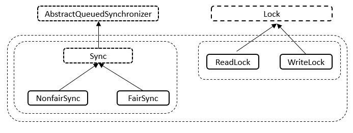
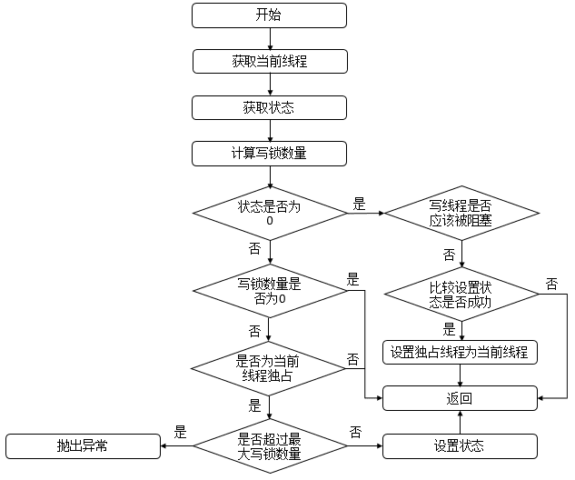
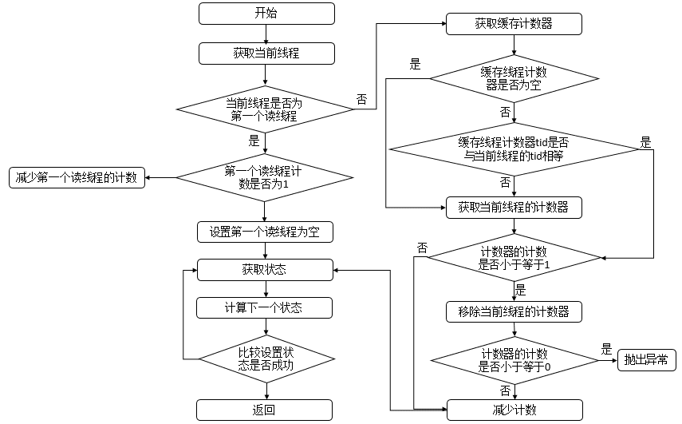

# ReentrantReadWriteLock

## 一、前言

### 1.1 参考文章

- [JUC锁: ReentrantReadWriteLock详解](https://pdai.tech/md/java/thread/java-thread-x-lock-ReentrantReadWriteLock.html)
- [[ReentrantReadWriteLock读写锁详解]](https://www.cnblogs.com/xiaoxi/p/9140541.html)

- [深入理解Java并发读写锁ReentrantReadWriteLock](https://javabetter.cn/thread/ReentrantReadWriteLock.html)


## 二、详解

### 2.1 读写锁使用示例

```java
package com.example.JUC.Locks.ReentrantReadWriteLock;

import java.util.concurrent.locks.ReentrantReadWriteLock;

/**
 * @author banana
 * @create 2024-10-01 20:12
 */
public class ReentrantReadWriteLockest {

    public static void main(String[] args) {
        // 创建共享资源
        SharedResource sharedResource = new SharedResource();


        // 读线程
        new Thread("【读线程】"){
          public void run() {
              String val = sharedResource.readData();
              System.out.println(Thread.currentThread().getName() + "执行读操作读到的值" + val);
          }
        }.start();


        // 写线程
        new Thread("【写线程】"){
            public void run() {
                sharedResource.writeData("12345");
            }
        }.start();


    }
}

/**
 * 共享资源类
 */
class SharedResource {

    // 定义一个读写锁
    private final ReentrantReadWriteLock lock = new ReentrantReadWriteLock();

    // 数据
    private String data;

    // 读取数据方法(加锁)
    public String readData() {
        lock.readLock().lock();  // 获取读锁
        try {
            System.out.println(Thread.currentThread().getName() + "执行读操作前……");
            Thread.sleep(10000);
            return data;           // 读取数据
        } catch (InterruptedException e) {
            throw new RuntimeException(e);
        } finally {
            lock.readLock().unlock(); // 确保释放读锁
            System.out.println(Thread.currentThread().getName() + "执行读操作后……");
        }
    }

    // 写数据方法(加锁)
    public void writeData(String newData) {
        lock.writeLock().lock();   // 获取写锁
        try {
            System.out.println(Thread.currentThread().getName() + "执行写操作前……");
            Thread.sleep(10000);
            this.data = newData;    // 写入数据
        } catch (InterruptedException e) {
            throw new RuntimeException(e);
        } finally {
            lock.writeLock().unlock(); // 确保释放写锁
            System.out.println(Thread.currentThread().getName() + "执行写操作后……");
        }
    }

}

```


### 2.2 结构说明

ReentrantReadWriteLock类实现ReadWriteLock接口（定义了获取读锁和写锁的规范）和Serializable（表示可以进行序列化）

```java
public class ReentrantReadWriteLock
        implements ReadWriteLock, java.io.Serializable
```

ReadWriteLock接口中声明了两个方法，用来子类实现获取读锁和写锁的规范，如下所示

```java
public interface ReadWriteLock {
    /**
     * Returns the lock used for reading.
     * 返回用于读取的锁
     * @return the lock used for reading
     */
    Lock readLock();

    /**
     * Returns the lock used for writing.
     * 返回用于写入的锁
     * @return the lock used for writing
     */
    Lock writeLock();
}
```

其中共有五个内部类，分别是Sync、NonfairSync、FairSync、ReadLock、WriteLock，结构如下所示



内部类Sync继承AQS，内部类NonfairSync和FairSync继承Sync，内部类ReadLock和WriteLock实现了Lock接口。


### 2.3 源码分析

#### 1.Sync内部类

##### Sync源码

```java
// Sync抽象类继承自AQS抽象类，Sync类提供了对ReentrantReadWriteLock的支持
abstract static class Sync extends AbstractQueuedSynchronizer {
    // 序列化id
    private static final long serialVersionUID = 6317671515068378041L;

    /*
     * Read vs write count extraction constants and functions.
     * Lock state is logically divided into two unsigned shorts:
     * The lower one representing the exclusive (writer) lock hold count,
     * and the upper the shared (reader) hold count.
     *
     * 读写计数提取常量和函数。
     * 锁状态在逻辑上分为两个unsigned short:
     * 较低的一个表示独占(写)锁保持计数
     * 上层是共享(读)保持计数。
     */
	
    // 表示锁状态的整型值中分隔读锁和写锁的计数，共享（读）锁的计数会被左移 16 位存储
    // 高16位为读锁，低16位为写锁
    static final int SHARED_SHIFT   = 16;
    // 读锁单位，其值为 1 左移 16 位，表示每个共享（读）锁的单元大小
    static final int SHARED_UNIT    = (1 << SHARED_SHIFT);
    // 读锁最大数量
    static final int MAX_COUNT      = (1 << SHARED_SHIFT) - 1;
    // 写锁最大数量，掩码用于提取独占（写）锁的计数
    static final int EXCLUSIVE_MASK = (1 << SHARED_SHIFT) - 1;

    /** Returns the number of shared holds represented in count  */
    // 返回共享持有的数量
    static int sharedCount(int c)    { return c >>> SHARED_SHIFT; }
    /** Returns the number of exclusive holds represented in count  */
    // 返回独占保存的个数
    static int exclusiveCount(int c) { return c & EXCLUSIVE_MASK; }

    
    /**
     * A counter for per-thread read hold counts.
     * Maintained as a ThreadLocal; cached in cachedHoldCounter
     * 每个线程读取保持计数的计数器
     * 作为ThreadLocal维护;缓存在cachedHoldCounter中
     */
    static final class HoldCounter {
        // 读线程重入的次数
        int count = 0;
        // Use id, not reference, to avoid garbage retention
        // 示该线程的tid字段的值，该字段可以用来唯一标识一个线程
        final long tid = getThreadId(Thread.currentThread());
    }

    /**
     * ThreadLocal subclass. Easiest to explicitly define for sake
     * of deserialization mechanics.
     * 本地线程计数器
     */
    static final class ThreadLocalHoldCounter
        extends ThreadLocal<HoldCounter> {
        // 重写初始化方法，在没有进行set的情况下，获取的都是该HoldCounter值
        // ThreadLocalHoldCounter重写了ThreadLocal的initialValue方法，ThreadLocal类可以将线程与对象相关联。在没有进行set的情况下，get到的均是initialValue方法里面生成的那个HolderCounter对象。l
        public HoldCounter initialValue() {
            return new HoldCounter();
        }
    }

    /**
     * The number of reentrant read locks held by current thread.
     * Initialized only in constructor and readObject.
     * Removed whenever a thread's read hold count drops to 0.
     * 当前线程持有的可重入读锁的数量。
     * 只在构造函数和readObject中初始化
     * 当线程的读保持计数下降到0时删除
     */
    private transient ThreadLocalHoldCounter readHolds;

    /**
     * 缓存的计数器
     *
     * The hold count of the last thread to successfully acquire
     * readLock. This saves ThreadLocal lookup in the common case
     * where the next thread to release is the last one to
     * acquire. This is non-volatile since it is just used
     * as a heuristic, and would be great for threads to cache.
     *
     * 最后一个成功获得readLock的线程的持有数
     * 在下一个要释放的线程是最后一个要获取的线程的常见情况下，这节省了ThreadLocal查找
     * 这是非易失性的，因为它只是用作启发式的，对于线程进行缓存非常有用。
     * 
     * <p>Can outlive the Thread for which it is caching the read
     * hold count, but avoids garbage retention by not retaining a
     * reference to the Thread.
     * 可以比它正在为其缓存读保持计数的线程更长寿，但通过不保留对线程的引用来避免垃圾保留。
     * 
     * <p>Accessed via a benign data race; relies on the memory
     * model's final field and out-of-thin-air guarantees.
     * 通过良性数据竞争访问的;依赖于内存模型的最终字段和out- thin-air保证。
     */
    private transient HoldCounter cachedHoldCounter;

    /**
     * 第一个读线程
     *
     * firstReader is the first thread to have acquired the read lock.
     * firstReaderHoldCount is firstReader's hold count.
     *
     * firstReader是第一个获得读锁的线程。
     * firstReaderHoldCount是firstReader的保持计数。
     *
     * <p>More precisely, firstReader is the unique thread that last
     * changed the shared count from 0 to 1, and has not released the
     * read lock since then; null if there is no such thread.
     * 更准确地说，firstReader是唯一一个最后将共享计数从0更改为1的线程，并且从那时起没有释放读锁;如果没有这样的线程，则为空。
     *
     * <p>Cannot cause garbage retention unless the thread terminated
     * without relinquishing its read locks, since tryReleaseShared
     * sets it to null.
     * 不会导致垃圾保留，除非线程在没有放弃读锁的情况下终止，因为tryreleaseshashared将其设置为null。
     *
     * <p>Accessed via a benign data race; relies on the memory
     * model's out-of-thin-air guarantees for references.
     * 通过良性数据竞争访问的;依赖于内存模型对引用的out-of-thin-air保证。
     *
     * <p>This allows tracking of read holds for uncontended read
     * locks to be very cheap.
     * 这使得跟踪非争用读锁的读保持非常便宜。
     */
    private transient Thread firstReader = null;
    private transient int firstReaderHoldCount;

    // Sync构造函数
    Sync() {
        // 本地线程计数器初始化
        readHolds = new ThreadLocalHoldCounter();
        // 设置AQS的状态（确保readhold的可见性）
        setState(getState()); // ensures visibility of readHolds
    }

    /*
     * Acquires and releases use the same code for fair and
     * nonfair locks, but differ in whether/how they allow barging
     * when queues are non-empty.
     * 对于公平锁和非公平锁，acquire和release使用相同的代码，但在队列非空时是否/如何允许闯入方面有所不同。
     */

    /**
     * Returns true if the current thread, when trying to acquire
     * the read lock, and otherwise eligible to do so, should block
     * because of policy for overtaking other waiting threads.
     * 如果当前线程在尝试获取读锁时，并且有资格这样做，由于超过其他等待线程的策略而阻塞，则返回true
     */
    abstract boolean readerShouldBlock();

    /**
     * Returns true if the current thread, when trying to acquire
     * the write lock, and otherwise eligible to do so, should block
     * because of policy for overtaking other waiting threads.
     * 如果当前线程在尝试获取写锁时，并且有资格这样做，由于超过其他等待线程的策略而阻塞，则返回true
     */
    abstract boolean writerShouldBlock();

    /*
     * Note that tryRelease and tryAcquire can be called by
     * Conditions. So it is possible that their arguments contain
     * both read and write holds that are all released during a
     * condition wait and re-established in tryAcquire.
     */

    protected final boolean tryRelease(int releases) {
        if (!isHeldExclusively())
            throw new IllegalMonitorStateException();
        int nextc = getState() - releases;
        boolean free = exclusiveCount(nextc) == 0;
        if (free)
            setExclusiveOwnerThread(null);
        setState(nextc);
        return free;
    }

    protected final boolean tryAcquire(int acquires) {
        /*
         * Walkthrough:
         * 1. If read count nonzero or write count nonzero
         *    and owner is a different thread, fail.
         * 2. If count would saturate, fail. (This can only
         *    happen if count is already nonzero.)
         * 3. Otherwise, this thread is eligible for lock if
         *    it is either a reentrant acquire or
         *    queue policy allows it. If so, update state
         *    and set owner.
         */
        Thread current = Thread.currentThread();
        int c = getState();
        int w = exclusiveCount(c);
        if (c != 0) {
            // (Note: if c != 0 and w == 0 then shared count != 0)
            if (w == 0 || current != getExclusiveOwnerThread())
                return false;
            if (w + exclusiveCount(acquires) > MAX_COUNT)
                throw new Error("Maximum lock count exceeded");
            // Reentrant acquire
            setState(c + acquires);
            return true;
        }
        if (writerShouldBlock() ||
            !compareAndSetState(c, c + acquires))
            return false;
        setExclusiveOwnerThread(current);
        return true;
    }

    protected final boolean tryReleaseShared(int unused) {
        Thread current = Thread.currentThread();
        if (firstReader == current) {
            // assert firstReaderHoldCount > 0;
            if (firstReaderHoldCount == 1)
                firstReader = null;
            else
                firstReaderHoldCount--;
        } else {
            HoldCounter rh = cachedHoldCounter;
            if (rh == null || rh.tid != getThreadId(current))
                rh = readHolds.get();
            int count = rh.count;
            if (count <= 1) {
                readHolds.remove();
                if (count <= 0)
                    throw unmatchedUnlockException();
            }
            --rh.count;
        }
        for (;;) {
            int c = getState();
            int nextc = c - SHARED_UNIT;
            if (compareAndSetState(c, nextc))
                // Releasing the read lock has no effect on readers,
                // but it may allow waiting writers to proceed if
                // both read and write locks are now free.
                return nextc == 0;
        }
    }

    private IllegalMonitorStateException unmatchedUnlockException() {
        return new IllegalMonitorStateException(
            "attempt to unlock read lock, not locked by current thread");
    }

    protected final int tryAcquireShared(int unused) {
        /*
         * Walkthrough:
         * 1. If write lock held by another thread, fail.
         * 2. Otherwise, this thread is eligible for
         *    lock wrt state, so ask if it should block
         *    because of queue policy. If not, try
         *    to grant by CASing state and updating count.
         *    Note that step does not check for reentrant
         *    acquires, which is postponed to full version
         *    to avoid having to check hold count in
         *    the more typical non-reentrant case.
         * 3. If step 2 fails either because thread
         *    apparently not eligible or CAS fails or count
         *    saturated, chain to version with full retry loop.
         */
        Thread current = Thread.currentThread();
        int c = getState();
        if (exclusiveCount(c) != 0 &&
            getExclusiveOwnerThread() != current)
            return -1;
        int r = sharedCount(c);
        if (!readerShouldBlock() &&
            r < MAX_COUNT &&
            compareAndSetState(c, c + SHARED_UNIT)) {
            if (r == 0) {
                firstReader = current;
                firstReaderHoldCount = 1;
            } else if (firstReader == current) {
                firstReaderHoldCount++;
            } else {
                HoldCounter rh = cachedHoldCounter;
                if (rh == null || rh.tid != getThreadId(current))
                    cachedHoldCounter = rh = readHolds.get();
                else if (rh.count == 0)
                    readHolds.set(rh);
                rh.count++;
            }
            return 1;
        }
        return fullTryAcquireShared(current);
    }

    /**
     * Full version of acquire for reads, that handles CAS misses
     * and reentrant reads not dealt with in tryAcquireShared.
     */
    final int fullTryAcquireShared(Thread current) {
        /*
         * This code is in part redundant with that in
         * tryAcquireShared but is simpler overall by not
         * complicating tryAcquireShared with interactions between
         * retries and lazily reading hold counts.
         */
        HoldCounter rh = null;
        for (;;) {
            int c = getState();
            if (exclusiveCount(c) != 0) {
                if (getExclusiveOwnerThread() != current)
                    return -1;
                // else we hold the exclusive lock; blocking here
                // would cause deadlock.
            } else if (readerShouldBlock()) {
                // Make sure we're not acquiring read lock reentrantly
                if (firstReader == current) {
                    // assert firstReaderHoldCount > 0;
                } else {
                    if (rh == null) {
                        rh = cachedHoldCounter;
                        if (rh == null || rh.tid != getThreadId(current)) {
                            rh = readHolds.get();
                            if (rh.count == 0)
                                readHolds.remove();
                        }
                    }
                    if (rh.count == 0)
                        return -1;
                }
            }
            if (sharedCount(c) == MAX_COUNT)
                throw new Error("Maximum lock count exceeded");
            if (compareAndSetState(c, c + SHARED_UNIT)) {
                if (sharedCount(c) == 0) {
                    firstReader = current;
                    firstReaderHoldCount = 1;
                } else if (firstReader == current) {
                    firstReaderHoldCount++;
                } else {
                    if (rh == null)
                        rh = cachedHoldCounter;
                    if (rh == null || rh.tid != getThreadId(current))
                        rh = readHolds.get();
                    else if (rh.count == 0)
                        readHolds.set(rh);
                    rh.count++;
                    cachedHoldCounter = rh; // cache for release
                }
                return 1;
            }
        }
    }

    /**
     * Performs tryLock for write, enabling barging in both modes.
     * This is identical in effect to tryAcquire except for lack
     * of calls to writerShouldBlock.
     */
    final boolean tryWriteLock() {
        Thread current = Thread.currentThread();
        int c = getState();
        if (c != 0) {
            int w = exclusiveCount(c);
            if (w == 0 || current != getExclusiveOwnerThread())
                return false;
            if (w == MAX_COUNT)
                throw new Error("Maximum lock count exceeded");
        }
        if (!compareAndSetState(c, c + 1))
            return false;
        setExclusiveOwnerThread(current);
        return true;
    }

    /**
     * Performs tryLock for read, enabling barging in both modes.
     * This is identical in effect to tryAcquireShared except for
     * lack of calls to readerShouldBlock.
     */
    final boolean tryReadLock() {
        Thread current = Thread.currentThread();
        for (;;) {
            int c = getState();
            if (exclusiveCount(c) != 0 &&
                getExclusiveOwnerThread() != current)
                return false;
            int r = sharedCount(c);
            if (r == MAX_COUNT)
                throw new Error("Maximum lock count exceeded");
            if (compareAndSetState(c, c + SHARED_UNIT)) {
                if (r == 0) {
                    firstReader = current;
                    firstReaderHoldCount = 1;
                } else if (firstReader == current) {
                    firstReaderHoldCount++;
                } else {
                    HoldCounter rh = cachedHoldCounter;
                    if (rh == null || rh.tid != getThreadId(current))
                        cachedHoldCounter = rh = readHolds.get();
                    else if (rh.count == 0)
                        readHolds.set(rh);
                    rh.count++;
                }
                return true;
            }
        }
    }

    protected final boolean isHeldExclusively() {
        // While we must in general read state before owner,
        // we don't need to do so to check if current thread is owner
        return getExclusiveOwnerThread() == Thread.currentThread();
    }

    // Methods relayed to outer class

    final ConditionObject newCondition() {
        return new ConditionObject();
    }

    final Thread getOwner() {
        // Must read state before owner to ensure memory consistency
        return ((exclusiveCount(getState()) == 0) ?
                null :
                getExclusiveOwnerThread());
    }

    final int getReadLockCount() {
        return sharedCount(getState());
    }

    final boolean isWriteLocked() {
        return exclusiveCount(getState()) != 0;
    }

    final int getWriteHoldCount() {
        return isHeldExclusively() ? exclusiveCount(getState()) : 0;
    }

    final int getReadHoldCount() {
        if (getReadLockCount() == 0)
            return 0;

        Thread current = Thread.currentThread();
        if (firstReader == current)
            return firstReaderHoldCount;

        HoldCounter rh = cachedHoldCounter;
        if (rh != null && rh.tid == getThreadId(current))
            return rh.count;

        int count = readHolds.get().count;
        if (count == 0) readHolds.remove();
        return count;
    }

    /**
     * Reconstitutes the instance from a stream (that is, deserializes it).
     */
    private void readObject(java.io.ObjectInputStream s)
        throws java.io.IOException, ClassNotFoundException {
        s.defaultReadObject();
        readHolds = new ThreadLocalHoldCounter();
        setState(0); // reset to unlocked state
    }

    final int getCount() { return getState(); }
}
```

##### 两个内部类：HoldCounter和ThreadLocalHoldCounter

```java
/**
 * A counter for per-thread read hold counts.
 * Maintained as a ThreadLocal; cached in cachedHoldCounter
 * 每个线程读取保持计数的计数器
 * 作为ThreadLocal维护;缓存在cachedHoldCounter中
 */
static final class HoldCounter {
    // 读线程重入的次数
    int count = 0;
    // Use id, not reference, to avoid garbage retention
    // 示该线程的tid字段的值，该字段可以用来唯一标识一个线程
    final long tid = getThreadId(Thread.currentThread());
}

/**
 * ThreadLocal subclass. Easiest to explicitly define for sake
 * of deserialization mechanics.
 * 本地线程计数器
 */
static final class ThreadLocalHoldCounter
    extends ThreadLocal<HoldCounter> {
    // 重写初始化方法，在没有进行set的情况下，获取的都是该HoldCounter值
    // ThreadLocalHoldCounter重写了ThreadLocal的initialValue方法，ThreadLocal类可以将线程与对象相关联。在没有进行set的情况下，get到的均是initialValue方法里面生成的那个HolderCounter对象。l
    public HoldCounter initialValue() {
        return new HoldCounter();
    }
}
```

##### 类Sync的属性

```java
// 序列化id
private static final long serialVersionUID = 6317671515068378041L;

/*
 * Read vs write count extraction constants and functions.
 * Lock state is logically divided into two unsigned shorts:
 * The lower one representing the exclusive (writer) lock hold count,
 * and the upper the shared (reader) hold count.
 *
 * 读写计数提取常量和函数。
 * 锁状态在逻辑上分为两个unsigned short:
 * 较低的一个表示独占(写)锁保持计数
 * 上层是共享(读)保持计数。
 */

// 表示锁状态的整型值中分隔读锁和写锁的计数，共享（读）锁的计数会被左移 16 位存储
// 高16位为读锁，低16位为写锁
static final int SHARED_SHIFT   = 16;
// 读锁单位，其值为 1 左移 16 位，表示每个共享（读）锁的单元大小
static final int SHARED_UNIT    = (1 << SHARED_SHIFT);
// 读锁最大数量
static final int MAX_COUNT      = (1 << SHARED_SHIFT) - 1;
// 写锁最大数量，掩码用于提取独占（写）锁的计数
static final int EXCLUSIVE_MASK = (1 << SHARED_SHIFT) - 1;

/**
 * The number of reentrant read locks held by current thread.
 * Initialized only in constructor and readObject.
 * Removed whenever a thread's read hold count drops to 0.
 * 当前线程持有的可重入读锁的数量。
 * 只在构造函数和readObject中初始化
 * 当线程的读保持计数下降到0时删除
 */
private transient ThreadLocalHoldCounter readHolds;

/**
 * 缓存的计数器
 *
 * The hold count of the last thread to successfully acquire
 * readLock. This saves ThreadLocal lookup in the common case
 * where the next thread to release is the last one to
 * acquire. This is non-volatile since it is just used
 * as a heuristic, and would be great for threads to cache.
 *
 * 最后一个成功获得readLock的线程的持有数
 * 在下一个要释放的线程是最后一个要获取的线程的常见情况下，这节省了ThreadLocal查找
 * 这是非易失性的，因为它只是用作启发式的，对于线程进行缓存非常有用。
 * 
 * <p>Can outlive the Thread for which it is caching the read
 * hold count, but avoids garbage retention by not retaining a
 * reference to the Thread.
 * 可以比它正在为其缓存读保持计数的线程更长寿，但通过不保留对线程的引用来避免垃圾保留。
 * 
 * <p>Accessed via a benign data race; relies on the memory
 * model's final field and out-of-thin-air guarantees.
 * 通过良性数据竞争访问的;依赖于内存模型的最终字段和out- thin-air保证。
 */
private transient HoldCounter cachedHoldCounter;

/**
 * 第一个读线程
 *
 * firstReader is the first thread to have acquired the read lock.
 * firstReaderHoldCount is firstReader's hold count.
 *
 * firstReader是第一个获得读锁的线程。
 * firstReaderHoldCount是firstReader的保持计数。
 *
 * <p>More precisely, firstReader is the unique thread that last
 * changed the shared count from 0 to 1, and has not released the
 * read lock since then; null if there is no such thread.
 * 更准确地说，firstReader是唯一一个最后将共享计数从0更改为1的线程，并且从那时起没有释放读锁;如果没有这样的线程，则为空。
 *
 * <p>Cannot cause garbage retention unless the thread terminated
 * without relinquishing its read locks, since tryReleaseShared
 * sets it to null.
 * 不会导致垃圾保留，除非线程在没有放弃读锁的情况下终止，因为tryreleaseshashared将其设置为null。
 *
 * <p>Accessed via a benign data race; relies on the memory
 * model's out-of-thin-air guarantees for references.
 * 通过良性数据竞争访问的;依赖于内存模型对引用的out-of-thin-air保证。
 *
 * <p>This allows tracking of read holds for uncontended read
 * locks to be very cheap.
 * 这使得跟踪非争用读锁的读保持非常便宜。
 */
private transient Thread firstReader = null;
private transient int firstReaderHoldCount;
```

##### 类Sync的构造函数

```java
// Sync构造函数
Sync() {
    // 本地线程计数器初始化
    readHolds = new ThreadLocalHoldCounter();
    // 设置AQS的状态（确保readhold的可见性）
    setState(getState()); // ensures visibility of readHolds
}
```

##### 类Sync的函数

ReentrantReadWriteLock对象的操作绝大多数都转发至Sync对象进行处理

- sharedCount

```java
/** Returns the number of shared holds represented in count  */
// 返回共享持有的数量
static int sharedCount(int c)    { 
	// 将state右移16位，就可以得到读锁的线程数量，因为state的高16位表示读锁，对应的低十六位表示写锁数量
    return c >>> SHARED_SHIFT; 
}
```

- exclusiveCount

```java
/** Returns the number of exclusive holds represented in count  */
// 返回独占保存的个数
static int exclusiveCount(int c) { 
    // 将状态state和(2^16 - 1)做与运算，其等效于将state模上2^16。写锁数量由state的低十六位表示
    return c & EXCLUSIVE_MASK; 
}
```

- readerShouldBlock

```java
/**
 * Returns true if the current thread, when trying to acquire
 * the read lock, and otherwise eligible to do so, should block
 * because of policy for overtaking other waiting threads.
 * 如果当前线程在尝试获取读锁时，并且有资格这样做，由于超过其他等待线程的策略而阻塞，则返回true
 */
abstract boolean readerShouldBlock();
```

- writerShouldBlock

```java
/**
 * Returns true if the current thread, when trying to acquire
 * the write lock, and otherwise eligible to do so, should block
 * because of policy for overtaking other waiting threads.
 * 如果当前线程在尝试获取写锁时，并且有资格这样做，由于超过其他等待线程的策略而阻塞，则返回true
 */
abstract boolean writerShouldBlock();
```


- tryRelease

此函数用于释放写锁资源，首先会判断该线程是否为独占线程，若不为独占线程，则抛出异常，否则，计算释放资源后的写锁的数量，若为0，表示成功释放，资源不将被占用，否则，表示资源还被占用。其函数流程图如下


```java
/*
 * Note that tryRelease and tryAcquire can be called by
 * Conditions. So it is possible that their arguments contain
 * both read and write holds that are all released during a
 * condition wait and re-established in tryAcquire.
 *
 * 注意，tryRelease和tryAcquire可以通过条件调用。因此，它们的参数可能同时包含读持有和写持有，这些持有都在条件等待期间释放，并在tryAcquire中重新建立。
 */

protected final boolean tryRelease(int releases) {
    // 详情1 判断是否为独占线程
    if (!isHeldExclusively())
        throw new IllegalMonitorStateException();
    // 计算释放资源后的写锁的数量
    int nextc = getState() - releases;
    // 是否释放成功
    boolean free = exclusiveCount(nextc) == 0;
    // 释放成功，设置独占线程为空
    if (free)
        setExclusiveOwnerThread(null);
    setState(nextc);
    return free;
}
```

1.判断是否为独占线程

```java
protected final boolean isHeldExclusively() {
    // While we must in general read state before owner,
    // we don't need to do so to check if current thread is owner
    // 当前独占线程是否等于当前线程
    return getExclusiveOwnerThread() == Thread.currentThread();
}
```


- tryAquire

函数用于获取写锁，首先会获取state，判断是否为0，若为0，表示此时没有读锁线程，再判断写线程是否应该被阻塞，而在非公平策略下总是不会被阻塞，在公平策略下会进行判断(判断同步队列中是否有等待时间更长的线程，若存在，则需要被阻塞，否则，无需阻塞)，之后在设置状态state，然后返回true。若state不为0，则表示此时存在读锁或写锁线程，若写锁线程数量为0或者当前线程为独占锁线程，则返回false，表示不成功，否则，判断写锁线程的重入次数是否大于了最大值，若是，则抛出异常，否则，设置状态state，返回true，表示成功。其函数流程图如下



```java
protected final boolean tryAcquire(int acquires) {
    /*
     * Walkthrough:
     * 1. If read count nonzero or write count nonzero
     *    and owner is a different thread, fail.
     * 2. If count would saturate, fail. (This can only
     *    happen if count is already nonzero.)
     * 3. Otherwise, this thread is eligible for lock if
     *    it is either a reentrant acquire or
     *    queue policy allows it. If so, update state
     *    and set owner.
     */
    // 获取当前线程
    Thread current = Thread.currentThread();
    // 获取状态
    int c = getState();
    // 1.写线程数量
    int w = exclusiveCount(c);
    if (c != 0) {
        // 写线程数量为0或者当前线程没有占有独占资源 △
        // (Note: if c != 0 and w == 0 then shared count != 0)
        if (w == 0 || current != getExclusiveOwnerThread())
            // 获取锁失败
            return false;
        // 判断是否超过最高写线程数量
        if (w + exclusiveCount(acquires) > MAX_COUNT)
            throw new Error("Maximum lock count exceeded");
        // Reentrant acquire
        // 设置AQS状态
        setState(c + acquires);
        // 获取锁成功
        return true;
    }
    // 写线程是否应该被阻塞
    if (writerShouldBlock() ||
        !compareAndSetState(c, c + acquires))
        return false;
    // 设置独占线程
    setExclusiveOwnerThread(current);
    return true;
}
```

1.写线程数量

```java
 static int exclusiveCount(int c) { return c & EXCLUSIVE_MASK; }
```


- tryReleaseShared

此函数表示读锁线程释放锁。首先判断当前线程是否为第一个读线程firstReader，若是，则判断第一个读线程占有的资源数firstReaderHoldCount是否为1，若是，则设置第一个读线程firstReader为空，否则，将第一个读线程占有的资源数firstReaderHoldCount减1；若当前线程不是第一个读线程，那么首先会获取缓存计数器(上一个读锁线程对应的计数器 )，若计数器为空或者tid不等于当前线程的tid值，则获取当前线程的计数器，如果计数器的计数count小于等于1，则移除当前线程对应的计数器，如果计数器的计数count小于等于0，则抛出异常，之后再减少计数即可。无论何种情况，都会进入无限循环，该循环可以确保成功设置状态state。其流程图如下




```java
protected final boolean tryReleaseShared(int unused) {
    // 获取当前线程
    Thread current = Thread.currentThread();
    // 当前线程为第一个获得读锁的线程
    if (firstReader == current) {
        // assert firstReaderHoldCount > 0;
        // 读线程占用的资源数为1，则直接置为null
        if (firstReaderHoldCount == 1)
            firstReader = null;
        else
            // 减少读锁占用的资源
            firstReaderHoldCount--;
    } else {
        // 当前线程不为第一个读线程
        // 获取缓存的计数器（上一个读锁线程对应的计数器）
        HoldCounter rh = cachedHoldCounter;
        // 计数器为空或者计数器的tid不为当前正在运行的线程的tid
        if (rh == null || rh.tid != getThreadId(current))
             // 1.获取当前线程对应的计数器
            rh = readHolds.get();
        // 获取计数
        int count = rh.count;
        // 计数小于等于1
        if (count <= 1) {
            // 移除
            readHolds.remove();
            // 计数小于等于0，抛出异常
            if (count <= 0)
                throw unmatchedUnlockException();
        }
        // 减少计数
        --rh.count;
    }
    // 无限循环
    for (;;) {
         // 获取状态
        int c = getState();
        // 读锁的数量
        int nextc = c - SHARED_UNIT;
        // 通过cas操作比较并进行设置
        if (compareAndSetState(c, nextc))
            // Releasing the read lock has no effect on readers,
            // but it may allow waiting writers to proceed if
            // both read and write locks are now free.
            // 释放释放读锁，如果释放了为true
            return nextc == 0;
    }
}

// 异常信息
private IllegalMonitorStateException unmatchedUnlockException() {
    return new IllegalMonitorStateException(
        "attempt to unlock read lock, not locked by current thread");
}
```

1.获取当前线程对应的计数器

readHolds的类型如下所示

```java
static final class ThreadLocalHoldCounter
    extends ThreadLocal<HoldCounter> {
    // 重写父类ThreadLocal的initialValue方法
    public HoldCounter initialValue() {
        return new HoldCounter();
    }
}
```

其调用的get方法是ThreadLocal的get方法

```java
public T get() {
    // 获取当前线程
    Thread t = Thread.currentThread();
    // 获取当前线程的ThreadLocal.ThreadLocalMap对象
    // ThreadLocalMap 用于存储该线程中的所有 ThreadLocal 实例的值
    ThreadLocalMap map = getMap(t);
    // 当前线程有存储 ThreadLocal 变量
    if (map != null) {
        // 从 ThreadLocalMap 中找到与当前 ThreadLocal 实例（this）相对应的条目（Entry）
        ThreadLocalMap.Entry e = map.getEntry(this);
        if (e != null) {
            // 用于抑制编译器关于类型安全的警告,因为 e.value 的类型是原始类型（raw type），因此需要进行类型转换
            @SuppressWarnings("unchecked")
            // 将条目的值强制转换为泛型类型 T，并将其赋值给 result
            T result = (T)e.value;
            // return result; 将获取到的值返回
            return result;
        }
    }
    // 如果map为空，调用setInitialValue方法
    return setInitialValue();
}
```

其setInitialValue方法如下所示

```java
private T setInitialValue() {
    // 调用的是readHolds的重写方法initialValue
    T value = initialValue();
    // 获取当前线程
    Thread t = Thread.currentThread();
    // 获取当前线程的ThreadLocal.ThreadLocalMap对象
    ThreadLocalMap map = getMap(t);
    if (map != null)
        // 重新设置ThreadLocal.ThreadLocalMap对象
        map.set(this, value);
    else
        // 创建ThreadLocal.ThreadLocalMap对象
        createMap(t, value);
    // 返回当前值
    return value;
}
```


- tryAcquireShared

此函数表示读锁线程获取读锁。首先判断写锁是否为0并且当前线程不占有独占锁，直接返回；否则，判断读线程是否需要被阻塞并且读锁数量是否小于最大值并且比较设置状态成功，若当前没有读锁，则设置第一个读线程firstReader和firstReaderHoldCount；若当前线程线程为第一个读线程，则增加firstReaderHoldCount；否则，将设置当前线程对应的HoldCounter对象的值。流程图如下


```java
// 共享模式下获取资源
protected final int tryAcquireShared(int unused) {
    /*
     * Walkthrough:
     * 1. If write lock held by another thread, fail.
     * 2. Otherwise, this thread is eligible for
     *    lock wrt state, so ask if it should block
     *    because of queue policy. If not, try
     *    to grant by CASing state and updating count.
     *    Note that step does not check for reentrant
     *    acquires, which is postponed to full version
     *    to avoid having to check hold count in
     *    the more typical non-reentrant case.
     * 3. If step 2 fails either because thread
     *    apparently not eligible or CAS fails or count
     *    saturated, chain to version with full retry loop.
     */
    // 获取当前线程
    Thread current = Thread.currentThread();
    // 获取状态
    int c = getState();、
    // 写线程数不为0并且占有资源的不是当前线程
    if (exclusiveCount(c) != 0 &&
        getExclusiveOwnerThread() != current)
        return -1;
    // 获取读锁数量
    int r = sharedCount(c);
    // 读线程是否应该被阻塞、并且小于最大值、并且比较设置成功
    if (!readerShouldBlock() &&
        r < MAX_COUNT &&
        compareAndSetState(c, c + SHARED_UNIT)) {
        // 读锁数量为0
        if (r == 0) {
            // 设置第一个读线程
            firstReader = current;
            // 读线程占用的资源数为1
            firstReaderHoldCount = 1;
        } else if (firstReader == current) {
            // 当前线程为第一个读线程
            // 占用资源数加1
            firstReaderHoldCount++;
        } else {
            // 读锁数量不为0并且不为当前线程
            // 获取计数器
            HoldCounter rh = cachedHoldCounter;
            // 计数器为空或者计数器的tid不为当前正在运行的线程的tid
            if (rh == null || rh.tid != getThreadId(current))
                // 获取当前线程对应的计数器
                cachedHoldCounter = rh = readHolds.get();
            else if (rh.count == 0)
                // 计数为0
                // 设置
                readHolds.set(rh);
            rh.count++;
        }
        return 1;
    }
    return fullTryAcquireShared(current);
}
```


- fullTryAcquireShared

在tryAcquireShared函数中，如果下列三个条件不满足(读线程是否应该被阻塞、小于最大值、比较设置成功)则会进行fullTryAcquireShared函数中，它用来保证相关操作可以成功。其逻辑与tryAcquireShared逻辑类似，不再累赘。

```java
/**
 * Full version of acquire for reads, that handles CAS misses
 * and reentrant reads not dealt with in tryAcquireShared.
 * 读取获取的完整版本，它可以处理在tryacquirered中没有处理的CAS缺失和可重入读取。
 */
final int fullTryAcquireShared(Thread current) {
    /*
     * This code is in part redundant with that in
     * tryAcquireShared but is simpler overall by not
     * complicating tryAcquireShared with interactions between
     * retries and lazily reading hold counts.
     */
    HoldCounter rh = null;
    // 无限循环
    for (;;) {
        // 获取状态
        int c = getState();
        // 写线程数量不为0
        if (exclusiveCount(c) != 0) {
            // 不为当前线程
            if (getExclusiveOwnerThread() != current)
                return -1;
            // else we hold the exclusive lock; blocking here
            // would cause deadlock.
        } else if (readerShouldBlock()) {
            // 写线程数量为0并且读线程被阻塞
            // Make sure we're not acquiring read lock reentrantly
            if (firstReader == current) {
                // 当前线程为第一个读线程
                // assert firstReaderHoldCount > 0;
            } else {
                // 当前线程不为第一个读线程
                // 计数器不为空
                if (rh == null) {
                    rh = cachedHoldCounter;
                    // 计数器为空或者计数器的tid不为当前正在运行的线程的tid
                    if (rh == null || rh.tid != getThreadId(current)) {
                        rh = readHolds.get();
                        if (rh.count == 0)
                            readHolds.remove();
                    }
                }
                if (rh.count == 0)
                    return -1;
            }
        }
        if (sharedCount(c) == MAX_COUNT)
            // 读锁数量为最大值，抛出异常
            throw new Error("Maximum lock count exceeded");
        if (compareAndSetState(c, c + SHARED_UNIT)) {
            // 比较并且设置成功
            if (sharedCount(c) == 0) {
                // 读线程数量为0
                // 设置第一个读线程
                firstReader = current;
                firstReaderHoldCount = 1;
            } else if (firstReader == current) {
                firstReaderHoldCount++;
            } else {
                if (rh == null)
                    rh = cachedHoldCounter;
                if (rh == null || rh.tid != getThreadId(current))
                    rh = readHolds.get();
                else if (rh.count == 0)
                    readHolds.set(rh);
                rh.count++;
                cachedHoldCounter = rh; // cache for release
            }
            return 1;
        }
    }
}
```


- tryWriteLock

```java
/**
 * Performs tryLock for write, enabling barging in both modes.
 * This is identical in effect to tryAcquire except for lack
 * of calls to writerShouldBlock.
 *
 * 对写操作执行tryLock，从而在两种模式下都可以进行分页。
 * 除了缺少对writerShouldBlock的调用之外，这在效果上与tryAcquire相同。
 */
final boolean tryWriteLock() {
    Thread current = Thread.currentThread();
    int c = getState();
    if (c != 0) {
        int w = exclusiveCount(c);
        if (w == 0 || current != getExclusiveOwnerThread())
            return false;
        if (w == MAX_COUNT)
            throw new Error("Maximum lock count exceeded");
    }
    if (!compareAndSetState(c, c + 1))
        return false;
    setExclusiveOwnerThread(current);
    return true;
}
```


- tryReadLock

```java
/**
 * Performs tryLock for read, enabling barging in both modes.
 * This is identical in effect to tryAcquireShared except for
 * lack of calls to readerShouldBlock.
 *
 * 对read执行tryLock，从而在两种模式下都可以进行分页
 * 这在效果上与tryacquirered相同，除了缺少对readerShouldBlock的调用
 */
final boolean tryReadLock() {
    Thread current = Thread.currentThread();
    for (;;) {
        int c = getState();
        if (exclusiveCount(c) != 0 &&
            getExclusiveOwnerThread() != current)
            return false;
        int r = sharedCount(c);
        if (r == MAX_COUNT)
            throw new Error("Maximum lock count exceeded");
        if (compareAndSetState(c, c + SHARED_UNIT)) {
            if (r == 0) {
                firstReader = current;
                firstReaderHoldCount = 1;
            } else if (firstReader == current) {
                firstReaderHoldCount++;
            } else {
                HoldCounter rh = cachedHoldCounter;
                if (rh == null || rh.tid != getThreadId(current))
                    cachedHoldCounter = rh = readHolds.get();
                else if (rh.count == 0)
                    readHolds.set(rh);
                rh.count++;
            }
            return true;
        }
    }
}
```


- isHeldExclusively

```
protected final boolean isHeldExclusively() {
    // While we must in general read state before owner,
    // we don't need to do so to check if current thread is owner
    return getExclusiveOwnerThread() == Thread.currentThread();
}
```


- newCondition

```
// Methods relayed to outer class

final ConditionObject newCondition() {
    return new ConditionObject();
}

```


- getOwner

```
final Thread getOwner() {
    // Must read state before owner to ensure memory consistency
    return ((exclusiveCount(getState()) == 0) ?
            null :
            getExclusiveOwnerThread());
}
```


- getReadLockCount

```
final int getReadLockCount() {
        return sharedCount(getState());
}
```


- isWriteLocked

```
final boolean isWriteLocked() {
        return exclusiveCount(getState()) != 0;
}
```


- getWriteHoldCount

```
final int getWriteHoldCount() {
    return isHeldExclusively() ? exclusiveCount(getState()) : 0;
}
```


- getReadHoldCount

```java
final int getReadHoldCount() {
    if (getReadLockCount() == 0)
        return 0;

    Thread current = Thread.currentThread();
    if (firstReader == current)
        return firstReaderHoldCount;

    HoldCounter rh = cachedHoldCounter;
    if (rh != null && rh.tid == getThreadId(current))
        return rh.count;

    int count = readHolds.get().count;
    if (count == 0) readHolds.remove();
    return count;
}

```


- readObject

```java
private void readObject(java.io.ObjectInputStream s)
    throws java.io.IOException, ClassNotFoundException {
    s.defaultReadObject();
    readHolds = new ThreadLocalHoldCounter();
    setState(0); // reset to unlocked state
}
```


- getCount

```java
final int getCount() { return getState(); }
```


#### 2.ReentrantReadWriteLock类

**类属性**

```java
public class ReentrantReadWriteLock
        implements ReadWriteLock, java.io.Serializable {
    // 版本序列号    
    private static final long serialVersionUID = -6992448646407690164L;    
    // 读锁
    private final ReentrantReadWriteLock.ReadLock readerLock;
    // 写锁
    private final ReentrantReadWriteLock.WriteLock writerLock;
    // 同步队列
    final Sync sync;
    
    private static final sun.misc.Unsafe UNSAFE;
    // 线程ID的偏移地址
    private static final long TID_OFFSET;
    static {
        try {
            UNSAFE = sun.misc.Unsafe.getUnsafe();
            Class<?> tk = Thread.class;
            // 获取线程的tid字段的内存地址
            TID_OFFSET = UNSAFE.objectFieldOffset
                (tk.getDeclaredField("tid"));
        } catch (Exception e) {
            throw new Error(e);
        }
    }
}

```

**构造器**

```java
public ReentrantReadWriteLock() {
    this(false);
}

public ReentrantReadWriteLock(boolean fair) {
    // 公平策略或者是非公平策略
    sync = fair ? new FairSync() : new NonfairSync();
    // 读锁
    readerLock = new ReadLock(this);
    // 写锁
    writerLock = new WriteLock(this);
}
```

**函数**

……


#### 3.ReadLock

```java
/**
 * The lock returned by method {@link ReentrantReadWriteLock#readLock}.
 */
public static class ReadLock implements Lock, java.io.Serializable {
    private static final long serialVersionUID = -5992448646407690164L;
    private final Sync sync;

    /**
     * Constructor for use by subclasses
     *
     * @param lock the outer lock object
     * @throws NullPointerException if the lock is null
     */
    protected ReadLock(ReentrantReadWriteLock lock) {
        sync = lock.sync;
    }

    /**
     * Acquires the read lock.
     *
     * <p>Acquires the read lock if the write lock is not held by
     * another thread and returns immediately.
     *
     * <p>If the write lock is held by another thread then
     * the current thread becomes disabled for thread scheduling
     * purposes and lies dormant until the read lock has been acquired.
     */
    public void lock() {
        sync.acquireShared(1);
    }

    /**
     * Acquires the read lock unless the current thread is
     * {@linkplain Thread#interrupt interrupted}.
     *
     * <p>Acquires the read lock if the write lock is not held
     * by another thread and returns immediately.
     *
     * <p>If the write lock is held by another thread then the
     * current thread becomes disabled for thread scheduling
     * purposes and lies dormant until one of two things happens:
     *
     * <ul>
     *
     * <li>The read lock is acquired by the current thread; or
     *
     * <li>Some other thread {@linkplain Thread#interrupt interrupts}
     * the current thread.
     *
     * </ul>
     *
     * <p>If the current thread:
     *
     * <ul>
     *
     * <li>has its interrupted status set on entry to this method; or
     *
     * <li>is {@linkplain Thread#interrupt interrupted} while
     * acquiring the read lock,
     *
     * </ul>
     *
     * then {@link InterruptedException} is thrown and the current
     * thread's interrupted status is cleared.
     *
     * <p>In this implementation, as this method is an explicit
     * interruption point, preference is given to responding to
     * the interrupt over normal or reentrant acquisition of the
     * lock.
     *
     * @throws InterruptedException if the current thread is interrupted
     */
    public void lockInterruptibly() throws InterruptedException {
        sync.acquireSharedInterruptibly(1);
    }

    /**
     * Acquires the read lock only if the write lock is not held by
     * another thread at the time of invocation.
     *
     * <p>Acquires the read lock if the write lock is not held by
     * another thread and returns immediately with the value
     * {@code true}. Even when this lock has been set to use a
     * fair ordering policy, a call to {@code tryLock()}
     * <em>will</em> immediately acquire the read lock if it is
     * available, whether or not other threads are currently
     * waiting for the read lock.  This &quot;barging&quot; behavior
     * can be useful in certain circumstances, even though it
     * breaks fairness. If you want to honor the fairness setting
     * for this lock, then use {@link #tryLock(long, TimeUnit)
     * tryLock(0, TimeUnit.SECONDS) } which is almost equivalent
     * (it also detects interruption).
     *
     * <p>If the write lock is held by another thread then
     * this method will return immediately with the value
     * {@code false}.
     *
     * @return {@code true} if the read lock was acquired
     */
    public boolean tryLock() {
        return sync.tryReadLock();
    }

    /**
     * Acquires the read lock if the write lock is not held by
     * another thread within the given waiting time and the
     * current thread has not been {@linkplain Thread#interrupt
     * interrupted}.
     *
     * <p>Acquires the read lock if the write lock is not held by
     * another thread and returns immediately with the value
     * {@code true}. If this lock has been set to use a fair
     * ordering policy then an available lock <em>will not</em> be
     * acquired if any other threads are waiting for the
     * lock. This is in contrast to the {@link #tryLock()}
     * method. If you want a timed {@code tryLock} that does
     * permit barging on a fair lock then combine the timed and
     * un-timed forms together:
     *
     *  <pre> {@code
     * if (lock.tryLock() ||
     *     lock.tryLock(timeout, unit)) {
     *   ...
     * }}</pre>
     *
     * <p>If the write lock is held by another thread then the
     * current thread becomes disabled for thread scheduling
     * purposes and lies dormant until one of three things happens:
     *
     * <ul>
     *
     * <li>The read lock is acquired by the current thread; or
     *
     * <li>Some other thread {@linkplain Thread#interrupt interrupts}
     * the current thread; or
     *
     * <li>The specified waiting time elapses.
     *
     * </ul>
     *
     * <p>If the read lock is acquired then the value {@code true} is
     * returned.
     *
     * <p>If the current thread:
     *
     * <ul>
     *
     * <li>has its interrupted status set on entry to this method; or
     *
     * <li>is {@linkplain Thread#interrupt interrupted} while
     * acquiring the read lock,
     *
     * </ul> then {@link InterruptedException} is thrown and the
     * current thread's interrupted status is cleared.
     *
     * <p>If the specified waiting time elapses then the value
     * {@code false} is returned.  If the time is less than or
     * equal to zero, the method will not wait at all.
     *
     * <p>In this implementation, as this method is an explicit
     * interruption point, preference is given to responding to
     * the interrupt over normal or reentrant acquisition of the
     * lock, and over reporting the elapse of the waiting time.
     *
     * @param timeout the time to wait for the read lock
     * @param unit the time unit of the timeout argument
     * @return {@code true} if the read lock was acquired
     * @throws InterruptedException if the current thread is interrupted
     * @throws NullPointerException if the time unit is null
     */
    public boolean tryLock(long timeout, TimeUnit unit)
            throws InterruptedException {
        return sync.tryAcquireSharedNanos(1, unit.toNanos(timeout));
    }

    /**
     * Attempts to release this lock.
     *
     * <p>If the number of readers is now zero then the lock
     * is made available for write lock attempts.
     */
    public void unlock() {
        sync.releaseShared(1);
    }

    /**
     * Throws {@code UnsupportedOperationException} because
     * {@code ReadLocks} do not support conditions.
     *
     * @throws UnsupportedOperationException always
     */
    public Condition newCondition() {
        throw new UnsupportedOperationException();
    }

    /**
     * Returns a string identifying this lock, as well as its lock state.
     * The state, in brackets, includes the String {@code "Read locks ="}
     * followed by the number of held read locks.
     *
     * @return a string identifying this lock, as well as its lock state
     */
    public String toString() {
        int r = sync.getReadLockCount();
        return super.toString() +
            "[Read locks = " + r + "]";
    }
}
```


#### 4.WriteLock

```java
/**
 * The lock returned by method {@link ReentrantReadWriteLock#writeLock}.
 */
public static class WriteLock implements Lock, java.io.Serializable {
    private static final long serialVersionUID = -4992448646407690164L;
    private final Sync sync;

    /**
     * Constructor for use by subclasses
     *
     * @param lock the outer lock object
     * @throws NullPointerException if the lock is null
     */
    protected WriteLock(ReentrantReadWriteLock lock) {
        sync = lock.sync;
    }

    /**
     * Acquires the write lock.
     *
     * <p>Acquires the write lock if neither the read nor write lock
     * are held by another thread
     * and returns immediately, setting the write lock hold count to
     * one.
     *
     * <p>If the current thread already holds the write lock then the
     * hold count is incremented by one and the method returns
     * immediately.
     *
     * <p>If the lock is held by another thread then the current
     * thread becomes disabled for thread scheduling purposes and
     * lies dormant until the write lock has been acquired, at which
     * time the write lock hold count is set to one.
     */
    public void lock() {
        sync.acquire(1);
    }

    /**
     * Acquires the write lock unless the current thread is
     * {@linkplain Thread#interrupt interrupted}.
     *
     * <p>Acquires the write lock if neither the read nor write lock
     * are held by another thread
     * and returns immediately, setting the write lock hold count to
     * one.
     *
     * <p>If the current thread already holds this lock then the
     * hold count is incremented by one and the method returns
     * immediately.
     *
     * <p>If the lock is held by another thread then the current
     * thread becomes disabled for thread scheduling purposes and
     * lies dormant until one of two things happens:
     *
     * <ul>
     *
     * <li>The write lock is acquired by the current thread; or
     *
     * <li>Some other thread {@linkplain Thread#interrupt interrupts}
     * the current thread.
     *
     * </ul>
     *
     * <p>If the write lock is acquired by the current thread then the
     * lock hold count is set to one.
     *
     * <p>If the current thread:
     *
     * <ul>
     *
     * <li>has its interrupted status set on entry to this method;
     * or
     *
     * <li>is {@linkplain Thread#interrupt interrupted} while
     * acquiring the write lock,
     *
     * </ul>
     *
     * then {@link InterruptedException} is thrown and the current
     * thread's interrupted status is cleared.
     *
     * <p>In this implementation, as this method is an explicit
     * interruption point, preference is given to responding to
     * the interrupt over normal or reentrant acquisition of the
     * lock.
     *
     * @throws InterruptedException if the current thread is interrupted
     */
    public void lockInterruptibly() throws InterruptedException {
        sync.acquireInterruptibly(1);
    }

    /**
     * Acquires the write lock only if it is not held by another thread
     * at the time of invocation.
     *
     * <p>Acquires the write lock if neither the read nor write lock
     * are held by another thread
     * and returns immediately with the value {@code true},
     * setting the write lock hold count to one. Even when this lock has
     * been set to use a fair ordering policy, a call to
     * {@code tryLock()} <em>will</em> immediately acquire the
     * lock if it is available, whether or not other threads are
     * currently waiting for the write lock.  This &quot;barging&quot;
     * behavior can be useful in certain circumstances, even
     * though it breaks fairness. If you want to honor the
     * fairness setting for this lock, then use {@link
     * #tryLock(long, TimeUnit) tryLock(0, TimeUnit.SECONDS) }
     * which is almost equivalent (it also detects interruption).
     *
     * <p>If the current thread already holds this lock then the
     * hold count is incremented by one and the method returns
     * {@code true}.
     *
     * <p>If the lock is held by another thread then this method
     * will return immediately with the value {@code false}.
     *
     * @return {@code true} if the lock was free and was acquired
     * by the current thread, or the write lock was already held
     * by the current thread; and {@code false} otherwise.
     */
    public boolean tryLock( ) {
        return sync.tryWriteLock();
    }

    /**
     * Acquires the write lock if it is not held by another thread
     * within the given waiting time and the current thread has
     * not been {@linkplain Thread#interrupt interrupted}.
     *
     * <p>Acquires the write lock if neither the read nor write lock
     * are held by another thread
     * and returns immediately with the value {@code true},
     * setting the write lock hold count to one. If this lock has been
     * set to use a fair ordering policy then an available lock
     * <em>will not</em> be acquired if any other threads are
     * waiting for the write lock. This is in contrast to the {@link
     * #tryLock()} method. If you want a timed {@code tryLock}
     * that does permit barging on a fair lock then combine the
     * timed and un-timed forms together:
     *
     *  <pre> {@code
     * if (lock.tryLock() ||
     *     lock.tryLock(timeout, unit)) {
     *   ...
     * }}</pre>
     *
     * <p>If the current thread already holds this lock then the
     * hold count is incremented by one and the method returns
     * {@code true}.
     *
     * <p>If the lock is held by another thread then the current
     * thread becomes disabled for thread scheduling purposes and
     * lies dormant until one of three things happens:
     *
     * <ul>
     *
     * <li>The write lock is acquired by the current thread; or
     *
     * <li>Some other thread {@linkplain Thread#interrupt interrupts}
     * the current thread; or
     *
     * <li>The specified waiting time elapses
     *
     * </ul>
     *
     * <p>If the write lock is acquired then the value {@code true} is
     * returned and the write lock hold count is set to one.
     *
     * <p>If the current thread:
     *
     * <ul>
     *
     * <li>has its interrupted status set on entry to this method;
     * or
     *
     * <li>is {@linkplain Thread#interrupt interrupted} while
     * acquiring the write lock,
     *
     * </ul>
     *
     * then {@link InterruptedException} is thrown and the current
     * thread's interrupted status is cleared.
     *
     * <p>If the specified waiting time elapses then the value
     * {@code false} is returned.  If the time is less than or
     * equal to zero, the method will not wait at all.
     *
     * <p>In this implementation, as this method is an explicit
     * interruption point, preference is given to responding to
     * the interrupt over normal or reentrant acquisition of the
     * lock, and over reporting the elapse of the waiting time.
     *
     * @param timeout the time to wait for the write lock
     * @param unit the time unit of the timeout argument
     *
     * @return {@code true} if the lock was free and was acquired
     * by the current thread, or the write lock was already held by the
     * current thread; and {@code false} if the waiting time
     * elapsed before the lock could be acquired.
     *
     * @throws InterruptedException if the current thread is interrupted
     * @throws NullPointerException if the time unit is null
     */
    public boolean tryLock(long timeout, TimeUnit unit)
            throws InterruptedException {
        return sync.tryAcquireNanos(1, unit.toNanos(timeout));
    }

    /**
     * Attempts to release this lock.
     *
     * <p>If the current thread is the holder of this lock then
     * the hold count is decremented. If the hold count is now
     * zero then the lock is released.  If the current thread is
     * not the holder of this lock then {@link
     * IllegalMonitorStateException} is thrown.
     *
     * @throws IllegalMonitorStateException if the current thread does not
     * hold this lock
     */
    public void unlock() {
        sync.release(1);
    }

    /**
     * Returns a {@link Condition} instance for use with this
     * {@link Lock} instance.
     * <p>The returned {@link Condition} instance supports the same
     * usages as do the {@link Object} monitor methods ({@link
     * Object#wait() wait}, {@link Object#notify notify}, and {@link
     * Object#notifyAll notifyAll}) when used with the built-in
     * monitor lock.
     *
     * <ul>
     *
     * <li>If this write lock is not held when any {@link
     * Condition} method is called then an {@link
     * IllegalMonitorStateException} is thrown.  (Read locks are
     * held independently of write locks, so are not checked or
     * affected. However it is essentially always an error to
     * invoke a condition waiting method when the current thread
     * has also acquired read locks, since other threads that
     * could unblock it will not be able to acquire the write
     * lock.)
     *
     * <li>When the condition {@linkplain Condition#await() waiting}
     * methods are called the write lock is released and, before
     * they return, the write lock is reacquired and the lock hold
     * count restored to what it was when the method was called.
     *
     * <li>If a thread is {@linkplain Thread#interrupt interrupted} while
     * waiting then the wait will terminate, an {@link
     * InterruptedException} will be thrown, and the thread's
     * interrupted status will be cleared.
     *
     * <li> Waiting threads are signalled in FIFO order.
     *
     * <li>The ordering of lock reacquisition for threads returning
     * from waiting methods is the same as for threads initially
     * acquiring the lock, which is in the default case not specified,
     * but for <em>fair</em> locks favors those threads that have been
     * waiting the longest.
     *
     * </ul>
     *
     * @return the Condition object
     */
    public Condition newCondition() {
        return sync.newCondition();
    }

    /**
     * Returns a string identifying this lock, as well as its lock
     * state.  The state, in brackets includes either the String
     * {@code "Unlocked"} or the String {@code "Locked by"}
     * followed by the {@linkplain Thread#getName name} of the owning thread.
     *
     * @return a string identifying this lock, as well as its lock state
     */
    public String toString() {
        Thread o = sync.getOwner();
        return super.toString() + ((o == null) ?
                                   "[Unlocked]" :
                                   "[Locked by thread " + o.getName() + "]");
    }

    /**
     * Queries if this write lock is held by the current thread.
     * Identical in effect to {@link
     * ReentrantReadWriteLock#isWriteLockedByCurrentThread}.
     *
     * @return {@code true} if the current thread holds this lock and
     *         {@code false} otherwise
     * @since 1.6
     */
    public boolean isHeldByCurrentThread() {
        return sync.isHeldExclusively();
    }

    /**
     * Queries the number of holds on this write lock by the current
     * thread.  A thread has a hold on a lock for each lock action
     * that is not matched by an unlock action.  Identical in effect
     * to {@link ReentrantReadWriteLock#getWriteHoldCount}.
     *
     * @return the number of holds on this lock by the current thread,
     *         or zero if this lock is not held by the current thread
     * @since 1.6
     */
    public int getHoldCount() {
        return sync.getWriteHoldCount();
    }
}
```

