## 九、资源加载器模块

### 一、前言

#### 1、概要

该模块主要实现对类加载器进行了封装，确定类加载器的使用顺序，提供了对各个类文件以及其他资源文件的扫描、获取和加载。

### 二、相关内容

#### 1、ClassLoaderWrapper

#### 2、Resources

#### 3、VFS

#### 4、ResolverUtil

### 三、测试

#### 0、测试类

Mybatis在test包下提供了很多测试类，来帮助我们学习各个模块。

通过其提供的IO测试模块，通过断点调试的方式，我们能更好地去了解其原理

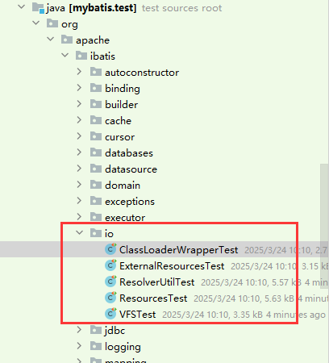

#### 1、ClassLoaderWrapperTest

##### 1.关于ClassLoaderWrapper

ClassLoaderWrapper：是ClassLoader包装器的测试模块，其通过getClassLoaders可以获取类加载器数组，使用多个 ClassLoader 加载对应的资源，直到有一成功后返回资源。支持获取资源对象的类对象、URL或者流对象（InputStream）。

##### 2.ClassLoaderWrapperTest的类成员变量：

```java
// 类加载器包装器对象
private ClassLoaderWrapper wrapper;
// 类加载器
private ClassLoader loader;
// 获取不到的资源
private static final String RESOURCE_NOT_FOUND = "some_resource_that_does_not_exist.properties";
// 获取不到的class对象的全限定名称
private static final String CLASS_NOT_FOUND = "some.random.class.that.does.not.Exist";
// 能够获取到的class对象的全限定名称
private static final String CLASS_FOUND = "java.lang.Object";
```

##### 3.ClassLoaderWrapperTest的BeforeEach方法（在所有测试类执行之前执行）：

完成对类加载器包装器对象的初始化以及类加载器的初始化，类加载loader默认为当前类的类加载器：AppClassLoader	

```java
@BeforeEach
void beforeClassLoaderWrapperTest() {
    wrapper = new ClassLoaderWrapper();
    loader = getClass().getClassLoader();
}
```

##### 4.classForName测试

测试类加载器包装器对象的classForName方法，通过类的全限定名称加载类，其传入的类全限定名称是Object类，即CLASS_FOUND = "java.lang.Object"

```java
@Test
void classForName() throws ClassNotFoundException {
    assertNotNull(wrapper.classForName(CLASS_FOUND));
}
```

其最终调用的是ClassLoaderWrapper对象的双参classForName方法，并且通过getClassLoaders获取类加载器数组，这里参数参入的类加载器为null，即没有自定义的类加载器

```java
public Class<?> classForName(String name) throws ClassNotFoundException {
    return classForName(name, getClassLoaders(null));
}
```

通过遍历类加载器数组，然后通过各个类加载器，调用Class的forName方法，获取对应类（找到第一个就返回）

```java
Class<?> classForName(String name, ClassLoader[] classLoader) throws ClassNotFoundException {
    // 遍历 ClassLoader 数组
    for (ClassLoader cl : classLoader) {

        if (null != cl) {

            try {
                // 获得类
                return Class.forName(name, true, cl);

            } catch (ClassNotFoundException e) {
                // we'll ignore this until all classloaders fail to locate the class
            }

        }

    }
```

可以看下返回结果就是对应的Object类对象

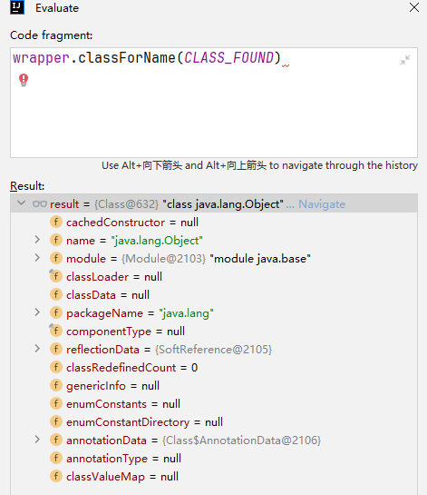

##### 5.classForNameNotFound测试

测试类加载器包装器对象的classForName方法无法根据提供的类全限定名称获取对应类的情况。这里使用的类全限定名称就是成员变量字符串CLASS_NOT_FOUND = "some.random.class.that.does.not.Exist"

可以通过classForName方法看出，其如果找不到结果就会抛出异常

```java
Class<?> classForName(String name, ClassLoader[] classLoader) throws ClassNotFoundException {
    // 遍历 ClassLoader 数组
    for (ClassLoader cl : classLoader) {

        if (null != cl) {

            try {
                // 获得类
                return Class.forName(name, true, cl);

            } catch (ClassNotFoundException e) {
                // we'll ignore this until all classloaders fail to locate the class
            }

        }
    }

    // 获取不到 抛出异常
    throw new ClassNotFoundException("Cannot find class: " + name);

}

```

实际运行结果

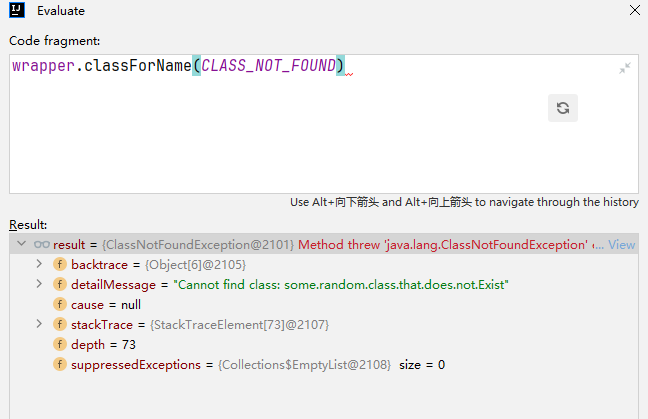

##### 6.classForNameWithClassLoader测试

即根据自己指定的类加载器（其参数存入的类加载）去获取对应的类

```java
@Test
void classForNameWithClassLoader() throws ClassNotFoundException {
    assertNotNull(wrapper.classForName(CLASS_FOUND, loader));
}
```

可以看到其调用getClassLoaders获取类加载器数组的结果如下图所示，第一个就是我们传入的类加载器，之后在根据CLASS_FOUND去获取并加载类对象的时候，就会先试用我们传入的类加载器去获取

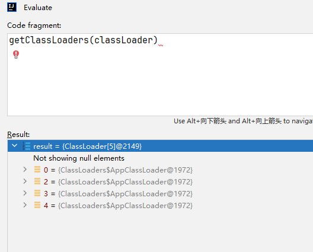

##### 7.getResourceAsURL测试

```java
@Test
void getResourceAsURL() {
    assertNotNull(wrapper.getResourceAsURL(JPETSTORE_PROPERTIES));
}
```

其获取类路径即URL = JPETSTORE_PROPERTIES = "org/apache/ibatis/databases/jpetstore/jpetstore-hsqldb.properties"的资源信息

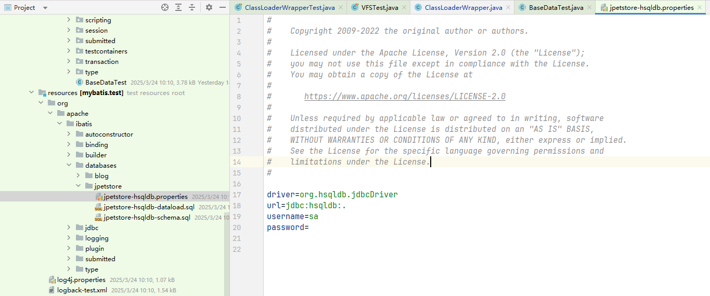

其调用的是双参的getResourceAsURL方法，并且不指定自定义的类加载器

```java
public URL getResourceAsURL(String resource) {
    return getResourceAsURL(resource, getClassLoaders(null));
}
```

在该双参方法中，遍历类加载器数组，然后调用类加载器的getResource方法，获取对应的url（会尝试前缀不带/和带/的去获取资源的url）

```java
URL getResourceAsURL(String resource, ClassLoader[] classLoader) {

    // 声明出参
    URL url;

    // 遍历类加载器对象数组
    for (ClassLoader cl : classLoader) {

        if (null != cl) {

            // 获得 URL ，不带 /
            // look for the resource as passed in...
            url = cl.getResource(resource);

            // 获得 URL ，带 /
            // ...but some class loaders want this leading "/", so we'll add it
            // and try again if we didn't find the resource
            if (null == url) {
                url = cl.getResource("/" + resource);
            }

            // 成功获得到，返回url
            // "It's always in the last place I look for it!"
            // ... because only an idiot would keep looking for it after finding it, so stop looking already.
            if (null != url) {
                return url;
            }

        }

    }

    // didn't find it anywhere.
    return null;

}
```

我们也可以通过类加载的getResource方法看出，其是从上往下加载的，即如果有父类加载器，就先通过父类加载器去进行加载获取

```java
public URL getResource(String name) {
    Objects.requireNonNull(name);
    URL url;
    if (parent != null) {
        url = parent.getResource(name);
    } else {
        url = BootLoader.findResource(name);
    }
    if (url == null) {
        url = findResource(name);
    }
    return url;
}
```

运行结果如下图所示

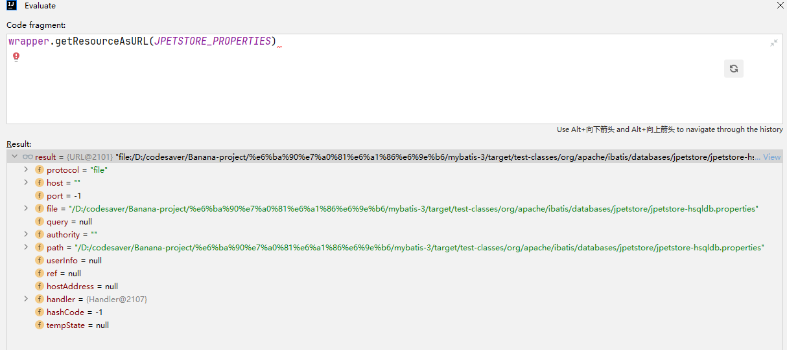


##### 8.getResourceAsURLNotFound测试

相较于7，就是找不存在的资源：RESOURCE_NOT_FOUND = "some_resource_that_does_not_exist.properties"

```java
@Test
void getResourceAsURLNotFound() {
    assertNull(wrapper.getResourceAsURL(RESOURCE_NOT_FOUND));
}
```

其结果返回null

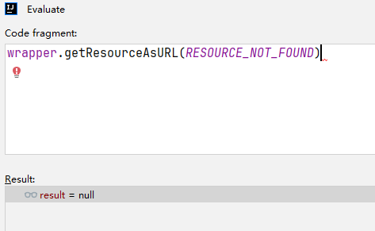


##### 9.getResourceAsURLWithClassLoader

相较于7，增加自定义类加载器去获取资源

```java
@Test
void getResourceAsURLWithClassLoader() {
    assertNotNull(wrapper.getResourceAsURL(JPETSTORE_PROPERTIES, loader));
}
```


##### 10.getResourceAsStream、getResourceAsStreamNotFound、getResourceAsStreamWithClassLoader测试

```java
@Test
void getResourceAsStream() {
    assertNotNull(wrapper.getResourceAsStream(JPETSTORE_PROPERTIES));
}

@Test
void getResourceAsStreamNotFound() {
    assertNull(wrapper.getResourceAsStream(RESOURCE_NOT_FOUND));
}

@Test
void getResourceAsStreamWithClassLoader() {
    assertNotNull(wrapper.getResourceAsStream(JPETSTORE_PROPERTIES, loader));
}
```

和getResourceAsURL、getResourceAsURLNotFound、getResourceAsURLWithClassLoader类似，只不过在返回的时候，转换为的流对象，其转换实在类加载器ClassLoader的getResourceAsStream方法中完成的

```java
public InputStream getResourceAsStream(String name) {
    Objects.requireNonNull(name);
    URL url = getResource(name);
    try {
        return url != null ? url.openStream() : null;
    } catch (IOException e) {
        return null;
    }
}
```

#### 2、ExternalResourcesTest

已被@Deprecated

#### 3、ResolverUtilTest

解析器工具类，用于获得指定目录**符合条件**的类们（通过ResolverUtil中的Test实现类，完成条件的匹配）。

> ```
> /**
>  * 解析器工具类，用于获得指定目录符合条件的类
>  * <p>
>  * ResolverUtil is used to locate classes that are available in the/a class path and meet arbitrary conditions. The two
>  * most common conditions are that a class implements/extends another class, or that is it annotated with a specific
>  * annotation. However, through the use of the {@link Test} class it is possible to search using arbitrary conditions.
>  * ResolverUtil用于定位/a类路径中可用且满足任意条件的类。最常见的两种情况是一个类实现/扩展另一个类，或者用特定的注释对其进行注释。但是，
>  * 通过使用{@link Test}类，可以使用任意条件进行搜索。
>  * <p>
>  * A ClassLoader is used to locate all locations (directories and jar files) in the class path that contain classes
>  * within certain packages, and then to load those classes and check them. By default the ClassLoader returned by
>  * {@code Thread.currentThread().getContextClassLoader()} is used, but this can be overridden by calling
>  * {@link #setClassLoader(ClassLoader)} prior to invoking any of the {@code find()} methods.
>  * ClassLoader用于定位类路径中包含某些包中的类的所有位置（目录和jar文件），然后加载这些类并检查它们。默认情况下，
>  * 使用{@code Thread.currentThread(). getcontextclassloader()}返回的ClassLoader，
>  * 但在调用任何{@code find()}方法之前，可以通过调用{@link #setClassLoader(ClassLoader)}来覆盖它。
>  * <p>
>  * General searches are initiated by calling the {@link #find(Test, String)} and supplying a package name and a Test
>  * instance. This will cause the named package <b>and all sub-packages</b> to be scanned for classes that meet the test.
>  * There are also utility methods for the common use cases of scanning multiple packages for extensions of particular
>  * classes, or classes annotated with a specific annotation.
>  * 一般的搜索是通过调用{@link #find(Test, String)}并提供一个包名和一个Test实例来启动的。这将导致扫描命名包<b>和所有子包</b>以查找满足测试的类。
>  * 还有一些实用方法用于扫描多个包以查找特定类的扩展，或者用特定注释注释的类的常见用例。
>  * <p>
>  * The standard usage pattern for the ResolverUtil class is as follows:
>  * ResolverUtil类的标准使用模式如下：
>  *
>  * <pre>
>  * ResolverUtil&lt;ActionBean&gt; resolver = new ResolverUtil&lt;ActionBean&gt;();
>  * resolver.findImplementation(ActionBean.class, pkg1, pkg2);
>  * resolver.find(new CustomTest(), pkg1);
>  * resolver.find(new CustomTest(), pkg2);
>  * Collection&lt;ActionBean&gt; beans = resolver.getClasses();
>  * </pre>
>  *
>  * @author Tim Fennell
>  *
>  * @param <T>
>  *          the generic type
>  */
> ```

##### 1.成员变量

```java
// 当前上下文类加载器
private static ClassLoader currentContextClassLoader;

@BeforeAll
static void setUp() {
// 当前上下文类加载器默认为当前线程的上下文类加载器
currentContextClassLoader = Thread.currentThread().getContextClassLoader();
}
```

当前类加载器为AppClassLoader：

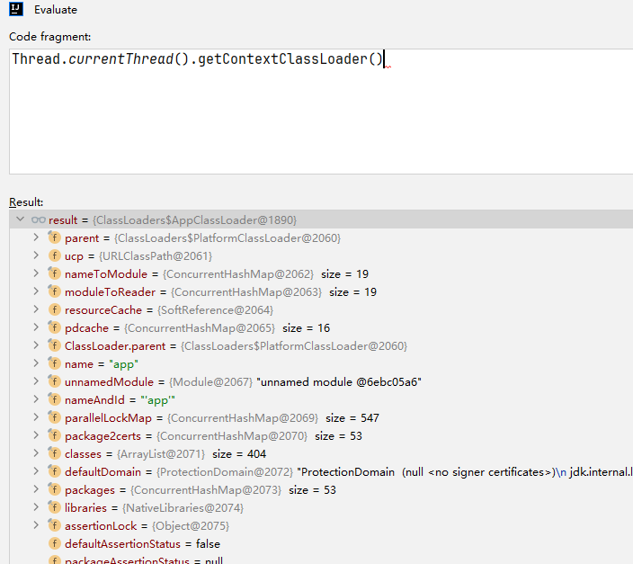

##### 2.getClasses

获取结果集

```java
@Test
void getClasses() {
    // 没有调用find前，匹配结果集的matches数量就是0
    assertEquals(0, new ResolverUtil<>().getClasses().size());
}
```


##### 3.getClassLoader、setClassLoader

```java
// 获取结果集
@Test
void getClassLoader() {
    // 当前ResolverUtil中维护类加载器就是Thread.currentThread().getContextClassLoader();
    assertEquals(new ResolverUtil<>().getClassLoader(), currentContextClassLoader);
}

// 设置结果集
@Test
void setClassLoader() {
    ResolverUtil resolverUtil = new ResolverUtil();
    AccessController.doPrivileged((PrivilegedAction<Void>) () -> {
        resolverUtil.setClassLoader(new ClassLoader() {
        });
        return null;
    });
    assertNotEquals(resolverUtil.getClassLoader(), currentContextClassLoader);
}
```


##### 4.findImplementationsWithNullPackageName、findImplementations

```java
@Test
void findImplementationsWithNullPackageName() {
    ResolverUtil<VFS> resolverUtil = new ResolverUtil<>();
    resolverUtil.findImplementations(VFS.class, (String[]) null);
    assertEquals(0, resolverUtil.getClasses().size());
}

@Test
void findImplementations() {
    // 创建ResolverUtil对象，并指定泛型，即要查找的结果集类型是VFS的子类对象或接口实现类
    ResolverUtil<VFS> resolverUtil = new ResolverUtil<>();
    // 即在org.apache.ibatis.io包下查找VFS的子类或接口实现类
    resolverUtil.findImplementations(VFS.class, "org.apache.ibatis.io");
    Set<Class<? extends VFS>> classSets = resolverUtil.getClasses();
    // 匹配到的结果集内容如下所示：
    // org.apache.ibatis.io.VFS
    // org.apache.ibatis.io.DefaultVFS
    // org.apache.ibatis.io.JBoss6VFS
    assertEquals(3, classSets.size()); // fail if add a new VFS implementation in this package!!!
    classSets.forEach(c -> assertTrue(VFS.class.isAssignableFrom(c)));
}
```

findImplementationsWithNullPackageName和findImplementations都用于在目标包下查找其子类或实现的接口类，区别在查找实现接口的时候没有带上查找目标的包名，如果报名时空的，直接返回原对象，什么都不做

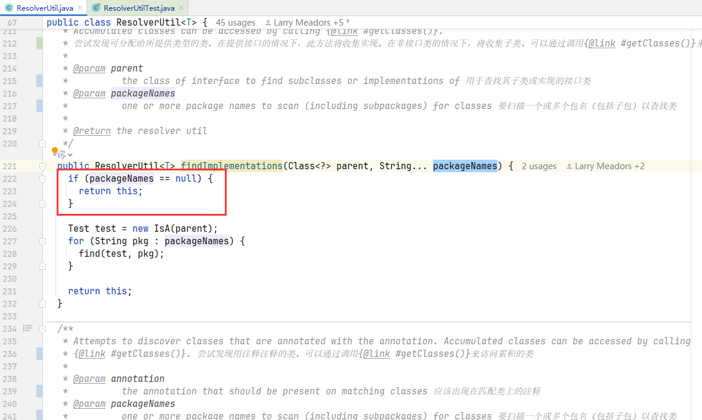

findImplementations方法如下所示，将需要查找的类封装为Test对象，遍历需要查找的包，调用ResourcesUtil的find方法

```java
public ResolverUtil<T> findImplementations(Class<?> parent, String... packageNames) {
    if (packageNames == null) {
        return this;
    }

    // 将需要查找的对象封装为Test对象
    Test test = new IsA(parent);
    for (String pkg : packageNames) { // 便利需要查找的包名
        // 调用find方法进行匹配结果
        find(test, pkg);
    }

    return this;
}
```

ResourcesUtil的find方法如下所示

```java
public ResolverUtil<T> find(Test test, String packageName) {
    // 获得包的路径
    String path = getPackagePath(packageName);

    try {
        // 通过VFS的getInstance获取其单例实例
        // 然后调用list获取路径下的所有文件
        List<String> children = VFS.getInstance().list(path);
        for (String child : children) {
            if (child.endsWith(".class")) { // 结尾是.class的字节码文件
                // 如果匹配，则添加到结果集
                addIfMatching(test, child);
            }
        }
    } catch (IOException ioe) {
        log.error("Could not read package: " + packageName, ioe);
    }

    return this;
}
```

其调用VFS的list方法，其中names.addAll(list(url, path));的list调用的是其实现类DefaultVFS的list方法

```java
public List<String> list(String path) throws IOException {
    List<String> names = new ArrayList<>();
    // 通过类加载器的getResources方法，获取path资源的URL，并进行遍历
    for (URL url : getResources(path)) {
        // 调用list方法，这里默认实现类是DefaultVFS，递归列出所有的资源
        // 将资源加入到names中
        names.addAll(list(url, path));
    }
    return names;
}
```

运行结果如下所示

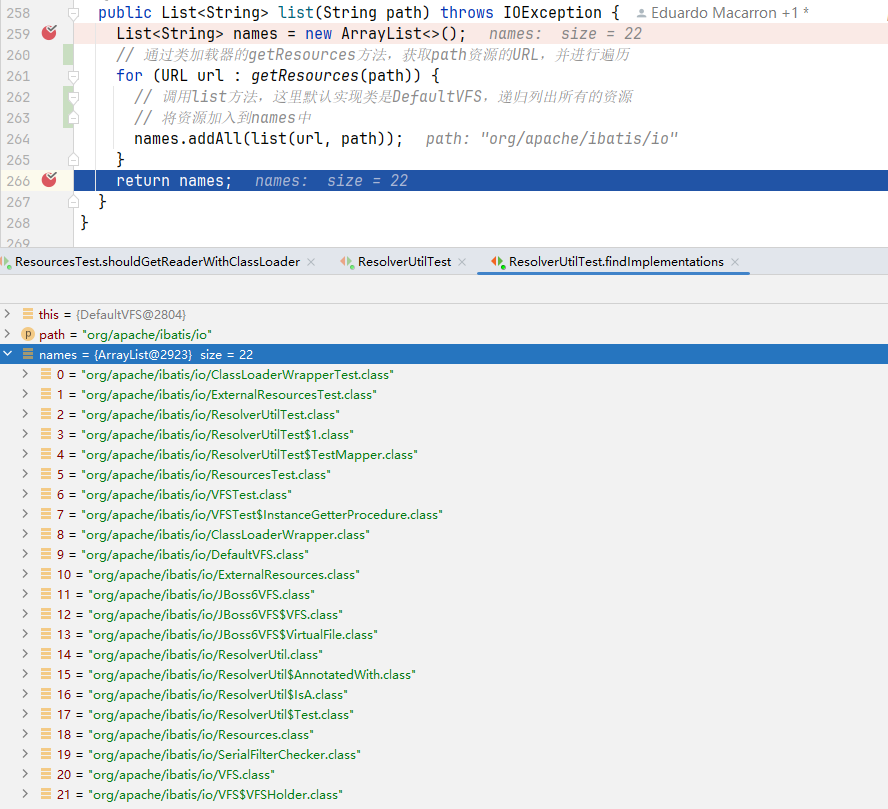

最终匹配到的对象如下所示

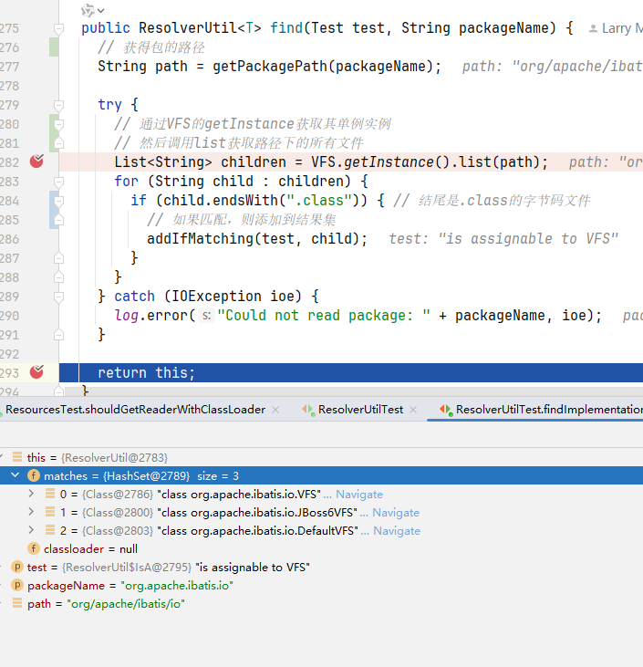


##### 5.findAnnotated

```java
@Test
void findAnnotated() {
    // 创建ResolverUtil对象，并指定泛型，即要查找的结果集类型是VFS的子类对象或接口实现类
    ResolverUtil<Object> resolverUtil = new ResolverUtil<>();
    resolverUtil.findAnnotated(CacheNamespace.class, this.getClass().getPackage().getName());
    Set<Class<?>> classSets = resolverUtil.getClasses();
    // org.apache.ibatis.io.ResolverUtilTest.TestMapper
    assertEquals(1, classSets.size());
    classSets.forEach(c -> assertNotNull(c.getAnnotation(CacheNamespace.class)));
}
```

获取指定的注解的类，区别就是其创建的匹配对象Test的实现类是AnnotatedWith，其他和findImplementations都是一样的

```java
public ResolverUtil<T> findAnnotated(Class<? extends Annotation> annotation, String... packageNames) {
    if (packageNames == null) {
        return this;
    }

    Test test = new AnnotatedWith(annotation);
    for (String pkg : packageNames) {
        find(test, pkg);
    }

    return this;
}
```


##### 6.find

```java
@Test
void find() {
    // 创建ResolverUtil对象，并指定泛型，即要查找的结果集类型是VFS的子类对象或接口实现类
    ResolverUtil<VFS> resolverUtil = new ResolverUtil<>();
    // 即在org.apache.ibatis.io包下查找VFS的子类或接口实现类
    resolverUtil.find(new ResolverUtil.IsA(VFS.class), "org.apache.ibatis.io");
    Set<Class<? extends VFS>> classSets = resolverUtil.getClasses();
    // org.apache.ibatis.io.VFS
    // org.apache.ibatis.io.DefaultVFS
    // org.apache.ibatis.io.JBoss6VFS
    assertEquals(3, classSets.size());
    classSets.forEach(c -> assertTrue(VFS.class.isAssignableFrom(c)));
}
```

本质上findImplementations和findAnnotated都是调用find方法，加上Test的实现类重写matches方法，实现资源的匹配


##### 7.getPackagePath

```java
@Test
void getPackagePath() {
    ResolverUtil resolverUtil = new ResolverUtil();
    assertNull(resolverUtil.getPackagePath(null));
    assertEquals("org/apache/ibatis/io", resolverUtil.getPackagePath("org.apache.ibatis.io"));
}
```

即getPackagePath本质上是将.替换成/，将包名转换为对应的路径

```java
/**
   * Converts a Java package name to a path that can be looked up with a call to
   * {@link ClassLoader#getResources(String)}.
   *
   * @param packageName
   *          The Java package name to convert to a path
   *
   * @return the package path
   */
protected String getPackagePath(String packageName) {
    // 如果包名为null就直接返回null
    // 如果包名是xxx.xxx.xxx的，就替换为路径格式xxx/xxx/xxx
    return packageName == null ? null : packageName.replace('.', '/');
}
```


##### 8.addIfMatching、addIfNotMatching

且仅当提供的Test对象匹配时，将所提供的完全限定类名指定的类添加到已解析类集中

```java
@Test
void addIfMatching() {
    ResolverUtil<VFS> resolverUtil = new ResolverUtil<>();
    resolverUtil.addIfMatching(new ResolverUtil.IsA(VFS.class), "org/apache/ibatis/io/DefaultVFS.class");
    resolverUtil.addIfMatching(new ResolverUtil.IsA(VFS.class), "org/apache/ibatis/io/VFS.class");
    Set<Class<? extends VFS>> classSets = resolverUtil.getClasses();
    assertEquals(2, classSets.size());
    classSets.forEach(c -> assertTrue(VFS.class.isAssignableFrom(c)));
}

@Test
void addIfNotMatching() {
    ResolverUtil<VFS> resolverUtil = new ResolverUtil<>();
    resolverUtil.addIfMatching(new ResolverUtil.IsA(VFS.class), "org/apache/ibatis/io/Xxx.class");
    assertEquals(0, resolverUtil.getClasses().size());
}


/**
   * Add the class designated by the fully qualified class name provided to the set of resolved classes if and only if
   * it is approved by the Test supplied.
   * 当且仅当提供的Test对象匹配时，将所提供的完全限定类名指定的类添加到已解析类集中。
   *
   * @param test
   *          the test used to determine if the class matches 匹配对象
   * @param fqn
   *          the fully qualified name of a class 类的完全限定名
   */
@SuppressWarnings("unchecked")
protected void addIfMatching(Test test, String fqn) {
    try {
        // 获得全类名
        String externalName = fqn.substring(0, fqn.indexOf('.')).replace('/', '.');
        // 获取默认类加载器
        ClassLoader loader = getClassLoader();
        if (log.isDebugEnabled()) {
            log.debug("Checking to see if class " + externalName + " matches criteria [" + test + "]");
        }

        // 加载类
        Class<?> type = loader.loadClass(externalName);
        // 通过Test对象matches方法判断是否匹配，匹配则加入到结果集中
        if (test.matches(type)) {
            matches.add((Class<T>) type);
        }
    } catch (Throwable t) {
        log.warn("Could not examine class '" + fqn + "'" + " due to a " + t.getClass().getName() + " with message: "
                 + t.getMessage());
    }
}
```


#### 4、ResourcesTest

Resource 工具类，本质上是基于对ClassLoaderWrapper的封装，并且提供了对资源获取结果的类型转换等方法（如转换为Reader、Properties、File对象）。

##### 1.ResourcesTest成员变量

```java
// 类加载器，默认为ResourcesTest的类加载器
private static final ClassLoader CLASS_LOADER = ResourcesTest.class.getClassLoader();
```

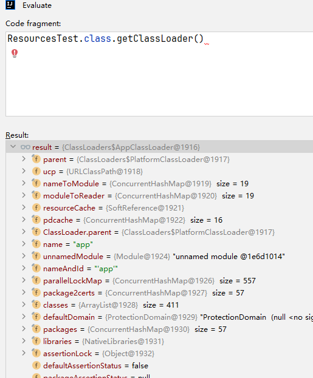

##### 2.shouldGetUrlForResource测试

```java
@Test
void shouldGetUrlForResource() throws Exception {
    URL url = Resources.getResourceURL(JPETSTORE_PROPERTIES);
    assertTrue(url.toString().endsWith("jpetstore/jpetstore-hsqldb.properties"));
}
```

shouldGetUrlForResource方法本质上就是调用classLoaderWrapper的getResourceAsURL方法。

##### 3.shouldGetUrlAsProperties、shouldGetUrlAsStream、shouldGetUrlAsReader

```java
@Test
void shouldGetUrlAsProperties() throws Exception {
    URL url = Resources.getResourceURL(CLASS_LOADER, JPETSTORE_PROPERTIES);
    Properties props = Resources.getUrlAsProperties(url.toString());
    assertNotNull(props.getProperty("driver"));
}
```

首先通过getResourceURL获取资源的URL，然后通过Resources类中的getUrlAsProperties方法将该资源转化为Properties对象

```java
public static Properties getUrlAsProperties(String urlString) throws IOException {
    Properties props = new Properties();
    try (InputStream in = getUrlAsStream(urlString)) {
        props.load(in);
    }
    return props;
}
```

运行结果如下图所示：

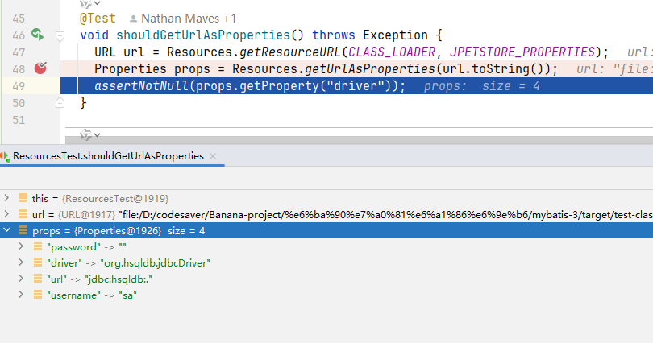

shouldGetUrlAsStream和shouldGetUrlAsReader同理，进行转换为Stream和Reader对象


##### 4.shouldGetResourceAsProperties、shouldGetResourceAsStream、shouldGetResourceAsReader

```java
@Test
void shouldGetResourceAsProperties() throws Exception {
    Properties props = Resources.getResourceAsProperties(CLASS_LOADER, JPETSTORE_PROPERTIES);
    assertNotNull(props.getProperty("driver"));
}
```

其先调用getResourceAsStream获取对应资源url的流对象，然后将其转换为Properties对象

```java
public static Properties getResourceAsProperties(ClassLoader loader, String resource) throws IOException {
    Properties props = new Properties();
    try (InputStream in = getResourceAsStream(loader, resource)) {
        props.load(in);
    }
    return props;
}
```

本质上就是调用classLoaderWrapper的getResourceAsStream方法来获取对应资源的流对象。

对于getResourceAsStream、shouldGetResourceAsReader同样也是通过getResourceAsStream获取对应资源的流对象，然后转换成对应的Stream和Reader对象。


##### 5.shouldGetResourceAsFile、shouldGetResourceAsFileWithClassloader

```java
@Test
void shouldGetResourceAsFile() throws Exception {
    File file = Resources.getResourceAsFile(JPETSTORE_PROPERTIES);
    assertTrue(file.getAbsolutePath().replace('\\', '/').endsWith("jpetstore/jpetstore-hsqldb.properties"));
}
```

其本质上是调用ClassLoaderWrapper的getResourceAsURL方法

```java
public static URL getResourceURL(ClassLoader loader, String resource) throws IOException {
    // 调用classLoaderWrapper的getResourceAsURL方法获得指定资源的 URL
    URL url = classLoaderWrapper.getResourceAsURL(resource, loader);
    if (url == null) {
        throw new IOException("Could not find resource " + resource);
    }
    return url;
}
```

获取对应资源的URL，然后并将其转换为File对象

```java
public static File getResourceAsFile(String resource) throws IOException {
    return new File(getResourceURL(resource).getFile());
}
```

shouldGetResourceAsFileWithClassloader相较于shouldGetResourceAsFile，在调用Resources的getResourceAsFile传入了自定义的类加载器。


##### 6.shouldAllowDefaultCharsetToBeSet

为Resources对象设置字符集，即修改器维护的成员变量charset

```java
@Test
void shouldAllowDefaultCharsetToBeSet() {
    Resources.setCharset(Charset.defaultCharset());
    assertEquals(Charset.defaultCharset(), Resources.getCharset());
}
```

其在获取Reader对象的时候，就需要使用到这个字符集，如Resources的getResourceAsReader方法所示

```java
public static Reader getResourceAsReader(String resource) throws IOException {
    Reader reader;
    if (charset == null) {
        reader = new InputStreamReader(getResourceAsStream(resource));
    } else {
        reader = new InputStreamReader(getResourceAsStream(resource), charset);
    }
    return reader;
}
```


##### 7.shouldAllowDefaultClassLoaderToBeSet

设置默认的类加载器

```java
@Test
void shouldAllowDefaultClassLoaderToBeSet() {
    Resources.setDefaultClassLoader(this.getClass().getClassLoader());
    assertEquals(this.getClass().getClassLoader(), Resources.getDefaultClassLoader());
}
```


##### 8.shouldGetClassForName、shouldNotFindThisClass

```java
@Test
void shouldGetClassForName() throws Exception {
    Class<?> clazz = Resources.classForName(ResourcesTest.class.getName());
    assertNotNull(clazz);
}

@Test
void shouldNotFindThisClass() {
    Assertions.assertThrows(ClassNotFoundException.class,
                            () -> Resources.classForName("some.random.class.that.does.not.Exist"));
}
```

根据类的全限定名获取对应的类对象，本质上都是调用ClassLoaderWrapper的classForName方法

```java
public static Class<?> classForName(String className) throws ClassNotFoundException {
    return classLoaderWrapper.classForName(className);
}
```


##### 9.shouldGetReader、shouldGetReaderWithClassLoader

使用不同字符集，调用Resources的getResourceAsReader获取Reader对象。

shouldGetReader和shouldGetReaderWithClassLoader的区别就是后者比前者多传入了自定义的类加载器

```java
@Test
void shouldGetReader() throws IOException {

    // save the value
    Charset charset = Resources.getCharset();

    // charset
    Resources.setCharset(Charset.forName("US-ASCII"));
    assertNotNull(Resources.getResourceAsReader(JPETSTORE_PROPERTIES));

    // no charset
    Resources.setCharset(null);
    assertNotNull(Resources.getResourceAsReader(JPETSTORE_PROPERTIES));

    // clean up
    Resources.setCharset(charset);

}

@Test
void shouldGetReaderWithClassLoader() throws IOException {

    // save the value
    Charset charset = Resources.getCharset();

    // charset
    Resources.setCharset(Charset.forName("US-ASCII"));
    assertNotNull(Resources.getResourceAsReader(getClass().getClassLoader(), JPETSTORE_PROPERTIES));

    // no charset
    Resources.setCharset(null);
    assertNotNull(Resources.getResourceAsReader(getClass().getClassLoader(), JPETSTORE_PROPERTIES));

    // clean up
    Resources.setCharset(charset);

}
```

shouldGetReader中，设置字符集和不设置字符集的打印结果如下：

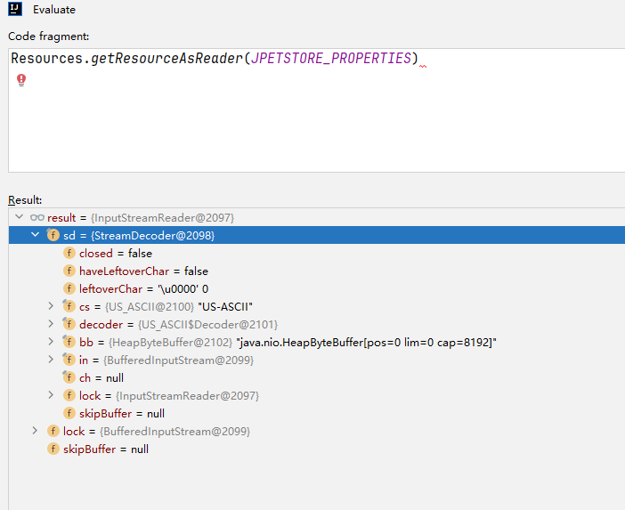

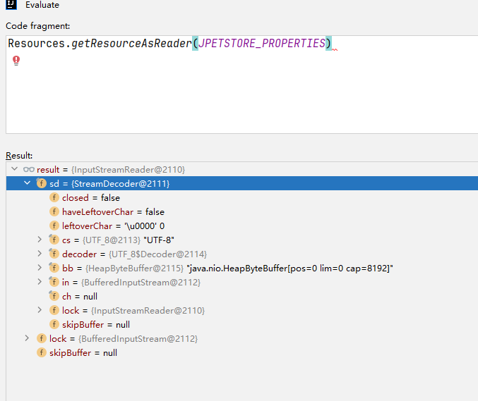


#### 5、VFSTest

其功能用于查找指定路径下的文件

##### 1. getInstanceShouldNotBeNull

其实例对象为单例，该测试类用于获取其单例对象

```java
@Test
void getInstanceShouldNotBeNull() {
    VFS vsf = VFS.getInstance();
    Assertions.assertNotNull(vsf);
}

public static VFS getInstance() {
    return VFSHolder.INSTANCE;
}

private static class VFSHolder {
    // 懒汉式，线程安全的单例
    static final VFS INSTANCE = createVFS();

    @SuppressWarnings("unchecked")
    static VFS createVFS() {
        // Try the user implementations first, then the built-ins
        // 先尝试自定义的 VFS 实现类，再尝试内置的 VFS 实现类的数组，并将他们放入数组impls中
        List<Class<? extends VFS>> impls = new ArrayList<>(USER_IMPLEMENTATIONS);
        impls.addAll(Arrays.asList((Class<? extends VFS>[]) IMPLEMENTATIONS));

        // Try each implementation class until a valid one is found
        // 创建 VFS 对象，选择第一个符合的
        VFS vfs = null;
        for (int i = 0; vfs == null || !vfs.isValid(); i++) {
            Class<? extends VFS> impl = impls.get(i);
            try {
                // 通过反射方式场创建实例
                vfs = impl.getDeclaredConstructor().newInstance();
                // 打印无效的vfs
                if (!vfs.isValid() && log.isDebugEnabled()) {
                    log.debug("VFS implementation " + impl.getName() + " is not valid in this environment.");
                }
            } catch (InstantiationException | IllegalAccessException | NoSuchMethodException
                     | InvocationTargetException e) { // 异常处理
                log.error("Failed to instantiate " + impl, e);
                return null;
            }
        }

        if (log.isDebugEnabled()) {
            log.debug("Using VFS adapter " + vfs.getClass().getName());
        }

        // 返回第一个有效的VFS对象
        return vfs;
    }

    // 将构造器设置为私有的，禁止外部创建实例
    private VFSHolder() {
    }
}
```


##### 2.getInstanceShouldNotBeNullInMultiThreadEnv

证明VFS是单例对象。

其中开了三个线程，通过VFS.getInstance()获取其对象，并最后进行比较，结果对象都是一样的

```java
// 证明VFS是单例对象
@Test
void getInstanceShouldNotBeNullInMultiThreadEnv() throws InterruptedException {
    final int threadCount = 3;

    Thread[] threads = new Thread[threadCount];
    InstanceGetterProcedure[] procedures = new InstanceGetterProcedure[threadCount];

    for (int i = 0; i < threads.length; i++) {
        String threadName = "Thread##" + i;

        procedures[i] = new InstanceGetterProcedure();
        threads[i] = new Thread(procedures[i], threadName);
    }

    for (Thread thread : threads) {
        thread.start();
    }

    for (Thread thread : threads) {
        thread.join();
    }

    // All caller got must be the same instance
    for (int i = 0; i < threadCount - 1; i++) {
        Assertions.assertEquals(procedures[i].instanceGot, procedures[i + 1].instanceGot);
    }
}


private static class InstanceGetterProcedure implements Runnable {

    volatile VFS instanceGot;

    @Override
    public void run() {
        instanceGot = VFS.getInstance();
    }
}
```


##### 3.getExistMethod、getNotExistMethod

```java
@Test
void getExistMethod() {
    Method method = VFS.getMethod(VFS.class, "list", String.class);
    Assertions.assertNotNull(method);
}

@Test
void getNotExistMethod() {
    Method method = VFS.getMethod(VFS.class, "listXxx", String.class);
    Assertions.assertNull(method);
}
```

VFS通过getMethod方法，根据方法名称获取指定类中的方法对象

```java
/**
   * Get a method by name and parameter types. If the method is not found then return null.
   * 根据名称和参数类型获取方法。如果没有找到该方法，则返回null。
   *
   * @param clazz
   *          The class to which the method belongs.  方法所属的类。
   * @param methodName
   *          The name of the method.  方法的名称
   * @param parameterTypes
   *          The types of the parameters accepted by the method.  方法接受的参数类型
   *
   * @return the method  对应的方法
   */
protected static Method getMethod(Class<?> clazz, String methodName, Class<?>... parameterTypes) {
    if (clazz == null) {
        return null;
    }
    try {
        return clazz.getMethod(methodName, parameterTypes);
    } catch (SecurityException e) {
        log.error("Security exception looking for method " + clazz.getName() + "." + methodName + ".  Cause: " + e);
        return null;
    } catch (NoSuchMethodException e) {
        log.error("Method not found " + clazz.getName() + "." + methodName + ".  Cause: " + e);
        return null;
    }
}
```


##### 3.invoke

```java
@Test
void invoke() throws IOException, NoSuchMethodException {
    VFS vfs = VFS.invoke(VFS.class.getMethod("getInstance"), VFS.class);
    Assertions.assertEquals(vfs, VFS.getInstance());

    Assertions.assertThrows(RuntimeException.class, () -> {
        // java.lang.IllegalArgumentException: wrong number of arguments
        VFS.invoke(VFS.class.getMethod("getInstance"), VFS.class, "unnecessaryArgument");
    });

    Assertions.assertThrows(IOException.class, () -> {
        // InvocationTargetException.getTargetException -> IOException
        VFS.invoke(Resources.class.getMethod("getResourceAsProperties", String.class), Resources.class,
                   "invalidResource");
    });

    Assertions.assertThrows(RuntimeException.class, () -> {
        // Other InvocationTargetException
        VFS.invoke(Integer.class.getMethod("valueOf", String.class), Resources.class, "InvalidIntegerNumber");
    });

}
```

通过VFS的invoke方法，以放射的方式，完成对象的方法调用

```java
/**
   * Invoke a method on an object and return whatever it returns.
   * 调用对象上的方法并返回它返回的任何值。
   *
   * @param <T>
   *          the generic type 泛型类型
   * @param method
   *          The method to invoke. 要调用的方法。
   * @param object
   *          The instance or class (for static methods) on which to invoke the method. 要在其上调用方法的实例或类（对于静态方法）
   * @param parameters
   *          The parameters to pass to the method. 传递给方法的参数
   *
   * @return Whatever the method returns. 无论方法返回什么
   *
   * @throws IOException
   *           If I/O errors occur
   * @throws RuntimeException
   *           If anything else goes wrong
   */
@SuppressWarnings("unchecked")
protected static <T> T invoke(Method method, Object object, Object... parameters)
    throws IOException, RuntimeException {
    try {
        return (T) method.invoke(object, parameters);
    } catch (IllegalArgumentException | IllegalAccessException e) {
        throw new RuntimeException(e);
    } catch (InvocationTargetException e) {
        if (e.getTargetException() instanceof IOException) {
            throw (IOException) e.getTargetException();
        }
        throw new RuntimeException(e);
    }
}
```

