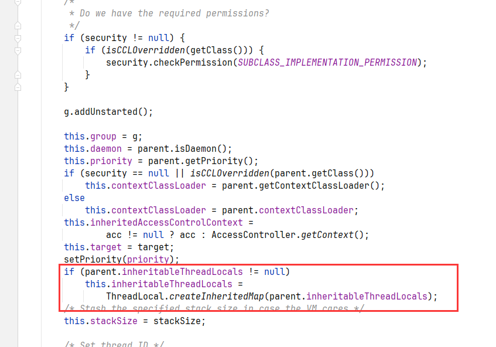

# ThreadLocal详解

### 一、相关参考文章

### 1、参考

#### 1.关于ThreadLocal相关内容

视频：

- https://www.bilibili.com/video/BV1SD4y1D7r2/?spm_id_from=333.1387.favlist.content.click&vd_source=6fd1666460d7e069201c2db8d906cbfe

- https://www.bilibili.com/video/BV1BsqHYdEun/?spm_id_from=333.1387.favlist.content.click&vd_source=6fd1666460d7e069201c2db8d906cbfe

文章：

ThreadLocal详解：

- 关于ThreadLocal的原理、操作实现、结构：https://blog.csdn.net/u010445301/article/details/111322569
- 内存泄露相关：https://blog.csdn.net/u010445301/article/details/124935802
- 子线程继承父线程上下文：https://blog.csdn.net/weixin_37862824/article/details/121177025


## 扩展

### 1、引用回收梳理

**场景**

创建了一个A对象，并赋值给引用a，即A a = new A（），A的ref a指向A对象，这是一个强引用，然后A中有一个成员变量B，并且在new A（）的时候也完成初始化，即B b = new B().当引用a出栈后，a对象会被回收吗，还有b对象会被回收吗。

**具体分析**

关于a对象的生命周期，`a` 是一个强引用，指向 `A` 对象。只要 `a` 引用存在，这个 `A` 对象就不会被垃圾回收，也就是说，当 `a` 仍然指向 `A` 对象时，这个 `A` 对象不会被回收。关于b对象的生命周期，`A` 类的成员变量 `b` 是一个引用类型，也就是 `B` 对象。在创建 `A` 对象时，`B` 对象也会被创建并赋值给 `A` 对象的成员变量 `b`。这个 `B` 对象被 `A` 的实例所引用，因此只要 `A` 对象存在，`B` 对象也不会被回收。如果你指的是 `a` 引用在方法栈帧中出栈（也就是 `a` 不再引用 `A` 对象），那么 `A` 对象的引用计数就会减少。此时，`A` 对象的回收依赖于是否有其他引用指向它，如果 `A` 对象没有被其他引用所持有（即没有任何强引用指向它），那么 `A` 对象会被垃圾回收。`b` 对象是 `A` 对象的成员变量，它是 `A` 对象的一部分。即使 `a` 引用出栈，`b` 只要被 `A` 对象所引用，`b` 也不会被回收，`b` 对象的回收依赖于 `A` 对象是否被回收。当 `A` 对象被回收时，`b` 对象也会被回收，因为 `b` 是 `A` 对象的一部分，且在 `A` 对象不再存在的情况下，`b` 的引用也就不存在了。

### 2、**关于ThreadLocal内存泄露**

ThreadLocal内存泄露的条件：

- 在完成ThreadLocal使用后，没有手动删除对应Thread中ThreadLocalMap中的Entry
- Thread保持运行，不能被回收

由于ThreadLocalMap 是 Thread 的一个属性，被当前线程所引用，所以ThreadLocalMap的生命周期跟 Thread 一样长。如果ThreadLocal ref被回收/出栈，ThreadLocal变量也被回收，但是此时Thread还没有被回收，那么当前线程的ThreadLocal变量副本指向的就是null, 也即entry(null,value),那这个entry对应的value永远无法访问到。因为实际在使用的时候，都是使用线程池，线程池中的线程都是复用的，不会存在被回收的情况出现（即Thread保持运行），因此这样就可能导致非常多的entry(null,value)出现，从而导致内存泄露。ThreadLocal内存泄露是因为Entry中key=null value=value这种存在导致的，如果直接在完成ThreadLocal使用后，手动去remove，就可以有效避免。
概括：**由于ThreadLocalMap 的生命周期跟 Thread 一样长，对于重复利用的线程来说，如果没有手动删除（remove()方法）对应 key 就会导致entry(null，value)的对象越来越多，从而导致内存泄漏**

### 3、ThreadLocal如何解决内存泄露

首先，key不能设置为强引用，因为这样如果ThreadLocal的引用出栈后，由于Tread没有回收，Entry中的key还是强引用这个ThreadLocal对象，所以其不会被回收。通过将key设置为弱引用后，如果ThreadLocal的引用出栈后，key就会指向null，在 ThreadLocalMap 中的set/getEntry 方法中，会对 key 为 null（也即是 ThreadLocal 为 null ）进行判断，如果为 null 的话，那么会把 value 置为 null 的．这就意味着使用threadLocal , CurrentThread 依然运行的前提下．就算忘记调用 remove 方法，弱引用比强引用可以多一层保障：弱引用的 ThreadLocal 会被回收．对应value在下一次 ThreadLocaI 调用 get()/set()/remove() 中的任一方法的时候会被清除，从而避免内存泄漏。
使用方法：

- 将ThreadLocal变量定义成private static的，这样的话ThreadLocal的生命周期就更长，由于一直存在ThreadLocal的强引用，所以ThreadLocal也就不会被回收，也就能保证任何时候都能根据ThreadLocal的弱引用访问到Entry的value值，然后remove它，防止内存泄露
- 每次使用完ThreadLocal，都调用它的remove()方法，清除数据。

### 4、关于ThreadLocal实现父子线程内容的传递

原始的，直接使用ThreadLocal，无法进行父子线程内容传递的示例：

```java
public class demoServiceImpl extends ServiceImpl<DemoMapper, Demo> implements demoService {

    private static ThreadLocal<String> threadLocal = new ThreadLocal<>();

    public static void main(String[] args) {
        // 设置父线程的ThreadLocal变量
        threadLocal.set("Parent Value");

        System.out.println("Main thread: " + threadLocal.get());

        // 创建并启动子线程
        Thread childThread = new Thread(() -> {
            String parentValue = threadLocal.get();
            threadLocal.set(parentValue);  // 将父线程的值设置到子线程中
            System.out.println("Child thread: " + threadLocal.get());
        });

        childThread.start();

        try {
            childThread.join();  // 等待子线程执行完成
        } catch (InterruptedException e) {
            e.printStackTrace();
        }

        // 结束时，父线程的值没有受到影响
        System.out.println("Main thread after child thread: " + threadLocal.get());
    }

}
```

结果：

```
Main thread: Parent Value
Child thread: null
Main thread after child thread: Parent Value
```

原因：Thread中的ThreadLocalMap是线程独有的，子线程正常情况下肯定是无法继承到父线程的线程信息的。

#### 4.1 方法一

手动传递父线程的 `ThreadLocal` 数据，通过ThreadLocal的withInitial方法

```java
public class demoServiceImpl extends ServiceImpl<DemoMapper, Demo> implements demoService {

    private static ThreadLocal<String> threadLocal = ThreadLocal.withInitial(() -> "Parent Value");

    public static void main(String[] args) {
        // 设置父线程的ThreadLocal变量
        threadLocal.set("Parent Value");

        System.out.println("Main thread: " + threadLocal.get());

        // 创建并启动子线程
        Thread childThread = new Thread(() -> {
            // 手动传递父线程的ThreadLocal值
            String parentValue = threadLocal.get();
            threadLocal.set(parentValue);  // 将父线程的值设置到子线程中

            System.out.println("Child thread: " + threadLocal.get());
        });

        childThread.start();

        try {
            childThread.join();  // 等待子线程执行完成
        } catch (InterruptedException e) {
            e.printStackTrace();
        }

        // 结束时，父线程的值没有受到影响
        System.out.println("Main thread after child thread: " + threadLocal.get());
    }

}
```

这里和上面的区别就是Thread初始化的时候，使用的是withInitial方法，其创建的是一个SuppliedThreadLocal方法

```java
public static <S> ThreadLocal<S> withInitial(Supplier<? extends S> supplier) {
    return new SuppliedThreadLocal<>(supplier);
}
```

当线程中调用threadLocal的get方法的时候，最后会调用setInitialValue方法

```java
public T get() {
    Thread t = Thread.currentThread();
    ThreadLocalMap map = getMap(t);
    if (map != null) {
        ThreadLocalMap.Entry e = map.getEntry(this);
        if (e != null) {
            @SuppressWarnings("unchecked")
            T result = (T)e.value;
            return result;
        }
    }
    return setInitialValue();
}
```

setInitialValue中，调用ThreadLocal实现类的initialValue方法

```java
private T setInitialValue() {
    T value = initialValue();
    Thread t = Thread.currentThread();
    ThreadLocalMap map = getMap(t);
    if (map != null)
        map.set(this, value);
    else
        createMap(t, value);
    return value;
}
```

可以看到SuppliedThreadLocal实现类的initialValue方法，就是执行对应的初始化方法，因此能够实现数据的传递

```java
static final class SuppliedThreadLocal<T> extends ThreadLocal<T> {

    private final Supplier<? extends T> supplier;

    SuppliedThreadLocal(Supplier<? extends T> supplier) {
        this.supplier = Objects.requireNonNull(supplier);
    }

    @Override
    protected T initialValue() {
        return supplier.get();
    }
}
```

但是其只支持通过在子线程中调用ThreadLocal的get方法，完成一个内容的传递，不支持Thread中整个ThreadLocalMap的传递。

#### 4.2 方法二：InheritableThreadLocal

Java 提供了一个特殊的 `ThreadLocal` 实现，叫做 `InheritableThreadLocal`，它允许父线程中的 `ThreadLocal` 变量值自动传递给子线程。

`InheritableThreadLocal` 继承自 `ThreadLocal`，它的特点是在创建子线程时，子线程能够自动继承父线程的 `ThreadLocal` 变量的值。

```java
public class demoServiceImpl extends ServiceImpl<DemoMapper, Demo> implements demoService {

    private static InheritableThreadLocal<String> inheritableThreadLocal = new InheritableThreadLocal<String>() {
        /*@Override
        protected String initialValue() {
            return "Parent Value";
        }*/
    };

    public static void main(String[] args) {
        // 设置父线程的InheritableThreadLocal变量
        inheritableThreadLocal.set("Parent Value");

        System.out.println("Main thread: " + inheritableThreadLocal.get());

        // 创建并启动子线程
        Thread childThread = new Thread(() -> {
            System.out.println("Child thread: " + inheritableThreadLocal.get());
        });

        childThread.start();

        try {
            childThread.join();  // 等待子线程执行完成
        } catch (InterruptedException e) {
            e.printStackTrace();
        }

        // 结束时，父线程的值没有受到影响
        System.out.println("Main thread after child thread: " + inheritableThreadLocal.get());
    }

}
```

输出：

```
Main thread: Parent Value
Child thread: Parent Value
Main thread after child thread: Parent Value
```

实现：

InheritableThreadLocal类**继承**了ThreadLocal类，重写了ThreadLocal的childValue（*childValue方法在复制父类的parent.inheritableThreadLocals时候会用到*）、getMap、createMap方法，用于维护Thread类中的inheritableThreadLocals变量。当我们创建一个线程的时候，由主线程来创建，那么主线程就一定会有threadLocals和inheritableThreadLocals，在创建子线程的时候，主线程会把自己的inheritableThreadLocals复制到子线程的inheritableThreadLocals，注意是复制了父线程的inheritableThreadLocals。

可以在Thread的构造器方法中，找到如下内容：



其中parent就是当前线程：Thread parent = currentThread();

具体的深拷贝实现（△）?没有吧，我看是直接返回的：

```java
private ThreadLocalMap(ThreadLocalMap parentMap) {
    Entry[] parentTable = parentMap.table;
    int len = parentTable.length;
    setThreshold(len);
    table = new Entry[len];

    for (int j = 0; j < len; j++) {
        Entry e = parentTable[j];
        if (e != null) {
            @SuppressWarnings("unchecked")
            ThreadLocal<Object> key = (ThreadLocal<Object>) e.get();
            if (key != null) {
                Object value = key.childValue(e.value);
                Entry c = new Entry(key, value);
                int h = key.threadLocalHashCode & (len - 1);
                while (table[h] != null)
                    h = nextIndex(h, len);
                table[h] = c;
                size++;
            }
        }
    }
}
```

inheritableThreadLocals存在问题&&&


#### 4.3 方法三：TransmittableThreadLocal

主要支持解决线程池中上下文的传递……

核心通过TtlRunnable类来实现，在线程执行方法前，将子线程中ThreadLocal中的数据通过父线程进行替换，然后在方法执行回去后，再将原来的值替换回去即可。


